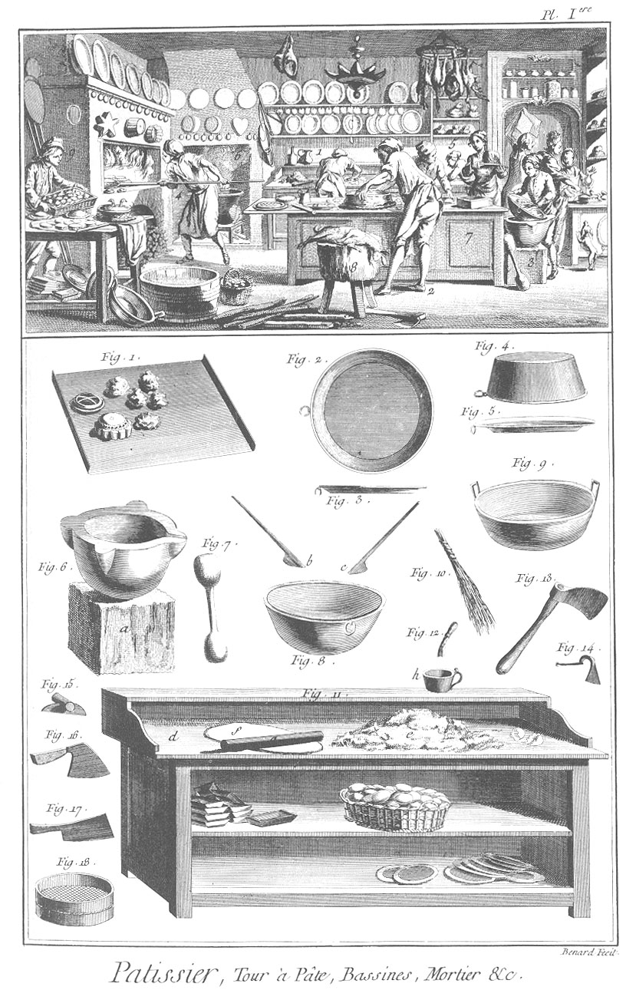
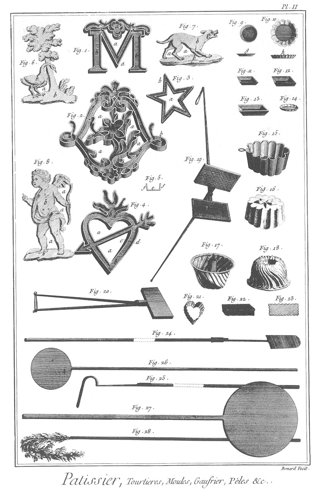

PATISSIER
=========

Contenant deux Planches.

PLANCHE Iere.
-------------

La vignette représente la boutique d'un pâtissier.

Fig.
1. Représente un homme qui pétrit.

2. Autre qui forme un pâté.

3. Jeune homme qui fouette des blancs d'oeufs pour les biscuits.

4. Homme qui enfourne.

5. Autres employés à des ouvrages de pâtisserie.

6. Cheminée où l'on voit une chaudiere sur le feu, servant à faire les échaudés & à d'autres usages.

7. Le coffre à farine dont la table est amovible & sert à former la pâtisserie.

8. Billot.

9. Ouvrier tenant une manne remplie d'échaudés.

Bas de la Planche.

Fig.
1. Plafond de tôle ou de cuivre sur lequel on pose les menues pâtisseries pour les mettre au four.

2. Tourtiere vue par-dedans.

3. Tourtiere vue de profil.

4. Couvercle de tourtiere vu en-dessus.

5. Tourtiere.

6. Mortier de marbre blanc. a, le billot du mortier.

7. Pilon de buis.

8. Bassine de cuivre pour battre les blancs d'oeufs & les amalgamer avec la pâte dont on fait le biscuit. b c, spatule pour amalgamer la pâte des biscuits avec les blancs d'oeufs.

9. Poële à confitures.

10. Verge pour fouetter les blancs d'oeufs.

11. Tour à pâte sur lequel on pétrit. d, la table. e, tas de farine. f, morceau de pâte sur lequel le rouleau a passé. g, rouleau de buis. h, pot d'étain nommé mouilloir.

12. Petit pinceau nommé doroir.

13. Hache pour fendre le bois.

14. Gratte-pâte.

15. Ratissoire pour nettoyer la table du tour à pâte.

16. Hachoir pour hacher les viandes qu'on emploie dans les pâtisseries.

17. Couperet.

18. Tamis pour passer les jus & coulis.

PLANCHE II. Tourtieres, Moules, Gauffrier, Pelles, &c.
------------------------------------------------------

Fig.
1. &
2. &
3. &
4. sont des moules de fer-blanc pour exécuter des pieces en pâte de gâteau d'amande, ou en pâte de biscuit ; les parties
	- a a a a, &c. indiquent les cellules ou canaux du moule dans lesquels on coule la pâte préparée. Ces cellules ont un fond & deux rebords ; c'est dans ces moules que les pieces qu'on y a coulées se mettent cuire au four.

5. Le profil ou coupe transversale d'un des canaux du moule, prise sur la ligne
	- c, d, de la figure 4.
	- e, le fond.
	- f, f, ses rebords. C'est toujours le fond e qui donne à l'objet qui en sort la figure la plus conforme à la chose qu'on a voulu représenter.

6. &
7. &
8. Sont des pieces de gâteau d'amande ou de pâte de biscuit qu'on a représentées sorties de leur moule ; les parties
	- a, a, a, a, &c. sont vuides, & les parties
	- b, b, b, &c. sont les objets en pâte qui étoient contenus dans les cellules ou canaux du moule.

Les pâtissiers qui sont assortis ont des moules variés à l'infini, ils peuvent exécuter des arbres, des animaux, des figures, des bâtimens, &c. mais comme la difficulté de bien rendre tous ces objets dépend de la perfection du moule & de l'art du ferblantier qui les fait, il arrive toujours que la connoissance du dessein & de l'architecture étant fort rarement du ressort de la ferblanterie, que ces moules sont de mauvais goût & de mauvaises proportions, & les figures qui en sortent ridiculement dessinées ; ce que les pâtissiers exécutent le mieux dans ce genre sont les lettres initiales d'un nom, comme un M, une F, une L, &c. des coeurs & des étoiles ; ainsi on s'est contenté en donnant les fig. 6. 7. & 8. d'indiquer ce que l'on pourroit faire dans les différens genres avec de bons moules.

9. Petite tourtiere pour les pâtés au jus.
	- g, son profil.

10. Tourtiere ronde goudronnée.
	- h, son profil.

11. &
12. &
13. &
14. Moules à biscuits de différens prix ; c'est dans ces moules que les biscuits se mettent au four.

15. Moule de fer-blanc nommé bastion, pour exécuter une piece en pâte de gâteau d amande, ou en pâte de biscuit.

16. Le bastion sorti de son moule.

17. Moule de bonnet de Turc.

18. Bonnet de Turc sorti du moule, fait en pâte de biscuit ou en gâteau d'amande.

19. Gaufrier ouvert.

20. Gaufrier fermé.

21. Coupe-pâte de fer-blanc, en forme de coeur.

22. Autre coupe-pâte de fer-blanc.

23. Le même vu en-dessus.

24. Pelle à enfourner les menues pâtisseries ; le manche est de bois & la pelle de fer.

25. Fourgon ; c'est un crochet de fer qui sert à ranger le feu dans le four ; le manche est de bois.

26. &
27. Pelles de bois de différentes grandeurs, pour enfourner les pains à bénir.

28. Ecouvillon ; c'est une espece d'assemblage de vieilles cordes effilées & de vieux chiffons, emmanchés au bout d'un bâton, servant à nettoyer le four.

[->](../15-Paumier/Légende.md)
