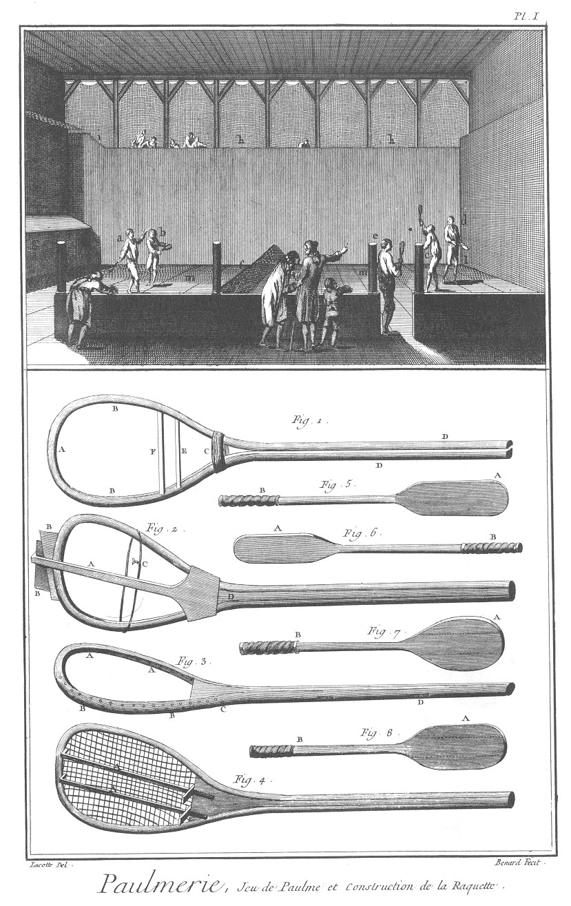
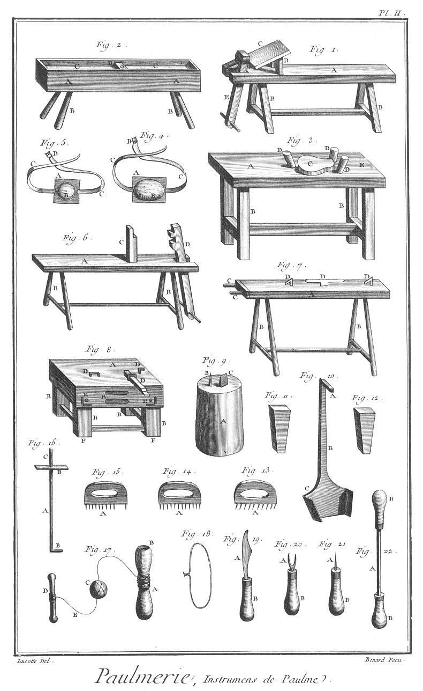
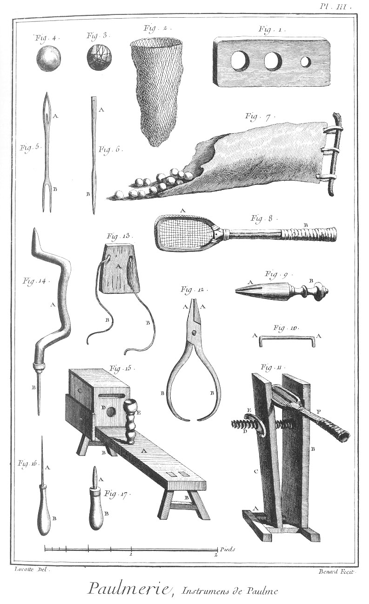
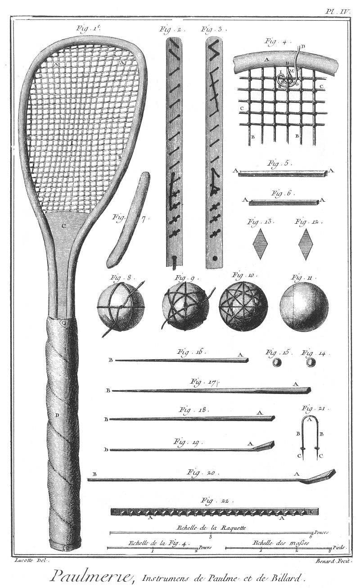
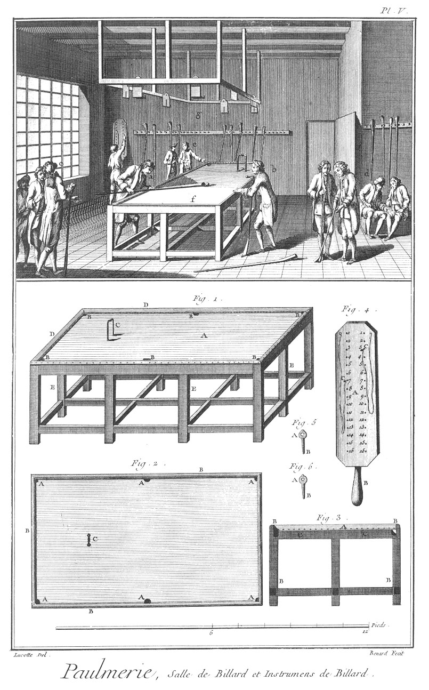
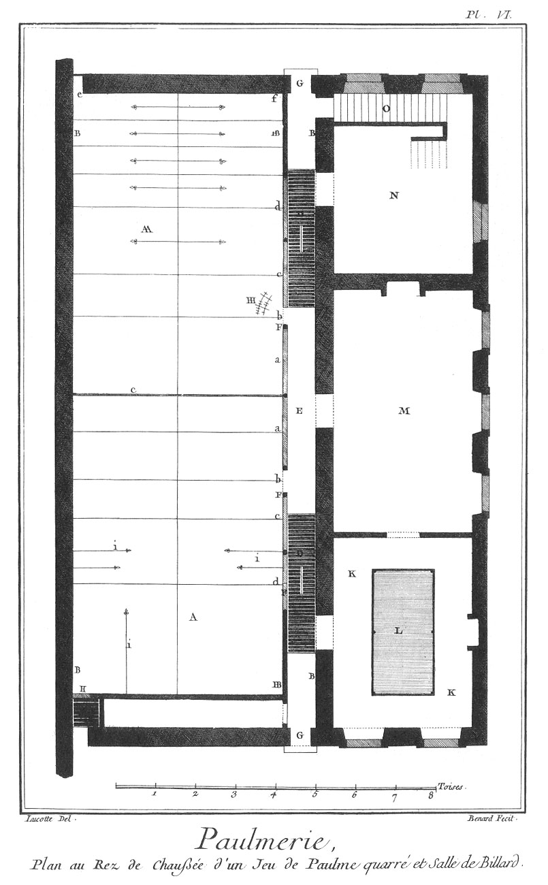
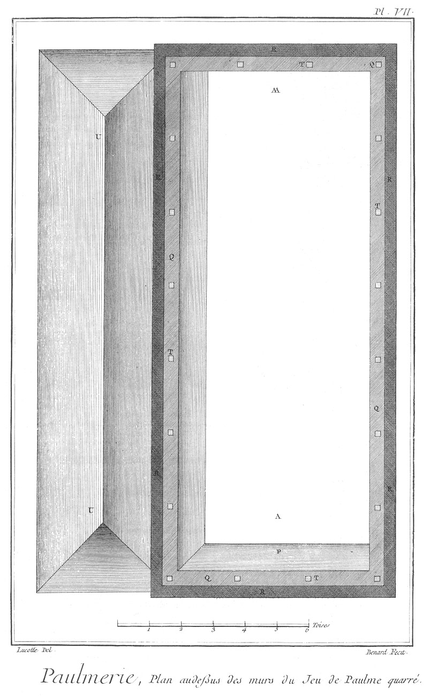
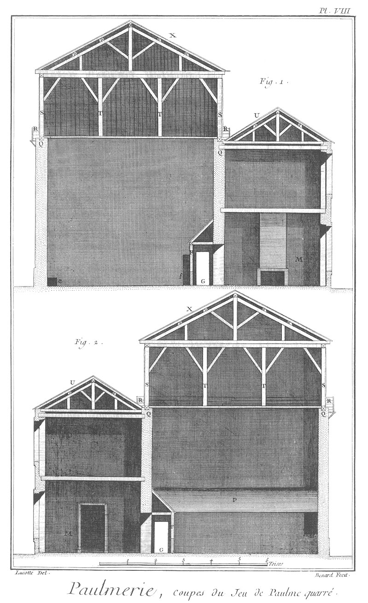
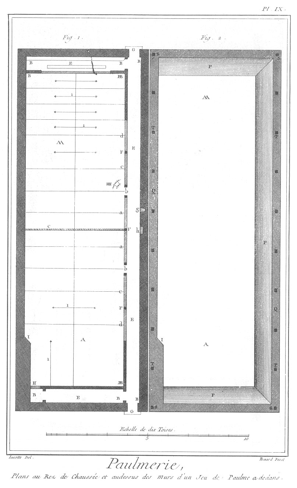

PAUMIER
=======

Contenant neuf Planches.

PLANCHE Iere.
-------------

Le haut de cette Planche représente un jeu de paume où plusieurs particuliers en

- a, b, c & d sont occupés au jeu, tandis que le garçon de paume ou marqueur en
- e, marque le jeu, ramasse les balles, &c.
- f représente la corde du jeu,
- g la galerie d'en-bas,
- h h la galerie d'en-haut,
- i la joue d'en-haut,
- k la grille,
- l le trou,
- m m les carreaux.

Fig.
1. Echalas disposé pour une raquette.
	- A, la tête.
	- B B, les jambes.
	- C, le colet ficelé.
	- D D, les bouts faisant le manche.
	- E, le cabillet de bois.
	- F, le cabillet de fer.

2. Raquette étançonnée & tournée.
	- A, la chevrette.
	- B B, les coins.
	- C, la bride.
	- D, l'étançon.

3. Raquette vue de côté.
	- A A, les trous intérieurs.
	- B B, les trous extérieurs.
	- C, la tête du clou du collet.
	- D D, les queues rivées.

4. Raquette cordée de montans & de traverses roidies par deux billards A A.

5. Triquet.
	- A, la tête
	- B, le manche.

6. Demi-triquet.
	- A, la tête.
	- B, le manche.

7. Battoir.
	- A, la tête.
	- B, le manche ; les lignes ponctuées désignent les trois pieces qui le composent.

8. Demi-battoir.
	- A, la tête.
	- B, le manche.

PLANCHE II.
-----------

Fig.
1. Chevalet à placer les échalas.
	- A, le siége.
	- B B, les piés.
	- C, la planchette.
	- D D, les jambes de la planchette
	- E, la piece mobile.

2. Chaudiere.
	- A A, la chaudiere.
	- B B, les piés.
	- C C, les échalas.
	- D, la pierre à charger les échalas.

3. Moule à raquette.
	- A, la table.
	- B B, les piés.
	- C, le moule à raquette.
	- D D D, les tampons.
	- E, la cheville de fer.

4. Poitriniere de liége.
	- A, la plaque.
	- B, le liége.
	- C, la ceinture.
	- D, la boucle.

5. Poitriniere de buis.
	- A, la plaque.
	- B, le buis.
	- C, la ceinture.
	- D, la boucle.

6. Chevalet à étançonner.
	- A, le siége.
	- B B, les piés.
	- C, le point d'appui.
	- D, la piece mobile.

7. Banc à dresser.
	- A, la plate-forme.
	- B B, les piés.
	- C C, les broches.
	- D D D, les crampons & crochets de fer.

8. Billot à planer.
	- A, la table.
	- B B, &c. les piés.
	- D D, pieces, crampons & crochets de fer.
	- E E, &c. différentes mortoises & enfoncemens.
	- F F, pattes pour arrêter le billot.

9. Billot aux cloux.
	- A, le billot.
	- B, la broche à courber les cloux.
	- C, le tranchet à couper.

10. Chevrette.
	- A, le crochet.
	- B, la tige.
	- C, la queue d'aronde évasée.

11. &
12. Coins de la chevrette.

13. &
14. &
15. Compas à tracer les trous sur la raquette.
	- A A A, les pointes.

16. Billard.
	- A, la tige.
	- B, le crochet.
	- C, la vis.
	- D, l'écrou.

17. 
	- A, la boîte à balle.
	- B B, partie concave pour frapper la balle.
	- C, la balle ficelée prête à être frappée.
	- D, le bilboquet.
	- E, partie de la ficelle.

18. Bride.

19. Tranchet courbe.
	- A, la lame.
	- B, le manche.

20. Poinçon double pour arranger les mailles de la raquette cordée.
	- A, le fer à fourche.
	- B, le manche.

21. Poinçon simple, rond & poli, pour doucir les trous.
	- A, le poinçon.
	- B, le manche.

22. Grattoir, espece de lame d'épée emmanchée.
	- A, la lame.
	- B B, les manches.

PLANCHE III.
------------

Fig.
1. Lunette pour déterminer la grosseur des balles.

2. Filet de recette.

3. Balle découverte.

4. Balle couverte.

5. Aiguille à fourche.
	- A, la tête.
	- B, la fourche.

6. Aiguille à filet.
	- A, la tête.
	- B, la pointe.

7. Blanchissoir pour les balles.

8. Raquette.
	- A, le chassis.
	- B, le manche.

9. Poinçon pour les raquettes.
	- A, la noix.
	- B, le manche.

10. Crampon de fer pour les raquettes.
	- A A, les coudes.

11. Tenailles pour les raquettes.
	- A, le chassis d'en bas.
	- B, le mors immobile.
	- C, le mors mobile ou à charniere.
	- D, la vis.
	- E, l'écrou.
	- F, la raquette.

12. Pinces.
	- A A, les mors.
	- B B, les branches.

13. Plaque.
	- A, la plaque.
	- B B, les courroies.

14. Villebrequin.
	- A, le villebrequin.
	- B, le perçoir ou la meche.

15. Chevre à fabriquer les balles.
	- A, le banc.
	- B B, les piés.
	- C, la boîte.
	- D, le trou de jauge.
	- E, le bilboquet.

16. Poinçon délié.
	- A, le fer.
	- B, le manche.

17. Poinçon gros.
	- A, le fer.
	- B, le manche.

PLANCHE IV.
-----------

Fig.
1. Raquette cordée.
	- A A, les dix-huit montans.
	- B B, les trente-trois traverses.
	- C, l'étançon nervé & recouvert de parchemin.
	- D, le manche couvert de peau blanche.

2. &
3. Parties latérales de la raquette cordée.

4. Portion de la raquette avec son noeud développé.
	- A, partie de la tête.
	- B B, les montans.
	- C C, les traverses.
	- D, le noeud développé.
	- E, le trou d'un des montans.
	- F, premier passage de la corde.
	- G, deuxieme passage.
	- H, troisieme passage.
	- I, quatrieme passage.
	- K, cinquieme passage.
	- L, sixieme passage.
	- M, septieme passage.

5. Cabillet de bois.
	- A A, les échancrures.

6. Cabillet de fer.
	- A A, les échancrures.

7. Lissette à passer sur l'étançon.

8. Balle, premier ficelage, trois tours & un noeud.

9. La même balle, second ficelage, sept tours & un noeud.

10. La même balle, troisieme ficelage, six tours & un noeud.

11. La même balle à trois ficelages, composés de seize tours & trois noeuds, recouverte de drap blanc.

12. &
13. Pieces de drap servant à couvrir la balle.

14. &
15. Billes d'ivoire à l'usage du billard.

16. Petite queue.
	- A, la tête.
	- B, la queue.

17. Grande queue.
	- A, la tête.
	- B, la queue.

18. Grosse masse.
	- A, la masse.
	- B, la queue.

19. Petite masse.
	- A, la masse.
	- B, la queue.

20. Grande masse.
	- A, la masse.
	- B, la queue.

21. Fer de billard.
	- A, la tête.
	- B B, les branches.
	- C C, les pointes.

22. Ratelier à déposer les masses.
	- A A, les chevilles.

PLANCHE V.
----------

Le haut de la Planche représente une salle de billard, où plusieurs personnes sont occupées au jeu, l'une en
	- a à pousser la bille ; une autre en
	- B, à attendre son tour, tandis que d'autres en
	- c, en d, & en e font conversation.
	- f, est la table de billard ;
	- g g, un chassis au-dessus, destiné à supporter les plaques, à contenir les lumieres pendant la nuit.

Fig.
1. Elévation perspective de la table de billard.
	- A, le dessus.
	- B B, &c. les blouses.
	- C, le fer.
	- D D, &c. les bords.
	- E E, &c. les piés.

2. Plan du dessus de la table.
	- A A, &c. les blouses.
	- B B, les bords.
	- C, le fer.

3. Coupe de la table de billard.
	- A, le dessus.
	- B B, les bords.
	- C C, les chassis.
	- D D, les piés.

4. Palette à marquer.
	- A, la palette.
	- B, le manche.
	- C C, les chevilles à marquer.

5. &
6. Chevilles à marquer.
	- A A, les têtes.
	- B B, les pointes.

PLANCHE VI.
-----------

Plan au rez-de-chaussée d'un jeu de paume quarré & ses dépendances.

PLANCHE VII.
------------

Plan au-dessus des murs du même jeu de paume quarré.

PLANCHE VIII.
-------------

Coupes transversales du même jeu de paume quarré.

Fig.
1. Vue intérieure du côté du fond du jeu.

2. Vue intérieure du côté de vers le jeu.

PLANCHE IX.
-----------

Fig.
1. Plan au rez-de-chaussée d'un jeu de paume à dedans.

2. Plan au-dessus des murs du même jeu de paume à dedans. Renvois des Planches VI. VII. VIII. & IX.
	- A, devers le jeu.
	- A A, fond de jeu.
	- B B, &c. joues des murs.
	- BB BB, &c. joues des galeries d'en-bas.
	- C, corde.
	- D D, &c. grillage.
	- E E, &c. galeries d'en-bas.
	- F F, &c. poteaux des galeries d'en-bas.
	- H H, marques du jeu.
	- H, grille.
	- I, tambour du jeu à dedans.
	- K K, salle de billard.
	- L, table de billard.
	- M, salle de jeu.
	- N, magasin des balles, raquettes & autres ustensiles.
	- O, escalier pour monter au premier.
	- P P, &c. toît des galeries.
	- Q Q, &c. dessus des murs du jeu.
	- R R, &c. auges ou galeries du haut en dehors.
	- S S, &c. poteaux corniers.
	- T T, poteaux du comble.
	- U U, comble au-dessus de la table de billard.
	- X X, comble du jeu de paume.
	- a a, le premier ouvert & sa raie.
	- b b, la porte & sa raie.
	- c c, le second ouvert & sa raie.
	- d d, le dernier ouvert & sa raie.
	- e, petit trou.
	- f, ais.
	- g, crédence pour les rafraîchissemens.
	- h, conduit des eaux sales.
	- i i, &c. autres raies pour marquer le jeu.

[->](../16-Perruquier,_Babier,_Baigneur-Etuviste/Légende.md)
