PERRUQUIER, BARBIER, BAIGNEUR-ETUVISTE.
=======================================

Contenant douze Planches, équivalentes à quinze à cause de trois Planches doubles.

PLANCHE Iere.
-------------

[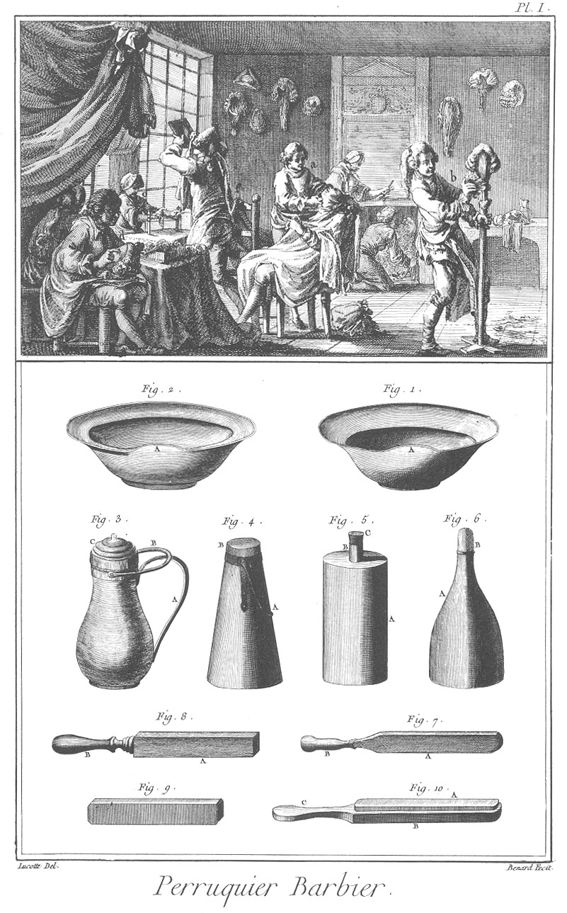](Planche_01.jpeg)

Le haut de cette Planche représente un attelier ou boutique de perruquier où plusieurs garçons sont occupés à divers ouvrages de cet art ; un en

- a, à faire la barbe ; un en
- b, à accommoder une perruque ; une femme en
- c, à tresser ; deux ouvriers en
- d, à monter des perruques ; un autre en
- e, à faire chauffer les fers à friser, tandis qu'un particulier en
- f ôte la poudre de dessus son visage.

Bas de la Planche.

Fig.
1. Bassin à barbe d'étain ou de fayance.
	- A, l'échancrure qui reçoit le menton lorsque l'on rase.

2. Bassin à barbe d'argent ou argenté.
	- A, l'échancrure.

3. Coquemard à faire chauffer l'eau.
	- A, le manche.
	- B, l'anse.
	- C, le couvercle.

4. Bouilloire.
	- A, l'anse.
	- B, le bouchon ou couvercle.

5. Bouteille de fer blanc à porter de l'eau en ville, lorsque l'on y va raser.
	- A, la bouteille.
	- B, le gouleau.
	- C, le bouchon.

6. Autre bouteille de fer-blanc destinée au même usage.
	- A, la bouteille.
	- B, le bouchon.

7. Cuir à deux faces à repasser les rasoirs.
	- A, le cuir.
	- B, le manche.

8. Cuir à quatre faces à repasser les rasoirs. Ces faces sont préparées de maniere à affiler les rasoirs de plus en plus fin.
	- A, le cuir.
	- B, le manche.

9. Pierre à repasser les rasoirs.

10. Pierre enchâssée à repasser les rasoirs.
	- A, la pierre.
	- B, le chassis.
	- C, le manche.

PLANCHE II.
-----------

[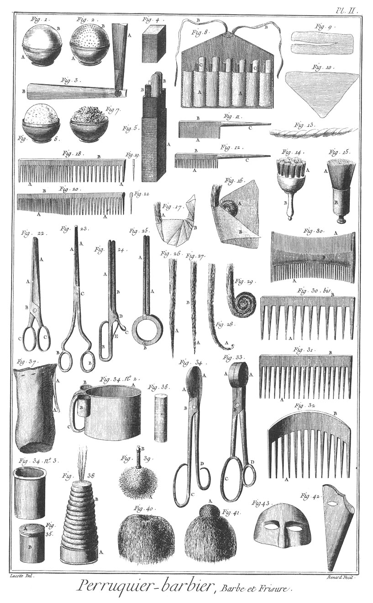](Planche_02.jpeg)

Fig.
1. Boîte à savonnette.
	- A, la boîte.
	- B, le couvercle.

2.
	- A, la boîte.
	- B, la savonnette.

3. Rasoir.
	- A, la lame.
	- B, le manche.

4. Couvercle de l'étui à rasoirs.

5. Etui à rasoirs.
	- A, l'étui.
	- B B, les rasoirs.

6. &
7. Savon & éponge dans leurs boîtes.

8. Poche à rasoir.
	- A, la poche.
	- B B, les cordons.
	- C C, les rasoirs.

9. &
10. Papillotte ordinaire & à crêpe.

11. &
12. Peignes à retaper à queue.
	- A A, les dents.
	- B B, les dos.
	- C C, les queues.

13. Papillotte tortillée sur laquelle on roule les cheveux.

14. &
15. Petites brosses à nettoyer les peignes.
	- A A, les brosses.
	- B B, les manches.

16. Pincée de cheveux à demi en papillotte.
	- A, les cheveux.
	- B, la papillotte.

17. La même mise en papillotte.
	- A, la pincée.
	- B, la papillotte faite.

18. &
19. Elévation & coupe d'un peigne à retaper à deux fins & à dos plat.
	- A A, les dents.
	- B, le dos plat.

20. &
21. Elévation & coupe d'un peigne à retaper & à deux fins & à dos rond.
	- A A, les dents.
	- B, le dos rond.

22. Ciseaux sans pointe à tailler les cheveux.
	- A A, les branches.
	- B, la charniere.
	- C C, les anneaux.

23. Fer à friser le toupet, dit fer à toupet.
	- A A, les branches.
	- B B, les anneaux.
	- C, la charniere.

24. Compas à pistolet à rouler les cheveux.
	- A A, les jambes.
	- B, la poignée.
	- C, le poucier.
	- D, la charniere.
	- E, le ressort.

25. Autre compas à charniere à rouler les cheveux.
	- A A, les jambes.
	- B, la charniere.

26. Pincée de cheveux prête à être frisée.
	- A, la pointe.

27. La même tortillée lorsque l'on veut y mettre des papillottes fendues.
	- A, la pointe.
	- B, le tortillé.

28. La même pincée par la pointe.
	- A, la pointe pincée.

29. La même frisée.

30. Peigne à déméler d'ivoire à deux fins.
	- A A, les dents.
	- B, le dos.

30. bis &
31. Déméloirs.
	- A A, les dents.
	- B B, les dos.

32. Peigne ceintré de chignon.
	- A, les dents.
	- B, le dos ceintré.

33. Fer à passer les papillottes, dit fer à friser.
	- A A, les mords.
	- B, la charniere.
	- C, la poignée.
	- D, le poucier.

34.
	- Autre fer à passer.
		- A A, les mords.
		- B, la charniere.
		- C, la poignée.
		- D, le poucier.

	- n°. 2. Boîte à poudre.
		- A, la boîte à poudre.
		- B B, les boîtes à pommade liquide & forte
		- C, l'anse.

	- n°. 3. Pot à pommade liquide.

35. Boîte à pommade liquide.
	- A, le couvercle.
	- B, la boîte.

36. Bâton de pommade forte.

37. Sac à poudre pour porter en ville.
	- A A, les cordons.

38. Poudroir à soufflet.
	- A, la boîte.
	- B, le soufflet.

39. Houppe de cigne pour la toilette des femmes.
	- A, la houppe.
	- B, le manche.

40. Houppe sans tête.

41. Houppe à tête.
	- A, la tête.

42. Cornet à placer sur le visage lorsque l'on poudre.

43. Masque destiné au même usage.

PLANCHE III.
------------

[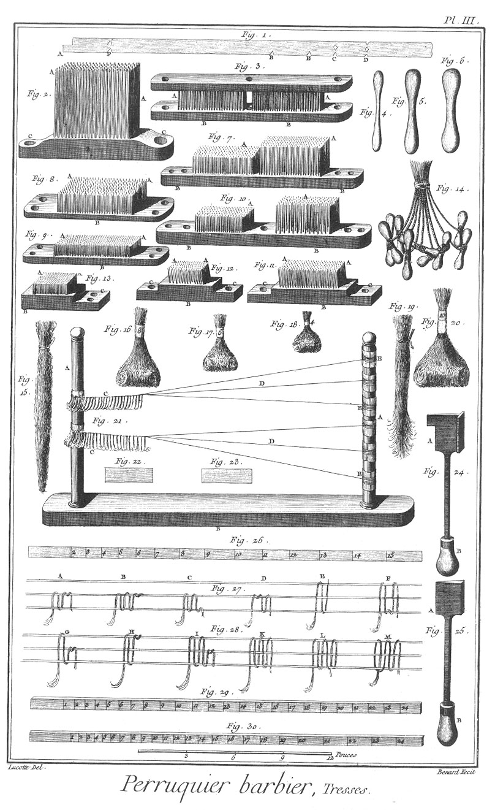](Planche_03.jpeg)

Fig.
1. Mesure de perruque.
	- A B, premiere mesure du haut du front à la nuque du cou.
	- A C, seconde mesure d'une tempe à l'autre passant par derriere la tête.
	- A D, troisieme mesure d'une oreille à l'autre, passant par le sommet de la tête, plus haut pour les perruques à oreilles, & plus bas pour les perruques pleines.
	- A E, quatrieme mesure du milieu d'une joue au milieu de l'autre, passans par derriere la tête.
	- A F, cinquieme & derniere mesure du milieu du haut du front jusqu'à l'une des tempes.

2. Carde ou peigne de fer.
	- A A, les dents.
	- B, la plaque.
	- C C, les pattes.

3. Cardes à tirer à plat ; elles sont doubles & posées deux l'une sur l'autre.
	- A A, les pointes.
	- B B, les plaques.

4. &
5. &
6. Bilboquets ; on se sert d'un plus grand nombre, & ils sont de différentes grosseurs. Leur usage est pour rouler les cheveux.

7. Cardes à dégager.
	- A A, les pointes.
	- B B, la plaque.

8. Cardes ou gros serran.
	- A A, les pointes.
	- B, la plaque.

9. Cardes ou serran fin.
	- A A, les pointes.
	- B, la plaque.

10. Cardes à préparer.
	- A A, les pointes.
	- B B, la plaque.

11. &
12. Cardes à pointes semblables à celles des cardes à matelas.
	- A A, les pointes.
	- B B, les plaques.
	- C C, &c. les pattes.

13. Cardes fines.
	- A A, les pointes.
	- B, la plaque.
	- C, la patte.

14. Paquets de cheveux montés sur des bilboquets.

15. Paquets de cheveux effilés.

16. &
17. &
18. &
20. Cheveux étiquetés & numérotés de différentes grandeurs.

19. Paquet de cheveux prêts à être effilés.

21. Métier à tresse.
	- A A, les bâtons.
	- B, le pié.
	- C C, les cheveux tressés.
	- D D, les fils tendus.
	- E E, cartes autour desquelles sont roulés les fils.

22. &
23. Cartes à rouler les fils.

24. &
25. Differens fers à passer les cheveux des perruques.
	- A A, les fers.
	- B B, les manches.

26. Mesure de tournant.

27. &
28. Développement de différentes tresses.
	- A, B & C, figure de l'M simple de plusieurs sortes sur deux soies.
	- D, figure de l'M doublée sur deux soies.
	- E, figure de l'N simple sur trois soies.
	- F, figure de l'M simple.
	- G, figure de la demie N.
	- H, figure de l'M à simple tour.
	- I, figure de l'M & demie.
	- K, figure de l'M redoublée.
	- L, figure de la derniere passée d'arrêt.
	- M, figure de la premiere passée d'arrêt.

29. &
30. Regles à étages.

PLANCHE IV.
-----------

[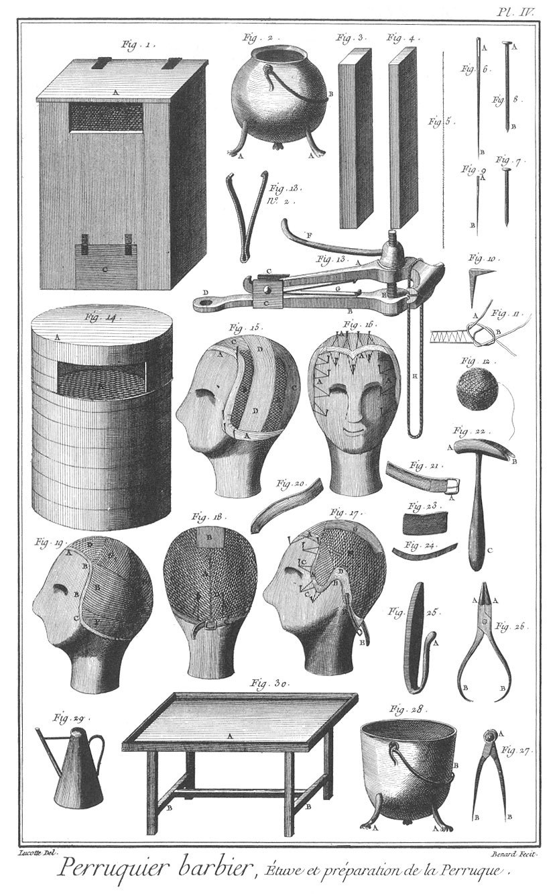](Planche_04.jpeg)

Fig.
1. Etuve de menuiserie à faire sécher les cheveux.
	- A, le couvercle.
	- B, la grille intérieure.
	- C, la porte pour le passage d'un réchaud de feu.

2. Marmite à faire bouillir les cheveux.

3. &
4. Coins dont on se sert pour les têtes à perruque brisée.

5. Cheveux. Maniere de distinguer le côté de la pointe de celui de la tête lorsqu'on l'a perdu ; c'est en le serrant dans les deux doigts & le faisant glisser, ce qui fait approcher la pointe, étant composé d'une infinité de petites branches déliées & pointues adhérantes au tronc.

6. &
7. Aiguilles à coudre la perruque.
	- A A, les têtes.

8. &
9. Pointes pour arrêter les fils ou rubans.
	- A A, les têtes.

10. Autre pointe ou clou à crochet.

11. Noeud à reprendre les fils des tresses lorsqu'ils se cassent.
	- A, le fil dont le bout est cassé.
	- B, le fil portant l'anneau.

12. Pelotte de fil.

13. 
	- Etau.
		- A, le mord mobile.
		- B, le mord immobile.
		- C C, les jumelles.
		- D, la patte.
		- E, la vis.
		- F, la manivelle à écrou.
		- G, le ressort.
		- H, la corde à serrer l'écrou.

	- n°. 2. Ressort double de l'étau.

14. Etuve de boissellerie.
	- A, le couvercle.
	- B, la grille intérieure.

15. Monture pleine préparée.
	- A A, le ruban à monter arrêté de pointe.
	- B B, le réseau.
	- C C, le ruban à couvrir.
	- D D, le ruban croisé.

16. La même vue en face.
	- A A, &c. les fils arrêtés aux pointes.

17. Monture à oreille.
	- A A, le ruban.
	- B, l'échancrure.
	- C C, les fils.
	- D, le bougran d'oreille.
	- E E, la jarretiere.
	- F, le réseau.
	- G, le bougran de plaque.

18. Monture pleine vue par derriere.
	- A, le réseau.
	- B, le bougran de plaque.
	- C, la jarretiere à boucle.
	- D D, les fils.

19. Monture pleine pour une tête plate.
	- A, le bord de front.
	- B B, les petits tournans.
	- C C, les grands tournans.
	- D, le dessus de tête.
	- E E, les petits corps de rangs.
	- F F, les grands corps de rangs.
	- G G, la plaque.

20. &
21. Jarretieres.
	- A, la boucle.

22. Marteau.
	- A, la tête.
	- B, la panne à pié de biche.
	- C, le manche.

23. Plaque de plomb pour les oreilles.

24. Ressorts de tempes.

25. Fer à passer les perruques.

26. Pinces.
	- A A, les mords.
	- B B, les branches.

27. Compas.
	- A, la tête.
	- B B, les jambes.

28. Marmite ou chaudiere.
	- A A, les piés.
	- B, l'anse.

29. Huilier.

30. Table à travailler.
	- A, la table.
	- B B, les piés.

PLANCHE V.
----------

Fig.
1. Corps de rangs de la perruque en bonnet.
	- A B, les petits corps de rangs.
	- B C, les grands.
	- C D, les tournans.

2. Corps de rangs de la perruque nouée.
	- A B, les petits corps de rangs.
	- B C, les grands.
	- C D, les tournans.

3. Corps de rangs de la perruque quarrée.
	- A B, les petits corps de rangs.
	- B C, les grands.
	- C D, les tournans.

4. Corps de rangs de la perruque à la brigadiere.
	- A B, les petits corps de rangs.
	- B C, les grands.
	- C D, les tournans.

5. Corps de rangs de la perruque d'abbé.
	- A B, les petits corps de rangs.
	- B C, les grands.
	- C D, les tournans.

6. Corps de rangs de la perruque en bourse.
	- A B, les petits corps de rangs.
	- B C, les grands.
	- C D, les tournans.

7. Corps de rangs de la perruque nouée à oreille.
	- A B, les petits corps de rangs.
	- B C, les grands.
	- C D, les tournans.

8. Corps de rangs de la perruque quarrée à oreille.
	- A B, les petits corps de rangs.
	- B C, les grands.
	- C D, les tournans.

9. Petits tournans.

10. Corps de rangs de la perruque en bonnet à oreille.
	- A B, les petits corps de rangs.
	- B C, les grands.
	- C D, les tournans.

11. Corps de rangs de la perruque d'abbé à oreille.
	- A B, les petits corps de rangs.
	- B C, les grands.
	- C D, les tournans.

12. Corps de rangs de la perruque naturelle à oreille.
	- A B, les petits corps de rangs.
	- B C, les grands.
	- C D, les tournans.

13. Tours de perruque naissante.

14. Corps de rangs de la perruque à deux queues.
	- A B, les petits corps de rangs.
	- B C, les grands.
	- C D, les tournans.

PLANCHE VI.
-----------

[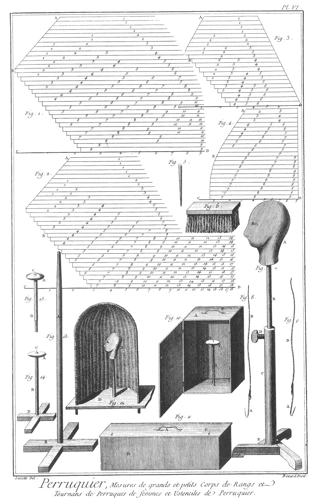](Planche_06.jpeg)

Fig.
1. Corps de rangs de perruques de femmes, chignons frisés.
	- A B, les petits corps de rangs.
	- B C, les grands.
	- C D, les tournans.

2. Corps de rangs de chignon relevé.
	- A B, les petits corps de rangs.
	- B C, les grands.
	- C D, les tournans.

3. Corps de rangs de tour de face.
	- A B, les petits corps de rangs.
	- B C, les grands.
	- C D, les tournans.

4. Corps de rangs de bonnet de cheveux.
	- A B, les petits corps de rangs.
	- B C, les grands.
	- C D, les tournans.

5. Pointe à retenir les perruques sur les têtes pendant l'accommodage.

6. Vergette de chiendent.

7. Tête à perruque mobile.
	- A, la tête.
	- B, la tige.
	- C, le canon dans lequel monte & descend la tige pour la placer à la hauteur que l'on desire.
	- D, vis à fixer la tige.
	- E, le pié à trois branches plus solide que les croisés.

8. &
9. Crochets à retenir les perruques sur les têtes pendant les accommodages.
	- A A, les crochets
	- B B, les cordons qui se nouent sous le nez de la tête.

10. Boîte à perruque pour porter en ville.
	- A, la boîte.
	- B, le couvercle.
	- C, le champignon sur lequel on pose la perruque.
	- D, la tige du champignon.
	- E, la pointe pour retenir la perruque.
	- F, la poignée.

11. Autre boîte à perruque.
	- A, la poignée.
	- B, la boite.
	- C, le couvercle.

12. Poudrier fait pour poudrer les perruques, afin que la poudre ne se répande point dans la piece.
	- A, le poudrier d'osier.
	- B, la tête à perruque qu'il contient.
	- C, le pié de la tête.
	- D, portion de la table sur laquelle le tout est posé.

13. Autre pié à porter la tête à perruque.
	- A, la tige.
	- B, le pié croisé.

14. Champignon à pié.
	- A, le champignon.
	- B, la tige.
	- C, la pointe.
	- D, le pié croisé.

15. Champignon simple à porter les perruques.
	- A, le champignon.
	- B, la tige.
	- C, la pointe.

PLANCHE VII.
------------

[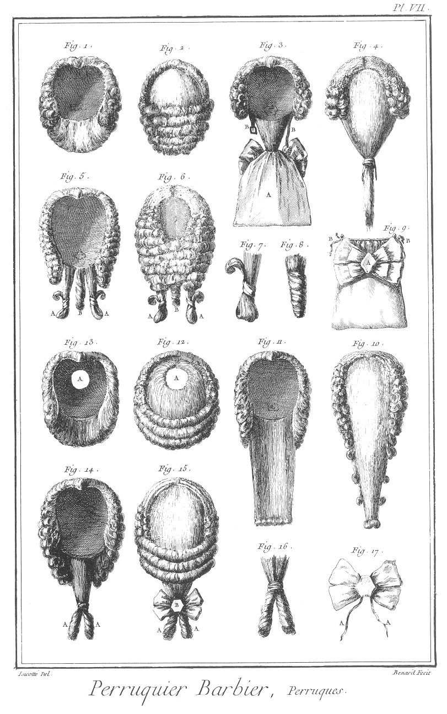](Planche_07.jpeg)

Fig.
1. &
2. Intérieur & extérieur d'une perruque en bonnet.

3. &
4. Intérieur & extérieur d'une perruque à bourse.
	- A, la bourse.
	- B B, les jarretieres.

5. &
6. Intérieur & extérieur d'une perruque à noeuds.
	- A A, les noeuds.
	- B, le boudin.

7. Noeud de la même perruque.

8. Boudin de la même perruque.

9. Bourse.
	- A, la rosette.
	- B B, les cordons.

10. &
11. Extérieur & intérieur de la perruque naissante.

12. &
13. Extérieur & intérieur de la perruque d'abbé.
	- A A, la tonsure.

14. &
15. Intérieur & extérieur de la perruque à la brigadiere.
	- A A, les boudins.
	- B, la rosette.

16. Boudins de la même perruque.

17. Rosette de la même perruque.
	- A A, les cordons.

PLANCHE VIII.
-------------

[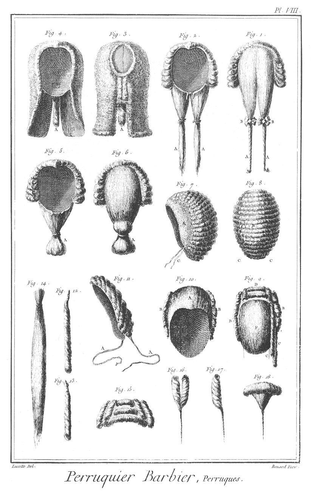](Planche_08.jpeg)

Fig.
1. &
2. Extérieur & intérieur de la perruque à deux queues.
	- A A, les queues.
	- B B, les rosettes.

3. &
4. Extérieur & intérieur de la perruque quarrée.
	- A A, le boudin.

5. &
6. Intérieur & extérieur de la perruque à cadogan.
	- A A, la cadogan.

7. &
8. Perruque de femme à chignon frisé vue latéralement & par derriere.
	- A, le crêpé.
	- B, le frisé.
	- C C, les cordons.

9. &
10. Intérieur & extérieur de la perruque de femme à chignon relevé.
	- A, le crêpé.
	- B B, les boucles latérales.
	- C C, les boudins.
	- D, le bonnet de cheveux.
	- E, le peigne.
	- F, le chignon.

11. Tour de face.
	- A A, les cordons.

12. &
13. Boudins pendans.

14. Cheveux servant de fausse queue.

15. Bonnet de cheveux.

16. &
17. &
18. Boucles de différentes formes.

PLANCHE IX. Appartement de bains particuliers.
----------------------------------------------

[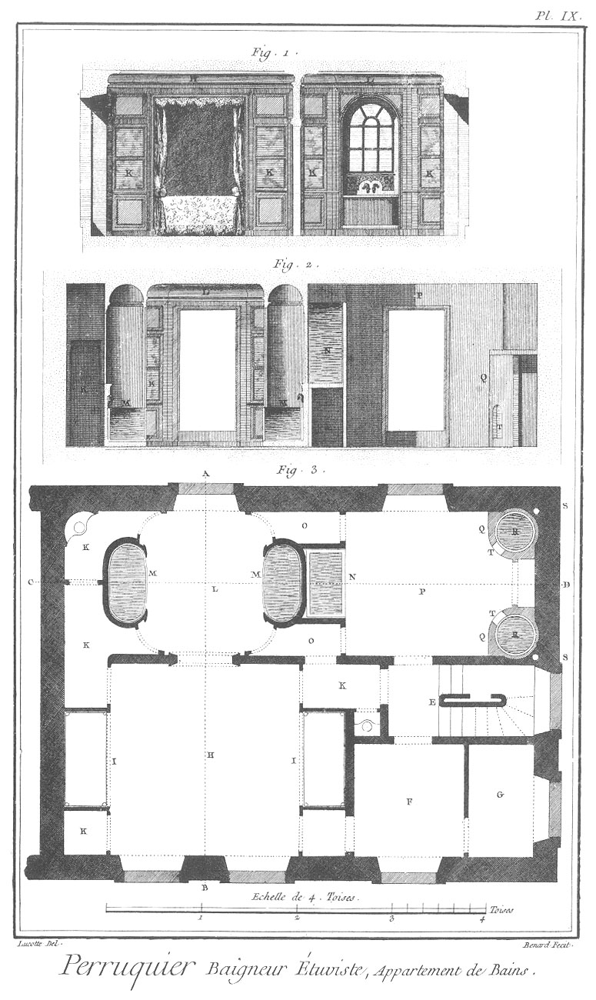](Planche_09.jpeg)

Fig.
1. &
2. &
3. Plan des bains ; la fig. 1. est la coupe sur la ligne
	- A B du plan, & la 2. la coupe sur la ligne
	- C D du même plan.
	- E, escalier.
	- F, antichambre.
	- G, petite lingerie.
	- H, chambre en niches.
	- I I, les lits en niches.
	- K K, &c. garderobe.
	- L, chambre des bains.
	- M M, baignoires en niches.
	- N, réservoir d'eau froide.
	- O O, passages au-dessus desquels sont d'autres réservoirs.
	- P, étuve.
	- Q Q, fourneaux.
	- R R, chaudieres.
	- S S, cheminées des fourneaux.
	- T T, portes des fourneaux.

PLANCHE X.
----------

[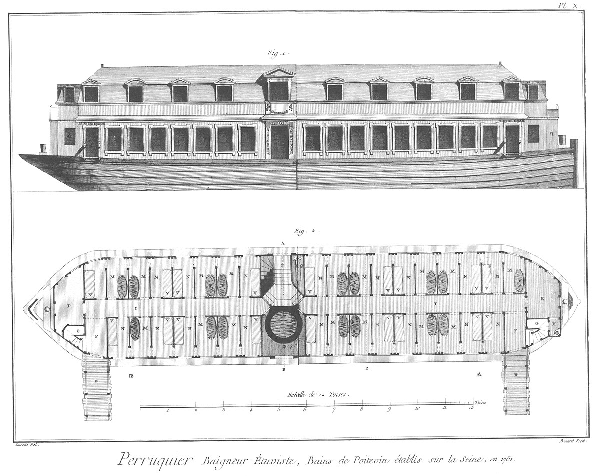](Planche_10.jpeg)

Fig.
1. Elévation extérieure, &
2. plan au rez-de-chaussée d'un bateau de bains publics établis à Paris sur la riviere de Seine en 1761 par Poitevin, baigneur.

Pl. X. & XI.
------------

	- A A, bains des hommes.
	- B B, bains des femmes.
	- E E, petits ponts.
	- F F, passages.
	- G G, escaliers pour monter au premier.
	- H, aisances.
	- I I, corridors.
	- K, chambre de garçons.
	- L, chambre de filles.
	- M M, &c. chambres de bains.
	- N N, chambres à lits.
	- O, chaudiere.
	- P, escalier pour descendre au fond du bateau.
	- Q Q, pompes.
	- R, fourneau.
	- S, dessous du fourneau.
	- T T, &c. baignoires.
	- V V, &c. lits.
	- X X, réservoirs.
	- Y Y, lieux pour étendre le linge.
	- Z Z, corridors du premier.
	- & &, terrasses.

PLANCHE XI.
-----------

[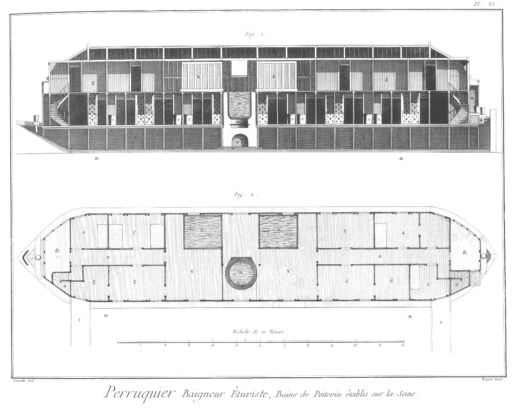](Planche_11.jpeg)

Fig.
1. Elévation intérieure.

2. Plan au premier des mêmes bains.
	- a, logement du maître.
	- b, logement des garçons.
	- c, logement du concierge.
	- d d, lingerie des hommes.
	- e, logement de la maîtresse.
	- f, logement des filles.
	- g g, lingerie des femmes.
	- h h, fond du bateau.

PLANCHE XII.
------------

[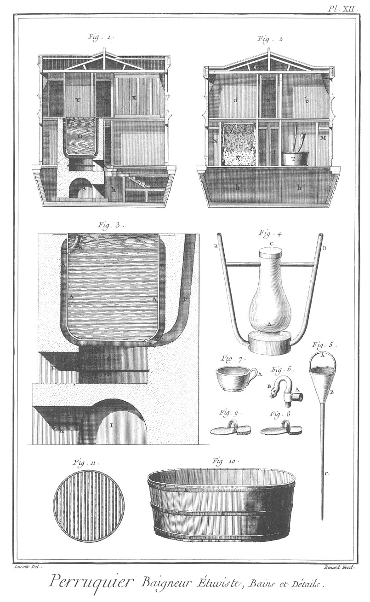](Planche_12.jpeg)

Fig.
1. Coupe sur la ligne
	- A B du plan, fig. 2. Pl. X. & fig. 2. Coupe sur la ligne
	- C D du même plan.

3. Coupe du fourneau & de la chaudiere.
	- A A, la chaudiere.
	- B B, le vuide autour de la chaudiere.
	- C, le fourneau.
	- D, la grille du fourneau.
	- E, la porte du fourneau.
	- F, la cheminée.
	- G, le tuyau de décharge.
	- H, le tuyau de trop plein.
	- I, le dessous du fourneau.
	- K, la porte du dessous du fourneau.

4. Cylindre ou étuve ambulante destinée à contenir dans son milieu
	- A le fer dont la vapeur sort par les tuyaux
	- B B;
	- C est le couvercle. Cette étuve est faite pour échauffer l'eau dans la baignoire.

5. Immersoir.
	- A, l'anse.
	- B, l'entonnoir.
	- C, le tuyau d'immersion.

6. Robinet que l'on place deux à deux au-dessus de chaque baignoire, dont l'un donne l'eau chaude & l'autre l'eau froide.
	- A, le robinet.
	- B, la clé.

7. Petit seau de cuivre étamé en-dedans fait pour agiter l'eau dans la baignoire.
	- A, l'anse.

8. &
9. Sandales du baigneur.

10. Baignoire de merain.
	- A A A, les cerces. On en fait de même forme en cuivre étamé.

11. Grille du fourneau.

[->](../17-Pêches_de_Mer,_Pêches_de_Rivieres._Fabrique_des_Filets/Légende.md)
