PÊCHES. PÊCHES DE MER, PÊCHES DE RIVIERES. FABRIQUE DES FILETS
==============================================================

Contenant trente-cinq Planches.

PLANCHE Iere. Fabrique des filets.
----------------------------------

[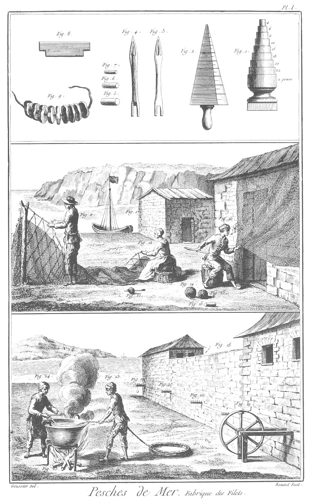](Planche_01.jpeg)

Fig.
1. Jauge des mailles du filet, depuis quatre lignes jusqu'à deux pouces.

2. Jauge des mailles de la lisiere supérieure du filet.

3. Aiguille vuide.

4. Aiguille chargée.

5. &
6. &
7. Moules de la maille du filet.

8. Moule de la maille de la lisiere du filet.

9. Flottes.

10. Pêcheur qui fait un filet.

11. Pêcheur qui arrête la maille de la lisiere.

12. Femme qui attache les flottes.

13. &
14. &
15. &
16. &
17. Aiguille avec son peloton, pelotons de fil, moule, habitation du pécheur.

18. Autre habitation du pêcheur.

19. &
20. &
21. &
22. Rouet & rateaux de corderie à l'usage du pêcheur.

23. Pêcheur qui descend le fil ou la corde à filet, son cable dans la chaudiere à goudron.

24. Pêcheur qui goudronne son cable.

25. Chaudiere à goudronner sur son trépié.

PLANCHE II.
-----------

[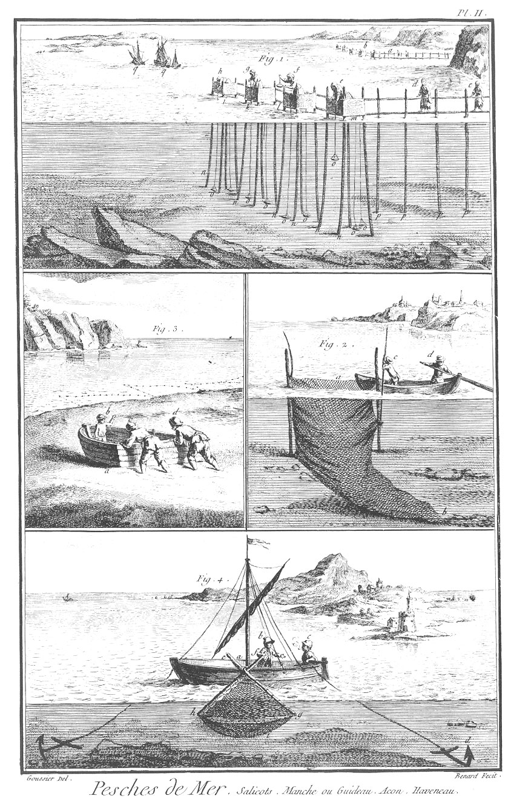](Planche_02.jpeg)

Fig.
1. Salicots.
	- a, planche qui conduit de la rive à la pêcherie.
	- b, pêcherie.
	- c d, pêcheuses sur la planche qui vont à la pêcherie.
	- e, pêcheuse qui a plongé son filet & qui le retire.
	- f, pêcheuse qui l'a retiré.
	- g, pêcheuse qui le tient au fond de l'eau.
	- h, pêcheuse qui le descend.
	- i, k, l, m, cases de la pêcherie.
	- n. pieux qui soutiennent les cases
	- o, filets.
	- p, pieux qui soutiennent la planche.
	- q, bâtimens en mer.

2. Manche ou guideau.
	- a, b, guideau posé.
	- c, d, pêcheurs dans leur bateau.

3. Acon.
	- a, b, c, d, pêcheurs occupés à préparer leur pêche.

4. Haveneau à la mer avec bateau ou chaloupe.
	- a, bateau ou chaloupe.
	- b, c, pêcheurs.
	- d, ancre.
	- e, f, manches du filet attaché au bord de la chaloupe.
	- g, h, i, filet qui se retire à l'aide des manches e, f.

PLANCHE III.
------------

[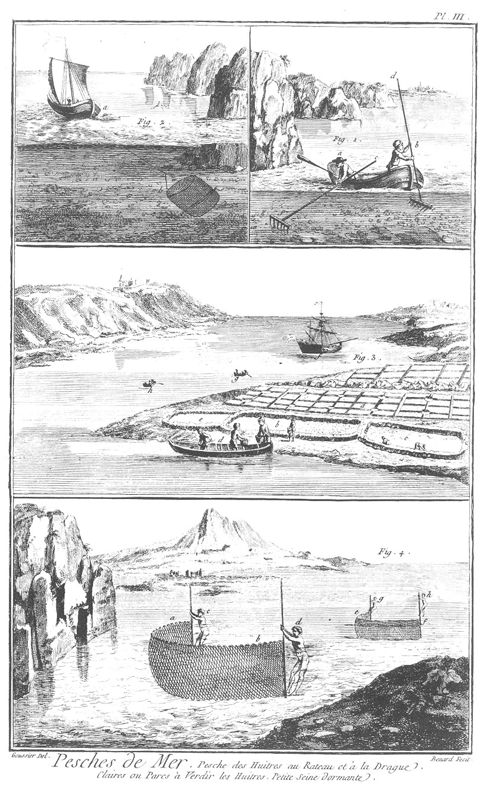](Planche_03.jpeg)

Fig.
1. Pêche des huîtres au rateau.
	- a, b, pêcheurs.
	- a, pêcheur qui traîne son rateau.
	- c, f, b, pêcheur qui retire son rateau chargé
	- d, e.

2. Pêche des huîtres à la drague.
	- a, bâtiment de pêcheurs.
	- b, drague au fond de l'eau.

3. Claires ou parcs à faire verdir les huîtres.
	- a, marais salans.
	- b, c, e, claires ou parcs.
	- d, pêcheurs qui chargent leur bateau d'huîtres vertes.
	- f, bâtiment en mer.
	- g, h, bateaux de pêcheurs.

4. Petite seine dormante.
	- a, b, la petite seine.
	- c, d, femmes qui ont tendu leur filet.
	- e, f, g, h, même filet & autres femmes occupées à le tendre.

PLANCHE IV.
-----------

[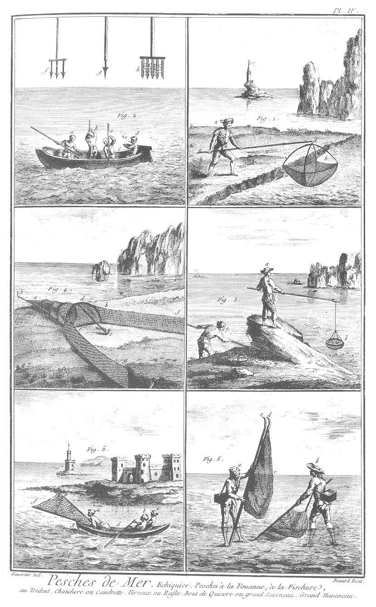](Planche_04.jpeg)

Fig.
1. Echiquier.
	- a, pêcheur qui plonge son échiquier.
	- b, échiquier.
	- c, d, bâton ou manche.

2. Pêches à la fouanne, à la fichure & au trident. Pêcheurs.
	- a, b, c, d, occupés à ces sortes de pêches.
	- e, bateau.
	- h, trident.
	- f, fichure.
	- g, fouanne.

3. Chaudiere ou caudrette.
	- c, b, pêcheurs. b, caudrette.

4. Verveux ou rafle.
	- a, b, c, d, e, f, g, h, verveux tendu.
	- h, pointe du sac ou chausse attachée à un pieu.
	- a, c, d, b, sac ou chausse.
	- g, d, b, h, aîles ou entrée du filet.
	- d, e, corde attachée à un pieu servant à fixer le filet.

5. Bout de quievre ou grand haveneau.
	- a, b, pêcheurs.
	- a, pêcheur qui tient son filet debout.
	- c, pêcheur qui pousse son filet.
	- c, d, e, filet.
	- c, d, cornes sur lesquelles le filet poussé glisse.

6. Grand haveneau.
	- a, b, c, pêcheurs.
	- a, pêcheur à son filet qu'il a relevé.
	- b, c, pêcheurs à la rame.
	- e, f, g, filets.

PLANCHE V.
----------

[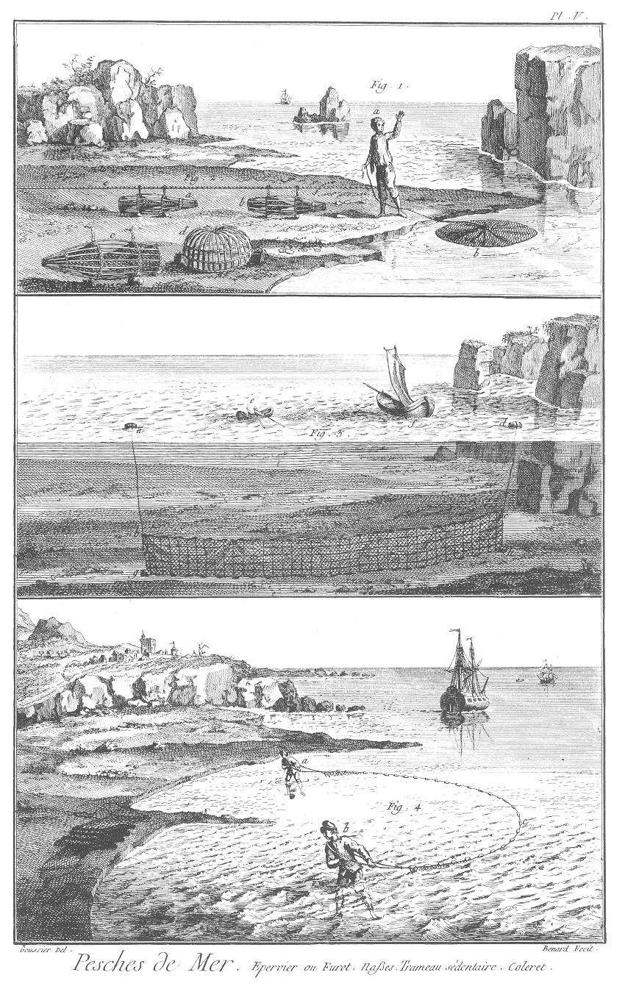](Planche_05.jpeg)

Fig.
1. Epervier ou furet.
	- a, pêcheur.
	- c, son filet.
	- b, filet.

2. Nasses.
	- a, b, c, nasses liées à un cable.
	- e, f, nasse séparée. d, autre nasse.

3. Trameau sédentaire.
	- a, d, tonnes ou flottes qui tiennent le filet tendu.
	- b, g, h, c, filets.
	- e, pêcheurs qui s'en retournent dans leur bateau.
	- f, bâtiment en mer.

4. Coleret.
	- a, b, c, colerets.
	- a, b, pêcheurs qui tirent leur filet.

PLANCHE VI.
-----------

[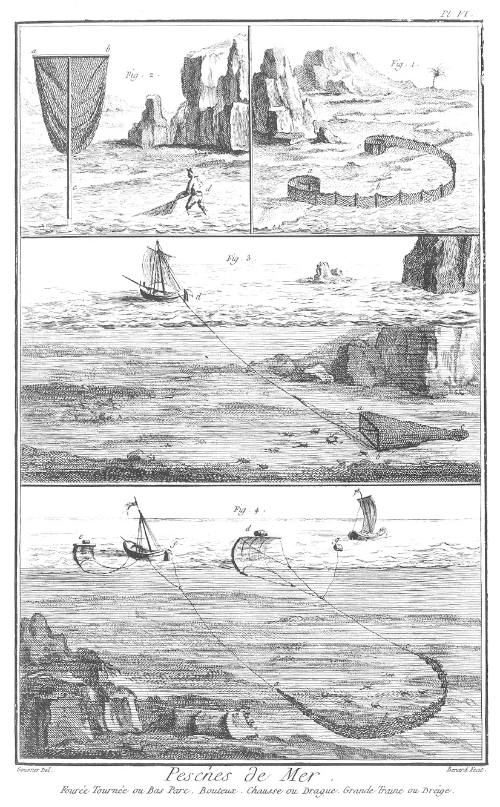](Planche_06.jpeg)

Fig.
1. Fourée tournée ou bas parc.
	- a, b, c, ce filet.

2. Bouteux.
	- a, b, c, ce filet.
	- d, pêcheur.

3. Chausse ou drague.
	- a, b, c, la drague.
	- d, bâtiment qui la tire.

4. Grande traîne ou drege.
	- a, b, c, filets.
	- d, e, espece de voile.
	- g, flotte ou tonne.
	- f vaisseau qui tire la drege.

PLANCHE VII.
------------

[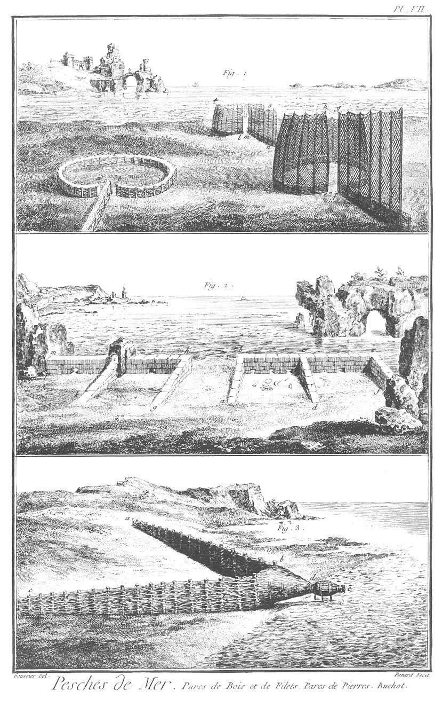](Planche_07.jpeg)

Fig.
1. Parcs de bois & parcs de filets.
	- a, b, c, parc de bois.
	- a, b, entrée.
	- e, f, g, h, parc de filets.
	- e, f, entrée.
	- i, k, l, m, n, o, autre parc de filet.

2. Parcs de pierre.
	- a, b, c, d, e, f, parc de pierre.
	- g, h, i, k, l, m, autre parc de pierre.

3. Buchot.
	- a, b, c, d, e, filet.
	- a, b, c, entrée.
	- b, d, e, sac ou fond.

PLANCHE VIII.
-------------

[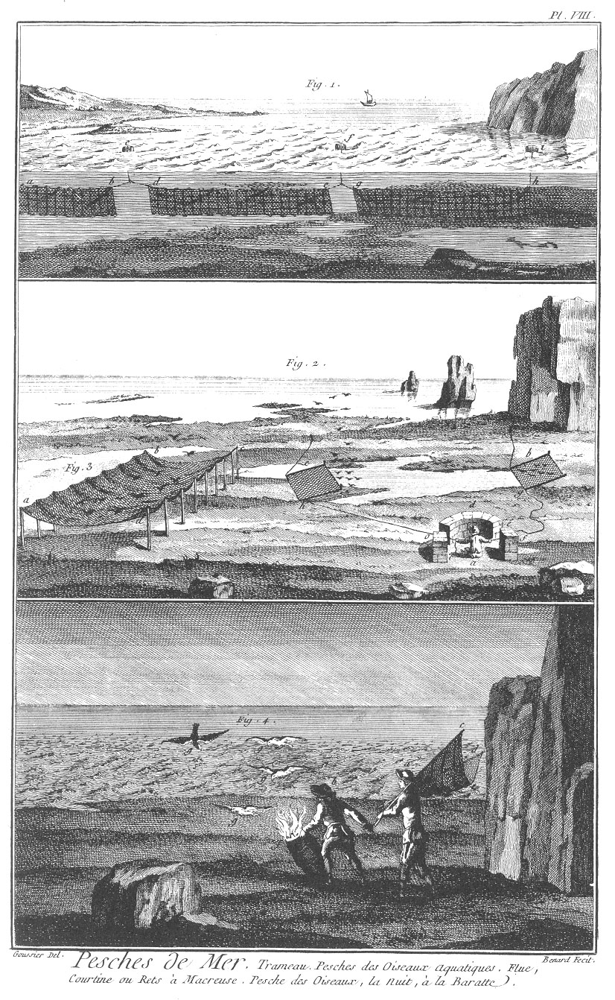](Planche_08.jpeg)

Fig.
1. Trameau à la dérive d'une marée à l'autre.
	- a, b, c, d, e, f, g, h, i, filet.
	- c, f, i, flotte ou tonne.

2. Pêche des oiseaux aquatiques.
	- a, pêcheur.
	- g b, ch, filets.
	- o, d, e, f, bâti circulaire de pierre qui cache le pêcheur.
	- h, g, cordes par lesquelles il tire ses filets.
	- o, e, ouvertures pour les cordes.

3. Flue, courtine ou rets à macreuse.
	- a, b, c, d, filets.

4. Pêche des oiseaux aquatiques la nuit, à la lueur d'une barate.
	- a, pêcheur avec son filet.
	- b, pêcheur avec la barate.
	- c, d, e, filet.
	- f, barate enflammée.
	- g, oiseaux aquatiques.

PLANCHE IX.
-----------

[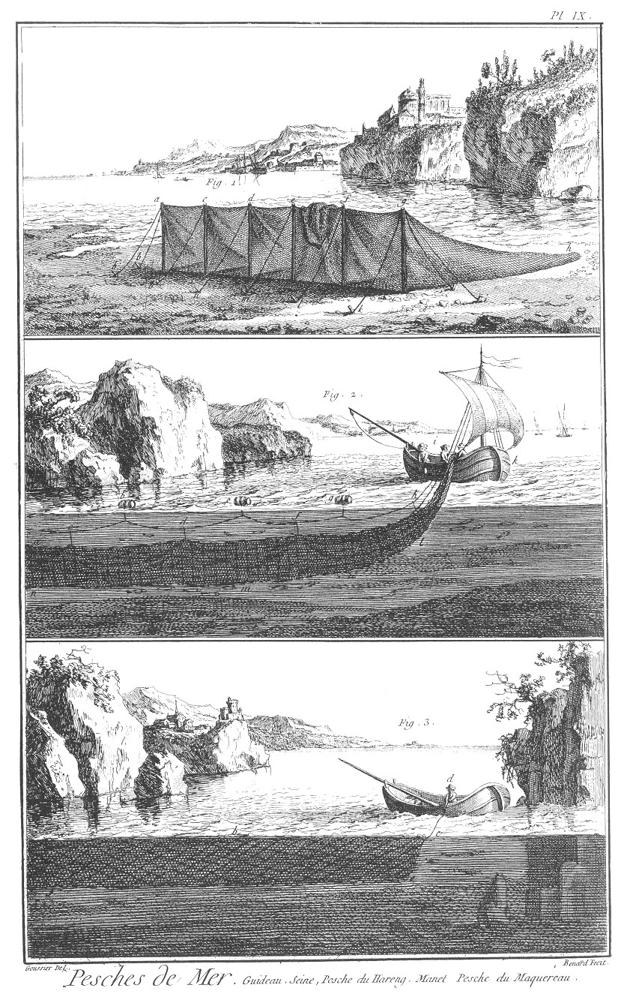](Planche_09.jpeg)

Fig.
1. Guideau.
	- a, b, c, d, e, f, g, h, i, k, l, m, n, le filet avec ses appuis.

2. Seine, pêche du hareng.
	- a, b, c, d, e, f, g, h, l, m, n, filets.
	- b, e, g, flottes ou tonnes.
	- i, pêcheurs dans leur bâtiment k.

3. Manet, pêche du maquereau.
	- a, b, c, e, f, manet.
	- d, pêcheur dans son bateau.

PLANCHE X.
----------

[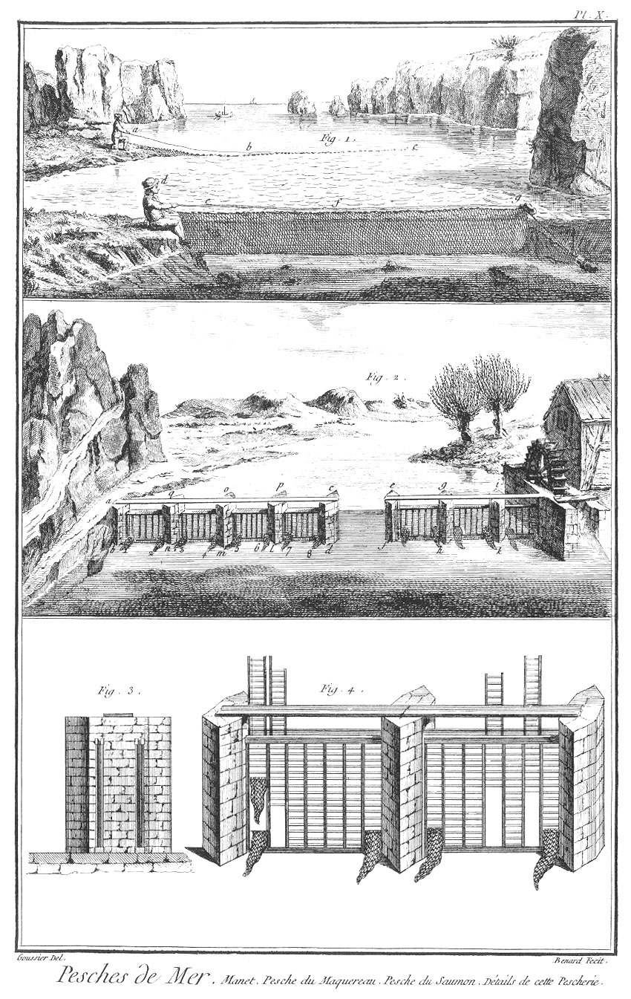](Planche_10.jpeg)

Fig.
1. Manet, pêche du maquereau.
	- a, le pêcheur.
	- b, c, le manet.
	- d, pêcheur.
	- e, f, g, le manet.

2. Pêche du saumon.
	- a, a b, q n, o m, p l, c d, fabrique.
	- a b, q n, &, piles. Répétition de l'autre côté.
	- 1, 2, 3, 4, 5, 6, 7, 8, filets.

3. &
4. Détails de cette pêcherie.

PLANCHE XI.
-----------

[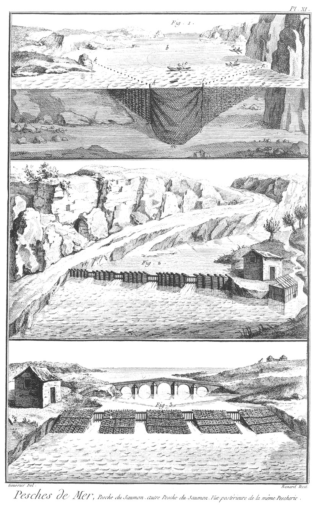](Planche_11.jpeg)

Fig.
1. Pêche du saumon.
	- a, b, c, pêcheurs & filet.
	- e, f, g, h, i, k, l, m, n, filet tendu.
	- d, pêcheur à la ligne.

2. Autre pêche du saumon.

3. Vue postérieure de la même pêcherie.

PLANCHE XII.
------------

[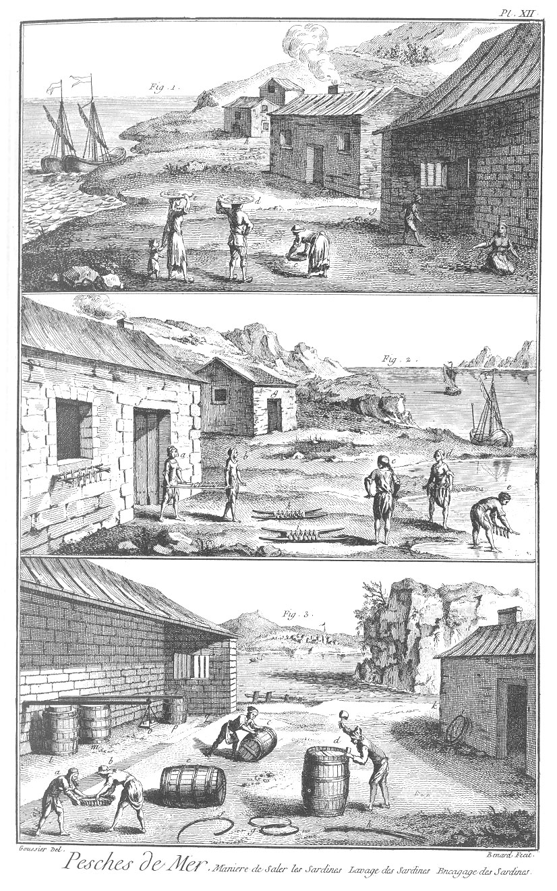](Planche_12.jpeg)

Fig.
1. Maniere de saler les sardines dans les presses ou magasins.
	- a, b, c, d, e, hommes & femmes occupés à ce travail.
	- f, g, h, presses ou magasins.

2. Lavage des sardines dans l'eau de mer.
	- a, b, c, d, e, femmes occupées à ce travail.
	- f, g, presses ou magasins.
	- h, i, sardines étalées sur les civieres.

3. Presses ou magasins & maniere d'encaguer les sardines.
	- a, b, c, d, hommes & femmes occupés à ce travail.
	- e, tonne ou cague.
	- f, cerceau rompu.
	- g, cerceaux.
	- h, osier.
	- i, cerceau.
	- l, m, o, p, balances.
	- q, k presses ou magasins.

PLANCHE XIII.
-------------

[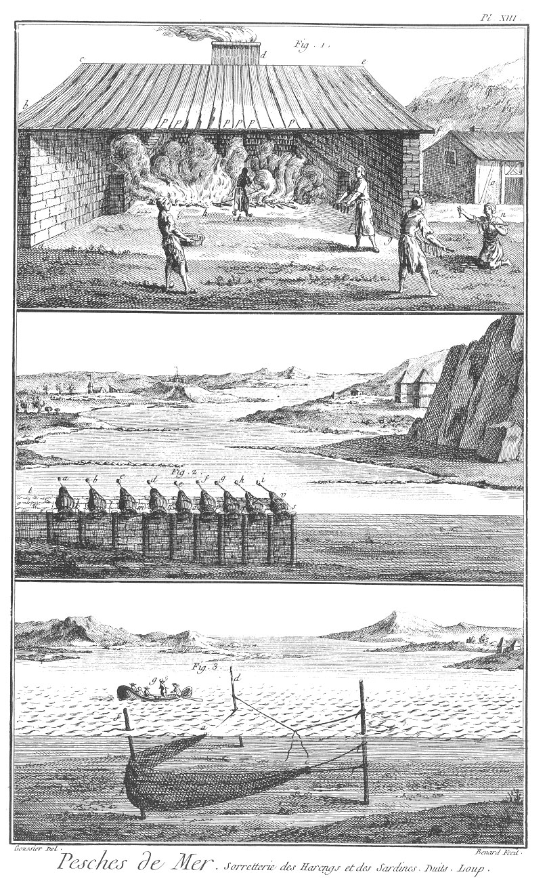](Planche_13.jpeg)

Fig.
1. Sorreterie des sardines & harengs.
	- a, b, c, d, e, f, g, bâtiment à sorreter.
	- a, cheminée.
	- h, feu.
	- p, p, p, f, poissons exposés à la fumée.
	- i, k, l, g, m, n, hommes & femmes occupés à ce travail.

2. Duits.
	- a, b, c, d, e, f, g, h, i, pieux qui attachent la queue des filets.
	- k, l, m, n, o, p, q, r, s, filets.
	- t, u, x, y, massif qui les soutient.

3. Loup.
	- a, b, c, filet.
	- d, e, f, pieux qui le tendent.
	- g, pêcheurs dans leur bateau.

PLANCHE XIV.
------------

[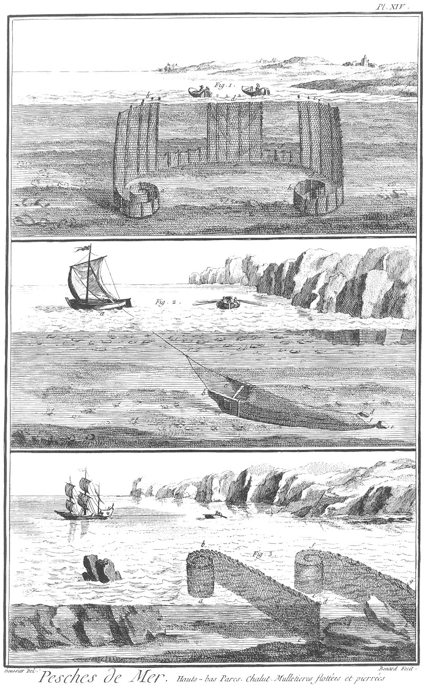](Planche_14.jpeg)

Fig.
1. a, b, c, d, e, f, g, h, i, hauts-bas-parcs.

2. Chalut.
	- a, bâtiment qui le tire.
	- b, e, f, filet.
	- d, e, pierres.

3. Mulletieres de pié, flottées & pierrées.
	- a, b, c, d ; e, f, g, h, filets.

PLANCHE XV.
-----------

[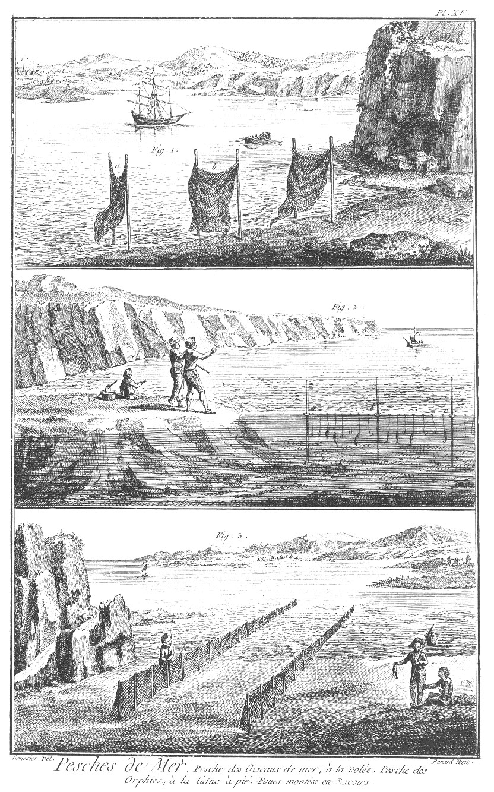](Planche_15.jpeg)

Fig.
1. Pêche des oiseaux de mer à la volée.
	- a, b, c, filets tendus.

2. Pêche des orphies à la ligne à pié.
	- a, b, c, lignes jettées.

3. Fouées montées en ravoirs.

PLANCHE XVI.
------------

[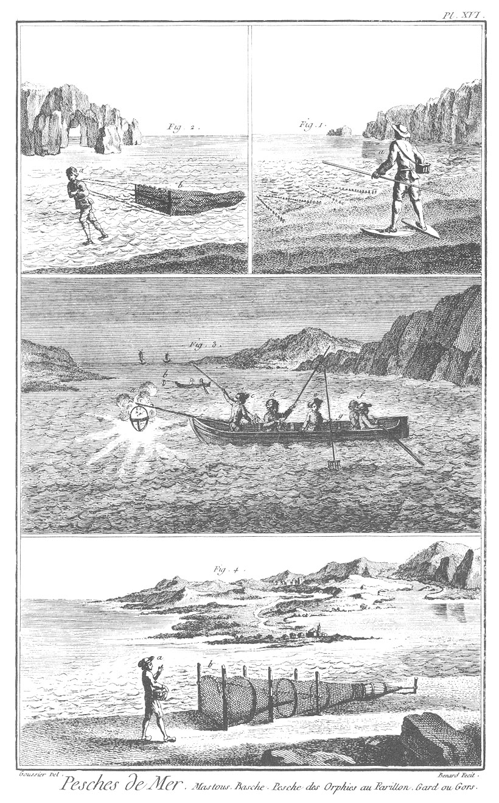](Planche_16.jpeg)

Fig.
1. Mastous.
	- a, pêcheur avec ses patins.

2. Basche.
	- b, filet.
	- a, pêcheur qui le tire.

3. Pêche des orphies au farillon.
	- a, b, farillons.
	- c, d, e, f, g, pêcheurs dans leurs bateaux avec leurs fouannes.

4. Gard ou gors.
	- a, pêcheurs.
	- b, gors.

PLANCHE XVII.
-------------

[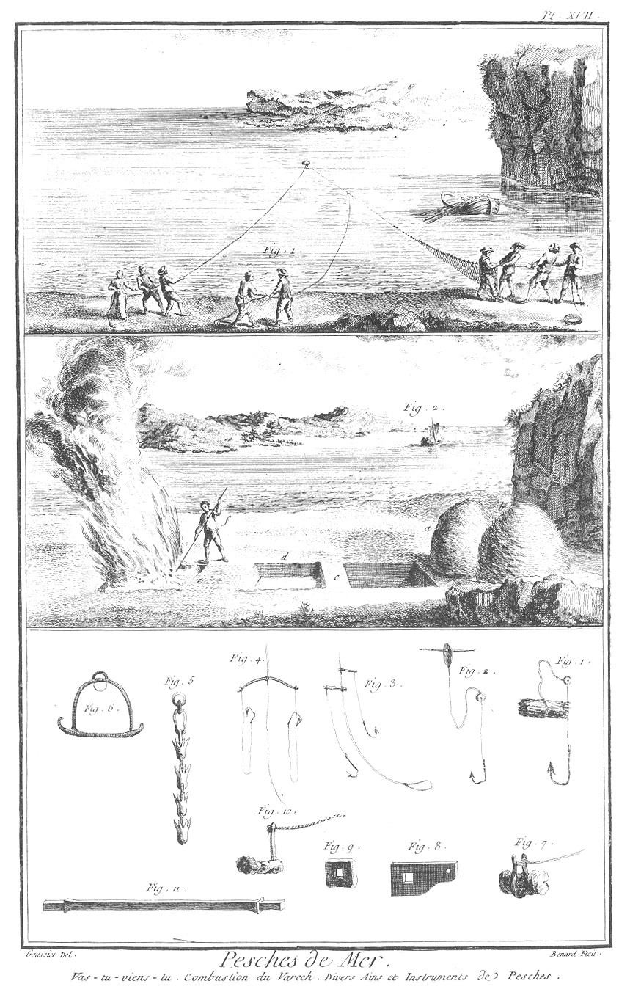](Planche_17.jpeg)

Fig.
1. Vas-tu-viens-tu.

2. Maniere de brûler le varech.
	- a, b, meulons de varech.
	- c, d, e, fosses.
	- f, fosse en feu.

Au bas de la Planche divers ains & instrumens de pêcheurs.

Fig.
1. Ains à torque de paille.

2. Lignes ou ain à pille roulante.

3. &
4. Libourets.

5. Catoniere à grapiner les lignes rompues dans la mer.

6. Chandelat ou échalon de fer pour le chalut Anglois.

7. Echalon on genoulier avec lien de bois & sa cabliere pour le chalut.

8. &
9. Echalon de bois avec sa pierre pour le chalut.

10. Echalon de pierre à genou de bois.

11. Espare ou traverse pour le chalut Anglois.

PLANCHE XVIII. Fabrique des hameçons.
-------------------------------------

[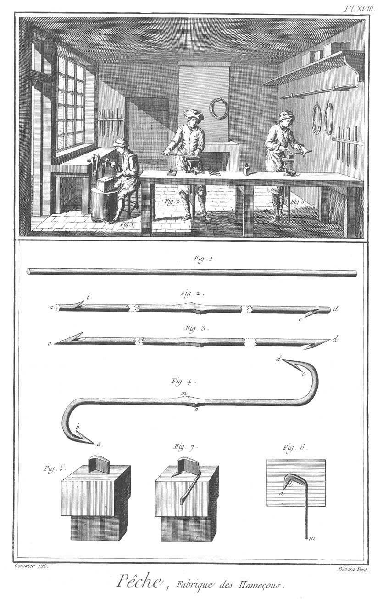](Planche_18.jpeg)

La vignette représente l'intérieur d'une boutique, dans laquelle sont plusieurs ouvriers occupés à cette fabrication.

Fig.
1. Ouvrier qui avec la panne d'un marteau palme dans leur milieu les dressées dont on doit former les hameçons.

2. Ouvrier qui avec le couteau de l'engin contenu par l'étau qui est devant lui, forme à chaque bout de la dressée le ranguillon ou crochet qui est près de la pointe de l'hameçon.

3. Ouvrier qui appointe l'hameçon en se servant de limes.

On voit dans le fond de l'attelier une cheminée sous laquelle doit être un fourneau à mouffle semblable à celui des émailleurs. On met les hameçons sur une plaque de tôle que l'on place sous la mouffle pour les faire rougir ; on les jette ensuite dans un vaisseau plein d'huile, où le fil d'acier d'Hongrie, dont ils sont formés, prend un degré de trempe convenable.

Bas de la Planche.

Fig.
1. Dressée d'acier pour faire deux hameçons ; on les coupe d'une longueur proportionnée à la grosseur du fil & à la sorte d'hameçons que l'on veut fabriquer, en se servant des outils convenables qui sont représentés dans les Planches de l'épinglier.

2. Dressée qui est palmée dans son milieu.
	- a, extrémité de la dressée qui doit être formée en pointe.
	- b, le ranguillon.
	- c, ranguillon du second hameçon.
	- d, extrémité qui doit être formée en pointe.

3. La même dressée dont, ainsi que de la précédente, on a fracturé les parties pour que les extrémités pussent être rapprochées & contenues dans la planche.
	- a, la pointe de l'hameçon qui est formée non au centre, mais à l'extrémité du côté opposé au ranguillon.
	- d, seconde pointe pour le second hameçon.

4. La dressée précédente, dont les deux extrémités ont été recourbées en sens contraire sur le plioir.
	- a, la pointe.
	- b, le ranguillon d'un des hameçons.
	- d, la pointe.
	- c, le ranguillon du second hameçon.
	- m n, ligne ponctuée qui indique dans l'endroit qui a été palmé, le lieu où on doit couper pour séparer les deux hameçons l'un de l'autre.

5. Plioir en perspective ; c'est un billot de bois, dans la partie supérieure duquel est implanté une piece de fer, dont la courbure extérieure est la même que la courbure intérieure de l'hameçon ; l'intérieur de cette piece est concave & terminé d'un côté par un tranchant qui est reçu sous le ranguillon de l'hameçon que l'on veut ployer. La partie inférieure de cet outil est saisie par les mâchoires de l'étau lorsque l'on en fait usage.

6. Plan du dessus du plioir.
	- a, la pointe de l'hameçon.
	- b, le ranguillon dans lequel la piece d'acier est engagée.
	- m, la palme ou tête de l'hameçon par laquelle il tient à l'empile.

7. Le même plioir en perspective.

Nota que pour ployer les petis hameçons on se sert d'une tenaille ou pince dont les becs sont conformés, ainsi qu'il est convenable, pour que l'hameçon ait la figure requise.

PLANCHE XIX.
------------

[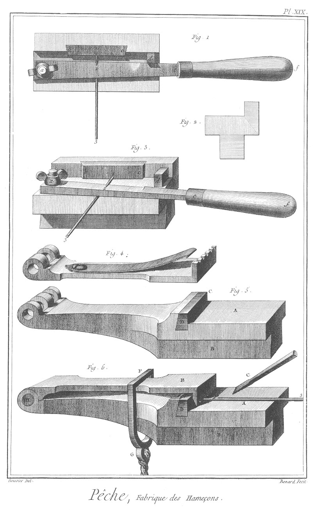](Planche_19.jpeg)

Fig.
1. Plan du porte-couteau & du couteau pour couper le ranguillon.
	- a, vis qui assujettit la tête du couteau, qui est un levier du second genre.
	- e f, le manche du couteau.
	- b c, le heurtoir qui est d'acier.
	- 1 2 3, la dressée dont on doit faire deux hameçons.
	- 2, le ranguillon coupé par le couteau.
	- d, piece contre laquelle le couteau vient s'appuyer pour borner sa course.

2. Profil du fust ou porte-couteau que l'on met dans l'étau par sa partie inférieure.

3. Le même coupoir en perspective ; les mêmes lettres indiquent les mêmes objets.

4. &
5. &
6. Autre coupoir pour former le ranguillon des gros hameçons.

4. Représentation perspective de la mâchoire supérieure de cette machine vûe par-dessous, pour faire voir le ressort d'acier qui sert à la relever.

5. La mâchoire inférieure du coupoir vûe par le dessus ; ces deux pieces s'assemblent à charniere
	- B, partie que l'on met dans l'étau.
	- A, table sur laquelle on pose les dressées auxquelles on veut former le ranguillon.
	- C D, heurtoir d'acier contre lequel l'extrémité des dressées est appliquée.

6. Le second coupoir en perspective & garni de toutes les pieces nécessaires à son usage.
	- B, partie de la mâchoire inférieure qui se place dans l'étau.
	- A, table sur laquelle on place les dressées.
	- D, le heurtoir.
	- E, mâchoire supérieure.
	- H, charniere des deux mâchoires.
	- F G, étrier, dont la corde G va s'attacher à une pédale ou marche sur laquelle l'ouvrier met le pié pour comprimer la mâchoire supérieure sur la dressée 2, 3.
	- C, ciseau avec lequel, au moyen d'un marteau d'un poids convenable à la grosseur du fil, on coupe & on releve le ranguillon 2.

PLANCHE XX.
-----------

[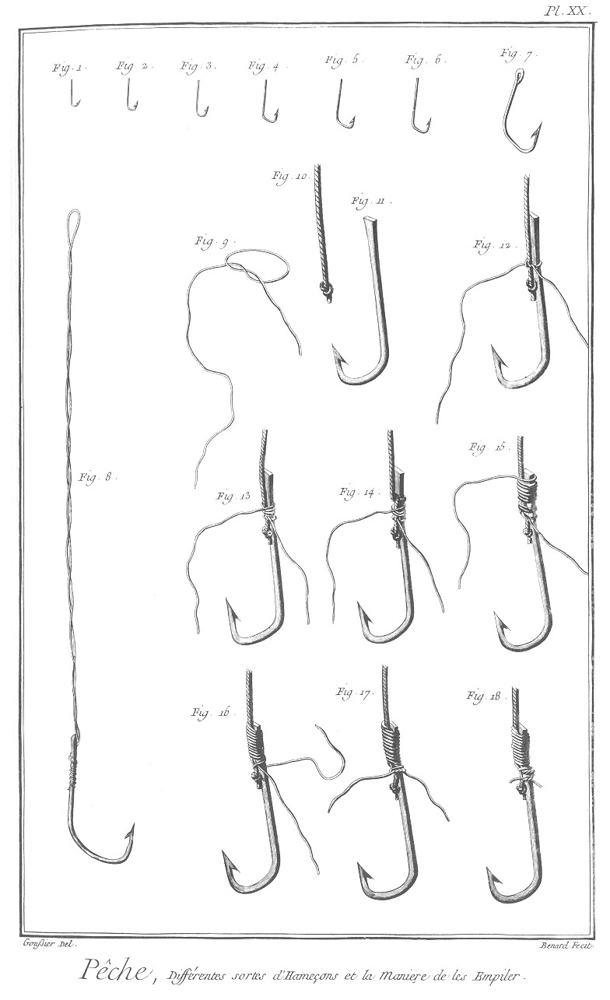](Planche_20.jpeg)

Cette Planche contient les différens hameçons dont on fait usage pour la pêche dans les rivieres, & la maniere de les empiler, c'est-à-dire de les attacher à la ligne, soit de crin, ou de soie, ou de fil.

Fig.
1. Les plus petits de tous les hameçons ; ils servent à pêcher les ablettes.

2. Hameçon pour pêcher le petit goujon.

3. Hameçon pour pêcher le petit gardon.

4. Hameçon pour pêcher le moyen gardon.

5. Hameçon pour pêcher le gros gardon & autres poissons de même taille.

6. Hameçon que l'on adapte aux lignes nommées Jeux ; il y en a de trois sortes, celui que la figure représente est la plus petite.

7. Hameçon pour les anguilles ; il y en a aussi de trois sortes, & c'est la plus petite.

8. Hameçon avec une empile de laiton pour le brochet ; il y en a de six sortes, celui que la figure représente est la plus petite.

Les figures suivantes représentent la maniere d'empiler les hameçons à une ligne de crin ou autre.

9. Anneau fait avec la soie cirée, qui sert à faire la ligature.

10. Extrémité inférieure de l'empile, qui est ordinairement de crin, à l'extrémité de laquelle on fait un noeud.

11. L'hameçon à la palmure duquel on applique l'empile du côté intérieur, qui est le côté de la pointe, ces deux pieces doivent être entourées de l'anneau figure 9.

12. L'empile & la tige de l'hameçon appliquées l'une à l'autre, & serrées par le premier noeud coulant de la soie qui compose la ligature.

13. La ligature commencée par trois ou quatre tours montans de la soie.

14. Le noeud de l'empile.

15. Le noeud de l'empile recouvert par la suite des tours montans de la ligature.

16. L'empile recouverte par les tours descendans de la ligature.

17. Le premier noeud double pour assurer la ligature.

18. Le second noeud simple pour assurer le précédent ; après ce noeud on coupe les deux fils & l'empile est faite.

PLANCHE XXI. Fabrique des filets.
---------------------------------

[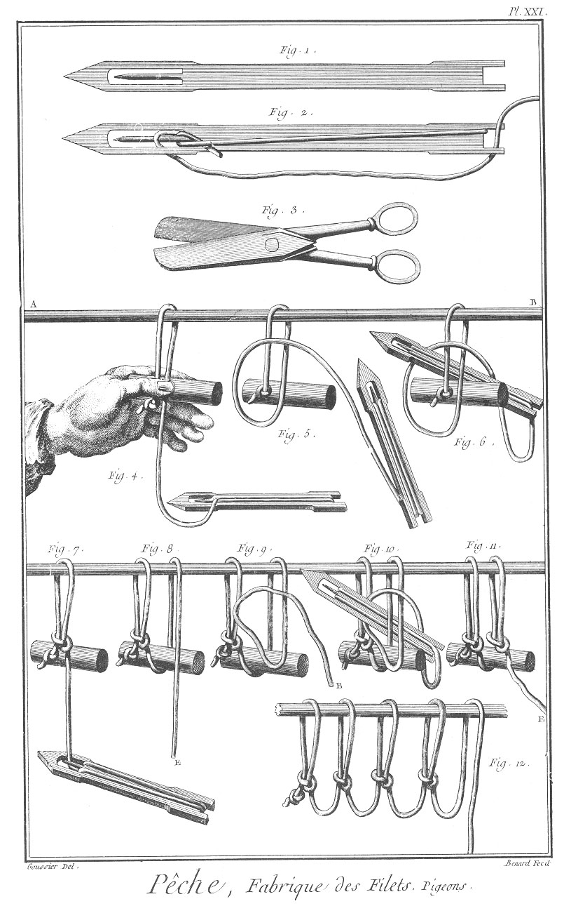](Planche_21.jpeg)

Fig. 1. Aiguille sur laquelle on place le fil pour, après qu'elle en est chargée, servir à lacer le filet. il y en a de toutes grandeurs pour servir aux différens fils, ficelles ou cordes dont on compose les filets.

2. La même aiguille chargée d'un tour de fil. Pour charger ou couvrir l'aiguille, prenez un peloton de fil, & en mettez le bout sur l'aiguille, posant le pouce de la main gauche dessus, & tenant le reste du fil de la main droite, vous le ferez passer par l'ouverture pour en faire deux tours dessus le tenon de l'aiguille ; ce qui étant fait, menez le fil dans la coche & tournez l'aiguille de l'autre côté pour faire passer le fil sur le tenon par l'ouverture, puis le remenez dans la coche pour repasser encore ce fil, & continuez de même, tant que l'aiguille soit assez chargée. Toutes les fois qu'on voudra faire passer ce fil dessus le tenon, il ne faudra que le pousser du pouce, la pointe du tenon sortira, ce qui donnera la facilité de passer le fil par derriere sans le mettre en double dans l'ouverture de l'aiguille.

3. Les ciseaux dont les pointes sont camuses.

Les figures suivantes représentent la maniere de former les pigeons, levure ou premieres mailles d'un filet.

4. Le moule ou cylindre de bois de saule tenu par le pouce de la main gauche & le premier doigt. Après avoir formé un noeud à l'extrémité du fil, & l'avoir passé par-dessous la corde A B, sur laquelle on ourdit le filet, on ramene le noeud & le fil sur le moule où ils sont retenus par le pouce, comme la figure le représente ; & c'est le premier tems de la formation du pigeon.

Dans les figures suivantes il faut concevoir que la main gauche y est représentée.

5. Le second tems de la formation du pigeon. On rejette le fil en haut & sur la gauche, en sorte qu'il forme une boucle qui entoure le pouce.

6. Troisieme tems de la formation du pigeon. On passe l'aiguille par-dessous les deux fils qui sont contenus par le pouce, observant de la faire sortir par-dedans la boucle formée précédemment.

7. Dernier tems de la formation du premier pigeon. Il consiste à tirer le fil pour serrer le noeud qui embrasse les deux branches du pigeon.

8. Premier tems de la formation du second pigeon. On a supprimé l'aiguille placée au prolongement du fil E.

9. Second tems de la formation du second pigeon ; l'aiguille placée en E a aussi été supprimée.

10. Troisieme tems de la formation du second pigeon ; l'aiguille est passée sous les deux fils & dans la boucle.

11. Quatrieme tems où le second pigeon est entierement formé.

Les autres pigeons se forment de la même maniere.

12. Quatre pigeons & le commencement d'un cinquieme faisant partie de la levure d'un filet.

Pour faire la levure d'un filet qui étant étendu, se trouve de la grandeur qu'on le desire, il faut que la levure soit deux fois aussi longue. Exemple. Vous voulez que le filet soit long comme depuis A jusqu'à B, poursuivez cette façon de mailler jusqu'en C, qui est le double de la longueur A B, parce que les mailles étant ouvertes de côté & d'autre, le filet se raccourcira de moitié. Ayant maillé la longueur nécessaire, ouvrez les mailles des deux côtés, & passez-y une ficelle & nouez les deux bouts ensemble, la levure sera faite.

PLANCHE XXII.
-------------

[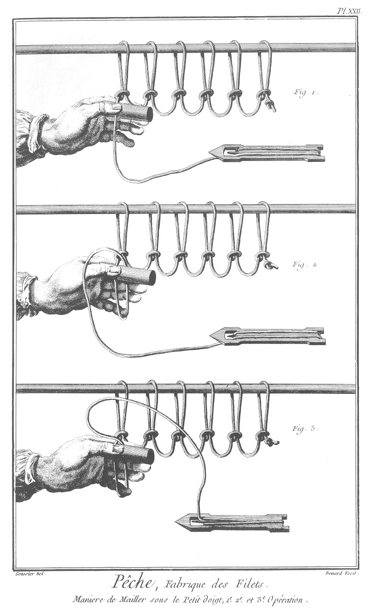](Planche_22.jpeg)

Cette Planche & la suivante représentent la maniere de mailler sous le petit doigt.

Fig.
1. Premier tems de la formation de la premiere maille. L'envers des pigeons étant tourné du côté de l'ouvrier, il consiste à amener le fil sur le moule où il est retenu par le pouce de la main gauche.

2. Second tems de la formation de la maille. On ramene le fil par-dessous le petit doigt sous le moule où il est arrêté par lé doigt index.

3. Troisieme tems de la formation de la maille. Il consiste à rejetter le fil en haut & sur la gauche pour former une boucle.

PLANCHE XXIII.
--------------

[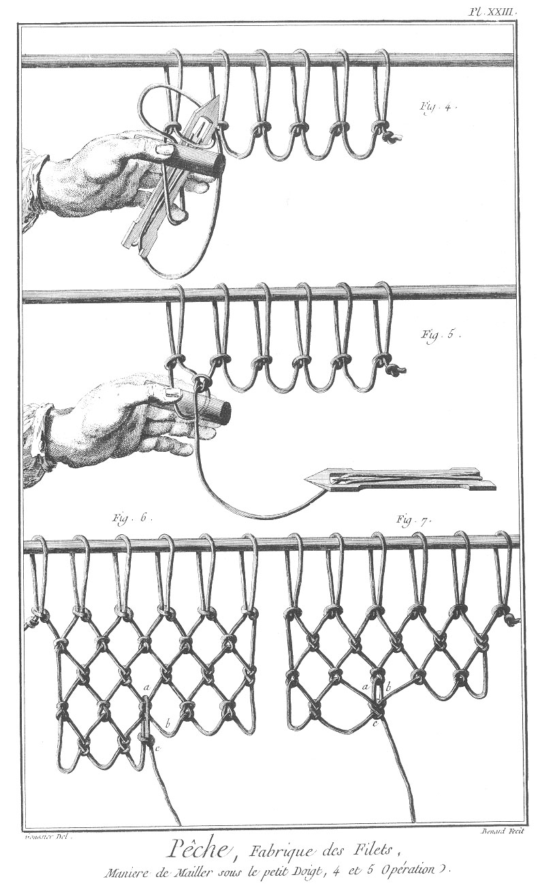](Planche_23.jpeg)

Fig.
1. &
2. &
3. &
4. Quatrieme tems de la formation de la maille. Il consiste à passer l'aiguille par-dessous le pouce entre les deux fils qui entourent le petit doigt, & à la conduire dans la maille du rang au-dessus que l'on veut prendre.

5. Cinquieme tems de la formation de la maille. Il consiste à tirer le fil par-dessus le moule pour serrer le noeud. Ayant fait la levure comme il a été dit dans l'explication de la Pl. XXI. & tenant le moule de la main gauche, on le placera dessous la premiere maille ; on passera ensuite le fil autour du moule, & on fera entrer l'aiguille dans la maille pour faire la premiere du second rang. Cette maille étant faite, on la laissera sur le moule, & on continuera de mailler ainsi à toutes les mailles de suite sans tirer le moule dehors, sinon lorsqu'il y en aura trop dessus ; car alors il faudra les en ôter toutes, à la réserve d'une pour tenir le moule en état. Quand on sera à la derniere maille, il faudra tirer le moule hors de toutes les mailles, le poser sous la derniere & commencer le troisieme rang qui retournera du côté opposé, & ainsi de tous les autres rangs jusqu'à la fin du silet. Il faudra le faire le quart plus long que la mesure, à cause qu'étant ouvert ou étendu en large, il s'accourcira du quart ou du tiers. Par exemple, si vous desirez faire une tirasse qui ait trois toises de queue ou de longueur, faites le filet de quatre toises de long. On observera ponctuellement ce point à tous les filets qui seront faits de mailles à losanges.

6. Portion de filet vue par l'endroit. On noue ainsi le côté par lequel il a été commencé. On voit en a c une accrue formée comme un pigeon dans la maille a du pénultieme rang ; on continue ensuite par la maille b le rang inférieur qui se trouve avoir une maille de plus que celui qui le précede. Pour former les accrues, ou jetter accrues, supposez que l'on veuille faire un filet qui ait deux piés de large par un bout, & par l'autre dix piés, & que sa longueur entre ces deux largeurs soit de quatre piés, ce filet aura les mailles d'un pouce de large. Il faut faire la levure de 24 mailles ; & lorsqu'on travaillera au premier rang d'après la levure, on fera cinq ou six mailles, & quand on sera à la six ou septieme, on fera le tour du moule avec le fil, & on repassera l'aiguille dans la même septieme maille, on fera le noeud ; ce sera l'accrue qui paroîtra, lorsque le moule en sera dehors, ainsi qu'une boucle ou un anneau. On poursuivra après cela le filet comme à l'ordinaire ; & quand on aura fait dix ou douze mailles (n'importe pas combien, pourvu que l'on fasse deux accrues en chaque rangée de mailles), on jettera encore une autre accrue en la même maniere que la premiere, puis on achevera le rang qui se trouvera avoir vingt-six mailles, à cause des deux accrues. On recommencera un autre rang, auquel il faudra faire deux autres accrues ; ce qu'étant fait, il aura vingt-huit mailles, & ainsi des autres rangs qui s'augmenteront toujours de deux mailles plus que celui qui le précédera.

7. Le même fragment de filet vu par l'envers ou côté opposé à la figure précédente. On voit en b une rapetissure qui consiste à passer l'aiguille dans deux mailles à la fois, comme celles a & b, pour formet la maille ; en sorte que le rang inférieur après qu'il est achevé, a une maille de moins que celui qui le précede. Si on vouloit faire un filet qui allât en étrécissant, il faudroit, au lieu de jetter des accrues aux endroits indiqués, prendre deux mailles à la fois, & de ces deux n'en faire qu'une ; de cette façon le filet ira en étrécissant de deux pouces à chaque rang, au lieu que de l'autre maniere il s'élargiroit de deux pouces à toutes les rangées.

PLANCHE XXIV. Maniere de mailler sur le pouce.
----------------------------------------------

[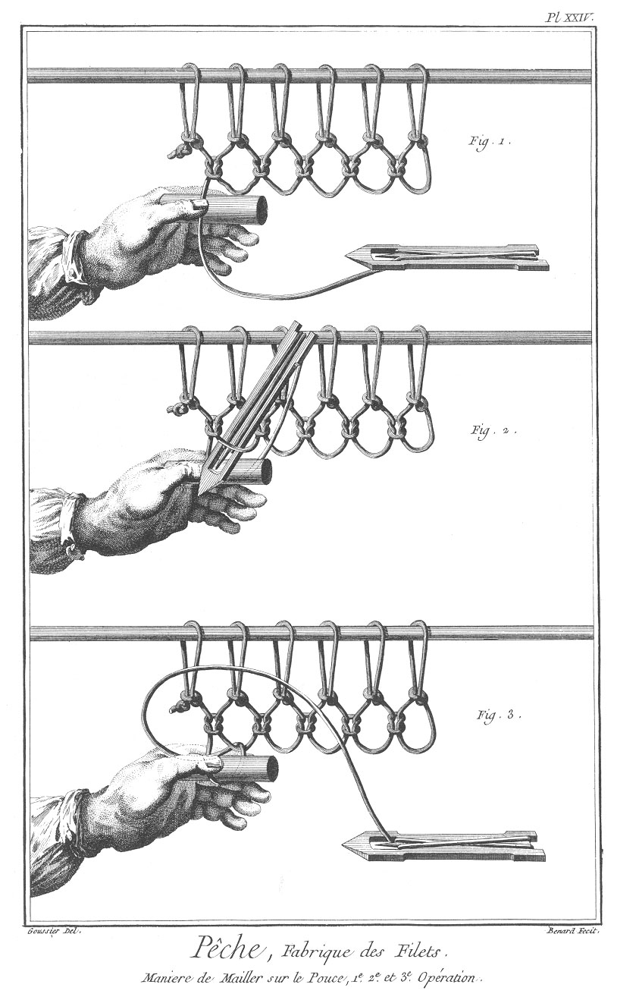](Planche_24.jpeg)

Fig.
1. Premier tems ; le fil doit être sur le moule où il est arrêté par le pouce de la main gauche.

2. Second tems de la formation de la maille ; il consiste à passer l'aiguille du haut en bas dans la maille, ensorte que le fil soit derriere le moule, on tire l'aiguille & on serre en-dessus du moule, c'est la préparation pour le tems suivant.

3. Troisieme tems de la formation de la maille ; il faut passer le pouce par-dessous le fil pour le saisir ensuite avec le pouce comme la figure le représente, & jetter ensuite le fil en haut & sur la gauche pour former une boucle.

PLANCHE XXV.
------------

[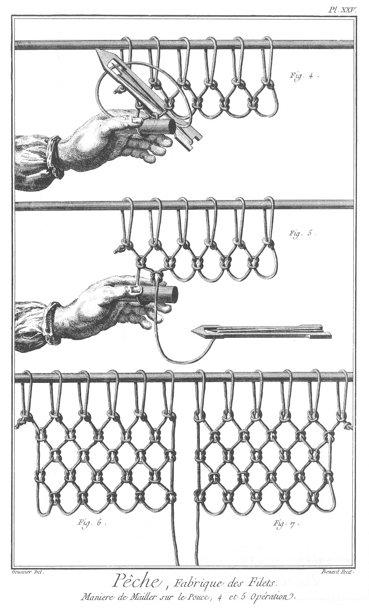](Planche_25.jpeg)

Fig.
4. Quatrieme tems de la formation de la maille ; il consiste à passer l'aiguille par-dessous & dans la maille où il a déjà été passé, il faut que l'aiguille sorte par-dedans la boucle formée dans le tems précédent.

5. Cinquieme & dernier tems de la formation de la maille ; il consiste à tirer le fil par-dessus le moule pour serrer le noeud, on continue ainsi les autres mailles.

6. Fragment du filet maillé à la seconde maniere vu par l'endroit.

7. Le même fragment vu par l'enver.

PLANCHE XXVI.
-------------

[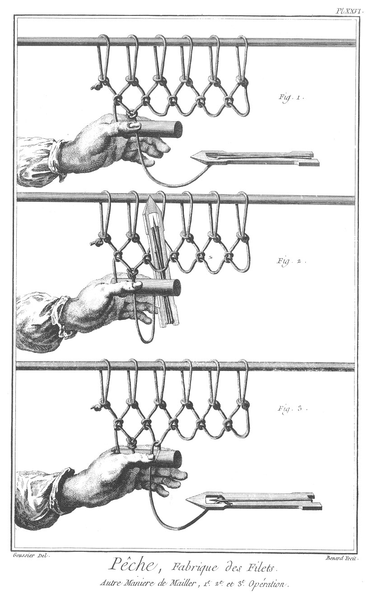](Planche_26.jpeg)

Cette Planche & la suivante représentent la troisieme maniere de lacer, ou mailler les filets.

Fig.
1. Premier tems ; le fil sur le moule, contenu par le pouce de la main gauche.

2. Second tems ; il consiste à passer l'aiguille par-dessous le moule dans la maille que l'on veut prendre.

3. Troisieme tems ; il consiste à ramener le fil sur le moule où on l'arrête avec le pouce.

PLANCHE XXVII.
--------------

[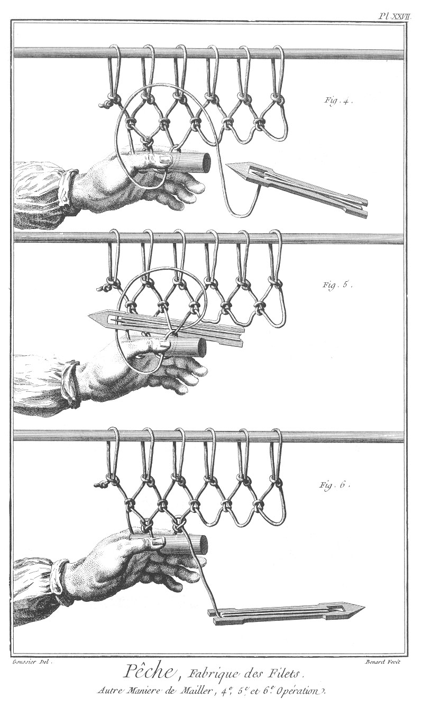](Planche_27.jpeg)

Fig.
4. Quatrieme tems ; il faut rejetter le fil en haut & sur la gauche pour former une boucle.

5. Cinquieme tems ; il consiste à passer l'aiguille dans la maille que l'on fait en embrassant en-dessous les deux fils de la maille dans laquelle l'aiguille a passé au second tems, l'aiguille doit sortir dans la boucle formée au quatrieme tems.

6. Sixieme tems ; il consiste a tirer le fil par-dessus le moule pour serrer le noeud qui forme la maille.

Dans ces trois manieres de mailler les accrues & les diminution se font de la même maniere.

Des différentes sortes de filets.

Pour faire un filet fermé comme est un sac ou pannetiere, qui se pend au cou avec une corde & se ferme comme un bourse avec deux cordons.

Il faut faire le filet de petites mailles d'un quart de pouce de large, & que la levure soit de quatre piés de longueur, afin que le sac étant fait, il ait un pié de large. Quand la levure sera faite, poursuivez le filet jusqu'à un pié de long, & pour-lors quittez le moule & prenez en un autre plus petit des deux tiers, que vous poserez pour la premiere maille comme si vous vouliez travailler. Vous passerez le bout de l'aiguille dans la premiere maille, & dans la derniere que vous rapporterez dessus l'autre, pour n'en faire qu'une des deux. Vous ferez ensuite une petite maille, laquelle étant faite, il saudra la laisser sur le moule, passer la pointe de l'aiguille dans la seconde maille, & dans celle qui précede la derniere, puis faire une autre petite maille comme auparavant ; il faut passer l'aiguille dans les mailles qui avoisinent les précédentes, & faire une troisieme petite maille, poursuivant ainsi jusqu'au bout. Le filet étant tiré par les deux côtés, ce rang de petites mailles se trouvera droit comme une ficelle, qui tiendra le filet d'un pié de large. Quand le bas aura été fait, on passera une ficelle dans la derniere maille, & dans toutes les autres du même rang, en montant jusqu'au haut. Il faut nouer les deux bouts de cette ficelle ensemble, & la mettre à un clou pour faire pendre en bas les deux autres côtés, & y faire une rangée de petites mailles, comme l'on a fait au premier côté; on passera après cela une ficelle par ce rang de petites mailles, on mettra cette ficelle à un clou pour laisser pendre le quatrieme côté, afin d'y faire pareillement une rangée de petites mailles qui tiendra le filet à la hauteur de neuf pouces. En faisant ce sac on change d'un moule plus petit pour le tenir serré, & afin qu'étant chargé il ne s'alonge, ce qui presseroit trop les oiseaux ou le gibier. Il sera aussi nécessaire d'attacher une corde aux deux côtés, afin de le pouvoir pendre, & passer deux ficelles par toutes les mailles du dernier rang de l'ouverture, pour le fermer comme une bourse. Pour faire les filets en maille quarrée, & premierement pour faire un filet qui soit de forme tout-à-fait quarrée.

Les filets qui sont faits en mailles quarrées, ont bien meilleure grace, & ne sont pas de si grande dépense, ni si difficiles à faire, que ceux qui sont faits à losanges.

Pour travailler ces sortes de filets, il faut prendre la mesure de la longueur dont on desire faire le filet avec une ficelle, laquelle on attachera d'un bout à un clou, puis prenant l'aiguille chargée de fil, & un moule de la grosseur qu'on veut la maille, il faudra tourner le fil deux fois autour du moule, nouer les deux brins ensemble & les retirer hors du moule. Ce fil ainsi noué, sera comme une boucle, laquelle servira, si on veut. de premiere maille, qu'on mettra au clou avec le bout de la mesure ; on posera après le moule dessous cette maille pour en faire une autre seconde qui sera la premiere maille du deuxieme rang, & sans l'ôter du moule, on fera de nouveau un tour de fil sur le moule, & on passera l'aiguille encore une autre fois dans la maille du premier rang, faisant un noeud comme devant. Ce sera une accrue qui fera la deuxieme maille du second rang. Il faut après cela ôter ces deux mailles du moule pour le poser sous l'accrue, ou maille qui a été faite la derniere, pour commencer le troisieme rang de la même façon qu'on a fait le second, observant de jetter toujours une accrue à la fin de chaque rangée de mailles. Ainsi le filet le fera en élargissant, & lorsqu'il sera aussi long que la ficelle ou mesure, il ne faudra plus faire d'accrue au bout des rangs ; mais au contraire, on diminuera, prenant à la fin de chaque rangée deux mailles à la fois. Pour faire un filet en mailles quarrées, qui sera plus long que large.

Les filets qui sont plus longs que larges, & faits en mailles quarrées, sont ordinairement les traîneaux, panetieres, & les hamaux ou grandes mailles d'un hallier.

Pour faire l'un de ces filets, il faut prendre avec une ficelle la mesure de la longueur & largeur qu'on lui veut donner. On attachera l'une & l'autre mesure à un clou, puis il faudra commencer la premiere maille, & la mettre au même clou pour continuer le filet, en jettant des accrues à la fin de chaque rang ; & lorsqu'il sera aussi long que la ficelle qui marque la longueur, au-lieu de faire des accrues à la fin de chaque rangée de mailles, on en prendra toujours deux à la fois. Cela étant observé, & le filet étendu, il paroîtra plus long que large, & sera à mailles quarrées. Traîneaux pour prendre des perdrix.

Le traîneau doit être de fil bien délié, & retors en deux brins. On ne lui doit pas donner plus de douze toises de long, ni moins de six. La hauteur ou largeur ne sera pas moindre de quinze piés, ni plus grande de trois toises. La maille, soit quarrée ou à losange, aura deux pouces de large. Quand tout le filet sera maillé, on le bordera tout autour d'un corde grosse comme une plume à écrire, laissant pendre à chaque coin deux bouts de la même corde, longs chacun d'un pié. On en attachera d'autres de deux en deux piés, tout le long du filet. Ces cordes servent pour lier le traîneau à deux perches qui doivent être portées par deux personnes.

On observera que si le filet est bien long & large, le fil en doit être plus fin, & la maille plus grande, afin de le rendre plus léger & plus portatif. Maniere de faire une tonnelle pour prendre les perdrix.

La tonnelle pour prendre les perdrix ne doit pas avoir plus de quinze piés de queue, ou de longueur, ni gueres plus de dix huit ponces de largeur, ou d'ouverture par l'entrée ; elle doit être faite en diminuant vers la queue, de sorte que dans le fond elle n'ait que cinq ou six pouces de hauteur ou de diametre.

Ce filet sera de bon fil retors en trois brins, qui ne soit pas trop gros, teint en couleur verte, jaune, ou minime ; les mailles en seront d'un pouce & demi, ou deux pouces de largeur. On peut lui en donner trente de levure, plus ou moins, selon la largeur des mailles. Après avoir maillé en rond, jusqu'au six ou septieme rang, alors on prendra deux mailles à la fois, à un endroit seulement, afin de diminuer le filet ; on fera la même chose de quatre en quatre rangs, pour que le filet s'étrécisse par degrés, & se trouve en finissant n'avoir plus que huit ou dix mailles de tour. Après que le filet est achevé, il faut passer dans les dernieres mailles du bout le plus large, une verge de bois bien unie, & grosse comme une baguette de fusil ; on plie en rond cette baguette comme seroit un cercle de tonneau, puis on attache les deux bouts ensemble l'un sur l'autre pour tenir le cercle en état. On mettra d'autres cercles plus petits par degrés en cinq ou six endroits, éloignés les uns des autres à proportion de la longueur de la tonnelle. Pour joindre ou attacher ces cercles au filet, il faut les faire passer dans un rang de mailles du tour, puis lier avec du fil les deux bouts de la verge ensemble, afin qu'ils ne s'ouvrent pas plus qu'il ne faut ; il faudra aussi attacher aux deux côtés du cercle de l'entrée deux piquets longs d'environ un pié & demi, qui serviront pour tenir la tonnelle tendue. On en mettra un autre long d'un pié, à la queue du filet pour le même usage.

Il faut faire deux halliers simples d'un pié de haut, pour accompagner la tonnelle, ils seront faits de mailles à losanges ou quarrées, chaque hallier sera de sept ou huit toises de longueur ; quand ils seront faits, on y attachera de deux en deux piés des piquets gros comme le petit doigt, & long d'un pié & demi, pour les pouvoir tendre aux deux côtés de la tonnelle, quand on s'en voudra servir. De quelques filets pour pêcher le poisson, & premierement de la maniere de faire les deux sortes d'éperviers.

La levure de ce filet doit être de douze mailles de deux pouces de large. On travaille ce filet en rond, & il faut faire dix rangs de mailles sur le même moule avec lequel on a fait la levure, puis changer d'un autre plus petit du demi-quart, pour continuer dix autres rangées de mailles, moins grandes que les premieres ; observant ce changement de moule à tous les dixiemes rangs, jusqu'à la fin du filet, qui sera par le bas de petites mailles à recevoir le bout du doigt selon qu'on aura diminué les moules par degrés, afin de prendre aussi bien les petits poissons que les gros. A mesure que l'on travaillera on jettera des accrues de six en six mailles au deuxieme rang d'après la levure, le troisieme rang sera sans accrues : on jettera encore des accrues au quatrieme rang, le cinquieme sans accroître, au sixieme on accroîtra ; ainsi de tous les autres rangs les uns après les autres, jusqu'à ce que le filet ait huit ou neuf piés de hauteur. Si on ne doit prendre que les gros poissons, ne changez point de moule que de quinze en quinze rangées de mailles ; ce filet doit être fait de bon fil retors en trois brins, & quand il sera fait il le faudra teindre en couleur brune avec le tan, & le monter de corde & de plomb en la maniere qui suit. Ayez vingt ou vingt-cinq livres de balles de plomb, plus ou moins, selon l'étendue du filet, qui seront grosses comme des balles de fusil, & toutes percées dans le milieu, pour les enfiler, avec une corde d'une moyenne grosseur. A chaque fois que vous aurez enfilé une balle, faites un noeud à la corde tout joignant la balle, puis enfilez-en une autre, & faites encore un noeud, de sorte qu'il s'en rencontre toujours un entre deux balles. En ayant fait un tour selon la grandeur du filet, il faudra nouer les deux bouts de la corde ensemble, & avec une aiguille couverte ou chargée de ficelle, attacher ces balles ainsi enfilées tout autour du bas du filet. Cela étant fait, prenez nombre de ficelles longues de quinze pouces. Vous les attacherez de piés en piés à la rangée de mailles qui doit être à dix-huit ou vingt pouces au-dessus du chapelet, & lorsqu'elles seront toutes nouées, vous leverez la corde ou chapelet de balles en haut, pour la lier aussi de piés en piés à l'autre bout de chaque ficelle, de façon qu'il n'y ait pas plus de neuf, dix, ou onze pouces de longueur depuis la rangée de mailles où ces ficelles sont attachées jusqu'aux balles. Par ce moyen le filet fera une espece de ventre tout autour, c'est dans ce ventre que le poisson demeure pris. Outre cela on attachera à la pointe, ou au bout du filet, une corde longue de deux ou trois toises, avec une boucle pour passer le bras dedans, afin de retirer l'épervier de l'eau.

Quant à l'autre sorte d'épervier, il est fait de la même façon que celui de ci-dessus, mais il se monte d'une autre maniere ; car au-lieu de lier une corde au bout du filet par où il a été commencé, il faut y mettre une grande boucle ou anneau qui soit de cuivre, gros comme le petit doigt, ou bien de corne épaisse de neuf lignes. On attachera autour de cette boucle les douze premieres mailles de la levure du filet, après quoi on ajustera le chapelet de balles tout autour du bas. Il faut après cela lier au chapelet des ficelles fortes & longues de six piés, & il faut qu'elles soient éloignées les unes des autres d'un pié. Elles doivent être toutes nouées ensemble au bout d'une corde, qui passe dans la boucle ; de sorte que tirant la corde par le bout (quand le filet aura été jetté) tous les endroits auxquels les ficelles sont attachées se rencontrent en un monceau les uns proches des autres. Ainsi le filet sera fermé comme une bourse, sans qu'il en puisse sortir aucun poisson que les petits qui passent au-travers des mailles. Du filet nommé rafle à poisson.

Ce filet est nommé une rafle à poisson, parce qu'étant bien fait & tendu en quelque riviere, pourvu que l'eau n'y soit pas trop rapide, il s'y prend une quantité prodigieuse de poisson.

Le plus difficile à faire de tout le filet, c'est le coffre cylindrique, qui contient tout ouvert ou monté six piés de longueur, sur trois ou quatre piés de diametre ou d'ouverture, selon la hauteur de l'eau en laquelle il doit être tendu. Si on le veut de trois piés de diametre, il faudra faire la levure de deux cens mailles d'un demi-pouce de large. Quand la levure sera faite & les mailles enfilées, on attachera la ficelle à un clou, & on continuera de mailler à l'ordinaire, jusqu'à la longueur d'un pié; après il faut joindre les deux côtés ensemble pour travailler en rond, faisant par ce moyen jusqu'à quatre piés de longueur. Quand on y sera parvenu, il faudra changer d'aiguille, & en prendre une couverte de fil en double pour en faire un rang de mailles doubles. Ce rang étant fait, on reprendra la premiere aiguille chargée de fil simple, avec laquelle on continuera le filet, en travaillant tout autour, comme devant, en prenant une maille simple, ou pour mieux dire, la moitié de chaque maille double, laissant l'autre moitié pour faire dans un autre tems la même chose qu'à celles qu'on prend, sur lesquelles ayant fait deux rangées de mailles, il faudra diminuer d'une maille à tous les quarts de tours du filet.

Supposez que le rang des mailles du tour de ce filet soit de deux cens. Lorsqu'on aura fait deux rangées complettes, on prendra deux mailles à la fois pour n'en faire qu'une des deux ; & quand on sera à la cinquantieme, on en prendra deux autres ensemble, & on poursuivra jusqu'à la centieme, pour en prendre encore deux autres à la fois, & enfin à la cent cinquantieme on fera la même chose. Ainsi le filet sera diminué d'une maille à toutes les cinquantiemes mailles, qui font le quart de deux cens, qui sera quatre mailles de diminution au rang. On observera cela à toutes les autres rangées, en suivant, non pas de cinquante en cinquante mailles, mais à tous les endroits auxquels on aura commencé de diminuer, jusqu'à ce qu'il n'y ait plus que vingt ou vingt-quatre mailles de tour, & ainsi le goulet ou l'entrée sera faire. Il faudra le laisser là & retourner prendre les rangs des mailles qui faisoient la moitié des doubles, pour faire aussi deux rangées de mailles ordinaires tout autour, lesquelles étant faites, on jettera des accrues de quarante en quarante mailles, jusqu'à vingt rangs. Quand on aura fait les vingt rangées de mailles sur ce même moule, on en changera d'un autre plus gros d'un demi-quart pour travailler dessus dix autres rangs de mailles, & après ces dix rangées, il faudra changer encore d'un autre moule plus gros d'un demi-quart, augmentant toujours par degrés, & jettant des accrues de quarante en quarante mailles, jusqu'à ce que le filet ait six ou sept piés de long, & que les dernieres mailles se trouvent d'un pouce ou d'un pouce & demi de largeur. Lorsque ce filet sera assez long, il faudra partager le dernier rang de mailles en quatre parties égales, sur deux des quatre quarts opposés ; on formera les aîles du filet en se servant du plus gros moule sans croître ni diminuer, & on le continuera autant que l'on desirera que l'aîle du filet soit longue, laissant toujours une des quatre parties entre deux aîles. Et pour achever ce filet, dont il n'y a que la moitié de fait, reprenez par où il a été commencé, pour en faire autant de l'autre côté que vous en avez de fait.

Il reste à enseigner la maniere de monter le tout. On aura cinq ou six bâtons ou petites perches de châtaignier, ou autre bois ployant, bien droites & unies, de longueur convenable, selon le tour que doit avoir le coffre du filet. Il faudra les ployer comme des cerceaux ou cercles de tonneau, en mettant les deux bouts ensemble l'un sur l'autre, & puis passer le filet par-dedans, & l'attacher tout autour à ces cercles, commençant par l'entrée sur le lieu où a été fait le rang des mailles doubles, un à l'autre bout du coffre, & les deux ou trois autres entre ces deux là en des espaces égaux. C'est dans cette espece de cylindre que sont les goulets coniques de même diametre à leur base que le cylindre, & dont les sommets qui répondent au tiers de la longueur du coffre, sont tendus par des ficelles qui s'attachent vers l'autre tiers de la longueur du cylindre ; ensorte que les deux goulets ont leurs sommets opposés, & éloignés l'un de l'autre d'environ le tiers de la longueur du cylindre.

Pour achever de voir comment il faut ajuster les quatre aîles de la rafle, on prendra une corde cablée grosse comme le petit doigt, & on la coudra au bas du filet avec une ficelle attachée au bout de la corde ; ayant passé cette ficelle dans trois ou quatre mailles, on fera deux noeuds autour de la corde, on prendra ensuite trois autres mailles, & on fera encore deux autres noeuds, continuant de même tout le long de la corde jusqu'à l'autre bout. Mettez-y après de six en six pouces des morceaux de plomb, longs de deux ou trois pouces, qui entoureront la corde. Ayant ainsi accommodé les cordes du bas de la rafle, prenez plusieurs morceaux de liége, grands de deux ou trois pouces en quarré, épais d'un pouce, lesquels seront percés dans le milieu pour y passer une corde, qui sera aussi cablée, & de même grosseur que l'autre, sur laquelle on arrangera tous ces morceaux de liége, éloignés de six en six pouces, ou de neuf en neuf, puis on y coudra le haut du filet de la même façon qu'on a fait l'autre du bas. Il faudra laisser pendre au bout de chaque aîle un morceau de la même corde, tant du haut que du bas, longue de trois ou quatre piés, pour les attacher à des perches quand on voudra tendre le filet. Maniere de faire un tramail ou filet composé de trois filets appliqués l'un sur l'autre.

Le tramail se fait ordinairement de mailles à losanges, tant pour les hamaux ou grandes mailles, que pour la toile ou les petites mailles, quoiqu'on puisse faire les hamaux à maille quarrée. La longueur d'un tramail ne se spécifie point, on le fait aussi long qu'on veut. La hauteur est ordinairement de quatre piés ; mais on le peut faire plus ou moins haut, selon la profondeur de l'eau où l'on veut pêcher.

Pour le faire il faut commencer par les hamaux, qui doivent être de ficelle ou de gros fil retors en quatre brins. Soit qu'on fasse les hamaux d'une maille ou d'autre, la toile doit en être toujours à losanges, & deux fois aussi longue & large que l'aumé, afin qu'elle ait de la poche. La maille en sera d'un pouce de largeur, & de fil retors en trois brins ; & celle de l'aumé de neuf pouces de large. Quand la toile est achevée, on passe une ficelle bien forte dans toutes les mailles du dernier rang d'en-haut & d'en-bas, puis on a plusieurs morceaux de liége de trois pouces de large & d'un pouce d'épaisseur, tous percés au milieu pour les passer sur une corde cablée grosse comme le petit doigt. Il faudra lier cette corde des deux bouts à deux arbres, à quatre piés au-dessus de terre, & ajuster les morceaux de liége tout au long, de neuf en neuf pouces. Après cela il faut étendre à terre par-dessus la corde du liége les aumés, & la toile entre deux pour les attacher avec de la ficelle au commencement de la corde proche le premier morceau de liége, puis conduisant le bord de la toile toujours entre les deux aumés, liez le tout de trois en trois pouces à la corde, sans approcher ni reculer les morceaux de liége, observant de faire froncer la toile autant qu'il en sera besoin. On aura une autre corde de même grosseur que celle où a été enfilé le liége, à laquelle il faut coudre l'autre bord de la toile & des hamaux, & lorsqu'elle sera ajustée, on y mettra le plomb.

Les pêcheurs se servent pour leurs filets de deux sortes de plombs. Ils appellent la premiere sorte des gousses de plomb, elles sont longues de deux ou de trois pouces, grosses comme le doigt ; elles ont deux branches ou crochets à chaque bout pour les assujettir à la corde qu'on fait tenir entre les crochets avec un marteau qui les rabat autour. Il faut les mettre de trois en trois pouces, selon qu'il y a plus ou moins de liége dans le haut du filet.

L'autre maniere se met aussi de trois en trois pouces, ce sont des morceaux de plomb applatis, épais comme une piece d'un écu, longs de deux ou trois pouces. On pose la corde sur le plomb, puis avec un marteau on rabat le bord dessus la corde, jusqu'à ce que le plomb soit tout-à-fait roulé.

PLANCHE XXVIII.
---------------

[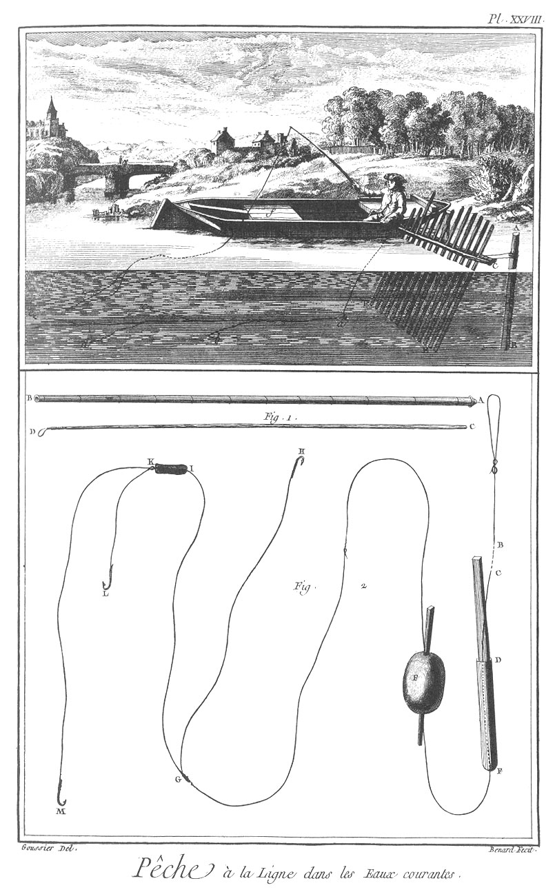](Planche_28.jpeg)

La vignette représente un païsage où l'on voit une riviere sur laquelle un pêcheur placé dans un bateau est occupé à pêcher à la ligne volante & à la ligne de fond.

- A B, un des deux pieux fichés dans le fond de la riviere pour affermir la claie, composée de perches, à l'aval de laquelle il appâte le poisson.
- C D E F, la claie.
- D C, les deux traverses entre lesquelles, comme entre deux moises, les perches qui composent la claie sont placés.

Le bateau dans lequel le pêcheur est placé contient une boutique à poissons, c'est-à-dire un retranchement dans lequel l'eau de la riviere communique ; & sur la levée de derriere un étui f g, pour placer les lignes & autres équipages nécessaires à cette pêche : la ligne volante que le pêcheur tient à la main est représentée en grand au bas de la Planche.

Bas de la Planche.

Fig.
1. La verge de la ligne, laquelle a fait donner aux pêcheurs qui s'en servent le nom de pêcheurs à verge ; elle est composée de deux parties A B & C D. La premiere est un bâton creux, ordinairement un roseau auquel on adapte le sion C D, terminé en D par une boucle à laquelle on attache la ligne ; la premiere partie sert d'étui à la seconde lorsqu'on cesse de pêcher.

2. La ligne volante ou à fouetter, parce qu'après que l'eau courante l'a entraînée de toute sa longueur, le pêcheur la retire à lui & la rejette au loin. Cette ligne, la plus fine de toutes, est composée d'un seul brin de soie ou de crin, sur laquelle on attache trois, quatre ou cinq empiles d'un seul brin de crin, chacune garnie de leurs hameçons. Cette ligne sert pour pêcher les ablettes.
	- A B C, le corps de la ligne d'environ quinze piés de long.
	- A, la boucle qui sert à l'attacher au sion.
	- C D E, plumeret ; c'est un tuyau de plume D E, dans lequel la ligne est passée.
	- C D, autre bout de plume servant de coin, que l'on introduit dans le premier pour fixer le plumeret sur la ligne à la distance convenable de son extrémité. Au-lieu de plumeret on se sert quelquefois, sur-tout pour les lignes plus grosses, d'un morceau de liége F que la ligne & un bout de plume traversent ; on nomme ce morceau de liége flotte.
	- G H, empile.
	- I K, petit morceau de plomb laminé que l'on roule autour de la ligne pour la faire caler.
	- K L & K M, autres empiles garnies chacune de leur hameçon, auquel on attache l'appât qui est un petit ver.

Une autre ligne un peu plus forte & dont les empiles sont formées par deux brins de crins retordus ensemble, sert pour pécher les goujons.

Une semblable ligne composée de trois brins, & dont les hameçons sont empilés par trois brins de crin, sert à pecher le gardon.

PLANCHE XXIX.
-------------

[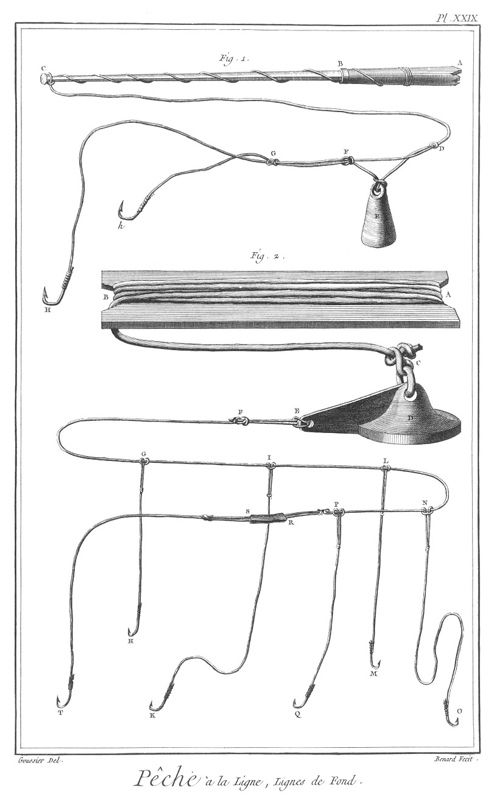](Planche_29.jpeg)

Fig.
1. Ligne de fond à soutenir, faite de fil de lin ou de soie de Grenade en plusieurs brins.
	- A B, le manche de bois d'environ huit pouces de long.
	- C D, la ligne longue de vingt-cinq ou trente piés.
	- D E F, boucle à l'extrémité de la ligne.
	- E, plomb dont le poids est proportionné à la rapidité du courant, servant à faire caler la ligne auprès du fond.
	- F G, boucle de l'empile qui est formée par six brins de crin.
	- G H, l'empile.
	- H, l'hameçon.

2. Ligne de fond à tendre.
	- A B, piece de bois sur laquelle la corde, ficelle ou fouet qui sert à descendre la ligne dans l'eau est ploté.
	- C, noeud de la corde au plomb.
	- D, le plomb.
	- D E, aileron qui empêche le plomb de tourner lorsqu'on le descend au fond de la riviere.
	- E F G. &c. la ligne de fond attachée par une boucle E F à l'aileron ; la ligne a autant de longueur que l'on veut, & est garnie d'autant d'empiles G H, I K, L M, N O, P Q, S T, qu'elle en peut contenir ; la distance G I, I L, L N, &c. entre les empiles est d'environ dix-huit pouces.

On voit dans la vignette de la Planche précédente une partie de la ligne étendue sur le fond de la riviere.
	- a, le plomb.
	- D a, la corde amarrée au bateau.
	- b, c, d, e, plusieurs empiles garnies de leurs hameçons.

PLANCHE XXX.
------------

[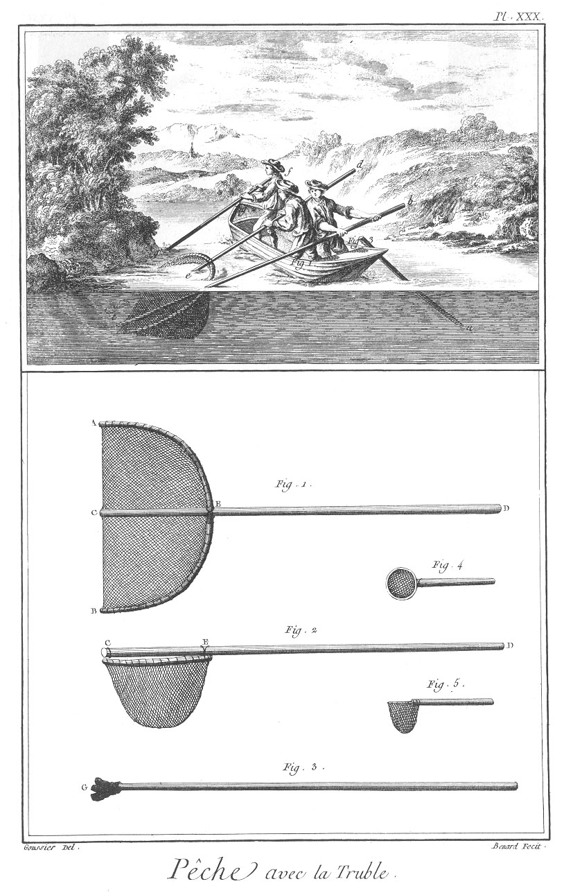](Planche_30.jpeg)

La vignette représente la maniere de pêcher avec la truble.

Pour faire cette pêche, trois hommes dans un bateau vont auprès des crones ou creux sous les berges. Le maître pêcheur, figure 1. descend la truble dans l'eau au pié de la berge en la tenant par le manche de. Ses deux compagnons, figure 2. & figure 3. après avoir arrêté le bateau au moyen de quelque perche a, prennent chacun un bouloir b c, f g, avec lequel ils foulent le fond & le dessous des crones aux deux côtés de la truble ; cela fait, le maître pêcheur la releve le plus promptement qu'il peut en se servant du bord du bateau comme d'un point d'appui, & pesant sur l'extrémité d du manche de la truble.

Bas de la Planche.

Fig.
1. Plan de la truble.
	- C D, le manche.
	- E A, E B, les enlarmes ou alarmes.
	- A B, corde à laquelle le filet qui forme le sac de la truble est enlarmé.

2. Profil de la truble.
	- C E D, le manche.

3. Bouloir dont se servent les compagnons du maître pêcheur ; c'est un bâton F G, de douze ou quinze piés de long, l'extrémité G est garnie de quelques pieces de vieux chapeau pour effrayer le poisson & le chasser d'autant mieux dans la truble.

4. Puisette servant aux pêcheurs à la ligne pour enlever les gros poissons qui sont pris à leur ligne, & éviter en passant cet instrument par-dessous le poisson lorsqu'il est à fleur d'eau, la rupture de la ligne, ou que le poisson ne se déprenne.

5. Profil du même instrument qui est composé d'un manche de bois, d'un cercle de gros fil de fer sur lequel est monté un filet en forme de poche ; cet instrument ou un semblable à chassis quarré, sert à puiser le poisson qui est dans la boutique du bateau.

PLANCHE XXXI.
-------------

[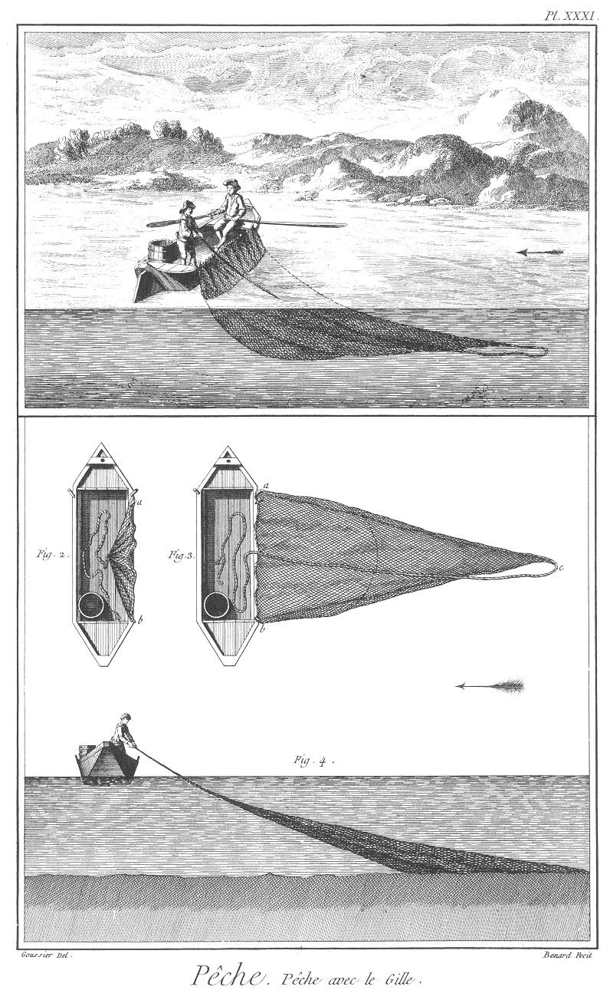](Planche_31.jpeg)

La vignette représente la maniere de pêcher avec le filet qu'on appelle gille: dans l'instant où le filet est pêchant, deux hommes sont dans le bateau, l'un manoeuvre avec les avirons pour contenir le bateau en travers du courant de la riviere, & le second tient la corde de la queue du filet pour le relever ensuite ; on voit par la direction de la fleche qui indique le courant que le filet est jetté du côté d'amont.

Fig.
2. Plan du bateau dans lequel on voit le filet prêt à être jetté à l'eau ; la corde du plomb de ce filet, dont la forme totale est un cône ou chausse pointue, est arrêtée sur deux tourets ou deux clous a & b, entre lesquels il y a environ le quart de la circonférence de la corde plombée de l'ouverture du filet ; en accrochant cette corde aux clous dont on vient de parler, on a l'attention de la tordre un demi-tour sur elle-même, pour que jettant le filet à l'eau en le renversant par-dessus le bord du bateau, le filet se trouve accroché par sa partie intérieure comme la figure suivante le fait voir.

3. Plan du filet jetté à l'eau & dans l'état que la vignette représente. a b, quart de la corde du plomb qui est accrochée aux tourets, les trois autres parties sont ainsi disposées ; une partie descend du touret a, une autre du touret b, au fond de la riviere ; la troisieme partie qui joint les deux autres traîne sur le fond, ensorte que l'ouverture du filet forme comme un quarré dont un côté traîne sur le fond, & l'autre est attaché au bateau qui en dérivant plus vîte que le filet, l'entraîne & le fait étendre du côté d'amont ; lorsque l'on veut fermer le filet, on le décroche au point a & b, cette partie du filet tombe au fond de l'eau, & le filet se trouve dans la position de la figure suivante.

4. Le filet entierement jetté à l'eau, le pêcheur qui est dans le bateau travaille à le relever au moyen de la corde qu'il tient dans ses mains ; à mesure qu'il tire cette corde, les plombs de l'ouverture du filet se rapprochent les uns des autres, & en ferment l'ouverture avant même que le filet ait quitté le fond de l'eau.

PLANCHE XXXII.
--------------

[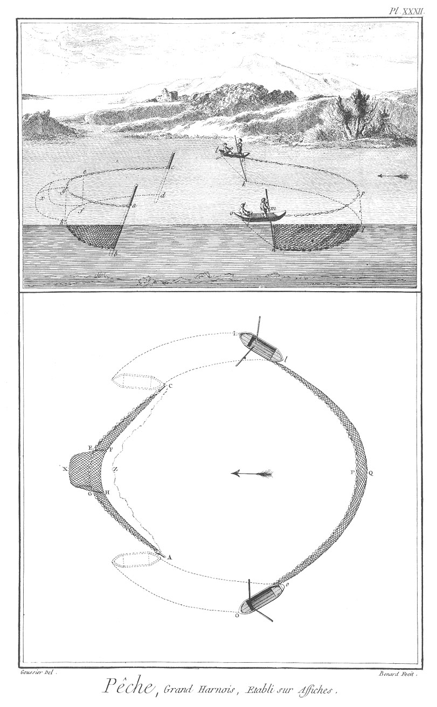](Planche_32.jpeg)

La vignette représente la maniere de pêcher les aloses avec le filet nommé alosiere: ce filet dont on peut se servir dans les eaux stagnantes aussi-bien que dans les eaux courantes, est un grand sac dont l'ouverture est quarrée & a environ quarante piés d'un bateau à l'autre sur dix de hauteur, la profondeur du sac est d'environ 15 à 20 piés.

La partie supérieure de l'ouverture du sac est garnie de flottes de liege pour la soutenir à fleur de l'eau, & la partie inférieure est plombée. Les quatre coins du filet sont arrêtés par des cordes aux deux bateaux qui servent à le manoeuvrer. Les extrémités de la corde du liege sont arrêtées aux tourets de l'arriere des bateaux, & les extrémités de la corde du plomb le sont au moyen d'une corde au touret de l'avant ; un des deux hommes dans chaque bateau appuie avec un croc sur cette corde pour faire caler le bas du filet, & par ce moyen le tenir ouvert. Bas de la Planche.

Il représente le plan de la même pêcherie.

PLANCHE XXXIII. Grand harnois pour pêcher dans les eaux courantes.
------------------------------------------------------------------

[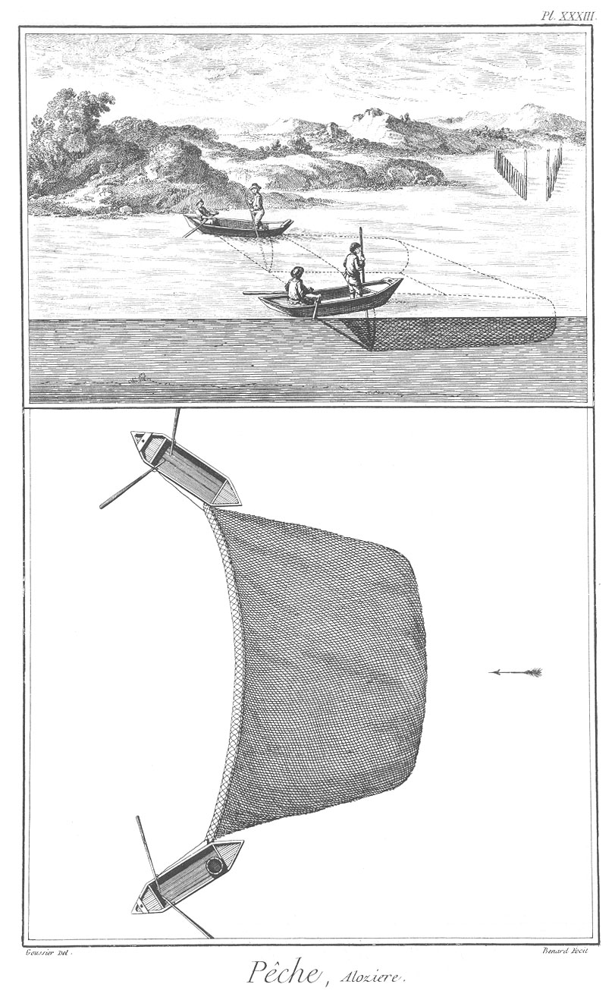](Planche_33.jpeg)

La vignette représente la campagne sur le bord d'une riviere, qui coule dans la direction indiquée par la fleche & les deux filets dont on se sert, l'un fixe & l'autre mobile.

Le filet fixe est composé d'un sac e f x g h, terminé par deux aîles e c f d, g a h b, qui s'ouvrent au-devant du courant ; elles sont terminées & fixées à leurs extrémités par les fiches ou affiches a b, c d, qui sont fixées dans le lit de la riviere ; le filet est garni de flottes de liége le long de la corde a g e c, & il est plombé à la partie inférieure b h f d, pour qu'il se soutienne verticalement & à fleur d'eau dans le courant, l'ouverture du sac a douze ou quinze piés d'ouverture de g en e, ou de h en f, sur une hauteur g h ou e f, de huit piés, la profondeur du sac est d'environ autant ; les aîles du filet ont environ quinze brasses de longueur chacune, & vont en rétrécissant vers les affiches ou bâtons a b c d, où elles n'ont que cinq ou six piés de haut.

Le filet mobile i p m, placé en-travers du courant à l'amont du filet sédentaire, est également flotté le long de la corde i p m, & plombé le long de la corde inférieure k q n ; sa hauteur est d'environ huit piés dans le milieu en p q, & seulement de six piés vers les extrémités i k, m n, par lesquelles il est attaché aux deux bateaux qui servent à le manoeuvrer. Dans chaque bateau il y a deux hommes, l'un l ou o, qui conduit le bateau avalant avec les avirons ou avec un picot qu'il appuye au fond de la riviere ; le second i ou m, appuye avec un croc sur la corde du bas du filet pour la faire caler, & par ce moyen le tenir étendu de toute sa hauteur. La corde du liége est attachée aux tourets i & m, fixés dans les bords du bateau, & celle du plomb l'est à l'avant des mêmes bateaux en l & en o, par les cordes k l, n o, ensorte qu'elle conserve dans l'eau pendant toute sa marche la situation verticale que la figure représente.

Pour pêcher avec ces filets, après que le filet sédentaire est tendu, les pêcheurs s'éloignent en remontant leurs bateaux à cent ou deux cens brasses, plus ou moins, au-dessus ou à l'amont du filet sédentaire, & là ils se séparent & tendent le filet mobile en-travers du courant, & nagent ensuite avalant avec plus de vîtesse que le courant ; ils ramenent les deux extrémités de leur filet aux affiches a & c ; le filet mobile qui pendant toute la marche étoit convexe du côté d'amont, comme on le voit en p q, parce que la vîtesse des bateaux qui le tiroient étoit plus grande que celle du courant, change alors de figure & devient convexe du sens opposé, puisque le courant continuant d'agir sur son milieu, continue à le faire descendre pour le faire appliquer au filet sédentaire : tout le poisson qui s'est trouvé dans le chemin du filet mobile est ainsi forcé de se jetter dans le sac du filet sédentaire. Bas de la Planche.

Il représente le plan de la même pêche.

- A, C, les affiches auxquelles le filet est attaché.
- A G H, C E F, les aîles du filet sédentaire.
- G E F H, l'ouverture du sac.
- X, le fond du sac.
- C E G A, la corde du liége.
- C F H A, la corde du plomb.
- C Z A, le filet mobile plissé & près de s'appliquer au moyen de la force du courant au filet sédentaire pour fermer l'ouverture du sac dans lequel le poisson est entré.

Le filet mobile P Q est tiré avalant par les deux bateaux L l, O o, ainsi que le fait connoître la fleche placée entre les deux filets ; elle sert à indiquer la direction du courant les lignes ponctuées depuis les bateaux jusqu'aux affiches A & C, font connoître la marche des mêmes bateaux, qui sont arrêtés aux affiches par le touret auquel la corde P du liége est fixée ; la corde du plomb l Q o reste un peu à l'arriere ou amont pendant la marche du filet.

PLANCHE XXXIV.
--------------

[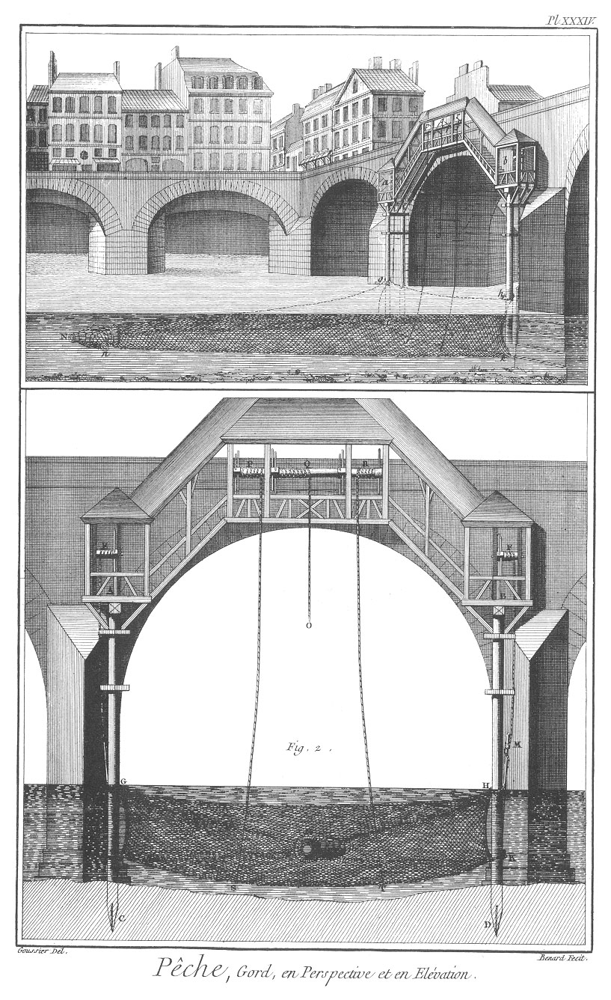](Planche_34.jpeg)

Gord, sorte de filet sédentaire établi à l'aval de l'arche d'un pont sur une eau courante ; tel est celui établi à Paris au pont Notre-Dame ; c'est celui que la vignette représente, ou ceux établis à Saint-Cloud, qui ne different de celui-ci qu'en ce qu'ils sont plus petits, les arches de ce pont ayant moins d'ouverture.

Le filet que l'on nomme aussi guido, est une grande chausse ou entonnoir dont l'ouverture g h k i, est un quarré, dont la longueur g h est égale à la largeur de l'arche, & la hauteur h k de quinze ou dix-huit piés. Sa longueur jusqu'à la nasse N qui la termine est de douze à quatorze toises ; il est représenté tendu dans la vignette, & en état de prendre le poisson.

Le filet est arrêté au pont par deux pieux, le long desquels les boucles qui terminent les quatre angles du quarré de son ouverture peuvent monter & descendre ; les boucles g & h sont à fleur d'eau ou peu élevées au-dessus, les boucles de fond i & k sont arrêtées à une espece de palonier qui embrasse le pieu du côté opposé au filet, on enfonce ces morceaux de bois, & par conséquent la partie du filet qui y est attachée au moyen de deux longs bâtons dont ils sont emmanchés, & que par cette raison on a nommés enfonçoirs.

Au-dessus des pieux dont on a parlé sont construits des cabinets a & b, dans chacun desquels il y a un treuil qui, au moyen d'une corde, sert à relever l'enfonçoir au-dessus duquel il répond ; sur le milieu de l'arche est une galerie à laquelle les cabinets communiquent par des escaliers ; cette galerie contient trois treuils p q r, les deux des extrémités reçoivent les cordes p s, r t ; ils servent avec les deux treuils des cabinets, à relever le bas de l'ouverture du filet, & à rapprocher la corde du fond i s t k de la corde g h du dessus ; le troisieme treuil q sert, au moyen de la corde q o, que l'on attache à l'extrémité du filet du côté de la nasse, à relever le filet hors de l'eau, pour le faire sécher au-devant du vuide de l'arche, après toutefois en avoir détaché la nasse N n qui est reçue dans le bateau ou la barque du pêcheur. Bas de la Planche.

Fig.
2. Elévation géométrale du même filet tendu vu du côté d'aval.
	- A C, B D, les deux pieux qui servent de guide aux boucles du filet & aux enfonçoirs, ces pieux en cachent d'autres qui sont semblables ; celui de derriere est relié à celui de devant par des moises & le chapeau qui les assemble ; c'est sur les chapeaux que sont construits les cabinets dans lesquels sont les treuils E & F, qui servent à relever les enfonçoirs.
	- G H, corde du dessus du filet.
	- G I, H K, côtés ou aîles du filet.
	- I S T K, corde de fond du filet.
	- N n, la nasse.
	- I L, K M, les enfonçoirs.
	- P & R, treuils dans la galerie pour relever au moyen des cordes P S, R T, le fond du filet, en même tems que les deux treuils E & F relevent les enfonçoirs.
	- Q O, corde du treuil du milieu pour relever entierement le filet par la partie qui joint la nasse N.

PLANCHE XXXV.
-------------

Suite de la précédente, contenant le plan du gord & les développemens nécessaires de la nasse & des enfonçoirs.

Fig.
3. Plan du filet & d'une partie des deux piles de l'arche, à l'aval de laquelle il est placé, ainsi que la fleche le fait connoître.
	- A & B, partie du plan des deux piles.
	- C & D. plan des deux pieux qui servent de guide aux enfonçoirs ; on voit par ce plan comment les palonniers dont on a parlé embrassent le pieu du côté d'amont.
	- c & d, plan des deux autres pieux qui, avec ceux cotés C & D, soutiennent les cabinets. C D f e, le filet étendu, & auquel est adaptée la nasse e N f.

4. Enfonçoir vu du côté d'aval ou du côté de sa concavité, qui s'applique au pieu qui lui sert de guide.
	- A B, le palonnier.
	- C L, le manche ou enfonçoir proprement dit ; il est traversé de plusieurs chevilles ou échelons pour pouvoir le faire descendre en montant dessus : la partie supérieure est liée par la corde qui va au treuil d'un des cabinets ; on a fracturé le manche, parce que sa longueur n'auroit pas pu tenir dans la Planche. Cette figure ainsi que les suivantes, est dessinée sur une échelle double.
	- A D B, corde à laquelle en D est attachée la boucle inférieure du filet.

5. Second palonnier vu du côte d'amont ou du côté convexe.
	- b & a, crochets du palonnier.
	- K M, manche.

6. Nasse en perspective dessinée sur une échelle quadruple.
	- F, ouverture de la nasse qui se raccorde intérieurement avec l'extrémité du filet.
	- N, petit bout de la nasse par lequel on fait sortir le poisson qui y est pris ; on ferme cette ouverture avec un tampon ou un morceau de filet.
	- n, seconde nasse ou réduit de la grande nasse.

7. Coupe de la nasse & du réduit par le milieu de sa longueur.

[->](../18-Peintures_en_Huile,_en_Miniature_et_Encaustique/Légende.md)
