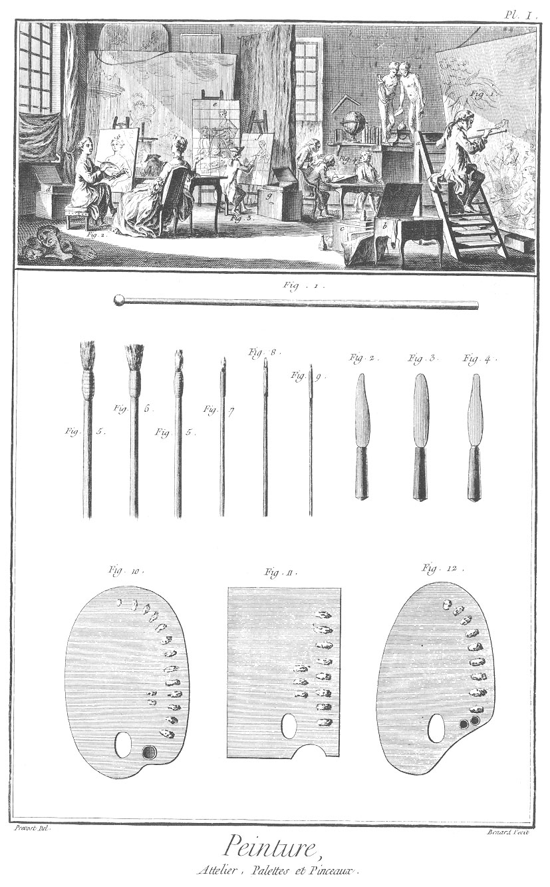
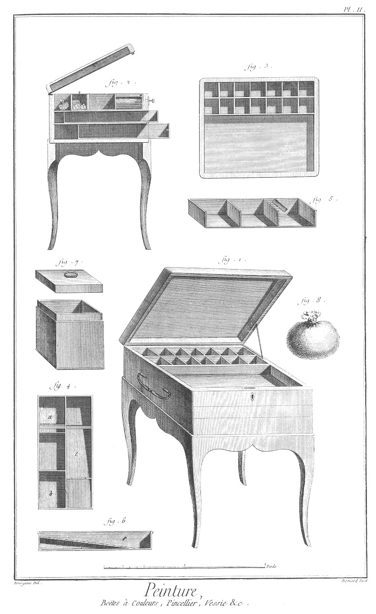
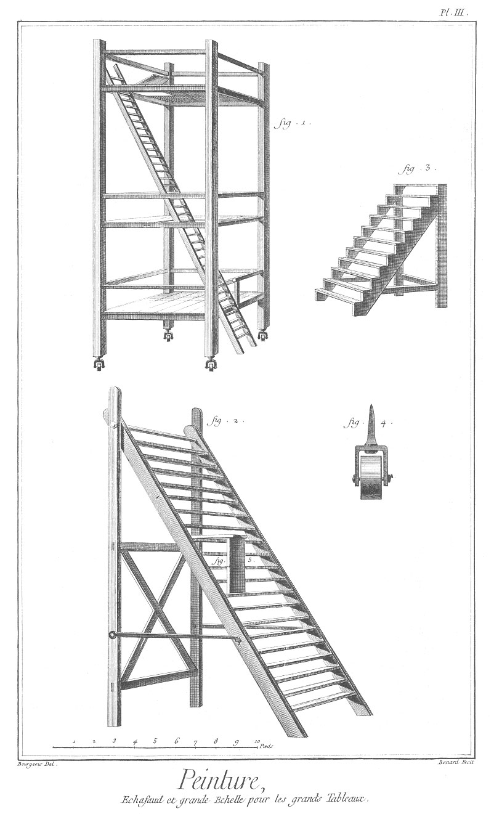
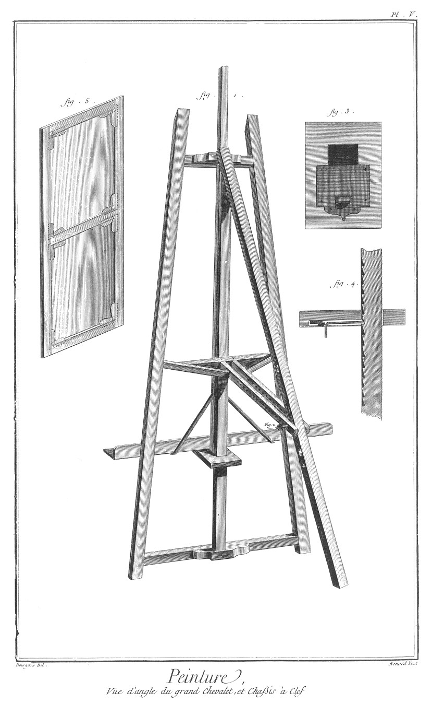
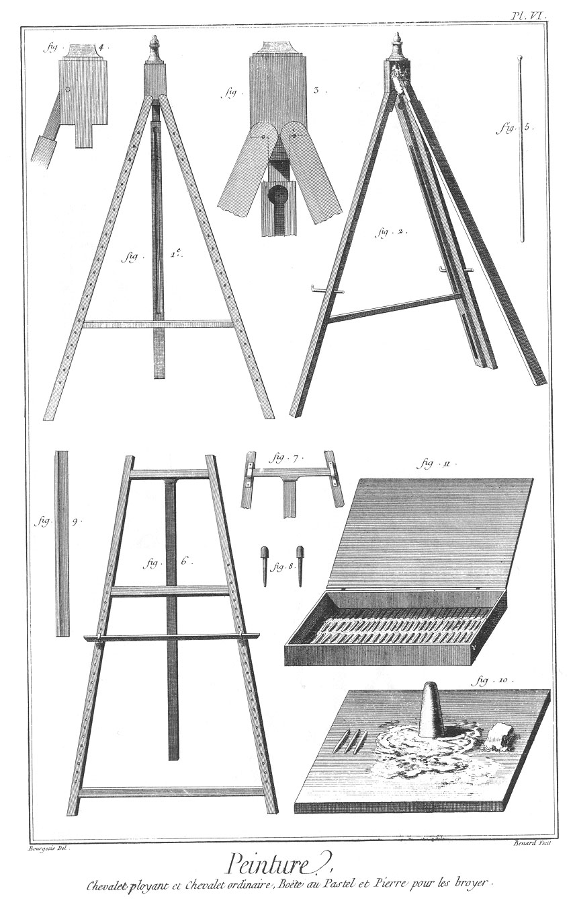
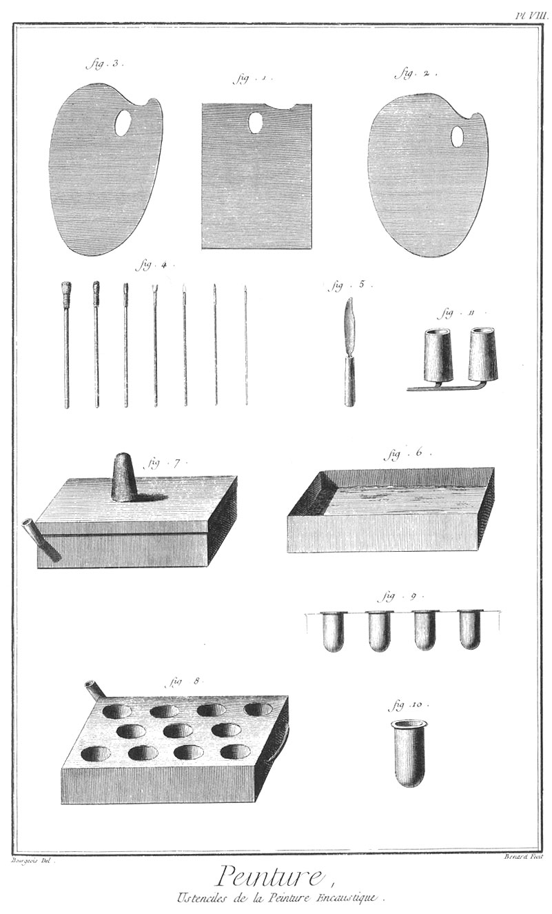

PEINTURES EN HUILE, EN MINIATURE ET ENCAUSTIQUE
===============================================

Contenant huit Planches.

PLANCHE Iere.
-------------

Vignette. Cette vignette représente un attelier dans lequel on a tâché de réunir plusieurs genres de peintures.

La fig.
1. représente le peintre d'histoire.
	- a, son marchepié.
	- b, le pincellier ou grande boîte à couleurs.
	- c, pierre à broyer les couleurs.

La fig.
2. représente le peintre de portraits. d, sa boîte à couleurs.

La fig.
3. représente un peintre occupé à réduire un tableau dont il veut faire une copie.
	- e, le tableau qui lui sert de modele.
	- f, la toile sur laquelle il a tracé autant de carreaux qu'il en a fait sur celui qu'il se propose de réduire (ou de copier).

La fig.
4. représente le peintre de portrait en miniature.

On apperçoit dans le fond de l'attelier deux figures antiques, un globe, une équerre & des livres qui sont autant de choses utiles aux peintres, & qui désignent l'étude des antiques, l'histoire, la géographie & l'architecture.

Bas de la Planche.

Fig.
1. Appui-main.

2. &
3. &
4. Couteaux de différentes formes.

5. & 5. Brosses.

6. Bléreau dont on se sert pour fondre les couleurs.

7. &
8. &
9. Pinceaux.

10. &
11. &
12. Palettes de différentes formes.

PLANCHE II.
-----------

Fig.
1. Boîte à couleurs.

2. Coupe de cette boîte.

3. Son plan.

4. Boîte de fer blanc pour contenir les pinceaux & les vessies.
	- a le pincelier.
	- b, quarré pour mettre les vessies.
	- c, quarré dans lequel on met l'huile d'olive pour détremper les pinceaux.

5. Coupe du pincelier.

6. Coupe du quarré qui sert à faire tremper les pinceaux.

7. Autre boîte de fer-blanc pour mettre les couleurs en poudre.

8. Vessie pour mettre les couleurs brouillées.

PLANCHE III.
------------

Fig.
1. Grand échaffaud à roulettes pour les grands tableaux.

2. Grande échelle avec son banc pour le même usage.

3. Petit marche-pié.

4. Roulettes de l'échaffaud, fig. 1.

5. Banc qui s'accroche aux échellons de la fig. 2.

PLANCHE IV.
-----------

Fig.
1. Chevalet dont la barre se monte sans cheville par le moyen du ressort 5 qui appuie sur les dentures. 6 le montant de ce chevalet qui sert à retenir les grandes toiles à volonté, à la hauteur convenable.

2. Toile tendue sur un chassis commun.

3. Gode miché double pour contenir l'huile grasse & l'huile d'oeillet.

4. Gode-miché simple.

PLANCHE V.
----------

Fig.
1. Vue d'angle du chevalet, fig. 1. de la Pl. précédente, chiffre

2. cheville qui empêche de remuer la queue.

3. Plan du ressort.

4. Chappe du même ressort avec les dentures.

5. Toile tendue sur un chassis à clé.

PLANCHE VI.
-----------

Fig.
1. Chevalet vu de face, & qui se ploie du sens que l'on veut.

2. Vue perspective du même chevalet.

3. Partie du même chevalet vue par derriere avec emmanchemens.

4. Profil du même chevalet.

5. Appui-main.

6. Chevalet ordinaire.

7. Partie du même chevalet vue par derriere.

8. Chevilles.

9. Barre pour poser les toiles que l'on peint.

10. Pierre à broyer les pastels.

11. Boîte au pastel.

PLANCHE VII. Ustensiles à l'usage du peintre en miniature.
----------------------------------------------------------

Fig.
1. &
2. &
3. Différentes palettes d'ivoire.

4. &
5. Petits pots d'ivoire pour mettre les couleurs, & que l'on renferme dans une boîte d'ivoire.

6. Différentes sortes de pinceaux.

7. &
8. &
9. Trois sortes de couteaux qui servent à broyer les couleurs.

10. Forme de palette dans laquelle sont creusés différens trous pour contenir les couleurs.

11. Loupe.

12. Pierre à brouiller les couleurs.

13. Boîte d'ivoire pour mettre les petits pots à couleurs.

14. Boîte pour renfermer tous les ustensiles du peintre, lorsqu'il va en ville.

15. Pierre de ponce.

PLANCHE VIII. Ustensiles à l'usage de la peinture encaustique.
--------------------------------------------------------------

Fig.
1. &
2. &
3. Différentes palettes.

4. Différens pinceaux.

5. Couteau à brouiller les couleurs sur les palettes.

6. Forme de boîte, dans laquelle on met de l'eau chaude pour fondre les couleurs.

7. Pierre à broyer les couleurs, & que l'on place sur la fig. 8.

8. Boîte dans laquelle sont les places des godets qui contiennent les couleurs que l'on fait chauffer.

9. &
10. Maniere dont on doit faire les godets à couleurs.

[->](../19-Plombier/Légende.md)
