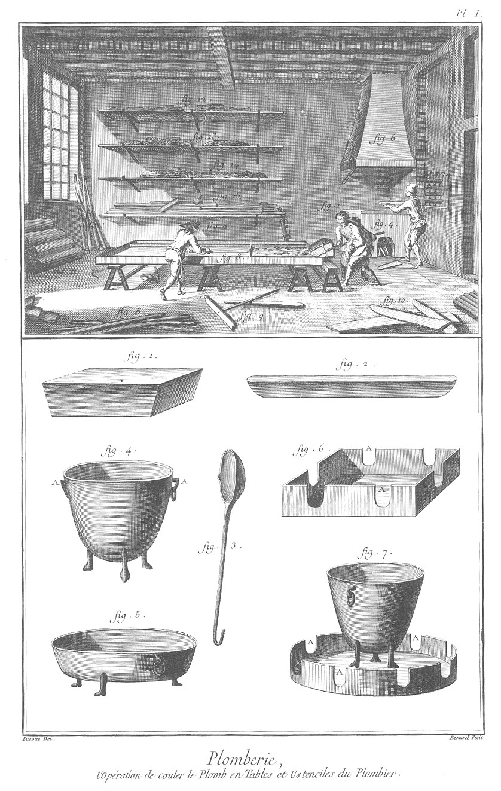
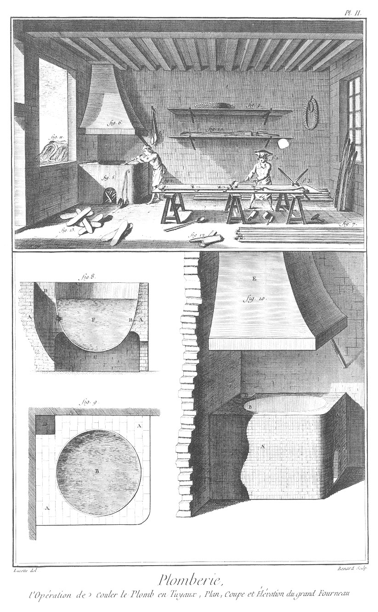
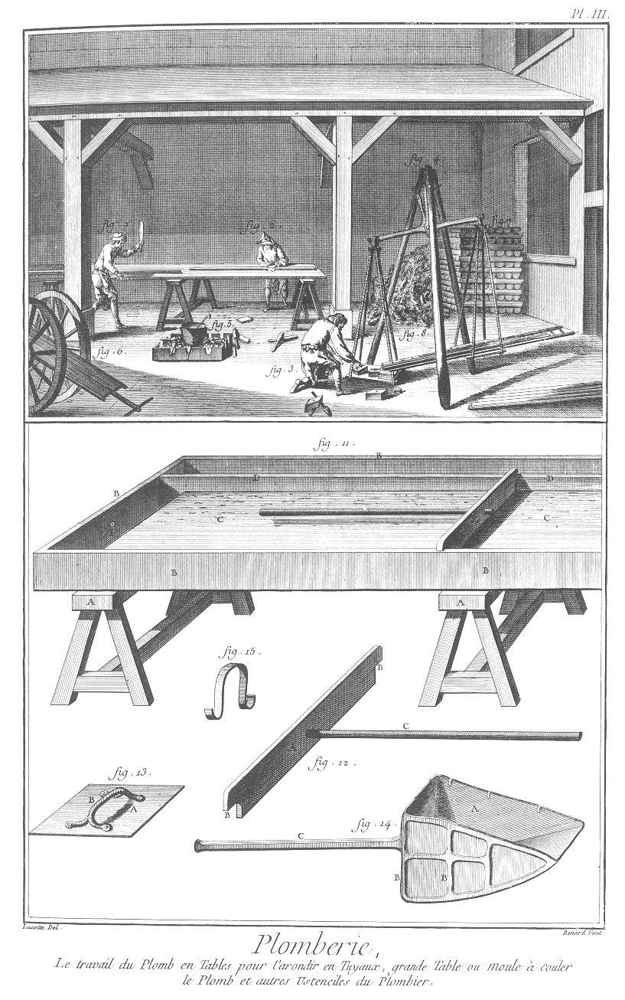
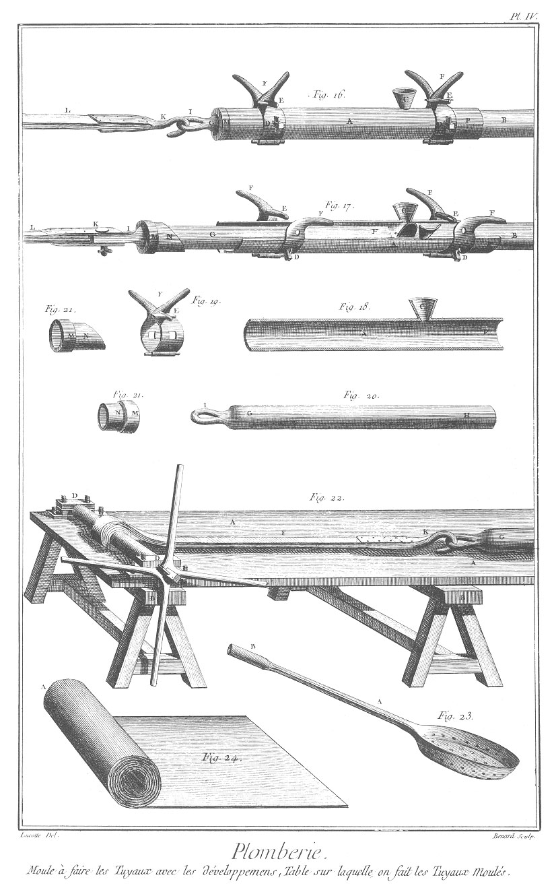
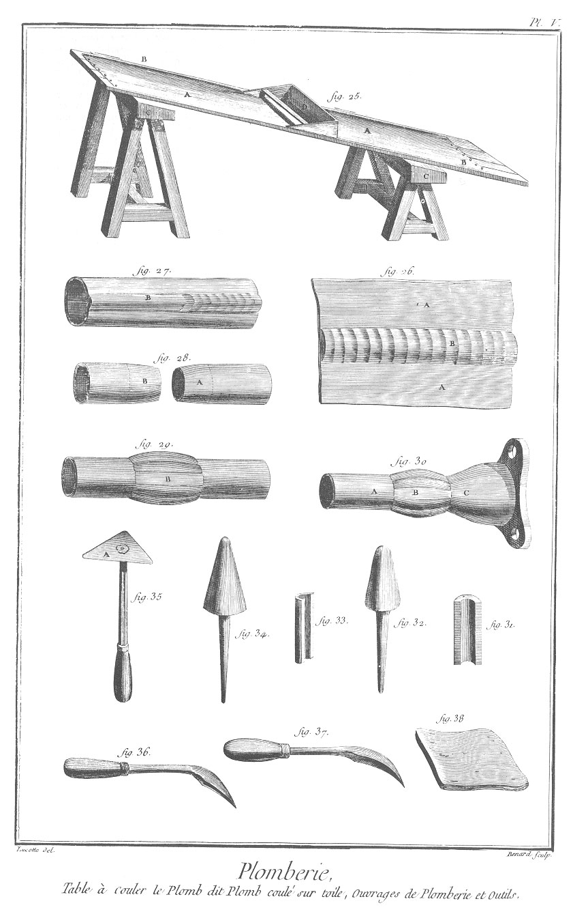
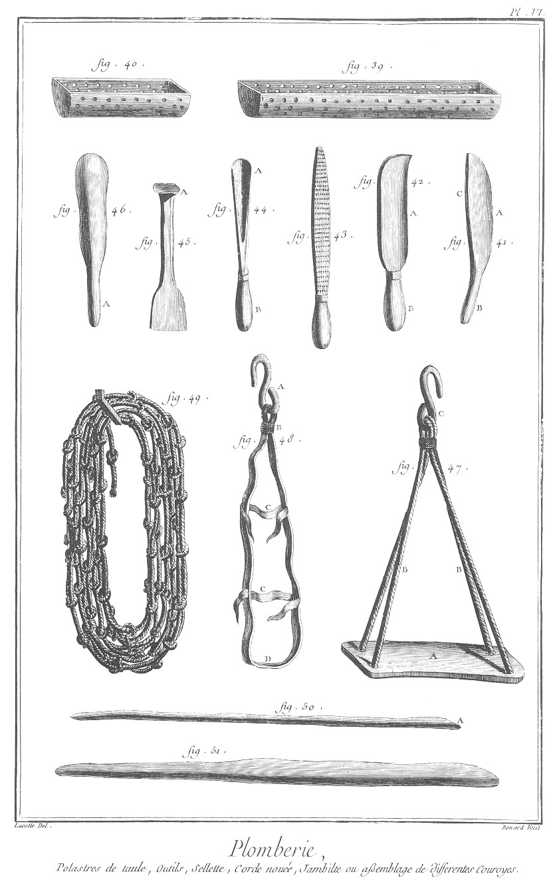
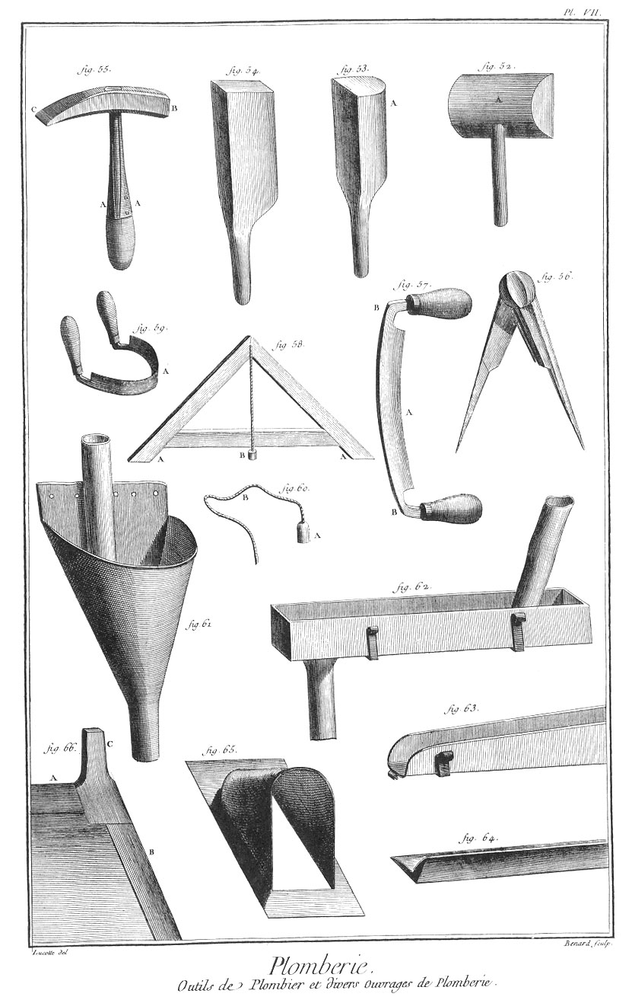

PLOMBIER
========

Contenant sept Planches.

PLANCHE Iere.
-------------

Le haut de la Planche ou la vignette montre la boutique du plombier qui coule le plomb en tables.

Fig.
1. &
2. Ouvriers qui coulent le plomb en tables.

1. Ouvrier qui tient la poële à verser.

2. Ouvrier qui reçoit le plomb sur le rable.

3. Moule.

4. Fourneau.

5. Ouvrier qui met du plomb au fourneau.

6. Hote ou cheminée du fourneau.

7. Tas de saumons.

8. Leviers.

9. Rable.

10. Planches.

11. Rouleaux de plomb.

12. &
13. &
14. &
15. Tablettes où sont des cordes, des maillets, des battes, &c.

Explication du bas de la Planche.

Fig.
1. Plomb en navette.

2. Plomb en saumon.

3. Cuillere de fer.

4. Marmite de fer.
	- A A, les anneaux.

5. Poële de fer.
	- A, l'anneau.

6. Polastre.
	- A A, les lumieres.

7. Autre polastre.
	- A A, les lumieres.

PLANCHE II.
-----------

Le haut de la Planche ou la vignette montre la boutique du plombier qui coule le plomb en tuyaux.

Fig.
1. Ouvrier qui coule le plomb moulé en tuyaux.

2. &
3. Table sur laquelle on coule les tuyaux.

4. Ouvrier qui puise du plomb pour le couler.

5. &
6. Le fourneau & sa hote ou cheminée.

7. Tuyaux moulés.

8. Cuilleres à couler.

9. &
10. Tablettes.

11. Vieux plombs.

12. Une batte.

13. Plomb en saumon. Explication du bas de la Planche.

Fig. 8. 9. 10. Fourneau.

8. en est la coupe.

9. en est le plan géométral.

10. en est l'élévation perspective.
	- A A, le fourneau.
	- B, la chaudiere.
	- C, l'âtre.
	- D, la cheminée.
	- E, la hote.

PLANCHE III.
------------

Le haut de la Planche ou la vignette montre la cour ou le hangard du plombier qui travaille du plomb en tables, & qui pese des tuyaux.

Fig.
1. Ouvrier qui bat du plomb en tables pour l'arrondir en tuyaux.

2. Ouvrier qui soude.

3. Ouvrier qui pese des tuyaux.

4. La balance.

5. Polastre où l'on fait fondre le plomb & chauffer les fers.

6. Charrette à l'usage du plombier.

7. Saumons entassés.

8. Vieux plombs.

Explication du bas de la Planche.

Fig.
11. Moule ou table à couler le plomb en tables.
	- A A, les tréteaux.
	- B B, la caisse à couler.
	- C C, le plomb coulé.
	- D D, la cloison mobile.
	- E, le rable.
	- F, la cavité pour le surplus du plomb.

12. Rable.
	- A, le rable.
	- B B, les échancrures.
	- C, le manche.

13. Plane.
	- A, la plane de cuivre.
	- B, la poignée.

14. Poële à verser.
	- A, l'auget.
	- B B, l'armature.
	- C, le manche.

15. Crampon.

PLANCHE IV.
-----------

Fig.
16. &
17. &
18. &
19. &
20. &
21. Moule à faire les tuyaux, avec toutes les parties qui lui appartiennent, vues séparément.
	- A, le moule.
	- B, la partie du tuyau moulé.
	- C, l'entonnoir ou jet.
	- D D, les goujons pour arrêter les brides.
	- E E, les boulons des brides.
	- F F, les queues des brides.
	- G H, le mandrin.
	- I, la patte du mandrin.
	- K, le boulon pour l'arrêter au tirage.
	- L, le tirage.
	- M N, les bouchons du moule.
	- O, extrémité du moule.

22. Table sur laquelle on fait les tuyaux moulés.
	- A, le dessus de la table.
	- B B, les tréteaux.
	- C, le rouleau à tirer le mandrin.
	- D, les coussinets.
	- E, le moulinet.
	- F, le bandage.
	- G, le mandrin.
	- K, le crochet du bandage.

23. Poële à marons, ou cuillere percée à écumer.
	- A, la queue.
	- B, la douille.

24. Rouleau de plomb en table.
	- A A, la partie roulée.

PLANCHE V.
----------

Fig.
25. Table de toile à couler le plomb dit plomb coulé sur toile.
	- A A, le dessus de la table couvert en toile.
	- B B, les deux extrémités.
	- C C, les deux tréteaux.
	- D, le rable à main.

26. Fragmens de table soudés à côte.
	- A A, les deux parties de table.
	- B, la soudure à côte.

27. Table de plomb recourbée sur elle-même en forme de tuyau, & soudée à côte.
	- B, la soudure à côte.

28. Bouts de tuyaux amincis & prêts à être soudés à noeuds.
	- A B, les bouts préparés & grattés.

29. Les mêmes bouts soudés à noeuds.
	- B, la soudure à noeuds.

30. Noeud de soudure qui joint un bout de tuyau avec une calotte de cuivre, à l'usage des pompes.
	- A, le bout d'un tuyau.
	- B, le noeud de soudure.
	- C, la calotte de cuivre.

31. &
33. Deux manches de bois à prendre les fers à souder.

32. &
34. Fers à souder.

35. Grattoir.
	- A, le grattoir.

36. &
37. Grattoirs à deux tranchans.

38. Porte-soudure.

PLANCHE VI.
-----------

Fig.
39. &
40. Polastres de tôle de différentes longueurs On les glisse dans les tuyaux à souder pour les échauffer ; ils sont percés de trous.

41. Tranchet.
	- A, le taillant.
	- B, le manche.
	- C, le dos.

42. Serpe.
	- A, le taillant.
	- B, le manche.

43. Rape.

44. Gouge.
	- A, le taillant.
	- B, le manche.

45. Ciseau.
	- A, la tête.

46. Batte.
	- A, le manche.

47. &
48. &
49. Machines à travailler au sommet des bâtimens sans échelle & sans échaffaud.

49. Corde nouée.

48. Jambette ou assemblage de différentes courroies.
	- A, l'esse.
	- B, le lien de la courroie.
	- C C, les courroies de traverse.
	- D, la place du pié.

47. Sellette.
	- A, la sellette.
	- B B, les cordages pour la suspendre.
	- C, l'esse.

50. Bâton à labourer.
	- A, le bout.

51. Levier.

PLANCHE VII.
------------

Fig.
52. Batte plate.
	- A, la batte.
	- B, le manche.

53. Autre batte.
	- A, la batte.

54. Troisieme sorte de batte.

55. Marteau du plombier.
	- A A, les platines du manche.
	- B, la tête.
	- C, la panne.

56. Compas.

57. Plane.
	- A, le taillant.
	- B B, les coudes.

58. Niveau.
	- A A, les piés.
	- B, le chal du plomb.

59. Débordoir.
	- A, le taillant.

60. Plomb à jauger.
	- A, le chal.
	- B, le fouet.

61. &
62. &
63. &
64. &
65. &
66. Divers ouvrages de plomberie.

61. Ce qu'on appelle communément plomb dans les maisons.

62. Chaineau ou échénal.

63. Gouttiere.

64. Autre gouttiere.

65. Lucarne.

66. Portion de comble.
	- A, la partie du faîtage.
	- B, celle de la croupe.
	- C, celle du poinçon.

[->](../20-Laminage_du_Plomb/Légende.md)
