LAMINAGE DU PLOMB
=================

Contenant douze Planches équivalentes à dix-huit Planches, à cause de six doubles.

PLANCHE Iere.
-------------

[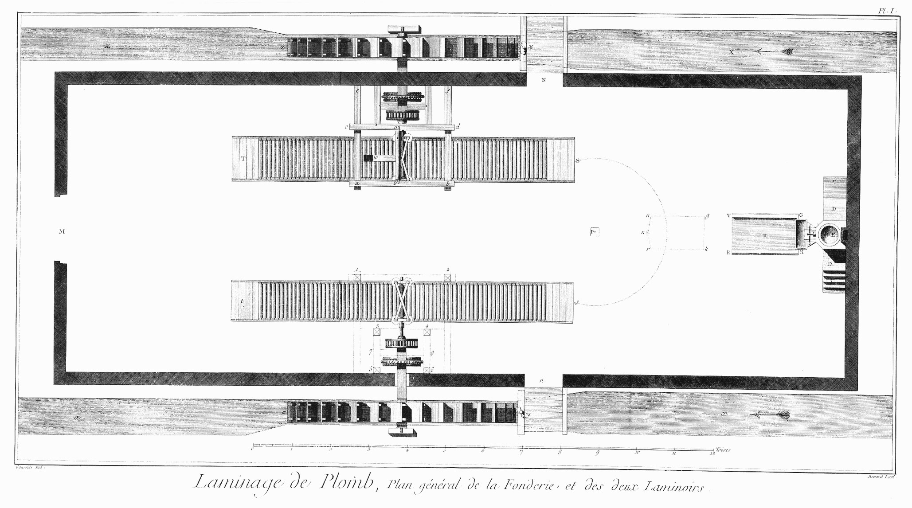](Planche_01.jpeg)

Plan général de la fonderie & de deux laminoirs renfermés dans le même attelier, & mus par le courant de l'eau.

La halle dans laquelle est placé cet établissement est construite entre deux coursiers X Y Z AE, x y z oe, revêtus de maçonnerie, elle a environ vingt toises de long sur huit de large ; à un des bouts est la fonderie en face de la porte d'entrée M, & au long des côtés les deux laminoirs S T, s t ; le premier a cinq piés & demi de large, & le second seulement cinq piés ; chacun de ces deux laminoirs est mis en mouvement par une roue à aubes Y Z, y z, de dix-huit piés de rayon, y compris les aubes qui sont au nombre de trente-six à chaque rone. N & n, portes pour aller sur les ponts qui sont sur les coursiers où on manoeuvre les pelles Y, y, pour donner ou supprimer l'eau à la roue.

La fonderie qui est à une des extrémités de l'attelier, est composée du fourneau, sur lequel est monté la chaudiere E, dans laquelle on fait fondre le plomb, & du moule ou table H, sur laquelle on le coule ; le fourneau est élevé au-dessus des palliers D D, sur lesquels on monte par quatre marches C C.

- e, cheminée du fourneau.
- 1, 2, chevalet qui retient le tampon de la chaudiere.
- G K, auge dans laquelle s'écoule le plomb contenu dans la chaudiere, & de laquelle on le verse sur la table du moule V G K R.
- u g k r, emplacement sur lequel on empile les tables de plomb à mesure qu'elles sont moulées.
- n, anneau pratiqué à l'extrémité de la table, pour recevoir un crochet attaché à la poulie mobile de la grue tournante, au au moyen de laquelle on éleve les tables pour les porter sur les laminoirs.
- P, crapaudine ou pivot de la grue tournante, dont le bras décrit l'arc de cercle S s, qui se termine à l'extrémité des établis des deux laminoirs ; les établis sont garnis de rouleaux comme on le voit dans l'une & l'autre figure. Le premier laminoir S T est couvert de sa bascule & de la charpente qui la porte, & maintient en même tems les roues.
- a b, c d, longrines sur lesquelles reposent les tourillons de la bascule.
- a e, b f, traversines servant de support aux longrines & de chapeau à deux des six montans qui composent la cage du laminoir ; le second laminoir est découvert.
- 1 & 2, poteaux montans qui soutiennent les deux traversines semblables à celles cotées a e, b f du laminoir précédent.
- 3 & 4, poteaux montans qui sont assemblés dans la longrine c d.
- 5 & 6, deux autres poteaux montans, dans lesquels & dans les précédens sont assemblées les traverses 3, 5:
- 4, 6, qui reçoivent l'entre-toise 7, 8; c'est sur cette entre-toise & une autre 3, 4 qui lui est parallele, que portent les tourillons de l'axe de l'étoile de cuivre qui sert de renvoi & de communication aux deux lanternes, dont on parlera dans la suite.

PLANCHE II.
-----------

[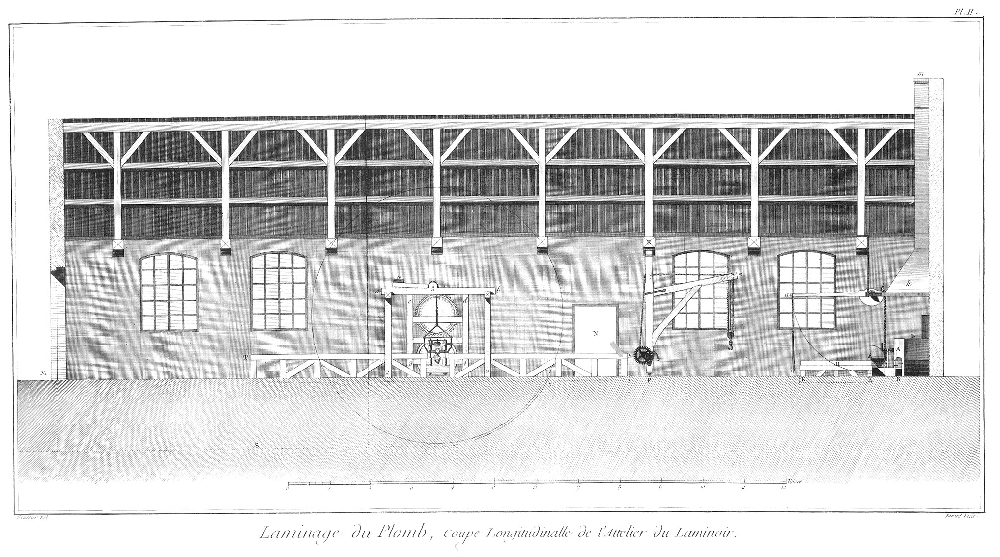](Planche_02.jpeg)

Cette Planche représente la coupe longitudinale de l'attelier du laminoir, le profil de la fonderie, & l'élévation géométrale de l'un des deux laminoirs contenus au plan général représente par la Planche précédente ; on voit par cette coupe que l'intérieur de l'attelier est éclairé par huit grandes croisées, & que le comble est soutenu par huit fermes espacées de quinze piés les unes des autres de milieu en milieu.

- M, porte de l'attelier.
- N, porte pour aller sur le coursier & donner l'eau à la roue.
- T t, établi du laminoir ; le dessus de l'établi est élevé de trois piés au-dessus du rez-de-chaussée.
- 1 & 2, deux poteaux montans sur lesquels les traversines sont assemblées.
- a b, une des deux longrines assemblées à entailles sur les traversines.
- 3 c, 4 d, deux des quatre montans qui composent la cage du rouage, ils sont assemblés dans la longrine postérieure qui leur sert de chapeau.
- 10, poids de la bascule, dont les tourillons o reposent sur le milieu des longrines ; on voit entre toutes ces pieces le profil du laminoir qui sera développé plus en grand dans les Planches suivantes.

A l'extrémité de l'attelier est placée la fonderie représentée en profil.

- A, le fourneau de briques.
- B, le cendrier.
- C, escalier pour servir la chaudiere.
- e, cheminée du foyer.
- h, hotte de la cheminée du fourneau.
- m, ouverture de cette cheminée au-dessus du comble de l'attelier ; cette cheminée est adossée à un des pignons du bâtiment ; sa hotte h est soutenue par des ferremens qui sont suspendus à la premiere ferme de la charpente du comble ; ces ferrures portent aussi les pivots de la bascule a b, par le moyen de laquelle on renverse le plomb contenu dans l'auge sur la table du moule qui est au-devant du fourneau.
- H, la table.
- R K, patins enterrés dans le sol, & auxquels sont assemblés les piés de la table ; l'arc de cercle a H a pour centre le pivot de la bascule ou le centre des demi-poulies sur lesquelles s'enroulent les chaînes qui enlevent l'auge & la font tourner autour du point k, ainsi que l'arc de cercle ponctué l'indique.

Plus loin est la potence ou grue tournante P R S.

- P, crapaudine du pivot inférieur scellée dans une grosse pierre qui affleure le sol de l'attelier.
- R, pivot supérieur fixé à une des fermes.
- S, extrémité du bras auquel la corde est arrêtée ; cette corde après avoir passé sous une poulie mobile remonte & passe au-dessus d'une poulie fixe placée dans une mortoise pratiquée vers l'extrémité du bras, & de-là va passer sur une autre poulie fixe placée dans une mortoise de l'arbre tournant de la grue pour redescendre & s'enrouler sur le treuil du cric t, composé d'une roue dentée & d'un pignon, sur l'axe duquel sont enarbrées deux manivelles ; on verra dans les vignettes des Planches IV. & VII. l'usage de cette grue.

PLANCHE III.
------------

[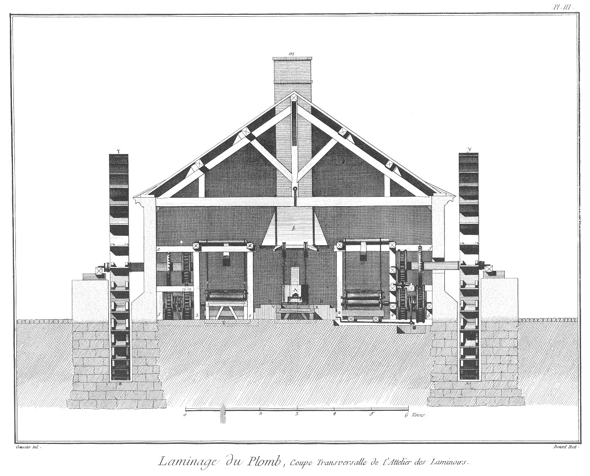](Planche_03.jpeg)

Cette Planche représente la coupe transversale de l'attelier des laminoirs ; on voit dans le fond entre les deux laminoirs la fonderie en élévation, & on a supprimé pour la laisser voir la grue tournante de la Planche précédente.

- A, le fourneau ; au-dessous de cette lettre on apperçoit l'orifice du gouleau de la chaudiere.
- 1 & 2, chevalet pour assujettir le tampon ou robinet de la chaudiere.
- e, cheminée du foyer.
- D D, palliers sur lesquels les ouvriers montent pour servir la chaudiere.
- V R, la table ou le moule, placé au-devant du fourneau.
- h m, cheminée du fourneau ; on voit au-dessous de h la bascule, au moyen de laquelle & des chaînes qui y pendent on verse le plomb de l'auge sur la table, & comment cette bascule est suspendue à une des fermes du comble ; le laminoir T sur la gauche est vû en élévation & antérieurement à l'extrémité de son établi, dont l'extrémité est projettée sur le laminoir ; dans le second laminoir on a supprimé la partie antérieure de l'établi, pour le laisser voir à découvert.
- Y Z, roue à aubes placée dans son coursier, sa circonférence est indiquée par une ligne ponctuée dans la Planche précédente, ainsi que le fond du coursier par la ligne Y AE.
- T, sol de la partie antérieure de l'établi arasée au rez-de chaussée.
- 1, poteau montant qui reçoit en chapeau la traversine a e, scellée en e dans l'épaisseur du mur.
- a & c, extrémités des longrines qui portent les tourillons de la bascule 10.
- 3, poteau montant qui s'assemble au-dessous de la longrine c.
- 5, autre poteau montant, qui avec leurs semblables & plusieurs entre-toises & traverses, forment la cage du rouage.

Le second laminoir, duquel on a supprimé la partie antérieure de l'établi & les montans antérieurs de la cage, a pour moteur, ainsi que le premier, une roue à aubes y z.

- 2, poteau montant qui reçoit en chapeau la traversine b f.
- 4, poteau montant qui s'assemble au-dessous de la seconde longrine.
- 6, autre poteau montant, qui avec les autres poteaux, traverses & entretoises, forme la cage du rouage de ce second laminoir.
- 10, extrémité de la bascule chargée d'un poids convenable pour faire équilibre avec le cylindre supérieur & toute son armature.

PLANCHE IV.
-----------

[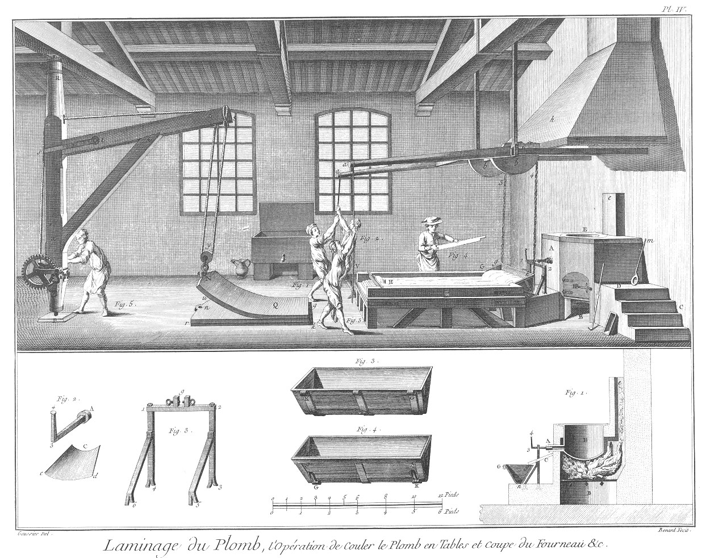](Planche_04.jpeg)

La vignette de cette Planche représente l'opération de couler le plomb en tables, pour ensuite être laminées & réduites à l'épaisseur convenable pour les différens emplois que l'on fait de cette matiere.

La partie de l'attelier qui contient la fonderie, est celle que la vignette représente.

- A, le fourneau ; cette lettre indique aussi le gouleau de la chaudiere que l'on doit supposer ouvert pendant l'opération du coulage.
- E, la chaudiere.
- B, cendrier.
- B B, porte du foyer.
- e, cheminée du foyer placée sous la hotte h de la cheminée de la fonderie.
- c, escalier pour monter sur le pallier D où les ouvriers se placent pour servir la chaudiere ; on voit sur ce pallier une écumoire m, servant à retirer les crasses ou scories de dessus le plomb fondu, & près du même pallier le rable du tiseur pour débraser le cendrier.

La table V R G K est placée au-devant du fourneau, elle est composée de plusieurs assemblages de charpente supportés par des montans & contre-fiches qui sont assemblés dans les soles qui affleurent le rez-de-chaussée : sur cette table, dont la longueur & les autres dimensions peuvent facilement se déduire des échelles qui sont au bas des Planches sur l'exactitude desquelles on peut compter, sont placées & chevillées trois pieces de bois V G, G K, K R, qui forment les rebords du moule ; c'est entre ces trois rebords qu'on met le sable dont il est formé, de la maniere que l'on expliquera ci-après ; il faut que la face supérieure de ces trois rebords soit parfaitement de niveau.

Entre le fourneau & la table le long du côté G K est l'auge G g k K assemblée à charniere le long de ce côté ; le dessous de l'auge est garni de deux crochets de fer assemblés à charnieres vers les extrémités du fond de l'auge ; ces crochets reçoivent les maillons inférieurs des chaînes g 3, k 4, par le moyen desquels l'auge est suspendue aux extrémités des bascules b a b a, par le moyen desquelles on renverse l'augée de plomb sur la forme ou moule qui est sur la table ; c'est cet instant que la vignette représente. H, cheville de bois un peu conique, que l'on pique dans le sable au centre d'un espace semi-circulaire, pour réserver un trou à la table, & y former par ce moyen une anse qui sert à l'enlever.

Fig.
1. &
2. &
3. Ouvriers qui abaissent la bascule pour verser le plomb contenu dans l'auge sur le moule, & en former par ce moyen une table de vingt lignes d'épaisseur ; près du troisieme ouvrier il en faut supposer un quatrieme qui lui sert d'aide comme le second en sert au premier ; on a supprimé cette figure, qui auroit empêché de voir le moule.

4. Le maître fondeur qui présente un rable, avec lequel & à l'aide d'un ouvrier placé du côté opposé il écume & repousse vers l'extrémité V R de la table les crasses qui surnagent & le plomb superflu qui est sur le moule ; les entailles du rable servent à limiter sa descente dans le moule, & par ce moyen à régler l'épaisseur de la table de plomb qui est au-dessous.

Aussi-tôt que la table de plomb est coulée on rebouche le gouleau A de la chaudiere, & on la charge de nouveau avec autant de plomb qu'elle en peut contenir ; on travaille pendant la fonte à la construction du moule, comme il sera dit ci- après : derriere les ouvriers 1 & 2 sont les tables précédemment coulées, empilées les unes sur les autres, comme on le voit en u r g k. Q N, table qui est enlevée au moyen de la grue tournante P R Si on voit que la table de plomb fléchit & ploye à mesure que le crochet de la poulie l'éleve pour la transporter sur le laminoir.

5. Ouvrier, & ils sont ordinairement deux ou quatre, qui en faisant tourner la manivelle du cric, enleve la table Q, au moyen du treuil fixé sur la roue dentée du cric & de la corde qui passe sous la poulie mobile y, à la chape de laquelle est attaché le crochet N qui saisit l'anneau de la table ; on n'a représenté qu'un seul ouvrier, pour laisser voir le cric de la grue, & encore cet ouvrier est-il un des aides de ceux qui tournent les manivelles, lesquels ont le visage tourné du côté du fourneau.

La grue est composée de l'arbre vertical P R du bras s S, assemblé avec l'arbre, à tenons & relié par un fort étrier de fer s t, & du lien x z, assemblé & embrevé haut & bas dans le bras & l'arbre vertical.

Près la muraille & entre les deux croisées on voit un réservoir de plomb plein d'eau & un arrosoir à côté, servant à arroser le sable de la forme lorsqu'on en veut former le moule d'une table.

Bas de la Planche.

Coupe du fourneau de la chaudiere & de l'auge.

- B, le cendrier au-dessus duquel est la grille sur laquelle on met le bois qui sert à chauffer la chaudiere.
- E, la chaudiere.
- e, la cheminée du foyer.
- A, gouleau de la chaudiere.
- A 3 4, le tampon du robinet dont la queue est coudée & est retenue par une ou deux vis dans la fourche du chevalet.
- C, plaque ou gouttiere de tôle passée sous le chevalet, & appuyée d'un bout sur l'auge ; elle sert à diriger le plomb fondu dans l'auge.
- G n g, l'auge de fer forgé revêtue intérieurement de plaque de tôle.
- G, centre de mouvement ou charnieres de l'auge.
- n, fond de l'auge qui appuye sur le seuil du fourneau.

Fig.
1. Représentation perspective du tampon du robinet & de la gouttiere dessinés sur une échelle double.
	- A, le tampon que l'on enduit de terre grasse, & au-devant duquel on met une boule de la même terre pour boucher exactement le gouleau de la chaudiere.
	- 3, 4, le manche ou poignée du tampon, au-dessous est la plaque ou gouttiere.
	- C, partie de la plaque qui s'applique au fourneau en-dessous du gouleau de la chaudiere.
	- c d, extrémité opposée de la gouttiere ; c'est cette partie qui repose sur le bord de l'auge.

2. Le chevalet du tampon en perspective.
	- 1 & 3, traverse ou chapeau du chevalet sur lequel se voient les fourchettes entre lesquelles est arrêtée la queue du tampon par la pression d'une ou deux vis.
	- 4, 3, 5, 6, les quatre piés du chevalet, lesquels sont scellés dans le seuil du fourneau, comme on le voit fig. 1.

3. L'auge vûe du côté des trois charnieres par lesquelles elle est attachée à la table ou forme sur laquelle on coule le plomb ; les trois charnieres & les six pitons qui sont plantés dans la traverse du moule sont traversés par un seul & même boulon autour duquel elle est mobile.

4. L'auge vûe du côté opposé à celui de la figure précédente, ou du côté des crochets K k, G g, par lesquels elle est accrochée aux chaînes de la bascule, les crochets sont assemblés à charniere sur les mêmes bandes de fer où sont pratiqués les charnons G & K de la figure précédente.

PLANCHE V.
----------

[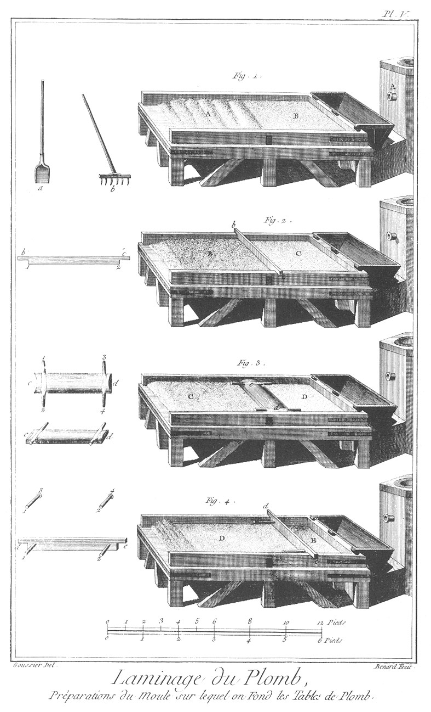](Planche_05.jpeg)

Cette Planche & la suivante représentent la suite des opérations nécessaires pour former le moule sur la table, que l'on a représentée sous le même point de vue & de la même grandeur que celle de la vignette de la Planche précédente, avec un fragment du fourneau devant lequel elle est placée.

Fig.
1. Après avoir arrosé le sable de la forme avec des arrosoirs, & l'avoir bêché avec la bêche a, pour l'ameublir & distribuer l'humidité également, on le laboure avec le rateau b, avec l'angle du dos duquel on forme des sillons transversaux A, dans lesquels on distribue de nouveau sable pour le mêler avec celui qui a déjà servi, & on égalise le tout avec les dents du rateau, comme on le voit en B: un ouvrier de chaque côté de la table a une bêche ou pelle de fer, & un rateau de bois dont les dents sont aussi de même matiere.

2. Après que le sable est égalisé au rateau on passe un rable b c sur toute la longueur de la table, pour mieux encore égaliser le sable ; ce rable a deux pouces d'entaille à chacune de ses extrémités, en sorte que la surface C de la forme est deux pouces au-dessous des rebords du moule ; la partie B de la forme est celle sur laquelle le rable n'a point encore passé, elle est dans le même état que la partie B de la forme précédente, ce qui a été observé de même dans toutes les figures suivantes.
	- b 1, 2 c le rable servant à cette opération représenté en géométral.
	- 1, 2, arête du rable qui s'applique à la forme de sable.

3. L'opération de battre avec la grande batte à quatre poignées, menée par deux ouvriers ; cette batte est un fort madrier de quelque bois dur, large environ d'un pié, sur le dessus duquel on a fixé deux traverses qui servent de poignées ; deux ouvriers l'élevent à deux piés environ de hauteur, & la laissent retomber ensuite sur la forme, en commençant du côté du fourneau & parallelement à l'auge.
	- D, partie de la forme qui est battue avec la grande batte.
	- C, partie de la même forme qui est dans l'état de la préparation précédente.

A côté de cette figure est la représentation de la grande batte en plan & en perspective.
	- c d, la grande batte.
	- 1, 2 : 3, 4, les deux doubles poignées.

4. L'opération de dresser avec le rable de profondeur. pour conduire ce rable & le maintenir dans la situation verticale pendant toute sa course, les ouvriers passent une cheville dans des trous pratiqués vers les extrémités, ces chevilles qu'ils tiennent d'une main, tandis que de l'autre ils appuyent sur l'extrémité du rable servent à le maintenir vertical, & par ce moyen à dresser le fond du moule, ce rable emportant toutes les inégalités que l'action des battes a pu laisser sur la forme.
	- E, partie du moule sur laquelle le rable a déjà passé.
	- D, partie de la forme dans l'état de la figure précédente ; par ces différentes opérations le sable superflu se trouve rassemblé vers l'extrémité de la table opposée au fourneau.
	- d e, le rable de profondeur.
	- 1 & 2, les chevilles.
	- 1, 3 : 2, 4, les mêmes chevilles représentées séparément ; la profondeur des entailles de ce rable est de deux pouces plus l'épaisseur que l'on veut donner à la table.

PLANCHE VI.
-----------

[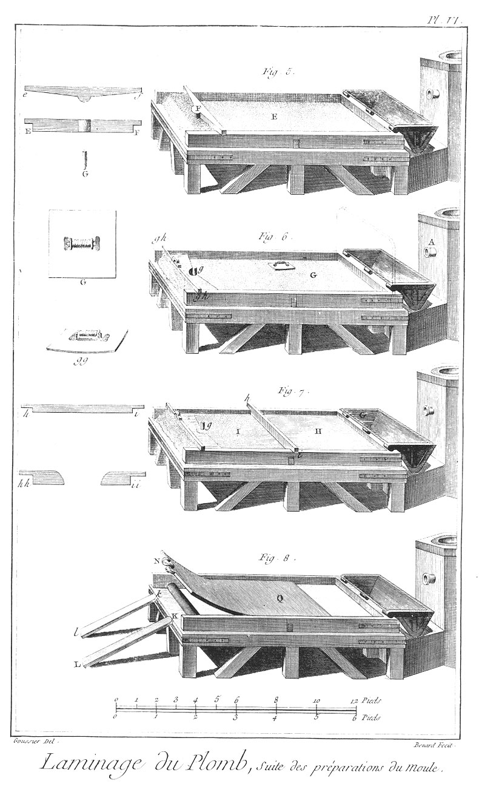](Planche_06.jpeg)

Fig.
5. Après que le fond E du moule ou l'aire de la forme est dressée au niveau de la partie E de la figure précédente, on place le modele F de l'anneau & de la tête de la table, on bat derriere le sable qui a été repoussé vers cette extrémité de la forme dans les opérations précédentes, ensuite ayant enlevé ce modele, on passe un rable dont les entailles n'ont que deux pouces de profondeur pour rejetter vers le bout de la forme le sable superflu & former une surface unie & de niveau avec le dessus de la table de plomb après qu'elle sera coulée ; la figure e f, représente le modele de l'anneau & de la tête de la table en plan, & la figure E F qui est au-dessous le représente en élévation ; G est la cheville de bois qui sert de noyau pour former le trou de l'anneau.

6. L'opération de planer ou repasser la forme. G, le fond du moule sur lequel un ouvrier passe la plane de cuivre, comme un fer à repasser le linge ; il fait auparavant chauffer la plane qu'il conduit sur plusieurs bandes paralleles sur toute la longueur du moule ; il place ensuite la cheville g qui sert de noyau pour le trou de l'anneau, il place aussi le rable g h g h, qu'il ensable dans la tête du moule, & derriere ce rable il bat le sable pour le fixer ; à côté de cette figure on voit la plane de cuivre G, vûe du côté de sa poignée, & au-dessous la même plane g g vûe en perspective ; le dessous de la plane doit être bien poli, & ses bords doivent être arrondis pour qu'elle glisse plus facilement & qu'elle n'entame point la forme ; ces deux figures sont dessinées sur une échelle quadruple de celle du moule.

Avant de laisser écouler le plomb fondu dans l'auge pour le verser ensuite dans le moule, on place sur ce dernier & près de l'auge une planche aussi longue que la table est large & haute de deux piés & demi, que l'on peut nommer parapluie, de son usage, qui est d'empêcher les gouttes de plomb qui rejaillissent de l'auge, de tomber sur la forme, qui en seroit piquée & les tables endommagées ; la situation & la grandeur de cet instrument sont indiquées par des lignes ponctuées.

7. L'opération d'écremer la table de plomb après qu'elle est coulée sur la forme ; cette opération succede immédiatement à celle que la vignette de la Pl. IV. représente. 
	- H I, le plomb en bain sur le moule.
	- H, partie de la table de plomb déjà écremée avec le rable h i, qui est celui que le maître fondeur, fig. 4. de la vignette citée présente en travers du moule, & qu'un autre ouvrier lui aide à conduire le long de la table de plomb en fusion, ce rable rassemble toutes les crasses vers la tête de la table au-delà de la cheville g, qui forme le trou de l'anneau.
	- I, partie du bain non encore écremée ; on voit à côté le rable h i représenté en face.

Outre ce rable les ouvriers se servent encore des spatules h h, i i, ils s'en servent pour écremer dans l'auge G K, dans laquelle ayant plongé une écumoire ils y conduisent toutes les scories qui surnagent avant de renverser l'auge sur la forme ; ils s'en servent aussi après que la table est coulée, pour rassembler sur la tête de la forme les scories que le grand rable n'a pu y conduire, & celles qui entourent la cheville g ; en cet état la table est achevée, il ne reste plus qu'à trancher le long de la tête & autour de l'anneau le plomb superflu, ce que l'on fait aussi-tôt que la table est figée, on se sert pour cette opération de quelques- uns des outils représentés au bas de la Planche suivante.

8. L'opération d'enlever la table de dessus le moule au moyen de la grue tournante & de la placer devant le moule comme on voit dans la vignette de la Pl. IV. pour cela ayant dégarni la tête de la table & mis un rouleau dessous, les ouvriers placent deux morceaux de bois inclinés l k L K, que l'on nomme coulottes, & ayant passé un crochet N dans l'oeil de la table, & le crochet de la poulie mobile de la grue dans l'oeil de celui de la table, en faisant ensuite manoeuvrer le cric, la table Q N est attirée par la corde de la grue, & le rouleau facilite ce mouvement ; on redresse ensuite à grands coups de mailloche de bois la table sur laquelle on empile successivement les autres, comme on le voit dans la même vignette.

PLANCHE VII.
------------

[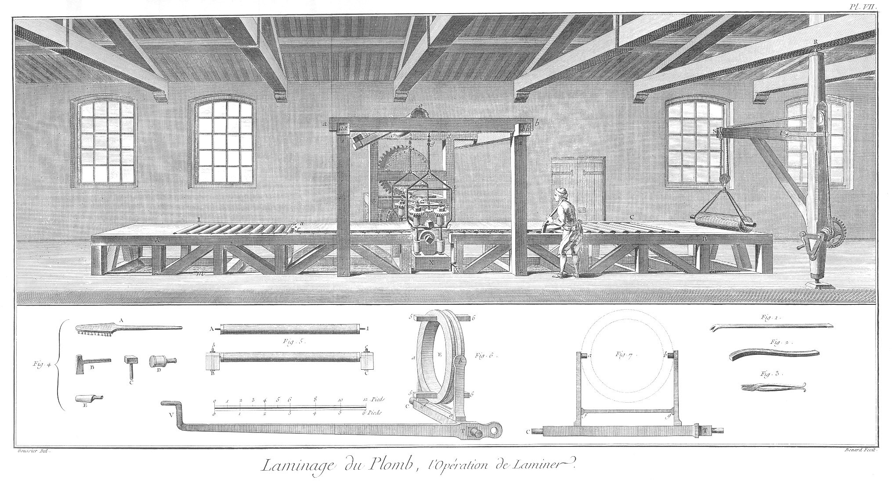](Planche_07.jpeg)

La vignette représente, dans l'intérieur de l'attelier, l'opération de laminer une table, & la vûe perspective du laminoir entier. Cette Planche & la Planche IV. peuvent s'assembler l'une avec l'autre pour représenter la totalité de la manufacture.

L'établi A I C B du laminoir est composé d'un fort chassis de charpente soutenu de distance en distance par des montans & des contre-fiches assemblés haut & bas, dans les longs côtés du chassis, & les solles qui sont affleurées au rez-de-chaussée, & ce chassis est séparé en deux parties par le laminoir ; l'intérieur du chassis est garni de rouleaux horisontaux de bois, pour faciliter le mouvement de la table, excepté vers les extrémités, où dans la longueur d'environ six piés, l'établi est recouvert de forts madriers qui forment une table pleine, dont le dessus affleure les côtés du chassis, au-dessus desquels les rouleaux excedent d'environ un demi-pouce.

La cage du laminoir est composée des deux montans 1, 1 & 2, 2, qui portent d'un bout les traversines a a, b b sur lesquelles sont assemblés à encoche les longrines a b, c d, c'est sur les longrines que portent les tourillons de l'arbre o o de la bascule 10; la seconde longrine recouvre en chapeau les deux montans postérieurs 3, c ; 4, d, auxquels sont assemblés les traverses & entre-toises embrevées qui forment la cage du rouage du laminoir derriere laquelle est le manége qui lui communique le mouvement, si c'est par le moyen de chevaux ; ou la roue à l'eau, si c'est cet élément qui fait agir la machine, & c'est le cas que la vignette représente.

Vers une des extrémités du laminoir on voit la grue tournante PRS chargée d'une table de plomb laminée & roulée sur un bâton, par le moyen duquel & d'un cordage cette table est facilement enlevée & transportée sur le chariot qui doit la transporter au magasin.

L'ouvrier représenté dans la vignette est dans l'action de redresser la table ou de la diriger sur le milieu de l'établi lorsqu'elle se détourne plus d'un côté que de l'autre ; pour cela il se sert d'un bâton crochu nommé crosse, avec lequel comme avec un levier du second genre il repousse la table sur le milieu du chassis, pour cela il appuye l'extrémité de cet instrument contre la face interne du chassis, la convexité est appliquée contre l'épaisseur de la table, & l'autre extrémité sur l'épaule de l'ouvrier ; en expliquant le bas de la Planche, on dira les autres usages de cet instrument.

Ce même ouvrier, après que la table est entierement passée du côté du laminoir, la fait passer du côté opposé en relevant & abaissant alternativement l'extrémité V de la bascule du verrouil, ce qui change la direction des cylindres. A chaque retour au côté opposé à celui où il est placé, il fait tourner la manivelle L du régulateur d'un quart de tour, ou un demi-tour tout au plus, pour approcher insensiblement les cylindres l'un de l'autre.

Bas de la Planche.

Fig.
1. Pince ou pié-de-biche de fer servant à mouvoir les fardeaux.

2. Crosse dont se sert l'ouvrier représenté dans la vignette, elle sert aussi à relever l'extrémité de la table lorsqu'elle sort d'entre les cylindres, pour empêcher qu'elle ne passe sous les rouleaux de l'établi ; pour cela l'ouvrier introduit l'extrémité courbe de cet instrument entre le cylindre inférieur & le rouleau voisin ; la convexité de la crosse présente alors à la table de plomb un plan incliné le long duquel elle est forcée de monter : une fois passée sur le premier rouleau, elle passe sans difficulté sur tous les autres.

3. Tenailles ; elles sont d'une forme ordinaire, à cela près que les manches sont courbés en-dehors près de leurs extrémités, pour mieux tenir dans les mains de l'ouvrier lorsqu'il tire selon la direction de la longueur de la tenaille. Les mors de cet instrument sont taillés intérieurement en rape pour mieux saisir les tables de plomb ; on fait usage de cet outil pour faire rentrer la table entre les cylindres du laminoir à chaque fois qu'on change la direction des cylindres ; pour cela l'ouvrier ayant couché la tenaille horisontalement & dans une direction à-peu-près perpendiculaire à la longueur de l'établi, il saisit la table par son épaisseur, & le côté de la tenaille étant appuyé contre une des chevilles de fer qui sont saillantes au-dessus du chassis, il fait décrire aux manches de la tenaille un arc de cercle auquel cette cheville sert de centre ; la tenaille alors devient un levier du premier genre qui pousse la table entre les cylindres où elle est bientôt attirée ou avalée, comme disent les ouvriers, par leur révolution en sens contraire.

4. Cette figure contient cinq objets sous un même numéro, & chacun des objets représenté doit être double, de maniere qu'il y a deux outils de chaque sorte.
	- A, brosse de poil de sanglier pour brosser le dessous des tables & emporter le sable que le balai n'a pas pu détacher.
	- B, couperet pour trancher les bavures & couper le plomb superflu.
	- C, masse de fer pour frapper sur la tête du couperet.
	- D, maillet de bois.
	- E, batte pour corroyer le sable du moule & pour ployer & rouler les tables après qu'elles sont laminées.

5. Coupe transversale de l'établi & un des rouleaux séparé. B b, C c, chevilles ou boulons de fer qui traversent toute l'épaisseur du chassis & celle du chapeau qui recouvre les tourillons des rouleaux ; ce sont ces chevilles qui servent de point d'appui à la tenaille, fig. 3. pour faire rentrer la table entre les cylindres.

6. Représentation perspective du verrouil de la fourchette & du levier qui le met en mouvement.
	- C T, axe de mouvement de la fourchette.
	- T V, manche de la fourchette.
	- V, poignée.
	- a f, b g, les fourchons, dont les pointes ou tourillons entrent dans la rainure ou gorge du vérouil.

A l'extremité du manche près de T, est un trou rond auquel on suspend un poids suffisant pour tenir le manche T V en équilibre.

7. Représentation géométrale de la fourchette.
	- C T, axe de la fourchette.
	- a f, b g, les fourchons.
	- a b, les tourillons ou pointes des fourchons engagées dans le vérouil indiqué par des lignes ponctuées.
	- f g entretoise pour affermir les fourchons sur l'axe C T.
	- T, partie quarrée de l'axe qui reçoit le manche V T, fig. précédente.

Toutes ces figures sont dessinées sur une échelle double.

PLANCHE VIII.
-------------

[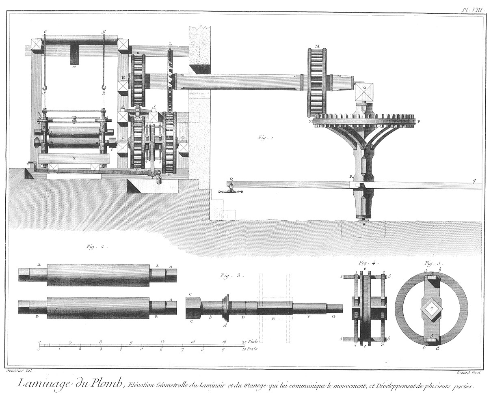](Planche_08.jpeg)

Cette Planche représente l'élévation géométrale d'un laminoir mis en mouvement par des chevaux attachés à un manége dessiné sur une échelle double pour en mieux faire connoître les dimensions ; cette Planche est citée sous le n°. 1. dans l'article laminoir du volume IX. de l'Encyclopédie.

Fig.
1. Elévation géométrale du laminoir ; on a supprimé les montans antérieurs pour laisser voir les roues & les entre-toises qui supportent les tourillons de leurs axes.
	- S, pivot & crapaudine inférieurs de l'axe du grand rouet placé au centre du manege.
	- S O, arbre ou axe du grand rouet.
	- P N, grand rouet garni de quarante-huit aluchons dans sa circonférence R Q.
	- R q, les quatre bras du manege terminés chacun par un palonnier auquel on attele un cheval.
	- O, poutre qui traverse le manege, elle reçoit le tourillon supérieur du grand rouet & celui de l'arbre horizontal O H; cet arbre porte deux lanternes & un hérisson qui y sont fixés à demeure ; la lanterne M N de trente-deux fuseaux est engrenée & est menée par le grand rouet, ce qui fait tourner du même sens l'hérisson L de trente-deux dents, & la lanterne K de vingt-quatre fuseaux. L'hérisson L conduit la lanterne E de trente-deux fuseaux, qu'il fait tourner en sens contraire à celui où il fait sa révolution, & la lanterne K de vingt-quatre fuseaux au moyen d'une étoile de cuivre à huit aîles, fait tourner du même sens qu'elle la lanterne D qui est au-dessous, & a également vingt-quatre fuseaux ; les deux lanternes F & D sont enarbrées à canon cylindrique sur l'arbre G b, séparément duquel elles peuvent faire leur révolution, & selon que l'on fixe l'arbre G b à l'une ou à l'autre des deux lanternes, l'arbre G b & le cylindre inférieur B B du laminoir tournent du même sens que la lanterne auquel on l'a fixé, ce qui fait avancer ou rétrograder la table que l'on lamine entre les deux cylindres A A, B B du laminoir.

On a supprimé dans cette figure les étriers qui soutiennent les tourillons du rouleau supérieur pour laisser voir les colets de dessus & les écroux qui les compriment ; on voit seulement les chaînes e f, g h, par lesquelles ils sont suspendus à la bascule e 10 g.

Bas de la Planche.

Toutes les figures sont dessinées sur une échelle double, c'est-à-dire sur celle cotée dix piés au bas de la Planche.

Fig.
2. Les deux cylindres de fonte de fer arrondis sur le tour.
	- A A, tourillons du cylindre supérieur terminés chacun par un quarré.
	- B B, tourillons du cylindre inférieur terminés chacun par un quarré.

3. Arbre des deux lanternes D & F de la fig. 1.
	- C C, boîte qui reçoit le quarré A du tourillon du rouleau inférieur.
	- b, tourillon de l'arbre.
	- D, embase à laquelle s'applique une des faces de la lanterne D.
	- D, partie cylindrique sur laquelle doit être chaussé le canon de la lanterne D, représentée & dessinée sur la même échelle dans la Planche XI.
	- E, partie quarrée destinée à recevoir le porte-verrouil indiqué par des lignes ponctuées.
	- F, partie cylindrique qui reçoit la lanterne F, représentée aussi dans la Planche XI.
	- G, deuxieme tourillon de l'arbre.

4. Le porte-verrouil 1, 4 : 2, 3, garni de son verrouil E e 5, 6 : 5 6, en situation pour être chaussé sur l'arbre après que la lanterne D y est placée.

5. Le verrouil & le porte-verrouil en plan vu du côté de l'arbre qui doit le traverser. 7, ouverture quarrée du porte-verrouil qui reçoit la partie quarrée E de l'arbre, fig. 3.

PLANCHE IX.
-----------

[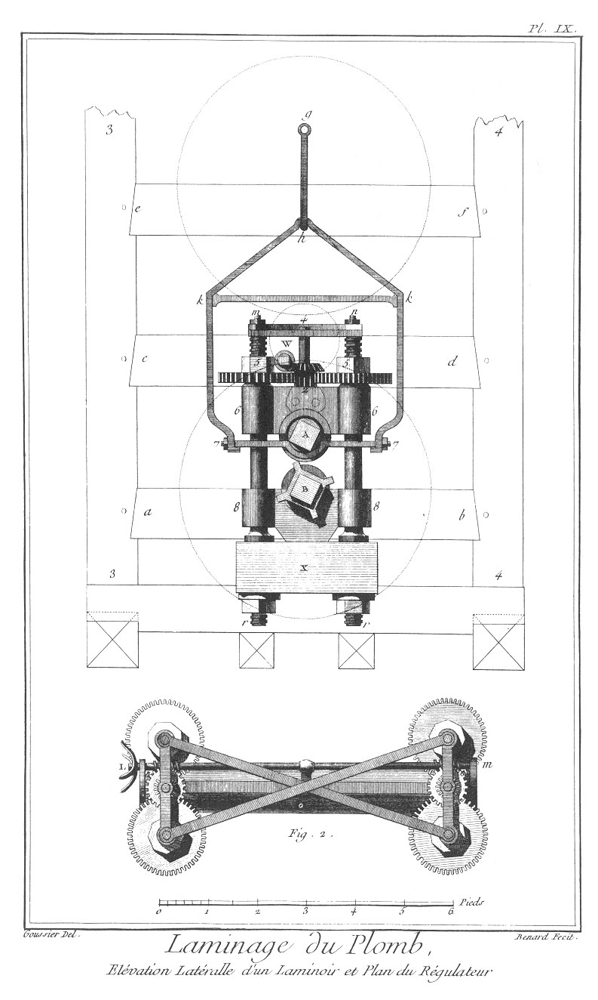](Planche_09.jpeg)

La fig.
1. représente l'élévation latérale d'un laminoir dessiné sur une échelle double de celle de la figure. 1. de la Pl. précédente, pour que les petites parties en soient plus distinctes. C'est aussi la raison pour laquelle on a laissé au simple trait la projection de la charpente & celle des lanternes & pignon de renvoi placé au-delà.
	- 3 3, 4 4. Deux des montans qui forment la cage du rouage.
	- a b entretoise qui porte le tourillon de l'arbre des lanternes inférieures.
	- c d, entretoise qui porte un des tourillons de l'axe de l'étoile de cuivre ou pignon de renvoi.
	- e f, troisieme entretoise ou traverse qui porte un des tourillons de l'arbre de la roue à aubes.
	- X, le sommier sur lequel le laminoir est établi.
	- r m, r m, les colonnes.
	- r, r, les écrous.
	- 88, coussinet ou pallier inférieur.
	- 77, collier.
	- 7 k h k 7, étrier.
	- k k, entretoise de l'étrier.
	- h g, tirant ou partie de la chaîne par laquelle l'etrier est suspendu à la bascule.
	- B, cylindre inférieur.
	- A, cylindre supérieur.
	- 2, 4 pignon du régulateur & roue de la vis sans fin.
	- W, vis sans fin.
	- 5, 5, écrous & roues dentées, qui avec le pignon qui les conduit toutes deux, forment ce qu'on nomme le régulateur.

2. Plan du dessus du régulateur.
	- L, manivelle de la tige.
	- L m, des deux vis sans fin qui conduisent les régulateurs de chaque bout du laminoir.

PLANCHE X.
----------

Développement de toutes les pieces de la fig. 1. de la Planche précédente, représentées sous l'aspect extérieur en géométral, & sous l'aspect intérieur en perspective.

Fig.
1. Ecrous qui assujettissent les colonnes au sommier X.
	- a, écrou en profil.
	- b, le même écrou en perspective ; on voit que cet écrou est exagone.

2. Profil du sommier ; les lignes ponctuées indiquent la direction des mortoises que les colonnes traversent.

3.
	- 8 8, collier du cylindre inférieur ; au-dessous en a b on voit le plan de son dessus garni du pallier de cuivre.
	- B, pallier de cuivre.

4.
	- 8 8, le même collier du cylindre inférieur vu du côté intérieur ou du côté du dedans du laminoir ; il est garni de son pallier de cuivre.
	- a b, le même collier dégarni.
	- c, emplacement du pallier de cuivre.
	- b, pallier de cuivre représenté séparément.

5. Collier du cylindre supérieur vu du côté extérieur ; au-dessous en A est son pallier de cuivre.

6. Le même collier vu en perspective & du côté opposé, c'est à-dire, du côté intérieur ; au-dessous en a on voit son pallier de cuivre.

7. Ecrou & roue dentée vue en profil.

8. Le même écrou en perspective.

9. Les deux colonnes d'un des côtés du laminoir.
	- r m, r n, les colonnes ; entre ces colonnes on voit le pignon & la roue de vis sans fin montée sur un seul & même arbre 2, 4.

10. Etrier, par le moyen duquel le cylindre supérieur est supporté par la bascule.
	- 7 k g k 7, étrier.
	- 7 7, contre-colet, sur le milieu duquel repose le tourillon d'un cylindre.
	- k k, entretoise de l'étrier.
	- g, anneau par lequel l'étrier est suspendu à la bascule.

PLANCHE XI.
-----------

[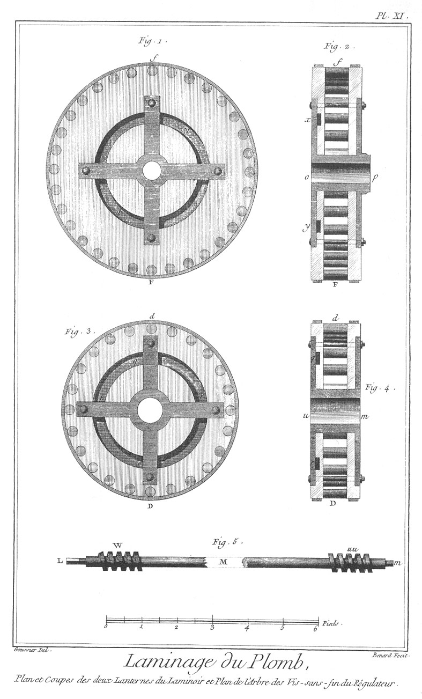](Planche_11.jpeg)

Fig.
1. Plan de la lanterne F de la fig. 1. Planche VIII. dessinée sur une échelle double & vue du côté de la rainure circulaire x y, qui reçoit les extremités 6, 6 des verrouils, fig. 6. au bas de la Planche VII. Ce sont les croisées de fer de cette lanterne qui servent de point d'appui aux verrouils.

2. Coupe de la même lanterne.
	- x y, rainure circulaire.
	- o p, canon qui reçoit le cylindre F de la figure 3, Planche VIII.

3. Plan de la lanterne D de la figure 1. Planche VIII. vue du côté de la rainure circulaire q r s t qui re- çoit les extrémités 5, 5 des verrouils, figure 6. au bas de la Planche VII.

4. Coupe de la même lanterne.
	- q r, rainure circulaire.
	- u m, canon qui reçoit le cylindre D de la figure 3. Planche VIII.

5. Tige des deux vis sans fin du régulateur dessinée sur une échelle double de celle de la fig. 2. de la Planche IX. à laquelle cette figure est relative.
	- L m, la tige que l'on a fracturée dans le milieu M, sa longueur n'ayant pas pu tenir dans la largeur de la Planche.
	- L, quarré qui reçoit la crosse ou manivelle à quatre bras.
	- W, vis sans fin d'un des côtés du laminoir.
	- u u, seconde vis sans fin de l'autre côté du laminoir.

PLANCHE XII.
------------

[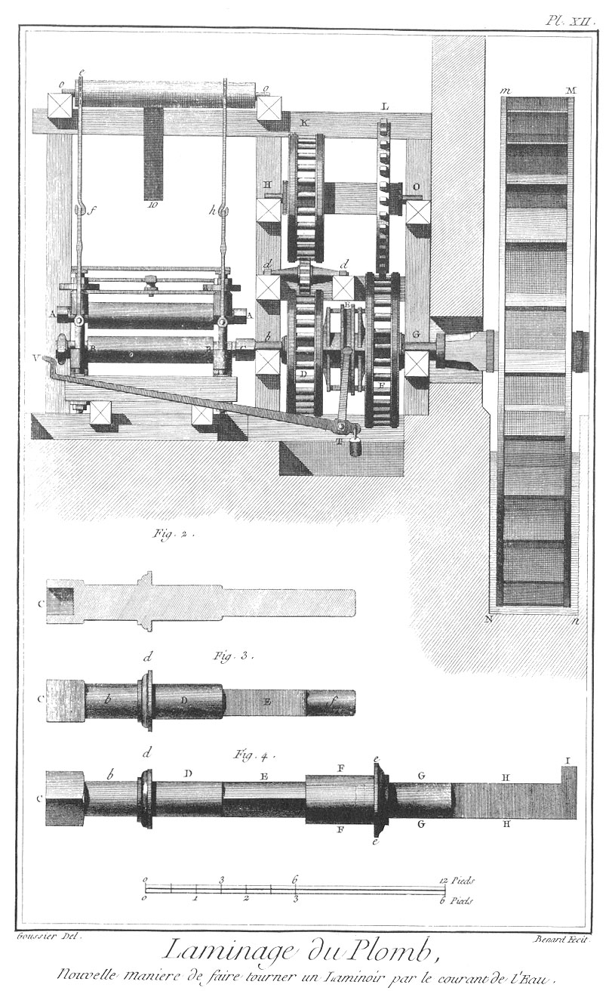](Planche_12.jpeg)

Fig.
1. Elévation géométrale du laminoir & nouvelle maniere de le faire tourner par le moyen de l'eau. On a observé de mettre à cette figure les mêmes lettres qu'à celle de la Planche VIII. sur les mêmes objets ; il reste à expliquer seulement les différences. m M N n, roue à augets qui sont au nombre de 24 sur la circonférence de la roue qui a 20 piés de diametre ; son arbre porte au-delà du tourillon G une embase, & au-delà de cette embase un canon concentrique à l'axe du tourillon. Ce canon reçoit le tourillon de l'arbre du porte-verrouil, & c'est en cela principalement que consiste la différence entre ce nouveau laminoir & l'ancien, différence qui permet d'abaisser le centre de la roue à auget, jusque vis-à-vis celui du centre du cylindre inférieur ; ce qui abaisse d'autant le coursier, ou éleve le rez-de-chaussée au-dessus des eaux ; en sorte que l'axe de la roue, celui de l'arbre des lanternes, & l'axe du cylindre inférieur, sont en une seule & même ligne droite.

Dans cette figure le levier T V est élevé, ce qui met en prise la lanterne F avec le verrouil, & fait tourner les cylindres en sens contraire à celui de la figure 1. 

2. Coupe de l'arbre des lanternes inférieures.
	- C, boîte qui reçoit le quarré du tourillon du cylindre inférieur.

3. Elévation géométrale du même arbre.
	- c, boîte.
	- b tourillon qui repose sur le pallier de l'entretoise inférieure.
	- d d, embase à laquelle s'applique la face de la lanterne D opposée à celle que la figure 3. Pl. XI. représente.
	- D, partie cylindrique qui est reçue dans le canon de la lanterne E, quarré qui reçoit le porte-verrouil, fig. 4. Planche VIII.
	- f, tourillon qui est reçu dans le canon pratiqué à l'extrémité du tourillon de la roue à augets.

4. L'arbre des lanternes assemblé avec le tourillon de la grande roue.
	- C b D E, arbre des lanternes comme dans la figure précédente.
	- F I, tourillon de l'arbre de la grande roue.
	- F F, canon qui reçoit intérieurement le tourillon de l'arbre des lanternes, & extérieurement la lanterne F, fig. 1. Pl. XI. dont le centre est percé d'une ouverture plus grande.
	- e e, embase à laquelle s'applique la face opposée de la lanterne.
	- G G, tourillon de l'arbre de la grande roue qui repose sur un pallier fixé à une entretoise de la machine.
	- H H, queue du tourillon qui est encastrée dans l'arbre de la grande roue.
	- I, crochet qui retient le tourillon dans l'arbre.

Table du poids de la toise quarrée & du pié quarré du plomb laminé des différentes épaisseurs qui suivent.
----------------------------------------------------------------------------------------------------------

Toise quarrée.
--------------

| Epaisseur en lignes. | livres. | onces. |
|----------------------|---------|--------|
|            ½         |    99   |    0.  |
|            3/4       |   148   |    8.  |
|          1           |   198   |    0.  |
|          1¼          |   247   |    8.  |
|          1½          |   297   |    0.  |
|          1-3/4       |   346   |    8.  |
|          2           |   396   |    0.  |
|          3           |   594   |    0.  |
|          4           |   792   |    0.  |
|          5           |   990   |    0.  |
|          6           |  1188   |    0.  |

Pié quarré.
----------

| Epaisseur en lignes. | livres. | onces. |
|----------------------|---------|--------|
|           ½          |    2    |   12.  |
|           3/4        |    4    |    2.  |
|         1            |    5    |    8.  |
|         1¼           |    6    |   14.  |
|         1½           |    8    |    4.  |
|         1-3/4        |    9    |   10.  |
|         2            |   11    |    0.  |
|         3            |   16    |    8.  |
|         4            |   22    |    0.  |
|         5            |   27    |    8.  |
|         6            |   33    |    0.  |

Table du poids de la toise des tuyaux de plomb laminé soudés de long.
---------------------------------------------------------------------

| Diametres. | Epaisseurs. | Poids.  |
| pouces.    | lignes.     | livres. |
|------------|-------------|---------|
|     2      |     1½      |   35.   | }
|     3      |     2       |   63.   | } Tuyaux de descente.
|     4      |     2       |   80.   | }
|            |             |         |
|     1½     |     2       |   39.   | }
|     2      |     2       |   51.   | } 
|     3      |     3       |  102.   | } 
|     4      |     4       |  172.   | } Tuyaux d'eaux forcées.
|     5      |     5       |  261.   | }
|     6      |     6       |  366.   | }
|     7      |     7       |  494.   | }
|     8      |     8       |  637.   | }
|            |             |         |
|     0      |     6       |   21.   | }
|     0      |     9       |   27.   | }
|     1      |             |   36.   | } Tuyaux moulés.
|     1½     |             |   55.   | }
|     2      |             |   72.   | }
|     2½     |             |  108.   | }

[->](../21-Potier_de_Terre/Légende.md)
