POTIER DE TERRE
===============

Contenant dix-huit Planches équivalentes à dix-neuf par une Planche double.

PLANCHE Iere.
-------------

[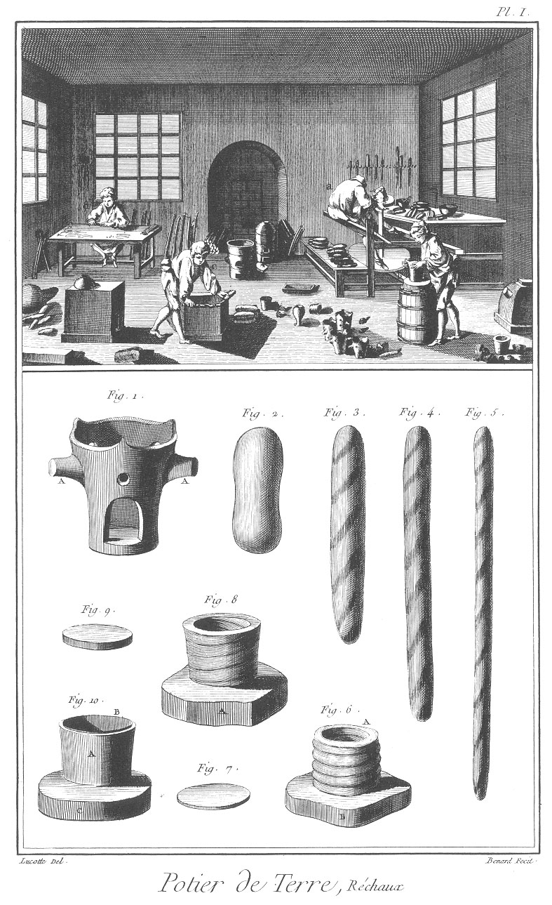](Planche_01.jpeg)

Le haut de cette Planche représente un attelier de potier de terre, où pluseurs ouvriers sont occupés à divers ouvrages ; l'un en

- a, à tourner au tour ; un autre en
- b, à fabriquer des réchauds ; un autre en
- c, à fabriquer des poëles & des fourneaux chimiques, & un autre en
- d, à fabriquer des pipes.
- e représente le four pour la cuisson des ouvrages ;

le reste de l'attelier est occupé par différentes sorts d'ouvrages de poterie. Façon d'un réchaud, qui est à-peu-près la même pour toutes sortes d'ouvrages en terre.

Fig.
1. Réchaud.
	- A A, les ansis.

2. Motte de terre préparée jour la fabrique d'un réchaud.

3. &
4. &
5. La même motte ce terre allongée de plus en plus.

6. La même motte tournée jour le commencement d'un réchaud.
	- A, la terre.
	- 3, la pierre sur laquelle on fabrique.

7. Fond du réchaud.

8. Le même réchaud formé pa son pié.
	- A, la pierre.

9. Couvercle du réchaud.

10. Le pié du réchaud garni de sin couvercle.
	- A, le pié.
	- B, le couvercle.
	- C, la piere.

PLANCHE II. Suite de la façon d'un réchaud.
-------------------------------------------

[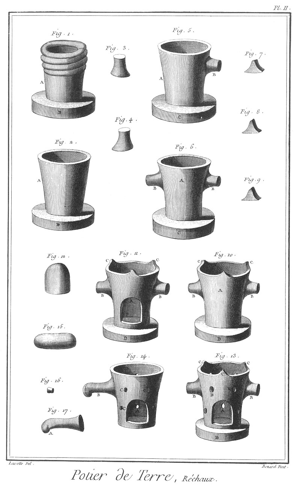](Planche_02.jpeg)

Fig.
1. Le haut du réchaud forme par une nouvelle motte tournée.
	- A, le pié.
	- B, la pierre.

2. Le même réchaud uni & évasé
	- A, le réchaud.
	- B, la pierre.

3. &
4. Mottes pour former les arses.

5. La premiere anse soudée & posé.
	- A, le réchaud.
	- B, l'anse.
	- C, la pierre.

6. Les deux anses posées.
	- A, le réchaud.
	- B B, les anses.
	- C, la pierre.

7. &
8. &
9. Mottes pour former les canes du réchaud.

10. Carnes posées au réchaud.
	- A, le réchaud.
	- B B, les anses.
	- C C, les carnes.
	- D, la piere.

11. Premiere ouverture du réchaud.
	- A, l'ouverture.
	- B B, les anses.
	- C C C, les carnes.
	- D, la pierre.

12. Motte sortant de l'ouverture.

13. Réchaud fini.
	- A, l'ouverture.
	- B B, le anses.
	- C C C, les carnes.
	- D D D, les lumieres.
	- E la pierre.

14. Réchaud d'une autre forme.
	- A, l'ouverture.
	- B, l'anse à volute.
	- C C, les lumieres.

15. Motte pour former l'anse à volute.

16. Petite motte sortant des lumieres.

17. Anse à volute. A, la volute.

PLANCHE III. Vases & ustensiles chimiques.
------------------------------------------

[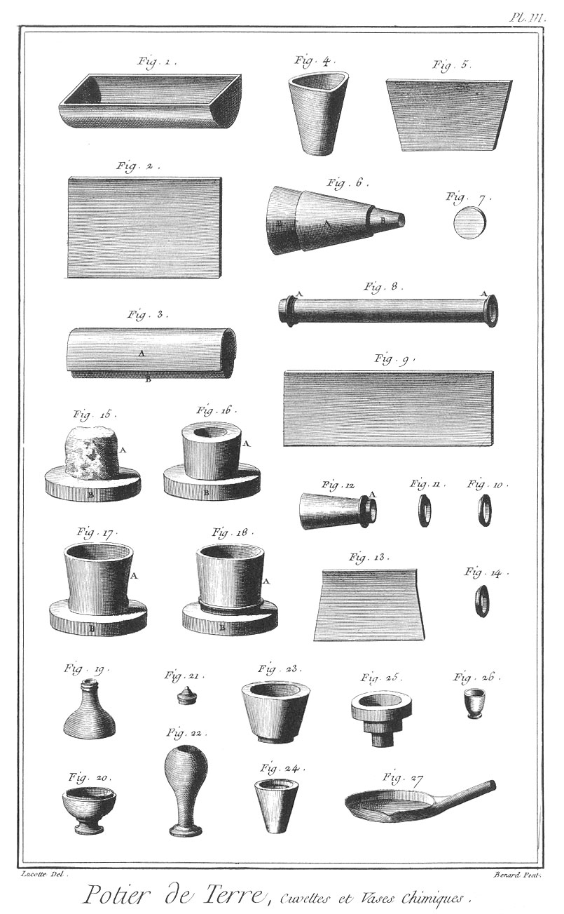](Planche_03.jpeg)

Fig.
1. Cuvette d'émailleur.

2. Morceau de terre applati pour former la cuvette.

3. La même terre en forme sur un rouleau.
	- A, la terre.
	- B, le rouleau.

4. Creuset.

5. Morceau de terre disposé pour un creuset.

6. La même terre en forme sur un moule.
	- A, la terre.
	- B, le moule.

7. Fond du creuset.

8. Tuyau de conduite dit tuyau de grès A A, les viroles.

9. Terre applatie pour former le tuyau.

10. &
11. Virole de terre du tuyau.

12. Tuyau appellé ventouse.
	- A, la virole.

13. Terre disposée pour former la ventouse.

14. Virole de la ventouse.

15. Motte de terre montée sur la girelle du tour, disposée pour un tuyau de chausse d'aisance.
	- A, la motte.
	- B, la girelle.

16. La même motte creusée.
	- A, la motte.
	- B, la girelle.

17. Le tuyau a demi-formé.
	- A, le tuyau.
	- B, la girelle.

18. Le tuyau fait.
	- A, le tuyau.
	- B, la girelle.

19. &
20. &
21. &
22. &
23. &
24. & 
25. &
26. &
27. Différens vases chimiques en terre.

PLANCHE IV. Poëles & fourneaux chimiques.
-----------------------------------------

[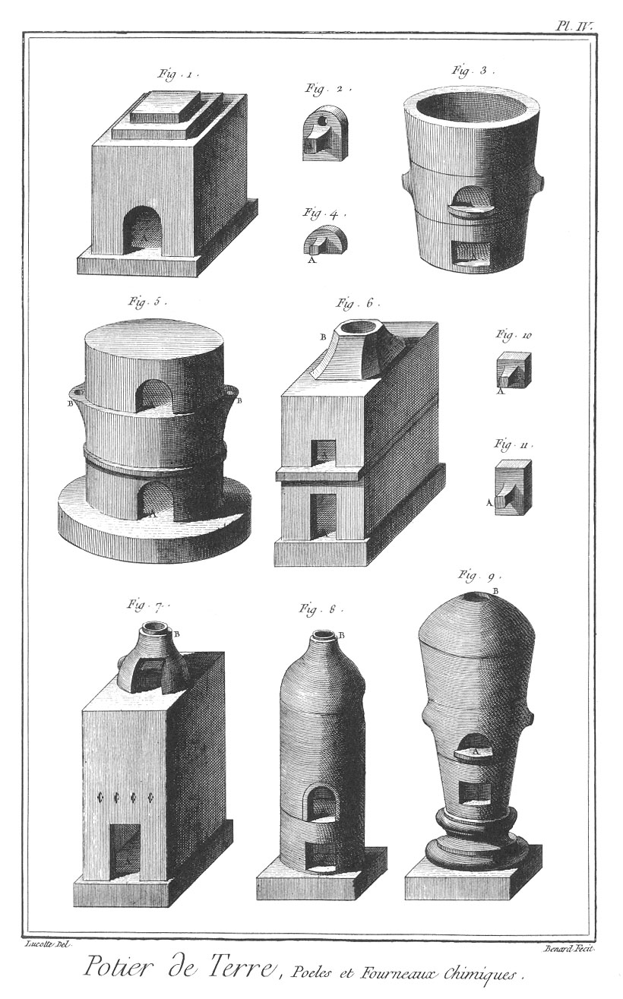](Planche_04.jpeg)

Fig.
1. Poële.
	- A, l'ouverture.

2. Porte du poële.
	- A, la poignée.

3. Fourneau chimique.

4. Bouchon de l'une des ouvertures du fourneau.
	- A, la poignée.

5. &
6. &
7. &
8. &
9. Diverses poëles & fourneaux chimlques.
	- A A, &c. les ouvertures.
	- B B, &c. les cheminées.

10. &
11. Bouchon d'ouvertures.
	- A A, les poignées.

PLANCHES V., VI., & VII. Roue.
------------------------------

[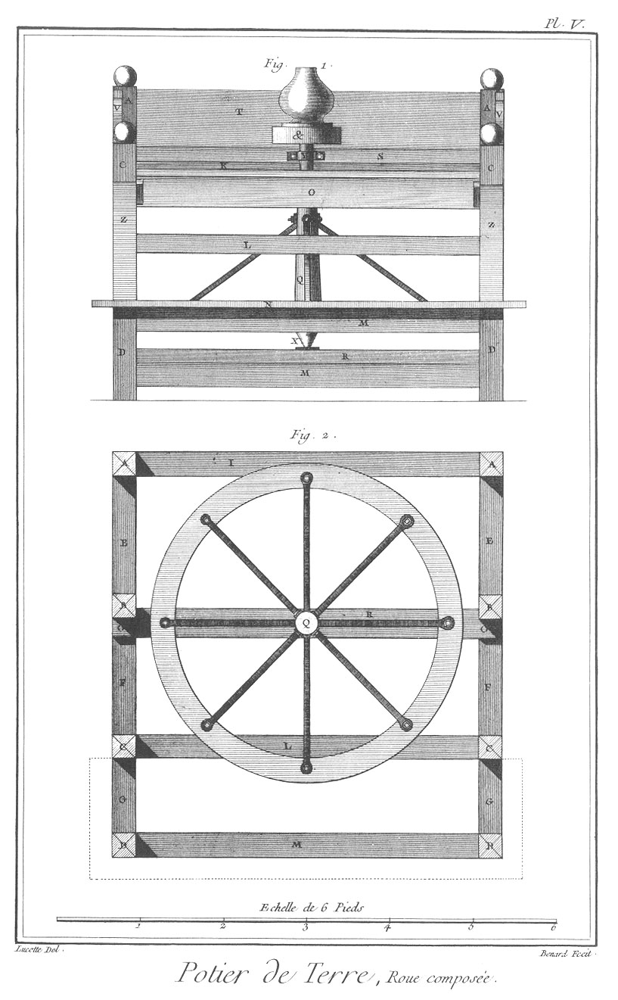](Planche_05.jpeg)

[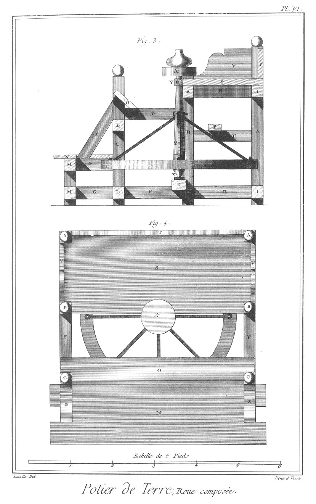](Planche_06.jpeg)

[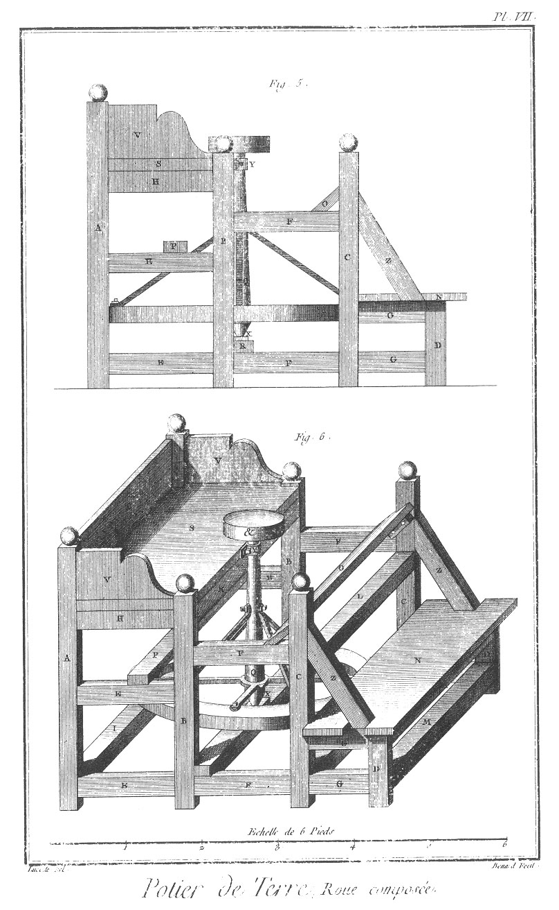](Planche_07.jpeg)

Fig.
1. Elévation en face.

2. Plan du dessous.

3. Coupe.

4. Plan du dessus.

5. Elévation latérale.

6. Elévation perspective de la roue composée.
	- A A, les piliers de devant.
	- B B, piliers de milieu.
	- C C, piliers de derriere.
	- D D, bas piliers
	- E E, entretoises de devant.
	- F F, entretoises de milieu.
	- G G, entretoises de derriere.
	- H H, entretoises de la tab e.
	- I I, traverses des piliers de devant.
	- K, traverse des piliers de milieu.
	- L L, traverses des piliers de derriere.
	- M M, traverses des bas piliers.
	- N, le vaucourt.
	- O, le siege.
	- P, le payen.
	- Q, la roue.
	- R, le support de la roue.
	- S, la table.
	- T, le bord de face.
	- V V, les bords latéraux.
	- X, la crapaudine.
	- Y, le collier de l'arbre
	- Z, liens.
	- &, girelle.

PLANCHE VIII. Développemens de la roue & détails.
-------------------------------------------------

[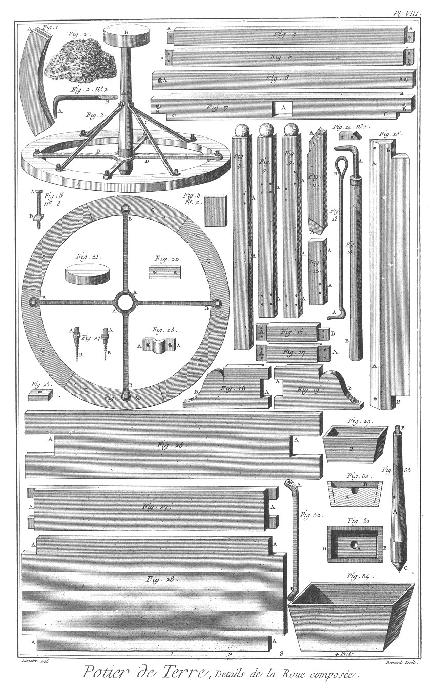](Planche_08.jpeg)

Fig.
1. L'une des six jantes de la roue.
	- A, la mortoise.

2. Eponge pour mouiller l'ouvrage.
	- n°. 2. Crochet du tournoir à manche.
		- A, le crochet.
		- B, sa tige.

3. Roue.
	- A, l'arbre.
	- B, la girelle.
	- C C, les tirans.
	- D, le croisillon.
	- E E, la roue.

4. Traverse du haut des petits piliers.
	- A A, les tenons.

5. L'une des quatre traverses du bas des petits piliers, du haut & du bas des piliers de derriere & du milieu.
	- A A, les tenons.

6. Payen.
	- A A, les trous des boulons.

7. Support de l'arbre de la roue.
	- A, l'entaille de la crapaudine.
	- B B, les pattes.

8. L'un des deux piliers de devant.
	- A A, les mortoises.
	- n° 2. L'une des six clés des jantes de la roue.
	- n°. 3. L'un des quatre boulons du payen.
		- A A, les têtes.
		- B B, les vis à écrous.

9. &
10. Deux des quatre piliers de milieu.
	- A A, les mortoises.

11. L'un des deux liens des piliers de derriere.
	- A A, &c. les tenons.

12. L'un des deux bas piliers.
	- A A, les mortoises.

13. Tournoir à boucle.
	- A, le crochet.
	- B, la boucle.

14. Tournoir à manche.
	- A, le crochet.
	- B, le manche.
	- n°. 2. Tasseau du siége.

15. Siége.
	- A A, le chanfrein.
	- B B, les parties échancrées.

16. L'une des deux entretoises du haut des bas piliers.
	- A, le tenon du pilier de derriere.
	- B, le tenon du petit pilier.

17. L'une des deux entretoises du bas des bas piliers.
	- A A, les tenons.

18. &
19. Bords latéraux de la table.
	- A A, les tenons.
	- B B, les consoles.

20. Roue.
	- A A, le croisillon.
	- B B, les pattes.
	- C C, les jantes.

21. Girelle de la roue.

22. Plate bande de la bride.
	- A A, les pattes.

23. Bride de l'arbre.
	- A A, les pattes.

24. Vis à tête à chapeau de la bride.
	- A A, les têtes.
	- B B, les vis en bois.

25. Crapaudine de l'arbre de la roue.

26. Vaucourt de la roue.
	- A A, les échancrures des liens.

27. Bord de face de la table.
	- A A, les tenons.

28. Dessus de la table.
	- A A, les échancrures des piliers.

29. Elévation perspective.

30. Coupe.

31. Plan d'une crapaudine emboîtée.
	- A, la crapaudine.
	- B, la boîte.

32. L'un des quatre tirans de la roue.
	- A, la patte du haut.
	- B, la patte du bas.

33. Arbre.
	- A, l'arbre.
	- B, le tenon.
	- C, le pivot.

34. Tera, auge remplie d'eau pour mouiller les doigts.

PLANCHES IX., X., & XI. Roue simple.
------------------------------------

[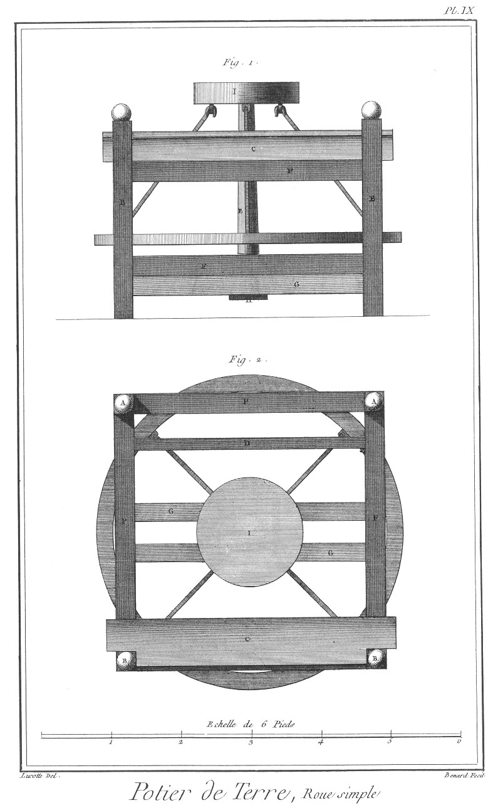](Planche_09.jpeg)
[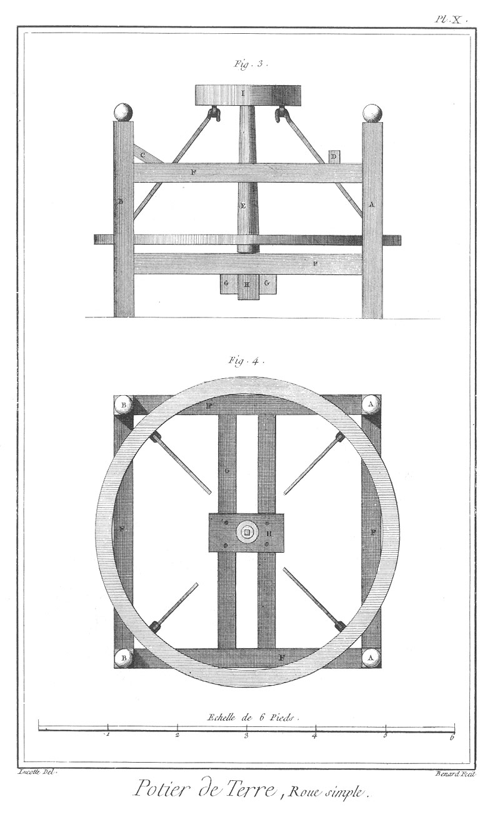](Planche_10.jpeg)
[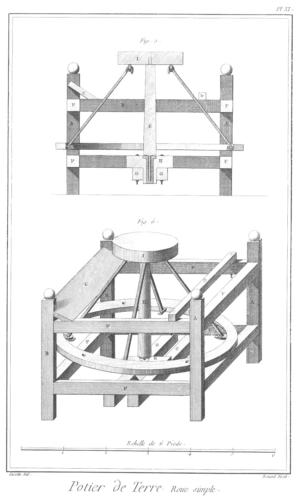](Planche_11.jpeg)

Fig.
1. Elévation.

2. Plan du dessus.

3. Elévation latérale.

4. Plan du dessous.

5. Coupe.

6. Elévation perspective d'une roue simple.
	- A, Pilier de devant.
	- B, pilier de derriere.
	- C, Siége.
	- D, payen.
	- E, roue garnie.
	- F, traverses des piliers.
	- G, support du pivot.
	- H, patin.
	- I, girelle.

PLANCHE XII. Détails de la roue simple.
---------------------------------------

[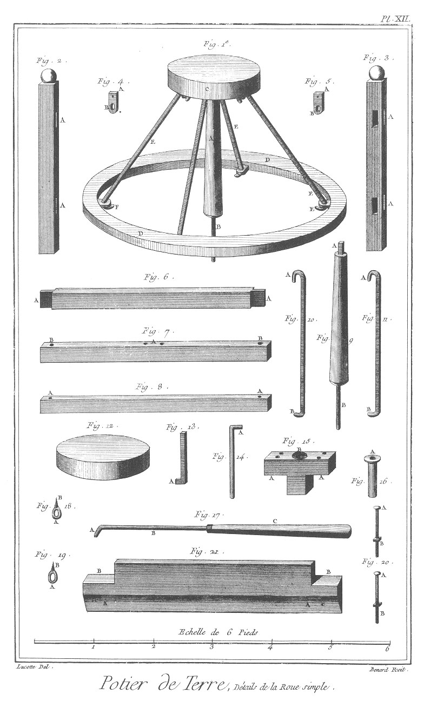](Planche_12.jpeg)

Fig.
1. Roue.
	- A, le pivot.
	- B, la broche.
	- C, la girelle.
	- D D, la roue.
	- E E, &c. les tirans.
	- F F, les pitons.

2. L'un des deux piliers de devant.
	- A A, les mortoises.

3. L'un des deux piliers de derriere.
	- A A, les mortoises.

4. &
5. Deux des quatre pitons des tirans.
	- A A, &c. les pattes servant de tenons.
	- B B, les anneaux.

6. L'une des huit traverses.
	- A A, les tenons.

7. L'un des deux supports du pivot de la roue.
	- A, les trous des boulons de la bourdonniere.
	- B B, les trous des boulons pour les arrêter.

8. Payen.
	- A A, les trous pour l'arrêter.

9. Pivot.
	- A, l'arbre quarré.
	- B, la broche.

10. &
11. Deux des quatre tirans.
	- A A, &c. les crochets du haut.
	- B B, les crochets du bas.

12. Girelle.

13. Arbre quarré.
	- A, le crochet.

14. Broche de pivot.
	- A, le crochet.

15. Patin.
	- A A, les pattes.
	- B, le trou de la douille.

16. Douille du patin.
	- A, le collet.

17. Tournoir.
	- A, le crochet.
	- B, la tige.
	- C, le manche.

18. &
19. Deux des quatre tire-fonds.
	- A A, les anneaux.
	- B B, les vis.

20. Deux des quatre boulons du patin.
	- A A, les têtes.
	- B B, les vis à écrous.

21. Siége.
	- A A, la partie chanfreinée.
	- B B, les échancrures.

PLANCHES XIII., XIV., & XV.
---------------------------

[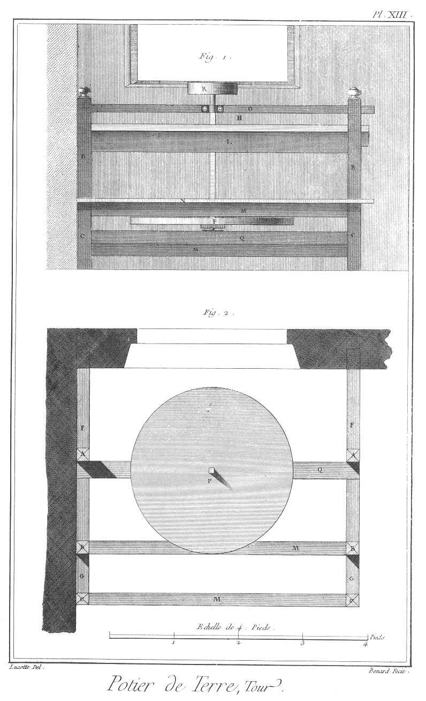](Planche_13.jpeg)

[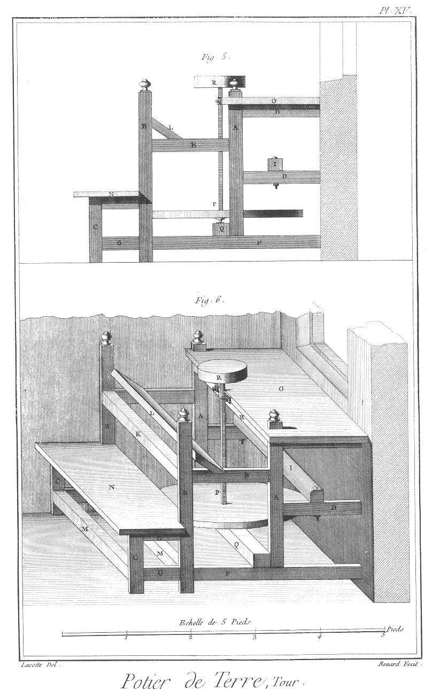](Planche_15.jpeg)

Fig.
1. Elévation.

2. Plan du dessous.

3. Coupe.

4. Plan du dessus.

5. Elévation latérale.

6. Elévation perspective d'un tour.
	- A, pié de devant.
	- B, pié de derriere.
	- C, bas pié.
	- D, entretoise de devant.
	- E, entretoise de milieu.
	- F, sommier.
	- G, entretoise de derriere.
	- H, traverse de devant.
	- I, payen.
	- K, traverse de derriere.
	- L, siége.
	- M, traverse de bas pié.
	- N, vaucourt.
	- O, table.
	- P, le tour.
	- Q, support du teur.
	- R, girelle.

PLANCHE XVI.
------------

[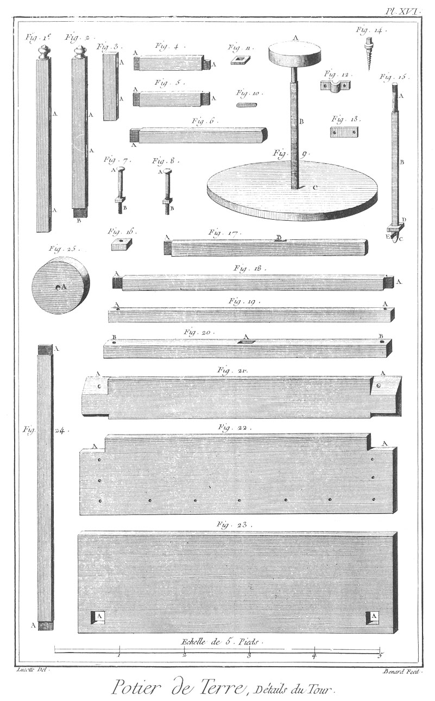](Planche_16.jpeg)

Fig.
1. L'un des deux piliers de derriere.
	- A A, les mortoises.

2. L'un des deux piliers ce devant.
	- A A, les mortoises.
	- B B, les tenons.

3. L'un des deux bas pilers.
	- A A, les mortoises.

4. L'une des deux entretoises du haut du vaucourt.
	- A A, les tenons.

5. L'une des deux entretoises du bas du vaucourt.
	- A A, les tenons.

7. &
8. Boulons du paren & du support.
	- A A, les têtes.
	- B B, les vis à écrou.

9. Tour.
	- A, la girelle.
	- B, l'arbre.
	- C, la roue.

10. Coin pour serrer la virole.

11. Virole quarrée de l'arbre.

12. Bride de l'arbre du tour.
	- A A, les pattes.

13. Plate-bande de la bride.
	- A A, les pattes.

14. L'une des deux vi à tête à chapeau de la bride.

15. Arbre.
	- A, la vis pour visser dans la girelle.
	- B, le quarré de l'arbre
	- C, le pivot.
	- D, la virole.
	- E, le coin.

16. Crapaudine.

17. L'un des deux sommiers.
	- A A, les tenons.
	- B B, les mortoises des piliers de devant.

18. Traverse de devant.
	- A A, les tenons.

19. Payen.
	- A A, le trous des boulons.

20. Support du pivot du tour.
	- A, l'entaille pour la crapaudine.
	- B B, les trous des boulons pour l'arrêter.

21. Siége.
	- A A, és parties chanfreinées.

22. Tablette du vaucourt. A A, les échancrures.

23. Table du tou.
	- A A, les trous des piliers.

24. L'une des tois traverses des piés de derriere du tour.
	- A A, les tenons.

25. Girelle.
	- A, e trou de l'arbre.

PLANCHE XVII. Four.
-------------------

[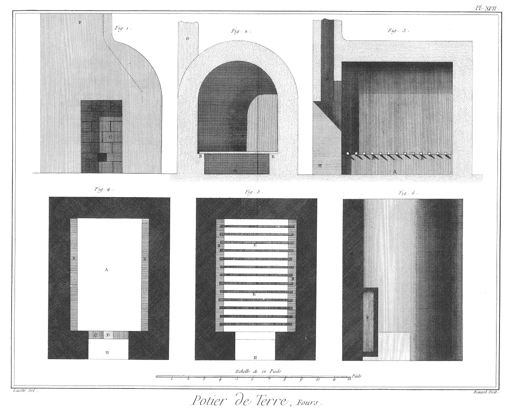](Planche_17.jpeg)

Fig.
1. Elévation en face.

2. Coupe transversale.

3. Coupe longitudinale.

4. Plan du las.

5. Plan au-dessus de la grille.

6. Plan au-dessus de la cheminée du four pour la cuisson de la terre.
	- A, fond du four.
	- B B, banquettes.
	- C, cloison en terre faite après coup.
	- D, boucle.
	- E E, barreaux pour soutenir les vases.
	- F, cheminée.
	- G, mur sur lequel est appuyée la cheminée.
	- H, porte.

PLANCHE XVIII. Outils & pipes.
------------------------------

Fig.
1. Tisart emmanché.
	- A, le crochet.
	- B, la tige.
	- C, le manche.

2. Tisart à boucle.
	- A, le crochet.
	- B, la tige.
	- C, la boucle.

3. &
4. Barres de différentes longueurs pour le soutien des vases dans le four.

5. Batte tranchante.
	- A, la batte.
	- B, le manche.

6. &
7. Petis rouleaux de plusieurs grosseurs propres à rouler la terre.

8. &
9. Grands rouleaux de plusieurs grosseurs destinés aux mêmes ouvrages.

10. &
11. Rouleaux à main.
	- A A, les rouleaux.
	- B B, les mains.

12. Jauge pour jauger les vases que l'on tourne.
	- A, le pié.
	- B, la tige.
	- C, la jauge.

13. Batte à tranchant arrondi.
	- A A, la batte.
	- B, le manche.

14. Batte plate.
	- A, la batte.
	- B, le manche.
	- 14. n°. 2. Batte ronde
		- A, la batte.
		- B, le manche.

15. &
16. Ripes à riper la terre.
	- A A, les ripes.
	- B B, les manches.

17. &
18. Lames.
	- A A, les lames.
	- B B, les boucles.

19. Scie à couper la terre.
	- A, le fil de fer.
	- B B, les tortillons de parchemin.

20. Pierre à travailler la terre.

21. Pipe de Rouen.
	- A, le fourneau.
	- B, le tuyau.

22. Pipe de Hollande.
	- A, le fourneau.
	- B, le tuyau.

23. Tuyau fait.
	- 23. n°. 2. Bande de terre préparée pour former un tuyau.
		- A, le côté du fourneau.

24. Fourneau moulé.
	- A, la tête.
	- B, la queue.

25. Fourneau moulé.
	- A, la tête.
	- B, la queue courbée.

26. La même bande pliée sur sa longueur.

27. La même tournée soudée avec collet.
	- A, le collet.
	- B, le tuyau.

28. Le tuyau monté sur son mandrin.
	- A A, le mandrin.
	- B, le tuyau.
	- C, le collet.

29. Mandrin de fil de laiton.

30. Moule de fourneau.
	- A, la pointe.

31. Petite batte plate.
	- A, la batte.
	- B, le manche.

32. Maillet.
	- A, le maillet.
	- B, le manche.

33. &
34. Lames.
	- A A, les lames.
	- B B, les manches.

35. Vase à contenir l'eau pour mouiller pendant le travail.

[->](../22-Potier_d'Etain/Légende.md)
