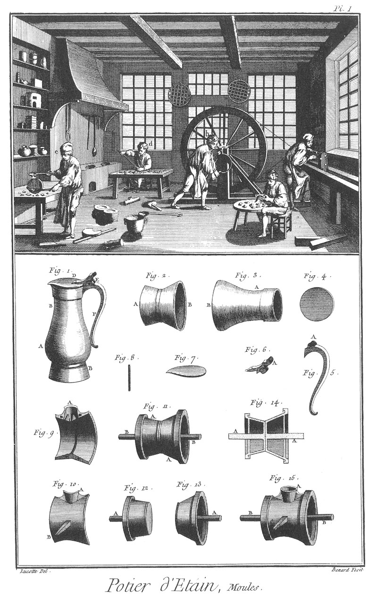
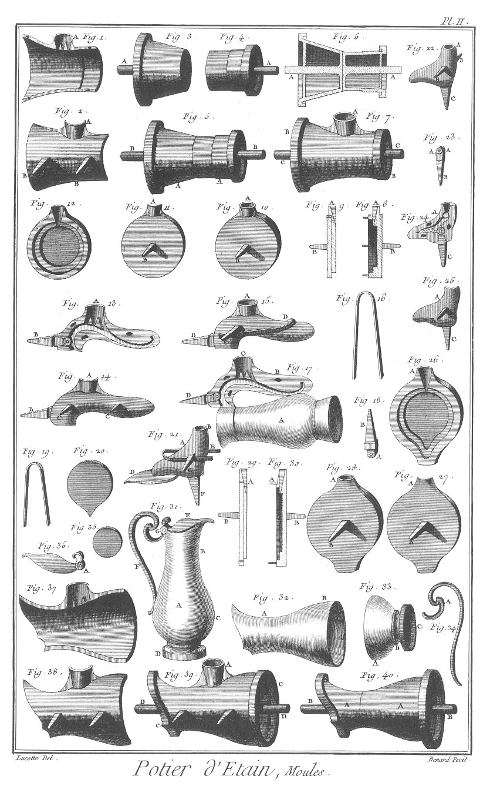
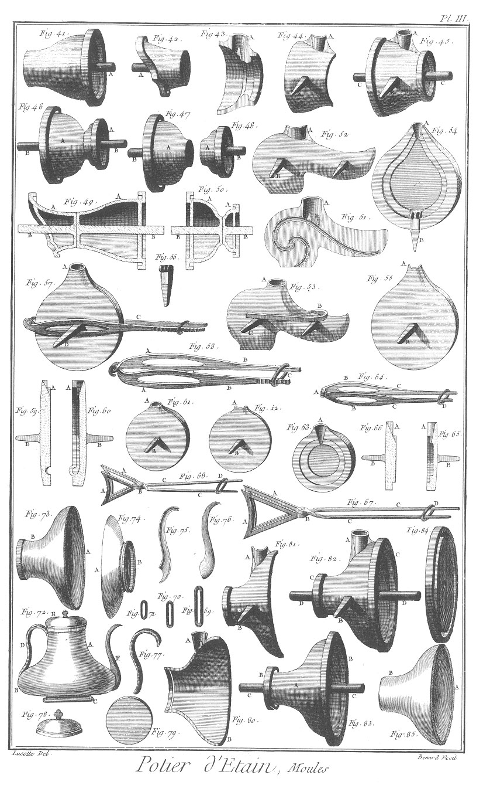
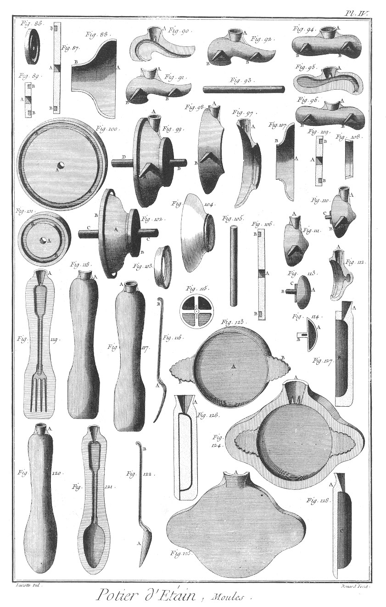
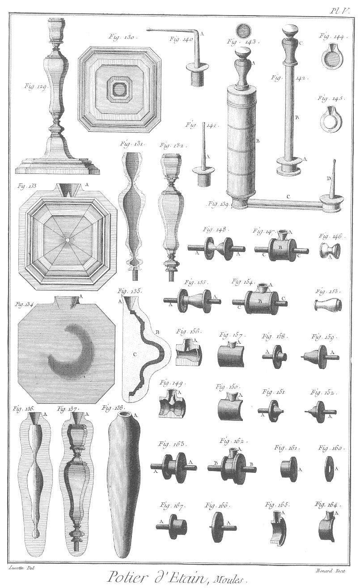
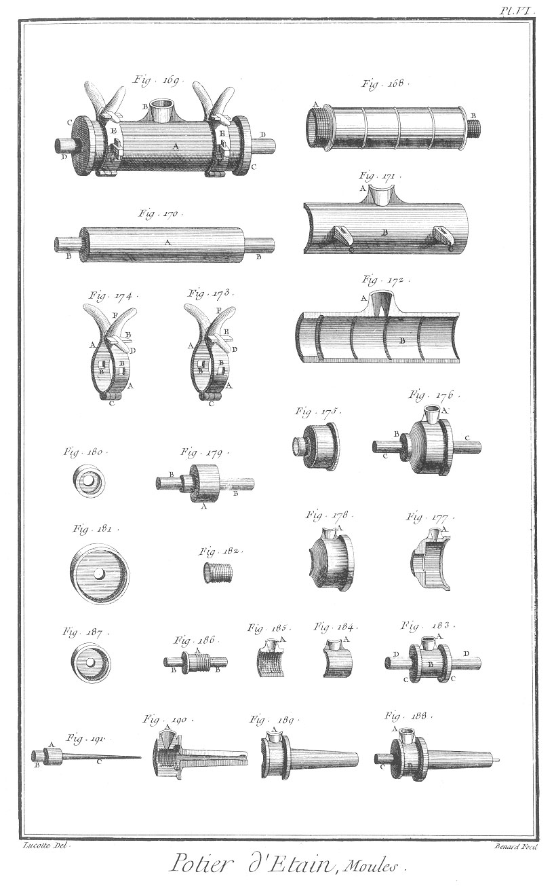
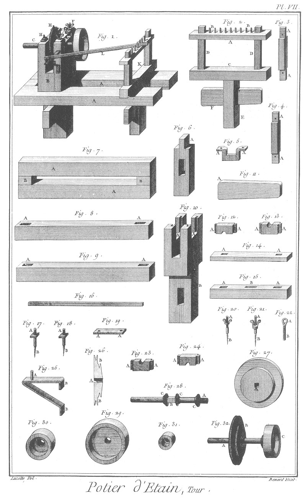
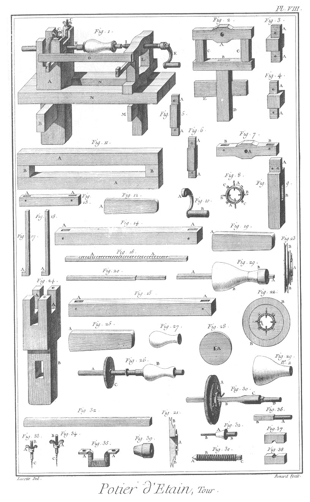
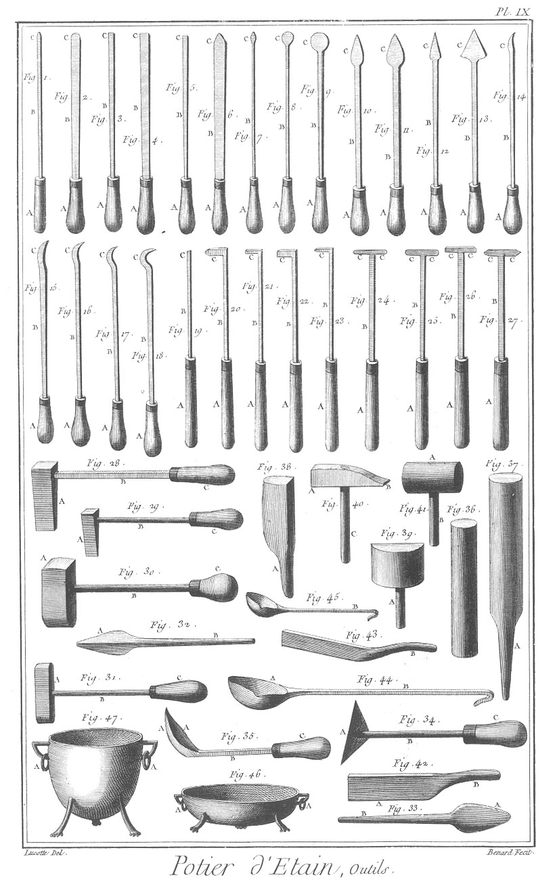

POTIER D'ETAIN
==============

Contenant neuf Planches.

PLANCHE Iere.
-------------

Le haut de cette Planche représente un attelier de potier d'étain, où plusieurs ouvriers sont occupés à divers ouvrages ; un en

- a, à tourner au tour ; un en
- b, à tourner la roue du tour ; un en
- c, à ajuster des charnieres, couvercles de pots, &c. un en
- d, à souder les mêmes charnieres, pots & autres vases ; un autre enfin en
- e à couler dans des moules :

le reste de l'attelier est parsemé de differens ustensiles de potier d'étain, comme moules, cuilleres, marmites, vases, & autres ouvrages.

Fig.
1. Pot de vin.
	- A, la panse.
	- B, le cou.
	- C, le pié.
	- D, le couvercle.
	- E, la charniere.
	- F, l'anse.

2. Pié du pot coulé prêt à être soudé.
	- A, le pié.
	- B, la partie de la panse.

3. Cou du pot.
	- A, le cou.
	- b, la partie de la panse.

4. Cul du pot.

5. Anse du pot.
	- A, la charniere.

6. Charniere du couvercle du pot.
	- A, le poucier.

7. Couvercle du pot.

8. Goupille de la charniere du pot.

9. &
10. Parties démontées du moule du pié du pot.
	- A A, le jet.
	- B, la queue.

11. Noyau du moule.
	- A A, &c. les noyaux.
	- B B, les mandrins.

12. &
13. Les noyaux démontés.
	- A A, les mandrins.

14. Coupe des noyaux réunis.
	- A A, les mandrins.

15. Le moule monté.
	- A, le jet.
	- B B, les mandrins.
	- C, la queue.

PLANCHE II. Moules.
-------------------

Fig.
1. &
2. Parties démontées du moule du cou.
	- A A, le jet.
	- B B, les queues.

3. &
4. Parties démontées du noyau du moule.
	- A A, les mandrins.

5. Noyau du moule.
	- A A, les noyaux.
	- B B, les mandrins.

6. Coupe des mêmes noyaux.
	- A A, les mandrins.

7. Moule du cou du pot.
	- A, le jet.
	- B B, les noyaux.
	- C C, les mandrins.

8. &
9. Coupe du moule du cul du pot.
	- A A, les jets.
	- B B, les queues.

10. Le moule monté.
	- A, le jet.
	- B, la queue.

11. &
12. Les deux parties démontées du moule.
	- A A, les jets.
	- B, la queue.

13. &
14. Parties démontées du moule de l'anse du pot.
	- A, le jet.
	- B, le goujon pour la fonte de la charniere.
	- C C, les queues.

15. Moule de l'anse monté.
	- A, le jet.
	- B, le goujon.
	- C, la queue.
	- D, la pince pour serrer les parties démontées ensemble.

16. Pince du moule précédent.

17. Moule monté sur le pot, pour y couler l'anse.
	- A, le pot.
	- B, le moule.
	- C, le jet.
	- D, le goujon.

18. Goujon pour couler la charniere de l'anse.
	- A, la charniere.
	- B, la queue.

19. Piece du moule de la charniere du couvercle.

20. Couvercle du pot.

21. Moule monté sur le couvercle pour y couler la charniere.
	- A, le moule.
	- B, le jet.
	- C, la queue.
	- D, le couvercle.
	- E, la pince.
	- F, la queue du goujon.

22. Le même moule.
	- A, le jet.
	- B B, les queues.
	- C, le goujon.

23. Goujon pour couler la charniere sur le couvercle.
	- A A, les charnons.
	- B, la queue.

24. &
25. Les parties du même moule démontées.
	- A A, les jets.
	- B, la queue.
	- C, le goujon.

26. &
27. Parties démontées du moule pour le couvercle.
	- A A, les jets.
	- B, la queue.

28. Le même moule monté.
	- A, le jet.
	- B, la queue.

29. &
30. Coupes du même moule.
	- A A, les jets.
	- B B, les queues.

31. Pot à l'eau.
	- A, le pot.
	- B, le cou.
	- C, la panse.
	- D, le pié.
	- E, l'anse.
	- F, le couvercle.
	- G, la charniere.

32. Le haut du pot.
	- A, le cou.
	- B, la panse.

33. Le bas du pot.
	- A, la panse.
	- B, la gorge.
	- C, le pié.

34. Anse du pot.
	- A, la volute.

35. Cul du pot.

36. Couvercle du pot.
	- A, la charniere.

37. &
38. Parties du moule démontées.

39. Le même moule monté.
	- A, le jet.
	- B B, les queues.
	- C C, parties des noyaux.
	- D D, les mandrins.

40. Noyaux du moule.
	- A A, les noyaux.
	- B B, les mandrins.

PLANCHE III.
------------

Fig.
41. &
42. Noyaux du moule démontés.
	- A A, les mandrins.

43. &
44. Parties démontées du moule pour le pié du pot.
	- A A, les jets.
	- B, la queue.

45. Le moule du pié du pot monté.
	- A, le jet.
	- B, la queue.
	- C C, les mandrins.

46. Noyaux du moule précédent.
	- A A, les noyaux.
	- B B, les mandrins.

47. &
48. Les mêmes noyaux désunis.
	- A A, les noyaux.
	- B B, les mandrins.

49. Coupe des noyaux du haut du pot.
	- A A, les noyaux.
	- B B, les mandrins.

50. Coupe des noyaux du bas du pot.
	- A A, les noyaux.
	- B B, les mandrins.

51. &
52. Parties séparées du moule de l'anse du pot.
	- A A, les jets.
	- B B, les queues.

53. Le moule de l'anse monté.
	- A, le jet.
	- B, la pince.
	- C C, les queues.

54. &
55. Parties séparées du moule du couvercle du pot.
	- A A, les jets.
	- B, le goujon pour couler la charniere.
	- C, la queue.

56. Goujon à couler la charniere.
	- A A, les charnons.
	- B, la queue.

57. Le même moule monté.
	- A, le jet.
	- B, la queue.
	- C, la pince pour serrer le moule.

58. Pince du moule précédent.
	- A A, les mors fondus.
	- B B, les branches à crémaillere.
	- C, l'anneau.

59. &
60. Coupe du même moule.
	- A A, les jets.
	- B B, les queues.

61. Moule du cul du pot.
	- A, le jet.
	- B, la queue.

62. &
63. Parties séparées du moule du cul du pot.
	- A A, les jets.
	- B, la queue.

64. Petite pince à moule.
	- A, la charniere.
	- B B, les mors fondus.
	- C C, les branches.
	- D, l'anneau.

65. &
66. Coupe du moule du cul du pot.
	- A A, les jets
	- B B, les queues.

67. Tenailles à plats.
	- A A, les mors.
	- B, la charniere.
	- C C, les branches.
	- D, l'anneau.

68. Tenailles à assiettes.
	- A A, les mors.
	- B, la charniere.
	- C C, les branches.
	- D, l'anneau.

69. &
70. &
71. Anneaux de diverses grandeurs.

72. Théiere.
	- A, le cou.
	- B, la panse.
	- C, le pié.
	- D, l'anse.
	- E, le couvercle.
	- F, la goulotte.

73. Haut de la théiere.
	- A, la panse.
	- B, le cou.

74. Bas de la théiere.
	- A, la panse.
	- B, le pié.

75. &
76. Goulotte de la théiere.

77. Anse de la théiere.

78. Couvercle de la théiere.

79. Cul de la théiere.

80. &
81. Parties séparées du moule du haut de la théiere.
	- A A, les jets.
	- B, la queue.

82. Le même moule réuni.
	- A, le jet.
	- B, la queue.
	- C C, les viroles du noyau.
	- D D, les mandrins.

83. Noyau du moule.
	- A, le noyau.
	- B B, les viroles.
	- C C, les mandrins.

84. Grande virole du noyau du même moule.

85. Noyau du moule.
	- A, la panse.
	- B, le cul.

PLANCHE IV.
-----------

Fig.
86. Petite virole de noyau du moule de la théiere.

87. Coupe de la grande virole.
	- A, le trou du mandrin.
	- B B, la cannelure pour l'enchâssement du noyau.

88. Coupe du noyau.
	- A, la panse.
	- B, le cou.

89. Coupe de la petite virole.
	- A, le trou du mandrin.
	- B, la cannelure pour l'enchâssement du noyau.

90. &
91. Parties séparées du moule de l'anse.
	- A A, les jets.
	- B B, les queues.

92. Le même moule réuni.
	- A, le jet.
	- B B, les queues.

93. Mandrin du noyau du moule du haut de la théiere.

94. Moule de la goulotte.
	- A, le jet.
	- B B, les queues.

95. &
96. Parties séparées du même moule.
	- A A, les jets.
	- B B, les queues.

97. &
98. Parties séparées du moule du bas de la théiere.
	- A A, les jets.
	- B, la queue.

99. Moule du bas de la théiere.
	- A, le jet.
	- B, la queue.
	- C C, les viroles du noyau.
	- D D, le mandrin.

100. Grande virole du noyau du moule.
	- A, le trou du mandrin.
	- B B, la cannelure pour l'enchâssement du noyau.

101. Petite virole.
	- A, le trou du mandrin.
	- B B, la cannelure.

102. Noyau du moule.
	- A, le noyau.
	- B B, les viroles.
	- C C, les mandrins.

103. Petite partie du noyau.

104. Grande partie du noyau.

105. Mandrin du moule.

106. Coupe de la grande virole.
	- A, le trou du mandrin.
	- B B, la cannelure.

107. Grande partie du noyau.
	- A, la panse.
	- B, le cou.

108. Petite partie du noyau.

109. Petite virole du noyau.
	- A, le trou du mandrin.
	- B, la cannelure.

110. Moule du couvercle de la théiere.
	- A, le jet.
	- B, la queue.
	- C C, le goujon du noyau.

111. &
112. Parties séparées du moule du couvercle de la théiere.
	- A A, les jets.
	- B, la queue.

113. Elévation perspective du noyau du couvercle.
	- A, le noyau.
	- B, le goujon.
	- C, la clavette.

114. Coupe du même noyau.
	- A, le noyau.
	- B, le goujon.

115. Elévation géométrale du même noyau.

116. Elévation d'une fourchette d'étain.
	- A, la fourchette.
	- B, la queue.

117. Elévation du moule de la fourchette.
	- A, le jet.

118. &
119. Parties séparées du moule de la fourchette.
	- A A, les jets.

120. Elévation du moule de la cuillere.
	- A, le jet.

121. Merelle séparée de la cuillere.
	- A, le jet.

122. Cuillere.
	- A, la cuillere.
	- B, la queue.

123. Elévation d'une écuelle.
	- A, le fond.
	- B B, les oreilles.

124. &
125. Parties séparées du moule de l'écuelle.
	- A A, les jets.

126. Coupes du moule réunies de l'écuelle.
	- A, le jet.

127. &
128. Coupes des parties séparées du moule de l'écuelle.
	- A A, les jets.
	- B, le creux.
	- C, le plein.

PLANCHE V.
----------

Fig.
129. Elévation, & fig.
130. Elévation d'un chandelier.

131. &
132. Parties séparées du haut du chandelier.

133. &
134. Parties séparées du moule du pié du chandelier.
	- A A, les jets.

135. Coupe du moule du pié du chandelier.
	- A, le jet.
	- B, le moule creux.
	- C, le moule plein.

136. &
137. Parties séparées du moule d'une des parties du haut du chandelier.
	- A A, les jets.

138. Le même moule réuni.
	- A, le jet.

139. Seringue.
	- A, le manche du piston.
	- B, le corps de la seringue.
	- C, le conduit.
	- D, le canon.

140. Canon coudé.
	- A, le coude.

141. Canon droit.
	- A, le canon.

142. Piston de la seringue.
	- A, le piston.
	- B, la tige.
	- C, le manche se démontant en trois parties.

143. Calotte du manche.

144. &
145. Moules creux & pleins de la calotte.

146. Milieu du manche démonté.
	- A, la gorge.

147. Moule du milieu du manche.
	- A, le jet.
	- B, le moule.
	- C C, les noyaux.

148. Noyaux réunis du moule.
	- A A, les mandrins.

149. &
150. Parties séparées du moule du milieu du manche.
	- A A, les jets.

151. &
152. Noyaux du même moule.
	- A A, les mandrins.

153. Bas du manche du piston de la seringue.

154. Moule du bas du manche.
	- A, le jet.
	- B, le corps du moule.
	- C C, les noyaux.

155. Noyaux réunis du moule.
	- A A, les mandrins.

156. &
157. Parties séparées du moule.
	- A A, les jets.

158. &
159. Noyaux séparés.
	- A A, les mandrins.

160. &
161. Viroles du piston.
	- A A, les trous pour le passage de la tige.

162. Moule du piston de la seringue.
	- A, le jet.
	- B B, les noyaux.

163. Noyaux réunis du moule.
	- A A, les mandrins.

164. &
165. Parties séparées du moule.
	- A A, les jets.

166. &
167. Noyaux séparés.
	- A A, les mandrins.

PLANCHE VI.
-----------

Fig.
168. Corps de la seringue.
	- A, le côté du bouchon.
	- B, le côté du canon.

169. Moule du corps de la seringue, monté de ses colliers.
	- A, le corps du moule.
	- B, le jet.
	- C C, les viroles.
	- D D, les mandrins.
	- E E, les colliers.
	- F F, les queues garnies de clavette.

170. Noyau du moule.
	- A, le noyau.
	- B B, les mandrins.

171. &
172. Parties séparées du moule.
	- A A, les jets.
	- B B, les corps.
	- C C, les queues.

173. &
174. Colliers du moule.
	- A A, les brides.
	- B B, les trous quarrés pour le passage des épieux du moule.
	- C C, les charnieres.
	- D D, les goujons.
	- E E, les clavettes.
	- F F, les manches.

175. Bouchons du corps de la seringue.

176. Moule du bouchon.
	- A, le jet.
	- B B, les viroles.
	- C C, les mandrins faisant partie du noyau.

177. &
178. Parties séparées du moule du bouchon.
	- A A, les jets.

179. Noyau du moule du bouchon.
	- A, le noyau.
	- B B, les mandrins.

180. &
181. Petite & grande virole du moule.

182. Embouchure du canon soudé au corps de la seringue.

183. Moule de l'embouchure du canon.
	- A, le jet.
	- B, le corps du moule.
	- C C, les viroles.
	- D D, les mandrins.

184. &
185. Parties séparées du moule.
	- A A, les jets.

186. Noyau du moule.
	- A, le noyau.
	- B B, les mandrins.

187. L'une des viroles du moule.

188. Moule à canon.
	- A, le jet.
	- B, le corps du moule.
	- C, le noyau.

189. &
190. Parties séparées du même moule.
	- A A, les jets.

191. Noyau.
	- A, le noyau.
	- B, le mandrin.
	- C, la fusée.

PLANCHE VII. Tour du Potier d'étain.
------------------------------------

Fig.
1. Tour en l'air.
	- A A, les jumelles d'établi.
	- B, la poupée.
	- C, l'arbre.
	- D D, les coussinets.
	- E, la plate bande.
	- F F, les vis à écrous à oreille.
	- G, la vis pour serrer ler coussinets.
	- H H, vis a écrous quarrés.
	- I, le support à potence.
	- K, le support à chassis.
	- L, la barre de support.

2. Support à chassis.
	- A, la barre à goujons.
	- B B, les goujons.
	- C, le sommier.
	- D D, les supports.
	- E, la jumelle.
	- F, la clé.

3. &
4. Supports.
	- A A, &c. les tenons.

5. Faux coussinet.
	- A A, les pattes.

6. Jumelle du support à chassis.
	- A, le tenon.
	- B, la mortoise.

7. Etabli.
	- A A, les jumelles.
	- B B, les entretoises.

8. &
9. Jumelles de l'établi.
	- A A, &c. les mortoises.

10. Poupée à lunettes.
	- A A, les lunettes.
	- B, la jumelle à clé.

11. Clé du support à chassis.
	- A, la tête.

12. &
13. Arrieres coussinets.
	- A A, &c. les languettes.

14. Barre à goujon.
	- A A, les mortoises.

15. Sommier.
	- A A, les mortoises des supports.
	- B, les mortoises de la jumelle.

16. Barre du support.

17. &
18. Vis à écrous quarrés.
	- A A, les vis à écrous.
	- B B, les vis en bois

19. Plate bande des coussinets.
	- A A, les trous des vis.

20. &
21. Vis à écrous à oreille.
	- A A, les vis à écrous.
	- B B, les vis en bois.

22. Vis à piton pour serrer les coussinets.

23. &
24. Avant-coussinets.
	- A A, les languettes.

25. Support à potence.
	- A, le goujon.
	- B B, les pattes.

26. Coupe de la poulie double.
	- A, le trou de l'arbre.
	- B B, les noix.

27. Poulie double.
	- A, le trou de l'arbre.

28. Arbre démonté.
	- A, la vis.
	- B, le quarré.
	- C C, les embasses.

29. &
30. &
31. Boîtes de différentes grandeurs.

32. Arbre.
	- A, l'arbre.
	- B, la poulie double.

PLANCHE VIII. Suite du tour du Potier d'étain.
----------------------------------------------

Fig.
1. Tour à pointe.
	- A, la poupée à lunette.
	- B, la clé.
	- C C, les vis à écrous des coussinets.
	- D, le faux coussinet.
	- E E, les coussinets.
	- F F, les crochets de support.
	- G, le support.
	- H, l'arbre.
	- I, la vis.
	- K, la manivelle.
	- L, le support à chassis.
	- M, la clé.
	- N N, les jumelles de l'établi.

2. Support à chassis.
	- A, la barre à écrou.
	- B, le sommier.
	- C C, les supports.
	- D, la jumelle à clé.
	- E, la clé.

3. &
4. Entretoises de l'établi.
	- A A, &c. les tenons.

5. &
6. Supports.
	- A A, &c. les tenons.

7. Barre à écrou.
	- A, l'écrou.
	- B B, les mortoises.

8. Chassis à vis de la poulie double.
	- A A, le chassis à écrou.
	- B B, &c. les vis à tête quarrée.
	- C C, les pattes.

9. Jumelle à clé du support à chassis.
	- A, le tenon.
	- B, la mortoise de la clé.

10. Manivelle.
	- A, la clé.
	- B, le manche.

11. Etabli.
	- A A, les jumelles.
	- B B, les entretoises.

12. Clé.
	- A, la tête.

13. Sommier.
	- A A, les mortoises.

14. &
15. Jumelles de l'établi.
	- A A, les mortoises.

16. Barre du support de fer à dent.
	- A A, les dents.

17. &
18. Crochets de support.
	- A A, les crochets.

19. Clé.
	- A, la tête.

20. Partie de l'arbre démonté.

21. Coupe.

22. Elévation en face de la poulie double.

23. Elévation latérale de la poulie double de l'arbre à canon.
	- A, le chassis à vis.
	- B B, les noix.

24. Poupée à lunettes.
	- A A, les lunettes.
	- B, la jumelle.

25. Clé de la poupée.
	- A, la tête.

26. Arbre monté du tour.
	- A, l'arbre.
	- B, le modele monté.
	- C, la poulie.

27. Modele.

28. Poulie.
	- A, le trou de l'arbre.

29. Arbre démonté.
	- A A, les embasses.
	- B, la partie du mandrin.
	- n°. 2. Partie de l'arbre démonté.

30. Arbre à canon monté.
	- A, la poulie.
	- B, l'arbre.
	- C, le canon.
	- D, le mandrin.

31. Pointe à vis.
	- A, la pointe.
	- B, la vis.
	- C, le quarré.

32. Extrémité de l'arbre.
	- A, le mandrin.
	- B B, la fusée.

33. &
34. Vis à écrous à oreille.
	- A A, les écrous.
	- B B, les vis.
	- C C, les vis en bois.

35. Faux coussinet.
	- A A, les pattes.

36. Mandrin de l'arbre.
	- A, la partie ronde.
	- B, la partie quarrée entrant dans le canon.

37. &
38. Coussinets.

39. Mandrin de pot monté.

PLANCHE IX.
-----------

Fig.
1. &
2. Gouges.

3. &
4. Ciseaux.

5. &
6. Grains-d'orge.

7. &
8. &
9. Gouges à palettes.

10. &
11. Palettes à grains-d'orge.

12. &
13. Grains-d'orge à queues.

14. &
15. Ciseaux rompus.

16. &
17. &
18. Ciseaux crochus.

19. &
20. Gouges coudées.

21. &
22. Ciseaux coudés.

23. Grain-d'orge coudé.

24. &
25. Gouges à T.

26. Ciseaux à T.

27. Grain-d'orge à T.
	- A, les manches.
	- B, les tiges.
	- C, les taillans.

28. &
29. Gros & petit fers à souder
	- A A, les fers.
	- B B, les tiges.
	- C C, les manches.

30. Autre fer.
	- A, le fer.
	- B, la tige.
	- C, le manche.

31. Fer à deux pannes.
	- A, le fer.
	- B, la tige.
	- C, le manche.

32. Fer quarré.
	- A, le fer.
	- B, la tige.

33. Fer rond.
	- A, le fer.
	- B, la tige.

34. Grattoir.
	- A, le grattoir.
	- B, la tige.
	- C, le manche.

35. Autre grattoir.
	- A A, les taillans.
	- B, la tige.
	- C, le manche.

36. &
37. Rouleaux.

38. Batte ronde.
	- A, le manche:

39. Batte sur champ.
	- A, le manche.

40. Marteau.
	- A, la tête.
	- B, la paume.
	- C, le manche.

41. Maillet.
	- A, le maillet.
	- B, le manche.

42. &
43. Lames à couper.
	- A A, les taillans.
	- B B, les manches.

44. &
45. Grande & petite cuilleres à couler.
	- A A, les cuilleres.
	- B B, les manches.

46. Poële à chauffer les fers.
	- A A, les anneaux.

47. Marmitte à fondre.
	- A A, les anneaux.

[->](../23-Potier_d'Etain_Bimblotier/Légende.md)
