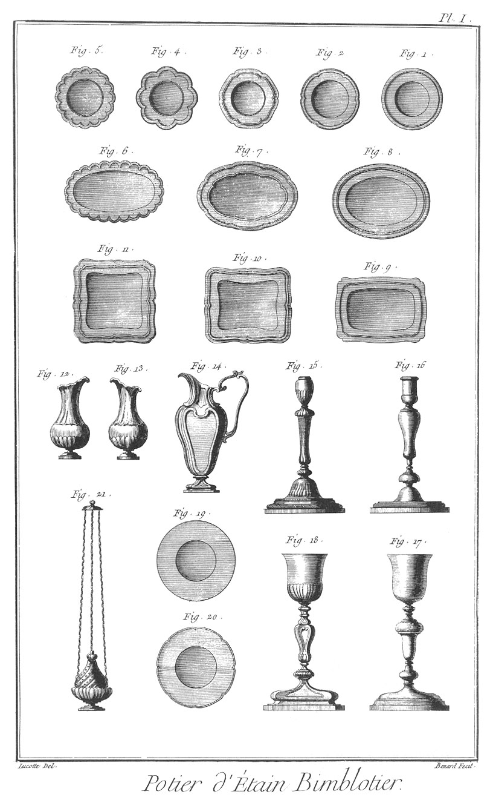
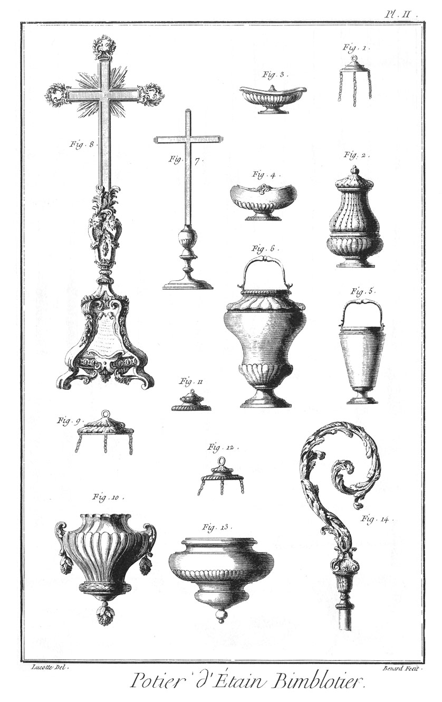
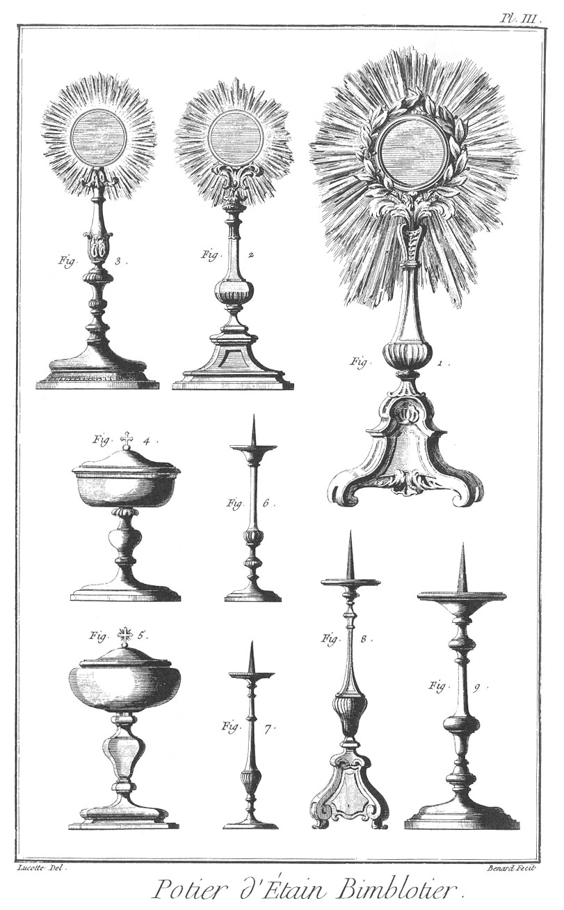
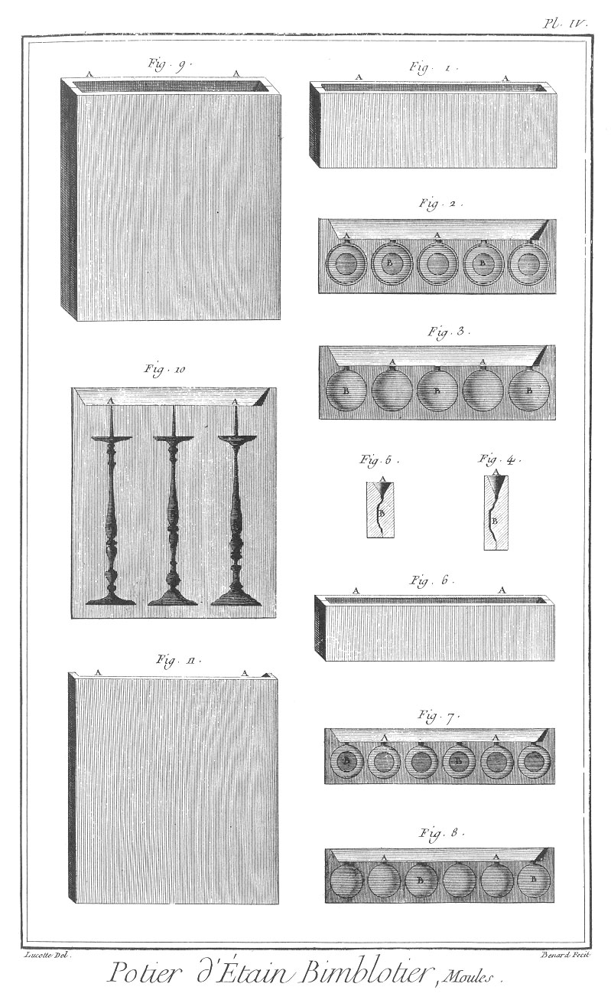
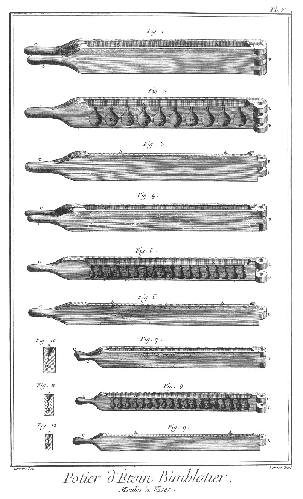
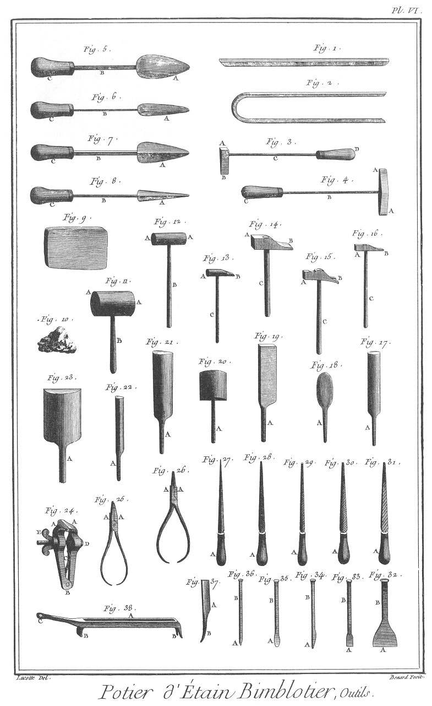

POTIER D'ETAIN BIMBLOTIER
=========================

Contenant six Planches.

PLANCHE Iere. Bimblots.
-----------------------

Fig.
1. &
2. &
3. &
4. &
5. Petites assiettes ou plats ronds à pans & de différens contours.

6. &
7. &
8. Petits plats ovales de différentes formes.

9. &
10. &
11. Petits plats ou jattes quarrées ou barlongues de plusieurs formes.

12. &
13. Burettes sans anse.

14. Burette façonnée avec anse.

15. Chandelier façonné.

16. Chandelier rond & simple.

17. &
18. Calices simples & façonnés.

19. &
20. Patenes simples & façonnées.

21. Petit encensoir.

PLANCHE II. Bimblots.
---------------------

Fig.
1. &
2. &
3. Soleils de plusieurs formes.

4. &
5. Ciboirs ronds & à pans.

6. &
7. Petits chandeliers d'autel.

8. Grand chandelier d'autel triangulaire.

9. Grand chandelier d'autel rond.

PLANCHE III. Bimblots.
----------------------

Fig.
1. &
2. Encensoirs.

3. &
4. Navettes.

5. &
6. Bénitiers.

7. &
8. Croix d'autel.

9. &
10. Lampe & son couvercle.

11. Couvercle de lampe.

12. &
13. Autre lampe & son couvercle.

14. Crosse.

PLANCHE IV. Moules.
-------------------

Fig.
1. Moule à plats monté.
	- A A, le jet.

2. Creux du moule.
	- A A, &c. les jets.
	- B B, les creux.

3. Plein du moule.
	- A A, &c. les jets.
	- B B, les pleins.

4. Coupe du moule précédent.
	- A, le jet.
	- B, le creux.

5. Coupe du moule suivant.
	- A, le jet.
	- B, le creux.

6. Moule à assiettes monté.
	- A A, le jet.

7. Creux du moule.
	- A A, &c. les jets.
	- B B, les creux.

8. Plein du moule.
	- A A, &c. les jets.
	- B B, les pleins.

9. Moule de chandeliers monté.
	- A A, le jet.

10. Intérieur du moule.
	- A A, les jets.
	- B B, les creux.

11. Extérieur du même moule.
	- A A, le jet.

PLANCHE V. Moules à vases.
--------------------------

Fig.
1. Moule à vase monté.
	- A A, le jet.
	- B, la charniere double.
	- C C, les manches.

2. Intérieur de l'une des parties du moule.
	- A A, les jets.
	- B B, les creux.
	- C C, les charnons de la charniere.
	- D, le manche.

3. Extérieur de la même partie du moule.
	- A A, le jet.
	- B B, les charnons.
	- C, le manche.

4. Autre moule à vase monté.
	- A A, le jet.
	- B, la charniere simple.
	- C C, les manches.

5. Intérieur de l'une des parties du moule.
	- A A, les jets.
	- B B, les creux.
	- C C, les charnons de la charniere.
	- D, le manche.

6. Extérieur de la même partie du moule.
	- A A, le jet.
	- B, le charnon simple.
	- C, le manche.

7. Moule à petits vases monté.
	- A A, le jet.
	- B, la charniere simple.
	- C C, les manches.

8. Intérieur de l'une des parties du moule.
	- A A, les jets.
	- B B, les creux.
	- C C, les charnons de la charniere.
	- D, le manche.

9. Extérieur de la même partie du moule.
	- A A, le jet.
	- B, le charnon de la charniere.
	- C, le manche.

10. Coupe du moule, fig. 1.
	- A, le jet.
	- B, le creux.

11. Coupe du moule, fig. 4.
	- A, le jet.
	- B, le creux.

12. Coupe du moule, fig. 7.
	- A, le jet.
	- B, le creux.

PLANCHE VI. Outils.
-------------------

Fig.
1. &
2. Tringlettes de soudure d'étain, l'une droite & l'autre coudée.

3. Fer à souder à tête.
	- A, la tête.
	- B, la panne.
	- C, la tige.
	- D, le manche.

4. Fer à souder à deux pannes.
	- A A, les pannes.
	- B, la tige.
	- C, le manche.

5. Gros fer rond à souder.
	- A, le fer.
	- B, la tige.
	- C, le manche.

6. Petit fer rond à souder.
	- A, le fer.
	- B, la tige.
	- C, le manche.

7. Gros fer quarré à souder.
	- A, le fer.
	- B, la tige.
	- C, le manche.

8. Petit fer quarré à souder.
	- A, le fer.
	- B, la tige.
	- C, le manche.

9. Porte-soudure.

10. Morceau de poix-résine pour aider la soudure à prendre.

11. &
12. Gros & petit maillets à deux têtes.
	- A A, les têtes.
	- B B, les manches.

13. Petit maillet à panne.
	- A, la tête.
	- B, la panne.
	- C, le manche.

14. Gros marteau.
	- A, la tête.
	- B, la panne.
	- C, le manche.

15. Marteau en pié-de-biche.
	- A, la tête.
	- B, la panne en pié-de-biche.
	- C, le manche.

16. Petit marteau.
	- A, la tête.
	- B, la panne.
	- C, le manche.

17. Petite batte ronde.
	- A, le manche.

18. Petite batte ovale.
	- A, le manche.

19. Batte sur champ.
	- A, le manche.

20. Petite batte plate.
	- A, le manche.

21. Grosse batte tranchante.
	- A, le manche.

22. Petite batte tranchante.
	- A, le manche.

23. Grosse batte plate.
	- A, le manche.

24. Tenailles à vis.
	- A A, les mords.
	- B, la charniere.
	- C, le ressort.
	- D, la vis à écrou.
	- E, l'écrou à oreille.

25. Pinces plates.
	- A A, les mords.

26. Pinces rondes.
	- A A, les mords.

27. Tierspoint.
	- A, le manche.

28. Lime à potence.
	- A, le manche.

29. Queue-de-rat.
	- A, le manche.

30. Demi-ronde.
	- A, le manche.

31. Quarrelette. A, le manche.

32. &
33. Ciseaux.
	- A A, les taillans.
	- B B, la tête.

34. Bec-d'âne.
	- A, le taillant.
	- B, la tête.

35. Gouge.
	- A, le taillant.
	- B, la tête.

36. Poinçon.
	- A, le poinçon.
	- B, la tête.

37. Tranchoir.
	- A, le taillant.
	- B, le manche.

38. Lingotiere.
	- A, le creux.
	- B B, les piés.
	- C, le manche.

[->](../24-Relieur/Légende.md)
