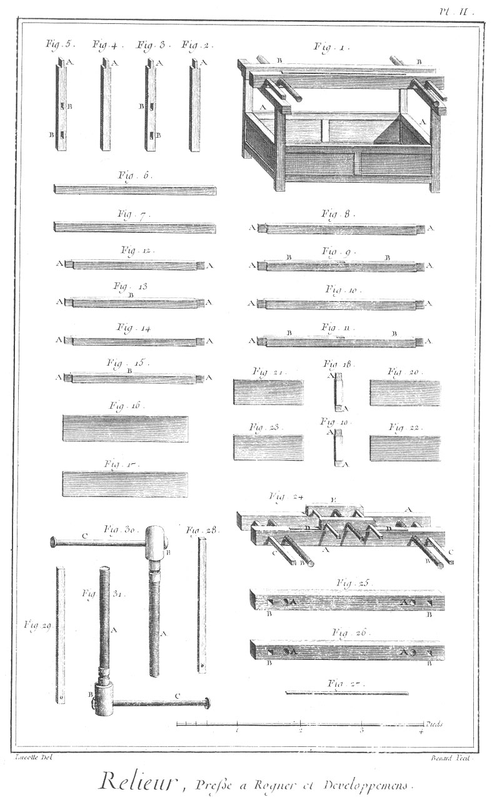
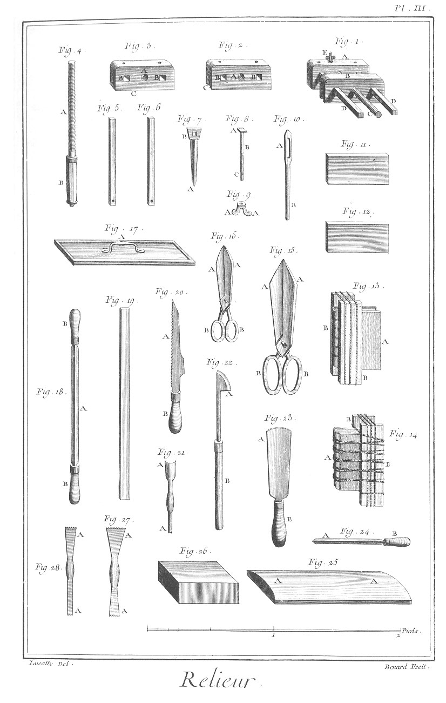
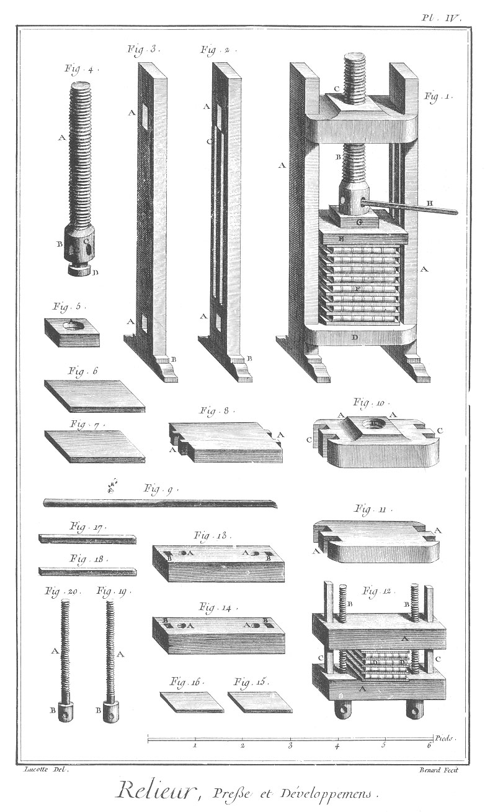
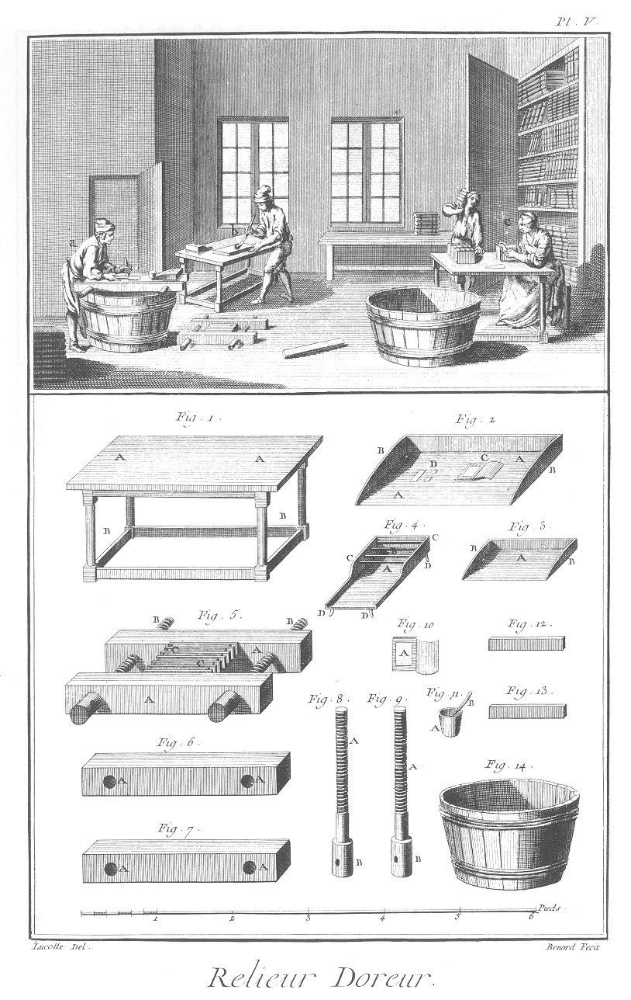

RELIEUR
=======

Contenant six Planches.

PLANCHE Iere.
-------------

Le haut de cette Planche représente un attelier de reliure, où plusieurs ouvriers sont occupés, l'un en

- a, à battre les reliures ; une ouvriere en
- b, appellée couseuse ou brocheuse, à coudre ou brocher un livre ; un autre ouvrier en
- c, à couper la tranche sur la presse, un autre en
- d, à serrer la grande presse :

le reste de l'attelier est employé à divers ouvrages de reliure.

Fig.
1. Marbre à battre.
	- A, le marbre.
	- B, le billot.

2. Billot du marbre à battre.
	- A A, l'entaille.

3. Marteau à battre.
	- A, la tête acérée.
	- B, le manche.

4. Table à brocher.
	- A A, le dessus de la table.
	- B B, la mortoise.
	- C C, les piés.
	- D D, les vis du cousoir.
	- E, la barre.
	- F F, les fils.

5. &
6. Pelottes de fil à coudre les livres.

7. La barre du cousoir.
	- A, la partie arrondie.
	- B B, les écroux.

8. &
9. Figure du cousoir.
	- A A, les vis.
	- B B, les pivots.

10. &
11. Les viroles des vis du cousoir.

12. Temploie.
	- A A, les échancrures.

13. &
14. Grand & petit plioir.

PLANCHE II.
-----------

Fig.
1. Presse à rogner.
	- A A, le banc de la presse.
	- B B, la presse.

2. &
3. &
4. &
5. Montant du banc de la presse.
	- A A, &c. les tenons.
	- B B, &c. les mortoises.

6. &
7. Traverse du haut du banc de la presse.

8. &
9. &
10. &
11. Pieces de long du banc de la presse.
	- A A, &c. les tenons.
	- B B, &c. les rainures.
	- C C, les mortoises.

12. &
13. &
14. &
15. Traverse du banc de la presse.
	- A A, &c. Les tenons.
	- B B, &c. les rainures.

16. &
17. Panneau de côté du banc de la presse.

18. &
19. Entre-toises des pieces de long.
	- A A, &c. les tenons.

20. &
21. &
22. &
23. Petits panneaux de long du banc de la presse.

24. Presse à rogner.
	- A A, &c. les jumelles.
	- B B, les vis.
	- C C, les tringles de conduite.
	- D D, la tringle à traîner.
	- E, le fût.

25. Jumelle de devant.
	- A A, les trous des vis.
	- B B, les trous des conduits.

26. Jumelle de derriere.
	- A A, les écrous des vis.
	- B B, les trous de conduite.

27. Tringle à traîner.

28. &
29. Conduits de la presse.

30. &
31. Vis de la presse.
	- A A, les vis.
	- B B, les têtes.
	- C C, les manivelles.

PLANCHE III.
------------

Fig.
1. Fût de la presse.
	- A, le sabot de devant.
	- B, le sabot de derriere.
	- C, la vis.
	- D D, les conduits.
	- E, le boulon du couteau.

2. Sabot de derriere.
	- A, le trou de l'écrou.
	- B B, les trous de conduite.
	- C, l'échancrure à traîner.

3. Sabot de devant.
	- A, le trou de la vis.
	- B B, les trous des conduits.
	- C, l'entaille du couteau.

4. Vis.
	- A, la vis.
	- B, le manche.

5. &
6. Conduits.

7. Couteau à rogner.
	- A, la pointe tranchante.
	- B, l'oeil.

8. Boulon du couteau à rogner.
	- A, la tête.
	- B, la tige.
	- C, la vis.

9. Ecrou du boulon.
	- A A, les oreilles.

10. Clé de l'écrou du boulon.
	- A, l'oeil.
	- B, le manche.

11. &
12. Ais à endosser ou à fouetter.

13. Livre endossé.
	- A, le livre.
	- B B, les ais.

14. Livre fouetté.
	- A, le livre.
	- B B, les ais.

15. Forces.
	- A A, les taillans.
	- B B, les anneaux.

16. Ciseaux.
	- A A, les taillans.
	- B B, les anneaux.

17. Regle à couper le carton entier.
	- A, la main.

18. Couteau à parer les peaux.
	- A, le couteau.
	- B B, les manches.

19. Regle ou tringle à rabaisser.

20. Scie appellée grecque.
	- A, la scie.
	- B, le manche.

21. Grattoir.
	- A A, les taillans.

22. Fer à polir.
	- A, le fer.
	- B, le manche.

23. Couteau à parer.
	- A, le taillant.
	- B, le manche.

24. Pointe.
	- A, la pointe.
	- B, le manche.

25. Douve ou planche à ratisser les peaux.
	- A A, la partie convexe.

26. Pierre à parer.

27. &
28. Frottoirs.
	- A A, &c. les dents.

PLANCHE IV.
-----------

Fig.
1. Grande presse.
	- A A, les jumelles.
	- B, la vis.
	- C, le plateau servant d'écrou.
	- D, le plateau immobile servant d'appui.
	- E, le plateau mobile.
	- F, les livres en presse entre ais.
	- G, le petit plateau.
	- H, le levier.

2. &
3. Jumelles.
	- A A, &c. les mortoises.
	- B B, les piés.
	- C C, les rainures.

4. Vis.
	- A, la vis.
	- B, la tête.
	- C C, les trous.
	- D, le touret.

5. Petit plateau.
	- A, le trou du touret de la vis.

6. &
7. Ais à presser.

8. Plateau mobile.
	- A A, les tenons de conduite.

9. Levier de la presse.

10. Plateau servant d'écrou.
	- A A, la hausse.
	- B, le trou de l'écrou.
	- C C, les tenons.

11. Plateau servant d'appui.
	- A A, les tenons.

12. Presse à main.
	- A A, les jumelles.
	- B B, les vis.
	- C C, les conduits.
	- D D, les livres en presse entre ais.

13. Jumelle de derriere.
	- A A, les écrous.
	- B B, les trous de conduite.

14. Jumelle de devant.
	- A A, les trous des vis.
	- B B, les trous des conduits.

15. &
16. Petit ais à presser.

17. &
18. Tringle de conduite de la presse à main.

19. &
20. Vis.
	- A A, les vis.
	- B B, les têtes.

PLANCHE V.
----------

Le haut de cette Planche représente un attelier de relieur-doreur, où plusieurs ouvriers sont occupés ; l'un en

- a, à dorer sur tranche ; un autre en
- b, à pousser la roulette sur le plat d'un volume ; près de lui est le fourneau à faire chauffer les fers : une ouvriere en
- c, à coucher l'or sur le dos des volumes.

Fig.
1. Table à dorer sur les livres.
	- A A, le dessus.
	- B B, les piés.

2. Coussin à dorer.
	- A A, les dessus.
	- B B, les bords.
	- C, petit livret rempli de feuilles d'or.
	- D, feuille d'or coupée.

3. Petit coussin à dorer sur tranche.
	- A, le dessus.
	- B B, les bords.

4. Fourneau servant à chauffer les fers à dorer.
	- A, le cendrier.
	- B, la grille.
	- C C, les bords.
	- D D, les piés.

5. Presse à dorer sur tranche.
	- A A, les jumelles.
	- B B, les vis.
	- C C, les livres pressés entre ais.

6. Jumelle de derriere.
	- A A, le trou des écrous.

7. Jumelle de devant.
	- A A, les trous des vis.

8. &
9. Vis de la presse à dorer.
	- A A, les vis.
	- B B, les têtes.

10. Petit livret rempli de feuilles d'or.
	- A, la feuille d'or.

11. Petit pot au blanc d'oeuf.
	- A, le pot.
	- B, le pinceau.

12. &
13. Ais à dorer.

14. Baquet à mettre sous la presse à dorer, pour recevoir l'eau qui en tombe.

PLANCHE VI.
-----------

Fig.
1. Presse à appliquer les armes.
	- A A, les jumelles.
	- B, la vis.
	- C, le plateau servant d'écrou.
	- D, le plateau mobile.
	- E, le plateau à queue servant d'appui.
	- F, le petit plateau.
	- G, le levier.
	- H, le livre, dont un des côtés en presse.
	- I, le couchoir.
	- K, l'armoire remplie de couchoirs, roulettes, fers, & autres instrumens à dorer.

2. &
3. Jumelles de la presse.
	- A A, &c. les mortoises.
	- B B, les piés.
	- C C, les entailles à queues.
	- D D, les rainures.

4. Plateau servant d'écrou.
	- A A, la hausse.
	- B, le trou de l'écrou.
	- C C, les tenons.

5. Plateau mobile.
	- A A, les tenons.

6. Vis de la presse.
	- A, la vis.
	- B, la tête.
	- C C, les trous.
	- D, le touret.

7. Petit plateau.
	- A, le trou du touret de la vis.

8. Levier de la presse.

9. Plateau à queues.
	- A A, les tenons.
	- B B, les queues.

10. &
11. Plateaux de dessus & du dessous de l'armoire.
	- A A, &c. les tenons.

12. Regle à couteau pour couper l'or.

13. Regle simple.

14. Couteau à couper l'or.
	- A, le fer.
	- B, le manche.

15. Pinces à lever & transporter l'or.
	- A, la tête.
	- B, les branches.

16. Dent de loup à brunir.
	- A la dent.
	- B, le manche.

17. Autre dent d'acier poli.
	- A, la dent.
	- B, le manche.

18. Roulette à dorer.
	- A, la roulette.
	- B, la moufle.
	- C, la tige.
	- D, le manche.

19. &
20. &
21. Fleurons & coins à dorer.
	- A A, &c. les fers.
	- B B, &c. les tiges.
	- D D, &c. les manches.

22. &
23. Lettres d'alphabet à dorer.
	- A A, les fers.
	- B B, les tiges.
	- C C, les manches.

24. Palette à queue.
	- A, la palette.
	- B, la tige.
	- C, le manche.

25. Palette simple.
	- A, la palette.
	- B, la tige.
	- C, le manche.

26. Racloir à deux têtes.
	- A, le racloir.
	- B, la tige.
	- C, le manche.

27. Couchoir pour les armes.
	- A, le couchoir.
	- B, le tenon.

28. Dessein d'armes semblables à celles que l'on applique sur le dos des livres.

[->](../25-Sculpture_en_Tous_Genres/1-Sculpture_en_Tous_Genres/Légende.md)
