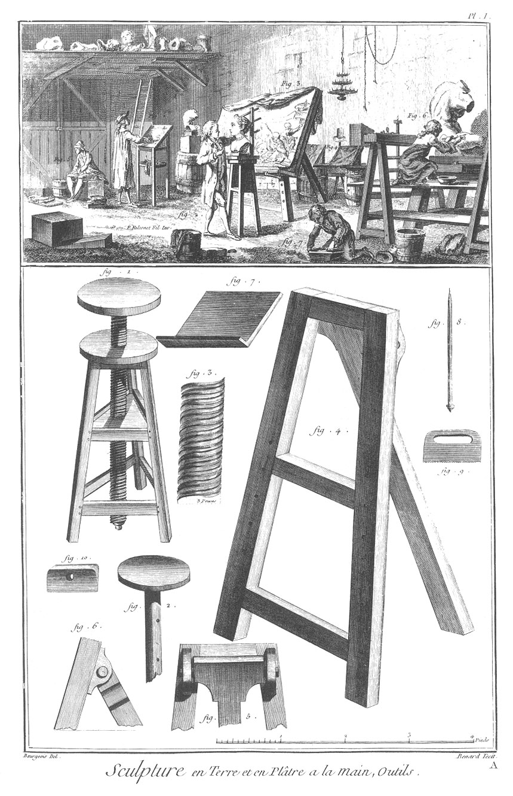
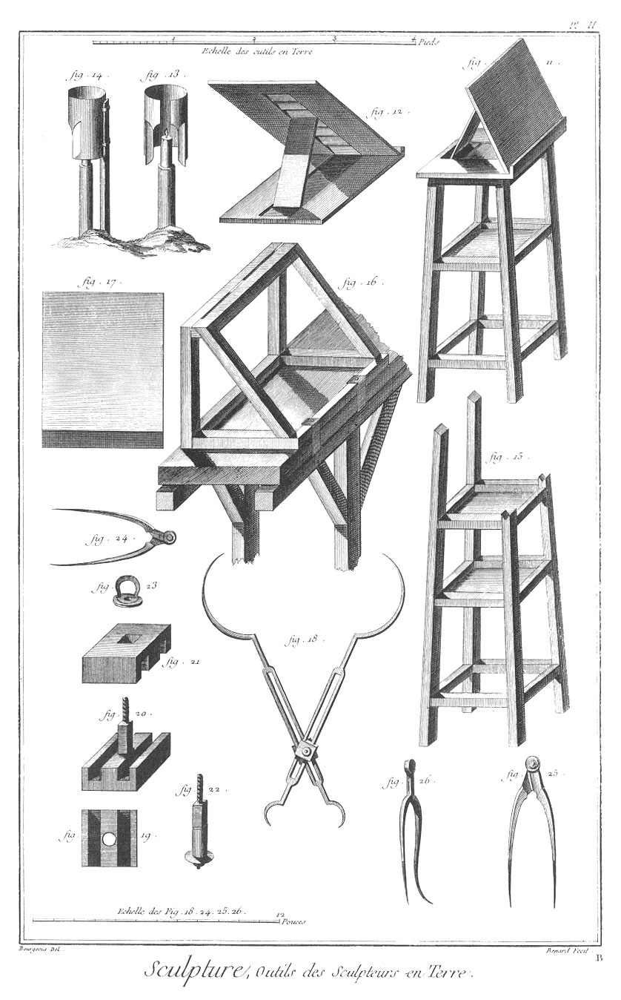
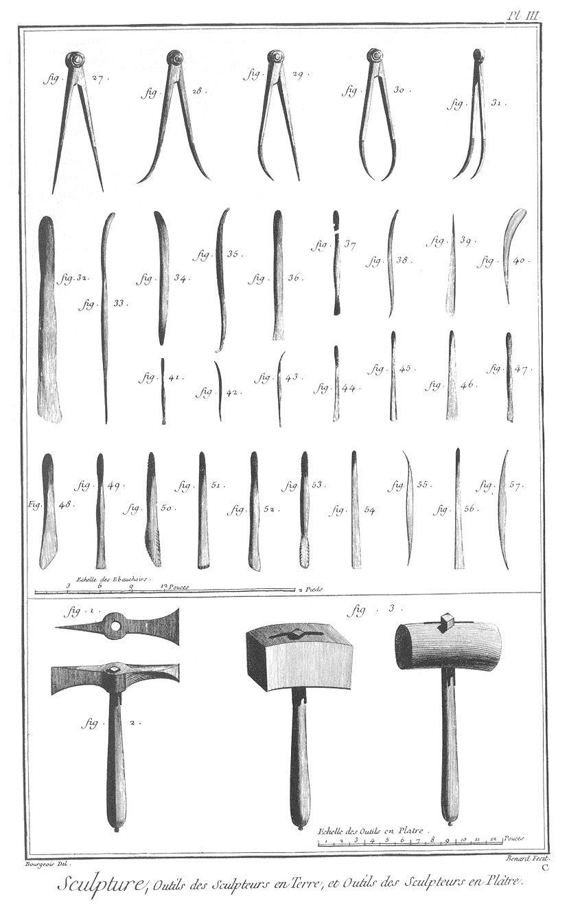
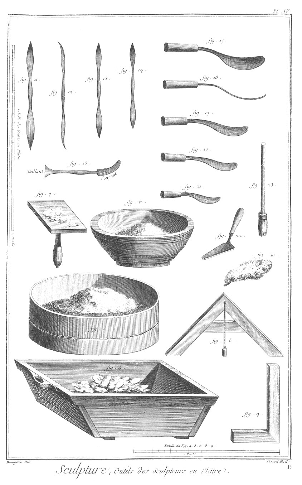
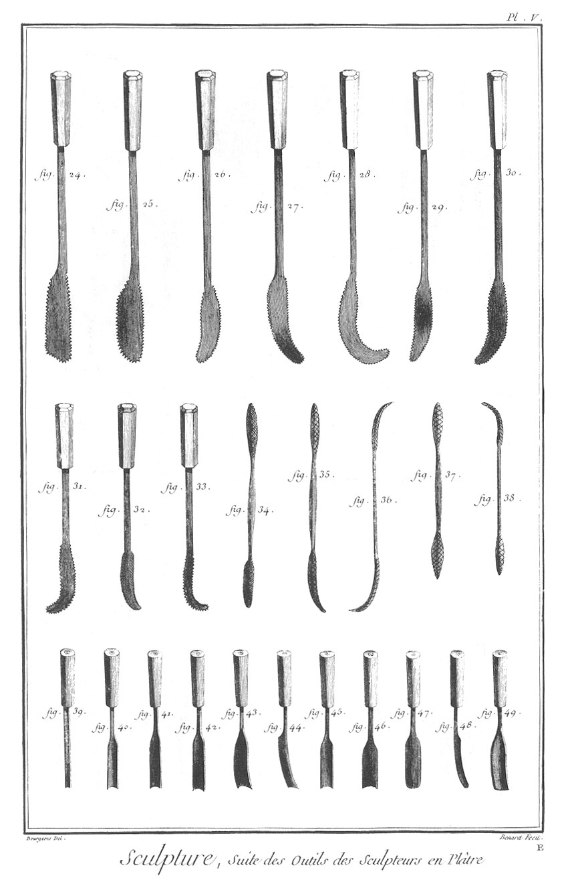

SCULPTURE EN TOUS GENRES
========================

Contenant vingt-quatre Planches.

PLANCHE Iere. Sculpture en terre & en plâtre à la main.
-------------------------------------------------------

Vignette.

Fig.
1. Sculpteur qui modele en bas relief d'après la bosse.

2. Sculpteur qui modele une tête ronde bosse.

3. Bas relief.

4. Petits chevalets à modeler qui s'accrochent sur une table ou sur un banc.

5. Garçon d'attelier qui prépare de la terre.

6. Sculpteur qui modele en plâtre à la main.

7. Ouvrier qui gâche du plâtre.

Bas de la Planche.

Fig.
1. Selle à modeler, qui peut s'élever ou baisser moyennant une vis au milieu.

2. Autre plateau & son montant que l'on éleve avec cheville que l'on a pour cet effet.

3. La maniere dont on doit faire la vis du plateau de la figure premiere.

4. Grand chevalet qui sert à modeler les grands bas reliefs.

5. Partie d'un autre chevalet vu par derriere.

6. Le même chevalet vu de profil.

7. Planche à modeler les grands bas reliefs. Cette planche doit avoir au-moins quatre à six pouces de long sur trois piés de haut ; on la peut faire plus grande, mais pas plus petite pour la grandeur du chevalet.

8. Cheville de fer qui sert à porter la planche à modeler lorsqu'elle est posée sur le chevalet.

9. Grattoir de fer ; il sert à gratter les fonds.

10. Autre grattoir de buis pour le même usage.

PLANCHE II. Outils des sculpteurs en terre.
-------------------------------------------

Fig.
11. Selle à modeler à vis, sa planche prête à recevoir le fond.

12. Planche de la fig. 11. vue par derriere, & la maniere dont elle doit être faite pour qu'elle puisse s'élever ou se baisser quand on veut.

13. Lanterne vue de face ; elle sert à mettre la chandelle pour modeler le soir.

14. Même lanterne vue de profil & la façon de la faire. Cette lanterne est portée par un morceau de bois que l'on pique dans la terre sur laquelle on modele.

15. Autre selle plus simple, qui sert aussi à modeler.

16. Chevalet à modeler qui peut s'accrocher, comme on le voit par le dessein, à une table ou à un banc.

17. Planche qui sert à poser le fond en terre pour modeler.

18. Grand compas à pointes courbes avec coulisses ; il sert à mesurer les épaisseurs, & réduire à la moitié, deux tiers, trois quarts, un quart, un tiers du grand au petit & du petit au grand.

19. Plan des coulisses.

20. Coupe de la coulisse de dessous.

21. Coupe de la coulisse de dessus.

22. Vis qui sert à tourner les coulisses du côté que l'on veut.

23. Virole qui sert à fermer le compas de réduction.

24. Compas ordinaire.

25. Compas avec une pointe courbe vu de face.

26. Le même compas vu de profil.

PLANCHE III. Outils de sculpteurs en terre & outils de sculpteurs en plâtre.
----------------------------------------------------------------------------

Fig.
27. Autre compas droit.

28. Compas dont les deux pointes sont courbées en-dehors.

29. Autre compas dont une des pointes est courbée en-dedans.

30. Compas dont les deux pointes sont courbées en-dedans.

31. Autre compas vu de profil, dont les deux pointes sont courbées dessus le côté.

Les compas ci-dessus & ceux de la Planche II. servent à prendre les mesures des épaisseurs, hauteurs, profondeurs, largeurs, &c. &c. &c.

32. &
33. &
34. &
35. &
36. &
37. &
38. &
39. &
40. &
41. &
42. &
43. &
44. &
45. &
46. &
47. &
48. &
49. &
50. &
51. &
52. &
53. &
54. &
55. &
56. &
57. Différens ébauchoirs de buis ou d'ivoire.

Bas de la Planche.

Fig.
1. &
2. Plan & élévation de l'herminette ; elle sert à travailler le plâtre.

3. Deux différens maillets.

PLANCHE IV. Outils des sculpteurs en plâtre.
--------------------------------------------

Fig.
4. Auge ; elle sert à gâcher le plâtre pour les sculpteurs.

5. Tamis de soie qui sert à passer le plâtre & le rendre plus fin.

6. Sebille qui sert à gâcher le plâtre fin.

7. Palette à stuc.

8. Niveau avec son plomb.

9. Equerre.

10. Peau de chien qui sert à unir le plâtre employé.

11. Spatule de fer vue de face.

12. Spatule vue de côté.

13. &
14. Deux autres spatules plus petites, il y en a d'autres encore que l'on n'a point dessinées, parce qu'elles sont seulement plus grandes sans avoir aucune autre forme.

15. Spatule taillante & coupante.

16. Truelle de stucateur.

17. La même truelle vue de profil.

18. &
19. &
20. Autres truelles de différentes grandeurs.

21. Truelle de mâçon pour gâcher le gros plâtre.

22. Grosse brosse qui sert à nettoyer l'ouvrage lorsque l'on travaille.

PLANCHE V. Suite des outils des sculpteurs en plâtre.
-----------------------------------------------------

Depuis la fig. 24. jusqu'à la fig. 33. cette sorte d'outils se nomment rippes à travailler le plâtre à la main.

Depuis la fig. 34. jusqu'à 38. différentes sortes de rapes ; elles servent à raper le plâtre.

39. &
41. &
42. &
43. &
44. &
45. &
47. Différentes goujes pour travailler le plâtre.

48. Autres gouges vues de côté.

49. Mêmes gouges vues de face.

40. &
46. Fermoirs servans aussi à travailler le plâtre.

[->](../2-Mouleur_en_Platre/Légende.md)
