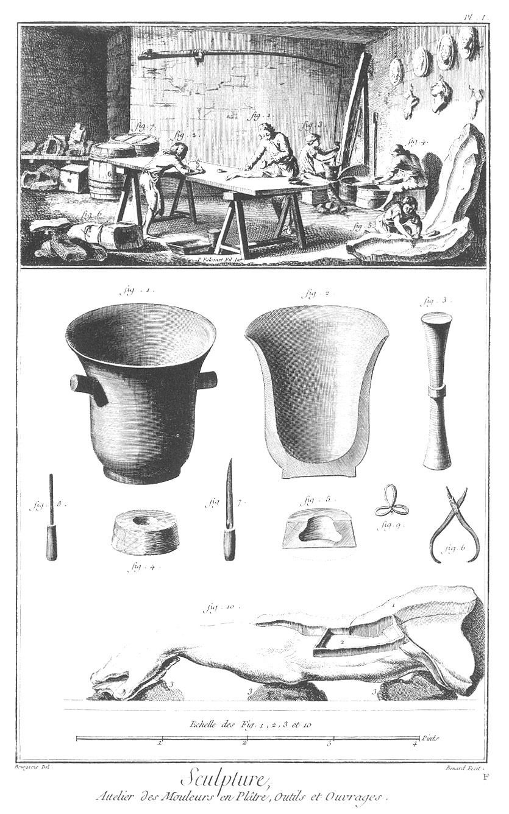
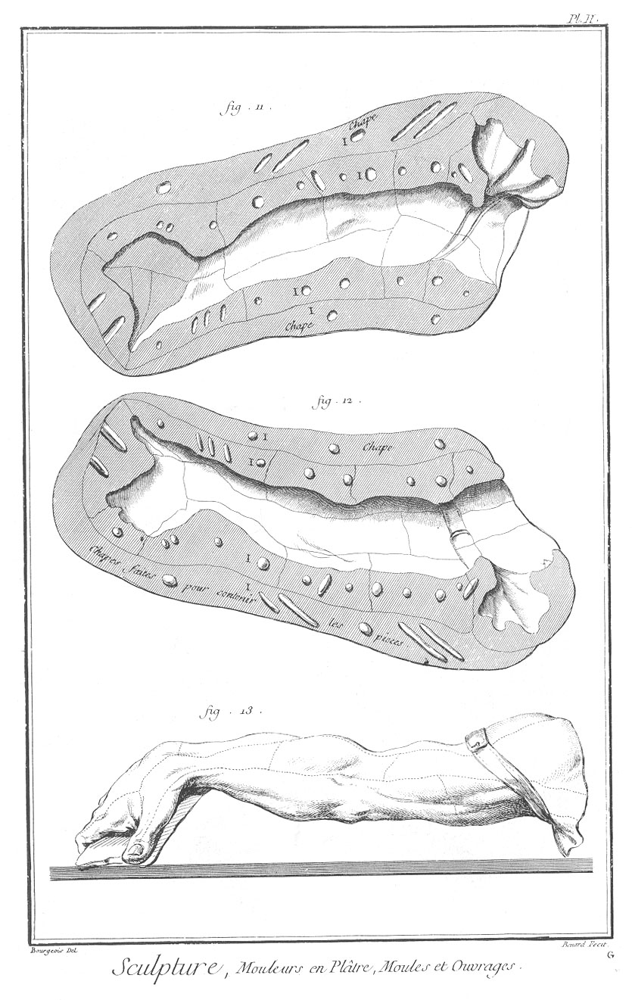

SCULPTURE EN TOUS GENRES: MOULEUR EN PLATRE.
============================================

PLANCHE Iere. Attelier des mouleurs, outils & ouvrages.
-------------------------------------------------------

Vignette.

Fig.
1. Mouleur qui fait un creux.

2. Mouleur qui serre un creux.

3. Ouvrier qui pile du plâtre.

4. Manoeuvre qui fasse du plâtre.

5. Mouleur qui vernit un creux avec de l'huile chaude qui doit être apprêtée avec de la litharge.

6. Creux garotté prêt à couler.

7. Tonneaux qui servent à mettre le plâtre.

Bas de la Planche.

Fig.
1. Mortier de fonte qui sert à piler le plâtre.

2. Coupe du mortier.

3. Pilon.

4. Godet de plâtre qui sert à mettre l'huile pour faire les creux.

5. Coupe du godet qui sert à mettre l'huile.

6. Pinces qui servent à former les annelets.

7. Couteau qui sert à couper les pieces.

8. Fermoir qui sert à dépouiller les pieces.

9. Annelets qui se mettent dans les petites pieces, & dans lesquelles l'on passe des ficelles qui sortent à-travers la chape, retiennent les pieces.

10. Bras de terre que l'on moule.
	- 1. Piece déjà faite, coupée, de dépouille pour recevoir les autres pieces & huilée sur les coupes.
	- 2. Bassin de terre huilé au-dedans pour recevoir le plâtre que l'on met d'abord avec une brosse, & que l'on remplit ensuite en le versant lorsque la premiere couche commence à prendre.
	- 3 3. Morceaux de terre, mottes sur lesquelles on pose les modeles que l'on moule.

PLANCHE II. Ouvrages.
---------------------

Fig.
11. Creux formé de toutes ces pieces assemblées & de sa chape.

12. Dessus du même creux.
	- III, différentes marques qui sont creusées sur la coquille inférieure du creux, & qui sont saillantes dans la coquille supérieure du même creux.

13. Bras sorti de son creux avec les coutures. L'on se sert aussi de sebilles, d'auges & de tamis, truelles & spatules semblables à celles des fig. 6. 5. 22. 17. & 4. Pl. IV. des sculpteurs en plâtre.

[->](../3-Elevation_du_Marbre/Légende.md)
