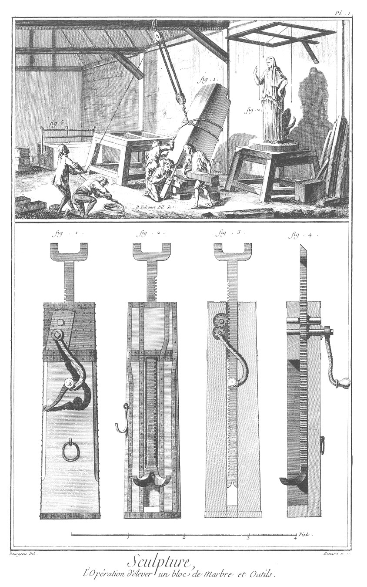
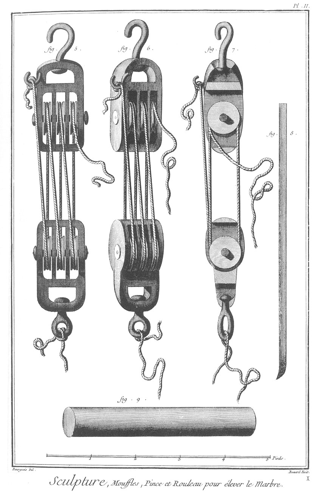
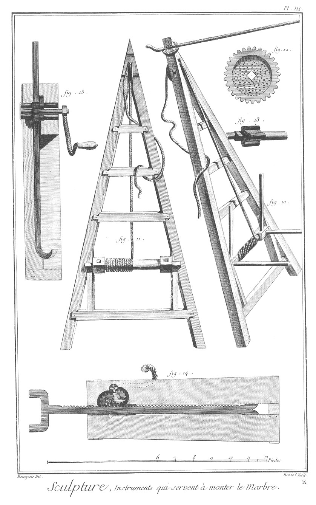

SCULPTURE EN TOUS GENRES: ELEVATION DU MARBRE.
==============================================

PLANCHE Iere. L'opération d'élever un bloc de marbre, & outils.
---------------------------------------------------------------

Vignette.

Fig.
1. Blocs de marbre que l'on éleve avec le billotage & les moufles.

2. Figure ou modele pour exécuter le marbre.

3. Deux hommes qui font aller un cric chacun pour aider à élever ce marbre.

4. Un homme qui place le billotage.

5. Bloc de marbre commencé à scier.

Bas de la Planche.

Fig.
1. Cric à la françoise vu de face ; il sert à aider à élever les blocs de marbre.

2. Le même cric vu par derriere.

3. Coupe du même cric sur sa largeur.

4. Autre coupe du cric sur l'épaisseur.

PLANCHE II. Moufles, pince & rouleau pour élever le marbre.
-----------------------------------------------------------

5. Moufles vues de face, & maniere d'arranger les cordes.

6. Moufles vues de face & de côté; ces sortes de poulies servent à monter des blocs de marbre.

7. Coupe des moufles.

8. Pince de fer ; elle sert aux ouvriers pour lever le marbre.

9. Rouleau de bois pour caler le dessous d'un bloc de marbre.

PLANCHE III. Instrumens qui servent à monter le marbre.
-------------------------------------------------------

10. Chevre ; elle sert à lever les marbres.

11. Coupe de la chevre.

12. Maniere dont doit être construite la poulie qui sert au cric à l'allemande.

13. Pivot à quatre dents qui sert au même cric.

14. Coupe du cric à l'allemande sur sa largeur.

15. Coupe du même cric. Ce cric est beaucoup plus doux à élever, une seule personne peut s'en servir ; c'est pourquoi l'on a jugé à propos de le joindre à cette partie.

[->](../4-Travail_du_Marbre/Légende.md)
