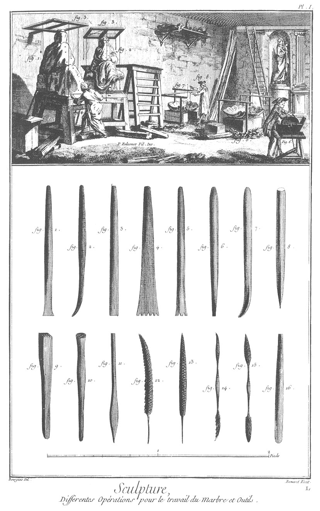
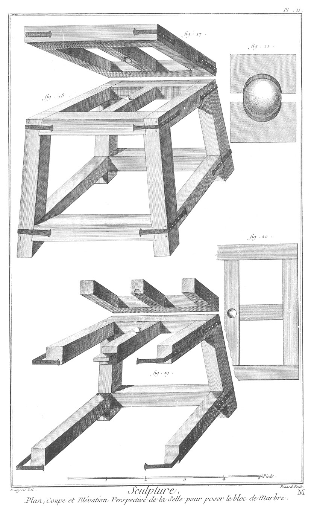
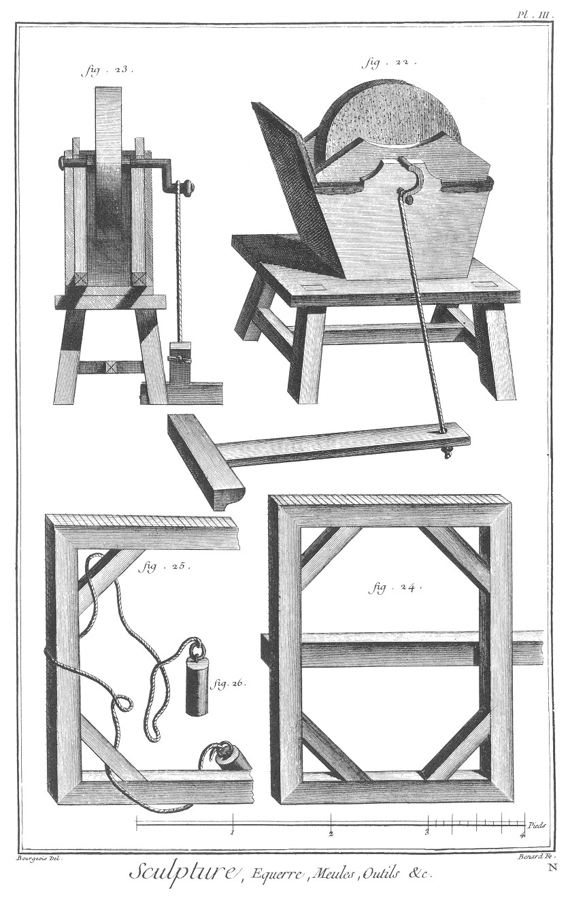
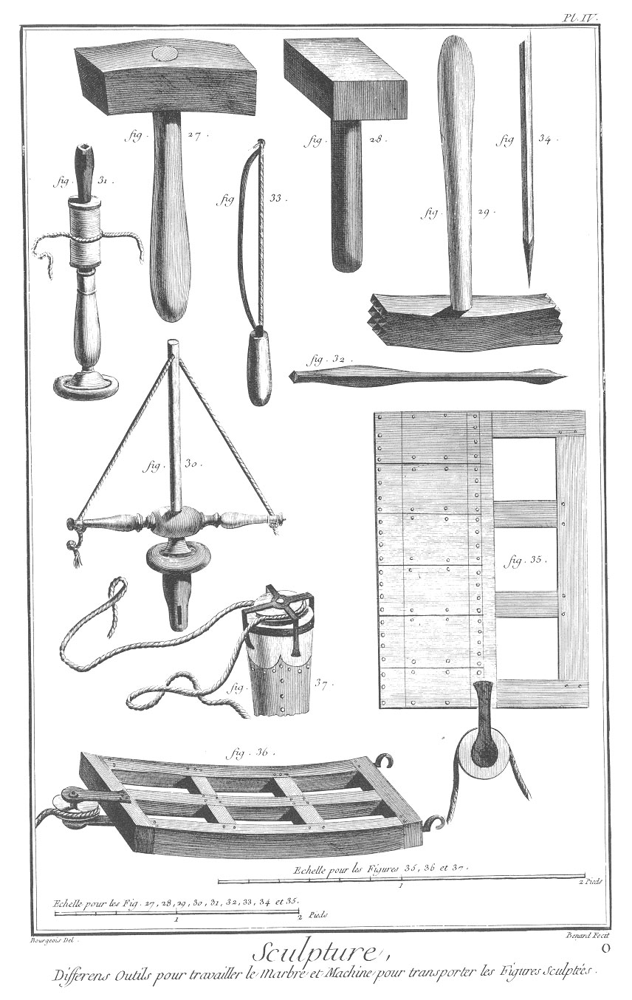
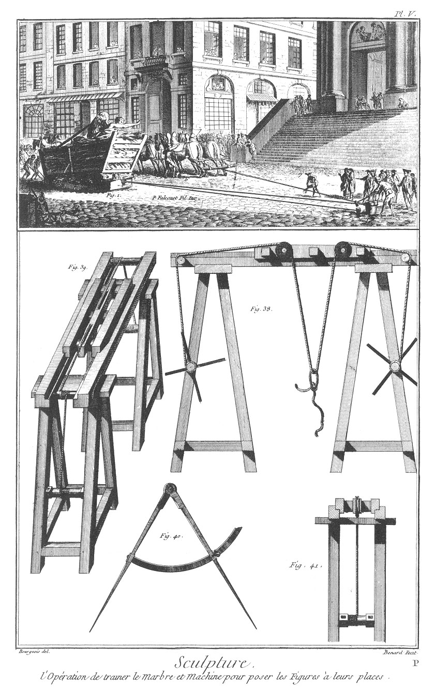

SCULPTURE EN TOUS GENRES: TRAVAIL DU MARBRE.
============================================

PLANCHE Iere.
-------------

Vignette.

Fig.
1. Bloc de marbre commencé à épanneler.

2. Modele sous les équerres.

3. Equerres avec leurs divisions.

4. Sculpteur qui prend une mesure de profondeur.

5. Modeles & marbre que l'on travaille par terre.

6. Ouvrier qui aiguise un ciseau.

7. Equerres avec leurs divisions posées en terre.

8. Sculpteur qui prend une mesure.

Bas de la Planche.

Fig.
1. Pointe de fer qui sert à dégrossir.

2. Ciseau coudé vu de côté, dont on se sert après s'être servi des gradines.

3. Ciseau coudé vu par derriere.

4. Gradines à trois dents, dont on se sert après s'être servi des pointes.

5. Autre gradine à six dents, servant à la même opération.

6. Autre ciseau droit, servant après les gradines.

7. Ciseau coudé & plat du bout, vu de côté, servant après les gradines.

8. Ciseau coudé vu de face, servant après les gradines.

9. Rondelle.

10. Rape de fer vue de face.

11. Rape de fer vue de côté.

12. Rape d'Allemagne.

13. Autre rape d'Allemagne.

14. Hognette.

15. Boucharde ronde des deux bouts en taille de diamans.

16. Boucharde arrondie de la tête & quarrée de l'autre bout aussi en taille de diamans.

PLANCHE II.
-----------

Plan, coupes & élévation perspective de la selle pour poser les blocs de marbre.

Fig.
17. Plateau vu par-dessous, & la façon dont il doit être fait.

18. Selle qui sert à poser les blocs de marbre pour les travailler.

19. Coupe de la selle avec ses emmanchemens.

20. Plan du haut de la selle avec le trou où doit être la boucle qui sert à tourner le plateau du côté que l'on veut.

21. Coupe de la piece où se trouve la boucle qui sert à tourner le plateau ; il faut absolument que cette boucle soit de buis.

PLANCHE III. Equerre, meule, outils, &c.
----------------------------------------

Fig.
22. Meule qui sert à aiguiser les outils.

23. Coupe de la même meule.

24. Equerre avec toutes les marques nécessaires pour poser les plombs. Cette équerre peut être scellée dans le mur par le moyen d'une barre que l'on met pour cet effet au milieu ; elle sert à poser les points sur les figures ou modele de ronde basse pour ensuite faire la même opération sur les blocs que l'on veut employer.

25. Autre équerre qui se peut sceller dans le mur des deux côtés ; elle sert pour les bas reliefs.

26. Plombs & ficelles.

PLANCHE IV.
-----------

Différens outils pour travailler le marbre, & machines pour transporter les figures sculptées.

Fig.
27. Masse de fer avec son manche.

28. Autre masse tout en fer.

29. Marteline en taille de diamant.

30. Drille ; elle sert à percer moyennant un trépan que l'on met au bout.

31. Autre drille qui tourne moyennant un arrêt.

32. Trépan d'acier trempé.

33. Archet qui sert à faire tourner la drille à main.

34. Mesure de bois avec une pointe de fer à l'un des bouts. Cette mesure sert à poser les points sur ce que l'on veut faire.

35. Plan du traîneau au bout duquel il y a une poulie par où l'on passe la corde.

36. Traîneau sur lequel on pose la figure pour la transporter de l'attelier où elle a été faite, à la place où elle doit être posée.

37. Morceau de bois au bout duquel l'on met une pointe de fer pour piquer on terre, sur lequel est une poulie pour y passer la corde pour que les chevaux puissent tirer plus facilement.

PLANCHE V.
----------

L'opération de traîner le marbre, & machine pour poser les figures.

Vignette.

Fig.
1. Traîneau avec une poulie, sur lequel est la figure de marbre.

2. Lit de fagots pour empêcher les secousses.

3. Bâti de charpente dans lequel est la figure.

4. Poulie de renvoi.

5. Pieu où s'attache la corde.

6. Chevaux attelés deux à deux pour tirer le traîneau.

7. Ouvrier qui jette de l'eau par terre à cause des frottemens de la corde.

8. Ouvriers qui facilitent le traîneau avec des pieces.

Bas de la Planche.

Fig.
38. Machine avec laquelle on monte la figure à sa place.

39. Même machine vue de côté.

40. Compas partagé d'un demi-cercle.

41. Coupe de la machine prise sur sa largeur.

[->](../5-Sculpture_en_Or_et_en_Argent/Légende.md)
