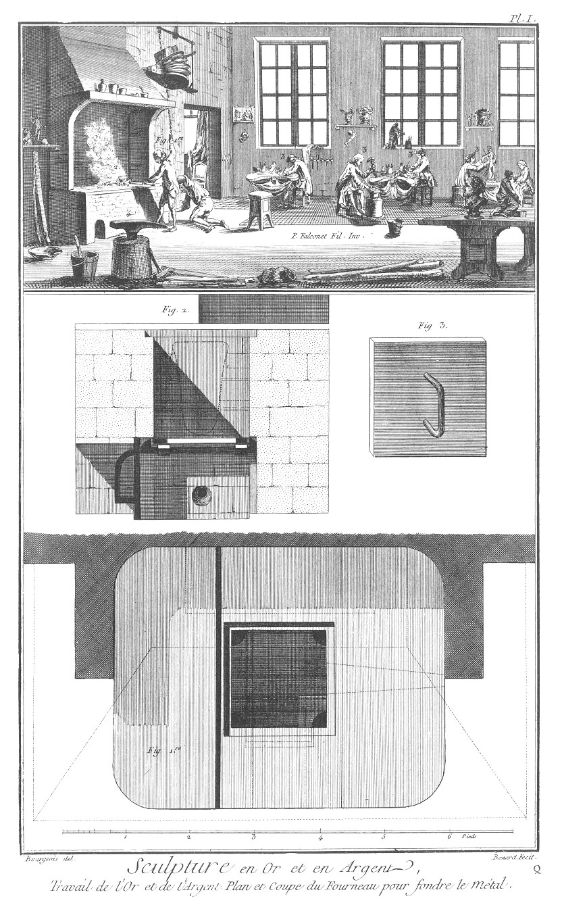
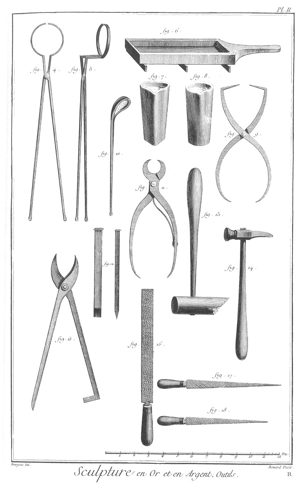
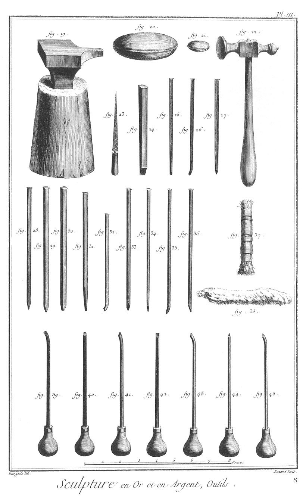
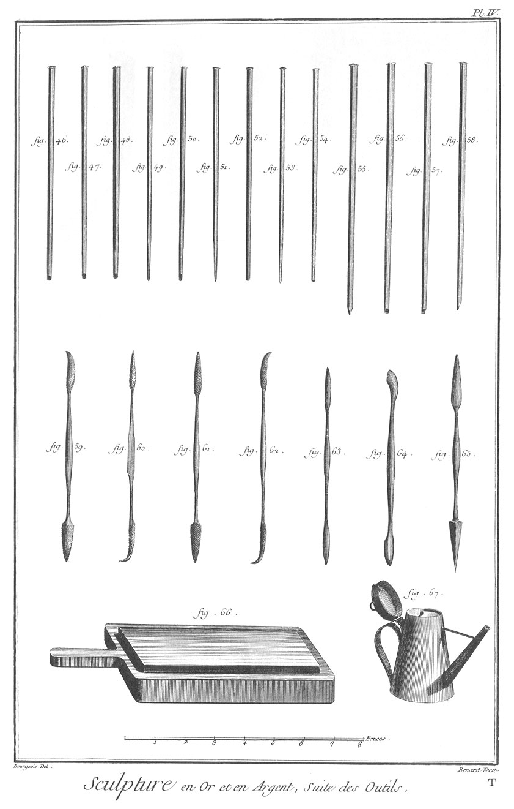

SCULPTURE EN TOUS GENRES: SCULPTURE EN OR ET EN ARGENT.
=======================================================

PLANCHE Iere.
-------------

Travail de l'or & de l'argent. Plan & coupe du fourneau pour fondre le métal.

Vignette.

Fig.
1. Homme qui fond de l'argent.

2. Creuset pour fondre l'argent.

3. & 3. Sculpteurs qui travaillent l'or & l'argent.

4. Enclume.

5. Différens morceaux de sculpture terminés.

Bas de la Planche.

Fig.
1. Plan du fourneau pour fondre l'argent.

2. Coupe du fourneau & la maniere dont il doit être construit.

3. Couvercle de fer qui sert à couvrir le fourneau lorsque l'on fond la matiere.

PLANCHE II. Outils.
-------------------

Fig.
4. Happe ; cet outil sert à retirer le creuset du fourneau.

5. Happe vue de profil.

6. Lingottiere.

7. Creuset à trois cornes.

8. Creuset rond.

9. Compas d'épaisseur.

10. Ecumoire, servant à ôter ou nettoyer la matiere.

11. Coupe-rivure.

12. Ciseaux de face & de côté.

13. Maillet de buis.

14. Marteau.

15. Cisaille pour couper les jets.

16. &
17. &
18. Différentes sortes & façons de limes.

PLANCHE III. Outils.
--------------------

Fig.
19. Enclume.

20. Grand coussin de cuir rempli de sable ; on pose l'ouvrage dessus pour qu'il ne se gâte point.

21. Petit coussin pour le même ouvrage.

22. Marteau à finir.

23. Lime demi-ronde bâtarde douce ; elle sert à finir.

24. Ciseau ou gouge plate.

25. Ciselet mat pointillé.

26. Gouge ronde étroite.

27. & 32. Burins vus de face & de côté.

28. Ciseau.

29. Autre maniere de ciseau.

30. Gouge demi-ronde.

31. Ciselet rond.

33. &
34. &
35. &
36. Différentes sortes de burins.

37. Gratte-bosse.

38. Patte-de-lievre.

39. Méplatte.

40. Echoppe ronde.

41. Echoppe ronde étroite.

42. Echoppe quarrée.

43. Ouglitte.

44. Burin droit.

45. Autre burin.

PLANCHE IV. Outils.
-------------------

Fig.
46. Ciselet mal pointillé.

47. Autre ciselet mat au marteau.

48. Ciselet clair.

49. Ciselet rond.

50. Ciselet mat au grès.

51. Traçoir demi-rond.

52. Boutrolle.

53. Traçoir droit.

54. Boutrolle plus en pointe.

55. Réveilloir.

56. Ciselet clair ou bouge.

57. Plamoir.

58. Traçoir biais.

59. &
60. &
61. &
62. Différentes sortes de riflard.

63. Brunissoir.

64. Grattoir.

65. Grattoir & brunissoir.

66. Pierre à aiguiser les outils.

67. Burette à l'huile.

[->](../6-Sculpture_en_Bois/Légende.md)
