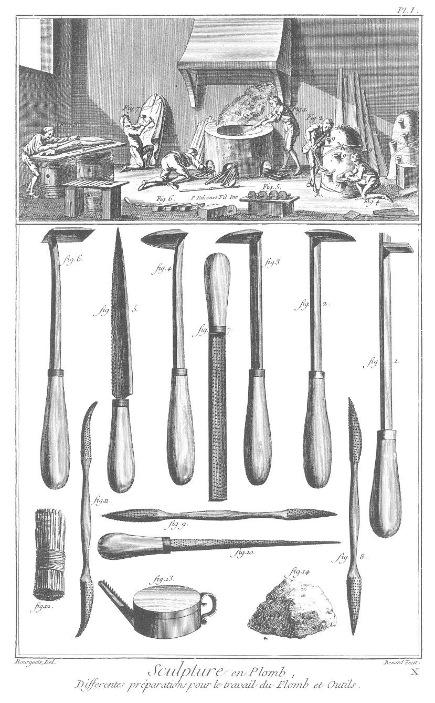
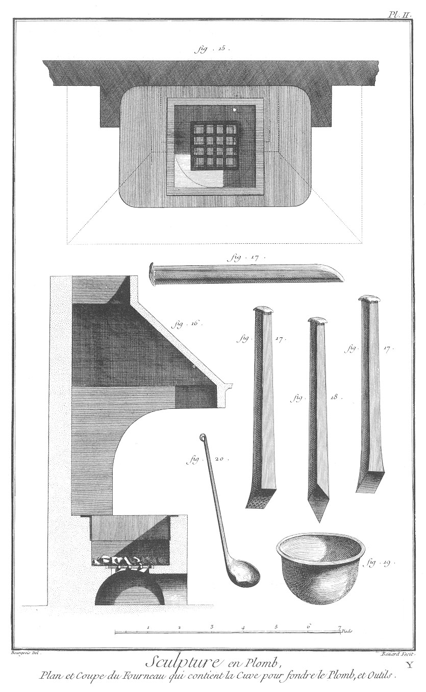
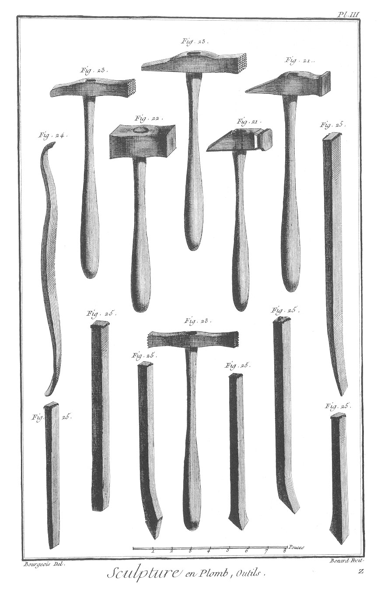
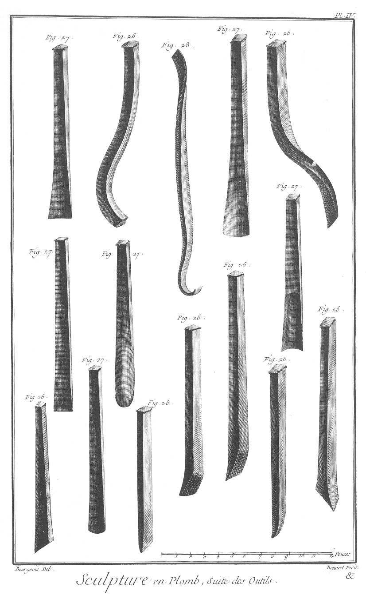

SCULPTURE EN TOUS GENRES: SCULPTURE EN PLOMB.
=============================================

PLANCHE Iere.
-------------

Différentes préparations pour le travail du plomb & outils.

Vignette.

Fig.
1. Cuve où se fond le plomb.

2. Ouvrier qui verse le plomb dans les jets.

3. Creux scellé par terre avec du plâtre.

4. Ouvrier qui bouche les jets à mesure qu'ils se remplissent avec de la terre.

5. Morceaux de terre apprêtés de la forme des jets.

6. Saumons de plomb.

7. Ouvrier qui ôte le noyau du plomb pour dégager l'armature.

8. Sculpteur qui sépare le plomb.

9. Jets où l'on coule le plomb.

Bas de la Planche.

Fig.

1. Fer à souder.

2. Grattoir demi-rond.

3. Autre grattoir.

4. Grattoir rond.

5. Coutelle.

6. Grattoir quarré.

7. Rappe.

8. Autre rappe.

9. &
10. &
11. Trois autres rappes nécessaires.

12. Gratte-bosse.

13. Bourasseau pour mettre le borax.

14. Pierre de ponce.

PLANCHE II.
-----------

Plan & coupe de fourneau qui contient la cuve pour fondre le plomb, & outils.

Fig.
15. Plan du fourneau où se met la cuve à fondre le plomb.

16. Coupe du même fourneau.

17. & 17. Ciselets.

18. Burin.

19. Cuve pour fondre le plomb.

20. Cuillere pour verser le plomb.

PLANCHE III. Outils.
--------------------

Fig.
21. Marteaux de différentes formes.

22. Masse.

23. Martelines de grains de formes différentes.

24. Grattoir.

25. &c. Ciselets de différentes formes.

PLANCHE IV. Suite des outils.
-----------------------------

Fig.
26. Autres ciselets.

27. Gouges de différentes formes.

28. Grattoir.

[->](../8-Sculpture_Fonte_des_Statues_Equestres/Légende.md)
