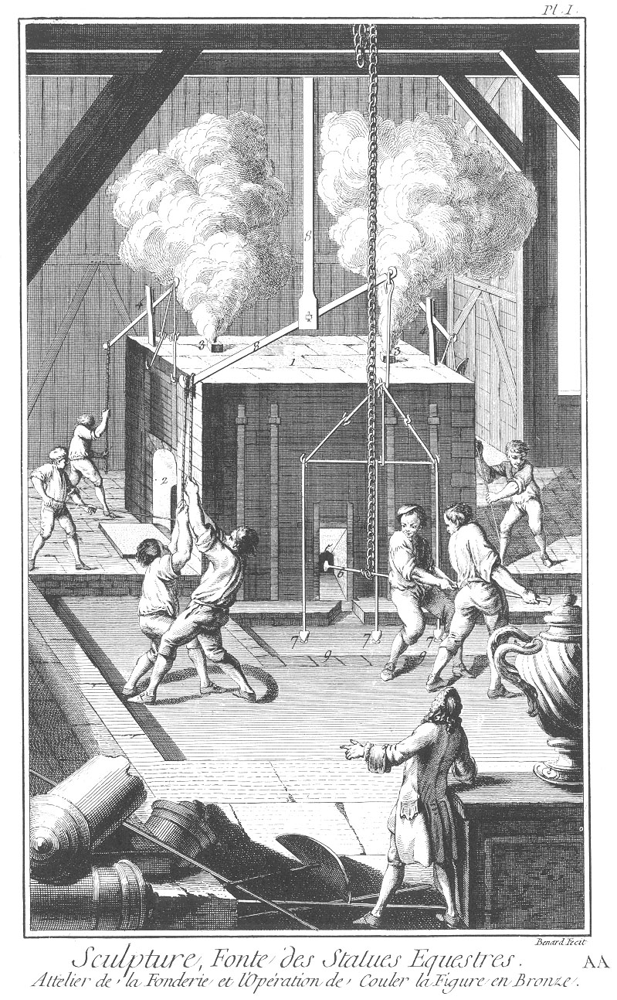
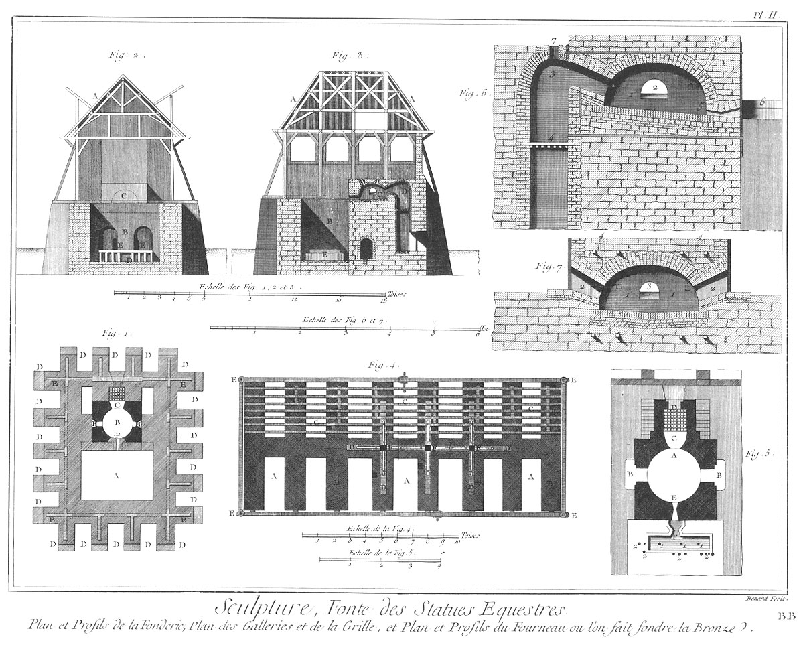
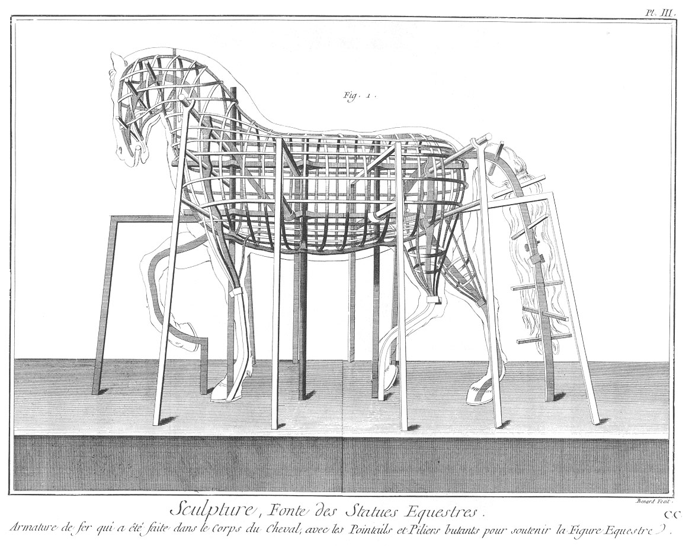
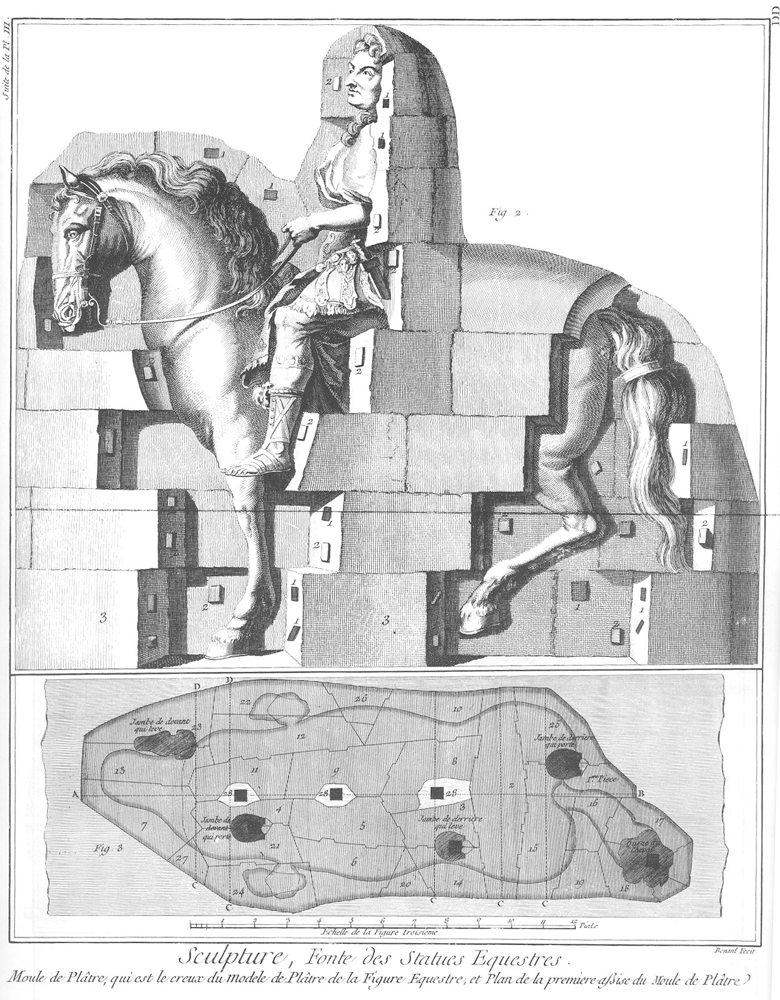
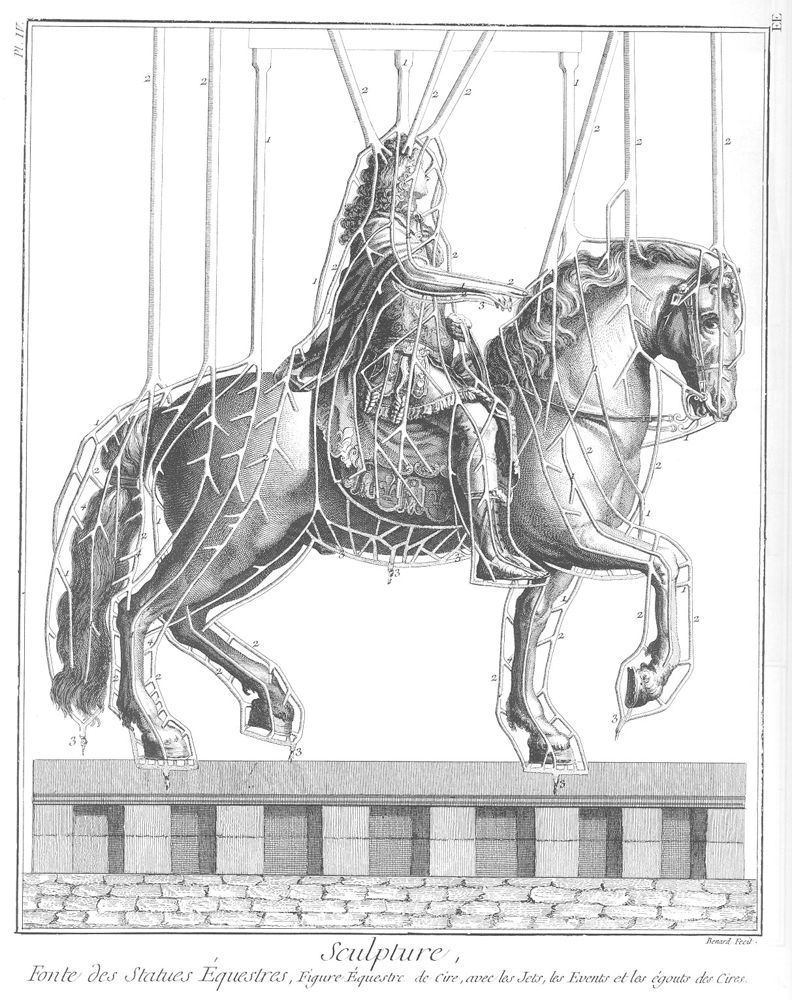
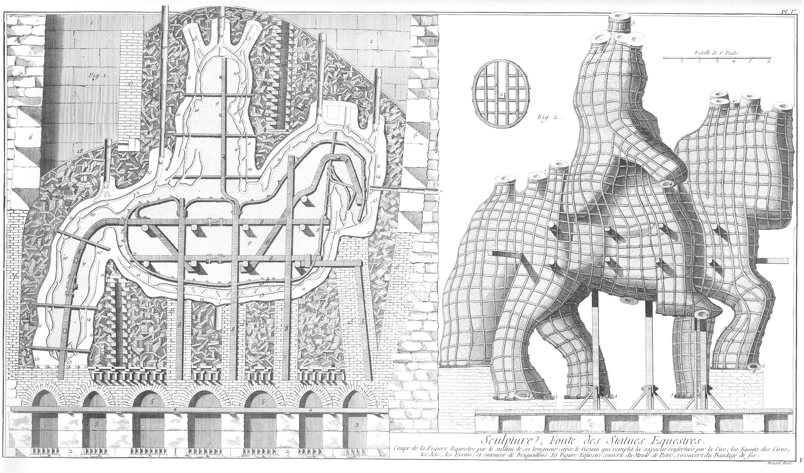

SCULPTURE FONTE DES STATUES EQUESTRES
=====================================

Contenant six Planches équivalentes à douze à cause de quatre doubles & d'une triple.

PLANCHE Iere.
-------------

Elle représente l'attelier de la fonderie dans le tems que l'on fond le métal dans le fourneau, & que l'on coule la figure en bronze.

1. Fourneau.

2. Portes par lesquelles on remue le métal dans le fourneau.

3. Cheminées par lesquelles la fumée sort du fourneau.

4. Bascules par lesquelles on leve & ferme les portes du fourneau.

5. Trou du tampon par lequel sort le métal pour couler dans l'écheno.

6. Perrier avec lequel on pousse le tampon dans le fourneau pour en faire sortir le metal, afin qu'il coule dans l'écheno. Ce perrier est suspendu par une chaîne de fer.

7. Trois quenouillettes qui bouchent dans l'écheno l'entrée du métal, au haut des trois jets par lesquels le métal se répand dans tous les jets de la figure équestre.

8. Bascule pour lever en même tems les trois quenouillettes, afin que le métal entre dans les trois principaux jets.

9. Echeno en maniere de bassin, dans lequel coule le métal au sortir du fourneau pour entrer dans les trois principaux jets en même tems, quand on a levé les quenouillettes.

PLANCHE II.
-----------

Elle représente le plan & profils de la fonderie, le plan des galeries & de la grille, & le plan & profils du fourneau où l'on fait fondre le bronze.

Fig.
1. Plan de la fonderie.
	- A, la fosse.
	- B, le fourneau.
	- C, la chauffe
	- D, les galeries.
	- E, les plates-bandes de fer.
	- F, l'écheno.
	- G, la grille.
	- H, les portes.

2. Profil de la fonderie par sa largeur.
	- A, le comble de l'attelier.
	- B, la fosse.
	- C, le fourneau.
	- D, les galeries.
	- E, passage pour tourner autour du mur de recuit.

3. Profil de la fonderie par sa longueur.
	- A, le comble de l'attelier.
	- B, la fosse.
	- C, le fourneau.
	- D, la chauffe.
	- E, les galeries.
	- F, passage pour tourner autour des galeries.

4. Les galeries & la grille.
	- A, les galeries.
	- B, murs de grès des galeries.
	- C, la grille de fer.
	- D, les plates-bandes ou base de l'armature de fer.
	- E, lien des galeries, ou embrasure de fer, qui renferme les murs des galeries.
	- F, pointaux de l'armature de fer.

5. Plan du fourneau où l'on fait fondre le bronze.
	- A, le fourneau.
	- B, les portes du fourneau pour remuer le métal.
	- C, la chauffe.
	- D, la grille sur laquelle on met le bois.
	- E, passage par lequel le métal coule dans l'écheno.
	- F, l'écheno.
	- 1, 1, 1, entrée des jets par lesquels le métal coule pour remplir l'espace occupé par les cires.
	- 2, 2, 2, 2, issue des évents.

6. Profil du fourneau par sa longueur.
	- 1, le fourneau.
	- 2, les portes.
	- 3, la chauffe.
	- 4, la grille.
	- 5, trou du tampon.
	- 6, l'écheno.
	- 7, trou par lequel on jette le bois dans la chauffe.

7. Profil du fourneau en largeur.
	- 1, 1, le fourneau.
	- 2, 2, les portes.
	- 3, la chauffe.
	- 4, 4, les cheminées du fourneau.

PLANCHE III.
------------

Fig.
1. L'armature de fer qui a été faite dans le corps du cheval, avec les pointails & piliers butans pour soutenir la figure équestre.

PLANCHE III. N°. 2.
-------------------

Fig.
2. Le moule de plâtre, qui est le creux du modele de plâtre de la figure équestre.
	- 1, 1, 1, 1, entailles ou hoches creuses.
	- 2, 2, 2, 2, entailles ou hoches de relief.
	- 3, 3, 3, premiere assise du moule.

3. Le plan de la premiere assise du moule de plâtre.
	- 1,
	- 2,
	- 3,
	- 4,
	- 5,
	- 6,
	- 7,
	- 8,
	- 9,
	- 10,
	- 11,
	- 12,
	- 13,
	- 14,
	- 15,
	- 16,
	- 17,
	- 18,
	- 19,
	- 20,
	- 21,
	- 22,
	- 23,
	- 24,
	- 25,
	- 26,
	- 27, pieces du moule dans l'ordre qu'elles ont été faites.
	- 28, 28, 28, pointails de l'armature de fer.

PLANCHE IV.
-----------

Fig.
1. La figure équestre de cire, avec les jets, les évents & les égoûts des cires.
	- 1, 1, 1, &c. les jets.
	- 2, 2, 2, &c. les évents.
	- 3, 3, 3, &c. les égoûts des cires.
	- 4, 4, 4, les attaches.

PLANCHE V.
----------

Fig.
1. La figure équestre par le milieu de sa longueur, comme elle est dans la fosse, avec le noyau qui remplit la capacité renfermée par la cire ; l'épaisseur de la cire couverte du moule de potée, dans l'épaisseur duquel sont les égoûts des cires, les jets & les évents, lequel moule de potée est environné de bandages de fer & entouré de briquaillons ou morceaux de briques qui remplissent toute la fosse pour faire le recuit du moule de potée & du noyau.
	- 1. Fosse.
	- 2. Fond de la fosse avec les deux rangs de briques, l'un à plat, & l'autre de champ.
	- 3. Galeries où l'on fait le feu, premierement pour retirer les cires dont le bronze doit prendre la place, & pour ensuite faire le recuit du moule de potée & du noyau.
	- 4. Grille de fer.
	- 5. Arcades de briques posées sur la grille qui porte les briquaillons.
	- 6. Murs de la fosse & murs du recuit.
	- 7. Passage pratiqué entre le mur du recuit & la fosse, pour faire le feu, pour retirer les cires, & pour observer si le noyau est en feu & s'il est recuit.
	- 8. Fers de l'armature renfermés dans le noyau.
	- 9. Noyau qui remplit la capacité renfermée par la cire.
	- 10. Epaisseur de la cire qu'il faut retirer par la chaleur du feu, & dont le bronze doit prendre la place.
	- 11. Moule de potée qui couvre les cires, qui contient dans son épaisseur les égoûts des cires, les jets & les évents, & qui est renfermé par le bandage de fer.
	- 12. Epaisseur du bandage de fer.
	- 13. Egoûts des cires.
	- 14. Jets.
	- 15. Events.
	- 16. Briques arrangées de plat & de champ, & posées sur les arcades de la brique pour donner plus de liberté à la flamme.
	- 17. Briquaillons ou morceaux de briques mis pêle-mêle dans la fosse pour communiquer le feu jusqu'au haut de la figure.
	- 18. Aire d'argile qui couvre les briquaillons pour en conserver la chaleur.
	- 19. Cheminées de brique posées dans les briquaillons pour donner issue à la fumée.
	- 20. Tuyaux de tôle élevés au-dessus des jets & des évents pour donner issue à la fumée de la cire.
	- 21. Mur de brique d'un pié d'épaisseur en arcade au-dessus de la croupe du cheval, pour diminuer l'espace qui contient les briquaillons.
	- 22. Gouttieres de tôle pour faire écouler la cire, à mesure qu'elle se fond, dans des sebilles de bois hors le mur de recuit.
	- 23. Tuyaux de tôle qui passent à-travers le mur de recuit, les briquaillons & le mur de potée, pour observer si le noyau est en feu & recuit.
	- 24. Ouvertures dans le mur de recuit vis-à-vis des ouvertures des galeries, afin d'y mettre du bois.
	- 25. Murs de brique pour renfermer tous les fers de l'armature qui portent la figure équestre, afin qu'ils ne fléchissent pas dans le tems du recuit.
	- 26. Murs de brique qui sont posés sous le ventre du cheval & sous le bras qui est en l'air dans la figure, & qui sont élevés sur la grille, afin qu'ils portent solidement tout l'ouvrage.

Fig.
2. La figure équestre couverte du moule de potée, recouvert du bandage de fer.

	- 1. Grille de fer sous les quatre jambes & sous la queue du cheval, auxquelles grilles les fers du bandage sont accrochés.
	- 2. Fer au milieu desdites grilles, lequel passe à-travers les jambes & la queue du cheval.
	- 3. Jets.
	- 4. Egoûts des cires.
	- 5. Events.

Nota.
-----

Ces figures & leurs explications sont extraites du livre de M. Boffrand, architecte du Roi, intitulé: Description de ce qui a été pratiqué pour fondre en bronze d'un seul jet la figure équestre de Louis XIV. élevée par la ville de Paris dans la place de Louis le Grand en 1699.

[->](../../../Tome_26-Planches_Tome_9/01-Titre.md)
