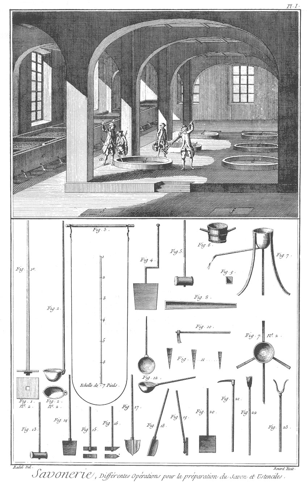
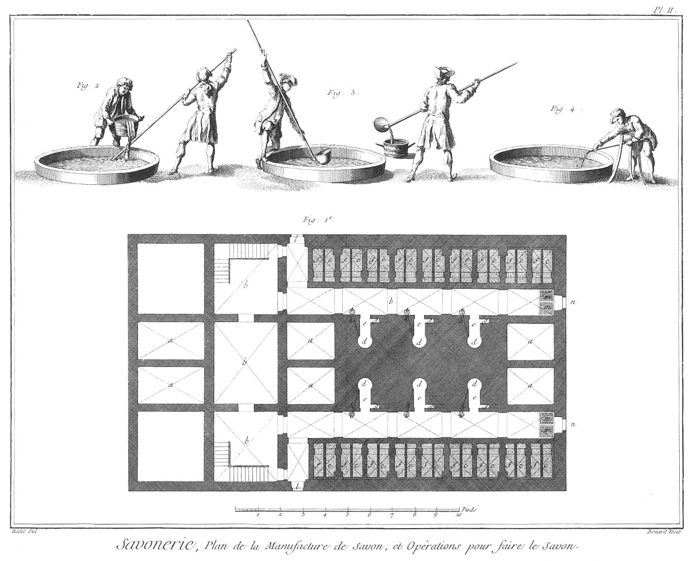
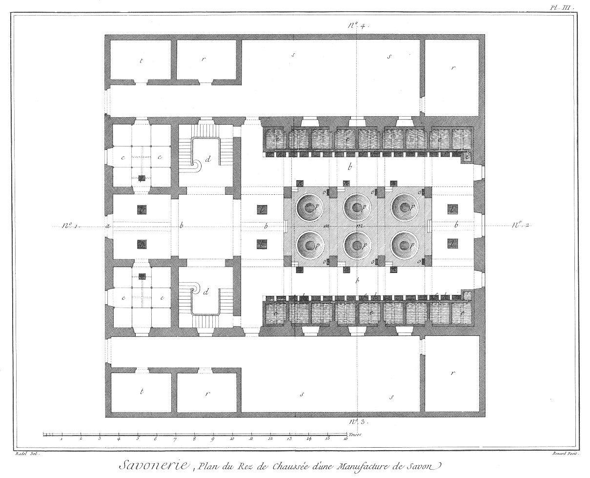
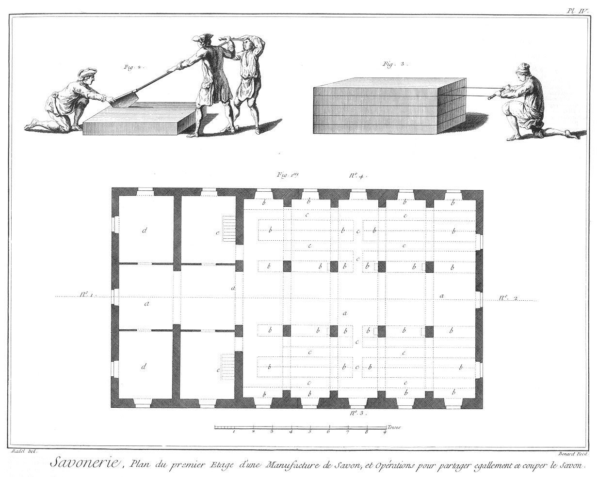
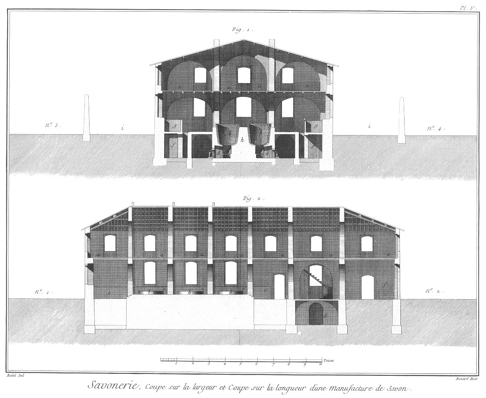

SAVONNERIE
==========

Contenant cinq Planches équivalentes à neuf, à cause de quatre doubles. 

PLANCHE Iere.
-------------

Différentes opérations pour la préparation du savon & ustensiles.

La vignette représente l'intérieur d'une savonnerie dans la partie où sont les chaudieres.

Fig.
1. 
	- a, ouvrier qui enfonce le matras dans la chaudiere pour faciliter l'entrée des lessives & les mêler.
	- b, ouvrier qui verse un seau de lessive le long du bâton du matras, afin d'avoir l'entrée plus libre & faciliter le mêlange des matieres.
	- c, autre ouvrier prêt à enfoncer le matras dans la matiere pour la remuer.
	- d, d, d, dispositions des chaudieres.
	- e, e, bassins pour les lessives.
	- f, f, regards des piles à huiles.

Bas de la Planche.

Fig.
1. Matras pour remuer les matieres dans les chaudieres.
	- n°. 2. Plan du matras.

2. & 2. n°. 2. Elévation & plan de la casserolle pour ôter les matieres des chaudieres.

3. Fil de fer monté sur un bâton pour couper le savon blanc.

4. Pelle de fer pour couper le savon madré.

5. Masse de bois ferrée pour aider à couper le savon avec le couteau, fig 18.

6. Cuve pour porter la matiere au sortir des fourneaux & pour le service des lessives.

7. & 7. n°. 2. Plan & élévation de la casserolle de fer avec son tuyau pour porter l'huile aux chaudieres.

8. &
9. Plan & coupe du canal de bois pour porter les lessives.

10. &
11. Coins & hache de fer pour fendre le bois.

12. Casserolle pour puiser les lessives des bassins.

13. Masse de bois ferrée pour enfoncer les coins dans le bois.

14. Pelle de fer pour transporter les matieres.

15. &
16. Masse de fer pour briser les matieres.

17. Autre pelle de fer pour transporter les matieres.

18. Couteau pour couper le savon.

19. &
20. Platines de fer pour briser les matieres.

21. Croc de fer pour ranger le bois dans les fourneaux.

22. Matras pour fermer le canal de l'écume des chaudieres.

23. Fourcas pour porter le bois dans les fourneaux. 

PLANCHE II.
-----------

Plan d'une manufacture de savon, & opérations pour faire le savon.

Fig.
1. 
	- a, a, a, piles à huile.
	- b, b, caves.
	- c, c, bassins pour les secondes lessives.
	- d, d, fourneaux.
	- f, f, f, bassins pour les premieres lessives.
	- g, g, cheminées.
	- h, h, canaux pour porter les lessives des chaudieres dans l'épine.
	- i, i, i, cuves pour recevoir les lessives de l'épine.
	- l, l, abajours pour jetter le bois.
	- m, m, bassins pour recevoir les écoulemens des cuves.
	- n, n, canaux de sortie des lessives.

2. Ouvrier qui remue les matieres dans les chaudieres avec le matras sur lequel un autre ouvrier fait couler une cuve de lessive pour la mêler avec les matieres.

3. Ouvriers occupés à ôter avec des casseroles la matiere des chaudieres pour la transporter.

4. Autre ouvrier occupé à faire couler de l'huile de la casserole dans les chaudieres.

PLANCHE III.
------------

Plan au rez-de-chaussée d'une manufacture de savon.

Fig.
1. 
	- a, porte d'entrée,
	- b, b, b, portiques de communication pour le service des chaudieres.
	- c, c, mises pour le savon madré.
	- d, d, grands escaliers pour le service des magasins.
	- e, e, bassins pour les lessives.
	- f, f, f, bassins souterreins pour recevoir les premieres lessives.
	- h, h, autres bassins souterreins pour recevoir les secondes lessives.
	- i, i, fontaines.
	- l, l, regards des piles à huile.
	- m, massif pour soutenir les chaudieres.
	- n, n, regards pour puiser les lessives dans l'épine.
	- o, o, tuyaux des cheminées des fourneaux.
	- p, p, chaudieres en briques, dont le fond est garni d'une tôle pour soutenir l'action du feu.
	- q, q, regards pour la lessive perdue des mises au service madré.
	- r, r, magasins pour mettre les matieres.
	- s, s, cours pour le bois.
	- t, t, magasins pour la chaux.

PLANCHE IV.
-----------

Plan du premier étage d'une savonnerie, & les opérations pour partager & couper également le savon.

Fig. 1.
	- a, a, lieux où l'on fait sécher le savon blanc, dit essuyant.
	- b, b, mise ou magasin pour le savon blanc.
	- c, c, passages entre les mises & le savon blanc.
	- d, d, magasins pour couper le savon blanc.
	- e e, arrivée des escaliers au premier étage.

2. Trois ouvriers occupés à couper une piece de savon.

3. Ouvrier coupant le savon avec le fil de fer, fig. 3. Pl. I. lequel passe dans les lignes tracées sur la boîte qui contient cette piece de savon.

PLANCHE V.
----------

Coupe sur la largeur de la manufacture de savon sur le n°. 3 & 4 de la Planche III.

Fig.
1. 
	- a, a, a, grand emplacement au premier étage, employé pour faire sécher le savon blanc.
	- b, b,  grandes chaudieres bâties en brique avec un fond de tôle pour faire chauffer les matieres.
	- c, c, fourneaux des chaudieres.
	- d, d, passages des fourneaux.
	- e, e, caves ou corridors souterreins pour la communication-de chaque fourneau. 
	- f, f, bassins pour les lessives.
	- g, g, autres bassins pour les secondes lessives.
	- h, massif pour soutenir les chaudieres.
	- i, i, cours pour serrer le bois. Coupe sur la longueur de la manufacture de savon, prise sur le n°. 1 & 2 de la Planche III.

Fig.
2. 
	- a, a, séchoirs pour le savon blanc.
	- b, b, superficie des chaudieres.
	- c, c, bassins des lessives.
	- d, cave.
	- e, escalier pour le premier étage.
	- f, portique d'entrée pour l'attelier.

[->](../08-Sellier-Carrossier/Légende.md)
