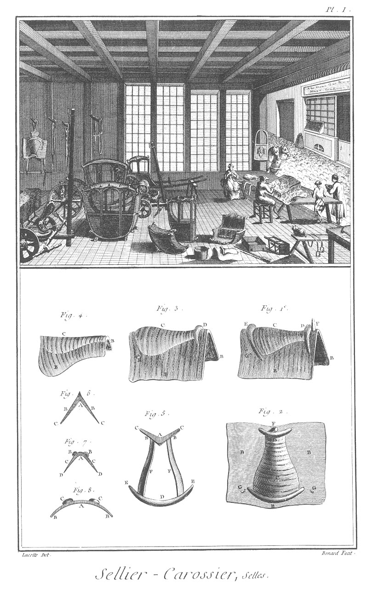

SELLIER-CARROSSIER
==================

Contenant vingt-cinq Planches équivalentes à trente-neuf à cause de quatorze doubles. 

PLANCHE Iere.
-------------

Le haut de cette Planche représente un attelier de sellier-carrossier, dont le devant est occupé d'ouvriers travaillans à divers ouvrages de sellerie, & le derriere est garni de toutes sortes de carrosses, chaises & autres équipages.

Fig.
1. Elévation perspective.

2. Plan d'une selle à piquer.
	- A, l'un des panneaux.
	- B B, les quartiers.
	- C, le siége.
	- D, la batte de devant.
	- E, la batte de derriere.
	- F, le pommeau.
	- G G, les crampons de courroie.

3. Selle de chasse.
	- A, l'un des panneaux.
	- B B, les quartiers.
	- C, le siége.
	- D, la batte de devant.
	- E, le crampon de courroie.

4. Selle rase ou à l'angloise.
	- A, l'un des panneaux.
	- B B, les quartiers.
	- C, le siége.

5. Arçon de selle.
	- A, le garrot.
	- B B, les mammelles.
	- C C, leurs pointes.
	- D, le troussequin.
	- E E, les pointes.
	- F F, les bandes.

6. Elévation du devant d'un arçon.
	- A, le garrot.
	- B B, les mammelles.
	- C C, les pointes.

7. Elévation du devant d'un autre arçon.
	- A, le garrot.
	- B B, la batte coupée.
	- C C, les mammelles.
	- D D, les pointes.

8. Elévation du derriere d'un arçon.
	- A, le troussequin
	- B B, les pointes.
	- C C, la batte coupée.

PLANCHE II.
-----------

Fig.
9. Panneau de selle.

10. Courroie de croupiere.
	- A, la croupiere.
	- B, la boucle.
	- C, le sanglot.

11. Housse.
	- A A, le galon ou la broderie.

12. Coussinet.

13. Sangle.
	- A A, les bouts arrêtés à l'arçon de la selle.
	- B B, les boucles.
	- C C, les sanglots.

14. Contre-sangle.
	- A, le bout arrêté à l'arçon de la selle.
	- B, la boucle.
	- C, le sanglot.

15. Courroie d'étrier.
	- A, la courroie.
	- B, la boucle.
	- C, l'étrier.

16. Ventriere.
	- A A, les courroies.
	- B, la boucle.

17. Sout.
	- A, le sout.
	- B, le faux fourreau.
	- C, le montant.
	- D, la ventriere.

18. Selle pour femme.
	- A, les panneaux.
	- B B, la garniture.
	- C, le dossier.
	- D D, les battes.
	- E, le pommeau.

19. Plan de la selle.
	- A A, la garniture.
	- B, le dossier.
	- C C, les battes.
	- D, le pommeau.

20. Marchepié.
	- A A, les courroies.
	- B B, les boucles.
	- C, le marchepié.

21. Arçon de selle de femme.
	- A, le garreau.
	- B B, les mammelles.
	- C C, leurs pointes.
	- D, le pommeau.
	- E, le troussequin.
	- F F, les pointes.
	- G G, les plaintes.
	- H, le dossier.
	- I, la batte de devant.
	- K, la batte de derriere.
	- L L, les montans de dossier.

PLANCHE III.
------------

Equipage de cheval de selle.

La vignette représente un cheval de selle entierement équipé.

Fig.
1. Monture de la bride.
	- a, la têtiere.
	- b, les porte-mords.
	- c, le frontal.
	- d, la sougorge.
	- e, la muserolle.
	- f f, les rênes.
	- g, le bouton.
	- h, bridon.
	- i, martingale.

Bas de la Planche. Développement du ressort de la boîte du poitrail.

2. Face extérieure du ressort du poitrail & de la boucle qui le retient. 

3. Face intérieure de la même boîte du côté qui s'applique à l'arçon.

4. La même boîte ouverte & garnie du porte-boucle.

5. La même boîte ouverte dont on a ôté le porte-boucle.

6. Le porte-boucle.

7. Profil de la boîte.

Toutes ces figures sont de la grandeur de l'objet.

PLANCHE IV.
-----------

Fig.
1. Elévation laterale.

2. Plan d'une berline ou vis-à vis à deux fonds montée sur de longues soupentes.

3. Bout du timon. G, la partie du timon. H, le crochet.

4. Siége.
	- A A, le siége.
	- B, la traverse du brancard.

5. Tiroir de derriere.
	- A A, l'entretoise.
	- B B, les montans.
	- C C, le tiroir.
	- D, le marchepié du tiroir.

6. Tréport du siége.
	- A, la tige.
	- B B, les branches.

7. Cric.
	- A, la roue.
	- B, le support.
	- C, l'arcboutant.

PLANCHE V.
----------

Fig.
1. Elévation latérale d'une berline ou vis-à-vis à panneau arrasé, montée sur quatre coins de ressort à la Daleine.

2. &
3. Ressorts à la Daleine.
	- A A, les ressorts.
	- B B, les mains de ressorts.
	- C C, les boulons à vis à écrous pour les arrêter.

4. Ressort de derriere.
	- A, le ressort.
	- B, la main.
	- C, le tiran à vis à écrou pour l'arrêter.

5. Marchepié des domestiques.

6. Liloir de derriere à la Daleine.
	- A A, le liloir.
	- B B, les montans.

7. Dessous du marchepié.

8. Avant-train supérieur.
	- A, le marchepié.
	- B, la tringle du marchepié.
	- C, l'entretoise.
	- D D, la fourchette.
	- E E, les jantes.
	- F, l'entretoise du brancard.

9. Avant-train inférieur.
	- A, la fourchette.
	- B B, la volée.
	- C C, les palonniers.
	- D, l'entretoise. 
	- E E, les jantes.

PLANCHE VI.
-----------

Fig.
1. Elévation latérale.

2. Plan d'une berline de campagne ou vis-à-vis à cul de singe à hautes roues avec ses lanternes, montée de ressorts à la Daleine.

3. Profil de la porte.

4. Elévation de la porte.

5. Elévation en face de la berline.
	- A A A A, les lanternes.

6. Elévation en face d'un vis-à-vis.

7. Traverse de pavillon de berline ou vis-à-vis.
	- A A, les mortoises.

8. Traverse de devant de berline.
	- A A, les tenons.

9. Traverse de derriere de berline.
	- A A, les tenons.

10. Traverse de devant de vis-à-vis.
	- A A, les tenons.

11. Traverse de derriere de vis-à-vis.
	- A A, les tenons.

PLANCHE VII.
------------

Fig.
1. Elévation latérale.

2. Plan d'une berline de campagne à quatre portieres à six ou huit places, montées de longues soupentes.

3. Elévation en face de la berline.

4. Traverse de pavillon de la berline.
	- A A, les mortoises.

5. Traverse d'en haut de devant de la berline.
	- A A, les tenons.

6. Traverse d'en-haut de derriere de la berline.
	- A A, les tenons.

7. Panneau à crosse.
	- A, le montant à crosse.
	- B, la traverse à crosse.
	- C C, les tenons.
	- D, l'accotoir.
	- E E, les tenons.

8. Battant de derriere.
	- A A, les mortoises.
	- B, le tenon.

9. Pié cornier.
	- A A, les mortoises.
	- B, le tenon.

PLANCHE VIII.
-------------

Fig.
1. Elévation latérale.

2. Plan d'une caleche en gondole montée de longues soupentes.

3. Elévation en face d'un des siéges de la gondole.

4. Elévation latérale du même siége.

5. Elévation d'un strapontin.
	- A A, le pié du strapontin.

PLANCHE IX.
-----------

Fig.
1. Elévation latérale.

2. Plan d'une diligence appellée diligence de Lyon, servant à transporter les voyageurs de Paris à Lyon, & de Lyon à Paris.

3. Elévation en face de la diligence.

4. Traverse de pavillon de la diligence.
	- A A, les mortoises.

5. Traverse d'en-haut de devant de la diligence.
	- A A, les tenons.

6. Traverse d'en-haut de derriere de la diligence.
	- A A, les tenons.

7. Volée.
	- A, le bout du timon.
	- B, la cheville.
	- C, l'anneau.
	- D, la volée.
	- E E, les chaînes.
	- F F, les palonniers.

PLANCHE X.
----------

Fig.
1. Elévation latérale.

2. Plan d'une diligence à cul de singe à quatre places par le moyen d'un strapontin.

3. Elévation du strapontin ou siége de devant.
	- A, le siége.
	- B B, les crochets servant de support.

4. Profil du strapontin ou siége de devant.
	- A, le siége.
	- B, le crochet servant de support.

5. &
6. &
7. Mains de ressort.

PLANCHE XI.
-----------

Fig.
1. Elévation latérale.

2. Plan d'une diligence montée sur des cordes à boyau & dont la portiere est par derriere.

3. Elévation de la porte d'entrée de la diligence.

4. Elévation d'un des supports de derriere vu sur deux faces.
	- A A, la poulie.
	- B B, la chappe.
	- C C, &c. la tige du support à fourchette.
	- D D, &c. la vis à écrou.

PLANCHE XII.
------------

Fig.
1. Elévation latérale.

2. Plan d'un diable monté sur de longues soupentes.

3. Elévation de l'appui de devant du diable.

4. Traverse d'en-haut de devant ou derriere du diable.
	- A A, les tenons.

PLANCHE XIII.
-------------

Fig.
1. Elévation perspective.

2. Plan d'une chaise de poste montée sur des ressorts à l'écrevisse.

3. Ressort à écrevisse.
	- A A, les crochets soutenans les soupentes.

4. Armon de la chaise de poste.
	- A, la main de l'armon.
	- B, le pié de l'armon.
	- C C, les boulons à vis à écrous.

5. Les deux bouts des brancards de la chaise de poste.

6. &
7. Arcboutans de devant, l'un oblique & l'autre droit.
	- A A, les moufles.
	- B B, les tiges.
	- C C, les pointes ou vis.

8. Chantignole.
	- A, l'échancrure de l'essieu.
	- B B, les pattes.
	- C C, &c. les boulons à vis à écrous.

9. Devant du gousset de la chaise de poste. 

10. Support ou arcboutant de derriere de la chaise.
	- A, la tête.
	- B B, les tiges.
	- C C, les pointes ou vis.

11. Cremailliere de la chaise.
	- A A, les vis à écrous.

12. Cerceau de derriere de la chaise.
	- A A, le cerceau.
	- B, l'entretoise.
	- C C, les tenons.

PLANCHE XIV.
------------

Fig.
1. Elévation latérale.

2. Plan d'une chaise de poste à cul de singe, montée sur des ressorts à la Daleine.

3. Chantignole de la chaise.
	- A, en est l'échancrure.
	- B B, les pattes.
	- C C, &c. les boulons à vis à écrous.

4. Une des mains de la chaise.

5. Garde-crotte de la chaise.
	- A, le garde-crotte.
	- B B, les brancards.
	- C, l'entretoise.

6. Un des moutons à la Daleine de la chaise.
	- A, la tête des moutons.
	- B, le tenon.

7. Ressort de derriere de la chaise.
	- A A, le ressort.
	- B, la main du ressort.
	- C, le tiran à vis à écrous.

8. Gousset de la porte de la chaise.

PLANCHE XV.
-----------

Fig.
1. Elévation latérale.

2. Plan d'une chaise ou cabriolet à soufflet ou sans soufflet.

3. Garde crotte du cabriolet.
	- A, le garde-crotte.
	- B B, l'entretoise.

4. Strapontin ou siége de devant.
	- A, le siége.
	- B, le crochet ou support.

5. Strapontin ou siége avec dossier.
	- A, le siége.
	- B, le dossier.
	- C, l'accottoir.
	- D D, les supports à vis à écrous en
	- E E, & à pointe ou à vis en F F.

6. Elévation en face du cabriolet.
	- A A, la porte ou gousset.
	- B B, le dossier.
	- C C, le fond.
	- D D, les rideaux.
	- E E, les yeux.

7. Elévation de derriere du cabriolet.

8. Carcasse en fer du soufflet du cabriolet.
	- A, le centre.
	- B, le cerceau de devant.
	- C, les charnieres.
	- D, le cerceau du milieu.
	- E, ses charnieres.
	- F, le cerceau de derriere.
	- G, ses charnieres.
	- H H, la tige de l'arcboutant.
	- I, sa charniere.
	- K, point d'appui de derriere.
	- L, point d'appui de devant.

9. Essieu coudé du cabriolet.
	- A A, les coudes.
	- B B, les tourillons.
	- C C, les écrous à vis.

PLANCHE XVI.
------------

Fig.
1. Elévation latérale de cabriolet à quatre roues, monté sur des ressorts à la Daleine.

3. Elévation du siége servant de coffre.

4. Plan du siége.
	- A A, le siége.
	- B, le strapontin.

PLANCHE XVII.
-------------

Fig.
1. Elévation latérale d'un petit carrosse de jardin à nud à deux places, avec impériale, monté sur trois roues.

2. Elévation latérale d'un carrosse de jardin à trois ou quatre places sans impériale, monté aussi sur trois roues.

3. Elévation latérale.

4. Plan d'une vource ou voiture de chasse.

PLANCHE XVIII.
--------------

Fig.
1. Elévation latérale.

2. Elévation en face.

3. Plan d'une chaise à porteur.

4. Un des deux bâtons servant à transporter la chaise.

5. Profil d'un des côtés & d'une partie du devant de la chaise.
	- A, portion du panneau de derriere.
	- B, pié cornu de derriere.
	- C, panneau latéral.
	- D, pié cornu de devant.
	- E, battant de la porte.
	- F, panneau de la porte.
	- G, intervalle pour le chassis de la glace.

PLANCHE XIX.
------------

Fig.
1. Elevation latérale.

2. Elévation de derriere.

3. Elévation en face.

4. Plan d'une brouette.

5. Extrémité d'un des brancards, bâtons de la brouette.
	- A A, le bâton.
	- B, la cheville.

PLANCHE XX.
-----------

Noms des pieces dont les figures suivantes sont composées.

Fig.
1. &
2. &
3. Pl. IV.

1. Pl. V.

1. &
2. &
3. &
4. &
5. &
6. Pl. VI.

1. &
2. &
3. Pl VII.

1. &
2. Pl. VIII.

1. &
2. &
3. Pl. IX.

1. &
2. Pl. X.

1. &
2. &
3. Pl. XI.

1. &
2. Pl. XII.

1. &
2. Pl. XIII.

1. &
2. Pl. XIV.

1. &
2. Pl. XV.

1. &
2. Pl. XVI.

1. &
2. &
3. &
4. Pl. XVII.

1. &
2. &
3. Pl. XVIII.

1. &
2. &
3. &
4. Pl. XIX.

	 - A, battant de pavillon.
	 - B, sommier de pavillon.
	 - C, pié cornier de devant.
	 - D, pié cornier de derriere.
	 - E, montant à crosse de devant.
	 - F, montant à crosse de derriere.
	 - G, battant de devant.
	 - H, battant de derriere.
	 - I, panneau à crosse de devant.
	 - K, panneau à crosse de derriere.
	 - L, traverse à crosse de devant.
	 - M, traverse à crosse de derriere.
	 - N, accottoir de devant.
	 - O, accottoir de derriere.
	 - P, panneau de glace à crosse de devant.
	 - Q, panneau de glace à crosse de derriere.
	 - R, panneau plein de devant.
	 - S, panneau plein de derriere.
	 - T, traverse d'en-haut de porte.
	 - V, traverse de milieu de porte.
	 - U, traverse de bas de porte.
	 - X, battant de porte.
	 - Y, panneau de glace de porte.
	 - Z, panneau plein de porte.
	 
	 - A, grande courroie entretenant la caisse.
	 - B, petite courroie entretenant la caisse.
	 - C, brancard.
	 - D, marche-pié du brancard.
	 - E, courroie ou support du marche-pié.
	 - F, soupente.
	 - F F, soupente de corde à boyau.
	 - G, timon.
	 - H, crochet ou cheville du timon.
	 - I, fourchette.
	 - K, volée.
	 - L, essieu.
	 - M, jante de train supérieur.
	 - N, jante de train inférieur.
	 - O, boulons.
	 - P, marche-pié du cocher.
	 - Q, traverse de devant de brancard.
	 - R, support de brancard.
	 - S, support de fer.
	 - T, moyeu de la roue de devant.
	 - U, rayon de la roue de devant.
	 - V, jante de la roue de devant.
	 - X, siége.
	 - Y, support hâté du siége.
	 - oe, arcboutant de devant de chaise.
	 - a a, garde-crotte.
	 - a, marche-pié des domestiques.
	 - b, tasseau du marche-pié des domestiques.
	 - c, mouton.
	 - d, arcboutant de derriere.
	 - e, arcboutant de devant de mouton de derriere.
	 - f, cric.
	 - g, traverse de derriere de brancard.
	 - h, moyeu de la roue de derriere.
	 - i, rayon de la roue de derriere.
	 - k, jante de la roue de derriere.
	 - l, traverse de devant de sommier.
	 - m, traverse de derriere de sommier.
	 - n, traverse de milieu de sommier.
	 - o, ressort à la Daleine.
	 - o o, ressort à l'écrevisse.
	 - p, traverse de devant.
	 - q, traverse de milieu de devant.
	 - r, montans.
	 - s, panneau de glace de devant.
	 - t, panneau plein de devant.
	 - u, arcboutant de derriere du mouton de devant.
	 - v, arcboutant de devant du mouton de devant.
	 - x, mouton de devant.
	 - y, panier.
	 - z, support à fourchette.
	 
	 - a, traverse d'en-haut de derriere.
	 - b, traverse du milieu de derriere.
	 - c, poulie.
	 - d, chappe.
	 - e, gousset.
	 - f, armon.
	 - g, chantignolle.
	 - h, main.
	 - i, montant.
	 - k, parasol.
	 - l, devant.
	 - m, siége de la vource.
	 - n, marche-pié de la vource.
	 - o, tourniquet.
	 - p, esse.
	 - q, bâton.

Fig.
1. Traverse de pavillon de berline avec moulure. 
	- A A, les mortoises.

2. &
3. &
4. Pié cornier de berline avec moulure.
	- A, le tenon d'en-haut.
	- B, le tenon d'en bas.
	- C, la mortoise  du tenon de l'accottoir.
	- D D, les feuillures.

5. Panneau à crosse de berline.

6. Chassis à crosse de berline.
	- A, le montant à crosse.
	- B, la traverse à crosse.
	- C C, les tenons.
	- D, l'accottoir.
	- E, les tenons.

7. Accottoir chantourné.
	- A, l'accottoir.
	- B B, les tenons.
	- C, portion du montant à crosse.

8. Chassis de glace à crosse.
	- A A, les montans.
	- B, la traverse.

9. Battant de pavillon de berline.
	- A, le tenon d'en haut.
	- B, le tenon d'en bas.
	- C, mortoise du tenon de l'accottoir.

10. Profil de la traverse de pavillon de berline, fig. 1.
	- A, la traverse de pavillon.
	- B, portion de la traverse à crosse.

11. Profil ou plan du pié cornier de berline, fig. 2. 3. & 4.
	- A, le tenon.
	- B, les moulures.
	- C C, les feuillures.

12. Profil de la traverse à crosse marquée B, fig. 6.
	- A, le chassis.
	- B, la feuillure du chassis de glace.
	- C, la moulure.

13. Profil du montant à crosse marqué A, fig. 6.
	- A, la feuillure du chassis de glace.
	- B, la feuillure du panneau à crosse.
	- C, les moulures.

14. Profil du chassis de glace.
	- A, le chassis.
	- B, la feuillure de la glace.

15. Profil de l'accottoir marqué D, fig. 6.
	- A, la feuillure du chassis de glace.
	- B, les moulures.

16. Profil de l'accottoir chantourné, fig. 7.
	- A, la feuillure du chassis de glace.
	- B, les moulures.

17. Profil du battant de pavillon de berline.
	- A, le battant.
	- B, la feuillure de la porte.
	- C, la feuillure de chassis de glace.
	- D, la moulure.

18. Sommier de pavillon de berline.
	- A, la moulure.
	- B B, les talons.
	- C C, &c. les mortoises.

19. Profil du sommier de pavillon de berline, fig. 18.
	- A, le sommier.
	- B, la moulure.
	- C, portion de traverse.

PLANCHE XXI.
------------

Fig.
20. &
21. Battans de porte de berline.
	- A A, les mortoises supérieures.
	- B B, les mortoises inférieures.
	- C C, les mortoises du milieu.

22. Traverse d'en-haut de porte de berline.
	- A A, les tenons.

23. Traverse du milieu de porte de berline.
	- A A, les tenons.

24. Traverse d'en-bas de porte de berline.
	- A A, les tenons.

25. Chassis de glace de porte de berline.
	- A A, les montans.
	- B, la traverse d'en haut.
	- C, la traverse d'en bas.
	- D, le cordon.
	- E, le gland.

26. Traverse inferieure de derriere de berline.
	- A, la traverse.
	- B B, les tenons.

27. Traverse supérieure d'en-haut de devant de berline.
	- A, la traverse.
	- B B, les tenons.
	- C C, les mortoises de montans.

28. &
29. Montans de devant de berline.
	- A A, les montans.
	- B B, &c. les tenons.

30. Traverse du milieu de devant de berline.
	- A, la traverse
	- B B, les tenons.
	- C C, les mortoises de montans.

31. Traverse d'en-bas de devant de berline.
	- A, la traverse.
	- B B, les tenons.

32. Traverse inférieure de face de vis-à-vis.
	- A, la traverse.
	- B B, les tenons.

33. Traverse de milieu de vis-à-vis.
	- A, la traverse.
	- B B, les tenons.

34. Traverse d'en-bas de face de vis-à vis.
	- A, la traverse.
	- B B, les tenons.

35. Pié cornier de vis-à-vis.
	- A, le tenon d'en-haut.
	- B, le tenon d'en-bas.
	- C, la mortoise du tenon de l'accottoir.

36. Sommier de pavillon de vis-à-vis.
	- A A, la moulure.
	- B B, &c. les mortoises.

PLANCHE XXII.
-------------

37. Traverse de pavillon de diligence avec moulures.
	- A A, les mortoises.

38. Sommier de pavillon de diligence.
	- A A, la moulure.
	- B B, &c. les mortoises.

39. Battant de pavillon de diligence.
	- A, le tenon d'en haut. 
	- B, le tenon d'en-bas.
	- C, la mortoise du tenon de l'accottoir.

40. Pié cornier de diligence.
	- A, le tenon d'en haut.
	- B, le tenon d'en-bas.
	- C, la mortoise du tenon de l'accottoir.

41. Pié cornier de la chaise de poste.
	- A, le tenon d'en haut.
	- B, le tenon d'en-bas.
	- C, la mortoise du tenon de l'accottoir.

42. Traverse de pavillon de chaise de poste avec moulure.
	- A A, les mortoises.

43. Sommier de pavillon de chaise de poste.
	- A A, la moulure.
	- B B, &c. les mortoises.

44. Timon double à fourchette.
	- A A, le timon.
	- B, la queue.
	- C, entre-toise supérieure.
	- D, entre-toile inférieure.

45. Traverse de soupente sculptée.

46. Volée tournée.

47. Volée sculptée.

48. Tasseau de marche-pié de domestique marié avec son brancard.
	- A, le marche-pié.
	- B, le tasseau.
	- C, portion du brancard.

49. Tasseau de marche-pié de domestique sans être marié avec son brancard.
	- A, le marche-pié.
	- B, le tasseau.
	- C, portion du brancard.

PLANCHE XXIII.
--------------

Fig.
1. établi.
	- A A, l'établi.
	- B B, les tiroirs.
	- C C, les treteaux.

2. Etaux.
	- A A, les mords acérés.
	- B B, les yeux.
	- C C, les tiges.
	- D D, les jumelles.

3. Gros tasseau.
	- A, la tête acérée.
	- B, le billot.

4. Petit tasseau.
	- A, la tête acérée.
	- B, la pointe.

5. Gros marteau.
	- A, la tête acérée.
	- B, la panne acérée.
	- C, le manche.

6. Marteau à panne fendue.
	- A, la tête acérée.
	- B, la panne acérée & fendue.
	- C, le manche.

7. Petit marteau.
	- A, la tête acérée.
	- B, la panne acérée.
	- C, le manche.

8. Petit maillet de bois.
	- A A, les têtes.
	- B, le manche.

9. Gros maillet de bois.
	- A A, les têtes.
	- B, le manche.

10. Grosse masse.
	- A A, les têtes acérées.
	- B, le manche.

11. Petite masse.
	- A A, les têtes acérées.
	- B, le manche.

12. Gros burin.
	- A, le taillant acéré.
	- B, la tête.

13. Petit burin.
	- A, le taillant acéré.
	- B, la tête.

14. Gros bec d'âne à deux biseaux.
	- A, le taillant acéré.
	- B, la tête.

15. Petit bec d'âne à deux biseaux.
	- A, le taillant acéré.
	- B, la tête.

16. Gros bec d'âne à un seul biseau.
	- A, le taillant acéré.
	- B, la tête.

17. Petit bec d'âne à un seul biseau.
	- A, le taillant acéré.
	- B, la tête.

18. Grosse langue de carpe ou gouge en fer.
	- A, le taillant acéré.
	- B, la tête.

19. Petite langue de carpe ou gouge en fer.
	- A, le taillant acéré.
	- B, la tête.

PLANCHE XXIV.
-------------

Fig.
20. Poinçon rond.
	- A, le poinçon acéré.
	- B, la tête.

21. Poinçon plat.
	- A, le poinçon acéré.
	- B, la tête.

22. Ciseau en bois.
	- A, le taillant acéré.
	- B, la tête.

23. Gouge.
	- A, le taillant acéré.
	- B, la tête.

24. Bec d'âne en bois.
	- A, le taillant acéré.
	- B, la tête.

25. Bec d'âne à ferrer.
	- A A, les taillans.
	- B, la tige.

26. Broche ou chasse-pointe.
	- A, la pointe acérée.
	- B, la tête.

27. Gros emporte-piece.
	- A, le taillant.
	- B, la tête. 

28. Petit emporte-piece.
	- A, le taillant.
	- B, la tête.

29. Pié de biche.
	- A, le pié de biche acéré.
	- B, la tête.

30. Leve clou.
	- A, le leve-clou acéré.
	- B, la tête.

31. Petite alêne à coudre.
	- A, l'alêne acérée.
	- B, le manche.

32. Alêne coudée.
	- A, l'alêne acérée.
	- B, le manche.

33. Grande alêne à coudre.
	- A, l'alêne acérée.
	- B, le manche.

34. Broche ou poinçon à main.
	- A, le poinçon acéré.
	- B, le manche.

35. Gros passe-corde.
	- A, l'oeil acéré.
	- B, la tige.
	- C, le manche.

36. Petit passe-corde.
	- A, l'oeil acéré.
	- B, la tige.
	- C, le manche.

37. Serre-attache.
	- A, la fourchette acérée.
	- B, la tige.
	- C, le manche.

38. Tire-bourres.
	- A A, les tire-bourres.
	- B, la tige.

39. Rembourroir.
	- A A, les rembourroirs.
	- B, la tige.

40. Rembourroir à main.
	- A, le rembourroir à oeil.
	- B, la ligne.
	- C, le manche.

41. Lime d'Allemagne carrelette.
	- A, la lime.
	- B, le manche.

42. Lime d'Allemagne demi-ronde.
	- A, la lime.
	- B, le manche.

43. Lime d'Allemagne tiers-point.
	- A, la lime.
	- B, le manche.

44. Lime d'Allemagne queue de rat.
	- A, la lime.
	- B, le manche.

45. Rape carrelette.
	- A, la rape.
	- B, le manche.

46. Rape demi-ronde.
	- A, la rape.
	- B, le manche.

47. Rape queue de rat.
	- A, la rape.
	- B, le manche.

48. Pinces à deux.
	- A A, les mords.
	- B, l'oeil.
	- C C, les mains.

49. Pinces rondes.
	- A A, les mords.
	- B, l'oeil.
	- C C, les mains.

50. Pinces plates.
	- A A, les mords.
	- B, l'oeil.
	- C C, les mains.

51. Tenailles ou triquoises.
	- A A, les mords.
	- B, l'oeil.
	- C C, les mains.

52. Tenailles à vis.
	- A A, les mords.
	- B, les yeux.
	- C C, les tiges.
	- D, la charniere.
	- E, le ressort.
	- F, la vis.
	- G, l'écrou à oreille.

PLANCHE XXV.
------------

Fig.
53. Rainette à vis.
	- A, le taillant acéré.
	- B, la vis.
	- C, le manche.

54. Scie à main.
	- A, la scie acérée.
	- B, le manche.

55. Lissoir.

56. Cornette.
	- A, la cornette.
	- B, le manche.

57. Forces.
	- A A, les taillans acérés.
	- B, le ressort.

58. Gros ciseaux.
	- A A, les taillans acérés.
	- B, l'oeil.
	- C C, les mains.

59. Petits ciseaux.
	- A A, les taillans acérés.
	- B, l'oeil.
	- C C, les anneaux.

60. Vrille.
	- A, la meche.
	- B, le manche.

61. Tariere.
	- A, la meche.
	- B, le manche.

62. Couteau à pié droit.
	- A, le taillant.
	- B, la tige droite.
	- C, le manche.

63. Couteau à pié coudé.
	- A, le taillant.
	- B, la tige coudée.
	- C, le manche.

64. Etui de cuir des couteaux à pié.

65. Compas.
	- A, la tête.
	- B, les pointes.

66. Gâteau de plomb.

67. Clé droite.
	- A A, les yeux.
	- B, la tige.

68. Clé ceintrée.
	- A A, les yeux.
	- B, la tige.

69. Clé en esse.
	- A A, les yeux.
	- B, la tige.

70. Pierre à aiguiser.
	- A, la pierre.
	- B, la châsse.
	- C, le manche.

71. Toise ou aune pliante.

72. Pié de roi.

[->](../09-Serrurier/Légende.md)
