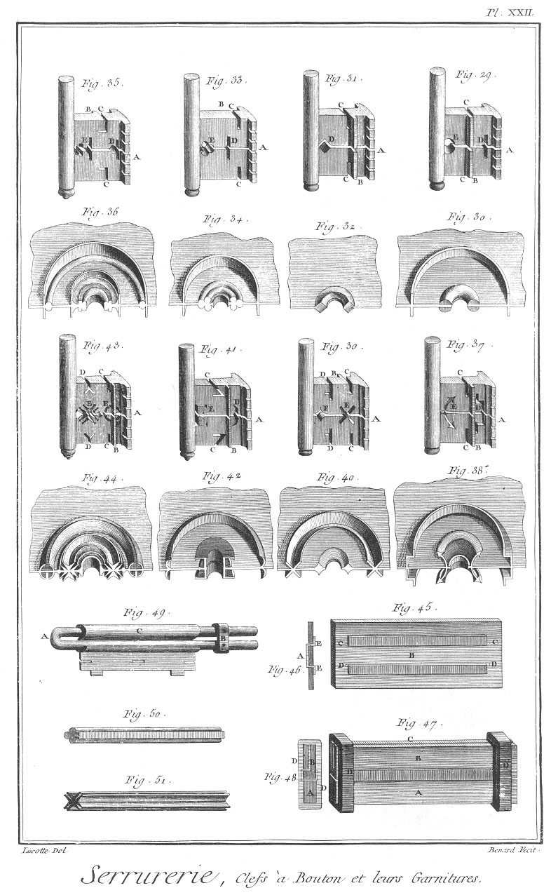

SERRURIER
=========

Contenant cinquante-sept Planches équivalentes à cinquante-neuf à cause de deux Planches doubles. 

PLANCHE Iere.
-------------

Le haut de cette Planche représente la boutique d'un maître serrurier, dans laquelle travaillent plusieurs compagnons ; deux en a, à frapper devant sur l'ouvrage b ; un autre en c, appellé forgeron, occupé à forger le fer ; d est la branloire du soufflet ; e est un autre forgeron occupé à chauffer le fer à la forge ; f est la forge ; g est un autre ouvrier occupé à limer son ouvrage sur un des étaux h arrêté à l'établi i, sur lequel sont différens outils.

Fig.
1. Botte de fer coulé.
	- A A, les liens.

2. Botte de fanton.
	- A A, les liens.

3. Tringle de fer arrondie.

4. Barre de fer plat.

5. Barre de fer quarré.

6. Barre de fer de carnette.

7. Courçon de Berry.

PLANCHE II.
-----------

Le haut de cette Planche représente une cour près de la boutique a du maître serrurier, dans laquelle il place son fer que deux ouvriers sont occupés à ranger le long d'un mur; b b sont des piles de fer de différentes qualités; c représente des ouvriers occupés à peser du fer.

Fig.
8. Paquet de tôle commune.

9. Paquet de fil de fer.

10. &
11. Calibres.

12. Ancre droite.

13. Ancre en esse.

14. Tirant.
	- A, l'oeil.
	- B, le talon.
	- C, l'ancre.

15. Chaîne à moufle.

PLANCHE III.
------------

Fig.
16. Autre chaîne.

17. Jonction de deux chaînes.

18. &
19. Jonction & développement d'autres chaînes.

20. Plate-bande.
	- A A, les talons.

21. Barre de languette.
	- A A, les coudes.
	- B B, &c. les branches.

22. Autre barre de languette simple.

23. Boulon d'escalier.
	- A, la tête.
	- B, la vis.
	- C, l'écrou.

24. Chevêtre.
	- A A, les coudes.
	- B B, les branches.

25. Etrier.
	- A A, les coudes.
	- C C, les yeux.
	- B, le boulon.
	- D, la clavette.

26. Manteau de cheminée.
	- A B, les coudes.
	- C C, les scellemens.

27. Seuil de porte cochere.
	- A A, &c. les barres.
	- B B, les coudes ou scellemens.
	- C C, les entretoises.

28. Fanton de cheminée.

29. Plusieurs fantons liés ensemble.

30. Fanton de mitre.

31. Grille de fourneau quarré.
	- A A, le chassis.
	- B B, les traverses.

32. Grille de fourneau rond.
	- A A, le chassis.
	- B B, les traverses.

33. Grille de gargouille.
	- A, la traverse.
	- B B, les lacets.
	- C C, les barreaux à pointe.

34. Barre de fourneau.
	- A A, les coudes.
	- B B, les scellemens.

PLANCHE IV.
-----------

Fers de bâtimens. Gros fers.

Fig.
1. Ancre à volutes.
	- A A, les volutes.
	- B, le talon.

2. Ancre en esse.
	- A A, les ancres en esse.
	- B, la moufle du tiran.

3. Ancre à croissant.
	- A A, les ancres à croissant.
	- B, la moufle du tirant. 

4. Etrier à patte chantournée.
	- A A, les pattes chantournées.

5. Etrier à pattes simples.
	- A A, les pattes.

6. Etrier à pattes recourbées.
	- A A, les pattes recourbées.

7. &
8. Chevêtres pour les cheminées.
	- A A, les coudes.

9. Harpon coudé pour la charpente.
	- A A, les talons.

10. Plate-bande hâtée.
	-A, la hâture.
	- B B, les talons.

11. Plate-bande simple.
	- A A, les talons.

12. Harpon à scellement.
	- A, le talon.
	- B, le chantournement.
	- C, le coude.
	- D, le scellement.

13. Corbeau simple.
	- A, le scellement.

14. Corbeau à patte.
	- A, la patte.
	- B, le scellement.

15. Corbeau à talon.
	- A, le talon.
	- B, le scellement.

16. Tirant coudé.
	- A, l'oeil.
	- B, le coude.
	- C, le scelle-ment.

17. Tirant à talon.
	- A, l'oeil.
	- B, le talon.

18. Tirant hâté.
	- A, la hâture.
	- B, l'oeil.
	- C, le coude.
	- D, le scellement.

19. Embrasure pour les cheminées de brique.
	- A, la plate-bande.
	- B, l'étrier.

20. Plate-bande de l'embrasure.
	- A A, les mortoises.

21. Etrier de l'embrasure.
	- A A, les coudes.
	- B B, les tenons mortoisés.

22. Crochet à talon.
	- A, le crochet.
	- B, le talon.

23. &
24. &
25. Différens clous dits clous de charette, pour arrêter les fers de bâtimens.
	- A A A, les têtes.

PLANCHE V.
----------

Gros fers de vaisseaux.

Fig.
1. Courbe de potereau pour l'extérieur d'un vaisseau.
	- A, le talon.
	- B B, les branches courbes.
	- C, l'arcboutant.
	- D D, &c. les trous pour l'arrêter.

2. Branche sans talon de la courbe.
	- A, l'entaille de l'arcboutant.
	- B B, les trous.

3. Branche à talon de la courbe.
	- A, le talon.
	- B, l'entaille de l'arcboutant.
	- C C, les trous.

4. Arcboutant de la courbe.
	- A A, les tenons.

5. Guirlande pour l'intérieur d'un vaisseau.
	- A, le talon.
	- B B, les branches courbes.
	- C, l'arcboutant.
	- D D, &c. les trous pour l'arrêter.

6. Branche à talon de la guirlande.
	- A, le talon.
	- B, l'entaille de l'arcboutant.
	- C C, les trous.

7. Branche sans talon de la guirlande.
	- A, l'entaille de l'arcboutant.
	- B B, les trous.

8. Arcboutant de la guirlande.
	- A A, les tenons.

9. Courbe de faux-pont.
	- A, la branche droite.
	- B, la branche courbe.
	- C C, les renforts.
	- D, l'arcboutant.

10. Branche droite de la courbe.
	- A, le talon.
	- B, le renfort.

11. Branche courbe de la courbe de faux-pont.
	- A, le renfort.

12. Arcboutant de la courbe.
	- A A, les tenons.

13. Courbe de pont.
	- A, la branche de champ droite.
	- B, la branche de plat courbe.
	- C C, les renforts.
	- D, l'arcboutant.

14. Branche de champ de la courbe.
	- A, le talon.
	- B, le renfort.

15. Branche du plat courbe de la courbe de pont.
	- A, le renfort.

16. Arcboutant de la courbe de pont.
	- A A, les tenons.

17. Gond du haut de gouvernail.
	- A, le mamelon.
	- B B, les branches.
	- C C, les pattes.

18. Gond de milieu de gouvernail.
	- A, le mamelon.
	- B B, les branches.

19. Penture du haut.
	- A, l'oeil.
	- B B, les pattes.

20. Penture de milieu.
	- A, l'oeil.
	- B B, les branches à patte.

21. Penture du bas.
	- A, l'oeil.
	- B B, les branches.

22. Gond du bas de gouvernail.
	- A, le mamelon.
	- B B, les branches.

23. Cercle de bout de vergue à la françoise.
	- A, l'anneau de la vergue.
	- B, l'anneau du bout dehors.
	- C, l'entretoise.
	- D D, les charnieres.

24. Chandelier à pivot recevant le tape-cul.
	- A, le collier.
	- B B, les charnieres.
	- C, le rouleau.
	- D, portion de lardoir.

25. Cercle de bout de vergue à l'angloise.
	- A, l'anneau de la vergue.
	- B B, les charnieres.
	- C, l'anneau du bout dehors.
	- D, le rouleau.
	- E, l'entretoise.

26. Cercle de bout de vergue simple.
	- A, l'anneau de la vergue.
	- B, l'anneau du bout dehors.
	- C, l'entretoise.

PLANCHE VI.
-----------

Fig.
35. Armature de barre.
	- A, la courbure.
	- B B, les scellemens.

36. Borne armée de fer.
	- A A, &c. les plates-bandes.
	- B B, la borne.
	- C C, les ceintures.
	- D, le chapeau.

37. Modele d'un ajustement de ceinture C avec une plate bande A.

38. &
39. Pointes de barriere rustiquée.
	- A, l'épaulement.
	- B, la pointe.

40. Fragment de barriere.
	- A, la borne.
	- B B, les travées.

41. Chardon & artichaux.
	- A, l'épaulement.
	- B, la pointe.

42. Ferrure de barriere la plus solide.
	- A A, les pointes.
	- B, la plate-bande.

43. Clé de robinet.
	- A A, les deux branches.
	- B, l'oeil.

44. Autre clé de robinet plus forte à une seule branche.
	- A, l'oeil.
	- B, la branche.

45. Vis de soupape de réservoir.
	- A, la vis.
	- B, la tête.
	- C, la tige.
	- D, la moufle double.
	- E, le tenon de la soupape.
	- F, la soupape.
	- G, la boîte de la vis.
	- H, la traverse. II, les potences.

46. Berceau de jardin.
	- A A, les montans extérieurs.
	- B B, le berceau.
	- C C, &c. les entretoises.
	- D D, &c. les montans intérieurs.
	- E E, le berceau intérieur.
	- F F, les rayons.

PLANCHE VII.
------------

Fig.
47. Vitrail d'église.
	- A A, &c. les traverses.
	- B B, &c. les montans.
	- C C, &c. les ceintres.
	- D D, &c. les rayons.

48. Modele d'assemblage de vitrail.
	- A a, les traverses.
	- B B, le montant.
	- E, le petit quarré de l'épaisseur des verres.
	- F, la plate-bande.
	- G G, les boulons clavetés.

49. Potence de goutiere.
	- A, la potence.
	- B, la gâche.

50. Pivot à bourdonniere.
	- A B, les branches.
	- C, le tourillon.

51. Pivot à crapaudine.
	- A B, les branches.
	- C, le pivot.

52. Crapaudine.
	- A, le trou du pivot.

53. Tôle de porte-cochere.

54. Fléau de porte-cochere.
	- A, la barre boulonnée.
	- B B, les gâches.
	- C, la tringle.
	- D, le moraillon.

55. Tringle du fléau.
	- A, le moraillon.

56. Boulon du même fléau.
	- A, la tête.
	- B, la tige.
	- C, la clavette & sa rondelle.

57. &
58. Gâches du fléau, l'une à vis à écrou, & l'autre à patte.

59. Tôle de mangeoire d'écurie.

60. Anneau de mangeoire.
	- A, l'anneau.
	- B, le crampon.

61. Cramaillée de porte cochere.
	- A B, les extrémités à patte.
	- C, la cramaillée.
	- D, l'arrêt.

62. Crochet de porte cochere.
	- A, l'extrémité arrondie avec piton.
	- B, le crochet & son piton.

PLANCHE VIII.
-------------

63. Penture.
	- A, l'oeil.
	- B, la queue d'aronde.

64. Penture à charnieres.
	- A A, les charnieres.
	- B, le talon.

65. Gond à repos à patte.
	- A, le mamelon.
	- B, la patte.

66. Gond sans repos en plâtre.
	- A, le mamelon.
	- B, le scellement. 

67. Gond à repos en plâtre.
	- A, le mamelon.
	- B, le scellement.

68. Gond sans repos en bois.
	- A, le mamelon.
	- B, la pointe.

69. Porte de bouche.
	- A A, les pentures.
	- B, le loquet.
	- C, son crampon.

70. Chaîne à puits.

71. Gâche en plâtre.
	- A A, les coudes.
	- B B, les scelle-mens.

72. Gâche en bois.
	- A A, les coudes.
	- B B, les pointes.

73. &
74. &
75. Rapointis.

76. Clou de charrette.

77. Cheville.

78. Cheville d'assemblage.

79. Clou de bateau.

80. &
81. Clous de 4, 6, 8, 10, 12, &c. selon leur longueur.

82. Broquette à l'angloise.

83. Broquette commune.

84. Clou rivé.

85. Clou à briquet.

86. Clou d'épingle.

87. Pointe à fiche.

PLANCHE IX.
-----------

Fig.
88. Broche.

89. Patte en plâtre droite.
	- A, la patte.
	- B, le scelle-ment.

90. Patte en plâtre coudée.
	- A, la patte.
	- B, le scelle-ment.

91. Patte en bois droite.

92. Patte en bois coudée.

93. Patte à lambris.
	- A, la patte.
	- B, la pointe.

94. Crochet à faîtage à patte.
	- A, le crochet.
	- B, la patte.

95. Patte de contre-coeur.
	- A, le coude.
	- B, le scelle-ment.

96. Patte à vis coudée.
	- A, la vis.
	- B, le coude.
	- C, le scellement.

97. Crochet à chaîneau.
	- A, le crochet à volute.
	- B, le coude.
	- C, la patte.

98. &
99. Pattes à marbrier.
	- A A, les crochets.
	- B B, les scellemens.

100. Crochet de treillage ou clou à crochet.
	- A, le crochet.
	- B, le coude.
	- C, la pointe.

101. Piton à pointe.
	- A, la pointe.
	- B, l'anneau.

102. Piton à vis en bois.
	- A, la vis.
	- B, l'anneau.

103. Petit gond à pointe.
	- A, la pointe.
	- B, le coude.
	- C, le mamelon.

104. Petit gond à vis en bois.
	- A, la vis.
	- B, le coude.
	- C, le mamelon.

105. Vis de parquet.
	- A, la vis.
	- B, la tête.
	- C, l'écrou.
	- D D, les branches à scellemens.

106. Vis de lit.
	- A, la vis à écrou.
	- B, la tête ronde.

107. Autre vis de lit.
	- A, la vis à écrou.
	- B, la tête quarrée.
	- C, la rondelle.

108. Vis à écrou de serrure.
	- A, la vis à écrou.
	- B, la tête quarrée.

109. Vis en bois à tête ronde.

110. Autre vis en bois à tête perdue ou fraisée.

PLANCHE X.

Grands ouvrages. Détails.

Fig.
1. Feuille d'eau forgée.
	- A, la tête.

2. La même feuille d'eau emboutie.
	- A, la tête emboutie.

3. La même à demi-tournée.
	- A, la tête.

4. La même tournée tout-à-fait.
	- A, la tête.

5. Tarau simple a fourche.
	- A, la fourche.
	- B, la pince.

6. Tarau double.
	- A, la fourche.
	- B, les pommes.
	- C, la pince.

7. Poinçon à emboutir.
	- A, la tête.
	- B, le poinçon.

8. Poinçon a emboutir les feuilles d'eau.
	- A, la tête.
	- B, le poinçon.

9. Etampe a feuille d'eau.

10. Autre étampe à feuille d'eau à emboutir.

11. Embase simple.

12. Embase à couger.

13. Embase à quart de rond.

14. Embase à couger & quart de rond.

15. Lien à cordon.
	- A A, la cloison.
	- B, la couverture.

16. &
17. Cloison de face de lien à cordon.
	- A A, les trous.

18. &
19. Entretoise de cloison.
	- A A, les tenons.

20. Couverture.
	- A A, les étochiots.

21. Premiere chaude pour la façon d'une volute.
	- A, la volute.

22. Seconde chaude.
	- A, la volute.

23. Troisieme chaude.
	- A, la volute.

24. Premiere chaude pour la façon de la contre-volute.
	- A, la volute.
	- B, la contre-volute.

25. Seconde chaude.
	- A, la volute.
	- B, la contre volute.

26. Troisieme chaude.
	- A A, les volutes, ce qui forme une anse de panier.

27. Deux anses de panier réunies.
	- A A, les anses de panier.
	- B B, les liens à cordon.
	- C, la graine.

28. Plate-bande du lien.
	- A A, les trous.

29. Crampon du lien.
	- A A, les tenons.

30. &
31. &
32. &
33. Boules.

34. Premiere chaude d'une double volute.
	- A, la volute.

35. La même plus avancée.

36. La même finie.

PLANCHE XI.
-----------

Fig.
1. &
2. Appui & rampe à barreaux simples & sans chassis.
	- A A, &c. les barreaux.
	- B B, les pointes pour être enfoncées dans les limons.
	- C C, les plates-bandes de limon.
	- D D, les plates-bandes d'appui.

3. &
4. Appui en rampe à barreaux simples avec chassis.
	- A A, &c. les barreaux.
	- B B, les quarrés de limon.
	- C C, les quarrés d'appui.
	- D D, les plates-bandes.

5. &
6. Appui & rampe à arcades à tenon.
	- A A, les arcades.
	- B B, les liens à cordons.
	- C C, les quarrés de limons.
	- D D, les quarrés d'appui.
	- E E, les plates-bandes.

7. &
8. Appui en rampe à arcades haut & bas.
	- A A, les arcades.
	- B B, les liens à cordons.
	- C C, les quarrés de limon.
	- D D, les quarrés d'appui.
	- E E, les plates-bandes.

9. &
10. Appui & rampe à arcades en haut & volute en bas.
	- A A, les arcades.
	- B B, les liens à cordons.
	- C C, les volutes.
	- D D, petits liens à cordons des volutes.
	- E E, les quarrés des limons.
	- F F, les quarrés d'appui.
	- G G, les plates-bandes.

11. &
12. Appui & rampe à cadres.
	- A A, les cadres.
	- B B, les quarrés de limons.
	- C C, les quarrés d'appui.
	- D D, les plate-bandes.

13. Panneau ceintré & tambouriné, c'est-à-dire garni de planches ceintrées, sur lesquelles on donne le contour aux volutes en place.

14. Fragment de rampe à panneaux ceintrés par en bas.

15. Autre panneau à cadre ceintré.

16. Fragment de rampe à panneaux encadrés.

PLANCHE XII.
------------

Grands ouvrages.

Fig.
111. Dessus de porte composé des pieces ci-dessous nommées,
	- A, queue de poireau.
	- B B, boules.
	- C, culot.
	- D, feuille d'eau.
	- G G, chassis.

112. Dessus de porte circulaire composé de pieces ci-dessous nommées.
	- A A, palmette.
	- B, queue de poireau.
	- C, graine.
	- D, fleuron.
	- E, culot.
	- F, feuille d'eau.
	- G G, chassis.

113. Balcon composé des pieces ci-dessous nommées.
	- A A, anse de panier.
	- B, fleuron.
	- C, culot.
	- D D, &c. feuille d'eau.
	- G G, &c. chassis.
	- H H, plate-bande quarderonnée.

114. Autre balcon composé des pieces ci-dessous nommées.
	- A A, anse de panier.
	- B, palmette.
	- C, graine.
	- D, fleuron.
	- E, culot.
	- G G, &c. chassis.
	- H H, plate-bande quarderonnée.

115. Appui composé des pieces ci-dessous nommées.
	- A A, &c. rinceaux.
	- B B, &c. coquilles.
	- G G, &c. chassis.
	- H H, &c plate-bande quarderonnée.

116. Rampe à arcade simple composée des pieces ci-dessous nommées.
	- A A, arcades.
	- B B, liens à cordons.
	- C C, chassis.
	- D D, plate-bande quarderonnée.
	- E, montant.
	- F, vase de cuivre.

117. Rampe à panneau composée des pieces ci-dessous nommées.
	- A, console.
	- B, enroulement.
	- C C, &c. rinceau.
	- D, agraffe.
	- E, rosette.
	- G G, &c. chassis.
	- H H, plate-bande quarderonnée.

PLANCHE XIII.
-------------

Etudes de grilles.

Fig.
1. Arcboutant simple.
	- A, l'arcboutant.
	- B, le montant.
	- C C, les scellemens en platre.

2. Arcboutant en esse.
	- A, l'arcboutant.
	- B, le montant.
	- C, le support.
	- D D, les scellemens en plomb.

3. Tenons forgés.
	- A A, les coupures.

4. Fer coupé préparé à recevoir un tenon.

5. Le même ouvert.

6. Le même garni de son tenon prêt à être soudé.
	- A, le tenon.

7. Le même soudé.
	- A, le tenon.

8. Tenon soudé au talon d'une traverse de grille.
	- A, le tenon.
	- B, la traverse.
	- C, le talon.

9. Tenon soude à une traverse de milieu de grille.
	- A, le tenon.
	- B, la traverse.
	- C C, les talons.

10. Bout de traverse préparé à recevoir un tenon.
	- A, le trou du tenon.

11. Façon de scellement dans le plâtre.

12. Façon de scellement dans le plomb.

13. Forme de tenon pour la traverse à talon.

14. Forme de tenon pour les traverses sans talon.

15. &
16. &
17. &
18. Pointes disposées à être soudées en chardon.

19. Les mêmes pointes réunies à un morceau de fer pour etre soudées & former un chardon.
	- A A, les pointes.
	- B, la virole pour les retenir.
	- C, morceau de fer.

20. Chardon soudé & préparé.
	- A, la pointe du milieu.
	- B B, les pointes extérieures.

21. Chardon fait en artichaux.
	- A, la pointe du milieu.
	- B B, les pointes extérieures.

22. &
23. &
24. &
25. &
26. &
27. &
28. &
29. &
30. &
31. &
32. &
33. Traverses de grilles à barreaux de différentes formes.
	- AA, &c. les ceintres.

PLANCHE XIV.
------------

Fig.
118. Grille à barreaux simples.
	- A A, &c. en sont les barreaux.

119. Grille à barreaux & traverses.
	- A A, &c. en sont les barreaux, &
	- B, la traverse.

120. Grille à barreaux à pointe.
	- A A, &c. en sont les barreaux à pointe, &
	- B B, les traverses.

121. Grille à barreaux à pointe montée sur boules.
	- A A, &c. en sont les barreaux à pointe.
	- B B, &c. les traverses, &
	- C C, les boules.

122. Grille simple à tombeau.
	- A A, &c. en sont les barreaux, &
	- B, la traverse.

123. Grille à tombeau avec traverses.
	- A A, &c. en sont les barreaux, &
	- B B, &c. les traverses.

124. Grille à tombeau & en saillie par en-haut.
	- A A, &c. en sont les barreaux à pointe recourbée, &
	- B B, les traverses.

125. Grille à chassis avec barreaux & traverses très-serrés.
	- A A, &c. en sont les barreaux, &
	- B B, &c. les traverses.

126. Grille battante à un seul vantail.
	- A, en est le montant de derriere.
	- B, le battant.
	- C C, &c. les traverses, &
	- D D, les barreaux à pointes droites & ondées.

PLANCHE XV.
-----------

Fig.
127. Grille à barreaux de château ou de parc, composée des pieces ci-dessous nommées.
	- A, consolle de chardon.
	- B B, &c. montans de la porte.
	- C C, &c. ses traverses.
	- D D, &c. ses barreaux.
	- E E, sa frise.
	- F F, &c. montans du pilastre.
	- G G, &c. ses traverses.
	- H H, &c. ses barreaux.
	- I, sa frise.
	- K K, barre de linteau.
	- L, le couronnement de la porte.
	- M M, couronnement du pilastre.

128. Grille à panneau de choeur d'église ou de chapelle composée des pieces ci-dessous nommées.
	- A, palmette.
	- B, queue de cochon.
	- C, agraphe.
	- D D, rosette.
	- E E, lions.
	- F F, &c. montant de la porte.
	- G G, &c. ses traverses.
	- H H, fust du pilastre.
	- I, sa base.
	- K, son chapiteau.
	- L L, corniche.
	- M M, &c. montant du contre-pilastre.
	- N N, &c. ses traverses.
	- O, son couronnement.

PLANCHE XVI.
------------

Fig.
129. Grille à panneau placée au château de Maisons, composée des pieces ci-dessous nommées.
	- A A, &c. rinceaux & feuillages.
	- B B, têtes d'animaux & masques.
	- C C, ovale.
	- D D, &c. chassis double.
	- E E, &c. cercles entrelacés.
	- F F, &c. rosettes.

130. Grille dormante composée des pieces ci-dessous nommées.
	- A A, panneau.
	- B B, pilastres.
	- C C, &c. couronnement.
	- D D, &c. appuis.

PLANCHE XVII.
-------------

Fig.
131. Couronnement de grille composé des pieces ci-dessous nommées.
	- A A, queues de cochon.
	- B B, &c. rinceaux.
	- C, coquille.
	- D, rosette.
	- E, cornet d'abondance.
	- F, palme.
	- G, feuilles, fruit & fleurs.
	- H H, lauriers ou autres feuillages.

132. Vase.
	- A A, le vase.
	- B B, le socle.
	- C C, un chapiteau de pilastre.

133. Potence ou porte-enseigne composé des pieces ci-après nommées.
	- A, console.
	- B, pivot.
	- C, masque.
	- D, sep de vigne.
	- E E, grande console saillante.
	- F, plateau.
	- G, bélier servant d'enseigne.

134. Autre potence ou porte-enseigne composé des pieces ci-dessous nommées.
	- A A, esse.
	- B, pivot.
	- C C, vases.
	- D D, lacets à scellement.

PLANCHE XVIII.
--------------

Ornemens de relevure.

Fig.
1. Demi-culots en chapelet.
	- A A, &c. les demi-culots.
	- B, queues de poireaux.
	- C C, &c. les chapelets.
	- D, la queue de cochon.

2. Culot simple.

3. Culot composé.
	- A, le culot.
	- B B, feuilles de revers.
	- C, petit culot supérieur.
	- D, queues de poireaux.

4. Petit fleuron rampant.

5. Agraphe.

6. Petite agraphe.

7. Feuilles d'eau adossées.

8. Petit rinceau duquel sort une branche de laurier.

9. Autre rinceau.

10. Grand rinceau.

PLANCHE XIX.
------------

Grands ouvrages, ornemens de relevures.

Fig.
1. Culot relevé.

2. Le même découpé pour être relevé.

3. Fleuron relevé.

4. &
5. Revers du fleuron découpé.

6. Le même fleuron découpé.

7. Revers du milieu du fleuron découpé.

8. Rinceau.

9. Le même rinceau découpé.

10. Revers du rinceau découpé.

11. Agraphe.

12. Revers de l'agraphe.

13. La même agraphe découpée.

14. Pointe à tracer.
	- A A, les pointes.

15. &
16. Clous servant à attacher les ornemens sur le tasseau pour les ciseler.
	- A A, les têtes.
	- B B, les pointes.

17. Tasseau de plomb à ciseler la relevure.

18. &
19. &
20. &
21. &
22. &
23. &
24. &
25. &
26. &
27. &
28. &
29. Ciselets de différentes formes.
	- A A, &c. les têtes. 

PLANCHE XX.
-----------

Brasures & clés.

Fig.
1. Anneau de clé préparé pour être brasé (c'est faire couler du cuivre dans tous les joints par la chaleur du feu à l'aide du borax) avec le panneton, fig.

2. par la tige.
	- A, l'anneau.
	- B, le panneton.
	- C C, la tige.

3. &
4. Autre tige de clé préparée d'une autre maniere pour être brasée.

5. Clé préparée pour y mettre une dent.
	- A, la mortoise dans laquelle doit entrer la dent.

6. Dent préparée à être rivée au bout de la tige de la clé.
	- A, le tenon qui doit entrer dans la mortoise.

7. Premiere chaude pour former une clé, ce qu'on appelle enlever une clé.
	- A, le côté de l'anneau.
	- B, le côté du panneton.

8. Seconde chaude.
	- A, l'anneau épaulé.

9. Troisieme chaude.
	- A, l'anneau percé, &
	- B, le panneton coupé ou tranché.

10. Quatrieme chaude.
	- A, l'anneau bigorné.

11. Cinquieme chaude.
	- A, l'anneau ravalé & fini.

12. Sixieme chaude.
	- A, le panneton corroyé & refoulé.

13. Septieme chaude.
	- A, le panneton tiré.
	- B, l'ere formé.

14. Huitieme & derniere chaude.
	- A, le panneton fini.
	- B, l'ere.
	- C, le museau.

Il y a des ouvriers qui font une clé en trois ou quatre chaudes.

15. Calibre de clé pour en égaliser la tige d'épaisseur, après avoir été forée.
	- A, la partie qui entre dans la forure.

16. Autre calibre.
	- A, la partie qui entre dans la forure.
	- B, sa vis à écroux.
	- C, la vis d'épaisseur.
	- D, le chassis.

17. Chevalet à forer les clés.
	- A, la clé montée.
	- B B, les coussinets d'arrêt.
	- C, la platine coudée.
	- D D, les vis pour arrêter la platine.
	- E, le sommier du chevalet.
	- F F, les jumelles.
	- G, la traverse.
	- H, la bascule.
	- I, l'anneau de la bascule pour être chargée d'un poids.
	- K, le foret.
	- L, l'essieu.
	- M, la boîte.

18. Sommier du chevalet.
	- A, la charniere.
	- B B, les mortoises des jumelles.
	- C, le coude.
	- D, la patte.

19. Bascule du chevalet.
	- A, différens trous servant de pivots à l'essieu.
	- B, le point d'appui.
	- C, l'anneau.

20. Platine coudée.
	- A A, les trous des coussinets.
	- B B, les trous pour l'arréter sur le sommier du chevaler.

21. Coussinet ou cramponnel à patte.
	- A A, les pattes.

22. Foret en langue de carpe.
	- A, le taillant.
	- B, la tige quarrée.

23. Foret quarré.
	- A, le taillant.
	- B, la tige.

24. Essieu.
	- A, le canon de l'essieu.
	- B, la vis pour retenir le foret.
	- C, la boîte.

PLANCHE XXI.
------------

Fig.
- 1. 3. 5. 7. 9. 11. 13. 15. 17. 19. 21. 23. 25. & 27. Clés forées.
	- A A, &c. les museaux, &
	- B, C, D, les garnitures.

- 2. 4. 6. 8. 10. 12. 14. 16. 18. 20. 22. 24. 26. & 28. Elévation d'une des garnitures de la clé au-dessous de laquelle elles sont placées.

PLANCHE XXII.
-------------

Fig.
- 29. 31. 33. 35. 37. 39. 41. & 43. Clés à bouton.
	- A A, &c. les museaux, &
	- B, C, D, E, F, les garnitures.

- 30. 32. 34. 36. 38. 40. 42. & 44. Elévation d'une des garnitures de la clé au-dessous de laquelle elles sont placées.

- 45. Elévation, & 46. le profil d'un mandrin ou moule à garniture.
	- A, la garniture.
	- B, une plaque. C C & D D, des fentes.
	- E E, les branches de la garniture.

- 47. Elévation, & 48. le profil d'un autre mandrin. A B C, les morceaux qui le composent.
	- D D, les viroles ou liens.

- 49. Elévation d'un mandrin pour une garniture en esse A, le coude.
	- B, la virole ou lien.
	- C, la garniture.

- 50. Trefle de la garniture, fig. 34.

- 51. Croix de chevalier de la garniture, fig. 44.

PLANCHE XXIII.
--------------

Fig.
52. Serrure à tour & demi, composée des pieces dont nous verrons ci-après le détail ainsi que celles des serrures suivantes.

53. Pêne de cette serrure.
	- A, la tête.
	- B B, les barbes.
	- C, la gâchette.
	- D, son ressort.

54. Clé. A l'anneau.
	- B, la tige.
	- C, l'embasse.
	- D, le bouton.
	- E, le panneton.
	- F, le museau.
	- G, l'eve.
	- H, la planche.

55. Picolet.

56. Cache-entrée.

57. Ressort à boudin.

58. Bouton à coulisse.
	- A, le bouton.
	- B, la coulisse.

59. Rateau.
	- A, la patte.
	- B, les dents.

60. Serrure à pêne dormant.

61. Pêne.
	- A, la tête.
	- B B, les barbes.
	- C, le talon.

62. Ressort dormant.

63. Serrure à pêne dormant & demi-tour.

64. Pêne dormant.
	- A, la tête.
	- B B, les barbes.
	- C, le talon.
	- D, la gâchette.
	- E, son ressort.

65. Pêne demi-tour.
	- A, la tête chanfrinée.
	- B, le talon.
	- C, le trou du bouton à coulisse.
	- D, celui de l'équerre.

PLANCHE XXIV.
-------------

Fig.
66. Serrure à pêne fourchu & demi-tour.

67. Serrure à pene fourchu & demi-tour à fouillot ou bouton olive.

68. Pêne demi-tour.
	- A, le coude.

69. Fouillot.

70. Bouton olive.

71. Serrure à pêne fourchu à trois branches demi-tour à fouillot & verrous.

72. Pêne fourchu à trois branches ou têtes.
	- A, les têtes.
	- B B, les barbes.
	- C, le talon.

73. Serrure d'armoire à tour & demi.

74. Le ressort & la gâchette.

75. Serrure d'armoire à bec de canne ou bascule.

76. Bascule.

77. Serrure d'armoire à pêne fourchu & demi-tour, & à pignon.

78. Pêne fourchu.
	- A, la tête.
	- B B, les barbes.
	- C, les dents.
	- D, le talon.

79. Pignon.

80. Une des crémaillées.

81. Verrou de la crémaillée.
	- A, le verrou.
	- B, la platine.
	- C C, les crampons.

82. Serrure de tiroir à pêne dormant non encloisonnée.

83. Serrure de tiroir à pêne fourchu & demi-tour encloisonnée.

PLANCHE XXV.
------------

Fig.
84. Paneton de clé de serrure de coffre à double forure.

85. Canon.

86. Paneton de pareille clé à doubles forures & broches.

87. Canon.

88. Paneton de pareille clé à tiers-point, cannelé ou non cannelé.

89. Canon.

90. Paneton de pareille clé à étoile évuidée.

91. Le canon.

92. Paneton de pareille clé en trefle plein.

93. Canon.

94. Paneton de pareille clé en coeur évuidé.

95. Canon.

96. Paneton de pareille clé en fleurs-de-lis pleine.

97. Canon.

98. Paneton de pareille clé en fleurs-de-lis évuidées.

99. Canon.

100. &
101. &
102. Modeles de mandrins des dernieres figures.

PLANCHE XXVI.
-------------

Fig.
103. &
104. &
105. &
106. Serrures de coffre, la premiere  à une seule fermeture, la seconde à deux, la troisieme à trois, & la quatrieme à quatre fermetures.

107. Auberonniere simple.
	- A A, les auberons.
	- B, la platine.

108. Auberonniere à T.
	- A A A, les auberons.
	- B B, la platine à T.

109. Pêne dormant de la serrure à quatre fermetures.
	- A A, les têtes.
	- B B, le corps.
	- C C, les barbes.

110. &
111. Pênes demi-tour à bascule de la même serrure.

112. Celui de la serrure à trois fermetures.
	- A A A, les têtes.
	- B B B, les queues.

PLANCHE XXVII.
--------------

Fig.
113. Coffre fort garni d'une serrure à douze fermetures.

114. Un des pênes.
	- A, la tête chanfrinée.
	- B, le talon.
	- C, son ressort à boudin.

115. &
116. Picolets.

117. Grand pêne.
	- A A, &c. les talons.
	- B, sa barbe.

118. Une des équerres.

119. Bascule.

120. &
121. Gâches à patte.

122. Clé.

123. Boîte composée des garnitures de la clé.

PLANCHE XXVIII.
---------------

Fig.
- 124. Serrure ovale.

- 125. Serrure à bosse. Explication des pieces contenues dans les Serrures.

Fig. 52. 60. & 63. Planche XXIII.
Fig. 66. 67. 71. 73. 75. 77. 82. & 83. Planche XXIV.
Fig. 103. 104. 105. & 106. Planche XXVII.
Fig. 113. Planc. XXVIII.
Fig. 124. & 125. Planche XXIX.

	- A A, Palatres.
	- B B, cloisons.
	- C C, &c. étochiots simples.
	- D D, &c. étochiots à patte.
	- E, pêne à tour & demi.
	- F, pêne dormant.
	- G, pêne fourchu.
	- H, pêne demi-tour.
	- J, pêne à verrous.
	- I, picolet dormant.
	- K, picolet demi-tour.
	- L, ressort simple.
	- M, gâchette.
	- N, ressort à boudin.
	- O, ressort dormant.
	- P, rateau.
	- Q, foncet.
	- R, canon de foncet.
	- S, planche.
	- T, rouet.
	- U, broche.
	- V, bouton à coulisse.
	- X, équerre.
	- Y, fouillot.
	- Z, seconde entée. &, tringle de conduit.
	- a, couverture.
	- b, pignon.
	- c, crémaillée.
	- d, trous oblongs.
	- e, gâche.
	- g, pêne demi-tour à bascule.
	- h h, bascules.
	- i, grand pêne à talon.
	- k, boîte.
	- l m, gâches à pattes.
	- n, moraillon.
	- o, verrous.
	- p, lacets à pointes molles.

PLANCHE XXIX.
-------------

Fig.
126. Intérieur d'un cadenat à serrure.
	- A, le palatre.
	- B, la cloison.
	- C, les étochiots.
	- D, le pêne dormant.
	- E, un des picolets.
	- F, le ressort.
	- G, la broche.
	- H, la bouterole.
	- I, la gâche.

127. Extérieur d'un pareil cadenat, mais en forme de coeur.
	- A, le palatre.
	- B, la cloison.
	- I, la gâche.
	- L, le cache-entrée.

128. Intérieur d'un petit cadenat en triangle.
	- A, le palatre.
	- B, la cloison.
	- D, le pêne dormant.
	- F, le ressort.
	- G, la broche.
	- K, la gâche à charniere.

129. Clé.
	- A, l'anneau.
	- B, la tige.
	- C, le paneton.

130. Cadenat en boule.
	- A, la boule.
	- K, la gâche à charniere.

131. Clé.

132. Cadenat quarré.
	- A, le palatre.
	- B, la cloison.
	- K, la gâche à charniere.

133. Cadenat en écusson A, le palatre.
	- B, la cloison.
	- K, la gâche à charniere.
	- I, le cache-entrée.

PLANCHE XXX.
------------

Fig.
134. Cadenat à cylindre.
	- K, la gâche à charniere.
	- M, le cylindre creux.

135. Clé.

136. Cadenat à ressort.
	- I, la gâche.
	- P, la boîte.
	- Q Q, les ressorts.

137. Clé.
	- A, l'anneau.
	- B, la tige.
	- C, le paneton.

138. Cadenat à secret.
	- A, le cache-entrée à secret.

139. Cadenat à double secret.
	- A, le cache-entrée à secret.
	- B, la coulisse aussi à secret.

140. Cadenat simple à secret, dont les figures 141. 142. 143. & 144. sont les développemens.
	- A B en est la piece de fer à canon.
	- C D, son canon ouvert.
	- I K, la piece de fer à broche.
	- L M, sa broche à deux.
	- g, le tenon.
	- R, la moufle de la gâche.
	- E, le trou des écussons. F G H, les cannelures évuidées.

PLANCHE XXXI.
-------------

Fig.
145. &
146. Becs de cannes, l'un à bouton & l'autre à bascule, composés des pieces ci-dessous nommées.
	- A A, palatres.
	- B B, cloisons.
	- C C, &c. étochiots simples.
	- D, pêne.
	- E, picolets.
	- F, ressorts à boudins.
	- G, fouillot.
	- H, bouton olive.

147. &
148. &
149. Terjettes, la premiere ovale, la seconde à croissant, & la troisieme à panache.
	- A A A, les verrous.
	- B B B, les boutons.
	- C C, &c. les crampons.
	- D D D, les platines.

150. Loqueton.
	- A, la bascule.
	- B, le cordon.
	- C, le cramponet.
	- D, le ressort.
	- E, la platine.
	- F, le mantonet.

151. Platine d'entrée d'un loquet à cordeliere.

152. Loquet à cordeliere.
	- A, la gâche.
	- B, le loquet.
	- C, le bouton.
	- D, le crampon.
	- E, le petit poinçon.

153. Passe-partout.

154. L'intérieur d'un loquet à vieille.
	- A, la platine d'entrée.
	- B, la bascule.

155. Loquet à bascule.
	- A, le loquet.
	- B, le crampon.
	- C, le fouillot.
	- D, le bouton.

156 Boucle tenant lieu de bouton du même loquet.

157. Poignée d'un loquet à poussier.
	- A, la bascule.
	- B, la platine.
	- C, les pointes de la poignée.
	- D, la poignée.

PLANCHE XXXII.
--------------

Roulettes de lit. Pivots d'armoires à fiches rampantes.

Fig.
1. Roulette de lit.
	- A, la monture.
	- B, la chape.
	- C, la roulette.

2. Bande à pattes.
	- A A, les pattes.
	- B, la crapaudine du pivot.

3. Etrier de la monture.
	- A, la bourdonniere.
	- B B, les branches.
	- C C, les goujons pour être rivés sur la bande.

4. Platines entre lesquelles on place des rondelles de cuir, qui rivées & serrées ensemble forment roulettes. Ces cuirs débordent les platines de maniere qu'elles ne font point de bruit en roulant sur le carreau.
	- A A, les platines.
	- B, le canon au travers duquel passe le boulon de la roulette.

5. Boulon de roulette.
	- A, la tête.
	- B, la vis à écrous.

6. Chape de roulette.
	- A, le pivot.
	- B, la chape.
	- C, le trou de la goupille pour l'arrêter.

7. Roulette de bois de buis au gayac.

8. Coupe de la même roulette.

9. Pivots à patte de mon invention monté sur menuiserie.
	- A, le double.
	- B, le simple.
	- C C, les pattes arrêtées de vis.

10. &
11. Le même en plan désassemblé.
	- A, le double, B, le simple.
	- C C, les pattes.

12. &
13. Le même désassemblé en perspective.
	- A, le double.
	- B, le simple.
	- C C, les pattes.

14. &
15. Pivots à aîles, de mon invention, montés sur menuiserie.
	- A A, les doubles.
	- B B, les simples.
	- C C, les aîles.
	- D D, les pointes pour les arrêter comme des fiches.

16. &
17. &
18. &
19. Les mêmes en plan désassemblés.
	- A A, les doubles.
	- B B, les simples.
	- C C, les aîles.

20. &
21. &
22. &
23. Les mêmes en élévation perspective désassemblés.
	- A A, les doubles.
	- B B, les simples.
	- C C, les aîles.
	- D D, les trous pour les pointes.

24. Pivot monté sur menuiserie ne paroissant pas en-dehors.
	- A, le pivot.
	- B, la branche.
	- D, la crapaudine.

25. Le même en élévation perspective.
	- A, le pivot.
	- B, la branche tournante.
	- C C, les branches d'arrêt. 

26. Crapaudine du pivot.
	- A, le trou du pivot.
	- B B, les branches d'arrêt.

27. Pointe à tête ronde à ferrer.
	- A, la tête.
	- B, la pointe.

28. Pointe sans tête à ferrer.
	- A, la pointe.

29. Fiches rampantes de mon invention montées, propres à faire fermer les portes d'elles-mêmes par leur propre poids.
	- A, la rampe.
	- B B, les vases.
	- C C, les aîles.

30. Gond de la fiche rampante.
	- A, la rampe.
	- B, le vase.
	- C, l'aîle.

31. Gond de la fiche rampante.
	- A, la rampe.
	- B, le mamelon.
	- C, le vase.
	- D, l'aîle.

PLANCHE XXXIII.
---------------

Fig.
1. &
2. Fiches à vases, l'une droite & l'autre coudée.
	- A A, &c. les douilles.
	- B B, &c. les vases.
	- C C, &c. les aîles.

3. &
4. Fiches, l'une à broche ou bouton & l'autre de brisures.
	- A A, les broches.
	- B B, &c. les aîles.

5. Fiche à chapelet.
	- A A, &c. les fiches.
	- B B, les vases.

6. Fiche à gond.
	- A, la douille.
	- B, l'aîle.

7. Pomelle à queue d'aronde.
	- A, la douille.
	- B, l'aîle.

8. Pomelle en esse.
	- A, la fiche.
	- B, le gond.
	- C D, leurs aîles en esse.

9. Charniere.
	- A, les noeuds.
	- B, la broche.
	- C C, les aîles.

10. Couplet.
	- A, la charniere.
	- B, la broche.
	- C C, les pattes.

11. Briquet de table.
	- A, le noeud double.
	- B B, les broches.
	- C C, les pattes.

12. Crochet.
	- A, le crochet.
	- B, le piton à vis.

13. Equerre simple.

14. Equerre double.

PLANCHE XXXIV.
--------------

Fig.
15. Espagnolette de croisée.

16. Espagnolette de croisée avec chassis supérieur, & la fig.
17. une autre à verrous.
	- A A, &c. les tiges.
	- B B, &c. les vases.
	- C C, &c. les lacets à vis à écrous.
	- D D, &c. les panetons.
	- E E, &c. les crochets.
	- F F, les poignées G G, leurs boutons.
	- H H, leurs supports à vis à écrous.
	- I, une douille.
	- J, son tenon.
	- H K, la douille du verrou.
	- K, sa tige.
	- L, le verrou.
	- M, son bouton.
	- N, ses crampons.
	- O, sa platine.

18. Paneton à croissant.

19. Agraphe à croissant.

20. Support à charniere.
	- A, la charniere.
	- B, le support.
	- C, la queue à vis à écrous.

21. Support à pivot A A, les pivots.
	- B, le support.
	- C C, les lacets à vis à écrous.

22. Gache d espagnolette.
	- A, le trou.

23. Un des lacets d'espagnolette.
	- A, la tête.
	- B, la vis à écrous.

24. Boîte contenant le mouvement d'une espagnolette à verrous ouvrant en-dehors & en dedans.
	- A A, la tige.
	- B & C, les pignons sans fin.
	- D, le palatre.
	- E, la cloison de la boîte.
	- F, ses étochiots.

25. &
26. Verrous sur champ.
	- A A, les tiges.
	- B, un conduit.
	- C C, les boutons.
	- D D, les verrous.
	- E E, leur embase.
	- F F, leurs cramponets.
	- G G, leurs platines.

27. &
28. Verrous sur plat.

29. Bascule à verrous à poignée.
	- A, la poignée.
	- B, le bouton.

30. Bascule à verrou à pignon.
	- A, le bouton.
	- B, la platine.
	- C, la couverture.

PLANCHE XXXV.
-------------

Façon d'espagnolettes.

Fig.
1. Etampes à tringles.
	- A A, les étampes.
	- B B, les talons.

2. Etampe d'une autre forme, qui se place en-travers de l'enclume.
	- A, l'étampe.
	- B B, les crochets.

3. La même étampe montée sur l'enclume.
	- A, l'étampe.
	- B, la bride pour l'arrêter.
	- C, la clavette.
	- D, l'enclume.

4. Bride de l'étampe.
	- A A, les oeils.

5. Clavette de la bride.
	- A, la tête.

6. Etampe à poignée d'espagnolette.
	- A, l'étampe.
	- B B, les talons.

7. Etampe à vase d'espagnolette.
	- A, l'étampe à vase.
	- B, l'étampe à tringle.
	- C C, les talons.

8. Etampe à bouton de poignée d'espagnolette.
	- A, l'étampe.
	- B B, les talons.

9. Etampe ou clouiere à lacets d'espagnolette. A l'étampe.
	- B, le manche.

10. Lacets étampés.
	- A, la partie destinée à être tournée.
	- B, la tige pour la vis à écrou.

11. Lacets tournés.
	- A, l'anneau.
	- B, la tige.

12. Clou de poignée d'espagnolette prêt à mettre dans la clouiere.
	- A, la tête.
	- B, la tige quarrée.

13. Le même clou sortant de la clouiere.
	- A, la tête.
	- B, la tige quarrée.

14. Clouiere à clou de poignée.
	- A, la clouiere.
	- B, le manche.

15. Clé à tourner les écrous d'espagnolette.
	- A, la clé à fourche.
	- B, le manche.

16. Poinçon à étamper les écrous d'espagnolette.
	- A, le poinçon B, la tête.

17. Le même vu de côté du poinçon.
	- A, le poinçon.
	- B, la tête.

18. Ecrous d'espagnolette forgés.

19. Etampe emmanchée servant de dessus de l'étampe à vase d'espagnolette.
	- A, l'étampe.
	- B, la tête.
	- C, le manche.

20. Etampe emmanchée servant de dessus de l'étampe à tringle.
	- A, l'étampe.
	- B, la tête.
	- C, le manche.

21. Etampe emmanchée servant de dessus de l'étampe à bouton de poignée.
	- A, l'étampe.
	- B, la tête.
	- C, le manche.

22. Premiere chaude pour faire un vase d'espagnolette.
	- A, la tige.
	- B, la virole.

23. &
24. Viroles pour être soudées & faire le vase.

25. Seconde chaude, vase soudé & dégorgé.
	- A, le dégorgement du vase.
	- B, la tige.

26. Troisieme chaude, vase soudé & étampé.
	- A, le vase.
	- B B, la tringle.

27. Premiere chaude pour souder un panneton.
	- A, le plion pour faire le panneton.
	- B, la tringle.

28. Plion pour faire un panneton.

29. Seconde chaude, panneton fait.
	- A, le panneton.
	- B, la tringle.

30. Grain pour faire le support de la poignée.
	- A A, les crocs pour le faire tenir au fer pendant qu'il chauffe.

31. Grain soudé & percé.
	- A, le grain.
	- B, la tringle.

32. Bout de l'espagnolette disposée pour en faire le crochet.

33. Crochet d'espagnolette fait.
	- A, le crochet.
	- B, la tringle.

PLANCHE XXXVI.
--------------

Fig.
1. Espagnolette tirée à la filiere, garnie de vases, pannetons & poignées de cuivre.
	- A A, la tige.
	- B B, les crochets.
	- C C C, les vases.
	- D D, les pannetons.
	- E, la poignée.
	- F, le bouton.

2. Vase d'espagnolette en cuivre monté sur sa platine.
	- A, le vase.
	- B, la platine.

3. Vase de cuivre fondu sur une tige à vis à écrou de fer.
	- A, le vase.
	- B, la tige.
	- C, la vis à écrou.

4. Vase de cuivre dégarni.

5. Platine.
	- A A, les trous pour arrêter le vase.
	- B B, les trous pour la visser en place.

6. Petit tenon sur lequel on fond le vase de cuivre, & qui étant rivé sur la platine, sert à l'y arrêter.
	- A A, les piés.

7. Tige de fer, à la tête de laquelle on fond le vase de cuivre.
	- A, la tête.
	- B, la vis.

8. Ecrou de la vis précédente.
	- A A, fentes pour le tourner.

9. Crochet d'en-haut de l'espagnolette.
	- A, le trou pour le river sur la tringle. 

10. Bout d'en-haut de l'espagnolette.
	- A, le tenon pour y river le crochet.
	- B, la rainure sur laquelle tourne l'espagnolette dans le vase.
	- C, le trou pour arrêter le panneton.

11. Tringle de l'espagnolette tirée à la filiere.
	- A, le bout qui tient aux mâchoires des tenailles.

12. Goupille pour arrêter les vases & pannetons sur l'espagnolette.

13. Panneton d'espagnolette fondu en cuivre.
	- A, le trou pour l'arrêter.

14. Bouton de poignée d'espagnolette.
	- A, le vase.
	- B, la tige.

15. Poignée d'espagnolette évuidée.
	- A, le côté du clou.
	- B, le côté du bouton.

16. Clou de la poignée.
	- A, la tête.
	- B, la tige.

17. Vase de la charniere d'espagnolette.
	- A, le trou du clou.

18. Poignée pleine.
	- A, le côté du bouton.
	- B, la charniere.
	- C, le vase.

19. Charniere de la poignée.
	- A, le vase.
	- B, la charniere.

20. Bout d'en bas de l'espagnolette.
	- A, le tenon pour y river le crochet.
	- B, la rainure sur laquelle tourne l'espagnolette dans le vase.
	- C, le trou pour arrêter le panneton.

21. Crochet d'en-bas de l'espagnolette.
	- A, le trou pour le river sur la tringle.

22. Clous de la charniere de la poignée.
	- A, la tête.
	- B, la tige.

23. Goujon pour arrêter l'espagnolette, lorsqu'elle est fermée.
	- A, le goujon.
	- B, le crochet.

PLANCHE XXXVII.
---------------

Banc à tirer les espagnolettes.

Fig.
1. Elévation perspective.
2. Coupe.
3. Plan d'un banc à tirer les tringles d'espagnolettes.
	- A, la filiere.
	- B B, les supports de la filiere.
	- C C, les jumelles.
	- D D, les entretoises.
	- E E, les montans.
	- F, l'entretoise des montans.
	- G G, les supports.
	- H, le moulinet.
	- I, le collier du moulinet.
	- K K, les bras du moulinet.
	- L, le cable.
	- M, la tenaille.
	- N, la tringle.
	- O, le plateau.
	- P P, les talons.

4. Tenailles.
	- A A, les mords.
	- B, la charniere.
	- C C, les branches à crochet.

5. Filiere garnie de différens trous.

6. &
7. Supports à crochet de la filiere.
	- A A, les crochets.
	- B B, les talons.
	- C C, les vis à écrous.

8. Collier du moulinet.
	- A A, les pattes.

9. &
10. Vis à tête à chapeau du collier.
	- A A, les têtes.
	- B B, les vis en bois.

11. Collier monté sur son entretoise.
	- A, le collier. BB, les vis pour l'arrêter.
	- C, l'entretoise.
	- D D, les tenons.

12. Treuil du moulinet.
	- A, la tête.
	- B, le corps.
	- C, le pivot frêlé.

13. Crapaudine du treuil.

14. Entretoise des jumelles.
	- A A, les tenons.

15. Entretoise servant de support du treuil.
	- A, la crapaudine.
	- B B, les pattes servant de tenons.

16. &
17. Talons des jumelles.
	- A A, les trous pour les arrêter.

18. &
19. &
20. &
21. Chevilles pour arrêter les talons.
	- A A, les têtes.

PLANCHE XXXVIII.
----------------

Fig.
31. Marteau ou heurtoir de porte cochere en cuisse de grenouille.
	- A, la cuisse de grenouille.
	- B, le lacet.
	- C, la rosette.

32. Marteau ou heurtoir en console.
	- A, la console.
	- B, sa volute.
	- C, sa charniere.
	- D, son lacet à vis à écrou.

33. Bouton.
	- A, le bouton.
	- B, la vis à écrou.
	- C, sa rosette.

34. Gâche encloisonnée.
	- A A, le palatre.
	- B, la cloison.
	- C, le talon.

35. &
36. Entrées de serrures évuidées.

37. &
38. &
39. &
40. Anneaux de clés évuidés.

41. Tringle de croisée.
	- A, la tringle.
	- B B, les yeux.

42. &
43. &
44. Garniture de poulie de croisée.
	- A A A, les poulies.
	- B B B, les chappes.
	- C C C, les coudes ou gonds.
	- D D D, les pointes.

45. Extérieur d'un store.
	- A A, la boîte ou cylindre.
	- B, le piton.
	- C, le gond.
	- D D, la piece de coutil.
	- E E, regle de bois.
	- F, l'attache ou cordon.

46. Intérieur du même store.
	- A B, les tampons.
	- C C, &c. les rouleaux de la vis.
	- D D, &c. les rouleaux de fil de fer.
	- E E, la tringle.

47. Forte sonnette.
	- A, la sonnette.
	- B, le ressort.
	- C, la tête de la sonnette.
	- D, la pointe.

48. Petite sonnette.
	- A, la sonnette.
	- B, le ressort.
	- C, la tête de la sonnette.
	- D, le tampon.
	- E, la pointe.

49. &
50. Mouvemens de sonnettes en fer, l'un monté debout & l'autre de coté.

51. &
52. Mouvemens de cordons en cuivre, l'un monté debout & l'autre de côté.

53. &
54. Mouvemens sans cordons en cuivre, l'un monté debout & l'autre de côté.

PLANCHE XXXIX.
--------------

Fig.
55. &
56. Vitreaux en fer à cadres & panneaux à moulures.

57. Fourneau en fer à panneau & cadres à moulures.

58. Lambris de menuiserie en fer avec panneaux & cadres à moulures.

PLANCHE XL.
-----------

Plates-bandes, Moulures & Corniches.

Fig.
1. &
2. &
3. &
4. &
5. Différens profils de petits bois de croisée en fer.
	- A A, &c. les feuillures des carreaux.

6. &
7. Bouemens à baguette pour des cadres de lambris en fer.
	- A, le cadre.
	- B, la plate-bande.
	- C, le panneau.

8. &
9. Bouemens à gorge à plate-bande à double filet.
	- A, le cadre.
	- B, la plate-bande.
	- C, le panneau. Plates-bandes d'appui & Rampes.

Fig.
10. Plate-bande plate.

11. Plate-bande demi-ronde.

12. Plate-bande quarderonnée.
	- A A, les quarderons.

13. Demi-plate-bande quarderonnée.
	- A, le quarderon.

14. Plate-bande à congés.
	- A A, les congés.

15. Demi-plate-bande à congé.
	- A, le congé.

16. Plate-bande à filet.
	- A A, les filets.

17. Plate-bande à baguette.
	- A A, les baguettes.

18. Plate-bande quarderonnée à baguette.
	- A A, les quarderons à baguette.

19. Demi-plate-bande quarderonnée à baguette.
	- A, le quarderon à baguette.

20. Plate-bande quarderonnée à filet.
	- A A, les quarderons à filets.

21. Demi-plate bande quarderonnée à filet.
	- A, le quarderon à filet.

22. Bec de corbin simple de deux pieces.

23. Demi-bec de corbin simple de deux pieces.

24. Bec de corbin de quatre pieces à bouemens & congés.
	- A A, les bouemens.
	- B B, les congés.

25. Demi-bec de corbin de trois pieces à bouement & congé.
	- A, le bouement.
	- B, le congé.

PLANCHE XLI.
------------

Croisées à petit bois en fer.

Fig.
1. Croisée en éventail à deux vanteaux à petit bois.
	- A A, le chassis dormant.
	- B B, les chassis à verres.
	- C, l'éventail.
	- D, le linteau.
	- E E, les petits bois.

2. Croisée de soupirail à un vantail.
	- A A, le chassis dormant.
	- B B, le chassis à verres.
	- C C, les petits bois.

3. Autre croisée de soupirail à deux vanteaux.
	- A A, le chassis dormant.
	- B B, les chassis à verres.
	- C C, les petits bois.

4. Profil d'une bâtisse des battans.
	- A, la bâtisse.
	- B, la feuillure du carreau.
	- C, l'étoile pour retenir le carreau. 

5. Profil d'un petit bois.
	- A, le petit bois.
	- B B, les feuillures des carreaux.
	- C, l'étoile pour retenir les carreaux.

6. &
7. &
8. &
9. &
10. Différens onglets pour construire les étampes.

11. &
12. Etoiles à plusieurs branches que l'on place dans les croisées pour retenir les carreaux.

13. Plan de la croisée en éventail.
	- A A, le chassis dormant.
	- B B, le chassis à verre.
	- C C, les petits bois.

PLANCHE XLII.
-------------

Persienne à store.

Fig.
1. Persienne ou jalousie garnie de ses planchettes & ferrures.
	- A A, chassis du vantail.
	- B B, les planchettes.
	- C, le conduit.
	- D D, les verroux à ressort pour maintenir les planchettes.

2. Coupe du vantail & ses serrures.
	- A, le conduit des planchettes.
	- B, le bouton.
	- C C, &c. les pitons.
	- D D, &c. les esses.
	- E E, les planchettes.
	- F F, les verrous à ressort.
	- G G, les chassis du vantail.

3. Moitié du conduit, l'autre étant semblable.
	- A, le bouton.
	- B B, &c. trous pour river les pitons.

4. Une des planchettes.
	- A, la planchette.
	- B B, les tourillons.

5. &
6. Tourillons de la planchette.
	- A A, les tourillons.
	- B B, les fourchettes.

7. Une des esses.
	- A, le piton.
	- B, la patte.

8. Un des pitons rivés sur la tringle de conduite.
	- A, la tête.
	- B, la tige.

9. &
10. Verrous pour maintenir les planchettes.
	- A A, les verrous, B B, les platines.
	- C C, &c. les cramponets.
	- D D, la branche de conduite.

11. Goujons pour conduire les verrous.
	- A, le goujon.
	- B, la fourchette.

12. Bouton de la tringle de conduite.

13. Store vu intérieurement.
	- A, la boîte de fer-blanc.
	- B B, la tringle.
	- C C, les rouleaux de fil de fer.
	- D D, les rouleaux de bois.
	- E E, les bouchons.

14. Tringle du store.
	- A, l'oeil.
	- B, la tige.

15. Bouchon portant rouleau.
	- A, le bouchon.
	- B, le rouleau sur lequel on arrête le fil de fer.

16. &
17. Rouleaux de bois.

18. Bouchon simple.

19. Coupe du même store.
	- A, la boîte.
	- B B, la tringle.
	- C C, les rouleaux de fil de fer.
	- D D, les rouleaux de bois.
	- E E, les bouchons arrêtés de clous.
	- F, la goupille retenant le dernier rouleau à la tringle.

20. Rouleau de fil de fer monté.
	- A, le fil de fer.
	- B, le bouchon.
	- C, le rouleau de bois.

21. Maniere de tourner le fil pour les stores.
	- A, le fil de fer.
	- B, le rouleau.
	- C, la manivelle.
	- D, la monture.

PLANCHE XLIII.
--------------

Fig.
1. Equerre sur champ pour retenir les montans avec les traverses des caisses de voitures.
	- A A, les branches percées de trous pour les arrêter.

2. Equerre sur champ à T.
	- A A A, les branches.

3. Tirant à double patte.
	- A A, les pattes pour empêcher l'écartement.

4. Tirant à une seule patte.
	- A, la patte.
	- B, la branche.

5. &
6. &
7. &
8. Equerres sur plat de différentes formes suivant les places.
	- A, la branche droite.
	- B, la branche courbe.
	- C, la branche à T.

9. Boulon pour empêcher l'écartement.
	- A A, les embases.
	- B B, les vis.
	- C, la tige.

10. Boulon à tête destiné au même usage.
	- A, la tête.
	- B, la vis à écrou.
	- C, la tige.

11. Bande portant-mains.
	- A A, les mains.
	- B, la bande.

12. Boulons de main.
	- A, la tête.
	- B, la vis à écrou.

13. Main à charniere.
	- A, l'anneau.
	- B, le piton.
	- C, la vis à écrou.
	- D, le noeud.

14. &
15. Charnieres de portieres de chaise.
	- A A, les platines.
	- B B, les goujons à vis à écrou.
	- C C, les noeuds.

16. Loqueteau à boucle de portieres.
	- A, la boucle.
	- B, la tige.
	- C, la vis à écrou.
	- D, la bascule.

17. Tige du loqueteau.
	- A, l'oeil.
	- B, la tige.
	- C, la vis à écrou.
	- D, le quarré de la bascule.

18. Bouche du loqueteau.
	- A, le tourillon.

19. Bascule du loqueteau.
	- A, l'oeil.

20. Loqueteau à bouton.
	- A, le bouton.
	- B, la tige à vis à écrou.
	- C, la bascule.

21. Bouton olive du loqueteau.
	- A, le bouton.
	- B, la tige.
	- C, la vis à écrou.
	- D, le quarré de la bascule.

22. Bascule du loqueteau.
	- A, l'oeil.

23. Fermeture à verrous de portiere.
	- A A, les deux verrous.
	- B, le pignon pour les conduire.
	- C C, les picolets.
	- D, la platine.

24. &
25. Picolets de la fermeture.
	- A A, les pattes.

26. &
27. &
28. &
29. Vis de picolet.
	- A A, les têtes.
	- B B, les vis.

30. Bouton à olive à tige.
	- A, le bouton.
	- B, la tige.
	- C, le quarré.

32. &
33. Verrous de la fermeture.
	- A A, les pênes.
	- B B, la tige.
	- C C, les coudes.
	- D D, les queues d'entrées.

34. Pignon de la fermeture.
	- A, le trou du boulon.
	- B B, les dents.

PLANCHE XLIV.
-------------

Fig.
1. Fermeture à bec de canne de mon invention que l'on ouvre toujours de quelques côtés que l'on tourne le bouton, pour les portieres de chaise.
	- A A, les pênes chanfreinés.
	- B B, les ressorts à boudins.
	- C C, les platines des pênes.
	- D D, les tiges des pênes.
	- E, la platine du milieu.
	- F F, les boucles des pênes recouvrantes l'une sur l'autre.
	- G G, leurs queues.
	- H H, les picolets.
	- I, le fouillot.

2. &
3. Pêne de la fermeture.
	- A A, les chanfreins.
	- B B, les tiges.
	- C C, les étochiots.
	- D D, les boucles entaillées.
	- E E, les queues.

4. Crochet servant de bouton à l'usage des cabriolets.
	- A, le crochet.
	- B, le quarré pour entrer dans le fouillot.
	- C, la vis à écrou.

5. &
6. Ressorts à boudin.
	- A A, les ressorts.
	- B B, les goujons.

7. &
8. Picolets.
	- A A, &c. les pattes.

9. Fouillot.
	- A A, les branches.
	- B, le touret.

10. &
11. Platines ou palatres des pênes.
	- A A, les trous des pênes.

12. Main de brancard de caisse.
	- A, la patte.
	- B B, les branches.
	- C, le boulon.

13. Boulon de la main.
	- A, la tête.
	- B, la tige.
	- C, l'écrou.

14. Cric pour bander les soupentes des voitures.
	- A A, les roues d'entrée.
	- B, le support.
	- C, l'arcboutant.
	- D, le support en arcboutant.
	- E, l'arbre.

15. &
16. Roues dentées du cric.
	- A A, les dents.
	- B B, les trous de l'essieu.

17. Support du cric.
	- A, l'oeil quarré.
	- B, la tige.
	- C, l'embase.
	- D, la vis à écrou.

18. Arcboutant du cric.
	- A, l'oeil de l'essieu.
	- B, le trou pour l'arrêter.

19. Support & arcboutant.
	- A, l'oeil.
	- B, l'embase.
	- C, la vis à écrou.

20. Crampon pour arrêter la trappe.
	- A A, les pointes.

21. Trappe.
	- A, le trou servant de charniere.

22. Essieu du cric.
	- A, le quarré pour le tourner.
	- B B, les embases.
	- C C, trous des dents de loup.

23. Espece de clou appellé dent de loup pour arrêter les soupentes.

24. Clé de voiture.
	- A, la clé de l'essieu du crie.
	- B, la clé des écrous de l'essieu de la voiture.

25. Cric de guindage.
	- A, l'essieu.
	- B, la roue d'entrée.
	- C, le support.
	- D, la vis à écrou.

26. Essieu du cric de guindage.
	- A, le quarré.
	- B, le trou de la dent-de-loup C, la vis à écrou.

27. Petite roue dentée du meme.
	- A, le trou de l'essieu.
	- B B, les dents.

28. Dent-de-loup du même cric.
	- A, la tête.

29. Platine du marchepié de voiture.
	- A A, les échancrures des supports.
	- B B, les trous pour l'arrêter. 

30. &
31. Boulon pour retenir la platine.
	- A A, les têtes.
	- B B, les vis à écrous.

32. Support de marchepié.
	- A A, les supports.
	- B B, les tiges.
	- C C, les vis à écrous.
	- D D, les trous pour arrêter la platine.

PLANCHE XLV.
------------

Ferrures de voitures.

Fig.
1. Marchepié à chappe.
	- A A, les embrasures qui n'alterent point les brancards.
	- B B, les vis à écrous.

2. &
3. Platines des embrasures du marchepié.

5. Platines du marchepié.
	- A A, les échancrures.
	- B B, les trous pour l'arrêter.

5. & 6. Boulons pour arrêter la platine.
	- A A, les têtes.
	- B B, les vis à écrous.

7. Support de guindage.
	- A, le support à patte.
	- B, le conduit.
	- C, la plate-bande à patte.

8. Autre support de guindage.
	- A, le conduit.
	- B B, les branches.
	- C C, les embases.
	- D D, les vis à écrous.

9. Conduit de guindage.
	- A A, les montans.
	- B B B, les goujons à vis à écrous.

10. Support de guindage à cric.
	- A, le support.
	- B, le cric.
	- C C, les branches.
	- D D, les embases.
	- E E, les vis à écrous.

11. Roue dentée du cric.
	- A, le trou de l'essieu.
	- B B, les dents.

12. Essieu du cric.
	- A, le quarré.
	- B B, les embases.
	- C, le trou de la dent-de-loup.
	- D, la vis à écrou.

13. Dent-de-loup de guindage.
	- A, la tête.

14. Cliquet du cric.
	- A, le pivot.

15. Boîte d'arrêt qui est au bout des brancards par derriere pour les empêcher de s'écorcher.
	- A, la boîte.
	- B, la pomme.

16. Autre arrêt à patte destiné au même usage.
	- A, la patte.
	- B, la pomme.

17. &
18. Crampons de guindage.
	- A A, les anneaux.
	- B B, les pattes.
	- C C, les embases.
	- D D, les vis à écrous.

19. Crampon de recul du brancard.
	- A A, les pointes.

20. Chassis de garde crote.
	- A A, la cerce.
	- B B, les embases.
	- C C, les vis à écrous.

21. Crampon de dossiere.
	- A A, les pointes.

22. Crochet de recul de timon.
	- A, le crochet.
	- B, la boîte.

23. Supports de siége.
	- A, la traverse.
	- B B, les branches.
	- C C, les embases.
	- D D, les vis à écrous.

24. Support de derriere de lisoir de carrosse.
	- A, la patte.
	- B, le vase.
	- C, la boîte.

25. Support de devant de lisoir de carrosse.
	- A A, les partes.
	- B, le vase.

26. &
27. Supports de portiere de chaise.
	- A A, les anneaux.
	- B B, les tiges.
	- C C, les embases.
	- D D, les vis à écrous.

28. & 29. Goujon de charniere de portiere.
	- A A, les oeils.
	- B B, les vis à écrous.

30. &
31. Brides de soupentes.
	- A A, les boucles.
	- B B, les vis à écrous.

32. &
33. Charnieres de portieres à deux branches:
	- A A, les noeuds.
	- B B, les branches.

PLANCHE XLVI.
-------------

Fig.
1. Tirant de soufflet de cabriolet à charniere.
	- A, la charniere.
	- B B, les oeils.

2. Petit tirant de soufflet.
	- A, la charniere.
	- B B, les oeils.

3. Support du tirant.
	- A, le goujon à vis à écrou.
	- B, le corps.
	- C, le tourillon.
	- D, la vis à écrou du tourillon.

4. Ressort de brouette.
	- A A, les trous d'arrêt.
	- B, la fourchette.

5. Le même ressort monté sur son brancard.
	- A, le ressort.
	- B B, les boulons pour le retenir.
	- C, le tirant.
	- D, le brancard de la brouette.
	- E, le montant de devant.
	- F, le montant de derriere.

6. Ressort double.
	- A A, le ressort double.
	- B, la bride.
	- C, la volute.
	- D, le second ressort en tire-bouchon.

7. Autre ressort simple.
	- A A, les trous pour l'arrêter.

8. Ressort simple coudé.
	- A A, les trous pour l'arrêter.
	- B, le coude.

9. Ressorts simples surmontés d'un brancard de berline.
	- A, le brancard.
	- B B, les ressorts.
	- C C, les soupentes.

10. Ressort double monté d'un brancard de berline.
	- A, le brancard.
	- B B, le ressort.
	- C C, les soupentes.

11. Brancard de berline suspendu sur des ressorts doubles.
	- A, le brancard.
	- B B, les mains.
	- C C, les soupentes.
	- D D, les ressorts doubles.
	- E E, les brides.

12. Ressort coudé.
	- A A, les trous pour l'arrêter.
	- B, le coude.

13. Brancard de diligence suspendu sur des ressorts simples.
	- A, le brancard.
	- B, le ressort de devant.
	- C, le ressort de derriere.
	- D D, les soupentes.
	- E, la main.

14. Brancard de diligence suspendu sur un seul ressort.
	- A, le brancard.
	- B B, les mains.
	- C C, les soupentes.
	- D, le ressort.

PLANCHE XLVII.
--------------

Fig.
1. Ressorts à écrevisses pour les chaises de poste.
	- A A, &c. les têtes.
	- B, la boîte servant de point aux talons des ressorts.
	- C, le support d'appui.
	- D D, les crochets pour arrêter les soupentes.
	- E E, les mufles.

2. &
3. Mufles des ressorts à écrevisses.
	- A A, les conduits.
	- B B, les platines.

4. Un des crochets des ressorts.
	- A A, les crochets.
	- B, le point d'arrêt.

5. Boîte des ressorts.
	- A, la boîte.
	- B B, les supports.

6. Support.
	- A, l'oeil.
	- B, l'embase.
	- C, la vis à écrou.

7. &
8. &
9. &
10. &
11. &
12. &
13. &
14. &
15. &
16. Feuilles des ressorts droites.
	- A A, &c. les pattes.
	- B B, &c. les queues d'aronde.

17. Les feuilles de ressorts réunies.
	- A A, les pattes percées de trous pour les arrêter ensemble.
	- B B, les queues d'aronde rabattues.

18. Le même ressort chantourné.

19. Une feuille chantournée séparément.

20. &
21. &
22. &
23. &
24. &
25. &
26. &
27. &
28. &
29. Feuilles de ressorts ceintrées.
	- A A, &c. les queues d'aronde.

30. Les feuilles réunies formant un ressort ceintré.

31. Ressort garni d'une main à moufle.
	- A, la main.

32. Feuilles du ressort.
	- A, la patte.

33. Feuilles du ressort avec sa main à moufle.
	- A, la main.
	- B, la patte.

34. &
35. &
36. &
37. Boulons des ressorts.
	- A A, &c. les vis à écrous.

PLANCHE XLVIII.
---------------

Fig.
1. Main à ressort.
	- A A, la main.
	- B B, les ressorts.
	- C, la patte des ressorts.

2. Main.
	- A A, les jumelles.
	- B B, &c. les boulons d'entroise.

3. Les deux ressorts réunis.
	- A, le ressort supérieur.
	- B, le ressort inférieur.
	- C, la patte.

4. Ressort supérieur.
	- A A, les pattes.
	- B B, les queues d'aronde.

5. Ressort inférieur.
	- A A, les pattes.
	- B B, les queues d'aronde.

6. Ressort à tire-bouchon pour les soupentes de voitures.
	- A A, les tire bouchons.
	- B, le tirant à boucle.
	- C, la platine.
	- D D, les écrous.
	- E E, le chassis.
	- F F, parties des soupentes.

7. Plan du chassis du ressort à tire-bouchon.
	- A, partie arrondie pour le pli de la soupente.
	- B, le côté percé pour le passage des branches du tirant à boucle.

8. Coupe du chassis du côté de la soupente.
	- A, la partie arrondie pour le pli.

9. Platine pour exhausser les ressorts à tire-bouchons, lorsqu'ils sont trop courts.

10. Coupe du chassis du côté du tirant à boucle.
	- A A, les oeils renflés. 

11. Coupe intérieure du chassis & du tirant à boucle.
	- A, la partie arrondie pour le pli de la soupente.
	- B, la partie des oeils.
	- C, l'anneau du tirant.
	- D, la branche du tirant.

12. Plan du tirant à boucle.
	- A, l'anneau.
	- B, la partie arrondie pour le pli de la soupente.
	- C C, les branches du tirant à boucle.
	- D D, les vis.

13. &
14. Platine du dessous des écrous.
	- A A, &c. les oeils.

15. Elévation du tirant à boucle.
	- A, l'anneau.
	- B, la branche.
	- C, la vis.

16. Ecrou des branches du tirant.

17. Virole des vis du tirant.

18. &
19. Ressorts en tire-bouchon tournés.

PLANCHE XLIX.
-------------

Fig.
1. Elévation perspective.

2. Elévation géométrale.

3. Plan d'un martinet à bras de mon invention.
	- A, l'enclume.
	- B, le billot.
	- C, le martinet.
	- D, le manche.
	- E, l'arbre.
	- F F, les coussinets.
	- G G, les vis des coussinets.
	- H, le rouleau.
	- I, le volant.
	- K, l'arbre.
	- L, le talon.
	- M, la manivelle.
	- N N, les coussinets.
	- O O, les jumelles du chassis.
	- P P, les sommiers.
	- Q Q, &c. les supports.
	- R R, &c. les liens.
	- S S, &c. les entretoises.

PLANCHE L.
----------

Détail du martinet à bras & de l'étau à moufle.

Fig.
1. Volant à quatre branches.
	- A A, le cercle.
	- B B, &c. les contre-poids.
	- C C, les branches.
	- D, le quarré de l'arbre.

2. Arbre.
	- A, le talon.
	- B B, les tourillons.
	- C, l'embase.
	- D, le quarré.

3. Manivelle.
	- A, la clé.
	- B, le bras.
	- C, le rouleau.

4. &
5. Coussinets de l'arbre.
	- A A, les encoches.
	- B B, &c. les trous des vis.

6. Platine portant les vis des coussinets.
	- A, la platine.
	- B B, les vis.
	- C C, les écrous.

7. &
8. Boulons pour retenir la platine sur les jumelles du chassis.
	- A A, les têtes.
	- B B, les vis à écrous.

9. Arbre du manche du martinet.
	- A A, les tourillons.
	- B B, les embases.

10. &
11. &
12. &
13. Coussinets de l'arbre du volant.
	- A A, &c. les encoches.
	- B B, les trous des vis.

14. &
15. Platines portant les vis des coussinets.
	- A A, les platines.
	- B B, &c. les vis.
	- C C, les écrous.

16. &
17. &
18. &
19. Boulons des platines.
	- A A, &c. les têtes.
	- B B, &c. les vis à écrous.

20. &
21. Chapes du rouleau du martinet.
	- A A, les trous des tourillons.
	- B B, les branches droites.
	- C C, les branches coudées.

22. Rouleau du martinet.
	- A A, les tourillons.

23. Etau à forger les grosses moufles de bâtimens.
	- A A, les jumelles.
	- B, le sommier.
	- C C, les entre-pieces.
	- D, le mandrin.
	- E, la moufle à renformes.

24. Jumelles de l'étau.
	- A, l'entaille du mandrin.
	- B B, les épaules.
	- C, le pié.

25. &
26. Entre-pieces de l'étau.
	- A A, les trous des goupilles.

27. Moufles à renformes.
	- A A, les branches.

28. Mandrin.

29. Moufle renformée prête à souder.

PLANCHE LI.
-----------

Des outils de forge.

Fig.
1. Goupillon.
	- A, la tige.
	- B, la boucle.
	- C, les deux branches.
	- D, l'attache.

2. &
3. Tisonniers, l'un pointu & l'autre crochu.
	- A, A, les tiges.
	- B B, les boucles.
	- C C, la pointe ou le crochet.

4. Enclume.
	- A, le billot.
	- B, la surface de l'enclume.
	- C, la bigorne ronde.
	- D, le trou.
	- E E, les empattemens.

5. Bigorne.
	- A, la tige.
	- B, la bigorne ronde.
	- C, la bigorne quarrée.
	- D, l'embase.
	- E, le billot.
	- F, son cercle.

6. Tasseau.
	- A, la tête.
	- B, la pointe.

7. Faux rouleau.
	- A, le faux rouleau.
	- B, son billot.

8. &
9. Ciseaux, l'un à chaud & l'autre à froid.
	- A A, le taillant.
	- B B, la tête.

10. Tranchet.
	- A, le taillant.
	- B, l'épaulement.
	- C, la queue.

11. Tasseau d'enclume.
	- A, le tasseau.
	- B, la queue.

12. Griffe d'enclume.
	- A, la griffe.
	- B, la queue.

13. Etampe.
	- A, l'étampe.
	- B C, les talons.
	- D E, les brides.
	- F, la clavette.

14. Petite étampe.
	- A, l'étampe.
	- B C, les talons.

15. Etampe à main ou dégorgeoir.
	- A, le dégorgeoir.
	- B, la tête.

16. Marteau à devant.

17. Autre marteau à devant à traverse.

18. Marteau à main, fig.
19. marteau à bigornet, fig.
20. marteau à tête ronde.
	- A A, &c. les têtes.
	- B B, &c. les pances.
	- C C, &c. les yeux.
	- D D, &c. les manches.

21. &
22. L'une une tranche & l'autre une langue de carpe.
	- A A, les taillans.
	- B B, les têtes.
	- C C, les manches.

23. &
24. L'une un poinçon plat, & l'autre un poinçon rond.
	- A A, les poinçons.
	- B B, les têtes,
	- C C, les manches.

25. &
26. L'une une chasse quarrée, & l'autre une chasse à biseau.
	- A A, les quarrés à biseau.
	- B B, les têtes.
	- C C, les manches.

PLANCHE LII.
------------

Outils de Forge.

Fig.
1. Pelle à charbon.

2. Pié de forge.

3. Compas d'épaisseur.
	- A, la tête.
	- B B, les jambes.

4. Compas droit de forge.
	- A, la tête.
	- B B, les jambes.

5. Dégorgeoir simple.
	- A A, les branches.
	- B, le ressort.

6. Dégorgeoir à graine.
	- A A, les branches.
	- B, le ressort.

7. Chambriere à potence que l'on place près de la forge pour soutenir le fer lorsqu'il chauffe.
	- A, le pivot.
	- B, la branche saillante.
	- C, le lien.
	- D, le tourniquet.

8. Chambriere ambulante.
	- A, le tourniquet.
	- B, le trépié.

9. Chandelier ambulant de forge.
	- A, le chandelier.
	- B, le pié.

10. &
11. Perçoirs.

12. Grand chandelier de forge.
	- A, le chandelier.
	- B, le crochet.

13. Grande chambriere ou servante à crémaillere.
	- A, le pivot.
	- B, la branche saillante.
	- C, le lien.
	- D, la crémaillere.
	- E, la servante.
	- F, le cliquet.
	- G, l'anneau.

14. Hart portant un ciseau.
	- A, la hart.
	- B, le ciseau.

15. Chandelier glissant d'établi.
	- A, la tige.
	- B, la potence.
	- C C, les branches.
	- D, la bobeche.

16. Crochet d'étampe pour retenir les plates-bandes dans les étampes.
	- A, le crochet.
	- B, la tige.
	- C, la pointe.

17. Gros ravaloir pour ravaler les anneaux de clé ou autres choses semblables.

18. Petit ravaloir.

19. &
20. &
21. &
22. Différens étampes de boutons, vases de fiches, &c.

23. &
24. Dessus d'étampes de vases, &c. & boutons.

25. &
26. &
27. &
28. Etampes à plates-bandes & à moulures.
	- A A, &c. les talons.

PLANCHE LIII.
-------------

Outils de Forges d'établi.

Fig.
27. &
28. &
29. Poinçons à main, le premier quarré, le second plat, le troisieme rond.
	- A A, &c. les poinçons.
	- B B, &c. les têtes.

30. &
31. &
32. &
33. &
34. &
35. Mandrins quarrés, plats, ronds, ovales, triangles, & à pans. 

36. Perçoire.

37. 
	- A, une griffe.
	- B, un tourne-à-gauche.

38. &
39. &
40. &
41. Tenailles, les premieres droites, les secondes croches, les troisiemes à bouton, & les dernieres à rouleaux.
	- A A, &c. les mors.
	- B B, les branches.

42. Ratelier de forge.
	- A A, la plate-bande.
	- B B, les pointes.

43. Etaux.
	- A B, les tiges.
	- C, les mors.
	- D, les yeux.
	- E, le pié.
	- F, les jumelles.
	- G, le ressort.
	- H, la boîte.
	- I, la tête de la vis.
	- K, la manivelle.
	- L, l'établi.
	- M, la bride double.
	- N, la bride simple.
	- O, les clavettes.
	- P, leurs vis.

44. Petite bigorne d'établi.
	- A, la tige.
	- B, la bigorne ronde.
	- C, la bigorne quarrée.
	- D, l'embasse.
	- E, la pointe.

45. Tasseau d'établi.
	- A, la tête.
	- B, la pointe.

46. Etampe d'établi.
	- A, la tête.
	- B, la queue.

47. Quarreau,
48. demi-quarreau.
	- A A, les quarreaux.
	- B B, les manches.

49. &
50. &
51. &
52. &
53. Limes de Forez ou d'Allemagne en paquet, la premiere quarrelette, la seconde demi-ronde, la troisieme quarrée ou à potence, la quatrieme tierspoint, & la cinquieme queue de rat.
	- A A, &c. les limes.
	- B B, &c. les manches.

54. &
55. &
56. &
57. &
58. Limes d'Allemagne à queues semblables aux précédentes.
	- A A, &c. les limes.
	- B B, &c. les queues.

PLANCHE LIV.
------------

Outils d'etabli.

Fig.
59. &
60. &
61. &
62. &
63. &
64. Limes d'Angleterre, la premiere quarrelette, la deuxieme demi-ronde, la troisieme tierspoint, la quatrieme quarrée ou à potence, la cinquieme queue de rat, & la sixieme ovale.
	- A A, &c. les limes.
	- B B, &c. les manches.

65. &
66. &
67. Rapes, la premiere quarrelette, la deuxieme demi-ronde, & la troisieme queue de rat.
	- A A, &c. les rapes.
	- B B, &c. les manches.

68. Brunissoir.
	- A, le brunissoir.
	- B, le manche.

69. &
70. &
71. L'une un rivoir, l'autre un demi-rivoir, & la derniere un rivoir à pleine croix.
	- A A, &c. les tetes.
	- B B, les pannes.
	- C C, les yeux.
	- D D, les manches.

72. Ratelier d'établi.
	- A A, la plate-bande.
	- B B, les pointes.

73. &
74. &
75. Ciseaux, l'un but, l'autre bec d'âne, & le dernier langue de carpe.
	- A A, &c. les taillans.
	- B B, les tetes.

76. &
77. &
78. Poinçons, l'un quarré, l'autre plat, & le dernier rond.
	- A A, &c. les poinçons.
	- B B, &c. les tetes.

79. Une paire de tenailles à chanfrein.
	- A A, les mors.
	- B, la charniere.

80. Tenailles à liens.
	- A A, les mors.
	- B, le ressort.

81. Tenailles à boutons.
	- A A, les mors.
	- B B, la charniere.

82. Tenailles à rouleaux.
	- A A, les mors.
	- B, le ressort.

83. Tenailles à vis.
	- A A, les mors.
	- B, la charniere.
	- C C, les yeux.
	- D, la boîte.
	- E, la vis & son écrou.

84. Tenailles à blanchir.
	- A, la vis.
	- B, l'étrier.
	- C, le bois.

85. Une filiere & son tarau.
	- A A, les trois filetres.
	- B B, les branches.
	- C, le tarau.

86. &
87. Taraux.
	- A A, les taraux.
	- B B, les têtes.

88. Tourne-à-gauche de tarau.
	- A A, les branches.
	- B, l oeil.

89. Frais.
	- A, la fraise.
	- B, la queue.
	- C, la boîte.

90. Foret.
	- A, le foret.
	- B, la queue.
	- C, la boîte.

91. Arçon.
	- A, l'arçon,
	- B, le manche.
	- C, la corde.

92. Palette a forer.
	- A, le fer.
	- B, le bois.

93. Machine à forer.
	- A, la palette.
	- B, le coude.
	- C, l'oeil.
	- D, le crochet.
	- E, sa vis à écroux.

PLANCHE LV.
-----------

Outils d'établi.

Fig.
1. Grande filiere double.
	- A A, les jumelles.
	- B B, les coussinets.
	- C, le bras.
	- D, l'oeil.
	- E, le bras à vis.

2. &
3. Coussinets.
	- A A, les languettes.

4. Faux coussinets.
	- A A, les languettes.

5. Petite filiere double.
	- A A, les jumelles.
	- B B, les coussinets.
	- C, l'oeil.
	- D, la vis.

6. &
7. &
8. Coussinets de la filiere à une & deux faces.
	- A A, &c. les languettes.

9. Faux coussinets.
	- A A, les languettes.

10. Grosse filiere à manche.
	- A A, les taraux.
	- B, la filiere.
	- C, le manche.

11. Petite filiere à manche.
	- A A, les taraux.
	- B, la filiere.
	- C, le manche.

12. &
13. &
14. &
15. Taraux.
	- A A, &c. les têtes.
	- B B, &c. les vis.

16. Vis de la petite filiere double.
	- A, la tête.
	- B, la vis.

17. Grand tourne-à-gauche.
	- A, l'oeil.
	- B B, les bras.

18. Petit tourne-à-gauche.
	- A A, les oeils.
	- B B, les bras.

19. Etau ou pinces de bois.
	- A A, les mors.
	- B, le coin.
	- C C, les fretes.

20. Coin de l'étau de bois.
	- A, la tête.

21. &
22. Frettes de l'étau de bois.

23. Etau à trépié à tarauder.
	- A, le mors immobile.
	- B, le mors mobile.
	- C C, les vis.
	- D D, les manivelles.
	- E E E, les jambes.
	- F F F, les pattes.

24. &
25. Vis de l'étau à tarauder.
	- A A, les têtes.
	- B B, les vis.

26. Mors mobile.
	- A A, les yeux.

27. Etau à patte.
	- A A, les mors.
	- B, la bride.
	- C, la patte.
	- D, la vis.
	- E, l'étoile.
	- F, le ressort.
	- G G, les jumelles
	- H, la vis.
	- I, la manivelle.
	- K, la boîte.

28. Vis de l'étau.
	- A, la vis.
	- B, la tête.
	- C, la manivelle.

29. Ressort.
	- A A, les branches.

30. Boîte d'étau.
	- A, le corps de la boîte.
	- B, le vase.

31. &
32. &
33. Rondelles de différentes épaisseurs pour la vis de l'étau.

PLANCHE LVI.
------------

Outils d'établi.

Fig.
94. &
95. &
96. &
97. Ciseaux en bois ; les deux premiers ciseaux larges, le troisieme ciseau d'entrée, & le quatrieme bec d'âne.
	- A A, &c. les taillans.
	- B B, &c. les têtes.

98. Bec d'âne à ferrer.
	- A & B, les taillans.

99. Chasse-pointe.
	- A, la pointe.
	- B, la tête à crochet.

100. Meche.
	- A, la meche.
	- B, la tête.

101. Fût de villebrequin & sa meche.
	- A, la tige de la meche.
	- B, la meche.
	- C, la douille du fût.
	- D E, les coudes.
	- F, le manche à touret.
	- G, le manche à virole.

102. Vrille.
	- A B, le fer.
	- C, le manche.

103. Tarriere.
	- A B, le fer.
	- C, le manche.

104. Tourne-vis.
	- A B, le fer.
	- C, le manche.

105. Une paire de tenailles ou triquoises.
	- A A, les mors.
	- B, la charniere.
	- C C, les branches. 

106. Paire de cisaille.
	- A A, les mors.
	- B, la charniere.
	- C D, les branches coudées.

107. Compas.
	- A, la tête.
	- B B, les pointes.

108. Fausse équerre ou sauterelle.
	- A A, les branches.
	- B, la charniere.

109. Equerre.

110. &
111. &
112. &
113. &
114. Marteaux à relever.
	- A A, &c. les tetes.
	- B B, &c. les yeux.
	- C C, &c. les manches.

115. &
116. &
117. &
118. &
119. &
120. &
121. &
122. Tasseaux à relever.
	- A A, &c. les têtes.
	- B B, &c. les doubles épaulemens.

123. Poinçon à feuilles d'eau.
	- A, le poinçon.
	- B, la tête.

124. Etampe à épis feuilles d'eau.

125. Etampe à épis de blé ou autres ornemens.

126. Tasseau de plomb.

127. Tasseau.
	- A, la tête.
	- B, le tenon.

128. Tasseau à tête un peu ronde.
	- A, la tête.
	- B, le tenon.

PLANCHE LVII.
-------------

Outils d'établi.

Fig. 1. Tourne-à-gauche.

2. Petite griffe à main.
	- A, la griffe.
	- B, le tourne-à gauche.

3. Très-petite griffe à main.
	- A, la griffe.
	- B, le tourne- à-gauche.

4. Fer double à couper de la tôle.
	- A, l'oeil servant de ressort.

5. Griffe d'enclume montée en travers.
	- A, la griffe.
	- B, la monture.

6. Petite griffe d'enclume montée en long.
	- A, la griffe.
	- B, la monture.

7. Griffe d'enclume sans monture.
	- A, la griffe.
	- B, le tenon.

8. Machine à forer.
	- A, le montant.
	- B, le ressort.
	- C, la palette.
	- D, la bride.
	- E, la vis.

9. Drille.
	- A, l'arbre.
	- B, le manche.
	- C C, les cordes.
	- D, le contre poids.
	- E, la boîte.
	- F, le foret.

10. Machine à forer.
	- A, la piece coudée servant de pivot.
	- B, la poupée.
	- C, le foret.
	- D, la boîte.

11. Boîte à foret.

12. Piece coudée.
	- A, le pivot du foret.
	- B, la mortaise.

13. Poupée.
	- A, la lumiere.
	- B, le tenon.
	- C, la mortaise de la clé.

14. Foret à forer le fer.
	- A, le taillant.

15. Foret à forer le cuivre.
	- A, le taillant.

16. Fraise quarrée.
	- A, la fraise.

17. Fraise ronde.
	- A, la fraise.

18. Balance à peser les fers.
	- A, le crochet à patte.
	- B, le fléau.
	- C C, les plateaux.

19. &
20. Poids à peser les fers.
	- A A, les anneaux.

21. Petites balances à peser les clous, &c.
	- A, la potence.
	- B, le fléau.
	- C C, les bassins.

[->](../10-Piqueur_de_Tabatieres,_Incrusteur_et_Brodeur/Légende.md)
