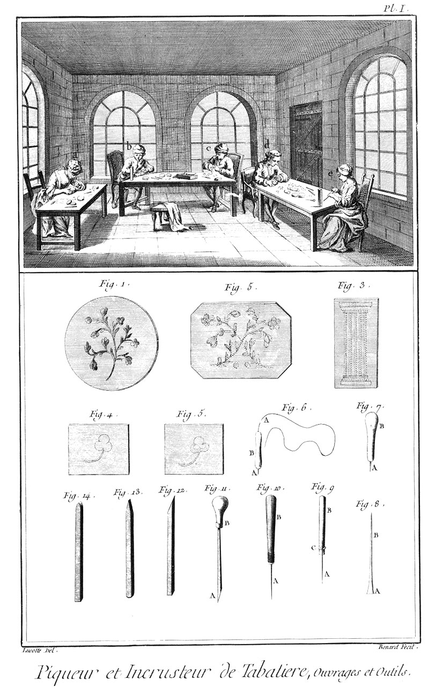
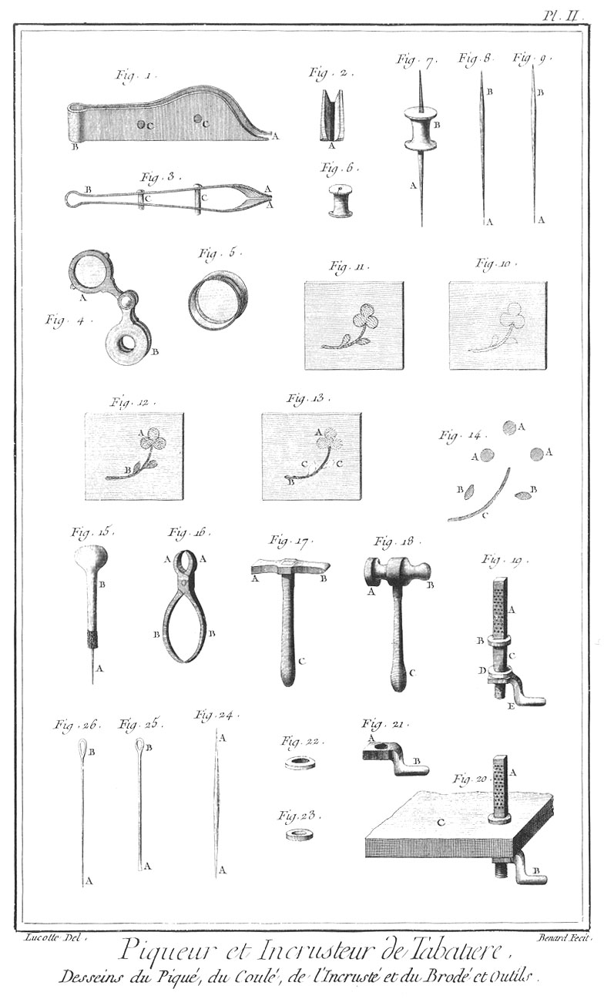

PIQUEUR DE TABATIERES, INCRUSTEUR ET BRODEUR
============================================

Contenant deux Planches. 

PLANCHE Iere.
-------------

Le haut de cette Planche représente un attelier de piqueur de tabatieres, étuis & autres bijoux, où plusieurs ouvriers sont occupés ; l'un en a, au coulé ; un autre en b & une femme en e, au brodé; un autre en c, au piqué; un autre en d, à l'incrusté. Le piqué.

Pour piquer un bijou, il faut avant tout en former le dessein ; le dessein fait, il le faut calquer le plus ordinairement sur une plaque d'écaille ; ainsi fait, on fait un trou à la main avec l'un des perçoirs 9. & 10. le trou fait, on le remplit aussi tôt de la pointe A du fil d'or ou d'argent que l'on coupe plus ou moins saillant selon les saillies que l'on veut donner aux objets de son dessein avec la pince, fig. 1. 2. & 3. Pl. II. Le trou échauffé par la pointe qui le fait, s'agrandit, & après avoir reçu le fil, se resserre sur lui & le tient serré de maniere à ne pouvoir s'échapper. C'est à l'industrie du piqueur de faire rendre les effets qu'il doit attendre de son dessein. Le coulé.

Le coulé se fait en incrustant le fil dans une rainure pratiquée exprès dans l'écaille. Cette rainure s'ouvre en s'échauffant par le travail du burin, fig. 7. & se resserre sur le fil d'or ou d'argent que l'on insere dedans. L'incruste.

L'incrusté se fait par plaque de différentes formes suivant le dessein que l'on place dans le fond d'un moule semblable à ceux des tabletiers. Ces plaques d'or ou d'argent s'incrustent d'elles-mêmes par une pression violente dans l'épaisseur de l'écaille échauffée & disposée à les recevoir. Le brode.

Le brodé n'est autre chose qu'un composé de piqué, de coulé & d'incrusté, réunis & disposés avec art suivant le génie de l'artiste.

Fig.
1. Dessein préparé pour un piqué sur un fond d'écaille.

2. &
3. Autres desseins piqués sur fond d'écaille.

4. Fleur calquée sur fond d'écaille.

5. La même fleur à demi-piquée. 

6. Fil d'or ou d'argent.
	- A, le fil à piquer.
	- B, le canon.

7. Burin à couler.
	- A, le fer.
	- B, le manche.

8. Le même burin démanché.
	- A, le taillant acéré.
	- B, la pointe.

9. Pointe à piquer à manche à coulisse.
	- A, la pointe.
	- B, le manche.
	- C, la coulisse.

10. Autre pointe à piquer.
	- A, la pointe.
	- B, le manche.

11. Burin à grain-d'orge.
	- A, le burin.
	- B, le manche.

12. &
13. &
14. Pierres à polir; la premiere à grain-d'orge, la seconde à ciseau, & la derniere à gouge.

PLANCHE II.
-----------

Fig.
1. Elévation.

2. Coupe.

3. Plan de la pince à couper le fil.
	- A A, les taillans.
	- B, le ressort.
	- C C, les conduits de la pince.

4. Lunette pour voir le travail.
	- A, la lunette
	- B, l'étui.

5. Loupe destinée au même usage que la lunette.

6. Boîte à foret.

7. Foret monté sur sa boîte.
	- A, le foret.
	- B, la boîte.

8. &
9. Différens forets.
	- A A, les perçoirs.
	- B B, les têtes.

10. Dessein calqué sur plaque d'écaille, préparé pour être travaillé.

11. Le même dessein piqué.

12. Le même dessein piqué & coulé.
	- A, le piqué.
	- B, le coulé.

13. Le même dessein piqué, coulé & incrusté.
	- A, le piqué.
	- B, le coulé.
	- C, l'incrusté.

14. Différentes pieces d'or ou d'argent préparées pour être incrustées & former le même dessein.
	- A A A, les fleurs.
	- B B, les feuilles.
	- C, la tige.

15. Pointe à tracer emmanchée.
	- A, la pointe.
	- B, le manche.

16. Pince.
	- A A, les mords.
	- B B, les branches.

17. Marteau.
	- A, la tête.
	- B, la panne.
	- C, le manche.

18. Autre marteau.
	- A, la tête.
	- B, la panne.
	- C, le manche.

19. Support à foret.
	- A, le support.
	- B, l'embase.
	- C, la tige.
	- D, la virole.
	- E, l'écrou à oreille.

20. Le même support monté sur l'établi.
	- A, le support.
	- B, l'écrou à oreille.
	- C, portion de l'établi.

21. Ecrou à oreille.
	- A, l'écrou.
	- B, l'oreille.

22. &
23. Viroles du support.

24. Pointe à tracer l'ouvrage.
	- A A, les pointes.

25. Burin à couler à oeil.
	- A, le burin.
	- B, l'oeil.

26. Pointe à tracer à oeil.
	- A, la pointe.
	- B, l'oeil.

[->](../11-Tabletier-Cornetier/Légende.md)
