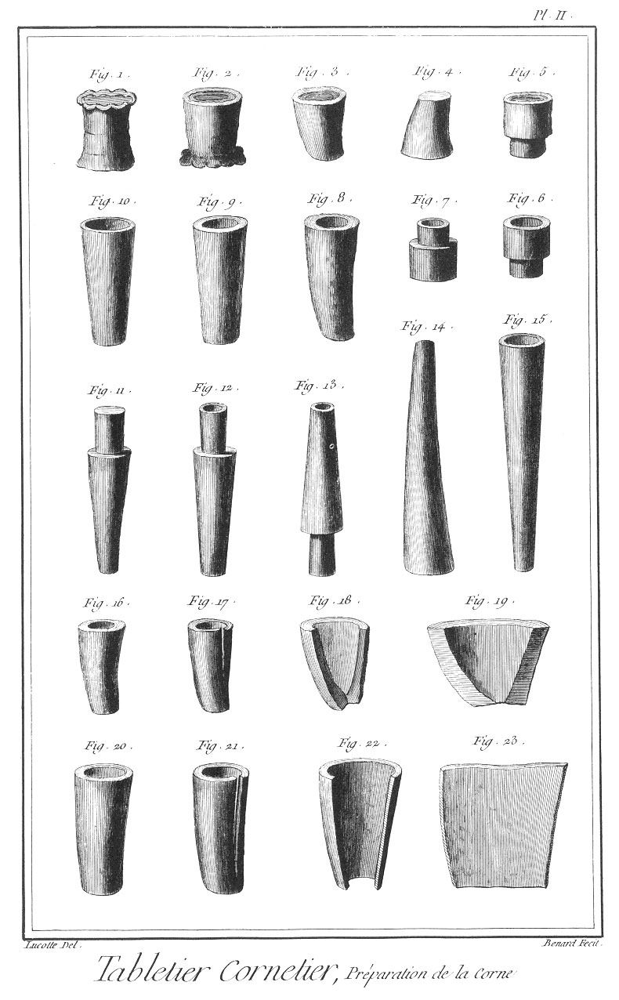

TABLETIER-CORNETIER
===================

Contenant seize Planches. 

PLANCHE Iere.
-------------

Le haut de cette Planche représente l'attelier d'un tabletier-cornetier, où plusieurs ouvriers sont occupés ; l'un en a, à faire chauffer la corne à l'établi ; une ouvriere en b, à faire chauffer la corne à l'âtre ; un autre ouvrier en c, à couper la corne ; un autre en d, à l'ouvrir ; un autre en e, à la mettre en presse à force de coin ; un autre en f, à la presser avec la vis ; un autre en g, à l'emboutir ; & un autre en h, à l'ébaucher à la serpe pour divers ouvrages. Le reste de l'attelier est occupé par divers outils, ustensiles & matériaux propres à la profession du tabletier-cornetier.

Fig.
1. Petite corne.
	- A, la racine.

2. Demi-corne.
	- A, la racine.

3. Corne entiere.
	- A, la racine.

4. Pointe de la corne entiere.

5. &
6. Parties intermédiaires de la corne entiere.

7. Racine de la corne entiere.

8. Pointe de la demi-corne.

9. Partie intermédiaire de la demi-corne.

10. Racine de la demi-corne.

11. Pointe de la petite corne.

12. Racine de la petite corne.

13. Racine de corne creuse.

14. Racine de corne pleine pressée.

PLANCHE II.
-----------

Préparation de la corne.

Fig.
1. Préparation d'une racine de corne.

2. La même racine de corne après avoir été mise en presse.

3. Portion de corne préparée pour un ouvrage.

4. Le même chauffé & dressé.

5. Le même ébauché.

6. &
7. Le même fini vu par les deux bouts.

8. Autre corne disposée pour un cornet de trictrac.

9. La même chauffée & dressée.

10. Le cornet fait & tourné.

11. Autre corne disposée d'autre maniere.

12. &
13. La même faite & vue par chaque bout.

14. Grande corne préparée.

15. La même chauffée, dressée & finie.

16. Bout de corne chauffée & disposée pour des peignes.

17. La même coupée.

18. La même ouverte.

19. La même prête à mettre en presse.

20. Corne chauffée disposée pour des grands peignes.

21. La même coupée.

22. La même ouverte.

23. La même prête à être mise en presse.

PLANCHE III.
------------

Presse à vis.

Fig.
1. &
2. &
3. &
4. &
5. Vue perspective, coupe sur la longueur, coupe en travers, face & plan d'une presse à vis propre à mettre les cornes en presse, lorsqu'elles sont chaudes.
	- A, chassis inférieur.
	- B, chassis intermédiaire.
	- C, chassis supérieur.
	- D, étrier.
	- E, vis.
	- F, coins ou calles.
	- G, plaques.
	- H, cornes.
	- I, barre de conduit.
	- K, boîte de la vis.
	- L, contre-plaque.

6. Chassis inférieur de la presse.
	- A A, longrines extérieures.
	- B B, longrines intérieures.
	- C C, traverses.
	- D D, clés.

7. Forme de l'une des clés. 

8. &
9. Longrines extérieures.
	- A A, les tenons.

PLANCHE IV.
-----------

Fig.
1. Traverse du bas du chassis inférieur.
	- A A, les mortaises.
	- B B, les trous des chevilles.

2. Cheville.

3. Traverse de la tête du chassis inférieur.
	- A A, les trous des chevilles.

4. &
5. Longrines du chassis intermédiaire de la presse à vis.
	- A A, les mortaises des clés.
	- B B, les mortaises des traverses.
	- C C, les embreuvemens.

6. &
7. Longrines du chassis supérieur de la même presse.
	- A A, les mortaises des traverses.
	- B B, les embreuvemens.

8. &
9. Traverses de la tête des deux chassis intermédiaire & supérieur de la même presse.
	- A A, les tenons.
	- B B, les entailles pour placer la boîte de la vis.
	- C C, les talons.

10. Vis.
	- A, la vis.
	- B, la boîte.

11. Vis de la presse.
	- A, la vis.
	- B, la tête.

12. Boîte de la vis.
	- A A, les plaques.

13. &
14. Traverses du bas des deux chassis intermédiaire & supérieur de la même presse.
	- A A, les tenons.
	- B B, les talons.

15. &
16. Petits coins ou calles.
	- A A, les têtes.

17. &
18. Gros coins ou calles.
	- A A, les têtes.

PLANCHE V.
----------

Détails de la presse à vis & presse à coins.

Fig.
1. &
2. Etriers de la presse.
	- A A, les talons.
	- B B, les trous des clous.

3. Plaque.

4. Contre plaque.

5. &
6. Clous pour les étriers.

7. &
8. Morceaux de corne mis en presse.

9. &
10. Coulisses de l'intérieur de la presse.
	- A A, les talons.

11. Petite clé à vis.
	- A, la clé.
	- B, le manche.

12. Grande clé à vis.
	- A, la clé.
	- B, le manche.

13. &
14. &
15. &
16. Elevation perspective, plan, coupe en travers & élévation en face d'une presse à coins:
	- A, le chassis inférieur.
	- B, le chassis supérieur.
	- C C, les coins.
	- D D, les plaques.
	- E E, les cornes en presse.
	- F F, les longrines de fond.

PLANCHE VI.
-----------

Fig.
1. Elévation perspective du chassis inférieur.
	- A A, les longrines extérieures.
	- B, la longrine intérieure.
	- C C, les traverses.
	- D D, les contre traverses.
	- E E, les longrines de fond.
	- F F, les clés.

2. Forme de l'une des clés.

3. Longrine extérieure.
4. Longrine intérieure.
5. autre longrine extérieure de la presse à coins.
	- A A, les mortaises des clés.
	- B B, les mortaises des traverses.
	- C C, les mortaises des contre-traverses.
	- D D, les tenons des traverses.

6. &
7. &
8. &
9. Contre-traverses.
	- A A, les tenons.
	- B B, les talons.

10. &
11. &
12. &
13. Petites longrines du fond.
	- A A, les tenons.

14. &
15. Traverses.
	- A A, les tenons.

16. Plaque.

17. Coin.
	- A, la tête.

PLANCHE VII.
------------

Fig.
	1. Presse simple.
	- A A, les deux supports.
	- B, la semelle du haut.
	- C C, les boulons à anneaux.
	- D D, les petites plaques.
	- E E, les grandes plaques.
	- F, la table.
	- G G, les tréteaux.

2. Semelle de la presse.
	- A A, les pattes.

3. &
4. Les supports faisant l'office de coins.

5. &
6. Boulons à anneaux.
	- A A, les anneaux.
	- B B, les écrous.
	- C C, les vis.

7. Une des vis pour arrêter la table aux tréteaux.

8. Table de la presse.
	- A A, les trous pour l'arrêter aux tréteaux.

9. &
10. &
11. &
12. Grandes & petites plaques de la presse.

13. Un des tréteaux.
	- A, le dessus.
	- B B, les piés.

14. Gril à pié pour chauffer la corne.
	- A A, les barreaux.
	- B B, les côtés à piés.

15. Un des côtés du gril.
	- A A, les piés.

16. Un des barreaux du gril.
	- A A, les rivets.

PLANCHE VIII.
-------------

Fig.
1. Grand gril plat.
	- A A, les bandes.
	- B B, les barreaux.

2. Une des bandes.
	- A A, &c. les trous.

3. Un des barreaux du gril plat.
	- A A, les goujons.

4. Petit gril.
	- A A, les bandes.
	- B B, les barreaux.

5. Une des bandes.
	- A A, les trous.

6. Un des barreaux.
	- A A, les goujons.

7. Tenailles droites.

8. Tenailles à crochet.

9. Tenailles à crochets ronds.

10. Tenailles roulées.

11. Tenailles à crochets renversés.
	- A A, les mords.
	- B, la charniere.
	- C C, les branches.

12. &
13. Mord & contre-mord de l'une des tenailles.
	- A A, les crochets.
	- B B, les trous du rivet.
	- C C, les branches.

14. &
15. &
16. Différentes serpes.
	- A A, &c. les fers.
	- B B, &c. les manches.

PLANCHE IX.
-----------

Fig.
1. &
2. Pelles à tirer les cornes de la bouilloire.
	- A A, les trous pour l'écoulement de l'eau.
	- B B, les manches.

3. Cuillere destinée au même usage.
	- A, la cuillere.
	- B, le manche.

4. &
5. Gros & petit maillets.
	- A A, les maillets.
	- B B, les manches.

6. &
7. Grosse & petite masses.
	- A A, les masses.
	- B B, les manches.

8. &
9. &
10. &
11. Poinçons à emboutir de diverses grosseurs.
	- A A, &c. les poinçons.
	- B B, &c. les têtes.

12. &
13. &
14. &
15. Broches de diverses grosseurs destinées aux mêmes usages.
	- A A, les broches.
	- B B, les têtes.

16. Pleine simple.
	- A, le fer.
	- B B, les manches.

17. Pleine à biseau & coudée.
	- A, le fer.
	- B B, les coudes.
	- C C, les manches.

18. Pleine à biseau & ceintrée.
	- A, le fer ceintré.
	- B B, les manches.

19. &
20. Trépans de plusieurs grosseurs.
	- A A, les taillans.
	- B B, les têtes.

21. &
22. Mêches de plusieurs grosseurs.
	- A A, les mêches.
	- B B, les têtes.

23. Trépan monté sur son fût de vilebrequin.
	- A, le fût de vilebrequin.
	- B, la poignée.
	- C, le manche.
	- D, le quarré.
	- E, la vis.
	- F, le trépan.

24. Vis du fût de vilebrequin.
	- A, la vis.
	- B, la tête.

PLANCHE X.
----------

Fig.
1. Bouilloire plate à faire bouillir la corne.
	- A, l'anse.
	- B B, les oreillons.

2. Marmite propre au même usage.
	- A, l'anse.
	- B B, les oreillons.
	- C C C, les piés.

3. Petite bouilloire propre au même usage.
	- A, l'anse.
	- B B, les oreillons.

4. Bouilloire creuse propre aussi au même usage.
	- A, l'anse.
	- B B, les oreillons.

5. Trépié rond.
	- A, le cercle.
	- B B, &c. les piés.

6. Trépié triangulaire.
	- A, le triangle.
	- B B, &c. les piés. 

7. Quatre-pié.
	- A, le quarré.
	- B B, &c. les pointes pour soutenir la bouilloire.
	- C C, &c. les piés.

8. &
9. &
10. Différentes battes pour frapper sur les serpes & couper la corne.
	- A A, &c. les manches.

11. Gros billot.

12. Demi-billot.

13. Petit billot à pointe; c'est souvent une bûche appointie.

14. Billot à emboutir.
	- A A, ouvrages en cornes embouties.
	- B B, &c. broches & poinçons.

PLANCHE XI.
-----------

Fig.
1. Banc à travailler la corne.
	- A, la table.
	- B, le pié.

2. Coupe de la table du banc.

3. Table du banc.
	- A A, les trous du pié.

4. Piés du banc.
	- A A, les pattes.
	- B, la traverse.

5. Autre banc à travailler la corne.
	- A, la table.
	- B B, les piés.
	- C, la contre-table.
	- D, le support de la contre-table.
	- E, la manivelle.

6. &
7. Piés de la table du banc.
	- A A, les pattes.
	- B B, les traverses.

8. Elévation perspective.
9. Plan de la contre-table du banc.
	- A, la patte.
	- B, le support.
	- C, la lumiere.

10. Boulon de la manivelle.
	- A, la tête.
	- B, la tige.

11. Estomac.
	- A, la queue.
	- B, le billot.
	- C, la plaque.

12. Manivelle du banc.
	- A, la tête.
	- B, la tige.
	- C, la broche.

13. Broche de la manivelle du banc.

14. &
15. Paniers & mannes à contenir les cornes.

PLANCHE XII.
------------

Fig.
1. &
2. Gros peignes appellés démêloirs, le premier droit & l'autre ceintré.

3. Coupe des peignes.

4. &
5. Peignes à deux rangs, l'un droit & l'autre ceintré par les bouts.

6. Coupe des peignes.

7. &
8. Peignes à chignons ceintrés par leurs plans.

9. Coupe des peignes.

10. Gros peigne à queue.
	- A, le peigne.
	- B, la queue.

11. Coupe du peigne à queue.

12. Petit peigne à queue.
	- A, le peigne.
	- B, la queue.

13. Coupe du peigne à queue.

14. Peigne à deux fins à dos plat.

15. Coupe du peigne à deux fins à dos plat.

16. Peigne à deux fins à dos rond.

17. Coupe du peigne à deux fins à dos rond.

PLANCHE XIII.
-------------

Fig.
1. Premiere opération d'un peigne, la corne sortant de la presse dressée sur ses surfaces.

2. Deuxieme opération du peigne, la même corne formée en peigne avec ses biseaux.
	- A A, les biseaux.

3. Troisieme opération du peigne.
	- A A, les dents sciés.

4. Quatrieme & derniere opération du peigne terminé.

5. Disposition de la scie à fendre les dents du peigne.
	- A, profil d'un peigne.
	- B, la lame de la scie.
	- C, le manche.

6. Manche de la scie à fendre.
	- A, la mortaise de la lame.
	- B B, les lumieres.

7. Scie à refendre.
	- A, le fer.
	- B B, les sabots.
	- C C, les traverses.
	- D D, les bras.
	- E, la broche.

8. Bras de la scie.
	- A A, les tenons.

9. Fer de la scie.

10. Autre bras de la scie.
	- A A, les tenons.

11. Sabot du haut de la scie.
	- A, la lumiere.
	- B, la mortaise de la scie.
	- C, le trou de la broche.

12. Sabot du bas de la scie.
	- A, la lumiere.
	- B, la mortaise de la scie.

13. Clé du sabot du haut de la scie.

14. Broche du sabot.

15. Traverse du haut de la scie.

16. Traverse du bas de la scie.
	- A A, les mortaises.

PLANCHE XIV.
------------

Fig.
1. Scie tournante.
	- A, le fer.
	- B B, les bras.
	- C, la traverse.
	- D, la corde.
	- E, le garrot.
	- F, le tourret du haut.
	- G, le manche à tourret.

2. Traverse de la scie.
	- A A, les tenons.

3. Bras de la scie.
	- A, la lumiere.
	- B, la mortaise.
	- C, le crochet.

4. Manche à tourret de la scie.
	- A, le manche.
	- B, le tourret.

5. Tourret du haut de la scie.

6. Autre bras de la scie.
	- A, la lumiere.
	- B, la mortaise.
	- C, le crochet.

7. Fer de la scie.

8. Petite scie tournante en fer.
	- A, le fer.
	- B, le chassis.
	- C, le tourret du haut.
	- D, le manche à tourret.

9. Tourret du haut de la petite scie tournante.
	- A, la moufle.
	- B, la vis.
	- C, l'écrou à oreille.

10. Chassis de la petite scie tournante.
	- A A, les lumieres.

11. Manche à tourret.
	- A, la moufle.
	- B, le manche.

12. Fer de la scie.

13. Grande scie tournante.
	- A, le fer.
	- B, le chassis.
	- C, le tourret du haut.
	- D, le manche à tourret.

14. Chassis de la grande scie tournante.
	- A A, les lumieres.

15. Fer de la scie.

16. Tourret du haut de la scie.
	- A, la moufle.
	- B, la vis.
	- C, l'écrou.

17. Manche à tourret.
	- A, le tourret.
	- B, le manche.

18. Grande quarrelette à limer la corne.
	- A, la lime.
	- B, le manche.

19. Grande demi-ronde.
	- A, la lime.
	- B, le manche.

20. Petite quarrelette.
	- A, la lime.
	- B, le manche.

21. Petite demi-ronde.
	- A, la lime.
	- B, le manche.

22. Petite queue-de-rat.
	- A, la lime.
	- B, le manche.

23. Petite lime quarrée.
	- A, la lime.
	- B, le manche.

24. Petit tiers-point.
	- A, la lime.
	- B, le manche.

PLANCHE XV.
-----------

Fig.
1. Elévation perspective.

2. Plan du tour de tabletier-cornetier.
	- A A, les jumelles de l'établi.
	- B B, &c. les piés.
	- C C, les traverses.
	- D, la poupée à pointe à écrou.
	- E, la poupée à pointe à vis.
	- F, la poupée à lunette.
	- G G, les clés.
	- H H, les supports.
	- I I, les vis des supports.
	- K, la barre de support.
	- L, l'arbre du tour.
	- M, la corde.
	- N, la perche.
	- O, le marchepié.

3. Bouton de culotte en corne préparé.

4. Bouton de culotte en corne fait. 

5. &
6. Jumelles de l'établi du tour.
	- A A, les mortaises.

7. Entretoise de l'établi.
	- A A, les tenons.

8. Arbre du tour.
	- A, la boîte.
	- B, l'arbre.
	- C, le bouton préparé.

9. Boîte de l'arbre.

10. Arbre.
	- A, la pointe de la boîte.
	- B, la pointe entrant dans la corne.

11. Morceau de corne préparé.

PLANCHE XVI.
------------

Fig.
1. Poupée à pointe à écrou.
	- A, la poupée.
	- B, la vis.
	- C, la lumiere du support.
	- D, la lumiere de la clé.

2. Poupée à pointe à vis.
	- A, la poupée.
	- B, la vis.
	- C, la lumiere du support.
	- D, la vis du support.
	- E, la lumiere de la clé.

3. Pointe à écrou.
	- A, la pointe.
	- B, l'écrou.
	- C, la vis.

4. Pointe à vis.
	- A, la pointe.
	- B, la vis.
	- C, la tête.

5. &
6. Clés des poupées.

7. &
8. Supports.
	- A A, les talons.

9. Barre de support.

10. &
11. Vis des supports.
	- A A, les têtes.

12. Poupée à lunette.
	- A, la poupée.
	- B, la lumiere de la clé.
	- C, la lunette.
	- D, le T.
	- E, l'écrou.

13. Poupée à lunette.
	- A, la poupée.
	- B, la lumiere de la clé.
	- C, la lumiere du T.

14. Petite lunette.
	- A, la fourche.

15. Grande lunette.
	- A, la fourche.

16. T de la poupée à lunette.
	- A, le T.
	- B, la vis.
	- C, l'écrou.

17. Perche.

18. Marchepié du tour.
	- A, la fourche pour le passage de la corde.
	- B, la tige.
	- C C, les branches.
	- D, la traverse.

19. Boulon de la traverse à supporter la perche.
	- A, la tête.
	- B, la vis.
	- C, l'écrou.

20. Tire-fond à fixer la perche.
	- A, la tête.
	- B, la vis.

21. Traverse à supporter la perche.
	- A A, les pattes.

22. Grande gouge à tourner.
	- A A, le taillant,
	- B, le manche.

23. Petite gouge à tourner.
	- A, le taillant.
	- B, le manche.

24. Ciseau à tourner.
	- A, le taillant.
	- B, le manche.

25. Bec-d'ane à tourner.
	- A, le taillant.
	- B, le manche.

26. Grain-d'orge à tourner.
	- A, le taillant.
	- B, le manche.

[->](../12-Tabletier/Légende.md)
