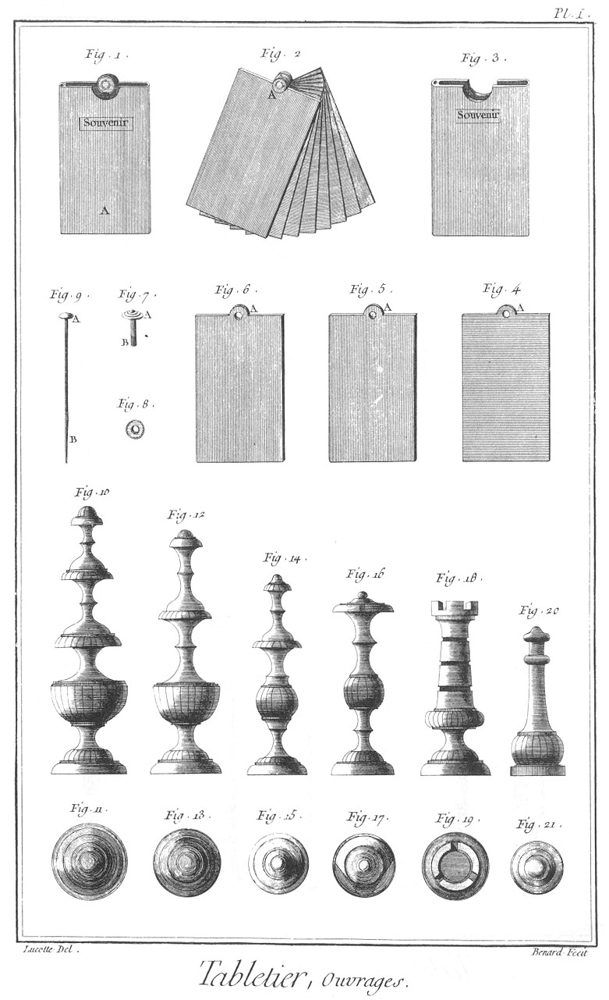
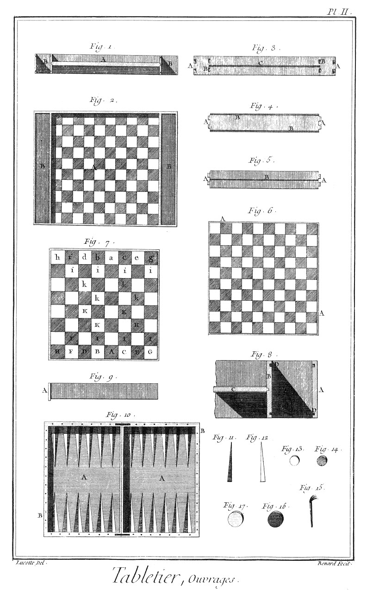
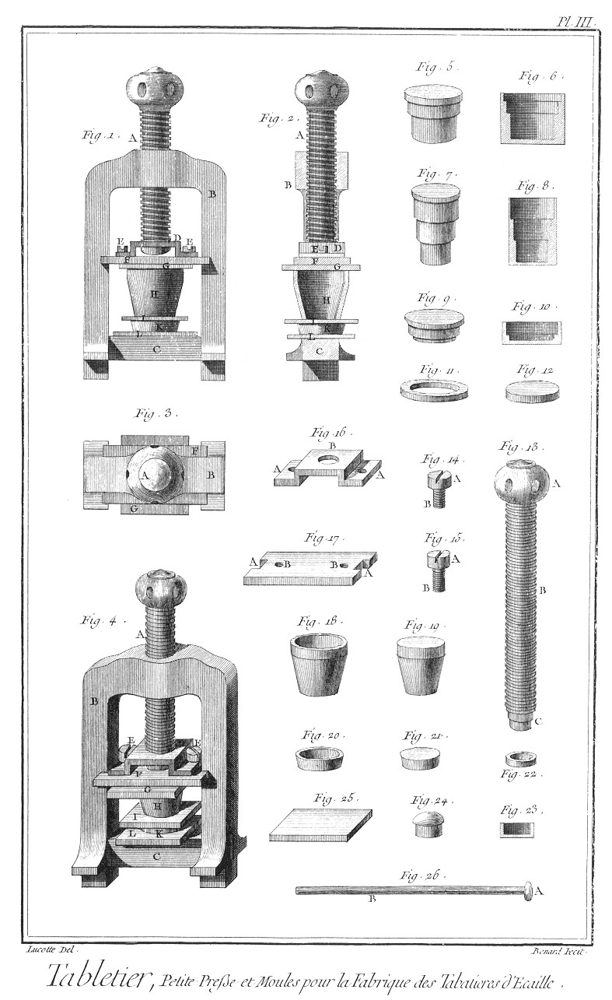
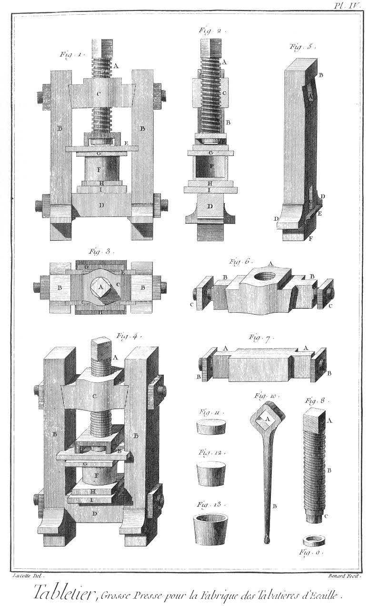

TABLETIER
=========

Contenant quatre Planches. 

PLANCHE Iere.
-------------

Fig.
1. Souvenir.
	- A, l'étui.
	- B, les tablettes.

2. Tablettes en ivoire.
	- A, la charniere.

3. Etui du souvenir.

4. Tablette du souvenir.
	- A, la charniere.

5. &
6. Tablettes premieres du souvenir.
	- A A, les charnieres.

7. Clou à vis de la charniere du souvenir.
	- A, la tête.
	- B, la vis.

8. Ecrou du clou du souvenir.

9. Aiguille du souvenir.
	- A, la tête.
	- B, la pointe. Pieces du jeu d'échecs.

10. &
11. Elévation & place du roi.

12. &
13. Elévation & place de la dame.

14. &
15. Elévation & place d'un cavalier.

16. &
17. Elévation & place d'un fou.

18. &
19. Elévation & place d'une tour.

20. &
21. Elévation & place d'un pion.

PLANCHE II.
-----------

Fig.
1. &
2. Coupe & plan d'un damier d'assemblage.
	- A, le damier.
	- B B, les cases à contenir les dames.

3. L'une des pieces latérales du damier.
	- A A, les queues d'aronde d'assemblage.
	- B B, les mortaises des traverses.
	- C, la rainure pour porter le damier.

4. Traverse du damier vue du côté des coulisses.
	- A A, les tenons.
	- B B, les rainures des coulisses.

5. La même traverse vue du côté du damier.
	- A A, les tenons.
	- B, la rainure du damier.

6. La table du damier vue du côté appellé polonnois, pour le jeu des dames dites à la polonnoise.
	- A A, les languettes pour le faire tenir dans les traverses.

7. La même table du damier vue du côté appellé françois, pour le jeu des dames à la françoise, servant aussi au jeu d'échecs, d'un côté blanc & de l'autre noir.
	- A, place du roi.
	- B, place de la dame.
	- C, place du fou du roi.
	- D, place du fou de la dame.
	- E, place du cavalier du roi.
	- F, place du cavalier de la dame.
	- G, place de la tour du roi.
	- H, place de la tour de la dame.
	- I I, &c. places des pions prenant le nom de celui devant qui ils sont placés, comme pions du roi, de la dame, du fou du roi, du fou de la dame, &c. Les cases
	- K K portent aussi le nom de ceux devant qui elles sont placées, comme premiere, deuxieme, troisieme & quatrieme case du roi, de la dame, du fou du roi, du fou de la dame, &c.

8. Coupe en grand de l'une des cases à contenir les dames à jouer.
	 - A, la traverse extérieure.
	 - B, la traverse intérieure.
	 - C, portion de la tablette du damier.
	 - D D, rainures des coulisses.

9. L'une des quatre coulisses des cases à contenir les dames à jouer.
	- A, le talon.

10. Jeu de trictrac.
	- A A, l'intérieur du jeu.
	- B B, les parties latérales où se comptent les trous.

11. &
12. Deux moitiés de pyramides, l'une en blanc & l'autre en noir, incrustées sur le jeu sur lesquelles se posent les dames. 

13. &
14. Dames du jeu de dames.

15. L'une des fiches servant à compter les trous.

16. &
17. Dames du jeu de trictrac.

PLANCHE III.
------------

Fig.
1. Elévation géométrale.

2. Coupe.

3. Plan.

4. Elévation perspective de la petite presse pour la fabrique des tabatieres d'écaille.
	- A, la vis.
	- B, le chassis.
	- C, la traverse.
	- D, le crampon.
	- E E, les vis.
	- F, la coulisse.
	- G, la plaque supérieure.
	- H, le moule.
	- I, la plaque intermédiaire.
	- K, le contre-moule.
	- L, la plaque inférieure.

5. &
6. &
7. &
8. &
9. &
10. Différens noyaux & moules.

11. Virole pour exhausser le noyau d'un moule pour faire un fond épais.

12. Rondelle pour placer sous le noyau d'un moule pour faire le fond mince.

13. Vis.
	- A, la tête.
	- B, la vis.
	- C, le goujon.

14. &
15. Vis du crampon de la plaque à coulisse.
	- A A, les têtes.
	- B B, les vis.

16. Crampon de la plaque à coulisse.
	- A A, les pattes.
	- B, le trou de la vis.

17. Plaque à coulisse.
	- A A, les entailles.
	- B B, les trous des vis du crampon.

18. Moule à tabatiere.

19. Noyau du moule à tabatiere.

20. Contre moule à tabatiere.

21. Noyau du contre-moule à tabatiere.

22. Contre-rivure de la vis.

23. &
24. Petit moule & noyau.

25. L'une des plaques.

26. Levier ou manivelle de la vis.
	- A, le bouton.
	- B, la tige.

PLANCHE IV.
-----------

Fig.
1. Elévation géométrale.

2. Coupe.

3. Plan.

4. Elévation perspective de la grosse presse pour la fabrique des tabatieres d'écaille.
	- A, la vis.
	- B B, les jumelles.
	- C, la traverse supérieure.
	- D, la traverse inférieure.
	- E, la coulisse.
	- F, le moule.
	- G, la plaque supérieure.
	- H, la plaque inférieure.
	- I, la contre-plaque.

5. L'une des deux jumelles.
	- A, la mortaise de la traverse supérieure.
	- B, le talon,
	- C, la mortaise de la traverse inférieure.
	- D D, les embases.
	- E, le talon.
	- F, le goujon entrant dans la plaque de l'établi.

6. Traverse supérieure.
	- A, l'écrou.
	- B B, les tenons.
	- C C, les vis à écrou.

7. Traverse inférieure.
	- A A, les tenons.
	- B B, les vis à écrou.

8. Vis de la presse.
	- A, la tête quarrée.
	- B, la vis.
	- C, le goujon.

9. Contre-rivure de la vis.

10. Clé de la vis.
	- A, le quarré.
	- B, la queue.

11. Contre-noyau du moule.

12. Noyau du moule.

13. Moule creux.

[->](../13-Taillandier/Légende.md)
