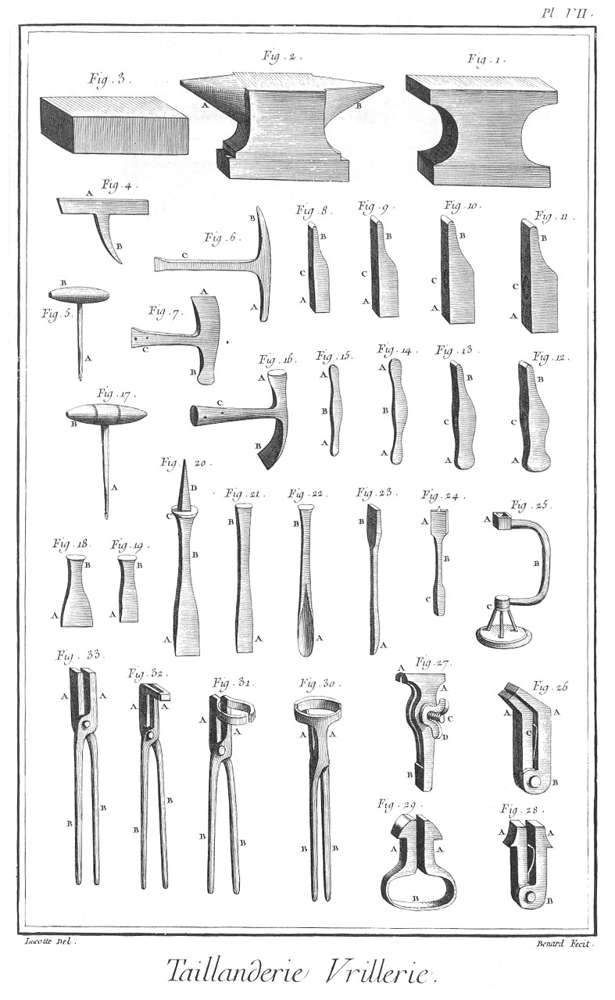

TAILLANDIER
===========

Contenant avec la fabrique des étaux, douze Planches. 

PLANCHE Iere.
-------------

Le haut de cette Planche représente un attelier de taillandier où plusieurs ouvriers sont occupés à divers ouvrages de cet art. Les uns en a, à faire mouvoir les soufflets de la grande forge ; un en b, à tourner & retourner l'ouvrage sur l'enclume ; un en c, à poser une mise pour la faire souder ; deux autres en d & en e, à frapper dessus ; & un autre en f, à tailler des limes. Près de-là en g est une forge ; en h, une enclume, en i un baquet, en k k des outils, & en l une potence pour aider au transport des ouvrages de la forge à l'enclume, & de l'enclume à la forge. Le reste de l'attelier est semé de quantité d'ouvrages & outils relatifs à cette profession. Façon d'une enclume.

Fig.
1. Masse de fer propre à faire une enclume.
	- A, le trou de la barre pour la tenir.

2. La même masse montée.
	- A, la masse.
	- B, la barre.
	- C, le rouleau de bois.

3. Barre.
	- A, le côté qui entre dans le trou de la masse.
	- B, la pointe qui entre dans le rouleau.

4. Rouleau.
	- A A, &c. les cercles.
	- B B, les trous de la manivelle.

5. Manivelle du rouleau de fer.

6. Mise de fer pour grossir la masse.
	- A, la mise.
	- B, la barre pour la tenir.

7. Masse à laquelle est soudée la mise de fer.
	- A, la masse.
	- B, la mise.
	- C, la barre.

8. Bigorne prête à souder à la masse.
	- A, la bigorne.
	- B, la barre.

9. Masse de fer où est soudée la bigorne.
	- A, la masse.
	- B, la bigorne.
	- C, partie de la barre.

10. Masse où sont soudées deux bigornes.
	- A, la masse.
	- B B, les bigornes.
	- C, le trou de la barre.

11. Plateau pour être soudé sous l'enclume.
	- A, le plateau.
	- B, la barre.

12. Masse prête à souder au plateau.
	- A, la masse.
	- B B, les bigornes.
	- C, le trou de la barre.

13 Mise d acier pour être soudée sur la surface de l'enclume.
	- A, la mise.
	- B, la barre pour la tenir.

14. Enclume ébauchée.
	- A, la masse.
	- B B, les bigornes.
	- C, le plateau.

PLANCHE II.
-----------

Façon d'une bigorne.

Fig.
1. Gros courçon.
	- A, la masse du courçon.
	- B, la pointe.
	- C, la barre pour la tenir.

2. Masse du courçon à laquelle est soudée la virole servant d'embase.
	- A, la masse.
	- B, la virole.
	- C, la barre.

3. Virole tournée prête à souder à la masse du cour- çon.

4. Serre de fer pour être placée dans le joint de la virole & l'aider à souder.

5. Masse du courçon refoulée & préparée à être soudée à deux bigornes.
	- A, la masse.
	- B, la partie refoulée.
	- C, la virole soudée.
	- D, la barre.

6. Masse a laquelle est soudée une bigorne.
	- A, la masse.
	- B, la bigorne.
	- C, la virole.
	- D, la pointe.

7. Bigorne prête à souder à la masse.
	- A, la bigorne.
	- B, la barre pour la tenir.

8. Mise d'acier pour être soudée sur la surface de la bigorne.
	- A, la mise.
	- B, la barre.

9. Bigorne ébauchée.
	- A, la masse.
	- B B, les deux bigornes.
	- C, l'embase.
	- D, la pointe.

Façon d'un marteau.

10. Masse de marteau.
	- A, le coté de la tête.
	- B, côté de la panne.

11. Plateau d'acier prêt à être soudé à la tête du marteau.
	- A A, les crocs.

12. Masse du marteau à laquelle est soudé le plateau d'acier.
	- A, le côté de la tête.
	- B, le côté de la panne.

13. Masse du marteau préparée pour y souder le plateau à la panne.
	- A, la tête.
	- B, la panne.

14. Plateau d'acier prêt à être soudé à la panne du marteau.
	- A A, les crocs.

15. Masse du marteau à laquelle sont soudés les deux plateaux d'acier.
	- A, la tête.
	- B, la panne.

16. Masse du marteau à laquelle est percé l'oeil.
	- A, la tête.
	- B, la panne.
	- C, l'oeil.

17. Masse du marteau à laquelle l'oeil est équarri.
	- A, la tête.
	- B, la panne.
	- C, l'oeil.

Façon d'une serpe.

18. Serpe ébauchée préparée à recevoir l'acier.
	- A, la masse.
	- B, la pointe.
	- C, la fente.

19. Serpe ébauchée garnie de sa lame d'acier.
	- A, la masse.
	- B, la pointe.
	- C, la lame d'acier.

20. Serpe faite.
	- A, la serpe.
	- B, la pointe.

21. Lame d'acier.

Façon d'une coignée.

22. Morceau préparé pour la douille d'une coignée.
	- A, le corps.
	- B B, les pattes.

23. Douille de la coignée faite.
	- A, la douille.
	- B, la patte pour être soudée au tranchant de la coignée.

24. Côté du tranchant de la coignée préparé.
	- A, la masse.
	- B, l'acier.

25. Morceau d'acier préparé pour faire le tranchant de la coignée.

26. Serre de fer préparée pour être soudée entre les deux pattes.

Façon d'une besaiguë.

27. Morceau d'acier préparé pour faire le tranchant du bec-d'âne d'une besaiguë.

28. Besaiguë ébauchée.
	- A, côté du bec-d'âne.
	- B, le morceau d'acier.
	- C, côté du ciseau.
	- D, le morceau d'acier.
	- E, le billot préparé pour y souder la douille servant de manche.

29. Rouleau pour être soudé au bout de la douille.

30. Morceau de fer préparé pour faire la douille.

31. La douille faite.
	- A, le côté plein.
	- B, le côté vuide.

32. Morceau d'acier préparé pour faire le tranchant du ciseau de la besaiguë.

PLANCHE III.
------------

Façon d'une cisaille.

Fig.
1. Cisaille ébauchée.
	- A, le côté du tranchant.
	- B, le côté du manche.

2. Cisaille préparée à recevoir l'acier.
	- A, la côté du tranchant fendu.
	- B, le côté du manche.

3. Cisaille ébauchée garnie de sa lame d'acier.
	- A, le côté du tranchant.
	- B, le côté du manche.
	- C, la lame d'acier.

Façon d'une planne.

4. Planne ébauchée.
	- A, la planne.
	- B, la fente prête à recevoir l'acier.

5. Planne ébauchée garnie de sa lame d'acier.
	- A, la planne.
	- B, la lame d'acier.

6. Lame d'acier.

7. Planne faite.
	- A, le tranchant.
	- B B, les pointes pour être emmanchées.

Façon d'une filiere.

8. Filiere ébauchée.
	- A, la filiere.
	- B B B, les grains d'acier.
	- C C, les manches.

9. Grain d'acier préparé pour être soudé à la filiere.

Façon d'un tarau.

10. Tarau ébauché.
	- A, la tête.
	- B, la virole d'acier prête à souder.

11. Virole d'acier préparée à être soudée au tarau.

12. Tarau fait.
	- A, la tête.
	- B, la partie pour faire la vis. Façon d'un tas rond.

13. Masse de fer cylindrique préparée pour un tas.

14. Grain d'acier pour être soudé sur la surface du tas.
	- A A, les crocs.

15. Tas fait.
	- A, le tas.
	- B, l'acier soudé.
	- C, la pointe.

Façon d'un tas quarré.

16. Masse de fer préparée pour un tas.

17. Grain d'acier pour être soudé sur la surface du tas.
	- A A, les crocs.

18. Tas fait.
	- A, le tas.
	- B, l'acier soudé.
	- C, la pointe.

Façon de triquoises.

19. & 20. Les deux branches des triquoises ébauchées.
	- A A, les mords.
	- B B, les branches.

21. Morceau d'acier préparé pour être soudé à l'un des mords des triquoises.

22. &
23. Les deux branches des triquoises préparées à être garnies d'acier.
	- A A, les mords.
	- B B, les morceaux d'acier.
	- C C, les branches.

24. Branche de triquoises faite.
	- A, le mord.
	- B, l'oeil.
	- C, la branche.

Façon d'un étau.

25. Masse de fer préparée pour faire une jumelle d'étau.
	- A, le côté du mord.
	- B, la tige.
	- C, la partie de la barre pour le tenir.

26. Seconde opération de la jumelle.
	- A, le mord.
	- B, la porte-limaille.
	- C, l'oeil fendu.
	- D, la tige.
	- E, la partie de la barre.

27. Troisieme opération de la jumelle.
	- A, le mord.
	- B, la lame d'acier soudée.
	- C, la porte-limaille.
	- D, l'oeil agrandi.
	- E, la tige.
	- F, partie de la barre.

28. Jumelle faite.
	- A, le mord.
	- B, la porte limaille.
	- C, l'oeil.
	- D, la tige.
	- E E, les entailles des platines.
	- F, la partie de la barre.

29. Portion de la jumelle mobile.
	- A, la tige.
	- B, le tenon.
	- C, le trou du boulon.

30. Grain d'acier prêt à souder à l'un des mords de l'étau.
	- A A, les crocs.

31. &
32. Platines de la jumelle immobile.
	- A A, les épieux d'aronde.
	- B B, les trous du boulon.

PLANCHE IV.
-----------

OEuvres blanches.

Fig. 1. Besaiguë.
	- A, le bec-d'âne.
	- B, le ciseau.
	- C, la tige.
	- D, la douille servant de manche.

2. Coignée.
	- A, le taillant.
	- B, la douille.

3. Herminette à marteau.
	- A, le taillant.
	- B, la tête.
	- C, l'oeil.

4. Hachette.
	- A, le taillant.
	- B, la tête.
	- C, l'oeil.

5. Herminette à gouge.
	- A A, les taillans.
	- B, l'oeil.

6. Herminette simple.
	- A, le taillant.
	- B, la tête.

7. Ciseau.
	- A, le taillant.
	- B, la tête.

8. Gouge.
	- A, le taillant.
	- B, la tête.

9. Gouge quarrée.
	- A, le taillant.
	- B, la tête. 

10. Rainette.
	- A, le traer.
	- B, celui pour donner de la voie aux scies.

11. Plantoir.
	- A, la tête.
	- B, la pointe.

12. Hache.
	- A, le taillant.
	- B, l'oeil.

13. Scie de maçon.
	- A A, les yeux.

14. Scie de menuisier.
	- A A, les yeux.

15. Scie à main.
	- A, la scie.
	- B, la pointe.

16. Planne.
	- A, le taillant.
	- B B, les pointes coudées.

17. Tarriere.
	- A, la tarriere.
	- B, la tête.
	- C, la tige.

18. Serpe.
	- A, le taillant.
	- B, le dos.
	- C, la pointe.

19. Serpette.
	- A, le taillant.
	- B, le dos.
	- C, la pointe.

20. Faux à bras.
	- A, le taillant.
	- B, le dos.
	- C, le bras.
	- D, le talon.

21. Faux à douille.
	- A, le taillant.
	- B, le dos.
	- C, la douille.

22. Faucille.
	- A, le taillant.
	- B, le dos.
	- C, la pointe.

23. Faucille à scie.
	- A, la scie.
	- B, le dos.
	- C, la pointe.

24. Petite faucille.
	- A, le taillant.
	- B, le dos.
	- C, la pointe.

PLANCHE V.
----------

OEuvres blanches.

Fig.
1. Houe à deux branches.
	- A A, les branches.
	- B, la tête.

2. Raclette.
	- A, le taillant,
	- B, la tête.

3. Hoyau.
	- A, le taillant.
	- B, la tête.

4. Houe simple.
	- A, le taillant.
	- B, la tête.

5. Sarcle.
	- A, le taillant.
	- B, la tête.

6. Crochet.
	- A A, les pointes.
	- B, la tête.

7. Maille.
	- A, la pointe.
	- B, la tête.

8. Beche.
	- A, le tranchant.
	- B, la douille.

9. Petite serpe.
	- A, le taillant.
	- B, le dos.
	- C, la pointe.

10. Petite serpette.
	- A, le taillant.
	- B, le dos.
	- C, la pointe.

11. Grand couteau à scie.
	- A A, les dents.
	- B, le dos.
	- C, la pointe.

12. Petit couteau à scie.
	- A A, les dents.
	- B, le dos.
	- C, la pointe.

13. Ratissoire à tirer.
	- A, la platine.
	- B, la douille.

14. Ratissoire à pousser.
	- A, la platine.
	- B, la douille.

15. Croissant.
	- A, le taillant.
	- B, le dos.
	- C, la douille.

16. Pioche pointue.
	- A, la pointe.
	- B, la douille.

17. Pioche plate.
	- A, le taillant.
	- B, la douille.

18. Pioche longue.
	- A, le taillant.
	- B, la douille.

19. Ciseaux de jardinier.
	- A A, les mords.
	- B B, les branches.
	- C C, les pointes.

20. Echenilloir.
	- A A, les mords.
	- B, la branche à anneau.
	- C, la branche à douille.
	- D, la douille.
	- E, le crampon.
	- F, le ressort.

21. Déplantoir.
	- A, le taillant.
	- B, la douille.

22. Grande pointe de plantoir.
	- A, la pointe.
	- B, la douille.

23. Petite pointe de plantoir.
	- A, la pointe.
	- B, la douille.

24. Outil à écraser les limaçons.
	- A A, les branches.
	- B, le ressort.

25. Binette.
	- A A, les pointes.
	- B, le taillant.
	- C, l'oeil.

26. Marteau à planne.
	- A A, les têtes acérées.
	- B, l'oeil.

27. Marteau à têtes rondes.
	- A A, les têtes acérées.
	- B, l'oeil.

28. Marteau à retreindre.
	- A, la tête.
	- B, la panne.
	- C, l'oeil.

29. Tas d'étau.
	- A, la tête acérée.
	- B, le tenon à talon.

30. Tas rond de l'étau.
	- A, la tête acérée.
	- B, le trou à talon.

31. Bigorne d'étau.
	- A, la tige.
	- B, la bigorne ronde.
	- C, la bigorne quarrée.
	- D, le tenon à talon.

32. Doloire.
	- A, la pointe.
	- B, le manche.

PLANCHE VI.
-----------

Vrillerie.

Fig.
1. Carreau.
	- A, le carreau.
	- B, la pointe.

2. Demi-carreau.
	- A, le demi-carreau.
	- B, la pointe.

3. Quarrelette.
	- A, la quarrelette.
	- B, la pointe.

4. Demi ronde.
	- A, la demi-ronde.
	- B, la pointe.

5. Lime à potence.
	- A, la lime.
	- B, la pointe.

6. Tiers-point.
	- A, le tiers point.
	- B, la pointe.

8. Queue-de-rat.
	- A, la queue-de-rat.
	- B, la pointe.

8. Filiere.
	- A A, les trous de la filiere.
	- B B, les branches.

9. Tourne-à-gauche.
	- A, le trou.
	- B B, les branches.

10. &
11. Taraux.
	- A A, les taraux.
	- B B, les têtes.

12. Burin.
	- A, le taillant.
	- B, la tête.

13. Bec-d'âne.
	- A, le taillant.
	- B, la tête.

14. Langue-de-carpe.
	- A, le taillant.
	- B, la tête.

15. & 16. Forets.
	- A A, les taillans.
	- B B, les têtes.

17. Fraise à pan.
	- A, la fraise.
	- B, la tête.

18. Fraise ronde.
	- A, la fraise.
	- B, la tête.

19. Cisailles.
	- A A, les mords.
	- B B, les branches.

20. Cisoirs.
	- A A, les mords.
	- B, la branche supérieure.
	- C, la branche inférieure.

21. Pointeau.
	- A, le pointeau acéré.
	- B, la tête.

22. Poinçon plat.
	- A, le poinçon acéré.
	- B, la tête.

23. Poinçon rond.
	- A, le poinçon acéré.
	- B, la tête.

24. Tas rond.
	- A, la tête.
	- B, la pointe.

25. Tas quarré.
	- A, la tête.
	- B, la pointe.

26. Bigorne d'établi.
	- A, la tige.
	- B, la bigorne ronde.
	- C, la bigorne quarrée.
	- D, la pointe.

27. Triquoises.
	- A A, les mords.
	- B B, les branches.

28. Pinces rondes.
	- A A, les mords.
	- B B, les branches.

29. Pinces plates.
	- A A, les mords.
	- B B, les branches.

PLANCHE VII.
------------

Vrillerie.

Fig.
1. Enclume simple.

2. Enclume à bigorne.
	- A, la bigorne ronde.
	- B, la bigorne quarrée.

3. Plateau de fer.

4. Tarau à ardoise.
	- A, le tarau.
	- B, la pointe.

5. Petite vrille.
	- A, la vrille.
	- B, le manche.

6. Marteau à ardoise.
	- A, la tête.
	- B, la panne.
	- C, le manche.

7. Marteau à trancher.
	- A, le tranchant.
	- B, la tête.
	- C, le manche.

8. Rivoir.
	- A, la tête.
	- B, la panne.
	- C, l'oeil.

9. Marteau à bigornet.
	- A, la tête.
	- B, la panne.
	- C, l'oeil.

10. Marteau à main.
	- A, la tête.
	- B, la panne.
	- C, l'oeil.

11. Marteau à devant.
	- A, la tête.
	- B, la panne.
	- C, l'oeil.

12. Marteau à main à tête ronde.
	- A, la tête.
	- B, la panne.
	- C, l'oeil.

13. Marteau à bigornet à tête ronde.
	- A, la tête.
	- B, la panne.
	- C, l'oeil.

14. Marteau à planner.
	- A A, les têtes.
	- B, l'oeil.

15. Petit marteau à planner.
	- A A, les têtes.
	- B, l'oeil.

16. Martelet.
	- A, la tête.
	- B, le taillant.
	- C, le manche à douille.

17. Grosse vrille.
	- A, la vrille.
	- B, le manche.

18. &
19. Burins à tailler les limes.
	- A A, les taillans.
	- B B, les têtes.

20. Fermoir.
	- A, le taillant.
	- B, la tige.
	- C, l'embase.
	- D, la pointe.

21. Burin.
	- A, le taillant.
	- B, la tête.

22. Gouge.
	- A, le taillant.
	- B, la tête.

23. Tarriere.
	- A, la tarriere.
	- B, la tête.

24. Perçoir à vin.
	- A, le perçoir.
	- B, la tige.
	- C, la tête.

25. Tourniquet de perçoir à vin.
	- A, le trou quarré.
	- B, la poignée.
	- C, le touret à trois branches.

26. Tenailles à chanfrein.
	- A A, les mords.
	- B, la charniere.
	- C, le ressort.

27. Tenailles à vis.
	- A A, les mords.
	- B, la charniere.
	- C, la vis à écrou.
	- D, l'écrou à oreilles.

28. Tenailles à rouleaux.
	- A A, les mords.
	- B, la charniere.
	- C, le ressort.

29. Autres tenailles à rouleaux.
	- A A, les mords.
	- B, le ressort.

30. Tenailles de forge à rouleaux.
	- A A, les mords.
	- B B, le ressort.

31. Tenailles croches à rouleaux.
	- A A, les mords.
	- B B, les branches.

32. Tenailles croches.
	- A A, les mords.
	- B B, les branches.

33. Tenailles droites.
	- A A, les mords.
	- B B, les branches. 

PLANCHE VIII.
-------------

Grosserie.

Fig. 1. Crémaillere à deux barres.
	- A, la barre à crochet.
	- B, la barre dentée.
	- C, l'anneau.

2. Crémaillere simple.
	- A, la barre à touret.
	- B, la barre à crochet.
	- C, la barre de support.

3. Pelle.
	- A, la tige.
	- B, l'embase.
	- C, la pelle.

4. Pincettes.
	- A, la tête.
	- B B, les branches.

5. Chenet de broche.
	- A, la barre.
	- B B, les piés.
	- C C, les crochets.

6. Tenailles à feux.
	- A A, les mords.
	- B, la charniere.
	- C C, les branches.
	- D D, les embases.

7. Manivelle de moulin à trois coudes.
	- A, le crochet.
	- B, la tige,
	- C, le pivot,
	- D D D, les coudes.

8. Ecrou d'essieu.

9. Clé d'essieu.

10. Gril.
	- A A, les piés.
	- B, la queue.

11. Chevrette.
	- A A, les piés.

12. Fourche.
	- A, la douille.
	- B B B, les pointes.

13. Fléau.
	- A, le trou du boulon.

14. Feu ou chenet de chambre.
	- A A A, les vases.
	- B B B, les piés.
	- C C, les traverses.
	- D D, les piés de derriere.
	- E E, les barres.

15. Feu ou chenet de cuisine.
	- A A, les piés de devant.
	- B, la tige.
	- C, l'anneau.
	- D D, les crochets.
	- E, la barre.
	- F, le pié de derriere.

16. Poële.
	- A A, les montans.
	- B B, les piés.
	- C C, les panneaux.
	- D, la tablette inférieure.
	- E, la tablette supérieure.
	- F, le tuyau du poële.
	- G, la porte.

17. Plaque de cheminée.

18. Crampon de cloche.
	- A A, les crochets.

19. Battant de cloche.
	- A, l'anneau.
	- B, la tige.
	- C, le vase.

20. Essieu à clavette.
	- A A, les tourillons.
	- B B, les trous de clavette.

21. Essieu à écrou.
	- A A, les tourillons.
	- B B, les vis.

22. Clé d'essieu.

23. Ecrou d'essieu.

PLANCHE IX.
-----------

Grosserie.

Fig.
1. Grand trépié.
	- A A A, les piés.

2. Petit trépié.
	- A A A, les piés.

3. Chevrette triangulaire.
	- A A A, les piés:

4. Lechefritte.
	- A, la lechefritte.
	- B, le manche.

5. Broche à noix.
	- A, la broche.
	- B, la noix.

6. Broche à manivelle.
	- A, la broche.
	- B, la manivelle.

7. Pilier de boutique.
	- A, le pilier.
	- B B, les embases.

8. Marmite.
	- A, la marmite,
	- B B B, les piés.
	- C C, les oreilles.
	- D, l'anse.

9. Truelle.
	- A, la truelle.
	- B, le manche à pointe.

10. Réchaud quarré.
	- A A, les piés.

11. Réchaud circulaire.
	- A A, les bords.

12. Chevrette arrondie.
	- A A A, les piés.

13. Poële.
	- A, la poële.
	- B, la queue.
	- C, le crochet.

14. Chaudron.
	- A, le chaudron.
	- B, la queue.
	- C, le crochet.

15. Queue d'écumoire.
	- A, la queue.
	- B, le crocher.

16. Sergent.
	- A, la tige.
	- B, le crochet.
	- C, la coulisse.

17. Cercle de fil de fer pour les casseroles.

18. Valet.
	- A, la tête.
	- B, la tige.
	- G, la patte.

19. &
20. Coins de carriers.
	- A A, les têtes.
	- B B, les taillans.

21. Marteau à tailler les pavés.
	- A A, les tranchans.
	- B, l'oeil.

22. Marteau de paveur.
	- A, la tête.
	- B, la pointe.
	- C, l'oeil.

23. Masse A, l'oeil.

24. Pince
	- A, la tige.
	- B, la pince.

25. Moufle de poulie.
	- A, la moufle.
	- B, l'oeil.
	- C, le crochet.

26. Déceintroir.
	- A, le tranchant.
	- B, la pointe.
	- C, l'oeil.

27. Marteau.
	- A, la tête.
	- B, la pointe.
	- C, l'oeil.

28. Têtu.
	- A A, les têtes.
	- B, l'oeil.

29. Fourche coudée.
	- A A, les branches de la fourche.
	- B, le coude.
	- C, la douille.

30. Croc.
	- A A, les crocs.
	- B, l'anneau.

PLANCHE X.
----------

Machine à tarauder les boîtes & vis d'étaux.

Fig.
1. Boîte montée prête à être taraudée. (il faut observer ici que jusqu'à présent l'on a toujours rapporté & ensuite brasé les filets dans ces sortes de boîtes, qu'ainsi ils sont fort sujets à se débraser ; qu'un filet alors pris à même la piece, est infiniment supérieur en force & en solidité, qu'en conséquence cette machine de mon invention est la premiere qui ait été imaginée à ce sujet.) A, la boîte montée.
	- B B, &c. les vis pour la maintenir.
	- C C, les jumelles de la machine.
	- D D, les entretoises d'enbas.
	- E E, les entretoises d'en-haut.
	- F, la vis de conduit.
	- G, le coussinet de conduit.
	- I, le tourne-à-garet.
	- H, la tige à chapeau.

2. Vis montée prête à être taraudée.
	- A, la vis montée.
	- B, la vis pour pousser l'outil.
	- C C, les jumelles.
	- D D, les entretoises d'en-bas.
	- E E, les entretoises d'en-haut.
	- F, la vis de conduit.
	- G, le canon.
	- H, le coussinet de conduit.
	- I, les vis pour le maintenir.
	- K, le coussinet de la vis.
	- L, tourne- à-gauche du levier.
	- M, la tige à chapeau.

3. Sommet de la tige à chapeau.
	- A, la piece de bois pour la soutenir.
	- B, la tige.
	- C, la clavette.
	- D, la bride.
	- E E, les vis.

4. Clavette de la tige.
	- A, la tête.

5. &
6. Vis de la bride.
	- A A, les vis.
	- B B, les têtes.

7. Bride.
	- A A, les pattes.

8. Coussinet simple de la machine à tarauder les vis.
	- A, le trou de la vis.
	- B B, les languettes.
	- C, le trou de l'outil.

9. Outil.
	- A, le taillant.

10. Vis pour pousser l'outil.
	- A, la tête.
	- B, la vis.

11. Vis pour soutenir le coussinet de conduit.
	- A, la tête.
	- B, la vis.

12. Coussinet de conduit pour la vis.
	- A, le trou taraudé.

13. Clé à vis.
	- A, la clé à vis à tête à chapeau.
	- B, la clé à vis à tête percée.

14. Canon quarré.
	- A A, les trous des broches.

15. Outil d'acier à tarauder.
	- A, le taillant.

16. Vis pour pousser l'outil.
	- A, la tête.
	- B, la vis.

17. Vis de conduit.
	- A, la tête.
	- B, la vis.
	- C, la tige.
	- D, le trou pour placer l'outil.

18. Tige à chapeau montée sur sa vis.
	- A, la tige.
	- D, la clavette.
	- C, la clé à chapeau.
	- D, la tête de la vis.
	- E, la vis.
	- F, le quarre qui s'ajuste dans le canon.

19. Boîte d'étau.
	- A, le canon.
	- B, le vase.

20. Coussinet de conduit pour la boîte.
	- A, le trou taraudé.
	- B B, les languettes.

21. Tourne-à-gauche.
	- A, la clé.
	- B B, les branches.

22. Nue des jumelles de la machine.
	- A, le T.
	- B, la feuillure.
	- C, le trou de la vis du poussoir.
	- D D, les trous des entretoises d'en-haut.
	- E, la tige.
	- F, la croix.
	- G, le trou de la vis à maintenir le coussinet de conduit ou la boîte.
	- H H, les trous des entretoises d'en bas.
	- I I, les piés.
	- K K, les pattes.

23. &
24. Entretoises d'en-haut.
	- A A, les entretoises.
	- B B, &c. les vis.
	- C C, &c. les écrous.

25. &
26. Entretoises d'en-bas.
	- A A, les entretoises.
	- B B, &c. les vis.
	- C C, &c. les écrous.

27. &
28. Vis en bois à tête à chapeau pour arrêter la machine sur le plancher.
	- A A, les vis.
	- B B, les têtes.

[->](../14-Taillandier-Fabrique_des_Étaux/Légende.md)
