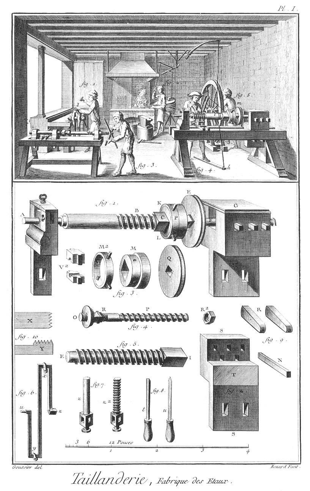
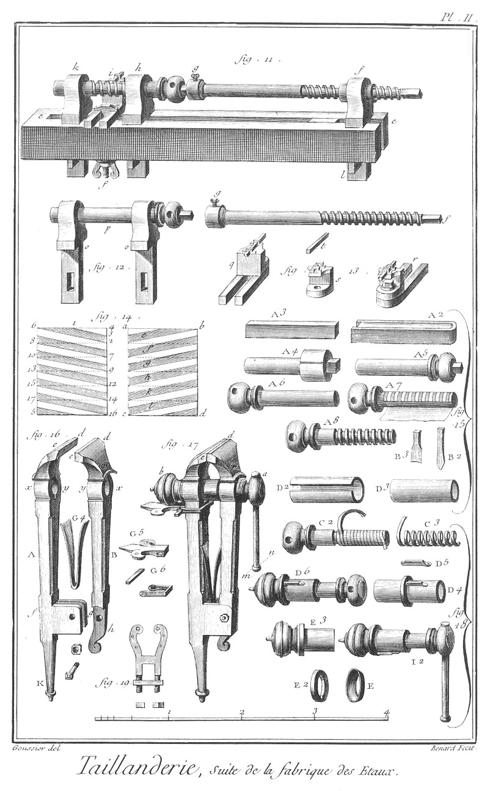

TAILLANDIER
===========

Fabrique des étaux, contenant deux Planches.

PLANCHE Iere.
-------------

La vignette représente l'intérieur d'une boutique de taillandier & différentes opérations. 

Fig.
1. Ouvrier qui marque une vis, c'est-à-dire qu'avec un ciseau ou burin il trace sur le corps de la vis à-travers le papier rayé les filets de la vis.

2. Forgeron qui fait chauffer à la forge un outil qu'il veut tremper.

3. Ouvrier qui forme à la machine le filet d'une vis d'étau.

4. Tourneur qui fait sur le tour une vis de presse.

5. Ouvrier qui tourne la roue dont l'axe est armé d'une manivelle double, aux coudes de laquelle la corde qui passe sur la poulie m, est attachée, en sorte que la piece d'ouvrage tourne & retourne sur elle-même en même tems que les clavettes de la poupée à clavettes l'obligent d'avancer & de reculer à chaque révolution d'une quantité égale à la distance qui est entre les pas de la vis.

Bas de la Planche.

Fig.
1. Représentation perspective & plus en grand de l'affutage de la fig. 4.

2. La poupée à clavette dont la partie antérieure est supposée retranchée ; ce que les hachures obliques font connoître pour laisser voir les mortaises dans lesquelles passent les clavettes.

3. 
	- Q, la poulie.
	- M, la boîte.
	- M 2, la virole.
	- V 2, les coussinets.

4. L'arbre guide.
	- R, portée quarrée à laquelle s'applique la poulie.
	- R 2, écrou à six pans qui la retient en place.

5. Vis de presse entierement achevée.

6. Manivelle double qui s'adapte à l'axe de la roue, fig. 5. de la vignette, la boîte Z reçoit le quarré de l'arbre de la roue, & le tourillon u repose sur un poteau vertical. x y moufles auxquelles la corde qui passe sur la poulie montée sur l'ouvrage vient s'attacher.

7. Autre vis de presse.
	- z, vis avant que le filet en soit formé.
	- z 2, la même vis entierement achevée.

8. Deux outils.
	- t, bec-d'âne.
	- u, grain-d'orge.

9. Clavettes.

10. Peignes droits & de côté.

PLANCHE II.
-----------

Fig.
11. Représentation perspective & plus en grand de l'affutage de la fig. 3. de la vignette ; le porte- outil est fixé sur le banc par un T: s à vis, au lieu d'une clavette, comme il est dit dans l'article.

12. Les deux poupées à lunette traversées par une vis d'étau, à côté est l'arbre g f qui sert de guide.

13. Différentes vues perspectives du porte-outil.

14. Deux papiers rayés pour coler sur un cylindre que l'on veut former en vis. Le premier qui est entouré de chiffres, est pour former une vis à simple filet à gauche, & le second rempli de lettres, est pour former une vis à droite : dans l'un & l'autre, les bandes colorées doivent se rejoindre lorsque le papier est colé sur le cylindre, de maniere que la ligne a c joigne la ligne b d ; ce qui fait que les bandes e, f, g, h, k, l, ne forment plus qu'une seule hélice suivant laquelle on creuse les entre-filets de la vis.

15. Elle fait voir, à commencer à A 2 & A 3 & finir à A 8, la suite des chaudes & les différens états par où passe une vis d'étau avant d'être achevée.

16. Dans l'article cité fig. 6. on voit les deux jumelles séparées l'une de l'autre.

17. Aussi cité 7. Etau complet garni de toutes ses pieces.

18. Elle fait voir la suite des chaudes & les différentes pieces qui composent une boîte d'étau à filet brasé.

19. Autre bride pour fixer l'étau à l'établi.

[->](../15-Tailleur_d'Habits_et_Tailleur_de_Corps/Légende.md)
