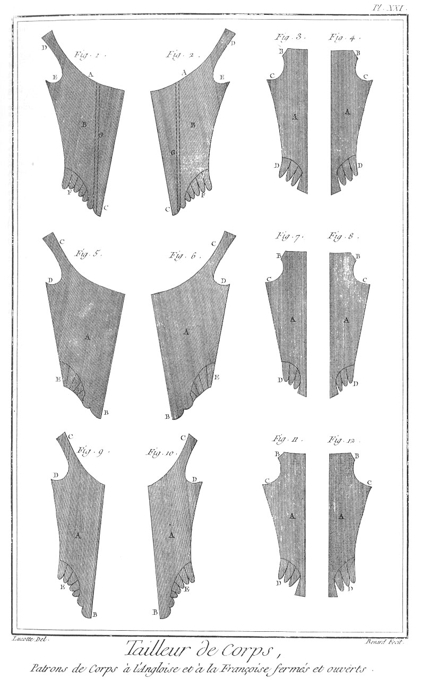

TAILLEUR D'HABITS ET TAILLEUR DE CORPS 
======================================

Contenant vingt-quatre Planches. 

PLANCHE Iere.
-------------

Le haut de cette planche représente un attelier de tailleur, où plusieurs ouvriers sont occupés ; les uns en a & en b, à coudre & joindre des étoffes ; un autre en c, à prendre mesure ; & un autre en d, à couper.

Fig.
1. Porte-chandelier.
	- A, le chandelier.
	- B B, les cases propres à contenir les fils, aiguilles, cire, &c. & tous autres ustensiles.
	- C, tiroir.

2. Grands ciseaux.
	- A A, les mords.
	- B B, les anneaux.

3. Ciseaux moyens.
	- A A, les mords.
	- B B, les anneaux.

4. Petits ciseaux.
	- A A, les mords.
	- B B, les anneaux.

5. Chandelier.
	- A, le pié.
	- B, la bobeche.

PLANCHE II.
-----------

Fig. 1. Craquette plate propre à passer les boutonnieres.
	- A, le fer.
	- B, la fente pour les boutonnieres.
	- C, le manche.

2. Craquette triangulaire.
	- A, le fer.
	- B, la fente.
	- C, le manche.

3. Poinçon aigu pour faire des trous dans l'étoffe.
	- A, le poinçon.
	- B, l'anneau.

4. Poinçon camus.
	- A, le poinçon.
	- B, l'anneau.

5. &
6. &
7. Aiguilles de différentes grosseurs.
	- A A A, les têtes.
	- B B B, les pointes.

8. Filier dégarni.
	- A, le filier.
	- B, l'étui ; il sert à contenir le fil.

9. Filier garni.
	- A, le filier garni de fil ou de soie.
	- B, l'étui.

10. Dé fermé.

11. Dé ouvert.

12. Grand carreau, espece de fer à repasser.
	- A, le carreau.
	- B, le manche.

13. Petit carreau.
	- A, le carreau.
	- B, le manche.

14. Chante u, morceau d'étoffe qui prend différentes formes selon les places qu'il doit occuper dans un habit, lorsque cette étoffe n'est point assez étendue.

15. Patira, plusieurs lisieres réunies & cousues ensemble formant une espece d'étoffe sur laquelle on unit les galons.

16. Petit billot pour applatir les coutures tournantes.

17. Passe-carreau destiné au même usage.

18. Poids pour mettre les étoffes en presse & leur donner les bons plis.
	- A A, les cerces.
	- B, le poids.
	- C, l'anneau.

PLANCHE III.
------------

Fig.
1. Morceau de craie pour tracer sur les étoffes.

2. &
3. Echevaux de fil & de soie.

4. &
5. Soies & fils en plotes.

6. &
7. Fil ou soie coupés par aiguillées, le premier natté, & le second enveloppé de papier.

8. Marquoir.
	- A, la pointe
	- B, le manche.

9. Poussoir.
	- A, les pointes.
	- B, le manche.

10. Porte feuille rempli d'échantillons d'étoffe que l'on porte en ville.
	- A A, les échantillons.

11. Tableau d'échantillons.
	- A A, les boucles pour le suspendre dans l'attelier.
	- B B, les échantillons.

12. Etabli du tailleur.
	- A A, la table.
	- B B B, les piés.
	- C C C, les rideaux.

13. &
14. Tréteaux de l'établi.
	- A A, les piés.
	- B B, les traverses.
	- C C, les barres.
	- D D, les supports. 

PLANCHE IV.
-----------

Fig.
1. Rouleau de drap de cinq quarts de largeur, sur lequel sont tracées quelques pieces d'un habillement. Comme l'étoffe est toujours doublée l'endroit en-dedans & l'envers en-dehors, il n'est besoin que de tracer une seule piece pour avoir l'autre dans celui qui lui est opposé.
	- A, devant d'habit.
	- B, devant de culotte.
	- C, derriere d'habit.
	- D, derriere de culotte.
	- E, dessus de manche.
	- F, dessous de manche.
	- G, patte de poche.
	- H, chanteau. II, rouleau de bois sur lequel on roule quelquefois l'étoffe.
	- K, l'étoffe.

2. Rouleau d'étoffe unie brodée ou non brodée en soie, or ou argent, de demi-aune de largeur, sur lequel sont tracées des pieces d'habit. L'étoffe étant simple, il faut prendre en longueur ce qu'on ne peut prendre en largeur.
	- A A, devants d'habit.
	- B B, dessous de manche.
	- C, portion de derriere d'habit.
	- D D, rouleau de bois, sur lequel on roule quelquefois l'étoffe avec papier sur l'endroit lorsqu'elle est de prix.
	- E, l'etoffe.

3. Mesure d'habit.
	- AA A, moitié de la grosseur du corps par en haut.
	- AA B, moitié de la grosseur du corps au milieu.
	- AA C, moitié de la grosseur du corps à la ceinture.
	- AA D, moitié de la grosseur du bras proche l'épaule.
	- AA E, moitié de la grosseur du bras proche le coude.
	- AA F, largeur de la demi-carrure par-devant. 
	- AA G, largeur de la demi-carrure par-derriere.
	- AA H, longueur de la manche jusqu'au coude.
	- AA I, longueur totale de la manche jusqu'au poignet.
	- AA K, longueur de la taille.
	- AA L, longueur du derriere.
	- AA M, longueur du devant.

4. Mesure de veste.
	 - AA A, moitié de la grosseur du corps à l'estomac.
	 - AA B, moitié de la grosseur du corps au ventre.
	 - AA C, moitié de la grosseur du corps à la ceinture
	 - AA D, longueur de la taille.
	 - AA E, longueur de la veste.

5. Mesure de culotte.
	- AA A, moitié de la grosseur du haut de la cuisse.
	- AA B, moitié de la grosseur du milieu de la cuisse.
	- AA C, moitié de la grosseur du genou.
	- AA D, longueur de la culotte.
	- AA E, moitié de la ceinture.

6. Aune vue d'un côté, divisée par tiers, demi-tiers, douzieme & vingt quatrieme. C'est ainsi qu'on nomme les divisions & subdivisions en fait d'aunage.

7. La même aune vue de l'autre côté, divisée par moitié, quart, demi quart & seizieme, divisions & subdivisions convenues en fait d'aunage.

PLANCHE V.
----------

Fig. 1. Habit.
	- A, la taille.
	- B, la basque.
	- C, les plis.
	- D, la patte.
	- E, la manche.

2. Veste.
	- A, la taille.
	- B, la basque de devant.
	- C, la basque de derriere.
	- D, la patte.
	- E, la manche.

3. Culotte.
	- A A, les devants.
	- B, la ceinture.
	- C C, les poches.
	- D D, les jarretieres.

4. Culotte à pont ou à la bavaroise.
	- A A, les devants.
	- B, la ceinture.
	- C C, les poches.
	- D, le pont.
	- E E, les jarretieres.

5. Soutanne.
	- A A, la soutanne.
	- B B, les manches.
	- C, le collet.

6. Manteau long d'abbé.
	- A, le manteau.
	- B, le collet.

7. Manteau court d'abbé.
	- A, le manteau.
	- B, le collet.

8. Redingotte.
	- A A, la taille.
	- B B, les manches.
	- C, le collet.

9. Robe de chambre.
	- A, la robe.
	- B, la manche.

10. Robe de palais.
	- A, la robe.
	- B, la manche.

11. Gillet ou petite veste sans basques.
	- A, la taille.
	- B, la manche.

12. Fraque, espece d'habit de nouveau genre.
	- A, la taille.
	- B, la basque.
	- C, les plis.
	- D, la poche.
	- E, la manche.
	- F, le collet.

PLANCHE VI.
-----------

Pieces détaillées d'un habit.

Fig.
1. &
2. Devant d'habit.
	- A A, les collets.
	- B B, les épaulettes.
	- C C, les échancrures des manches.
	- D D, la taille.
	- E E, les plis.
	- F F, les poches.
	- G G, les basques.
	- H H, manque d'étoffe.

3. &
4. Cran, morceau de bougran destiné à soutenir le point de réunion des plis.

5. &
6. Chanteaux d'habit, morceaux d'étoffe semblable à celle de l'habit destiné à remplir ce qui lui manque, comme en H H, fig. 1. & 2.

7. &
8. Bordure de bougran que l'on met sur les bords de l'habit entre l'étoffe & la doublure pour soutenir d'une part les boutons, & de l'autre les boutonnieres.
	- A A, la partie du collet.
	- B B, les bords.

9. &
10. Derriere de l'habit.
	- A A, les collets.
	- B B, les épaulettes.
	- C C, les échancrures des manches.
	- D D, la taille.
	- E E, les plis.
	- F F, les basques.
	- G G, manque d'étoffe.

11. &
12. Cran pour la réunion des plis de derriere.

13. Collet.

14. Dessus de manche d'habit.

15. Dessous de manche d'habit.

16. &
17. Pattes de poches.

18. &
19. &
20. &
21. Crans.

22. &
23. Poches d'habit

24. &
25. Bottes de manches.

PLANCHE VII.
------------

Pieces détaillées de veste & culotte.

Fig.
1. &
2. Devants de veste.
	- A A, les collets.
	- B B, les épaulettes.
	- C C, les échancrures.
	- D D, la taille.
	- E E, les basques.
	- F F, les ouvertures de poches.

3. &
4. Bordure de bougran pour la veste.
	- A A, les collets.

5. &
6. Dessus & dessous de manche de veste.

7. &
8. Pattes de poches.

9. &
10. Crans de la veste.

11. &
12. derrieres de veste.
	- A A, les collets.
	- B B, les épaulettes.
	- C C, les échancrures.
	- D D, la taille.
	- E E, les basques.

13. Cran du collet de derriere.

14. &
15. &
16. &
17. Crans.

18. &
19. Devants de culottes.
	- A A, les parties de genou.

20. Patte du milieu.

21. Boucle de derriere.
	- A, la boucle.
	- B, la patte.
	- C, l'arrêt.

22. &
23. Derrieres de culotte.
	- A A, les dessous du genou.

24. &
25. Poches de culotte.

26. &
27. Jarretieres de culotte.
	- A A, les boutonnieres des boucles.

28. Moule de bouton.

29. Premiere opération de bouton d'étoffe, piece arrondie garnie de points autour.

30. Seconde opération.
	- A, le moule.
	- B, la partie d'étoffe pour former le bouton.

31. Troisieme & derniere opération, bouton fini.

32. &
33. Ceinture de la culotte.
	- A A, les boutons.
	- B B, les boutonnieres.

PLANCHE VIII.
-------------

Fig.
1. &
2. Collet à la françoise.

3. &
4. Collet à l'allemande.

5. &
6. Collet à l'angloise.

7. &
8. Poches de fraque.

9. 10. & 11. Manches de fraque de différens goûts. 

12. Veste croisée.
	- A, le collet.
	- B B, les échancrures.
	- C C, les basques.
	- D, la partie croisée.

13. Grand patira.
	- A A, les lisieres cousues ensemble.

14. Lissoir pour les culottes de peau.

15. Buisse pour les culottes de peau.

16. Pont de culotte de peau.
	- A A, les pattes.
	- B, la pointe.
	- C C, les oreilles.

17. &
18. Poches de côté de culotte.

19. &
20. Grand & petit gousset de culotte.

21. &
22. Poches de devant de culotte.

PLANCHE IX.
-----------

Points de couture.

Fig.
1. &
2. &
3. Elévation & places de dessus & de dessous du point de devant en piquant les deux étoffes de haut-en-bas & de bas-en-haut.

4. &
5. &
6. Point de côté ramenant le fil en-dessous par-dehors, après avoir piqué les deux étoffes.

7. &
8. &
9. Point-arriere ou arriere-point, repiquant de haut-en-bas au milieu du point-arriere, après avoir piqué de bas-en-haut.

10. &
11. &
12. Point lacé comme le point-arriere, au lieu qu'il se fait en deux tems, revenu en-haut on serre le point, & retournant l'aiguille on repique en-arriere comme au précédent.

13. &
14. &
15. Point à rabattre sur la main piquant de haut-en-bas & de bas-en-haut en-avant les points drus espacés & également.

16. &
17. &
18. Point à rabattre sous la main comme le dernier, au-lieu qu'ayant percé l'étoffe supérieure on pique l'étoffe insérieure par-dehors, ensuite on pique les deux en remontant.

19. &
20. &
21. Point à rentraire comme le point à rabattre sur la main, se faisant en deux tems, en retournant l'aiguille ; avant tout il faut joindre à point simple les deux envers l'étoffe retournée, on serre de ce point les deux retours, il faut pour cela très-peu d'étoffe & les points très-courts.

Le point perdu n'est qu'un point-arriere ajouté au précédent.

22. &
23. &
24. Point traversé, couture à deux fils croisés.

25. 
	- A premiere opération ; point coulé ou la passe, c'est la boutonniere tracée de deux fils.
	- B, la passe fermée du point de boutonniere.
	- C, la passe achevée & terminée de deux brides à chaque bout que l'on enferme de deux rangs de points noués.

PLANCHE X.
----------

Fig.
1. &
2. &
3. Points noués simples de neuf différentes formes.

4. Points noués doubles de trois différentes sortes.

5. &
6. &
7. Points croisés simples & doubles de neuf différentes sortes.

PLANCHE XI.
-----------

Fig.
1. Etoffe de drap de trois aunes & demie, contenant la distribution des pieces qui composent l'habit, veste & culotte.

2. Drap de trois aunes pour habit & veste seulement.

3. Drap de deux aunes & demie pour habit & culotte.

4. Drap de demi-aune pour culotte seulement.
	- A, devant d'habit.
	- B, derriere d'habit.
	- C, devant de veste.
	- D, derriere de veste.
	- E, manche d'habit.
	- F, manche de veste.
	- G, patte d'habit.
	- H, patte de veste.
	- I, parement de manchette d'habit.
	- K, chanteau.
	- L, devant de culotte.
	- M, derriere de culotte.

PLANCHE XII.
------------

Fig.
1. Drap d'une aune & demie pour veste & culotte.

2. Drap dune aune trois quarts pour fraque seul.

3. Drap de deux aunes pour habit seul.

4. Drap d'une aune pour veste seule.

5. Drap de deux aunes & demie pour redingotte.

6. Drap de deux tiers pour veste sans manche.
	- A, devant de veste.
	- B, derriere de veste.
	- C, devant de culotte.
	- D, dessus de culotte.
	- E, derriere de manche.
	- F, dessous de manche.
	- G, patte de poche.
	- H, devant de fraque.
	- I, derriere de fraque.
	- K, parement.
	- L, collet de fraque.
	- M, devant d'habit.
	- N, derriere d'habit.
	- O, chanteau.
	- P, devant de redingotte.
	- Q, derriere de redingotte.
	- R, collet de redingotte.
	- S, devant de veston.
	- T, derriere de veston.
	- V, basques de veston.

PLANCHE XIII.
-------------

Fig.
1. Drap de deux aunes trois quarts pour roquelaure avec manches.
	- A, devant.
	- B, derriere.
	- C C, chanteaux.
	- D, dessus de manche.
	- E, dessous de manche.
	- F, collet.
	- G G, paremens.

2. Demi-aune de drap pour collets de roquelaure.
	- A, le supérieur.
	- B, l'inférieur.

3. Une aune trois quarts de drap pour soutanelle.
	- A, le devant.
	- B, le derriere.
	- C, la patte.
	- D, le dessous de la manche.
	- E, le dessus de la manche.
	- F F, les paremens.

4. Une aune & demie de drap pour un volant.
	- A, le devant.
	- B, le derriere.
	- C, le dessus de la manche.
	- D, le dessous de la manche.
	- E E, les paremens.

5. Trois aunes & un tiers de drap pour soutanne.
	- A, le devant.
	- B, le derriere.
	- C C, les chanteaux.
	- D D, les paremens.
	- E, le dessus de la manche.
	- F, le dessous de la manche.

PLANCHE XIV.
------------

Fig.
1. Quatre aunes de drap dépliées pour manteau.
	- A B, les deux parties latérales, la couture au milieu du dos.
	- C C, le collet en deux parties.

2. Trois aunes un tiers d'étoffe étroite de demi-aune de largeur pour robe de chambre.
	- A, le devant.
	- B, le derriere.
	- C, le dessus de manche.
	- D, le dessous de manche.
	- E, le chanteau.
	- F F, les paremens.

3. Quatre aunes de voile ou taffetas pour manteau d'abbé.
	- A A, les parties du manteau.
	- B, le chanteau.
	- C C, le collet.

PLANCHE XV.
-----------

Fig.
1. &
2. &
3. &
4. Neuf aunes & demie d'étoffe de soie pour habit veste & culotte.
	- A A, les devants d'habit.
	- B B, les chanteaux des plis de devant d'habit.
	- C C, les derrieres d'habit.
	- D D, les chanteaux des plis de derriere d'habit.
	- E E, les devants de veste.
	- F F, les dessus de manche d'habit.
	- G G, les dessous de manche d'habit.
	- H H, &c. les paremens des manches.
	- I I, les pattes d'habit.
	- K K, les derrieres de veste.
	- L L, les dessus de manche de veste.
	- M M, les dessous de manche de veste.
	- N N, les devants de culotte.
	- O O, les derrieres de culotte.
	- P P, les pattes de veste.

5. &
6. Deux aunes deux tiers d'étoffe de soie pour veste seule.
	- A A, les devants.
	- B B, les derrieres.
	- C C, les dessus de manche.
	- D D, les dessous de manche.
	- E E, les pattes.

PLANCHE XVI.
------------

Fig.
1. &
2. Huit aunes d'étoffe de soie pour habit & veste seulement, dont ces deux figures représentent la moitié.

3. Cinq aunes un tiers d'étoffe de soie pour habit seulement, dont la figure représente la moitié.

4. Six aunes deux tiers pour habit & culotte, dont la figure représente la moitié.

5. Quatre aunes d'étoffe de soie pour veste & culotte, dont la figure représente la moitié.

6. Une aune & demie d'étoffe de soie pour culotte, dont la figure représente la moitié.
	- A, devant d'habit.
	- B, derriere d'habit.
	- C, chanteaux des plis de devant d'habit.
	- D, chanteaux des plis de derriere d'habit.
	- E, devant de veste.
	- F, derriere de veste.
	- G, dessus de manche d'habit.
	- H, dessous de manche  d'habit.
	- I, parement de manche.
	- K, dessus de manche de veste.
	- L, dessous de manche de veste.
	- M, patte d'habit.
	- N. patte de veste.
	- O, devant de culotte.
	- P, derriere de culotte.
	- Q, ceinture de culotte.
	- R, patte de devant de culotte.

PLANCHE XVII.
-------------

Fig.
1. Deux aunes d'étoffe de soie pour veston, dont la figure montre la moitié.

2. Quatre aunes & demie d'étoffe de soie pour fraque seul, dont la figure fait voir la moitié.

3. Six aunes & demie d'étoffe pour redingotte, dont la figure fait voir la moitié.

4. Sept aunes d'étoffe pour roquelaure, dont la figure fait voir la moitié.

5. Demi-aune d'étoffe pour camisole, dont la figure fait voir la moitié.

6. Deux tiers d'étoffe pour gillet, dont la figure fait voir la moitié.

7. Deux aunes d'étoffe pour soutanelle, dont la figure fait voir la moitié.
	- A, devant de fraque.
	- B, derriere de fraque.
	- C, chanteaux.
	- D, parement.
	- E, dessus de manche.
	- F, dessous de manche.
	- G, collet.
	- H, patte de poche.
	- I, devant de veston.
	- K, derriere de veston.
	- L, devant de redingotte.
	- M, derriere de redingotte.
	- N, devant de roquelaure.
	- O, derriere de roquelaure.
	- P, devant de camisole.
	- Q, derriere de camisole.
	- R, devant de gillet.
	- S, derriere de gillet.
	- T, devant de soutanelle.
	- V, derriere de soutanelle.

PLANCHE XVIII.
--------------

Fig.
1. &
2. Neuf aunes & un tiers d'étoffe pour soutanne, dont les figures font voir la moitié.
	- A, devant de la soutanne.
	- B, derriere de la soutanne.
	- C, dessous de manche.
	- D, dessus de manche.
	- E E, paremens.
	- F, chanteau de devant.
	- G, chanteau de derriere.

3. Six aunes & demie d'étoffe pour robe de chambre d'homme, dont la figure ne montre que la moitié.
	- A, devant de la robe.
	- B, derriere de la robe.
	- C, chanteau de devant.
	- D, chanteau de derriere.
	- E, collet.
	- F, Manche.
	- G, parement.

4. &
5. Sept aunes deux tiers d'étoffe pour robe de palais, dont la figure montre la moitié.
	- A, le devant.
	- B, le derriere.
	- C, chanteau de devant,
	- D, chanteau de derriere.
	- E, manche.
	- F, botte.

PLANCHE XIX.
------------

Seize aunes & demie d'étoffe pour manteau long d'abbé.
	- A A, &c. les pieces du manteau.
	- B B, le collet.
	- C, le chanteau.

PLANCHE XX.
-----------

Tailleur de Corps.

Fig.
1. Corps fermé par-devant vu de face en-dehors, avec lacet de tresse.
	- A, le lacet.
	- B B, les devants.
	- C C, les derrieres.
	- D D, les épaulettes.
	- E E, les basques.
	- F F, bordures couvrant les oeillets du lacet.

2. Corps ouvert à la duchesse vu de face.
	- A A, les devants.
	- B B, les derrieres.
	- C, le lacet à la duchesse.
	- D D, les épaulettes.
	- E, les basques.

3. &
4. Derriere de corps fermé ou ouvert.
	- A A, les derrieres.
	- B B, les épaulettes.
	- C C, les échancrures.
	- D D, les basques.

5. &
6. Devant de corps fermé.
	- A A, partie de la carrure.
	- B B, les devants.
	- C C, la pointe.
	- D D, les épaulettes.
	- E E, les échancrures.
	- F F, les basques.

7. &
8. Devant de corps ouvert.
	- A A, les oeillets.
	- B B, les épaulettes.
	- C C, les échancrures.
	- D D, les basques.
	- E E, la pointe.

PLANCHE XXI.
------------

Fig.
1. &
2. Patron de devants de corps à l'angloise, fermé par-devant.
	- A A, parties de la carrure.
	- B B, les devants.
	- C C, la pointe.
	- D D, les épaulettes.
	- E E, les échancrures.
	- F F, les basques.
	- G G, bordures couvrant les oeillets.

3. &
4. Patron de derriere de corps à l'angloise.
	- A A, les derrieres.
	- B B, les épaulettes.
	- C C, les échancrures.
	- D D, les basques.

5. &
6. Patron de devants de corps à la françoise, fermé par-devant.
	- A A, les devants.
	- B B, la pointe.
	- C C, les épaulettes.
	- D D, les échancrures.
	- E E, les basques.

7. &
8. Patron de derriere de corps à la françoise.
	- A A, les derrieres.
	- B B, les épaulettes.
	- C C, les échancrures.
	- D D, les basques.

9. &
10. Patrons de devants de corps à l'angloise, ouvert par-devant.
	- A A, les devants.
	- B B, la pointe.
	- C C, les épaulettes.
	- D D, les échancrures.
	- E E, les basques.

11. &
12. Patrons de derriere de corps à l'angloise.
	- A A, les derrieres.
	- B B, les épaulettes.
	- C C, les échancrures.
	- D D, les basques.

PLANCHE XXII.
-------------

Fig.
1. &
2. Patrons de devants de corps à la françoise, ouvert par-devant.
	- A A, les devants.
	- B B, la pointe.
	- C C, les épaulettes.
	- D D, les échancrures.
	- E E, les basques.

3. & 4. Patron de derrieres de corps à la françoise, ouvert par-devant.
	- A A, les derrieres.
	- B B, les épaulettes.
	- C C, les échancrures.
	- D D, les basques.

5. Maniere de prendre mesure de corps.
	- A B, premiere opération depuis le milieu du dos jusqu'au coin de l'épaulette.
	- C D, deuxieme opération, la carrure du devant.
	- A D, troisieme opération depuis le dos jusqu'au devant par le haut.
	- E F, quatrieme opération, largeur de la taille par le bas.
	- G H, cinquieme opération, longueur de la taille depuis le haut du dos jusqu'à la hanche.
	- D I, sixieme & derniere opération, longueur du devant. 

6. Profil d'un corps à demi baleiné, dit corset baleiné.

7. Profil d'un corps à baleines pleines.

8. Corps vu de profil intérieurement pour montrer la disposition des garnitures.

9. Corps vu de face intérieurement, pour montrer la disposition des baleines de dressage.

PLANCHE XXIII.
--------------

Fig.
1. Grand corps de cour ou de grand habit de cour vu de profil.

2. Corps pour les femmes qui montent à cheval vu de profil.

3. Corps pour les femmes enceintes se laçant par les deux côtés en A.

4. Corps de fille.

5. Corps de garçon.

6. Corps de garçon à sa premiere culotte.

7. &
8. Buses de baleine qui se glissent dans l'épaisseur du devant du corps.
	- A A, les boucles pour les retirer.

9. Lacet de côté ferré.
	- A A, afferons.

10. Lacet de tresse ferré.
	- A, l'afferon.

11. Mesure de corps.

12. &
13. Baleines de diverses grosseurs pour garnir.

14. Façon de former l'oeillet.
	- A, premiere opération, le trou fait au poinçon dans l'épaisseur du corps.
	- B, seconde opération, les premiers points fichés.
	- C, troisieme & derniere opération, l'oeillet fini.

PLANCHE XXIV.
-------------

Fig.
1. Corps ouvert par-devant avec lacet à la duchesse.

2. Dessous de manche de corset.

3. Dessus de manche de corset.

4. &
5. Devant & derriere de corset.

6. &
7. Patrons de devant & de derriere de corset.

8. Bas de robe de cour ou de grand habit.

9. Jaquette ou foureau pour les garçons.

10. &
11. Fausses robes pour les filles.

[->](../16-Tanneur/Légende.md)
