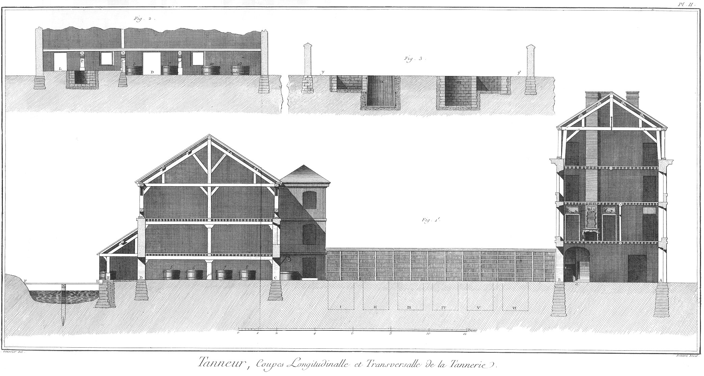

TANNEUR
=======

Contenant vingt-deux Planches, à cause de six doubles & de deux triples. 

PLANCHE Iere.
-------------

Plan général d'une tannerie.

La tannerie occupe un terrein de 30 toises de long sur 12 de large ; elle est placée sur le bord d'une riviere, l'eau étant d'un usage continuel dans ces sortes de manufactures, dont les bâtimens qui renferment différens atteliers, peuvent être regardés avec raison comme les outils ou instrumens de cette profession. C'est ce qui nous a engagés à publier ce plan & l'élévation contenue dans la Planche suivante.

Le corps de logis A B placé sur le devant, contient au rez-de chaussée les magasins & une partie du logement du maître.
	- A, porte d'entrée pour les charrois.
	- A B, passage sous le bâtiment pour communiquer à la cour B C.
	- a, vestibule qui conduit au pié de l'escalier par lequel on monte aux étages supérieurs.
	- b, porte du magasin.
	- c, autre porte du magasin.
	- d, magasin.
	- e, porte de communication au cabinet f.
	- g, arriere-cabinet.
	- h i, passage sous le perron de l'escalier.

L'autre côté du bâtiment contient la loge k du portier, une salle ou passage l pour communiquer à la cuisine o, l'antichambre m & la salle à manger n. Cette partie de bâtiment peut avoir différentes dispositions indifférentes à la profession de tanneur.

Le second corps de bâtiment C D contient la plamerie à laquelle est adossé le hangard sous lequel on travaille de riviere.
	- E F, pont ou planches placées en travers de la riviere ; elles sont supportées dans leur milieu par une solive qui recouvre deux pieux. C'est de dessus ces planches que les ouvriers rincent les peaux dans l'eau courante.
	- G H, I K, quatre cuves dans lesquelles on fait désaigner les peaux.
	- H I, les deux poteaux qui soutiennent le hangard sous lequel les ouvriers travaillent de riviere, & sont à couvert. Cet attelier doit être pavé de grandes pierres un peu inclinées vers la riviere pour rejetter facilement l'eau qui tombe dessus pendant le cours du travail.
	- D, porte de communication à l'attelier où on fait les passemens.
	- C, autre porte qui communique à la cour ; ces deux portes sont en face de celles du premier bâtiment.

Le bâtiment dont il s'agit, est comme divisé en deux parties par un mur d'appui N O. La plus petite partie dont le sol est plus élevé que celui de la grande d'environ un pié ou un pié & demi, est l'attelier où on fait le plamage à la chaux; elle contient les quatre pleins Q R S T, qui sont des fosses en maçonnerie. Ces fosses ont cinq piés de diametre & quatre piés de profondeur au-dessous du rez-de-chaussée au niveau duquel est leur ouverture. 
	- P, pilier de pierre qui soutient les poutres du plancher.
	- P 2 & P 3, semblables piliers qui soutiennent les autres poutres du même plancher.
	- L & M, portes ; la premiere sert de communication de la plamerie à l'attelier de riviere, & la seconde communique à la cour.

La grande partie contient l'attelier des passemens.
	- 1, 2, 3, 4: 5, 6, 7, 8, deux rangs de cuves dans lesquelles se font les passemens blancs ; ces cuves ont cinq piés de diametre & deux piés dix pouces de hauteur ; elles sont cerclées de fer.
	- 9, 10, 11: 12, 13, 14, autres cuves dans lesquelles se font les passemens rouges. 15, chaudiere de cuivre montée sur son fourneau de briques, dans laquelle on fait chauffer l'eau nécessaire aux passemens.

Au dehors du bâtiment que l'on vient de décrire, sont en aîles sur la cour deux pavillons quarrés X & Z. Le premier sert de poudrier ; c'est-là où l'on enferme le tan en poudre, & où on le mouille légérement. V, porte du poudrier. Le second pavillon contient l'escalier  par lequel on monte aux chambres au premier étage & au grenier ou séchoir qui est au-dessus. Y est la porte. Près de ce pavillon est un puits dont l'eau est nécessaire en certaines opérations, & supplée à celle de la riviere, lorsque les sécheresses ou autres raisons empêchent d'en faire usage.

La cour qui a douze à quatorze toises de long, contient deux rangs de fosses. Les six premieres I, II, III, IV, V, VI, sont construites en maçonnerie ; les six autres VII, VIII, IX, X, XI, XII, sont en bois comme les cuves, & sont cerclées de fer ; les unes & les autres ont huit piés de diametre sur neuf de profondeur ; elles doivent être fort étanchées, c'est-à-dire ne point perdre l'eau dont on abreuve les cuirs & le tan qu'elles contiennent. Pour cela, si on construit les fosses en bois, on a soin de les asseoir sur un corroi de terre glaise ou d'argille ; le même corroi environne aussi la cuve dans toute sa hauteur.

Près de chaque rang de fosses est un fossé r, s & t, u de huit piés de large sur quatre de profondeur, revêtu de maçonnerie dans tout son pourtour. Ces fossés sont destinés à recevoir la tannée que l'on retire des fosses quand on releve les cuirs. C'est avec cette tannée que l'on fabrique les mottes, ainsi qu'il sera dit ci-après.

Après le fossé dont on vient de parler, est une banquette p, q: x, y de niveau au reste de la cour, sur laquelle on place les mottes à mesure qu'elles sont fabriquées. Près du mur qui termine les banquettes qui ont huit piés de large, sont les étentes sur lesquelles on fait sécher les mottes.

PLANCHE II.
-----------

Fig.
1. Coupe longitudinale de la tannerie.
	- A, porte chartiere.
	- A B, passage sous le bâtiment.
	- b, porte du magasin.
	- a, entrée du vestibule ou passage pour arriver à l'escalier.

Au premier étage est l'appartement du maître ; au second, des chambres où on attache les cuirs pour les faire sécher. Ce plancher doit être élevé au-moins de dix piés, pour que les cuirs y étant accrochés, ne traînent point à terre. Les fenêtres de ces chambres doivent être fermées exactement avec des volets de bois pour en été défendre les cuirs de l'ardeur du soleil, & en hiver de la force de la gelée.

Au-dessus de ces chambres sont les greniers ou séchoirs, dans une partie desquels on pratique avec des claies différens planchers ou tablettes sur lesquels on fait sécher les mottes.

Nous suivrons dans l'explication de cette Planche le même ordre que dans celle de la précédente en commençant par le côté de la riviere.
	- F E, pont ou planches qui traversent la riviere; on voit un des deux pieux qui soutiennent la solive sur laquelle les planches sont appuyées.
	- H, un des deux poteaux qui soutiennent le toît sous lequel les ouvriers sont placés pour travailler de riviere; derriere ce poteau on voit une des quatre cuves dans lesquelles on fait désaigner les peaux.
	- D, porte de communication de l'attelier où on travaille de riviere à celui où se font les passemens.
	- 5, 6, 7, 8, quatre des huit cuves servant aux passemens blancs.
	- p 3, un des trois piliers qui soutiennent le plancher à sept piés & demi au-dessus du rez-de-chaussée.
	- C, porte qui communique à la cour.
	- Y, porte de l'escalier par lequel on monte aux étages supérieurs.

Le premier étage est composé de chambres dont les fenêtres sont fermées avec des volets de bois, comme celles du second étage du corps de logis de devant ; au-dessus de ces chambres sont les greniers & séchoirs où on fait sécher les mottes.

Dans la cour on voit dans le terre-plein la projection de six fosses. I, II, III, IV, V, VI, indiquées par des lignes ponctuées.

2. Coupe tranversale de la tannerie prise par le plein.
	- S, les cuves 3, 7, 10, 13 du plan de la Planche précédente.
	- L, porte de communication de l'attelier des pleins à la riviere.
	- S, un plein coupé diamétralement ; il a cinq piés de diametre & quatre piés de profondeur. P, un des piliers qui soutiennent le plancher.
	- P 2, second pilier servant au même usage ; au-devant on voit la coupe du petit mur qui sépare l'attelier des pleins de celui des passemens.
	- 3 & 7, deux des huit cuves servant aux passemens blancs.
	- D, porte de communication de l'attelier des passemens au travail de la riviere.
	- 10, 13, deux des quatre ou six cuves destinées pour les passemens rouges.

3. Coupe transversale de la tannerie par le milieu de la cour & celui de deux fosses opposées.
	- y, banquettes près d'un des murs de clôture de la tannerie.
	- u, fossé pour la tannée.
	- IX, une des six fosses montée en bois & entourée d'un corroi de glaise, ainsi qu'il a été dit.
	- III, une des six fosses construite en maçonnerie comme elles sont presque toutes.
	- s, fossé pour recevoir la tannée
	- q, banquette pour placer les mottes; sa largeur est terminée par le mur de clôture auquel sont adossées les étentes ou échelles sur lesquelles on fait sécher les mottes.

PLANCHE III.
------------

La vignette de cette Planche représente l'attelier où se fait le travail de riviere & plusieurs ouvriers occupés à différentes opérations. Cet attelier placé sur le bord de la riviere, est recouvert par un toît sous lequel sont les quatre cuves G g k K, dans lesquelles on fait désaigner les peaux ; le toît est soutenu par deux piliers H, I, vis à-vis l'intervalle desquels est la porte D, qui sert de communication à l'attelier des passemens ; dans le dehors sont les ponts ou planches E F soutenues dans leur milieu par une solive qui sert de chapeau à deux pieux qui sont plantés dans le milieu du lit de la riviere. L, porte de la plamerie.

Fig.
1. Ouvrier qui avec de longues pinces ou tenailles de fer rince les peaux qui trempent dans la riviere ; elles sont attachées par la tête à un pieu ou à la planche sur laquelle est placé l'ouvrier dont les vétemens sont tels que les figures les représentent, c'est-à-dire en chemise dont les manches sont retroussées au-dessus du coude, en bonnet, tablier, guetres & sabots.

2. Ouvrier qui apporte les peaux sur une brouette pour les mettre tremper dans une des quatre cuves.

3. Ouvrier qui avec le couteau rond débourre une peau sur le chevalet, c'est-à-dire qu'il en fait tomber le poil, après que la peau est sortie des pleins que la Planche suivante représente.

Le chevalet sur lequel l'ouvrier travaille, est une piece de bois demi-cylindrique, sur laquelle il étend une ou deux peaux ployées en double pour faire une couche sur laquelle il étend ensuite la peau qu'il veut dépiler, il la contient sur le chevalet en appuyant avec son corps ; tenant ensuite le couteau demi-rond qu'il conduit de haut en bas sur le chevalet qui est incliné, il fait tomber le poil dont le plamage par la chaux ou les passemens a détruit l'adhérence. Ce poil est ensuite recueilli & lavé, ce qui forme la bourre que les tapissiers employent au lieu de crin pour garnir différens meubles.

L'écharnement des peaux ou cuirs se fait avec un semblable couteau, mais qui est tranchant ; avec lequel on ôte du côté de la chair toutes les parties superflues.

C'est aussi sur le chevalet que l'on rase les cuirs destinés à être hongroyés ; on se sert pour cela de la faux que l'ouvrier tient à deux mains comme le couteau  rond ou le couteau à écharner ; il la conduit sur le plat comme un rasoir ; son tranchant qui est très-aigu, coupe le poil jusqu'auprès de la racine. Pour rétablir le tranchant de la faux, on se sert de la queurse qui est une pierre à aiguiser; elle sert aussi à donner le fil au couteau à écharner.

Dans toutes ces différentes opérations, ainsi que dans celle de recouler les peaux, c'est-à-dire d'en faire sortir l'humidité & la chaux en les exprimant fortement avec le couteau rond ou la queurse, l'attitude de l'ouvrier est celle que la figure représente. Bas de la Planche.

Fig.
4. qui, ainsi que les deux suivantes, doit être mesurée par la grande échelle, couteau rond dont se sert l'ouvrier, fig. 3. de la vignette. Ce couteau ne differe du couteau à écharner que parce que son tranchant est arrondi, d'où lui vient son nom, au lieu que celui du couteau à écharner est aigu, la fleche de l'arc du couteau est de deux pouces & demi sur une longueur de seize pouces.

5. Queurse ou pierre à aiguiser servant à affiler la faux, le couteau à écharner & à queurser les cuirs.

6. La faux servant de rasoir pour raser les cuirs qui doivent être hongroyés. C'est une faux ordinaire dont on a fait forger l'extrémité a en maniere de soie pour être reçue dans un manche de bois, & dont on a roulé sur elle même la partie b c, après l'avoir tranché en b de la moitié de la largeur de la faux, ce qui sert de seconde poignée à cet instrument dont on affute le tranchant avec la queurse ; la fleche de l'arc du tranchant est d'un pouce sur un pié dix pouces de longueur.

7. Le chevalet dont se sert l'ouvrier, fig. 3. de la vignette, représenté en perspective. Cette figure, ainsi que les suivantes, est dessinée sur la petite échelle.

8. Le chevalet vu par-dessous ou du côté concave ; il a cinq piés de long, quinze pouces de large de dehors en dehors, & seulement un pié de dedans en dedans.

9. Coupe transversale du chevalet prise au milieu de sa longueur, par laquelle on voit les courbures extérieures & intérieures.

10. Le pié du chevalet dont les croisées ont deux piés trois pouces de longueur.

PLANCHE IV.
-----------

La vignette représente l'intérieur de la plamerie à la chaux & les quatre pleins Q, R, S, T, cotés des mêmes lettres. Dans le plan général, Pl. I. on voit le petit mur N O à hauteur d'appui qui sépare cet attelier de celui des passemens représenté dans la vignette de la Planche suivante.

Les pleins construits en maçonnerie, ont cinq piés de diametre & quatre de profondeur. On fait éteindre de la chaux en quantité suffisante dans chacun de ces pleins dans lesquels on abat les peaux qui ont été écornées, desaignées & fendues en deux parties égales, si elles sont destinées à être hongroyées; car on les laisse entieres, si elles doivent être corroyées. On commence par abattre les peaux dans un plein mort, c'est-à-dire dans un plein qui a déjà servi & où elles doivent être submergées dans l'eau de chaux qu'on a eu soin de brasser auparavant pour relever le sédiment de la chaux & faire qu'elle se distribue également entre toutes les peaux. On laisse les peaux dans le plein mort pendant 2 ou 3 jours, au bout desquels on les releve pour les mettre en retraite empilées les unes sur les autres auprès du plein. On les laisse en cet état environ 4 à 5 jours, après lesquels on rabat les peaux dans le même plein, & ainsi alternativement pendant environ deux mois ; ce qui dispose le poil à quitter la peau & en facilite la dépilation.

Après que les cuirs sont débourrés ou dépilés, on les rabat dans un plein plus vif où ils restent 3 ou 4 jours, & alternativement en retraite pendant huit autres jours pendant trois mois.

Après le plein foible on donne aux cuirs le plein fort, c'est-à-dire qu'on les abat dans un plein neuf où ils restent également quatre mois alternativement en plein & en retraite de semaine en semaine.

Quelques tanneurs font encore passer les cuirs par un nouveau plein fort où ils restent deux mois aussi alternativement en plein & en retraite. Après ce dernier plein ou le précédent, les cuirs étant suffisamment renflés ou gonflés, on les travaille de riviere avec le couteau rond ou la queurse pour en faire sortir la chaux, on les écharne du côté de la chair avec le couteau à écharner ; on les foulle & on les rince soigneusement pour en exprimer toute la chaux, ils sont ensuite en état d'être tannés. Il y a des cuirs plus forts qui exigent un plus grand nombre de pleins.

Fig.
1. Ouvrier qui avec le boulloir brasse le plein pour délayer le sédiment de la chaux & la mêler dans l'eau. Ordinairement deux ouvriers sont employés ensemble à cette opération.

2. &
3. Ouvriers qui retirent les cuirs du plein pour les mettre en retraite ; ils se servent pour cela de longues tenailles de fer avec lesquelles l'ouvrier, fig. 2. saisit la tête du cuir ; lorsqu'il a tiré la tête hors du plein, l'ouvrier, fig. 3. la saisit avec ses tenailles ; le premier ouvrier reprend la peau vers la culée, & tous les deux agissant de concert, l'enlevent & la couchent en a b, de maniere que la tête soit du côté du mur & la culée du côté du plein, les dos de chaque bande couchés les uns sur les autres, & les ventres du côté des ouvriers. C'est-là que les peaux sont en retraite pendant plusieurs jours, ainsi qu'il a été dit. Bas de la Planche.

Fig.
4. Tenailles de fer dont se servent les ouvriers, fig. 2. & 3. pour tirer les cuirs de dedans les pleins ; l'extrémité d'une des branches a une rainure qui reçoit la languette de la seconde partie de la tenaille ; ensorte que les peaux une fois saisies par cet instrument, ne peuvent point échapper ni glisser, ce qui exposeroit la fleur à être égratignée.

5. Autre sorte de pinces plates servant au même usage.

6. Boulloir dont se sert l'ouvrier, fig. 1. de la vignette pour brasser le plein dans lequel on doit rabattre les peaux qui sont en retraite auprès de lui. Le reste du manche de cet outil est représenté à côté sous le numero fig. 6. bis.

PLANCHE V.
----------

La vignette représente l'attelier des passemens contigu à celui que l'on vient de décrire, représenté par la vignette de la Planche précédente.

La dépilation & le gonflement des cuirs qui a été produit ci-devant par l'eau de chaux dans laquelle on a laissé long-tems macérer les cuirs, peut s'opérer par la fermentation acide ménagée avec art, & en beaucoup moins de tems. On se sert pour cela de différentes substances, entre autres de la farine d'orge dont on fait un levain qu'on laisse aigrir & que l'on délaye ensuite dans l'eau contenue dans les cuves pour former les passemens.

Le train des passemens à l'orge ou passemens blancs est composé de quatre cuves 1, 2, 3, 4, ou 5, 6, 7, 8, qui sont cotées des mêmes chiffres dans le plan général, Pl. I. Ces cuves ont cinq piés de diametre & deux piés dix pouces de hauteur. Les peaux suffisamment désaignées & écharnées, sont jettées dans la premiere cuve, celle dont l'eau aigre a servi plusieurs fois & est la plus foible de toutes. Elles y restent plusieurs jours, tous les jours on les releve deux fois pendant deux ou trois heures sur les planches qui sont sur le bord de la cuve ; ce qui équivaut à la retraite des cuirs à la chaux ;  on les rabat ensuite dans la seconde cuve dont l'eau est plus aigre, ayant servi une fois moins que la précédente. Elles y restent aussi plusieurs jours alternativement en retraite sur les planches qui recouvrent en partie la cuve. On continue ainsi à faire passer successivement les peaux d'un passement plus foible à un plus fort jusqu'à ce que le poil soit disposé à quitter la peau : en les débourre ou on les épile alors sur le chevalet avec le couteau rond ; on les rince soigneusement, on les rabat ensuite dans un passement plus fort, on les releve, & on les rabat dans les cuves.

Après que les cuirs sont épilés & écharnés, ils passent successivement dans les autres passemens, dont le dernier est un passement neuf composé d'environ 12 livres de farine d'orge pour chaque cuir ; ils sont alors suffisamment gonflés pour aller dans les passemens rouges.

On conçoit par ce qui vient d'être dit que la premiere cuve qui est la plus foible, devient la derniere, lorsqu'après l'avoir vuidée & jetté le passement comme inutile, on la renouvelle par un passement neuf pour un autre train de peaux, & que la seconde cuve devient alors la premiere dans l'ordre du travail, & ainsi de suite pour toutes les autres à mesure que l'on traite de nouvelles peaux.
	- N O, mur d'appui ou de séparation de l'attelier du plamage à la chaux & de celui des passemens.
	- 1, 2, 3, 4, quatre des huit cuves qui servent aux passemens blancs. On voit sur les planches de la troisieme cuve les cuirs qui y sont en retraite.
	- 5, 6, 7, 8, les quatre autres cuves servant aux passemens blancs. Entre les unes & les autres est le passage pour aller à la riviere.
	- D, porte de communication à l'attelier où se fait le travail de riviere.
	- 9, 10, deux des quatre ou six cuves servant aux passemens rouges, les autres n'ayant pas pu être représentées dans cette vignette.

Fig.
1. &
2. Deux ouvriers occupés à relever les cuirs sur les planches de la huitieme cuve, sur lesquelles les cuirs sont pliés en trois ; on les laisse ainsi égoutter dans la cuve pendant deux ou trois heures deux fois chaque jour.

Les passemens rouges sont composés d'eau pure & de deux ou trois corbeillées de tan. Les cuirs trempent dans cette composition pendant trois ou quatre jours, au bout desquels on les releve ; on les rabat ensuite dans le même passement en ajoutant encore quelques poignées d'écorce pour chaque cuir; trois jours après ils sont en état d'être couchés en fosse.

Bas de la Planche.

Fig.
3. Une peau entiere tannée ouverte dans toute son étendue. On voit sur la queue la marque du boucher par laquelle on peut connoître combien pesoit la peau étant fraîche & sortant de dessus l'animal. Ces marques sont des entailles faites avec un couteau; elles se comptent en allant vers l'extrémité de la queue, le nombre marqué est 77; ce qui fait connoître que cette peau pesoit autant de livres étant fraîche. On voit aux deux côtés de cette peau les différens chiffres au moyen desquels on peut composer tous les autres.

4. Vue perspective d'une fosse pour préparer le jus de tannée dont on se sert au lieu de la liqueur des passemens & dans des cuves semblables pour préparer les cuirs façon de Liege, dits de l'emploi de ce jus cuirs à la jusée.

Pour faire ce jus on remplit une fosse ronde ou quarrée de vieille écorce ou tannée qui a servi à tanner les cuirs ; on y verse de l'eau qui se filtre à-travers & descend au fond du puisard A qu'on a eu soin de former avec quelques planches dans un des angles de la fosse. On puise cette eau que l'on reverse sur la tannée jusqu'à ce que par ces filtrations réitérées, elle ait acquis l'acidité nécessaire. La fermentation acide s'établissant dans la tannée à mesure que la qualité styptique s'anéantit, on a alors un jus que l'on met dans des cuves & dans lequel on fait successivement passer les cuirs (préalablement travaillés de riviere & rasés) d'une cuve foible dans une plus forte. La premiere cuve ou la plus foible ne contient qu'un huitieme de jus de tannée sur sept huitiemes d'eau pure ; la seconde deux huitiemes de jus de tannée sur six huitiemes d'eau, ainsi de suite pour les autres cuves en augmentant l'acidité par un huitieme de jus de tannée. En hiver les passemens sont au nombre de douze.

Pendant la premiere moitié des passemens on releve les cuirs deux fois par jour pour les laisser égoutter sur les planches des cuves pendant environ deux heures. Pendant l'autre moitié des passemens on ne releve les cuirs qu'une seule fois.

Après le dernier passement composé du plus fort jus de tannée, auquel on a ajouté quelques poignées de tan pour chaque cuir, & qu'ils y ont séjourné pendant environ une semaine, ils sont suffisamment gonflés & sont en état d'être mis en fosse comme les cuirs préparés par les deux méthodes précédentes.

PLANCHE VI.
-----------

La vignette de cette Planche représente le travail de la cour ou les différentes opérations de la mise en fosse, l'action de tanner proprement dite pour laquelle les opérations précédentes sont des préparations.

On voit d'un côté une partie du bâtiment du derriere de la tannerie, & le pavillon qui contient l'escalier marqué au plan général, Planche I. par lequel on monte aux chambres closes qui sont au-dessus de la plamerie & des passemens, & au grenier ou sechoir qui est au-dessus de ces chambres. C, porte de l'attelier des passemens. Y, porte de l'escalier en face de celle du poudrier placé dans le pavillon vis-à-vis, que l'on ne voit point dans la figure ; près de ce pavillon on voit un des murs de clôture auquel sont adossées les échelles ou étentes, sur lesquelles on fait sécher les mottes, & au-devant de ce mur quatre des six fosses construites en maçonnerie, & une partie de la cinquieme ; elles sont cotées dans le plan général par les chiffres I, II, III, IV.

Fig.
1. &
2. Deux ouvriers qui sur une civiere apportent les cuirs suffisamment gonflés par les pleins, les passemens d'orge, ou ceux de jus de tannée près de la premiere fosse où ils doivent être couchés.

3. Ouvrier qui apporte sur le bord de la fosse une corbeille pleine de tan, qu'il a humecté dans le poudrier, pour que la poussiere de cette substance ne se volatilise point.

4. Ouvrier qui couche les cuirs en fosse ; pour cela l'ouvrier commence à faire au fond de la fosse une couche de tannée, ou d'écorce qui a déjà servi à la préparation d'autres cuirs ; sur cette tannée il répand une couche de tan nouveau d'environ un pouce d'épaisseur ; sur cette derniere couche il étend un cuir, ou deux bandes si les cuirs ont été divisés en deux ; sur ce cuir une autre couche de tan de même épaisseur, sur laquelle il étend un nouveau cuir, dont la longueur doit croiser celle du premier, ainsi de suite alternativement, une couche de tan & un cuir, ou deux bandes, jusqu'à ce que la fosse soit remplie à environ deux piés près, ou que tous les cuirs qui sont préparés à être tannés y soient placés. Par-dessus le dernier cuir qui a été couché en fosse on met au-dessus du tan neuf qui le recouvre un ou deux piés de tannée ou écorce battue qui a déjà servi, de laquelle on remplit aussi les places qui ne sont pas occupées par les cuirs. On foule cette derniere couche avec les piés pour comprimer le tout, & faire mieux appliquer le tan sur les cuirs : on met quelques planches sur cette derniere couche, & on charge quelquefois ces planches avec des pierres.

A cette opération succede celle d'abreuver la fosse, on y verse pour cela une quantité suffisante  d'eau claire, on a soin d'entretenir cette humidité, c'est pour cela que les fosses doivent être fort étanchées.

La seconde fosse est représentée comble, & la quatrieme est entierement vuide.

Les cuirs ainsi couchés en fosse & en premiere poudre, restent en cet état pendant trois mois.

5. &
6. Deux ouvriers occupés à retirer les cuirs de la troisieme fosse, ils se servent pour cela de longues tenailles, semblables à celles qui sont représentées au bas de la Planche IV. Un troisieme ouvrier fig.

7. leur présente la tête du cuir, que l'un des deux saisit avec sa tenaille ; l'ouvrier qui est dans la fosse & nuds piés, pour ne point blesser les cuirs sur lesquels il marche, continue pendant que l'un des deux ouvriers hors de la fosse tire à lui une partie du cuir, de soulever l'autre partie pour que le second ouvrier puisse la saisir avec sa tenaille, & achever de le tirer hors de la fosse, ces deux ouvriers rangent les cuirs ou bandes les unes sur les autres, ensorte que tous les dos soient du même côté.

Pendant cette opération & à mesure que l'ouvrier qui est dans la fosse enleve de nouveaux cuirs, il jette avec une pelle la tannée qui est au-dessous & recouvre les cuirs inférieurs ; dans le fossé qui est entre les fosses & la banquette, on voit cette tannée dans le fosse près du chiffre 7, & tout auprès sur la banquette une partie de mottes nouvellement fabriquées.

Après cette opération on balaye les cuirs, on les secoue pour en détacher toute la tannée, on les recouche ensuite avec de nouveau tan, & ils restent quatre mois ou même plus dans cette seconde poudre ; on réitere encore une troisieme fois les mêmes opérations, & les cuirs ayant resté cinq mois dans leur troisieme poudre, sont achevés de tanner : on les retire alors & on les porte dans les chambres où on les fait sécher à l'ombre, après les avoir balayés on les accroche à des clous au plancher, & lorsqu'ils sont aux trois quarts secs, on les bat du côté de la chair avec un maillet sur une pierre ; lorsque les cuirs sont entierement secs, on les porte au magasin d'où ils passent dans les mains des différens ouvriers qui les employent.

8. Ouvrier qui avec la tannée fait des mottes, il est placé dans le fossé, & a un moule ou anneau de cuivre de la grandeur & de la hauteur que les mottes doivent avoir, il pose un ais ou petite planche au fond du fossé, & le moule par-dessus il le remplit de tannée qu'il foule avec les piés nuds ; de cette maniere il forme une motte qu'il fait sortir du moule en le prenant par les oreilles & le renversant sur une douve ou planchette, qui lorsqu'elle est remplie de quatre ou cinq rangs de mottes, lui sert à les transporter sur la banquette, comme cet ouvrier travaille principalement des piés, il lui faut un appui pour les mains, c'est une perche soutenue horizontalement en-travers du fossé par deux chevalets, dont les bouts sont fichés dans le tas de tannée, comme on le voit dans la figure ; il avance cette espece d'établi à mesure que par sa fabrication il consomme la masse de tannée que le fossé contient. Bas de la Planche.

Fig.
9. Corbeille d'osier servant à transporter le tan du poudrier qui le renferme au bord de la fosse où on doit l'employer.

10. Table de pierre sur laquelle les ouvriers battent les cuirs avec des maillets de bois pour les raffermir.

11. Un des maillets de bois servant aux ouvriers pour battre les cuirs.

12. Le moule du tanneur sur sa planchette.

13. Le même moule en plan.

PLANCHE VII.
------------

Cette Planche & les deux suivantes représentent le moulin à tan, la premiere en est le plan, la seconde l'élévation, & la troisieme le profil ; on a eu l'attention de marquer les mêmes parties par les mêmes lettres dans ces trois Planches.

Le moulin est composé d'une roue à augets A B, qui reçoit l'eau à hauteur du centre, d'un arbre tournant garni de douze levées ou cames de six pilons, qui sont chacun garnis de trois couteaux.
	- A, empellement que l'on leve avec une vis.
	- B, partie du coursier du côté d'aval par lequel l'eau s'écoule.
	- C D, arbre de roue.
	- a, b, c, d, f, g, i, k, les levées ou cames qui soulevent alternativement les mentonnets des pilons.
	- E F, G H, les couches sur lesquelles s'assemblent les quatre montans de la cage du moulin.
	- L & M, deux des quatre montans.
	- P Q, la batterie sur laquelle tombent les pilons, elle forme le fond de l'auge dans laquelle on met l'écorce de jeune chêne, qui est la matiere du tan.
	- I K, N O, partie des chapeaux qui assemblent les quatre montans. m n, m m n n, les moises qui embrassent les queues des pilons; on a fracturé les chapeaux & les moises pour laisser voir l'auge R S T.
	- 1, 2, 3, 4, 5, 6, les six pilons.

PLANCHE VIII.

Elévation antérieure du moulin.
	- A B, la roue à augets vue du côté d'aval.
	- B, le fond du coursier.
	- C D, les tourillons de l'arbre.
	- N O, N V, les chapeaux qui assemblent les quatre montans.
	- F H, les solles sur lesquelles les montans sont assemblés.
	- P Q, la batterie assemblée à encoche & à mi-bois avec les solles;
	- p, q, p p, q q, bloc de pierre assis sur un massif de maçonnerie sur lequel la batterie est posée.
	- R S, partie de la huche que l'on a fracturée en S pour laisser voir les pilons.
	- M H, un des côtés de l'auge assemblé à rainure dans les deux montans, dans la solle H & dans l'entretoise L M qui supporte les moises inférieures.
	- m2, n2, m, n, les moises supérieures servant à guider les pilons dans leur mouvement vertical.
	- L L M M, entretoise supérieure.
	- e, h, l, queue des mentonets de trois pilons.

PLANCHE IX.
-----------

Coupe transversale du moulin.

	- F E, la solle sur laquelle deux montans a, a a :
	- b, b b sont assemblés & affermis dans la situation verticale par deux jambes ou guettes.
	- p, q, q q, p p, la pierre sur laquelle la batterie est posée.
	- Z T X Y, la batterie.
	- V X, planche qui ferme la huche ou auge du côté de l'arbre tournant.
	- T, S S, S, R, partie courbe de la huche dans laquelle on place les paquets d'écorce. Ces planches sont assemblées à la batterie par une feuillure comme on le voit en T, & entr'elles par des clés ou languettes.
	- L M, entre-toise inférieure qui porte les moises n n2, n2.
	- L L M M, entretoise supérieure qui soutient les moises supérieures n n, n, elles sont les unes & les autres affermies dans les entailles des entre-toises par des coins.
	- O & K, les chapeaux qui assemblent les poteaux d'un des bouts du moulin avec ceux de l'autre bout.
	- 4, 5, 6, un des pilons vu de côté.
	- 4, 5, la queue du pilon qui peut couler dans les ouvertures des moises.
	- 5, 6, le corps du pilon.
	- 6, sa ferrure ou les couteaux.
	- e, le mentonet.
	- f, coin qui serre le mentonet dans la mortoise du pilon.
	- D, arbre de la roue à augets.
	- d k, f g, les levées de l'arbre.
	- A a, empellement du coursier.
	- a B b, le coursier.

Fig.
2. Un des six pilons vus en perspective & du côté de l'arbre tournant.
	- e, le mentonet.
	- f, coin qui serre la queue du mentonet dans l'entaille du pilon.

3. Le même pilon vu du côté opposé ou du côté de la huche du moulin.
	- E, extrémité de la queue du mentonet.
	- F, tête du coin. 

4. Un des deux fers qui sont aux côtés de chaque pilon; il a deux taillans perpendiculaires l'un à l'autre; les vives arêtes du barreau qui les terminent sont crennelées pour mieux retenir la filasse dont on les entoure avant de les enfoncer dans le corps du pilon, dont chaque fourchon est entouré d'une frette pour l'empêcher de se fendre.

5. Couteau du milieu d'un des pilons, sa queue est en partie entourée de filasse : on voit au-dessous de ces deux dernieres figures le plan de leur tranchant.

PLANCHE X.
----------

Cette Planche & les deux suivantes représentent le moulin pour chamoiser les buffles, qui est établi à Corbeil, la premiere en est le plan, la seconde l'élévation, & la troisieme la coupe transversale; on a aussi marqué par les mêmes lettres les parties semblables dans les trois Planches.
	- X, porte pour aller à l'empellement.
	- A, empellement du coursier de la roue.
	- A B, la roue.
	- C D, l'arbre tournant garni de cames pour lever les maillets qui sont au nombre de douze, séparés de deux en deux par une cloison, ce qui forme six pilles ou coupes dans lesquelles on place les peaux.
	- E F, G H, les deux solles des extrémités du moulin d'un plus fort équarrissage que les intermédiaires.
	- N, O, P, Q, quatre escaliers de six marches chacun, pour monter sur le plancher qui est au niveau des coupes.
	- Y Z, forte piece de bois de deux piés d'équarrissage dans une des faces latérales de laquelle les six coupes sont creusées.
	- I, K ; L, M, les quatre poteaux corniers qui forment les angles du moulin ; il y a de semblables poteaux ou montans sur toutes les solles intermédiaires auxquels les cloisons qui séparent les coupes sont assemblées.
	- 1, 2: 3, 4: 5, 6: 7, 8: 9, 10: 11, 12: les douze maillets ou pilons qui sont suspendus par un manche, ensorte qu'étant écartés de la coupe par l'action des cames ou levées de l'arbre ils peuvent retomber dans la coupe où les peaux sont placées.
	- R & T, deux tables sur lesquelles on étend les peaux pour les mettre en huile au moyen d'un balai qui trempe dans cette liqueur, & qu'on secoue ensuite sur la peau ; ces tables sont un peu inclinées vers le baquet S ou V, où les rebords dont les tables sont garnies renvoyent l'huile superflue ; on se sert d'huile de poisson.

PLANCHE XI.
-----------

Elévation du moulin pour chamoiser les buffles.
	- C C, empellement de décharge placé à côté de celui de la roue.
	- A B, la roue à aubes.
	- B, le fond du coursier.
	- C D, l'arbre de la roue garni de douze levées qui en font vingt-quatre, chaque levée traversant l'arbre d'outre en outre.
	- E, G, les solles des extrémités posées sur le massif de maçonnerie.
	- N, P, deux escaliers pour monter aux coupes.
	- E e, Gg, les deux montans ou poteaux corniers de la face de devant du moulin.
	- Y Z, la batterie dans laquelle les coupes sont creusées.
	- 1, 2: 3, 4: 5, 6: 7, 8: 9, 10: 11, 12, les douze maillets ou pilons, deux dans chaque coupe.
	- a d, chapeau qui assemble les deux poteaux corniers & les sept montans intermédiaires.
	- b, c, entre-toises qui relient les poteaux de devant avec ceux de derriere ; c'est sur ces pieces que porte le plancher au-dessus duquel sont les treuils qui servent à manoeuvrer les pilons.
	- f f, f f, les treuils pour replacer les pilons sur leur suspension.
	- h h, treuil dont la poulie k k reçoit une corde sans fin pour le faire tourner, & au moyen des cordes qui s'enroulent sur ce treuil, & vont s'accrocher aux pilons, on les écarte de la coupe pour en retirer les peaux.

PLANCHE XII.
------------

Coupe transversale du moulin pour les buffles.
	- X, porte pour aller à l'empellement & donner ou supprimer l'eau à la roue.
	- E H K F, une des solles intermédiaires sur laquelle sont assemblés deux poteaux ou montans H d, K d d, le dernier auquel la pille ou batterie n est adossée est affermi dans la situation verticale par deux jambettes assemblées haut & bas à embrevement dans le poteau & dans la solle.
	- o, la coupe creusée dans la pile.
	- c i m, maillet ou pilon.
	- a b, le manche du pilon.
	- a, le point de suspension.
	- b, queue du manche qui est rencontrée deux fois à chaque révolution de la roue  par les cames ou levées 1 & 3 de l'arbre tournant D.
	- P & Q, escaliers pour monter aux coupes.
	- d, d d, chapeaux qui assemblent tous les poteaux montans.
	- f, treuil pour remettre les pilons en place.
	- h, autre treuil qui porte une poulie ; la poulie reçoit une corde sans fin, au moyen de laquelle on fait tourner le treuil pour écarter les maillets des coupes.
	- R & T, les deux tables sur lesquelles on met en huile.

[->](../17-L'art_de_Faire_des_Tapis_de_Pié_Façon_de_Turquie/Légende.md)
