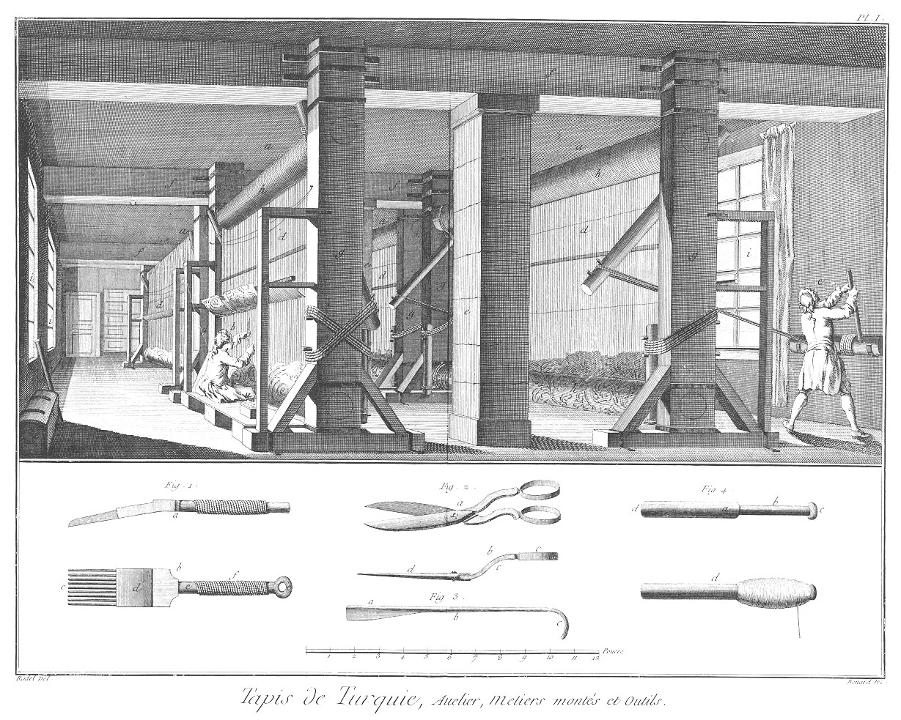
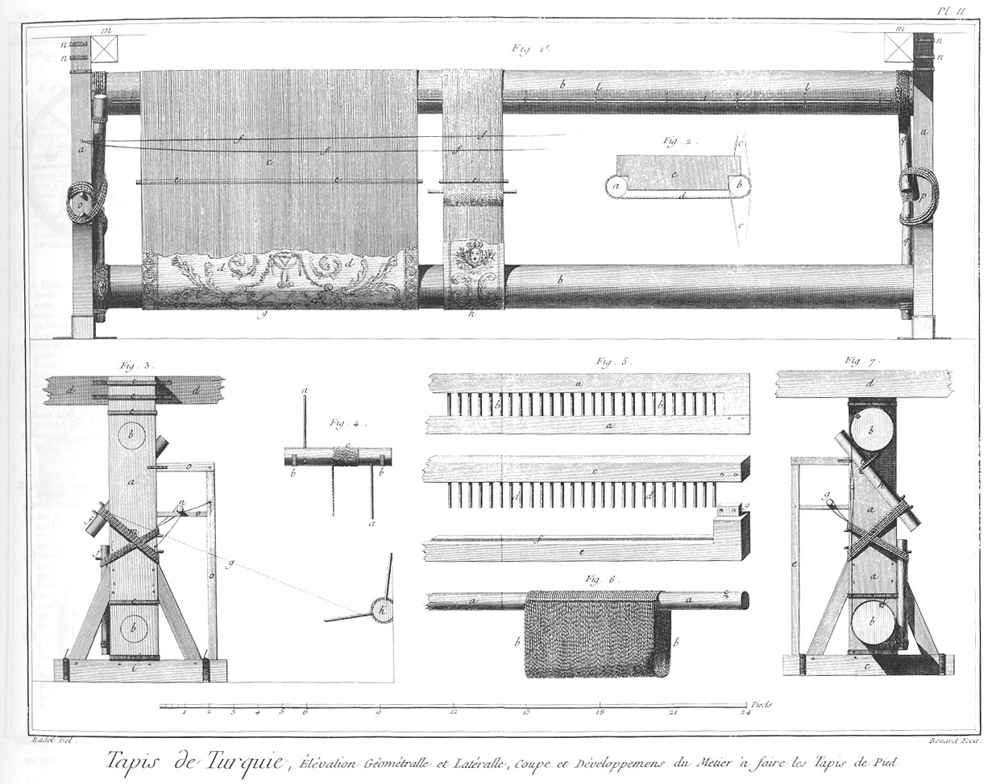
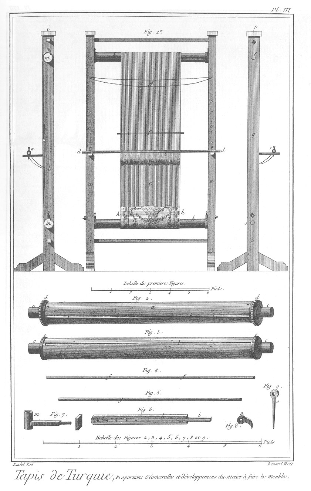
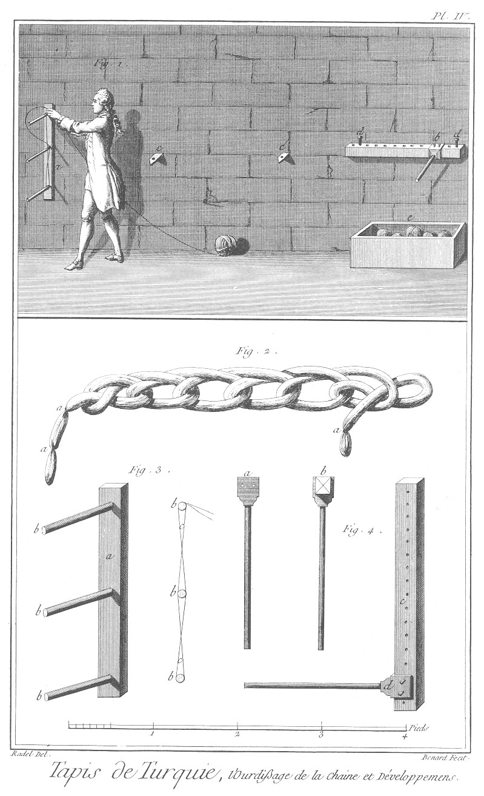
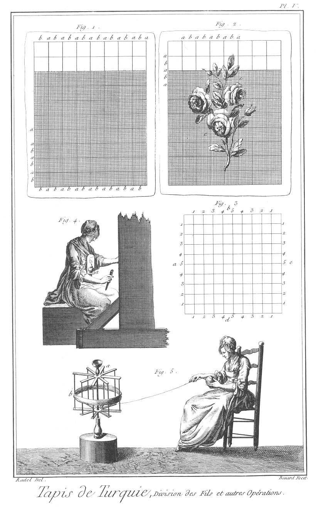
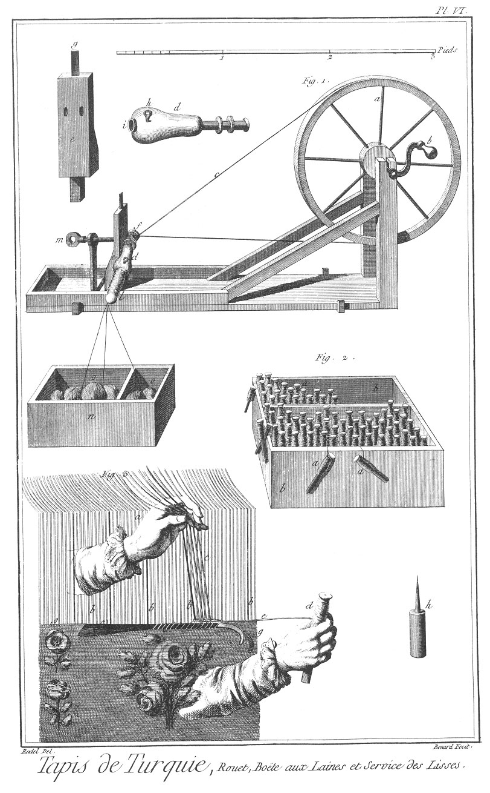
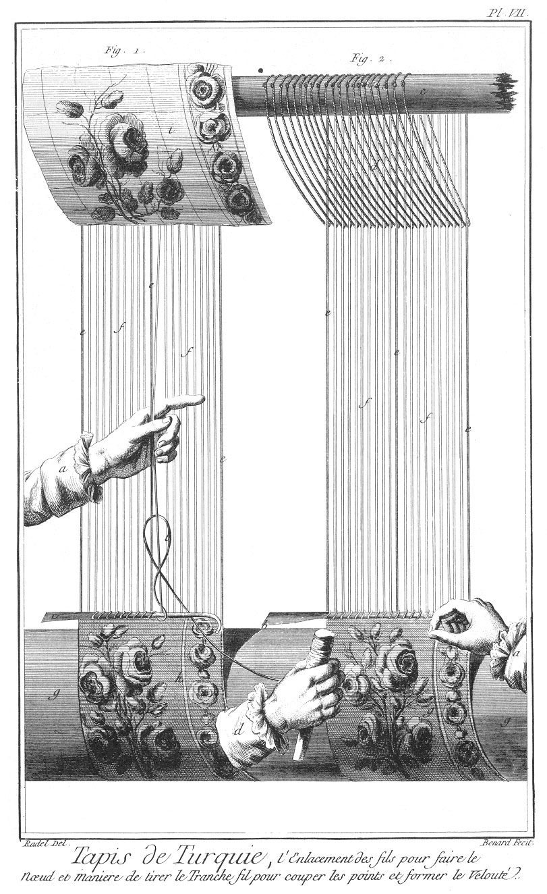
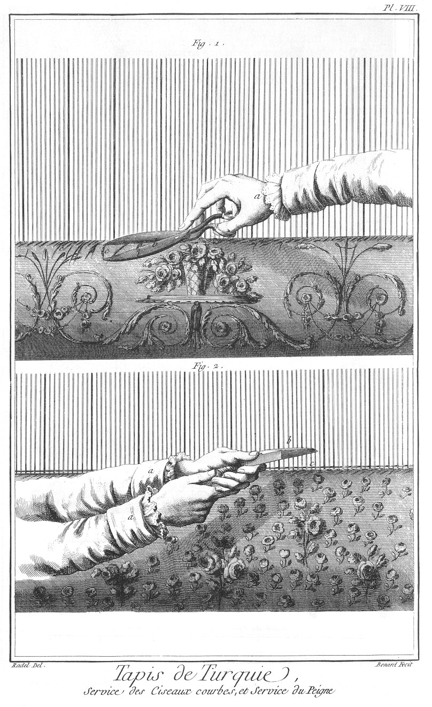

L'ART DE FAIRE DES TAPIS DE PIÉ FAÇON DE TURQUIE
================================================

Contenant dix Planches, à cause de deux doubles. 

PLANCHE Iere.
-------------

Cette Planche représente l'intérieur d'un attelier où sont montés des métiers à faire des tapis de pié.
	- a a a a, Métiers sur lesquels sont montés les chaînes.
	- b, ouvrier occupé à travailler.
	- c, ouvrier occupé au treuil pour bander sur le métier les chaînes.
	- d d d d, chaînes.
	- e e, piliers de pierre qui servent à porter les milieux des poutres du plancher.
	- f f f f f, poutres du plancher sur lesquels sont arrêtés les métiers.
	- g g g, montants ou cotrets.
	- h h h, ensouple. Voyez les détails du métier à la Planche suivante.
	- j j j, croisées de l'attelier.

Fig.
1. Proportions & figures géométrales du peigne de fer qui sert à serrer les fils qui forment le tissu de l'ouvrage.
	- a, figure de profil du peigne.
	- b, peigne vu par-dessus.
	- c, dent du peigne.
	- d, partie plate de fer, servant à donner du poids aux dents.
	- e e, manche du peigne.
	- f, partie du manche garni d'étoffe pour le tenir plus facilement.

2. Proportions & figure des ciseaux.
	- a, vue perspective des ciseaux.
	- b, profil & proportion des ciseaux.
	- c, partie courbe des branches des ciseaux.
	- d, lame.
	- e, oeils des ciseaux.

3. Proportion du tranche-fil.
	- a, lame du tranche-fil qui sert à couper les boucles formées par les noeuds sur la partie b.
	- b, partie du tranche-fil sur laquelle se forme les boucles.
	- c, partie courbe du tranchefil, dans laquelle l'ouvrier passe le doigt pour le tirer & couper les boucles.

4. Proportion de la broche.
	- a, partie de la broche que l'on nomme quend.
	- b, partie de la broche où l'on met les laines.
	- c, tête de la broche.
	- d, broche chargée de laine.

PLANCHE II.
-----------

Fig.
1. Vue géométrale & proportion d'un métier à faire des tapis de pié façon de Turquie.
	- a a, cotret vu de face sur lequel sont assemblés les tourillons des rouleaux ou ensouples.
	- b b, les rouleaux ou ensouple d'en-haut, sur lequel sont roulées les chaînes, & d'en-bas, sur lequel se roule l'ouvrage fait.
	- c c, chaînes pour former le tissu de l'ouvrage.
	- d d, tapis fait se roulant sur l'ensouple d'en-bas.
	- e e e, bâton d'entre-deux pour séparer les fils de croisure.
	- f f f, ficelles de croisure.
	- g, grand tapis de pié façon de Turquie.
	- h, portiere ou meuble façon de Turquie.
	- j j, verguillon pour retenir les boucles des chaînes dans la nervure faite dans l'ensouple.
	- l l, petite broche de fer qui retient le verguillon dans la nervure.
	- m m, poutres du plancher auxquelles est attaché le cotret du métier.
	- n n n n, étriers de fer qui attachent les cotrets aux poutres du plancher.
	- o, face d'un cotret, & la maniere dont sont noués les ardieres ou leviers aux cotrets par des cordes que l'on nomme commandes.
	- p, autre face du cotret vu par-derriere.
	- q q q q, leviers ou ardieres pour bander les chaînes sur les ensouples.

2. Maniere de faire les lisses.
	- a, bâton du lisse.
	- b, bâton de croisure passé dans l'entre-deux des chaînes, pour reprendre le fil de derriere avec la lisse, pour le faire avancer & former la croisure.
	- c c, entre-deux des fils de la chaîne.
	- d, ficelle que l'on nomme lisse croisée, sur le fil de derriere pour le faire avancer.
	- e, petit instrument de fer que l'on nomme calaix, échancrée par les bouts, pour s'appuyer sur les bâtons des lisses & de croisure.

3. Vue du métier par le côté.
	- a, cotret.
	- b b, emboîtures des tourillons des ensouples.
	- c c, étrier de  fer pour retenir les cotrets sur les poutres.
	- d d, poutre sur laquelle est attaché le cotret. e e e, lien de fer qui tient les extrémités des cotrets pour les empêcher de se fendre.
	- f f, leviers ou ardieres pour bander les ensouples.
	- g, ligne ponctuée qui marque l'angle de direction que la corde prend pour tirer l'ardiere par le moyen du treuil.
	- h, profil du treuil sur lequel se roule la corde à bander.
	- j, patin de charpente dans lequel est assemblé le bas du cotret.
	- l l, étrier de fer qui retient les patins par terre.
	- m, corde ou commande qui noue les ardieres aux cotrets.
	- n, profil de la perche de lisse avec son support en menuiserie assemblée. ooo, support de la perche de lisse.

4. Le treuil à bander.
	- a a, bâtons pour le faire tourner.
	- b b, forts crochets de fer courbés, dans lesquels tourne le treuil.
	- c, corde à bander.

5. Vautoir pour mener également les chaînes sur les ensouples.
	- a a, morceaux de menuiserie assemblés.
	- b b, dents de fer entre lesquelles passent les fils.
	- c, piece du vautoir dehors son tenon pour voir les dents développées.
	- d d, dents dehors leur emboîture.
	- f, emboîture des dents du vautoir.
	- g, tenon des extrémités du vautoir qui entre dans la mortaise supérieure, y est attachée par des petites broches de fer.

6. 
	- a, a, bâton des lisses.
	- b, b, ficelles qui forment les lisses.
	- c, trou pour la broche de fer.

7. Coupe d'un métier avec ses proportions géométrales.
	- a a, cotrets.
	- b b, ensouple.
	- c, patin.
	- d, poutre du plancher sur laquelle est attaché le cotret.
	- e, support de la perche de lisse.
	- h, ardier, fort morceau de bois arrêté avec un fort cable autour de l'ensouple, lequel tourné avec force, fait tourner l'ensouple & bander les chaînes sur le métier.
	- j j, cable ou corde arrêtée autour de l'ensouple avec une forte chevrette de fer qui lui sert d'arrêt.
	- l l, coupe de l'ensouple avec le verguillon.

PLANCHE III.
------------

Fig. Petit métier pour faire des meubles façon de Turquie sur ses proportions géométrales.
	- a a, cotrets.
	- b b, ensouples.
	- c c, chaîne tendue sur les ensouples.
	- d d, perche de lisse dessus ses supports & retenue par une cheville de fer.
	- e e, trous pratiqués dans les cotrets pour baisser les supports des lisses.
	- f, bâton d'entre-deux.
	- g, ficelle de croisure.
	- h, ouvrage fait.
	- j, coupe du petit métier.
	- l, cotret avec son patin.
	- m m, coupe des ensouples.
	- n, bâton de lisse avec son support.
	- o, chaîne sur le métier.
	- p, profil du petit metier.
	- q, profil du cotret du petit métier avec son patin.
	- r, profil du support de la perche de lisse.
	- s s, trous des tourillons des ensouples.

2. &
3. &
4. &
5. &
6. &
7. &
8. Détails en grand du petit métier à faire des meubles.
	- a, ensouple d'en-haut.
	- b, verguillon.
	- c c, tourillons des ensouples.
	- d d, roue dentée à l'extrémité de l'ensouple d'en-haut pour la tenir en arrêt.
	- e e, bout freté & percé de l'ensouple d'en-bas pour recevoir les chevilles qui le tiennent en arrêt.
	- f, bâton d'entre-deux pour séparer les croisures.
	- g, perche de lisse.
	- h, support de la perche de lisse.
	- j, partie du support qui entre dans les trous du cotret de la fig. 1. marquée c.
	- l, trou de support pour retenir la perche de lisse par le moyen d'une broche.
	- m, douille avec son écrou pour l'assurer au cotret & arrêter l'ensouple.
	- n, petit morceau de fer pour arrêter les dents de la roue dentée de l'ensouple d'en-haut.
	- o, piton, alonge, quend, pour mettre dans le tinguet & arrêter l'ensouple.

PLANCHE IV.
-----------

Fig.
1. Ouvrier occupé à ourdir une chaîne contre un mur.
	- a, formation de la grande croisée.
	- b, cheville pour la petite croisée.
	- c, fer scellé dans le mur pour rapprocher le bois de la petite croisée & faire la chaîne plus ou moins longue, selon la grandeur des tapis.
	- d, clou de fer pour arrêter le bois de la petite croisée.
	- e, boîte où l'on met les pelotes de laine, les unes bleues & les autres blanches.

2. Maniere d'enlacer une portée de chaîne ourdie pour qu'elle ne se mêle point.
	- a a a, liens que l'on met aux croisures pour les indiquer.

3. Trait de la grande croisée.
	- a, piece de bois dans lequel sont emmanchées trois chevilles.
	- b b b, chevilles.
	- c c, laine nommée chaîne, fermant la grande croisée sur les trois chevilles.

4. Ajustement de la cheville pour la petite croisée.
	- a, cheville de fer vue par-dessus avec ses trous pour l'arrêter.
	- b, cheville vue de côte, c bois avec ses trous pour arrêter la cheville de fer.
	- d, fer monté sur son bois & arrêté par des chevillettes.

PLANCHE V.
----------

Fig.
1. Papier imprimé par une planche de cuivre, & divisé également par dixaine de ligne qui marque la division de dix fils de chaîne qu'il y a entre les fils bleus, pour suivre exactement le dessein tracé dessus.
	- a a a a a, division des fils bleus qui marquent les dixaines.
	- b b b b b, fils en chaîne blanc au nombre de dix, qui servent d'entre-deux aux fils bleus.

2. Papier de même division que le premier où est tracé un bouquet de roses, pour reconnoître par la division des lignes la quantité de la division des chaînes de l'ouvrage, de maniere qu'en comptant ces lignes du dessein & les chaînes de l'ouvrage, l'on puisse par leurs rapports égaux trouver le trait & la dégradation des couleurs.
	- a a a, divisions des fils bleus.
	- b b b, petite division des dixaines.
	- c c, bouquet de roses dessiné & peint.

3. Division d'un carreau de dixaine & la maniere de compter aux jeunes éleves en nommant dessus & dessous, en montant & descendant, & sur la largeur, par les noms de deçà & de delà, les points que les numéros servent à marquer comme deux dessus, deux dessous, deux deçà, deux delà pour la largeur.
	- a, b, c, d, nombres d'indications.

4. Femme travaillant à la lumiere.
	- a, plaque de fer blanc attachée à l'estomac de l'ouvriere.

5. Ouvriere occupée à dévider un écheveau de laine & en faire un peloton.
	- a, tournette.
	- b, écheveau de laine.

PLANCHE VI.
-----------

Fig.
1. Rouet à devider les pelotes sur les broches.
	- a,  grande roue.
	- b, manivelle pour tourner la roue.
	- c, corde à faire tourner.
	- d d, bobines creuses dans lesquelles se mettent les queues de la broche.
	- e e, poupée dans laquelle sont emmanchés deux collets de cuir pour retenir la bobine.
	- f, collet de cuir retenant la bobine.
	- g, lame de fer pour couper les fils.
	- h, petite clavette de fer pour serrer les broches dans les bobines.
	- j, trou pour mettre le quend de la broche.
	- l, broche se remplissant.
	- m, vis pour approcher ou éloigner la poupée.
	- n, boîte pour contenir les pelotes.
	- o, pelote se dévidant sur les broches.

2. Boîte remplie de broches chargées de laine de différentes couleurs assorties, que les ouvriers mettent à leur côté pour travailler.
	- a a a a, broches assorties.
	- b b, boîte avec séparation.

3. Service de lisse pour passer dans les croisures un fil avec la broche afin d'arrêter les noeuds du velouté fait sur les chaînes.
	- a, main tirant les lisses.
	- b b, divisions des dixaines de fils.
	- c, croisures.
	- d, main tenant la broche & la faisant passer par les croisures.
	- e, fil.
	- f, tranche-fil.
	- g, petit trait qui marque les bords du velouté.
	- h, petit poinçon qui sert à arranger les points & piquer les desseins.

PLANCHE VII.
------------

Fig.
1. Enlacement du fil pour faire le noeud.
	- a, main qui tient la chaîne pour l'avancer & passer la broche.
	- b, fil formant le noeud.
	- c, tranche-fil autour duquel se forme le point.
	- d, main tenant la broche pour passer dans le noeud.
	- e e e, fils bleus qui marquent les dixaines.
	- f f, divisions des dixaines.
	- g, ensouple au rouleau.
	- h, ouvrage fait.
	- j, dessein attaché dessus la perche de lisse pour être à la vue de l'ouvrier.

2. Maniere de tirer le tranche-fil pour couper les points & former le velouté.
	- a, main tenant avec le doigt dans le crochet du tranche-fil.
	- b, lame & tranchant du tranche fil prêt à passer dans les points.
	- c, perche de lisse.
	- d, lisse passant dans la croisure pour les faire avancer.
	- e f. Voyez la fig. 1. de cette Planche.
	- g, ouvrage fait.

PLANCHE VIII.
-------------

Fig.
1. Maniere de se servir des ciseaux courbes.
	- a, main tenant les ciseaux dans les anneaux avec le pouce & le petit doigt pour les ouvrir & fermer, & donner la facilité d'appuyer sur les lames le doigt afin de mettre de niveau à l'ouvrage les longs fils.
	- b, ciseaux courbes.
	- c c, fil plus long que les autres, causé par les changemens de couleurs.

2. Service du peigne. a main occupée à battre avec le peigne sur les fils passés sur les noeuds dans les croisures pour les séparer également & serrer.
	- b, peigne.
	- c, fil passé dans les croisures dessus les noeuds veloutés, & se serrant avec le peigne.

[->](../18-Tapissier/Légende.md)
