TAPISSIER
=========

Contenant dix-huit Planches, à cause de quatre doubles. 

PLANCHE Iere.
-------------

[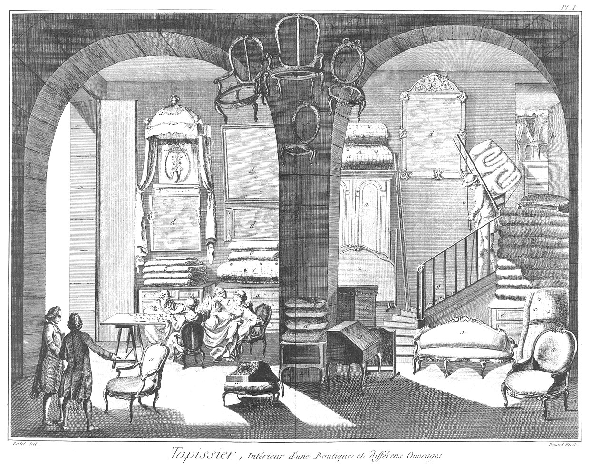](Planche_01.jpeg)

Cette Planche premiere représente l'intérieur d'une boutique & différens ouvrages.

	- a, a, a, a, a, a, meubles de toutes les especes.
	- b, b, b, tapisserie ployée.
	- c, c, c, matelas roulés.
	- d, d, d, plusieurs formes de miroirs ou glaces pour la garniture des appartemens.
	- e, e, e, commode & espece d'armoire à grands tiroirs.
	- f, f, f bois de chaise sans garniture.
	- g, escalier montant au magasin.
	- h, porte du magasin.
	- i, porte-faix chargé de matelas sortant du magasin.
	- l, l, l, plusieurs ouvrieres tapissieres cousant sur une table des lés d'étoffes pour tenture & rideaux.
	- m, maître tapissier examinant un fauteuil.

PLANCHE II.
-----------

[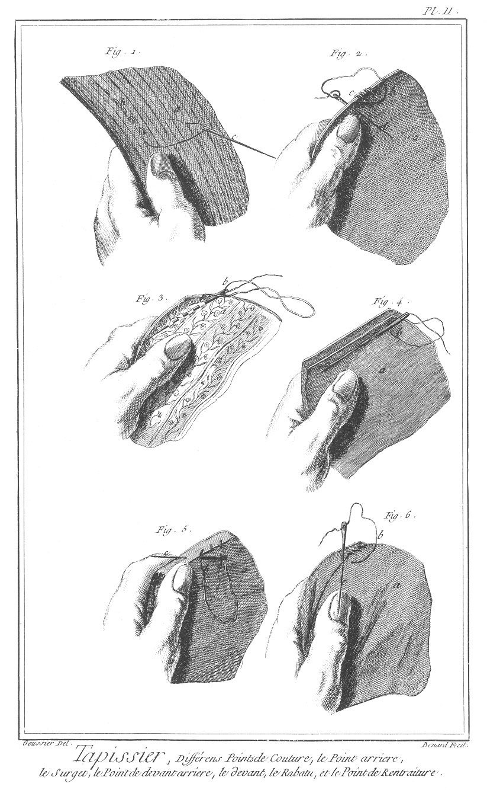](Planche_02.jpeg)

Points de couture.

Fig.
1. Point arriere qui s'emploie pour les coutils.
	- a, étoffe.
	- b, figure du passage du fil pour coudre l'étoffe.
	- c, aiguille.

2. Surjet.
	- a, étoffe.
	- b, extrémité, autrement ourlet de l'étoffe ployé pour soutenir le point de couture.
	- c, passage du fil qui forme le surjet.
	- d aiguille.

3. Point de devant arriere ; on l'emploie dans les toiles peintes & autres.
	- a, étoffe.
	- b, passage du fil qui forme ce point.
	- c, aiguille.

4. Point de devant employé ordinairement pour les satins & toutes les étoffes sujettes à s'érailler.
	- a, étoffe.
	- b, passage du fil qui forme ce point.
	- c, aiguille.

5. Point de couture rabattu.
	- a, étoffe.
	- b, passage du fil qui forme ce point.
	- c, aiguille.

6. Point que l'on nomme rentraiture.
	- a, étoffe.
	- b, passage du fil qui forme ce point.
	- c, aiguille.

PLANCHE III.
------------

[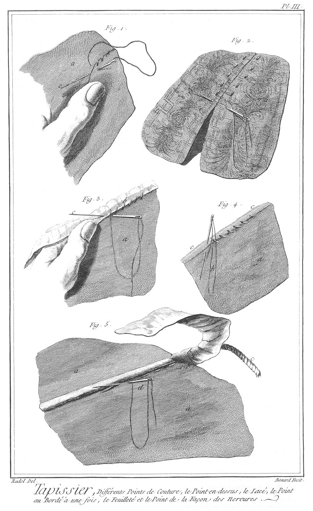](Planche_03.jpeg)

Point de couture.

Fig.
	1. Point en-dessus.
	- a, étoffe.
	- b, passage du fil qui forme ce point. c aiguille.

2. Point lacé qui s'emploie pour les tapis de pié, ainsi que pour les étoffes très-épaisses.
	- a, étoffe.
	- b, fil qui forme le point lacé, ne prenant que la demi-épaisseur de l'étoffe pour serrer les deux lisieres ensemble.
	- c, aiguille.

3. Point servant au border à une fois.
	- a, étoffe.
	- b, point qui comprend le dessus & dessous du ruban qui borde l'étoffe.
	- c, aiguille.
	- d, ruban qui sert à border.

4. Point feuilleté.
	- a, étoffe.
	- b, fil formant le point de côté ou feuilleté.
	- c, partie de doublure rabattue avec l'étoffe sur les bords & retenue par le point feuilleté.

5. Façon de nervures.
	- a a, l'étoffe du carreau.
	- b, bande d'étoffe qui enveloppe la ficelle. c ficelle.
	- d, fil formant le point de la nervure & cousant ensemble les deux joints de l'étoffe du carreau, le restant qui déborde de l'enveloppe de la ficelle, sert de nervure.
	- e, bord de l'étoffe du carreau qui ne laisse déborder que la ficelle enveloppée d'étoffe servant de nervure.

PLANCHE IV.
-----------

[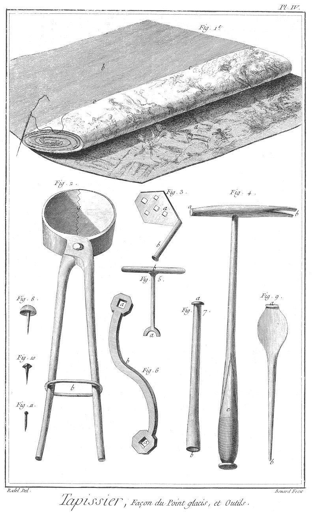](Planche_04.jpeg)

Fig.
1. Point que l'on nomme glacis, qui sert à attacher les doublures aux étoffes.
	- a, étoffe roulée posée sur la doublure.
	- b, doublure.
	- c c, point que l'on nomme glacis.

2. Tenaille à sangler ; elle sert ordinairement à serrer avec ses dents les sangles qui servent de fond à tous les meubles & bander lesdites sangles, afin de la broqueter.
	- a, dents de la tenaille.
	- b, anneau de fer qui sert à serrer les branches de la tenaille. 

3. Tourne-vis en fer.
	- a, trou pour passer la tête des vis dans la platine.
	- b, manche du tourne-vis.

4. Marteau du tapissier.
	- a, partie plate du marteau pour donner le coup.
	- b, partie opposée à la précédente & échancrée pour arracher les clous.
	- c, manche en bois.

5. Autre tourne-vis en fer pour les vis à tête ronde & échancrée de chaque côté.
	- a, partie du tournevis pour placer dans les échancrures de la tête de la vis.
	- b, poignée du tourne-vis.

6. Grande clé à vis.
	- a a, trous dans lesquels se place la tête des vis.
	- b, branche courbée de deux sens pour lui donner plus de force dans son abattage.

7. Repoussoir servant à enfoncer le clou doré dans l'angle enfoncé, afin que le marteau ne gâte point la dorure.
	- a, tête du repoussoir pour recevoir le coup du marteau.
	- b, extrémité concave du repoussoir pour envelopper la tête du clou doré & l'enfoncer.

8. Clou doré servant à attacher l'étoffe sur les meubles.

9. Poinçon pour faire le trou à placer le clou doré.
	- a, tête du poinçon.
	- b, pointe du poinçon.

10. Petit clou de fer que l'on nomme broquette, qui sert à tendre les tapisseries & toutes les étoffes en général.

11. Clou d'épingle en cuivre, servant à broqueter les étoffes de soie pour la tenture.

PLANCHE V.
----------

[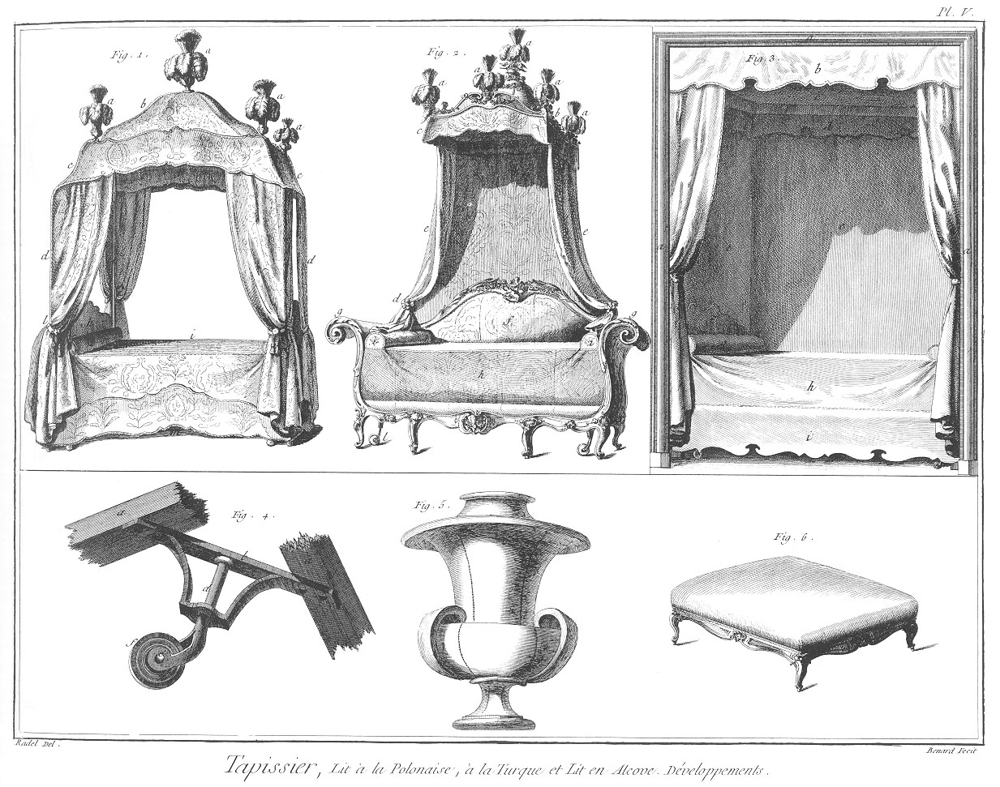](Planche_05.jpeg)

Des lits.

Fig. 1. Lit à la polonnoise.
	- a, plumet de plume d'autruche.
	- b, baldaquin.
	- c c, pente festonnée tenant au baldaquin & prenant la courbe des S de fer qui sortent des colonnes du lit pour soutenir ledit baldaquin.
	- d d, rideaux du lit tenant aux-dites colonnes.
	- e, colonne de lit garnie d'étoffe.
	- f, petite pente intérieure du baldaquin.
	- g, traversin.
	- h, dossier.
	- i, courtepointe.
	- l, agraffe en étoffe avec rosette & gland pour retenir les rideaux.
	- m, pente du lit.

2. Lit à la turque. a plumet de plume d'autruche.
	- b, baldaquin couronné, guirlandé, doré.
	- c, pente du baldaquin.
	- d, petite pente intérieure du baldaquin.
	- f, grand dossier appuyé contre le mur.
	- g g, tête & pié du lit contournés en volute.
	- h, courtepointe.
	- i, traversin.
	- l, roulette pour écarter facilement le lit du mur.
	- m, agraffe d'étoffe en rosette garnie de milleret, pour tenir les rideaux.

3. Lit en niche ou alcove.
	- a, encadrement de l'alcove.
	- b, pente extérieure du ciel.
	- c, ciel du lit d, petite pente intérieure du ciel.
	- e e, garniture intérieure de face de l'alcove.
	- f, dossier.
	- g, traversin.
	- h, courtepointe. i pente de la courtepointe.

4. Roulette du bois de lit.
	- a a, bandes du bois de lit, sur lesquelles est vissé le bâti de la roulette.
	- b, bâti de fer de la roulette.
	- c, oeil de cuivre dans lequel tourne le pivot de la roulette.
	- d, pivot de la roulette.
	- e, boulon de fer qui enfile la roulette dans son pivot.
	- f, roulette de bois. Voyez son service, fig. 2. de cette Planche, à la lettre l.

5. Vase en carton cousu que l'on garnit par-dessus d'étoffe & de milleret que l'on met sur le baldaquin avec un plumet, ce qui sert à le couronner.

6. Petit tabouret de pié.

PLANCHE VI.
-----------

[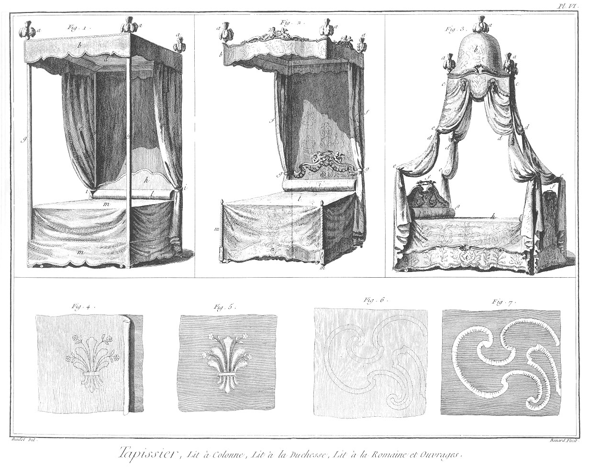](Planche_06.jpeg)

Fig.
1. Lit à colonne.
	- a, plumet.
	- b, pente de l'impériale.
	- c, petite pente intérieure de l'impériale.
	- d, ciel de l'impériale.
	- e, rideaux.
	- f, fond de garniture du dossier.
	- g, colonne garnie d'étoffe qui soutient l'impériale.
	- h, dossier.
	- i, agraffe d'étoffe qui retient les rideaux.
	- l, traversin.
	- m, courtepointe.
	- n, pente sans bois qui s'agraffe à la courtepointe & aux colonnes.

2. Lit à duchesse.
	- a, plumet.
	- b, pente extérieure de l'impériale.
	- c, pente intérieure de l'impériale.
	- d, ciel de l'impériale.
	- e, garniture derriere le dossier.
	- f f, rideaux.
	- g g, agraffes en étoffe du rideau.
	- h, dossier.
	- i, chevet.
	- l, courtepointe. m pié doré du lit.
	- n, pente de la courtepointe.

3. Lit à la romaine.
	- a, plumet.
	- b, baldaquin.
	- c, pente du baldaquin garnie de frange & de glands.
	- d, rideaux retroussés sur les courbes de fer portant le baldaquin.
	- e e, agraffes en étoffe avec des glands pour retrousser les rideaux.
	- f, dossier.
	- g, chevet.
	- h, courtepointe.
	- i, pente de la courtepointe.

4. Satin colé derriere un papier dessiné & découpé.

5. Satin découpé suivant le dessin & appliqué sur la serge dont un côté est bordé de milanoise.

6. Papier dessiné & piqué sur le contour pour poncer sur la serge, & autre étoffe pour tracer & coudre sur les traits des rubans de couleur.

7. Piece d'étoffe sur laquelle sont cousus des rubans suivant la figure précédente.

PLANCHE VII.
------------

[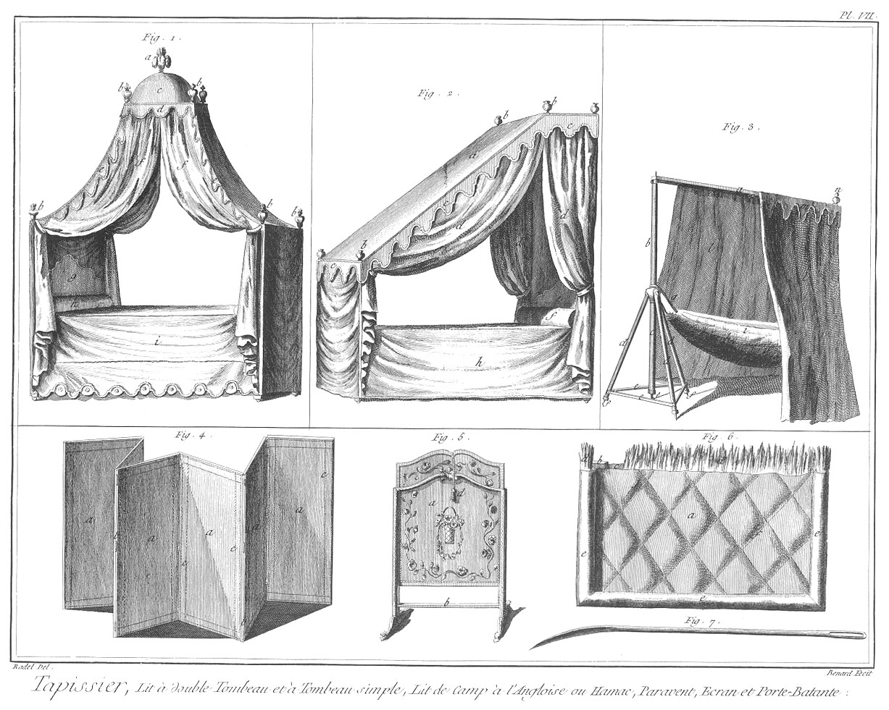](Planche_07.jpeg)

Fig.
1. Lit à double tombeau.
	- a, plumet. b petit vase de bois garni d'étoffe.
	- c, baldaquin.
	- d, pente du baldaquin.
	- e e, pente bordant les courbes formant le double tombeau.
	- f f, rideaux retroussés.
	- g, dossier.
	- h, traversin.
	- i, courtepointe portant sa pente.

2. Lit à tombeau simple.
	- a, partie de ciel formant le tombeau.
	- b, petit vase de bois garni d'étoffe.
	- c, pente faisant le tour du tombeau.
	- d, rideau retroussé.
	- e, dossier.
	- f, chevet.
	- h, courtepointe.

3. Lit de camp à l'angloise, ou hamac servant pour le voyage.
	- a, traverse du haut se pliant en deux étant assurée par un crochet; cette traverse sert à contenir le lit.
	- b, montant avec broche de fer pour retenir la traverse.
	- c, autre montant soutenant la noix creusée pour recevoir le premier.
	- d, étai assemblé en tournant dans la noix.
	- e, grand crochet de fer allant d'un étai à l'autre pour les contenir.
	- f, piquet de fer pour arrêter en terre tout l'assemblage.
	- g, corde passée sur la noix & sur le premier montant, laquelle corde porte le hamac.
	- h, hamac, espece de matelas mince & piqué, composé d'étoffe très-chaude.
	- i, agraffes qui servent à fermer le hamac, quand on est couché, pour avoir plus chaud.
	- l, rideau ou petite tente qui enveloppe toute la machine.
	- m, pente qui couronne la petite tente.
	- n, petit vase de bois garni d'étoffe.

Cette machine se plie à la longueur de trois piés & se met dans une valise.

4. Paravent à cinq feuilles.
	- a, étoffe.
	- b, couplets qui servent à plier les feuilles l'une sur l'autre.
	- c, clou doré.

5. Ecran.
	- a, piece d'étoffe.
	- b, bâti de l'écran.
	- c, clou doré.
	- d, gland dans lequel il y a un plomb qui sert de poignée.

6. Façon de porte battante.
	- a, toile verte.
	- b, chassis de bois.
	- c, entre-deux de la toile verte où se met la garniture en paille.
	- d, paille servant de garniture.
	- e, bourlet pour empêcher l'air de passer par le joint de la porte.
	- f, piquure.

7. Quarrelet servant aux tapissiers pour piquer & soutenir le bourlet du meuble, ainsi que la piquure de porte battante.

PLANCHE VIII.
-------------

[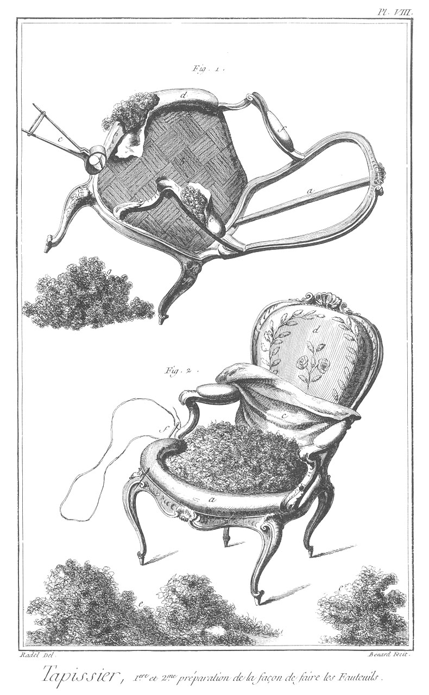](Planche_08.jpeg)

Fig. 1. Façon de fauteuil.
	- a, bois de fauteuil.
	- b, sangle tendue par la tenaille & broquetée.
	- c, service de la tenaille à sangler.
	- d, bourlet commencé.
	- e, bras du fauteuil commencé.
	- f, bras du fauteuil à nud.
	- g, tas de crin.

3. Façon du fauteuil.
	- a, façon du bourlet.
	- b, crin posé sur la sangle & prêt à être couvert.
	- c, premiere couverture du crin qui est en toile.
	- d, dossier du fauteuil fini; ce dossier est à cartouche, c'est-à- dire que la partie du milieu est appliquée.
	- e, tas de crin.

PLANCHE IX.
-----------

[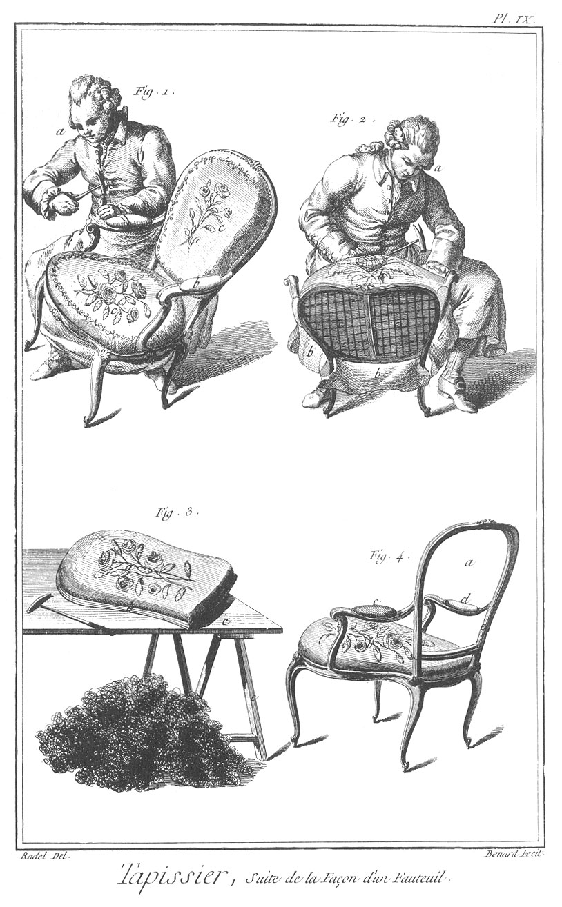](Planche_09.jpeg)

Fig.
1. Façon du fauteuil.
	- a, ouvrier occupé à poser le clou doré, ou préparant le trou avec son poinçon.
	- b, bras du fauteuil que l'on finit de couvrir.
	- c, partie du fauteuil finie.

2. Façon du fauteuil.
	- a, ouvrier occupé à guinder l'étoffe du siége du fauteuil, à la broqueter de distance en distance pour après la couper juste & poser le clou doré.
	- b, partie d'étoffe que l'ouvrier est occupé à poser sur le siége.
	- c c, fond du dossier en toile à carreau.

3. Siége à panneau ou chassis de changement pour les saisons.
	- a, chassis garni prêt à mettre au dossier d'un fauteuil.
	- b, feuillure.
	- c, table sur laquelle on travaille.
	- d, tas de crin.
	- e, tréteaux de la table.

4. Fauteuil à panneau.
	- a, dossier prêt à recevoir son chassis.
	- b, siége du fauteuil fait, c, bras fait.
	- d, mortaise du bras prêt à recevoir celui de changement.
	- e, feuillure prête à recevoir le chassis de changement.

PLANCHE X.
----------

[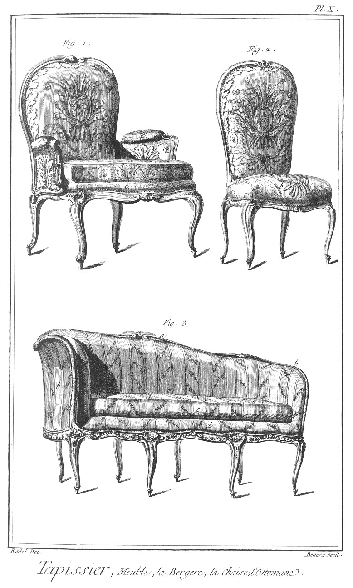](Planche_10.jpeg)

Fig.
1. Bergere.
	- a, dossier.
	- b, carreau.
	- c, bourlet,
	- d, bras.
	- e, clou doré.

2. Chaise.
	- a, dossier.
	- b, siége de la chaise.
	- c, clou doré.

3. Otomane.
	- a, dossier.
	- b, partie du dossier en retour sur le côté.
	- c, carreau.
	- d, bourlet.
	- e, clou doré.

PLANCHE XI.
-----------

[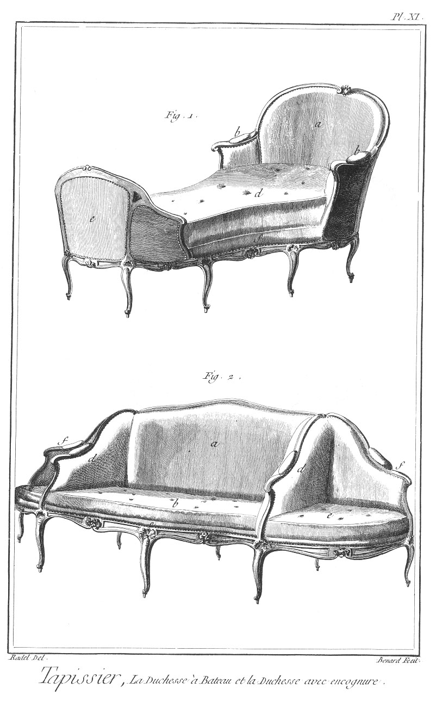](Planche_11.jpeg)

Fig.
1. Duchesse à bateau.
	- a, dossier en demi-cercle.
	- b, bras.
	- c, joue.
	- d, carreau.
	- e, petit dossier du pié de la duchesse à bateau.
	- f, bourlet.

2. Duchesse avec encoignure.
	- a, dossier.
	- b, carreau.
	- c, bourlet.
	- d, bras de la duchesse séparant les encoignures.
	- e, petit carreau des encoignures.
	- f, bras des encoignures.

PLANCHE XII.
------------

[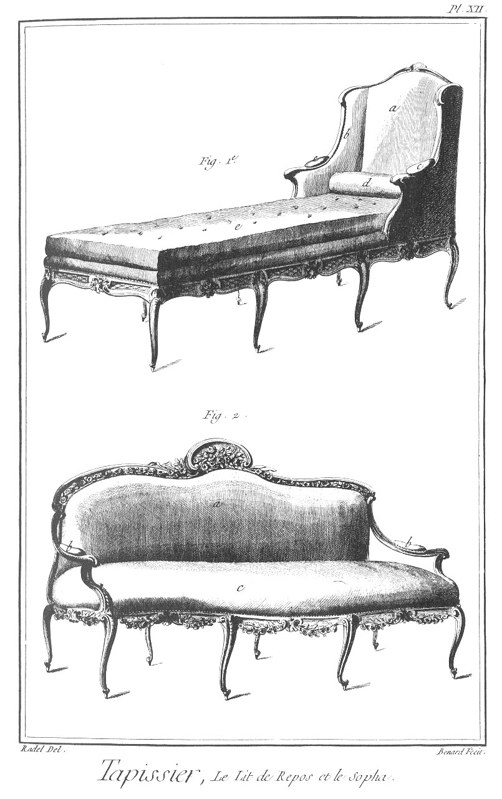](Planche_12.jpeg)

Fig.
1. Lit de repos.
	- a, dossier.
	- b, joue du dossier.
	- c, bras.
	- d, coussin.
	- e, petit matelas ou carreau.
	- f, bourlet.

2. Sopha.
	- a, dossier.
	- b, bras à jour sans garniture.
	- c, siége.

PLANCHE XIII.
-------------

[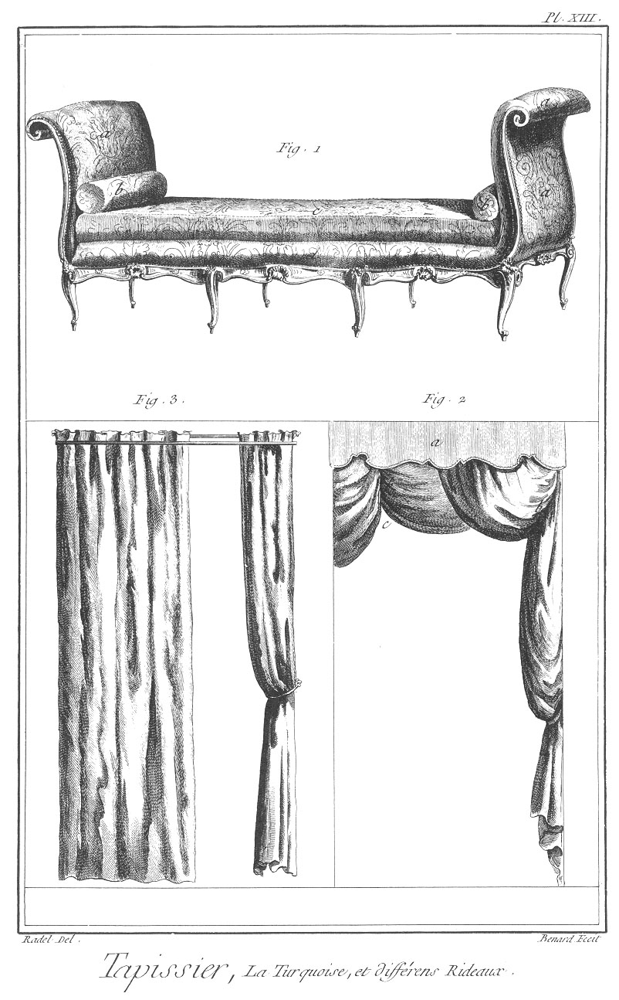](Planche_13.jpeg)

Fig.
1. Turquoise.
	- a a, dossiers garnis en forme de volute.
	- b, petit coussin.
	- c, petit matelas,
	- d, bourlet.

2. Rideaux de croisée retroussés à l'italienne.
	- a, planche chantournée pour cacher le haut du rideau.
	- b, retroussi du rideau qui se fait par le moyen des anneaux cousus diagonalement de distance egale, dans lesquels passe un cordon qui étant attaché à l'anneau du bas & guindé dans une poulie qui est posée dans l'angle de la croisée, fait l'effet du premier retroussi.
	- c, retroussi d'à-plomb; ce qui se fait en cousant les anneaux d'à-plomb.

3. Rideau ordinaire qui s'ouvre & se ferme par le moyen des cordons & poulie double.
	- a, rideau fermé.
	- b, rideau ouvert.
	- c, cercle de fer doré pour retenir le rideau.

PLANCHE XIV.
------------

[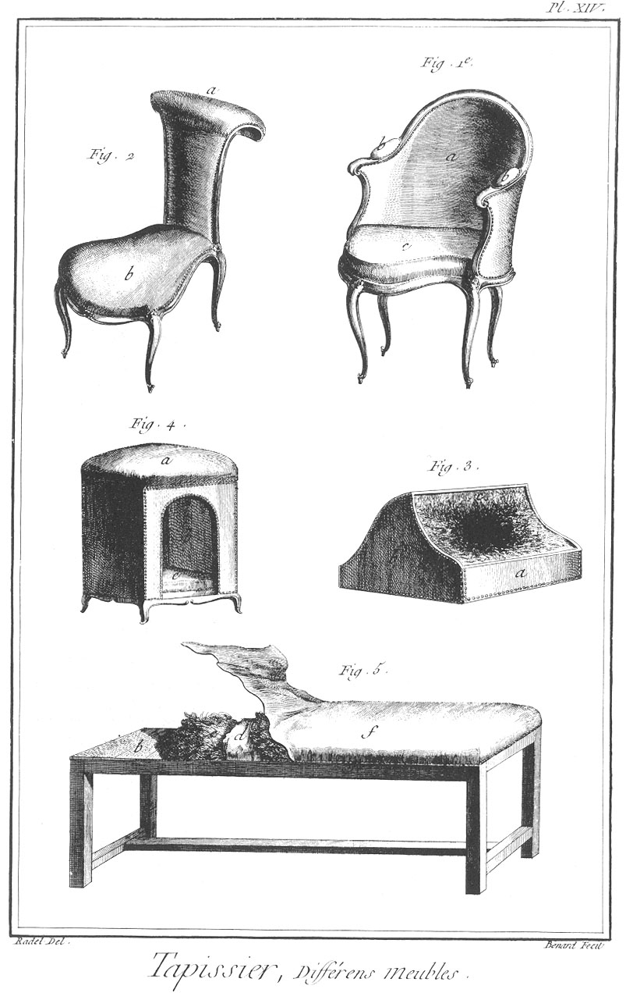](Planche_14.jpeg)

Fig.
1. Siége de bureau garni en maroquin.
	- a, dossier en demi-cercle formant les bras.
	- b, garniture des bras.
	- c, carreau.

2. Voyeuse, espece de chaise pour s'asseoir à cheval & s'accouder sur le dossier pour voir jour.
	- a, dossier courbé.
	- b, forme du siége étroit du côté du dossier, & large sur le devant.

3. Chanceliere.
	- a b, partie de la boîte garnie d'étoffe.
	- c, garniture en peau d'ourse.
	- d, clou doré.

4. Niche à chien.
	- a, partie supérieure servant de siége.
	- b, intérieur de la niche.
	- c, petit matelas ou carreau.

5. Façon de banquette.
	- a, bâti de la banquette en bois.
	- b, fond sanglé.
	- c, premier crin.
	- d, toile ou premiere couverture.
	- e, second crin.
	- f, étoffe de couverture.
	- g, clou doré.

[->](../19-Tapisserie_de_Haute-Lisse_des_Gobelins/Légende.md)
