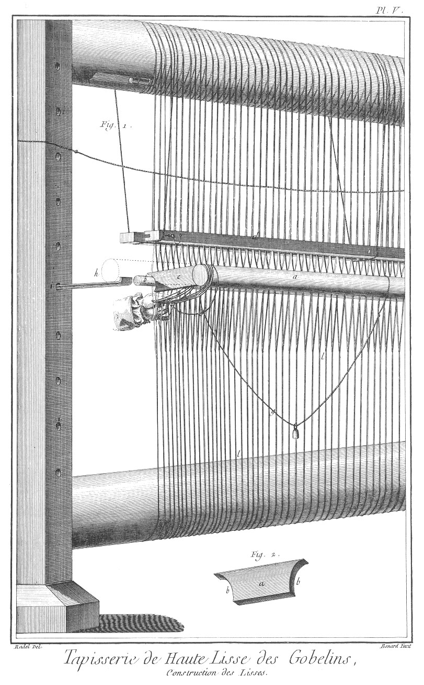

TAPISSERIE DE HAUTE-LISSE DES GOBELINS
======================================

Contenant treize Planches équivalentes à quinze, à cause de deux doubles. 

PLANCHE Iere.
-------------

Cette Planche représente l'intérieur d'un attelier des tapisseries de haute-lisse de la manufacture royale des Gobelins.

Fig.
1.
	- a a a, métier tendu avec les ouvriers occupés à travailler par derriere.
	- b, planchette pour garantir le faux jour de la terre.
	- c c c, grande planche pour empêcher que l'ouvrage ne soit sali.
	- d d, rouleaux sur lesquels se roulent les fils nommés pienes & l'ouvrage fait.
	- e e, tentoir, piece de bois qui sert à bander l'ouvrage.
	- f f f, cotret, montant qui sert à contenir les rouleaux.
	- g, jeune homme occupé à porter des broches pour le changement des couleurs.
	- h, ouvrier occupé à nettoyer avec la pince l'ouvrage fait.
	- i, ouvrier occupé à bander le tentoir d'en bas.
	- l, ouvrier occupé à bander le tentoir d'en-haut.
	- m, ouvrier occupé à chercher dans son coffre les broches de différentes couleurs pour nuancer.
	- n, enfant occupé à porter les écheveaux.
	- o, femme occupée à dévider les écheveaux sur les broches.
	- p p, rouet.
	- q q, étais, pieces de bois qui servent à contenir les métiers.

2. Plan de l'attelier.
	- a a a, plan des métiers.
	- b b b, plan où l'ouvrier se met pour travailler.
	- c c c, croisées pour éclairer les métiers.

PLANCHE II.
-----------

Fig.
1. Vue du métier du côté du jour.
	- a a, rouleau d'en-bas, sur lequel se roule la tapisserie à mesure qu'elle se finit.
	- b b, rouleau d'en-haut, sur lequel sont les pienes qui se déroulent pour fournir à l'ouvrier.
	- c c, cotret, piece de bois plate qui sert d'emboîture à la tête des rouleaux.
	- d d, socle sur lequel est assemblé le cotret. e e e e, tête du rouleau qui s'emboîte dans le cotret.
	- f f, les tentoirs d'en-haut & d'en-bas pour tourner les rouleaux, afin de bander l'ouvrage.
	- g g, arguillere, corde tournée à la tête du rouleau & au tentoir, pour en faire faire le service.
	- h, nervure dans les rouleaux pour placer le verguillon qui est marqué plus en grand dans la fig. 3. de cette Planche. Perche de lisse détaillée plus en grand, Pl. V. marquée a.

2. Vue de côté.
	- a a, mur derriere le métier, sur lequel s'attache le tableau.
	- b b, profil du tableau.
	- c c, bâton ou petit rouleau sur lequel est roulé le tableau que l'ouvrier copie.
	- d d, perche de lisse. Voyez Pl. V. lettre a.
	- e, arguillier, crochet de fer pour soutenir la perche de lisse, détaillée plus en grand, Pl. IX. fig. 4.
	- f f, passage de la tête du rouleau dans le cotret.
	- g, cotret vu du grand côté. Voyez fig. 1. de cette Pl. lettre c.
	- h, siége sur lequel se met l'ouvrier pour travailler.
	- i, socle du cotret vu de côté.

3. Coupe du rouleau en grand pour en voir les détails.
	- a, ligne ponctuée qui marque la tête du rouleau qui s'emboîte dans les cotrets.
	- b, coupe de la nervure où l'on voit la disposition du verguillon.
	- c, coupe du verguillon passé dans les boucles des fils de piene.
	- d, petite broche de fer passée dans le rouleau croisant la nervure pour retenir le verguillon.
	- e e e e, fil de piene tourné autour du rouleau & retenu par le verguillon.

4. Coupe sur le milieu d'un métier.
	- a a, coupe des rouleaux.
	- b, corde à bander, à attacher aux deux tentoirs au cotret.

5. Vue du côté où l'ouvrier travaille.
	- a a, trou dans le cotret pour mettre les arguilliers.
	- b, grande perche de lisse.
	- c, petite perche de lisse. Voyez Planche IX.
	- d, ouvrage sur le métier.

PLANCHE III.
------------

Fig.
1. Service de l'ourdissoir.
	- a a a a, fil déroulé des bobines doublé sur l'ourdissoir ; ce qui forme la  piene composée de huit fils qui divisés en deux, font les croisures.
	- b, piene. Voyez l'article ci-dessus pour sa construction.
	- c d, bâton servant de verguillon pour terminer la longueur de la piene qui fait la largeur de la piece.
	- e, trou pour disposer les différentes portées des pieces plus ou moins grandes.
	- f, talon pour disposer la croisure sur la piece.

2. 
	- a, piece de bois portant des broches de fer pour retenir les bobines.
	- b b, broches de fer.

3. 
	- a, construction de la tête du rouet pour dévider les écheveaux de laine sur les bobines.
	- b, partie de tournette portant les écheveaux.

4. 
	- a, bobine sur laquelle se mettent les fils de laine pour former les pienes sur l'ourdissoir.

PLANCHE IV.
-----------

Service du vautoir. C'est une piece de bois avec des dents de fer espacées également, qui s'emboîtant dans une rainure, fait de deux une égale piece ; ce vautoir sert à espacer également les pienes de huit fils, compris les quatre de croisure ; & lorsque ces fils sont espacés également, à passer le verguillon du rouleau du haut, afin de le placer dans sa nervure.

Fig.
1. Vue du vautoir en état de recevoir les pienes.
	- a, piece de bois avec la rainure pour emboîter les dents de fer.
	- b, dent de fer servant à espacer également les pienes.
	- c c, piece de bois portant les dents de fer.
	- d, fer courbé qui est pour traverser la partie supérieure du vautoir, afin d'y placer la petite clavette e, pour lier les deux parties du vautoir ensemble.
	- f, verguillon passé dans les boucles de piene, prêt a être mis dans la nervure du rouleau haut du métier.
	- g, écheveau de piene prêt à recevoir le verguillon d'en-bas.
	- h h, rouleau d'en-bas sur lequel se passe le vautoir pour disposer les pienes.

2. Coupe du vautoir.
	- a, piece inférieure portant les dents de fer.
	- b, piece de bois supérieure portant la rainure dans laquelle s'emboîtent les dents de fer.
	- c, dent de fer.
	- d, rainure.
	- e e e, fer courbé pour recevoir la clavette.
	- f, trou dans lequel se met la clavette.

3.
	- a, vautoir suspendu pour contenir également les pienes.
	- b b, pienes.
	- c c, ficelle sur laquelle est suspendu le vautoir.
	- d d, boucles de piene, dans lesquelles est passé le verguillon d'en bas.
	- e e, verguillon passé dans les boucles.
	- f f, verguillon dans la nervure du rouleau.
	- g g, ficelle de croisure pour écarter la piene en deux, afin de disposer les lisses.

PLANCHE V.
----------

Fig.
1. Construction des lisses, qui sont des ficelles passées derriere les croisures pour les faire avancer, afin de donner le passage aux laines.
	- a, perche de lisses pour leur construction.
	- b, verguillon passé dans la croisure pour aider à construire les lisses.
	- c, échelete pour borner la longueur des lisses.
	- d. vautoir. Voyez Pl. IV. fig. 1. lettre a.
	- e, lisse.
	- f, las, espece de noeud pour retenir les lisses ensemble.
	- g, ficelle pour former les las.
	- h, arguillier. Voyez Pl. IX. fig. 4.
	- i i i, trou dans la petite face du cotret pour hausser, baisser les arguilliers.
	- l l l, piene tendue sur le métier.

2.
	- a, échelete, morceau de bois pour terminer la longueur des lisses.
	- b b, échancrure circulaire pour appuyer l'échelete sur le verguillon & sur la perche de lisse.

PLANCHE VI.
-----------

Fig.
1.
	- a, ouvrier occupé à bander le tentoir d'en-haut.
	- b, le tentoir.

2.
	- a, disposition des pienes sur le rouleau d'en-haut, pour être bandé.
	- b, gros clou de fer mis dans les trous de la tête du rouleau pour recevoir le noeud.
	- c, noeud de l'arguillier disposé pour bander le tentoir d'en-haut.
	- d, trou pour recevoir le clou.
	- e, nervure pour recevoir le verguillon dans le rouleau.

3.
	- a, ouvrier occupé à bander le tentoir d'en-bas pour rouler sur le rouleau d'en-bas l'ouvrage fait.
	- b, tentoir d'en-bas.
	- c, tentoir d'en-haut détendu pour laisser faire le service de celui du bas.

4.
	- a, disposition de l'ouvrage sur le rouleau d'en-bas.
	- b, noeud de l'arguillier.

PLANCHE VII.
------------

Fig.
1. Métier monté selon le projet de sa nouvelle construction, pour faciliter le bandage des fils sans courir aucun risque pour les ouvriers, & avec deux seuls hommes.
	- a, fils bandés.
	- b b, rouleaux d'en-haut & d'en bas, sur lesquels se roulent les fils de piene & l'ouvrage fait.
	- b b, cotrets séparés & assemblés pour retenir l'essor de la nouvelle jumelle.
	- c c, montans pour soutenir la perche de lisse.
	- d, perche de lisse.
	- e e, nouvelle jumelle du métier de la haute lisse.
	- f f, mouvement en arrêt dans le cotret pour faire monter & descendre plus ou moins la jumelle dans laquelle est assemblé le rouleau, & par ce moyen bander également les fils.
	- g g, ouvrier occupé à faire tourner la manivelle pour bander les fils.

2. Fer du mouvement.
	- a a, bâti de fer qui retient la vis.
	- b b, vis en arrêt dans le bâti par la platine.
	- c, platine qui retient la vis dans le bâti de fer.
	- d, tête quarrée dans laquelle s'emmanche le mouvement de la manivelle pour faire tourner la vis.
	- f f, morceau de fer qui soutient à hauteur le bâti de la manivelle dans la rainure du cotret.

3. Développement du mouvement de la manivelle avec sa roue d'engrenage.
	- a a, roue d'engrenage.
	- b, manivelle.
	- c, tête de la vis.
	- d, morceau de fer tenant ensemble la roue d'engrenage & ajusté pour emboîter le bâti de la vis & enfiler la tête de ladite vis dans la grande roue d'engrenage pour la faire tourner.
	- e e e, lignes ponctuées qui dessinent la forme du bâti de la vis.

4. Jumelle en grand, dans laquelle est emboîté le rouleau d'en-bas.
	- a, tête du rouleau.
	- b b, les deux parties du cotret, dans lesquelles s'emboîte la jumelle.
	- e e e, bâti de fer qui serre les deux parties de la jumelle.
	- d, pas de vis pris dans le chassis de la jumelle avec sa vis pour la faire monter ou descendre à volonté.

PLANCHE VIII.
-------------

Fig.
1.
	- a, rouet pour dévider les soies & laines sur les petites bobines.
	- b, petite bobine recevant le fil de l'écheveau.

2.
	- a, deux petites tournettes portant l'écheveau.

3.
	- a, rouet à mettre les laines sur les broches.
	- b, broche recevant la laine de l'écheveau.
	- c, pomme percée à la tête du rouet, dans laquelle se met la pointe de la broche pour la faire tourner.

4.
	- a, grande tournette pour mettre l'écheveau.
	- b, pié de la tournette où sont des fers pour lever les petites bobines & dévider sur les broches.

PLANCHE IX.
-----------

Fig.
1. Vue du métier du côté où les ouvriers travaillent, avec l'attitude d'un ouvrier dans la disposition de travailler.
	- a, maniere de tenir la broche pour la passer dans les croisures.
	- b, grande perche de lisse.
	- c c c, petites perches de lisse suspendues au grand pas des écheveaux de laine pour baisser les lisses à la portée de l'ouvrier.
	- d d d d, cordage pour attacher au mur & aux petites perches de lisse pour les tenir.
	- e e e, lisses.
	- f, bâton de croisure.
	- g, ficelle de croisure.
	- h, chaîne, ficelle croisée pour contenir les pienes.
	- i. Voyez la fig. 4. de cette Planche.
	- l, planche inclinée pour parer le faux jour de la tête à la vue de l'ouvrier.
	- m, tapisserie de haute lisse sur le métier.
	- n, broche portant différentes couleurs de laine pour  nuancer les figures.
	- o, peigne. Voyez Planche XIII. fig. 4.

2.
	- a, platine pour travailler à la chandelle.
	- b, chandelle.
	- c, couverture de fer-blanc pour empêcher la fumée d'incommoder l'ouvrier.
	- d, crochet pour accrocher ladite platine à la boutonniere de l'habit des ouvriers.

3.
	- a, siége construit pour asseoir l'ouvrier à différentes hauteurs.
	- b, rehausse.

4.
	- a, arguillier, grand crochet de fer qui se met dans les trous des cotrets pour soutenir les perches de lisse.
	- b, petit trou dans l'arguillier pour des chevilles de fer, pour contenir l'écartement de la perche de lisse.

PLANCHE X.
----------

Fig. 1. Service de la broche.
	- a, tirée des lisses pour passer la broche dans les croisures.
	- b, service de la pointe de la broche pour serrer les laines.
	- c, perche de lisse.
	- d, bâton de croisure.
	- e, lisse.
	- f f f, piene.
	- g, g, broches pour les laines de différentes couleurs.
	- h h, tapisserie.

2.
	- a, repassage de la broche dans les croisures sans la fonction des lisses, où l'ouvrier ne fait que passer la main dans les croisures pour en mieux faciliter le passage.
	- b, lisse.
	- c, piene. d. tapisserie.
	- e, broches de différentes couleurs.

PLANCHE XI.
-----------

Fig.
1.
	- a, ouvrier occupé à tracer un calque de tête sur chaque fil de piene avec de la pierre noire.
	- b, calque du tableau.
	- c, baguette pour retenir le calque derriere les fils.
	- d, broches de différentes couleurs.
	- e, tapisserie.
	- f, piene.
	- g, lisse.

2.
	- a, ouvrier occupé à tirer à lui tous les fils de piene pour serrer définitivement les laines avec le peigne.
	- b, peigne. Voyez Planche XIII. figure 4.
	- c, piene.
	- d, opération du peigne.
	- e, broches de différentes couleurs.
	- f, tapisserie.

PLANCHE XII.
------------

Fig.
1.
	- a, ouvrier occupé à nettoyer le devant de la tapisserie pour en ôter les petits bouts de laine.
	- b, pince. Voyez la figure suivante.
	- c, piene.
	- d, bâton de croisure.
	- e, tapisserie vue par-devant.

2.
	- a, pince de fer servant à ôter toutes les petites laines inutiles.

3.
	- a, relais, ouverture qui laisse les chaînes de deux couleurs montant d'à-plomb.
	- b, ouvrier occupé à reprendre les relais.
	- c, tapisserie vue par-derriere.

4.
	- a, las formé pour la reprise des relais.
	- b, relais.

PLANCHE. XIII.
--------------

Fig.
1. Disposition d'une tapisserie à moitié faite sur son métier vue par-devant.
	- a, piece de serge pour couvrir les pienes sur le rouleau.
	- b, chaîne formée avec de la ficelle pour contenir également la piene.
	- c, ficelle de croisure.
	- d d d, bâton de croisure.
	- e e e, lisse. Voyez Planche V. fig. 1.
	- f f f, broche. Voyez la fig. 5. de cette Planche.
	- g g g, peigne. Voyez la fig. 4. de cette Planche.
	- h, petit morceau de serge que l'on attache avec des épingles pour les empêcher d'êtres. gâtées.
	- i, planche pour garantir le faux jour.
	- l, grande planche pour garantir l'ouvrage fait sur le rouleau.

2. 
	- a, coupe du bâton de croisure & de la croisure même.
	- b, croisure.
	- c, lisse.

3. Chaine que forment les laines autour des pienes & des croisures pour faire la tapisserie.
	- a, piene.
	- b, laine.

4. 
	- a, peigne d'ivoire pour serrer les laines & pour terminer entierement la tapisserie.
	- b, dent du peigne.

5. 
	- a, broche sur laquelle on met les laines de différentes couleurs pour passer dans la croisure, afin de former les chaînes de la tapisserie.
	- b, pointe de la broche pour serrer les laines.
	- c, partie de la broche où l'on met la laine.
	- d, tête de la broche.

[->](../20-Tapisserie_de_Basse-Lisse_des_Gobelins/Légende.md)
