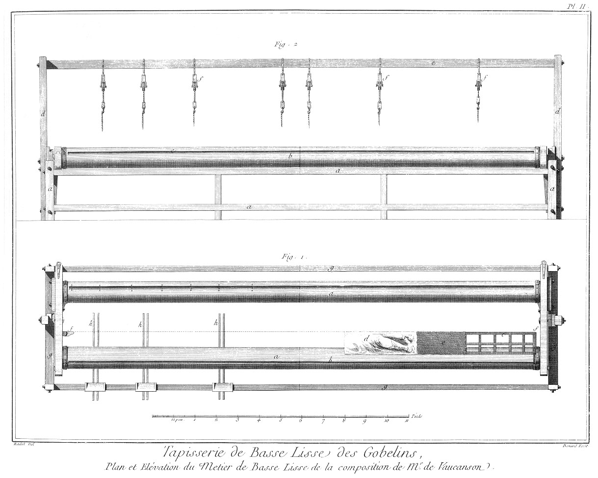

TAPISSERIE DE BASSE-LISSE DES GOBELINS
======================================

Contenant dix-huit Planches équivalentes à vingt-trois, à cause de cinq Planches doubles. 

PLANCHE Iere.
-------------

Proportion des métiers détaillée avec toutes les opérations des ouvriers pour faire la tapisserie de basse-lisse.

Cette Planche représente l'intérieur d'un métier de basse-lisse avec différentes opérations des ouvriers.

	- a a a, ouvriers occupés à travailler.
	- b, ouvrier dévidant des écheveaux de laine de couleurs sur les flûtes.
	- c, ouvrier calquant les tableaux, lesquels calques servent à diriger les ouvriers dans le dessein de leurs ouvrages.
	- d, ouvrier faisant le service de bander les fils en tournant la vis de la jumelle.
	- e, tambour ou tableau roulé sur deux rouleaux & retenu par une crémaillere.
	- f f, ouvrier cherchant à assortir les couleurs.
	- g, cabinet pour serrer les laines de couleurs, soies & autres parties nécessaires à l'ouvrage.
	- h, grande perche suspendue au plancher par deux poulies pour voir les pieces terminées.
	- i, planche sur laquelle se mettent les ouvriers pour choisir les couleurs.
	- l, grand crochet de bois en saillie pour soutenir les rouleaux & perche inutile.
	- m, armoire pour serrer les couleurs.

PLANCHE II.
-----------

Fig.
1. Plan d'un métier de la nouvelle construction par M. de Vaucanson.
	- a a, rouleau sur lequel se roulent les fils & l'ouvrage fait.
	- b b, nervure dans laquelle on met le verguillon qui retient les boucles des fils.
	- c, table sur laquelle on met les calques pour voir au-travers les fils & pour en suivre le trait.
	- d, calque (est un trait fait à l'encre & les autres masses au pinceau & rehaussé de blanc) servant de conduite à l'ouvrier pour le dessein ; le calque est fait sur le tableau original que l'on coupoit anciennement par bandes pour guider l'ouvrier dans son ouvrage ; sans comprendre le désagrément qu'il y avoit de perdre le tableau pour faire une seule tapisserie, il y avoit encore celui de voir les objets de droite à gauche ; comme, par exemple, des ombres contraires, le service que les figures faisoient de leur main gauche en place de leur main droite, des épées portées à droite, &c. & une quantité d'autres choses ridicules dans la basse-lisse, qui en faisoient la différence de la haute, que M. Nilson a évitées par tous les changemens qu'il a faits dans ce nouveau métier depuis l'année 1750.
	- e, toile cirée de couleur petit gris pour donner plus d'effet au calque que l'on met sans-dessus-dessous sur ladite toile, afin que le derriere du calque qui fait contre-preuve, donne le sens droit à la tapisserie, & donne l'effet qui regne naturellement sur le tableau.
	- f f, lagnet sur lequel se pose la table qui est attachée & posée sur le rouleau par une courroie & une boucle.
	- g g g, bâti du métier.
	- h h, marche que les ouvriers font mouvoir avec les piés pour faire lever la croisure.

2. Métier géométral vu de côté, où l'ouvrier travaille.
	- a a a a, bâti du métier dont la piece supérieure sert à appuyer le siége de l'ouvrier.
	- b, rouleau sur lequel se roule l'ouvrage fait.
	- c, nervure.
	- d d, montant servant à porter la camperche.
	- e, camperche sur laquelle s'attachent les sautriaux.
	- f f f, sautriaux détaillés en grand & avec les poulies de changement.

PLANCHE III.
------------

Fig.
1. Métier du côté de la jumelle.
	- a a a a, bâti du  métier.
	- b, rouleau sur lequel sautent les fils.
	- c, montant servant à porter la camperche.
	- d, camperche.
	- e e, sautriaux.

2. Métier vu de côté.
	- a a a a, bâti du métier nommé par les Flamans le roure.
	- b b, cotret qui sert à emboîter les tourillons des rouleaux.
	- c, montant servant à porter le gousset de la camperche.
	- d, gousset de la camperche.
	- e, piece de bois servant à contenir le tourillon du rouleau dans la jumelle.

3. Coupe sur la largeur du métier.
	- a a, coupe des rouleaux.
	- b, cheville servant d'ais au rouleau emboité dans les cotrets pour la tourner & voir au travers de l'ouvrage.
	- c, coupe de la camperche avec la rainure dans le gousset pour emboîter la cheville qui lui sert de guide.

4. Coupe du cotret pris la ligne a b de la fig. 6.
	- a a, assemblage des morceaux de bois qui servent de supports pour l'axe des cotrets.

5. Coupe du rouleau & son emboîture dans la jumelle.

6. Coupe sur le milieu des épaisseurs du cotret pris sur la jumelle.
	- a, tourillon du rouleau.
	- b b, morceau de bois servant à contenir le tourillon.
	- c c, encadrure de fer pour ceindre toutes les parties du rouleau & le faire mouvoir, dans lequel se trouve le pas de vis pour le faire mouvoir.
	- d d, cheville de fer pour servir d'arrêt à la jumelle.
	- e, grande équerre de fer à la tête du rouleau pour emboîter la vis.

7. Fer courbé qui sert étant attaché au cotret par une vis & ceignant le rouleau, à mettre une cheville de fer dans le trou dont il est percé & répété à un cercle de fer qui ceint la tête du rouleau à le retenir pour l'empêcher de se débander.
	- a, trou pour mettre les chevilles de fer.
	- b, autre trou pour mettre la cheville de fer & l'attacher au cotret.

8. Plan & proportion du siége pour asseoir l'ouvrier.

9. Coupe du même banc.

PLANCHE IV.
-----------

Fig.
1. Coupe de la vis de la jumelle en grand.
	- a, vis.
	- b b, fer qui emboîte, la vis est percée de grandeur pour laisser passer l'arrêt de la vis.
	- c c, platine de fer qui sert d'arrêt à la vis.
	- d d, arrêt de la vis sur la platine.
	- e e, fer qui s'engraine dans le pas de vis.
	- f, aucan pour faire toucher la vis.

2. Vue sur le côté de la vis de la jumelle.
	- a, pas de vis de la jumelle.
	- b b, fers qui contiennent la jumelle.
	- c c, partie de la platine chevillée sur le fer qui contient la jumelle.

3. Vue de la tête de la vis.
	- a, fer d'arrêt.
	- b, tête de la vis.

4. Platine seule. Cette platine se met entre l'arrêt de la vis & le fer qui sert à la recevoir pour contenir l'arrêt de la vis immobile contre la platine, & faisant tourner cette même vis, fait avancer ou reculer le grand écrou qui ceint toutes les parties du tourillon qui étant répété aux deux bouts du rouleau autour duquel les fils sont tournés, le font avancer ou reculer également, & bande fortement & avec beaucoup plus de sureté l'ouvrage, même pour les ouvriers qui risqueroient à tout instant d'être blessés.
	- a, ligne ponctuée qui marque l'arrêt de la vis.

5. Clé à vis dont les ouvriers se servent pour bander l'ouvrage, en faisant tourner avec la queue de ladite clé dans l'anneau qui est à la tête de la vis, font avancer ou reculer la jumelle autant qu'ils le jugent à propos.
	- a, queue de la clé à vis.
	- b b, anneau de la clé à vis qui sert à toutes les vis qui lient le bâti de charpente du métier.

PLANCHE V.
----------

Fig.
1. Plan du petit métier pour les jeunes éleves.
	- a a, cotret qui contient les tourillons des rouleaux.
	- b b, tringle de fer qui lie les cotrets & les empêche de s'écarter.
	- c c, rouleaux avec leur nervure.
	- d d, montant pour porter la camperche.
	- e e, montant pour porter toute la partie supérieure du métier qui est attachée par deux vis qui servent d'axe pour tourner le métier & voir au travers de l'ouvrage.
	- f, nervure pour placer le verguillon.
	- g, table pour tenir le calque qui sert pour guider le dessein de l'éleve. Voyez Pl. II. lettre d.
	- h, calque. Voyez Pl. lettre d.
	- i, marche. Voyez Pl. II. lettre m.
	- l, siége pour asseoir les jeunes éleves.

2. Elévation géométrale du métier des jeunes éleves vue du côté du siége.
	- a, rouleau pour l'ouvrage fait.
	- b b, cotret qui contient le tourillon du rouleau.
	- c c, montant qui sert à porter la cheville pour tourner le métier.
	- d d, pié du métier.
	- e e, montant de camperche.
	- f f, camperche pour porter la poulie.
	- g g g, poulies qui font le service des sautriaux.
	- h, élevation du siége par derriere.

PLANCHE VI.
-----------

Fig.
1. Elévation du métier du côté de la jumelle. Voyez ci-dessus, fig. 2.

2. Vue en perspective de la partie du cotret, qui porte la jumelle.
	- a, voyez le détail de la jumelle, Pl. IV. & son service.
	- b, vis de la jumelle.
	- c, tete de la vis de la jumelle.
	- d, plaque de fer qui sert d'arrêt à la vis de la jumelle, & assemblée aux tringles de fer qui empêchent d'écarter le cotret.
	- e, rouleau.
	- f, nervure dans laquelle se mettent les deux arguillons.
	- g, pié du métier qui tient par une cheville au cotret, & qui se couche sur le cotret même, quand on veut tourner le métier pour voir au-travers de l'ouvrage.

3. Détail de l'arrêt du rouleau du petit métier.
	- a, cotret dans lequel est emboîté le tourillon du rouleau.
	- b, rouleau.
	- c, cheville de fer un peu courbée passée dans un trou du cotret, dont la courbe est faite pour recevoir la cheville qui sert d'arrêt au rouleau.
	- d, cheville d'arrêt du rouleau.
	- f, cercle de fer pour ceindre la tête du rouleau, & percé pour recevoir la cheville d'arrêt.
	- g, nervure.

PLANCHE VII.
------------

Fig.
1. Métier vu de côté.
	- a, emboîture de la jumelle.
	- b, cotret dans lequel s'emboîtent les tourillons des rouleaux.
	- c, montant des camperches.
	- d, montant de la cheville pour tourner le métier.
	- e, pié du métier.
	- f, siége.
	- g, tourillon du rouleau.
	- h, tête de la cheville qui sert à tourner le métier.
	- i, grand crochet de fer pour contenir les piés du métier.

2. Coupe géométrale du métier des jeunes éleves.
	- a, coupe du rouleau.
	- b, coupe de la camperche avec la maniere dont est arrêtée la poulie.
	- c, écrou de la vis qui sert de ceintre à faire tourner le métier.
	- d, morceau de bois que l'on tourne pour soutenir la table du calque.
	- e, coupe du siége des éleves.
	- f, trou dans un montant des siéges pour mettre un boulon de fer & soutenir la marche à la hauteur proportionnée à la grandeur des éleves.
	- g, marche posée & arrêtée sur le boulon par un piton.

PLANCHE VIII.
-------------

Fig.
1. Ancienne maniere de bander avec le tentoir les rouleaux du métier, ce qui ne se faisoit qu'à un des bouts du métier, & faisoit tordre le rouleau  & bander l'ouvrage inégalement & au risque de tuer ou blesser journellement les ouvriers par la rupture des cordes & la détention du tentoir.
	- a a a a, rome ou bâti du métier.
	- b b, arguillier, corde qui retient en arrêt les rouleaux au rome & à l'arguillier.
	- c, tentoir.
	- d, corde à bander le tentoir qui est arrêté à la piece supérieure du rome.
	- e, cheville du tentoir.
	- f, cheville de fer des rouleaux pour arrêter les arguilliers.
	- g g, rouleau.
	- h, havresteque, morceau de bois qui sert d'arrêt au rouleau.

PLANCHE IX.
-----------

Fig.
1. Proportion & service de l'ourdissoir.
	- a a a a a, trous qui servent à placer les bâtons pour fermer les croisures & la boucle des verguillons ; chaque entre deux de trous est écarté de six pouces six lignes ; cet écartement se nomme bâton qui est la mesure flamande. Ainsi en ourdissant les fils, on peut donner plus ou moins de grandeur en doublant les bâtons pour leur faire faire plus de chemin sur l'ourdissoir.
	- b b, bâtons pour former la boucle du verguillon.
	- c, bâton pour former les croisures.
	- d d d d, bâton d'écartement pour grandir plus ou moins l'ourdissage des fils pour donner à la piece plus ou moins de bâton ou mesure flamande.
	- e e, fils au nombre de sept, qui doublés pour faire la croisure, en font quatorze.
	- f, fer à porter les bobines sur lesquelles sont les fils pour l'ourdissage.

2. Cuivre, c'est un morceau de cuivre fondu, aux extrémités duquel sont deux poignées pour donner à l'ourdissoir la facilité de s'en servir ; ce cuivre est percé par quatre fentes & cinq trous pour laisser un libre passage aux fils des croisures, & pour ourdir avec beaucoup plus de promptitude & de justesse.
	- a a, cuivre.
	- b b, poignée.
	- c c, fente pour le passage des fils.
	- d d d d d, trous pour le passage des fils.

PLANCHE X.
----------

Fig.
1. Perspective du petit rateau ou vautoir, qui sert à passer les fils de croisure d'un rouleau à l'autre également pour les tendre. Voyez-en le service, Pl. X. Ce petit rateau sert pour le passage du métier des éleves, & s'alonge par le moyen des vis & du trou pour servir au petit métier plus ou moins large.
	- a a, cotret qui sert d'appui au vautoir.
	- b, morceau de bois qui sert à assembler les deux parties du vautoir.
	- c, coin qui sert à serrer la partie inférieure qui porte les dents du vautoir.
	- d d, tête des vis qui sert à alonger le vautoir.
	- e e, trous pour mettre les vis.

2. Coupe géométrale du vautoir.
	- a a, coupe de morceau de bois supérieur qui porte la rainure pour recevoir les dents.
	- b b, morceau de bois inférieur qui porte les dents.
	- c, coin qui sert à joindre les deux parties ensemble.
	- d d, têtes des vis qui servent à alonger le rateau.
	- e e, écrous des vis.

3. &
4. Proportions géométrales vues de face du vautoir au rateau.
	- a, piece supérieure du rateau renversée pour laisser voir la rainure.
	- b, piece insérieure du rateau avec la proportion de l'écartement de ses dents.
	- c c, dents du rateau ; chaque entre-deux de dent du rateau ou vautoir contient quatorze fils, compris les sept de croisure. Il faut douze entre-deux de dent pour la longueur du bâton de six pouces six lignes qui est la mesure flamande.

PLANCHE XI.
-----------

Fig.
1. Grand rateau ou vautoir du grand métier en place avec l'opération des fils de croisure entre chaque dent. Voyez la construction à la Planche X.
	- a a a, rateau en place sur les cotrets.
	- b b b, dents du rateau.
	- c c c, fil de croisure passant entre les dents du rateau.
	- d, verguillon dedans sa nervure qui retient les boucles des fils.
	- e e e, cheville de fer qui retient le verguillon dans la nervure.
	- f, nervure dans le rouleau pour placer le verguillon.
	- g, cercle de fer percé pour retenir la cheville d'arrêt du rouleau.
	- h, cotret dans lequel s'emboîtent les tourillons des rouleaux, & sur lequel sont appuyées les extrémités du rateau ou vautoir.
	- i i, les rouleaux.
	- l, tête de la vis pour tourner le métier.
	- m, la jumelle vue en perspective.
	- n, bâti du métier pour appuyer la jumelle.

PLANCHE XII.
------------

Fig.
1. 
	- a, camperche pour attacher les courroies des sautriaux.
	- b b b b, courroies des sautriaux.
	- c c, sautriaux où sont attachées les ficelles qui font mouvoir les lames.
	- d d, poulies que l'on a substituées à la place des sautriaux pour faciliter l'ouvrage.
	- e e e, cordes avec crochet de fer pour faire lever & baisser les lames.
	- f f f, bâton de lame.
	- g g, lame. Voyez leurs constructions à la Planche suivante.
	- h, fil.

PLANCHE XIII.
-------------

Fig.
1. Construction des lames ; ce sont des fils croisés attachés avec chacun un las autour d'un bâton, dessus lequel est un fil échappé qui passe par-dessus sept noeuds, distingue les fils de croisure, comme l'on peut voir par cette figure.
	- a a a a, bâtons de lame sur lesquels sont formés les sept las qui attachent les lames.
	- b b b b, lames au nombre de sept, qui croisées dans le milieu & enveloppant les fils ourdis au nombre de sept, forment les croisures pour laisser le passage de la flûte.
	- c c, maniere dont sont gripés les fils pour former les croisures.
	- d d d, fils de croisure.
	- e e, fils ressautés pour marquer le nombre des sept las pour distinguer les croisures.
	- f f, ficelle de la marche que l'ouvrier fait mouvoir pour faire croiser.
	- g g, ficelle attachée aux sautriaux.

PLANCHE XIV.
------------

Fig.
1. Détail ou rouet à dévider les laines sur les petites bobines & dessus les flûtes.
	- a, roue du rouet.
	- b, planche sur laquelle sont assemblées routes les parties du rouet.
	- c, tête du rouet.
	- d, fer sur lequel se met la bobine pour dévider les laines qu'elles contiennent sur la flûte.
	- e, tournette pour mettre les écheveaux à dévider sur les flûtes.
	- f, écheveaux sur la tournette.
	- g, bâton fait pour retenir les écheveaux sur les tournettes.

2. Petite bobine à laine.

3. Flûte, espece de bobine pour passer les laines de couleur dans les croisures & former le tissu. 

4. Partie de la tête du rouet grande comme nature, qui est une espece de petite cuvette en fer pour contenir la flûte sur le rouet.
	- a, fer sur lequel est formée la cuvette.
	- b, cuvette.
	- c, vis pour reculer la cuvette & ôter la flûte.

5. Autre partie de la tête du rouet, qui est une espece de crapaudine en fer qui est forgée à l'axe de la noix, & est faite pour griper par le moyen de la cuvette & de ses dents la tête de la flûte & la faire tourner pour recevoir les laines.
	- a, noix du rouet.
	- b, axe de la noix.
	- c, crapaudine.
	- d, dent de la crapaudine.

PLANCHE XV.
-----------

Fig.
1. La passée de la flûte dans les fils de croisure.
	- a a a, paquet de flûte de différentes couleurs.

2. Repassée de la flûte dans les fils de croisure.
	- a a, flûte de différentes couleurs.

PLANCHE XVI.
------------

Fig.
1. Ouvrier se servant de l'ongle pour commencer à serrer deux ou trois fils de couleur pour les nuancer.

2. Grattoir en ivoire pour commencer à serrer une plus grande quantité de laine de couleur pour les nuancer.

3. Peigne double pour terminer de serrer tout-à-fait l'ouvrage.

4. Ouvrier terminant de serrer l'ouvrage tout-à-fait avec le peigne.
	- a a, flûtes de différentes couleurs pour le nuancer.
	- b, petite bobine de laine.

PLANCHE XVII.
-------------

Fig.
1. Ouvrier occupé à reprendre le relais qui est une fente que laisse l'entre-deux de deux couleurs.

2. Ouvrier occupé à former le las qui est le noeud qui joint les couleurs.

PLANCHE XVIII.
--------------

Fig. 1.
	- a, ouvrier qui travaille à la lumiere.
	- b, serge pour empecher l'ouvrage d'être sali.
	- c, flûtes de couleurs.
	- d, banc de l'ouvrier.
	- e, ouvrage.
	- f, fil de croisure.
	- g, lame pour lever les croisures.
	- h, sautriaux.
	- i i i, courroie pour retenir les sautriaux.
	- l, camperche.
	- m, quescorde, c'est une ficelle que les ouvriers attachent des deux côtés du métier pour retenir le havresteque.
	- n, havresteque, c'est un morceau de bois avec des dents pour retenir & éloigner plus ou moins la petite échelle.
	- o, petite échelle qui sert à élever plus ou moins la platine.
	- p, platine ou plaque de fer-blanc pour travailler de nuit.
	- q, bâton passé dans les courroies des sautriaux pour tenir le havresteque.

[->](../../Tome_27-Planches_Tome_10/01-Titre.md)
