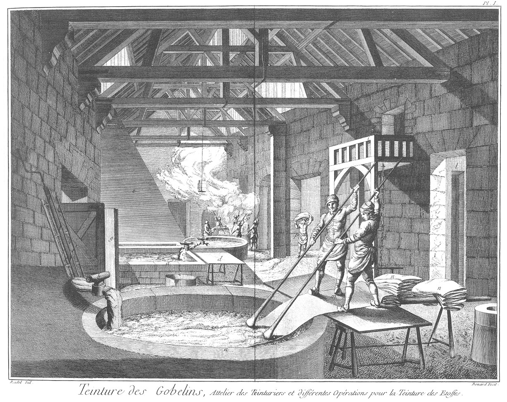

TEINTURE DES GOBELINS
=====================

Contenant quatorze Planches à cause de trois doubles. 

PLANCHE Iere.
-------------

Cette Planche représente l'intérieur du grand attelier des teinturiers de la Manufacture Royale des Gobelins.
	- a a, grande chaudiere pour le lavage.
	- b b b, robinets pour rendre les eaux de citerne dans les chaudieres.
	- c c, poches de toile pour passer les eaux de citerne ; ces poches sont attachées aux robinets.
	d, grande table sur laquelle montent les ouvriers pour repousser les draps afin de les laver.
	- e, cheminée de chaudiere.
	- f, tour sur lequel l'on tourne les draps pour les teindre.
	- g, porte de communication pour la riviere.
	- h, chapelet de la pompe à tirer l'eau de la citerne pour la mettre dans le réservoir, & la communiquer aux chaudieres.
	- i, petit réservoir qui sert à recevoir les eaux du chapelet pour les rendre ensuite dans le grand.
	- l, partie du grand réservoir que l'on apperçoit au travers de la porte.
	- m, deux ouvriers teinturiers occupés à repousser les draps au lavage avec les repoussoirs dans une chaudiere ; ces sortes de lavage se font ordinairement à la riviere ; mais quand les eaux sont sales l'on prend le parti de les faire dans l'attelier, en se servant des eaux du réservoir passé au robinet b, par la poche c.
	- n, drap lavé ou à laver sur les chevalets.
	- o, teinturiers occupés à tourner le drap dans la chaudiere pour le teindre.
	- p, ouvrier portant des draps à la teinture.

PLANCHE II.
-----------

Intérieur de la machine pour tirer l'eau de la citerne.
	- a a, chevaux occupés à faire mouvoir la machine.
	- b, piece de bois tournante dans laquelle est assemblée la roue d'engrenage.
	- c c, roue d'engrenage qui fait tourner les lanternes.
	- d d, lanternes tournantes par la roue d'engrenage.
	- e e, axe ou piece de bois tournante par le mouvement de la lanterne autour de laquelle elle est assemblée.
	- f, roue de fer garnie de crochets pour gripper les chaînes du chapelet.
	- g, chapelet de la pompe.
	- h, piece de bois percée dans laquelle passe le chapelet pour faire monter l'eau.
	- i, ouverture de la citerne.
	- k, petit réservoir d'entrepôt pour rendre ensuite les eaux dans le grand.
	- i, gouttiere de bois pour la communication des eaux du petit réservoir au grand.
	- m m, grand réservoir.
	- n n n, assemblage de charpente pour contenir le mouvement de la machine. 

PLANCHE III.
------------

Fig.
1. Disposition d'une chaudiere avec l'entrée du fourneau.
	- a, entrée ou descente du fourneau.
	- b, chaudiere sur laquelle est monté le tour.
	- c, piece de drap montée sur le tour.
	- d, tuyau de communication pour les eaux de citerne.

2. Disposition des chaudieres pour réchauffer les cuves du guedre.
	- a, descente du fourneau.
	- b, chaudiere à réchauffer les cuves du guedre.
	- c, gouttiere pour communiquer l'eau chaude de la chaudiere par un trou dans le mur dans les cuves du guedre.
	- d, cuve du guedre.
	- e, couvercle de la cuve.
	- f, tuyau pour remplir les chaudieres d eau.

3. Brouette pour porter le bois aux fourneaux.

4. Chevalet pour mettre égoutter les draps.
	- a, piece de drap teint, égouttant sur le chevalet.
	- b, bac ou caisse de bois, que l'on met sous le chevalet pour recevoir la teinture qui coule des draps, & même les draps s'ils venoient à tomber, pour les empêcher de se salir.

5. Le détail du tour en grand.
	- a a, axe ou morceau de bois quarré sur lequel sont montées les bandes qui supportent le drap.
	- b, morceau de fer qui sert de support au tour pour le faire tourner.
	- c, autre support fait en manivelle pour tourner. d d d d, morceaux de bois servant de supports au drap.

6. Jatte pour porter les teintures de cochenille & autres dans les chaudieres.
	- a a, bâton traversant la jatte pour donner la facilité à deux hommes de la porter.

PLANCHE IV.
-----------

Fig.
1. Proportions géométrales de la coupe d'un fourneau, & les détails de sa construction.
	- a, coupe de la chaudiere.
	- b b, ceintre de bois sur lequel est arrêté le bord de la chaudiere.
	- c, dessous de la chaudiere ou fourneau où l'on met le feu.
	- d, petite cheminée du fourneau qui communique dans la grande.
	- e, galerie des fourneaux dont la partie supérieure est ouverte, servant de cheminée.
	- f, porte du fourneau.
	- g, coupe du tuyau pour donner l'eau aux chaudieres avec son robinet.
	- h, niveau du pavé de l'attelier.
	- i, niveau du pavé du fourneau sur lequel l'on met le feu.
	- l, niveau du pavé de la galerie.
	- m m m, lignes qui marquent la construction en brique.
	- n n n n n, construction en mâçonnerie.

Fig.
2. Plans; celui du rez-de-chaussée & celui du souterrein ou fourneau.
	- a, plan de la chaudiere vu par dessus.
	- b b, bord de la chaudiere.
	- c c, gros clou pour retenir la champagne dans la chaudiere.
	- d, pavé du fourneau.
	- e e, pourtour du fourneau construit en brique.
	- f f, corps de mâçonnerie pour soutenir la construction en brique.
	- g, plan de la galerie.
	- h h, grand crochet de fer pour tirer le bois & la braise hors le fourneau.

PLANCHE V.
----------

Fig.
1. Intérieur d'un fourneau.
	- a, intérieur de la galerie.
	- b, entrée du fourneau.
	- c, crochet de fer pour servir le fourneau.
	- d, descente pour aller aux fourneaux.
	- e, petite cheminée du fourneau.
	- f, grande cheminée de la galerie.
	- g g, bois prêt à mettre dans le fourneau.
	- h, fendoir ou merlin.
	- i, pelle à braise.

2. Service du bois pour les fourneaux.
	- a, brouette chargée de bois.
	- b, soupirail de la galerie des fourneaux dans lequel l'on précipite le bois.

PLANCHE VI.
-----------

Fig.
1. Service d'une petite pompe à chapelet pour remplir un petit réservoir des eaux de citerne.
	- a, petit réservoir des eaux de citerne.
	- b, soupape pour laisser écouler les eaux dans les chaudieres.
	- c, chapelet.
	- d, gouttiere pour mener l'eau dans le réservoir.
	- e, corps de la pompe.
	- f, robinet.
	- g, entrée de la citerne.
	- h, tuyau de plomb pour conduire les eaux aux chaudieres.

2. Figure d'une truite ou chandelier.
	- a, plateau de la truite.
	- b, poignée ou manche.
	- c, chandelle.

3. Champagne qui sert à contenir les draps au milieu du bain dans la chaudiere & les empêcher de toucher au fond.
	- a a, cercle de fer qui sert de bâtis aux cordes qui composent la champagne.
	- b b, corde formant le lisse de la champagne.

4. 
	- c, crochet de fer pour prendre la champagne dans la chaudiere.
	- d, corde pour retenir le crochet.

5. 
	- e, chasse-fleurée pour ramasser l'écume de la chaudiere.
	- f, corde pour tirer le chasse-fleurée.
	- g, anneau pour tirer la corde du chasse-fleurée.

PLANCHE VII.
------------

Fig.
1. Grande cuve aux eaux sures, ce sont les eaux dégraissées par le son.
	- a a, cuves aux eaux sures.
	- b, échelle pour descendre dans les cuves.

2. Maniere de tordre les draps.
	- a, cuve.
	- b, chevalet du tordoir.
	- c, tordoir.
	- d, crochet du tordoir qui est mobile.
	- e, crochet immobile.
	- f, drap sur le tordoir.
	- a, bâton à tordre.
	- b, crochet à mener en cuve.
	- c, repoussoir pour laver les draps.
	- d, e, battes.
	- f, sebile de bois.
	- g, passoir.
	- h, manne.
	- i, tamis.
	- l, m, rables.

PLANCHE VIII.
-------------

Fig.
1. représentant le service du tour sur lequel l'on met le drap bien étendu, puis un ouvrier tourne le tour, fait plonger le drap d'un côté, & le retire de l'autre, pendant que quatre ouvriers sont occupés à le repousser avec le repoussoir pour lui faire prendre  également la teinture.
	- a, tour dessus la chaudiere.
	- b, drap bien étendu sur le tour.
	- c, ouvrier tournant le tour.
	- d d d d, ouvriers occupés à repousser.
	- e, chaudiere sur laquelle est ajusté le tour.
	- f, têtes de clou avec les noeuds des cordes des crochets qui retiennent la champagne. Voyez la figure 3 de la Planche VI.

Fig.
2. représentant le lavage de riviere, que l'on y fait quand les eaux sont belles.
	- a a, ouvriers au lavage de riviere occupés à repousser au courant les draps, levant chacun avec un pied la piece de drap ployée, & la faisant aller à mesure que le repoussoir l'entraîne.
	- b, le petit pont de communication de l'attelier à la riviere.
	- c, arrêt ou petit grillage pour retenir les draps au lavage.
	- d, riviere de Bievre.
	- e e, draps au lavage.

PLANCHE IX.
-----------

Fig.
1. Service du couchoir sur lequel est la piece teinte pour recoucher le drapé avec la brosse à coucher.
	- a a, ouvriers occupés à coucher le drap avec la brosse.
	- b, drap sur le couchoir.
	- c, couchoir à drap.
	- d, faudet, petit bâtis de bois sur lequel tombent les draps.

2. Service de l'attelier des rames sur lesquelles l'on tend les draps pour les faire sécher.
	- a a a, attelier des rames.
	- b, partie inférieure qui se leve ou se baisse, selon la largeur des draps.
	- c c, murs sur lesquels est arrêté l'attelier.
	- d d, crochets de fer pour retenir le drap & le tendre.
	- e e, ouvriers occupés à tendre une piece de drap.
	- f f, pieces de drap.

PLANCHE X.
----------

Fig.
1. Intérieur de l'attelier de la teinture des laines & soies de couleurs.
	- a a, petite chaudiere.
	- b, entrée du fourneau.
	- c, ouvrier occupé à teindre les écheveaux.
	- d d, ouvriers occupés à mettre l'accord dans la dégradation des couleurs des écheveaux en parallele avec le papier d'échantillon.
	- e e, chevalets.
	- f f, bâtons enfilés dans les écheveaux.
	- g g, écheveaux.
	- h, papier roulé sur lequel sont tournés séparément les échantillons des laines ou soies qui servent aux teinturiers à les conduire dans la teinture des écheveaux.
	- i, manne dans laquelle l'on met les ingrédiens de la teinture.
	- l, seau de cuivre pour la teinture : ils se servent des mêmes outils que les autres teinturiers.

PLANCHE XI.
-----------

Fig.
1. Sechoir du teinturier de laines & soies des Gobelins.
	- a a, barres de fer assemblées & scellées au plancher, sur lesquelles se mettent les bâtons qui tiennent les écheveaux.
	- b b b, écheveaux tendus sur les bâtons pour sécher.
	- c, poële pour sécher.
	- d, ouvrier occupé à former & tordre les écheveaux sur l'épart avec le chevillon & sur la cheville à tortiller.
	- e, ouvrier occupé à remettre les écheveaux faits d'accord pour les peser & les délivrer aux ouvriers de la manufacture des tapisseries.
	- f, balance.
	- g, écheveau tortillé.
	- h, épart, morceau de bois pour former les écheveaux.
	- i, chevrillon pour tordre sur l'épart l'écheveau.
	- l, cheville à tortiller.
	- m, petit bâton à tortiller.

[->](../07-Teinturier_en_Soie_ou_Teinturier_de_Riviere/Légende.md)
