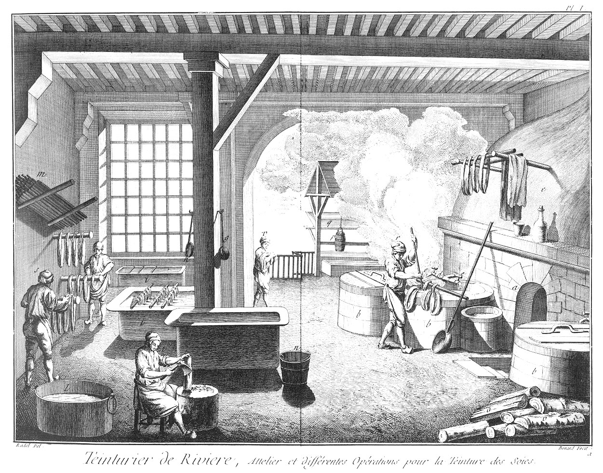
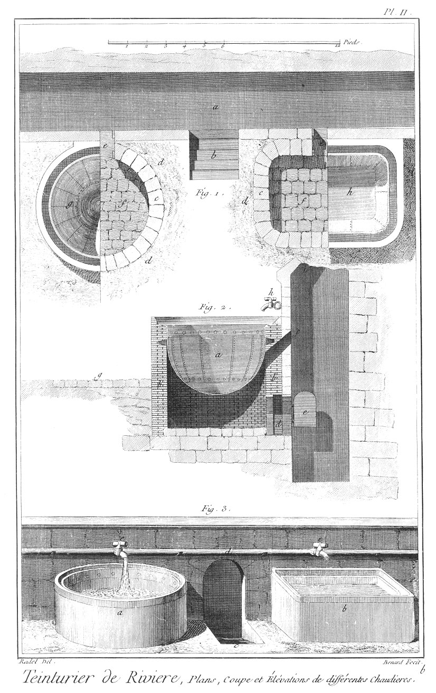
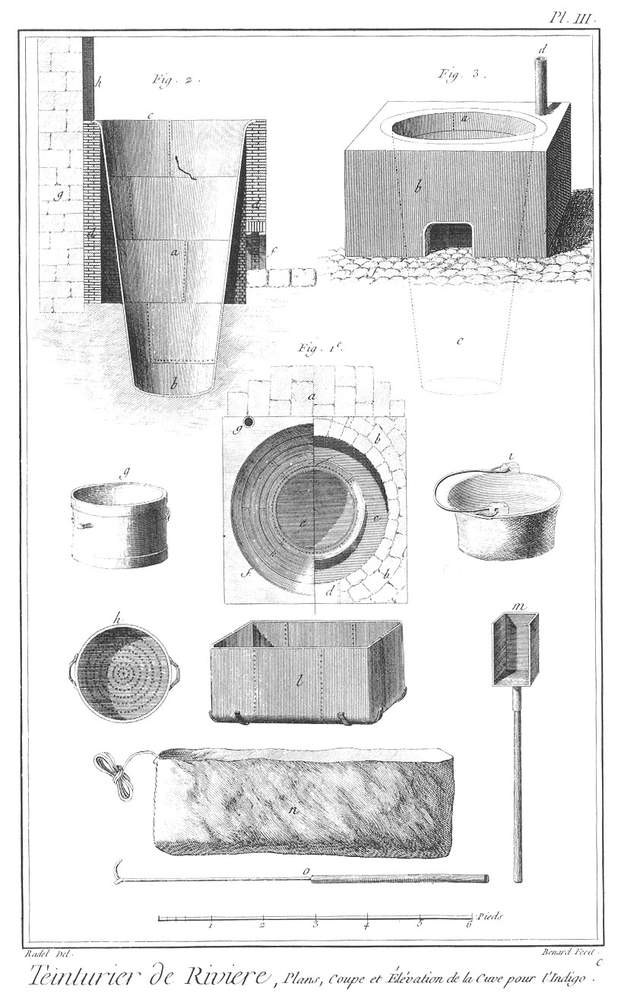
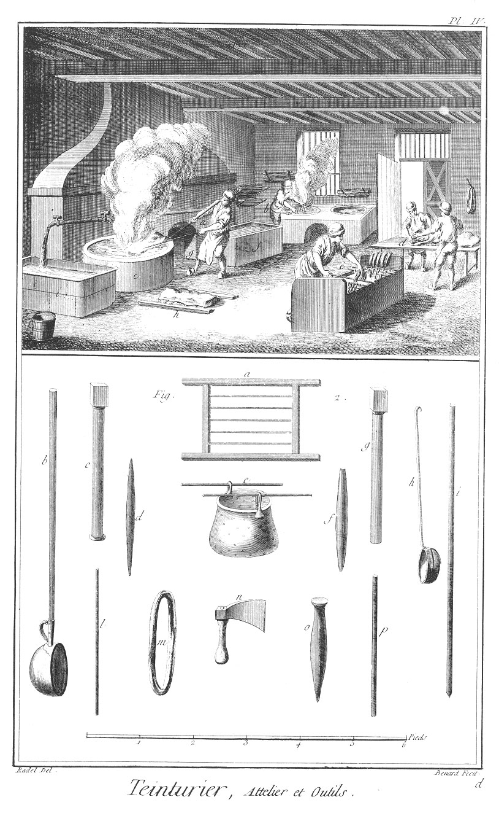
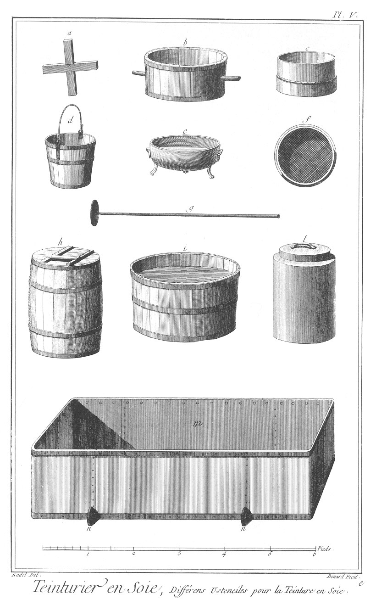
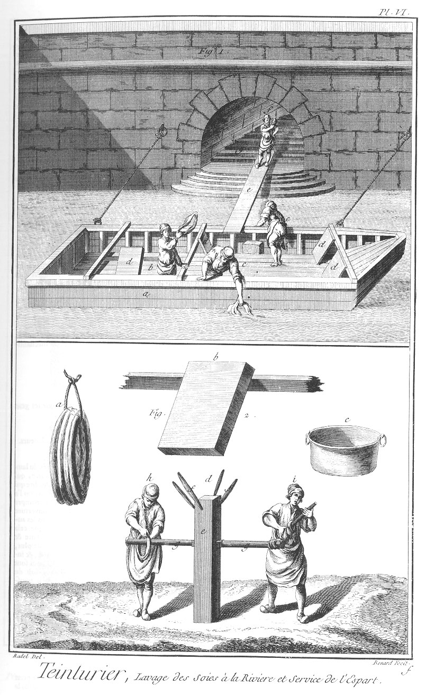
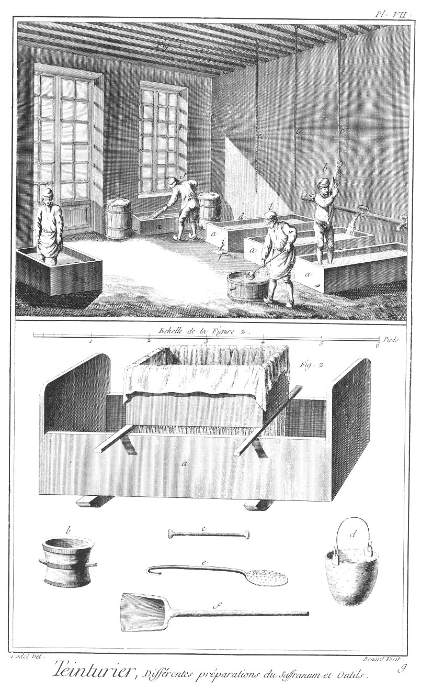
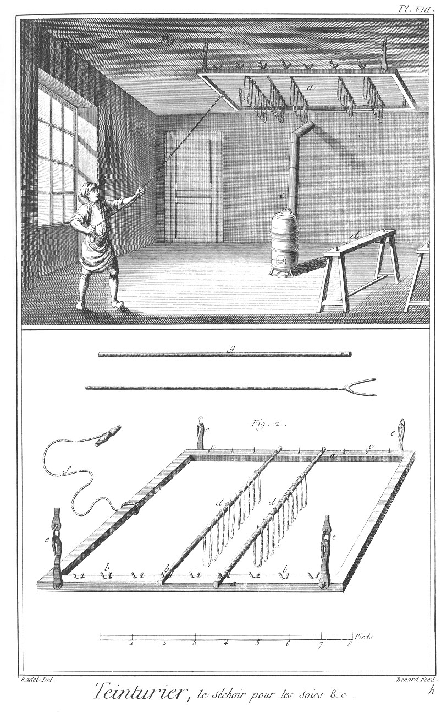

TEINTURIER EN SOIE OU TEINTURIER DE RIVIERE
===========================================

Contenant neuf Planches à cause d'une double. 

PLANCHE Iere.
-------------

Cette Planche représente l'intérieur d'un attelier de teinturier en soie ou teinturier de riviere. a entrée des fourneaux dans lesquels l'on descend.
	- b b, chaudieres pour teindre les soies, montées sur leurs fourneaux.
	- c, hotte de la cheminée. d tuyaux de plomb qui conduisent l'eau aux chaudieres.
	- e, robinet de cuivre pour donner l'eau aux chaudieres.
	- f, grand cassin.
	- g, petit cassin.
	- h, écumoire.
	- i i i, grandes chaudieres de cuivre.
	- l, chauderon ou petite chaudiere portative pour laver.
	- m, paquet de bâtons pour soutenir les écheveaux dans les chaudieres.
	- n, seau pour transporter la teinture d'une chaudiere à l'autre. o bois pour les fourneaux.
	- p, grand seau pour tirer l'eau de la riviere.
	- q, petit réservoir pour recevoir l'eau du seau, & le rendre par communication dans les chaudieres.
	- r, ouvrier à teindre les soies dans la chaudiere.
	- s, ouvrier à dresser les soies sur l'épart.
	- t, ouvrier coupant le bois de teinture en copeaux avec la hache sur un billot.
	- v, ouvrier portant les soies au lavage de riviere.

PLANCHE II.
-----------

Fig.
1. Détails de construction des chaudieres pour le teinturier en soie.
	- a, corridor ou galerie de service pour les fourneaux.
	- b, porte ou escalier pour descendre à la galerie des fourneaux.
	- c c, construction en brique du pourtour des fourneaux.
	- d d, construction en maçonnerie pour soutenir la brique.
	- e e, entrées des fourneaux sur lesquels sont les échappées de la fumée.
	- f f, sols du dessous des chaudieres où l'on met le feu.
	- g, plan de la chaudiere ronde vue par-dessus.
	- h, plan de la chaudiere ovale vue par-dessus.

2. Coupe d'une chaudiere, de son fourneau, & sa construction.
	- a, coupe de la chaudiere.
	- b b, petit mur en brique, faisant le pourtour du fourneau.
	- c, intérieur du fourneau pavé de grès, sur lequel l'on met le feu.
	- d, entrée du fourneau.
	- e, porte du fourneau.
	- f, petite cheminée du fourneau qui communique dans la hotte.
	- g, niveau de l'attelier.
	- h, tuyau de plomb avec son robinet pour donner l'eau aux chaudieres.
	- i, hotte de la cheminée.

3. Représentant la disposition des chaudieres rondes & ovales dans l'attelier.
	- a, chaudiere ronde.
	- b, chaudiere ovale.
	- c, descente pour entrer dans les fourneaux.
	- d, tuyau de communication pour les eaux.
	- e, robinet pour donner l'eau aux chaudieres.

PLANCHE III.
------------

Fig.
1. Plan & construction de la cuve pour le bleu d'indigo avec la maçonnerie qui l'environne.
	- a, mur qui adosse la construction de la cuve au bleu d'indigo.
	- b, pourtour en brique qui environne la cuve.
	- c, espace entre les parois de la cuve & la maçonnerie.
	- d, porte par où l'on met la braise.
	- e, fond de la cuve enfoncée dans terre.
	- f, partie supérieure de la cuve, vue par-dessus.
	- g, tuyau pour échapper la vapeur de la braise.

2. Coupe & construction géométrale de la cuve.
	- a, cuve conique, dont la partie la plus étroite est enfoncée dans terre.
	- b, partie de la cuve enfoncée dans terre.
	- c, ouverture de la cuve.
	- d d, petit mur en brique, faisant le pourtour de la cuve.
	- e e, parois autour de la cuve pour contenir la braise.
	- f, porte pour entrer la braise.
	- g, mur en maçonnerie contre lequel est adossée la cuve.
	- h, tuyau d'échappée pour la vapeur de la braise. 

Fig. 3. Vue en perspective de la cuve avec son fourneau.
	- a, entrée de la cuve.
	- b, massif en brique qui entoure la cuve.
	- c, entrée de la braise.
	- d, tuyau du fourneau.
	- e, ligne ponctuée qui désigne la proportion de la cuve.
	- f, pavé de l'attelier.
	- g, tamis ou passoir.
	- h, plan du tamis.
	- i, chauderon.
	- l, petite barquette de cuivre avec son patin de fer pour pouvoir se renverser facilement.
	- m, pelle pour prendre le charbon ou la braise.
	- n, sac pour empocher la soie.
	- o, croc ou fourgon.

PLANCHE IV.
-----------

Fig.
1. Intérieur de l'attelier de teinturier en soie, où les ouvriers sont occupés à débrouiller les soies.
	- a, ouvrier qui retire de la grande chaudiere ronde les sacs ou poches dans lesquels les soies ont été cuites, ou qui jette bas.
	- b, ouvrier qui passe en cuve.
	- c, bâtons sur lesquels on passe ou on lisse les mateaux de soie pour les teindre: ces baguettes se nomment lisoirs.
	- d, deux ouvriers qui empochent les soies pour les faire cuire.
	- e, chaudiere ronde.
	- f, chaudiere ovale.
	- g, entrée du fourneau.
	- h, poche de soie posée sur le treillard.
	- i, chaudiere pour laver.

2. Plusieurs ustensiles à l'usage des teinturiers.
	- a, espece de brancard appellé baillard, pour passer les soies mouillées.
	- b, grand cassin de cuivre emmanché.
	- c, épart.
	- d, chevillon dont on se sert pour tordre sur l'épart.
	- e, pot à rocou ou passoir dans laquelle l'on passe cet ingrédient.
	- f, la passe ou bâton sur lequel l'on met le mateau de soie pour le passer en cuve.
	- g, cheville pour tordre.
	- h, petit cassin.
	- i, perche dont on se sert pour retourner les poches pendant la cuite & pour les retirer, que l'on nomme barre.
	- l, bâtons sur lesquels l'on lisse la soie.
	- m, mateau ou écheveau de soie.
	- n, hache pour mettre en copeau les bois de teinture.
	- o, espece de pilon pour briser & passer le rocou dans la passoire.
	- p, bâton pour lisser les soies.

PLANCHE V.
----------

Ustensiles à l'usage des teinturiers en soie.
	- a, morceau de bois en croix pour tenir les sacs du safranum ouverts quand on le lave dans la barque.
	- b, benant ou espece de baquet propre à laver les soies.
	- c, tamis propre à passer les ingrédiens.
	- d, seau pour la commodité du service.
	- e, poële propre à brûler le soufre.
	- f, plan du tamis marqué c.
	- g, rable dont on se sert pour pallier les cuves.
	- h, tonne dans laquelle l'on conserve le jus de bois de Bresil & autres.
	- i, grand baquet dans lequel l'on place la soie.
	- l, étouffoir pour la braise.
	- m, grande barque de cuivre.
	- n n, patin de fer dessous la barque de cuivre.

PLANCHE VI.
-----------

Fig.
1. Lavage des soies à la riviere.
	- a, bateau dans lequel les teinturiers se mettent pour laver les soies.
	- b, ouvrier battant la soie lavée sur la pierre.
	- c c, ouvriers occupés à laver.
	- d d d d, pierres à battre la soie.
	- e, planche pour arriver au bateau.
	- f, ouvrier portant les soies au lavage.
	- g, escalier pour descendre au bateau.

2. Plusieurs détails du teinturier.
	- a, mateau de soie.
	- b, pierre en grand à laver.
	- c, bassine ou petite chaudiere.
	- d, service de l'épart.
	- e, poteau tenant les éparts.
	- f, chevillon pour tordre.
	- g g éparts.
	- h, ouvriers dressant l'écheveau sur l'épart.
	- i, ouvrier occupé à tordre l'écheveau avec le chevillon sur l'épart.

PLANCHE VII.
------------

Fig.
1. Intérieur d'un attelier où l'on prépare le carthame ou safran bâtard.
	- a a a, barques dans lesquelles l'on lave le safranum.
	- b, ouvrier lavant le safranum, ayant des bottes aux jambes, & se tenant à une corde au plancher.
	- c c c, cordes attachées au plancher pour se tenir.
	- d, sac de safranum ouvert par la croix de bois.
	- e, ouvrier qui va mettre le safranum, c'est-à-dire qui le mêle avec la sonde se servant de ses pieds.
	- f, ouvrier qui brise avec une pelle les mottes du safranum.
	- i, trou lavé où se coule la couleur jaune extractive du safranum.
	- l, ouvrier qui prend de l'eau pour la couler sur le safranum.

2. Appareil pour couler la teinture du safranum.
	- a,grande barque de bois.
	- b, mortier. c pilon.
	- d, passoire.
	- e, écumoire.
	- f, pelle pour briser les mottes du safranum. 

PLANCHE VIII.
-------------

Fig.
1. Intérieur du séchoir du teinturier en soie ou teinturier de riviere.
	- a, branloire suspendue au plancher & mouvante garnie de ses perches de soie.
	- b, ouvrier qui fait mouvoir la branloire chargée de soie pour faire sécher promptement.
	- c, poële.
	- d, tretaux sur lesquels l'on met les perches pour les garnir de soie.

2. Détails de la branloire.
	- a, chassis de bois formant la branloire.
	- b b, côtés de la branloire garnie de fourches pour recevoir les bouts des perches.
	- c c, côtés de la branloire garnie de fiches pour recevoir le bout percé des perches.
	- d d, perches posées sur la branloire.
	- e e e e, ferrures de la branloire, composées de pitons scellés dans le plancher; ces pitons sont garnis de crochets pour suspendre la branloire.
	- f, corde attachée à la branloire pour la faire mouvoir.
	- g, perche avec son trou.
	- h, croc pour mettre les perches sur la branloire.

[->](../08-Théatres/Légende.md)
