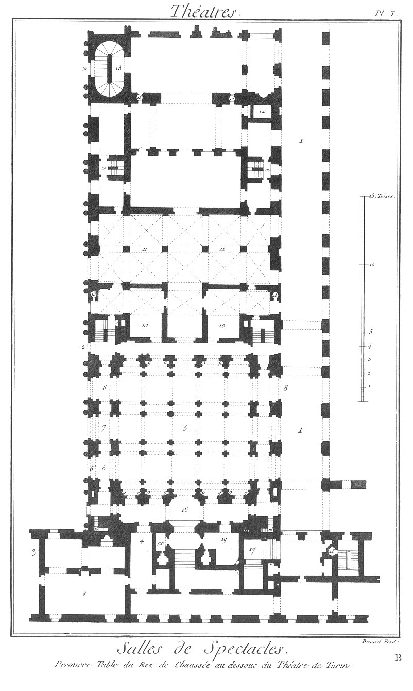
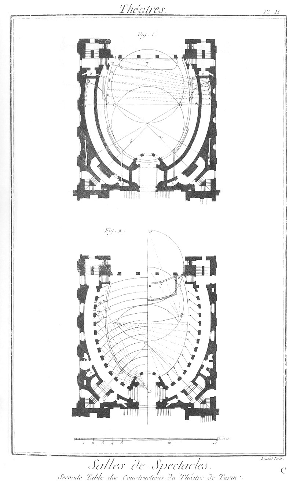
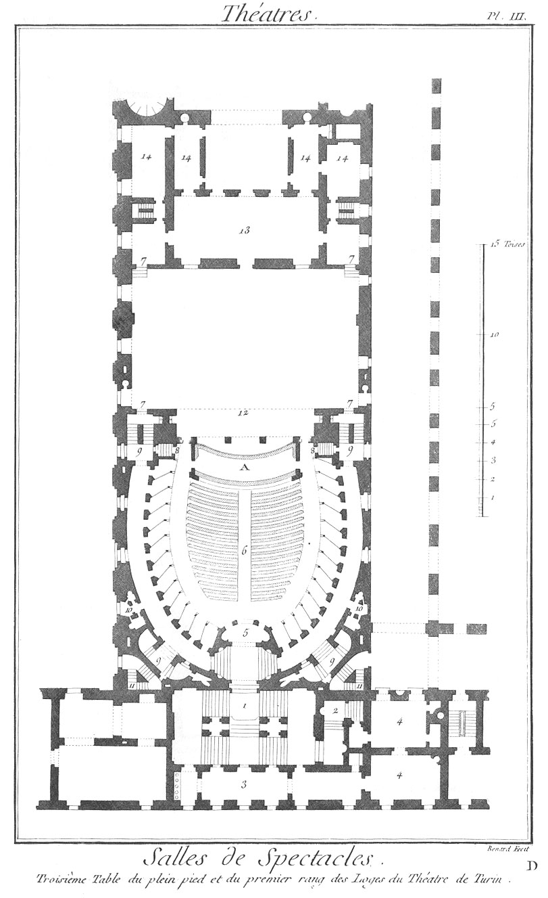
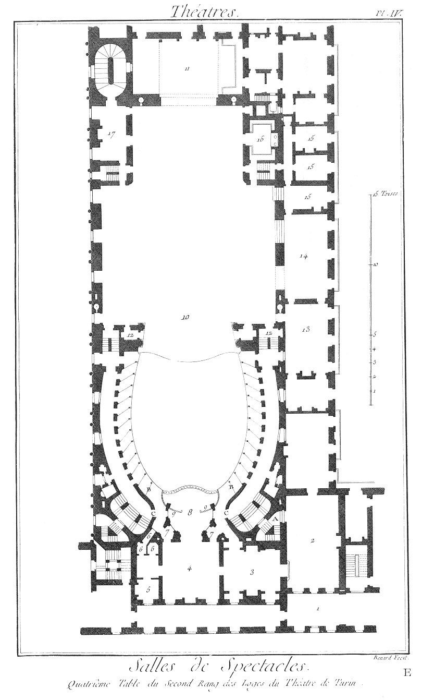
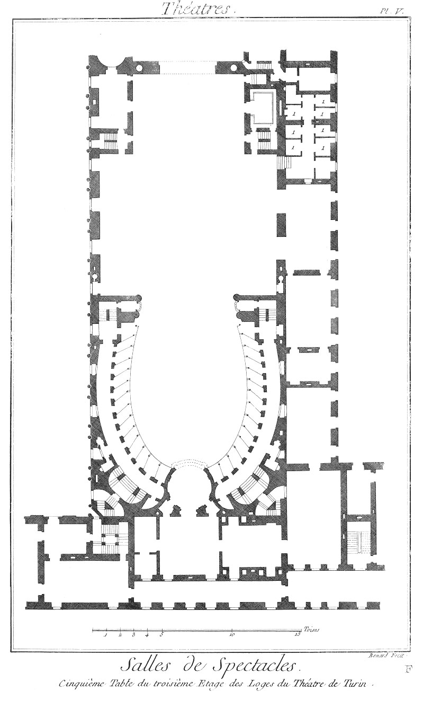
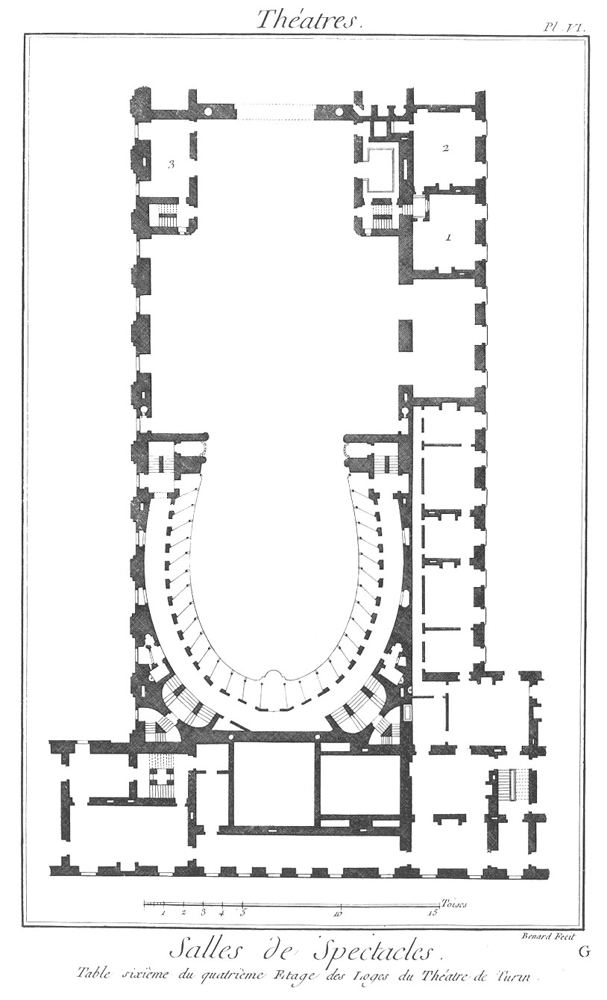
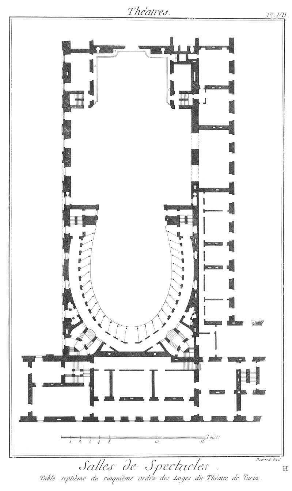
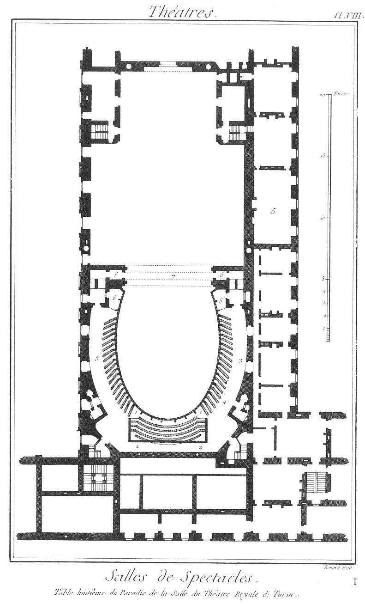
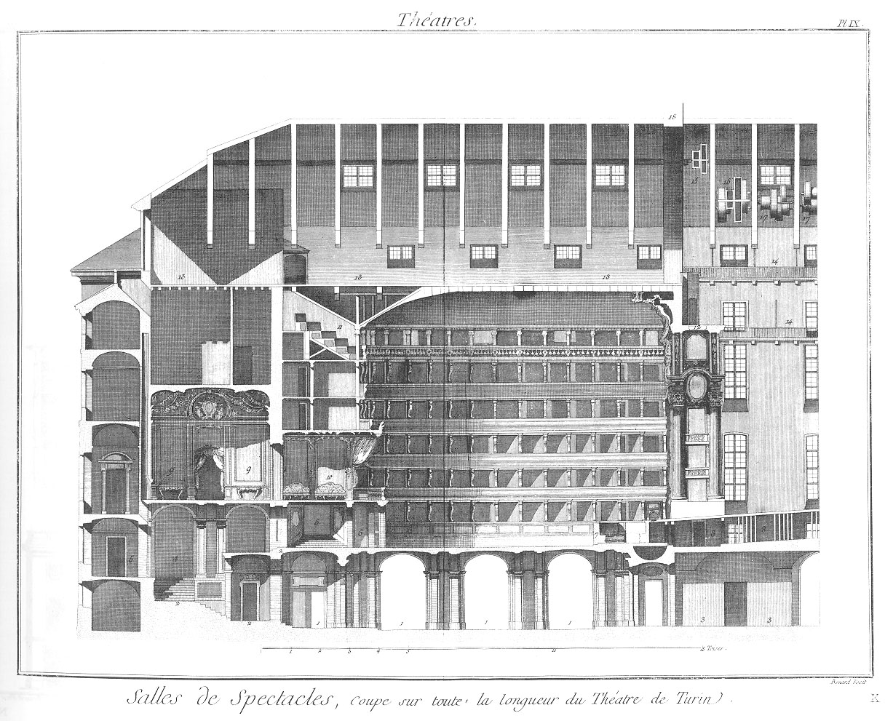
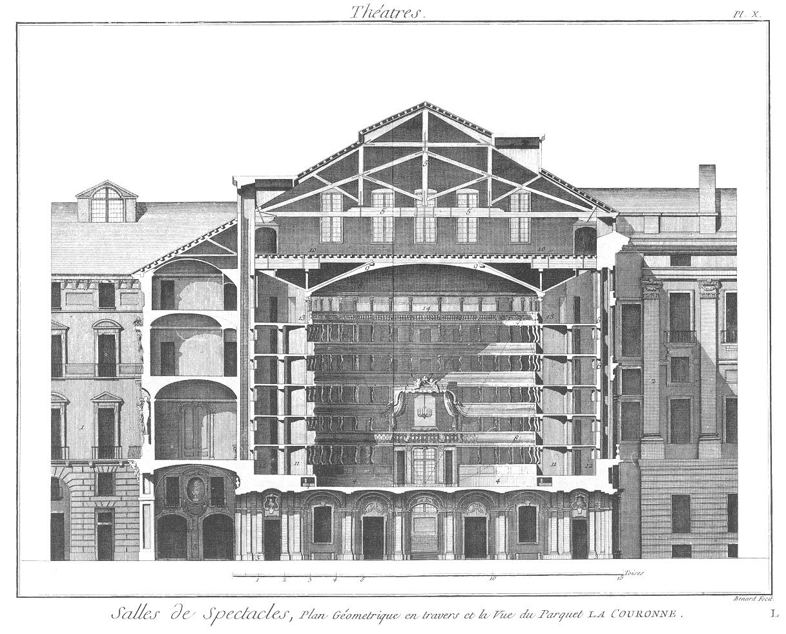

EXPLICATION de ce qui est tracé
sur les dix Tables qui représentent les
Plan & Coupe du Théâtre Royal de Turin
======================================

Théâtre Royal de Turin, ouvert sur la fin de l'année 1740.

PLANCHE Iere.
-------------

Premiere Table, du rez-de-chaussée au-dessous du Theâtre.

1. Portiques qui environnent la place derriere le château royal.

2. Jardin de l'Académie.

3. Fabriques appartenantes à l'Académie.

4. Imprimerie Royale au-dessus de laquelle sont les Archives Royales.

5. Vestibule sous la salle du théâtre.

6. Entrée pour les chaises-à-porteurs.

7. Entrée pour les voitures qui viennent à l'opéra, & leur sortie à la fin de l'opéra.

8. Passage pour les voitures avant l'opéra, & leur entrée à la fin de l'opéra.

9. Huit petites niches de pierre concaves jusques à terre & trouées, avec de petits puits de sable pour y faire de l'eau.

10. Corps-de-garde.

11. Magasins pour les bois nécessaires au théâtre.

12. Escalier pour les acteurs.

13. Rampe pour faire monter des chevaux sur le théâtre.

14. Egouts des latrines avec leurs ouvertures au dessus du toit.

15. Puits d'où l'on peut tirer de l'eau de tous les étages jusqu'au haut du théâtre.

16. Deux escaliers pour monter au paradis, destinés pour les domestiques & les petites gens.

17. Trois autres escaliers que l'on ouvre à la fin de l'opéra pour laisser sortir le peuple.

18. Porte principale d'entrée.

19. Loge pour celui qui vend des billets.

20. Autre Loge pour celui qui vend des livres.

PLANCHE II.
-----------

Seconde Table, des constructions du Théâtre de Turin.

La figure 1. montre la forme ovale de la salle.

Quoique la figure circulaire paroisse la plus convenable, l'ovale est cependant la plus commune, & se démontre par elle-même; on la partage par le milieu, & on en produit une moitié pour former le derriere du théâtre, ce qui est nécessaire pour conserver un peu de courbure dans les deux côtés. Après avoir fixé la profondeur des loges & la largeur des corridors, on a pratiqué ce qui suit.

Ayant pris pour centres les extrémités du diametre contre le mur, on décrit les portions de cercle A A, qui doivent toucher la ligne de l'ovale ; & sa parallele B, prolongée depuis le centre C, se divise en cinq parties égales pour avoir six centres 1, 2, 3, 4, 5, 6, puisqu'il faut diviser en six parties les parquets qui restent formés par les deux côtés D, E, F, G, H, I. Prenant ensuite pour centre le point I, on décrit la portion de cercle D; & du centre 2 on décrit la portion suivante E, & ainsi de l'un & de l'autre côté. 

7. Concavité pratiquée sous l'orchestre, au moyen de laquelle on a prétendu rendre les instrumens plus sonores; aux deux extrémités de cette concavité, on a pratiqué deux tubes ou tuyaux, qui s'élevent jusqu'à la hauteur de la salle, ce qui ne laisse pas que de produire quelque effet.

8. Quatre Fourneaux d'attraction où l'air s'introduit par le bas depuis le vestibule, en circulant par plusieurs gros tuyaux de fer, passe par des canaux bien cimentés & bien murés sous le premier rang des loges, & sort tout enflammé autour de la salle. Chacun des fourneaux débouche par deux endroits, comme on le voit sur la Planche, par une embouchure d'un demi-pied de Paris de diametre, & chaque embouchure est couverte d'une grande plaque ronde de métal, qui, tournant dans l'enchâssure d'une petite corniche, regle la chaleur au degré que l'on veut.

9. Conduite des latrines en pietre avec des tuyaux de plomb.

10. Diagonales pour former les degrés principaux des corridors.

La figure 2, après le contour de la salle, est un détail de tout ce qui est nécessaire.

11. Ligne parallele au contour ci-dessus, qui sert de centre aux poutres élevées pour soutenir les différens étages de loges. Il faut remarquer que ces poutres penchent toutes également en arriere par leur bout d'en-haut, qui s'éloigne du centre d'un sixieme de pié de roi de France, pour jetter une partie du fardeau sur les murailles, & pour résister à la force impulsive du poids de la circonférence contre le centre, quoique peu considérable. La raison pour laquelle on n'a pas posé lesdites poutres sur la premiere ligne de l'ellipse, a été de donner une vue plus grande & plus étendue aux fonds de ces mêmes loges.

12. Ponts sur la ligne susdite, & à égale distance, pour le compartiment des loges.

13. Mur qui sépare les loges des corridors, & qui soutient le plancher des premieres, qui est en bois, & des secondes qui sont cadastrées.

14. Portions de cercle concentriques sur les ponts ci-dessus 12, lesquelles prolongées contre le mur 13, donnent les deux extrémités de la ligne droite qui divise les loges depuis 12 jusques à 13.

15. Centres des susdits cercles sur la troisieme ligne, qui sert de fond aux loges.

16. Lignes qui marquent les portes d'entrée au milieu de chaque loge, partent du bas de chacune de ces portes, & aboutissent au centre susdit 15, & cela pour ôter & remplir l'angle aigu, qui seroit contraire au son de la voix, outre qu'il sert encore à renforcer les murailles.

17. Centres pour la direction des traverses clouées aux poutres dont nous venons de parler, & qui leur servent d'ornement & de soutien, & afin qu'elles soient toutes en équerre sur la ligne des parapets.

18. Autre centre pour fermer l'orchestre A en ligne sphérique, & qui sert aussi pour tracer une partie du contour qui forme le bord de l'échaffaud, c'est- à-dire B, A, C.

19. Autre centre pour poursuivre le même contour depuis C jusques à D. Par le moyen de cet avancement la voix ne se perd pas parmi les ornemens du fond du théâtre; au contraire s'approchant toujours plus des spectateurs, elle devient plus sonore, & répond mieux dans la salle, qui en est aussi mieux éclairée par la grande quantité de lumieres que l'on a coutume d'y mettre, & sur-tout le fond, ou la façade du fond du théatre, qui ordinairement est richement ornée de figures ou de sculptures dorées.

PLANCHE III.
------------

Troisieme Table, du plein-pié & du premier rang des loges.

1. Escalier principal à double rampe.

2. Autre escalier pour sortir après l'opéra.

3. Boutique pour les rafraîchissemens.

4. Chambre pour le jeu.

5. Entrée principale pour le plein-pié.

6. Plein-pié, où les bancs s'élevant toujours l'un plus que l'autre du côté du fond en forme d'amphithéâtre, font que l'on voit mieux le théâtre & les acteurs.

7. Six portes qui entrent sous la scene ou le théatre.

8. Autres portes pour sortir après l'opéra, collatérales à l'orchestre A.

9. Quatre escaliers pour monter aux différens étages des corridors.

10. Cabinets pour les commodités.

11. Escaliers que nous avons déja marqués pour monter au paradis, avec une communication aux escaliers précédens des corridors, & que l'on ouvre après l'opéra pour que les domestiques puissent sortir plus promptement, & faire leur service.

12. Dessous du théâtre où sont les machines pour le mouvement & le changement des décorations, un peu différentes & plus aisées que celles dont on s'étoit servi jusqu'à présent.

13. Lieu assez vaste, pour préparer les décorations, qui sert aussi pour descendre ou pour monter les machines, selon le besoin.

14. Magasins pour différentes choses nécessaires au théâtre.

PLANCHE IV.
-----------

Quatrieme Table, du second rang des loges.

1. Galerie par où la Cour vient du palais royal au spectacle.

2. Salle des gardes par où passe un piquet ou un détachement de ces mêmes gardes pour se tenir dans le parterre au-dessous du parquet du roi, & qui passe & descend par le petit escalier A: les gens de livrée y passent aussi pour monter à l'endroit du paradis qui leur est destiné.

3. Salle des pages avec différentes armoires pour les tapissiers & ceux qui vendent des rafraîchissemens.

4. Chambre de la cour.

5. Cabinet pour la reine & les princesses royales.

6. Cabinet de commodité.

7. Entrées aux loges du côté B, destinées pour les grands, & ceux qui sont actuellement en service, avec leurs sorties dans les corridors C.

8. Entrée du parquet royal dit la couronne.

9. Boissages armés de fer, qui restent ordinairement enchâssés autour du parquet. Ils tournent sur des gonds forts & proportionnés pour s'ouvrir, & servent à diminuer la grandeur du parquet au cas qu'il y eût moins de personnes dedans, ou que la saison fût extrêmement rigoureuse.

10. Le parquet de la scene.

11. Autre partie de parquet pour faire paroître & donner un plus grand éloignement aux décorations, & pour représenter des feux d'artifice sans risque; cette partie s'abaisse comme un pont-levis, selon le besoin, sur une basse-cour, où elle est soutenue par quatre corbeaux de pierre attachés au mur opposé.

12. Deux parquets pour les chantres.

13. Salle & chambre pour faire les épreuves de l'opéra, & où s'assemblent les directeurs.

14. Lieu fort élevé, qui sert à déposer les décorations & les machines, afin que le parquet reste plus libre ; & en terme de théâtre, on le nomme la chapelle.

15. Trois chambres pour les acteurs avec toutes leurs commodités. 

16. Magasins des lumieres, appellé les petites caves, avec divers rangs d'étagères pour les placer facilement, les préparer & les allumer, attendu leur hauteur. Pour cela la porte est fort élevée: il y a aussi des fourneaux avec des chaudieres pour liquéfier l'huile, au cas qu'elle fût gelée; & outre leurs tuyaux, il y a au haut de la voûte plusieurs ouvertures qui aboutissent dans une grande chambre à cheminée ouverte au-dessus du toit pour évaporer la fumée.

17. Chambre appellée le feu commun, où sont les domestiques.

PLANCHE V.
----------

Table cinquieme, du troisieme étage des loges.

1. Huit cabinets où s'habillent les danseurs avec leurs escaliers en particulier.

PLANCHE VI.
-----------

Table sixieme, du quatrieme Etage des Loges.

1. Chambres où s'habillent les musiciens.

2. Autre chambre où les danseurs s'habillent.

3. Chambre où il y a plusieurs soupentes les unes sur les autres pour différens magasins & diverses commodités & entrepôts du théâtre ; le reste sert à un autre usage.

PLANCHE VII.
------------

Table septieme, du cinquieme Ordre des Loges.

1. Galeries qui regnent à double rang l'une sur l'autre, le tour des murs de la scene nécessaire au méchanisme des décorations.

PLANCHE VIII.
-------------

Table huitieme, du Paradis.

1. Lieu séparé en forme d'amphithéâtre pour les gens qui ne portent pas livrée.

2. Passage au dessous.

3. Lieu destiné à la livrée de la cour.

4. Autre endroit destiné à la livrée des ambassadeurs.

5. Lieu pour le public.

6. Loges destinées aux personnes ordinaires.

7. Grand tableau au milieu des ornemens dorés du lambris, ou de l'architrave du fond du théâtre, qui s'ouvrant, fait un passage à un grand candélabre qui porte douze torches avant & après l'opéra; on l'a placé dans cet endroit-là pour ne pas interrompre le lambris ou le grand plafond par une ouverture au milieu, comme il est pratiqué dans tous les autres théâtres: ce qui, outre le préjudice que cela porte à la voix, qui exige une solide, parfaite & générale union & liaison des parties, rend de plus, en peu de tems, la peinture sale & difforme, & incommode les spectateurs, soit des loges, qui sont éblouis par le grand éclat de ces lumieres, soit du parterre, sur lequel il tombe toujours de la poussiere ou d'autres immondices de cette ouverture.

PLANCHE IX.
-----------

Table neuvieme, coupe sur toute la longueur du théâtre de Turin.

1. Portes d'entrée.

2. Escalier principal. Planche premiere.

3. Magasins.

4. Ouverture sous le vestibule d'où l'on prend l'air pour les fourneaux, comme nous l'avons marqué dans la seconde Planche (Fig. 1.).

5. Boutique pour les rafraîchissemens.

6 Entrée du parterre, & au premier étage des loges.

7. Orchestre avec un vuide dessous.

8. Dessous de la scene avec une partie de l'armement qui soutient le parquet.

9. Chambre pour la cour.

10. Parquet du roi, ou la couronne.

11. Amphithéâtre sous le Paradis.

12. Ouverture par où descend le grand candélabre.

13. Endroit fort vaste pour peindre les décorations.

14. Les deux balcons qui environnent tout le parquet de la scene dont nous avons parlé dans la septieme Table.

15. Tambour pour le candélabre.

16. Autres tambours pour la toile.

17. Endroit fort vaste & tout ouvert pour descendre les cordages sans nombre, nécessaires pour dresser les décorations, & les suspendre. Au-dessous est un entrepôt pour une partie des choses destinées non seulement aux décorations, mais encore à toute autre machine que l'on voudroit construire.

18. Grand arc sur lequel est élevé un mur qui sépare les toits de la salle & de la scene, pour prévenir tout accident de feu.

PLANCHE X.
----------

Table dixieme, plan géométrique en-travers & la vue du parquet, la couronne.

1. Perspective des fabriques & des maisons qui environnent la place derriere le château royal.

2. Façade des archives royales, le jardin de l'Académie, du dessein du feu célébre abbé D. Philippe Juvara, premier architecte du roi de Sardaigne.

3. Portique & entrée des archives.

4. Vuides pour les tuyaux des fourneaux.

5. Rangs des poutres qui forment le toit, tant sur la salle de peinture que sur le parquet de la scene.

6. Vuides pour conserver l'ordre des grandes fenêtres sans interruption, qui ont vue sur le jardin de l'académie, & ensemble pour donner du jour & de l'air à tous les étages des corridors.

7. Centre d'où l'on a décrit la portion de cercle qui forme le plafond de la salle, afin que le son de la voix & les rayons de la lumiere soient renvoyés vers le milieu de la salle. L'on voit sur le plafond représenté en fort belle peinture le mariage de Jupiter & de Junon, accompagnés de tous les dieux de la fable. La partie convexe au-dessus dudit plafond est couverte d'un ciment fort dur, afin que si l'on verse de l'eau dans la salle des peintures, qui est au-dessus, la peinture n'en soit pas endommagée.

8. Cercle pointé pour marquer la proportion de la salle aussi large que haute.

9. Encaissemens continués tout autour dans la corniche, couverts & enduits d'un bon ciment, & presque remplis de sable, pour absorber l'eau, qui découlant de la salle supérieure, pourroit tomber sur la partie convexe du plafond dont nous avons parlé.

10. Salle fort vaste & fort éclairée pour peindre les scenes, avec des cheminées, &c.

11. Séparation des loges.

12. Séparation des corridors.

13. Paradis.

14. Amphithéâtre au fond du paradis.

[->](../02-Salle_de_la_Comédie_de_Lyon/Légende.md)
