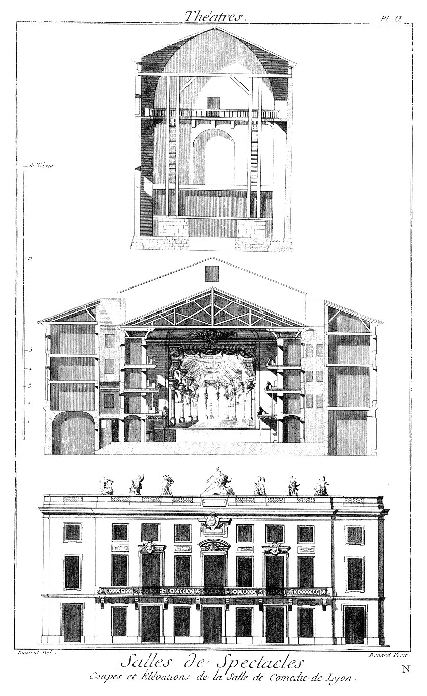

Plan, Coupe & Elévation de la Salle de la Comédie de Lyon
=========================================================

Salle de la Comédie de Lyon, exécutée sur les desseins de M. Soufflot, Architecte & Contrôleur des Bâtimens du Roi.

PLANCHE I. & II.
----------------

Les renvois sont gravés sur les Planches dont les desseins ont été faits par M. Dumont, professeur d'architecture.

[->](../03-Plan_du_Théatre_d'Argentine_à_Rome/Légende.md)
