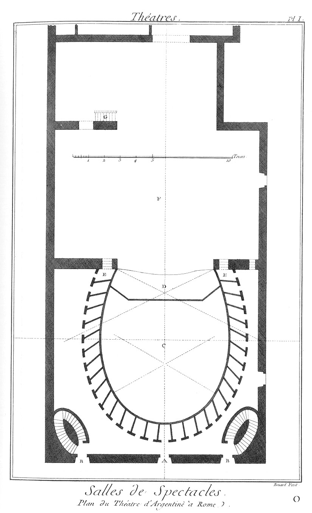
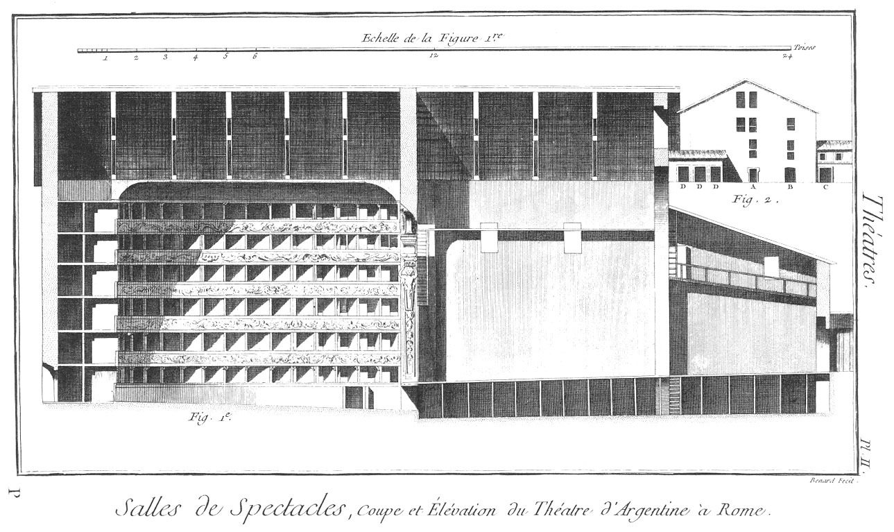

Plan du Théâtre d'Argentine à Rome.
===================================

Ce théâtre est le plus estimé de tous par rapport à sa forme; l'on entend bien les acteurs, & la voix ne se perd point. 

PLANCHE Iere.
-------------

- A, porte qui conduit à toutes les premieres loges & à la platée ou parterre.
- B, portes & escaliers qui conduisent aux 2, 3, 4, 5 & 6es loges.
- C, platée ou parterre.
- D, place de l'orchestre.
- E, premieres loges: elles servent pour les acteurs & danseurs, & les secondes servent aux entrepreneurs du théatre.
- F, théâtre.
- G, escalier de bois qui sert à descendre sous le théâtre.

PLANCHE II.
-----------

Fig.
1 &
2. Coupe & élévation du théâtre d'Argentine à Rome. Renvois de la figure 2.

	- A, porte qui conduit indifféremment aux premieres loges, à la platée & aux loges supérieures.
	- B, lieu où se distribuent les billets, & d'où l'on peut aller aux 2, 3, 4, 5 & 6es loges.
	- C, remise indépendante du théâtre, qui sert de corps de-garde.
	- D, remises indépendantes du théâtre.

[->](../04-Plan_du_Théatre_de_Tordinone_à_Rome/Légende.md)
