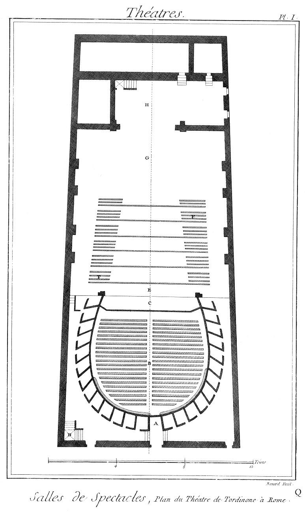

Plan du théatre de Tordinone à Rome.
====================================

PLANCHE Iere.
-------------

- A, porte du parterre.
- B, parterre.
- C, orchestre.
- D, escalier de bois qui conduit aux loges.
- E, théâtre où jouent les acteurs & les actrices.
- F, conduits pour les décorations.
- G, emplacement destiné au service des machines.
- H, magasins.

[->](../05-Plan_du_Théatre_Royal_de_S._Charles,_à_Naples/Légende.md)
