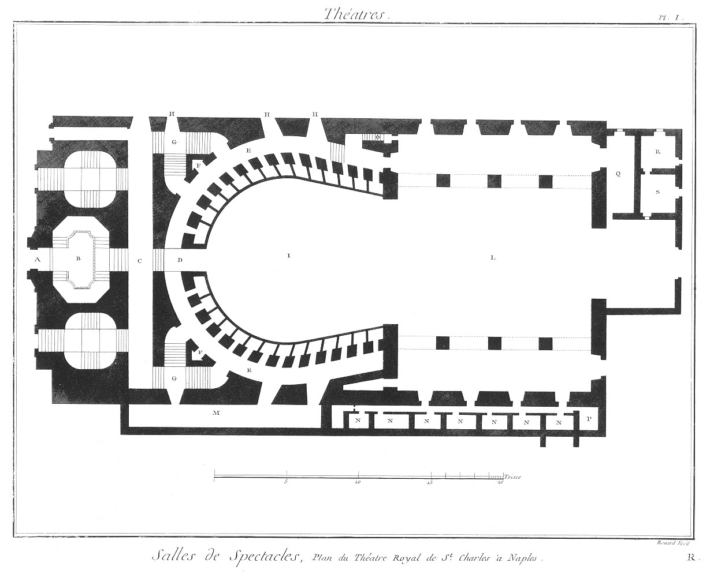
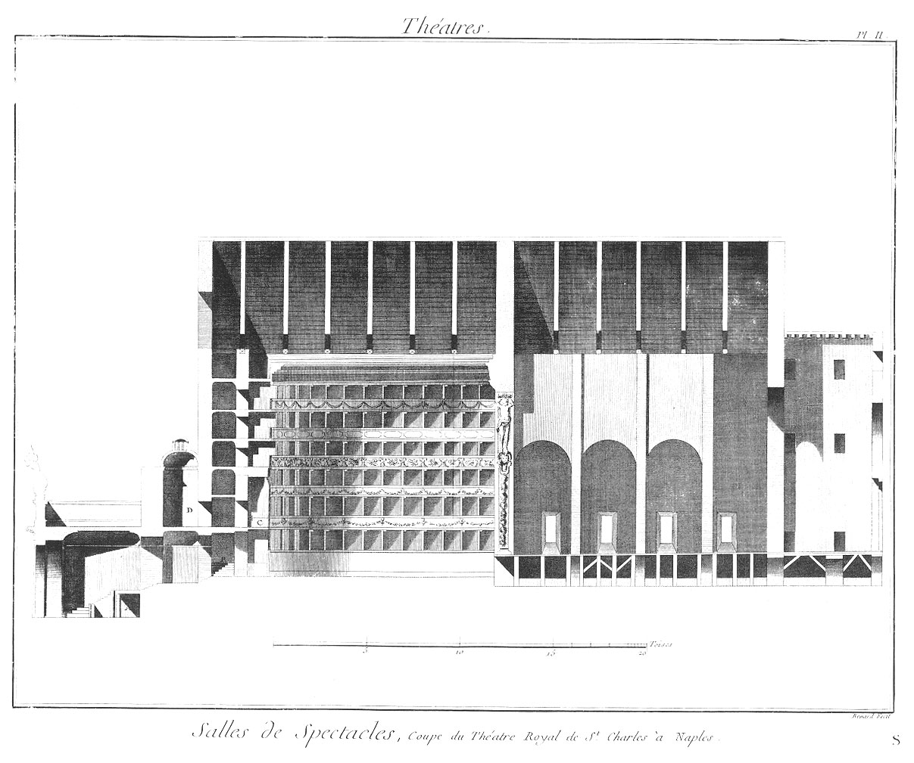

Plan du Theâtre Royal de S. Charles, à Naples.
==============================================

PLANCHE Iere.
-------------

- A, grande porte du milieu qui conduit à l'atrio ou vestibule, & aux escaliers qui conduisent aux galeries.
- B, vestibule.
- C, galerie.
- D, porte qui introduit à la platée ou parterre.
- E, galerie qui conduit aux loges.
- F, lieux communs.
- G, escaliers qui conduisent aux 2, 3, 4, 5 & 6es loges.
- H, portes latérales qui introduisent également aux galeries & aux loges supérieures.
- I, platée ou parterre.
- L, théâtre.
- M, galerie qui conduit du palais aux loges.
- N, chambre pour les acteurs, danseurs & tailleurs.
- O, escaliers qui conduit sous le théâtre. P, chambre où travaillent les perruquiers.
- Q, magasin de chandelle pour le théâtre. R, S, garderobes.

PLANCHE II.
-----------

Coupe du théâtre royal de S. Charles à Naples.
	- A, chambre du receveur des billets.
	- B, galerie qui conduit aux premieres loges.
	- C, loge du roi.
	- D, sallon contigu à la loge du Roi.

[->](../06-Salle_de_Spectacle_de_la_Comédie_Françoise/Légende.md)
