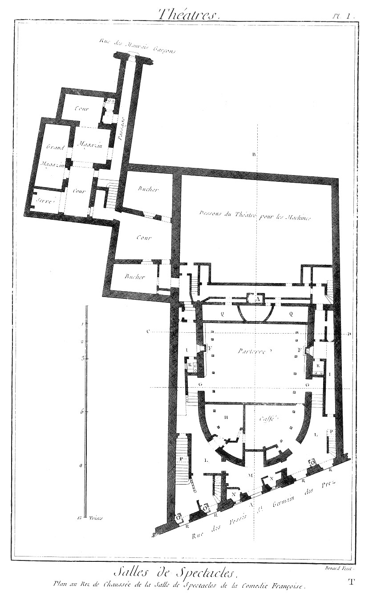

Plan au rez-de-chaussée de la
Salle de Spectacle de la Comédie Françoise
==========================================

PLANCHE Iere.
-------------

- E, place du souffleur.
- F, poëles.
- G, portes du parterre.
- H, corps-de-garde.
- I, passages.
- K, latrines.
- L, passages.
- M, salle des décomptes.
- N, bureaux de recette.
- O, bureaux des contre-marques.
- P, escaliers qui conduisent aux premieres loges & à l'amphithéâtre.
- Q, dessous du parquet.
- R, portes d'entrée.

PLANCHE II.
-----------

Plan du premier étage de la Salle de Spectacle de la Comédie Françoise.

- E, ouverture pour le souffleur.
- F, orchestre.
- G, parquet.
- H, balcons.
- I, loge du roi.
- K, loge de la reine.
- L, corridor des premieres loges.
- M, petites cours.
- N, amphithéâtre.
- O, entrée de l'amphithéâtre.
- P, passages.
- Q, escaliers des seconde & troisieme loges.
- R, loge d'acteur.
- S, grand balcon.

PLANCHE III.
------------

Coupe en longueur prise sur la ligne A, B, de la Planche premiere.

PLANCHE IV.
-----------

Elévation du côté de l'entrée du bâtiment, & coupe en travers prise sur la ligne C, D, de la Planche premiere.

[->](../07-Plan_du_Théatre_de_Parme/Légende.md)
