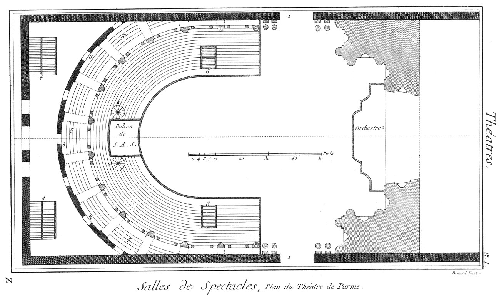

Plan du théâtre de Parme.
=========================

PLANCHE Iere.
-------------

- 1, porte du théâtre.
- 2, escaliers qui conduisent au balcon de Son Altesse Sérénissime.
- 3, corridor.
- 4, escaliers qui conduisent au parquet.
- 5, gradins.
- 6, entrée du parquet.

[->](../08-Plans_de_la_Salle_des_Machines_aux_Tuileries/Légende.md)
