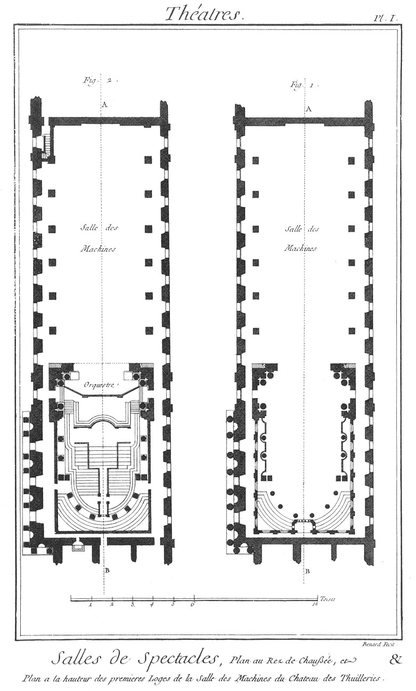

Plans de la salle des machines aux Tuileries.
=============================================

PLANCHE Iere.
-------------

Fig.
1. Plan du rez-de-chaussée de la salle du château des Tuileries.

2. Plan à la hauteur des premieres loges de la salle du château des Tuileries.

[->](../09-Salles_de_Montpellier_&_de_Metz/Légende.md)
