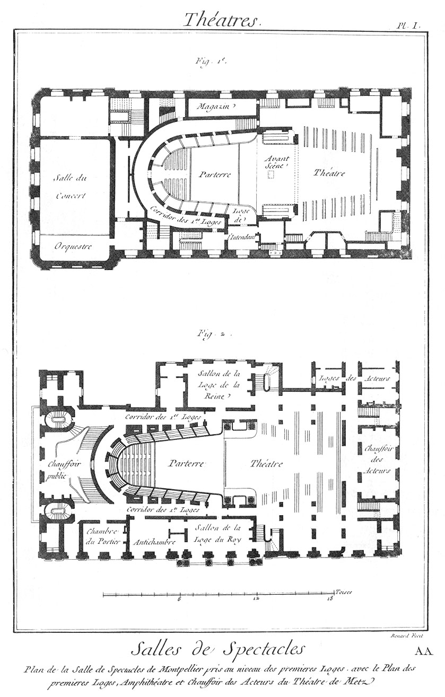

Salles de Montpellier & de Metz.
================================

PLANCHE Iere.
-------------

Fig.
1. Plan de la salle de spectacle de Montpellier, pris au niveau des premieres loges.

2. Plan des premieres loges, amphithéâtre & chauffoir des acteurs du théâtre de Metz.

[->](../10-Salle_de_l'Opera/Légende.md)
