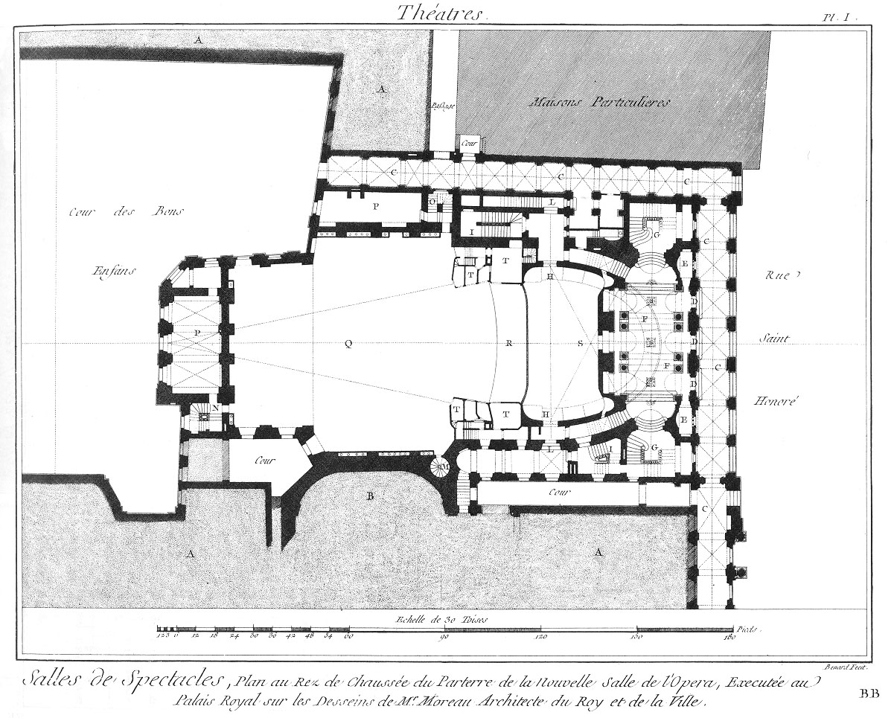

Salle de l'Opera
================

Salle de l'Opera, executée sur les desseins de M. Moreau, Architecte du Roi & de la Ville.

PLANCHE Iere.
-------------

- A, bâtimens du palais royal.
- B, escalier du palais royal.
- C, galerie extérieure.
- D, entrées de l'opéra.
- E, bureaux pour la distribution des billets.
- F, vestibule intérieur de l'opéra.
- G, grands escaliers de l'opéra.
- H, entrées du parterre.
- I, escaliers des petites loges.
- L, parties du parterre.
- M, escalier de service.
- N, escalier du théâtre & du ceintre.
- O, escalier des acteurs.
- P, loges des acteurs.
- Q, dessous du théâtre.
- R, orchestre.
- S, parterre.
- T, loges.

PLANCHE II.
-----------

Plan du théâtre & des premieres loges de la nouvelle salle de l'opéra du palais royal.

	- A, bâtimens du palais royal.
	- B, escalier du palais royal.
	- C, escalier de l'opéra.
	- D, foyer public avec balcon sur la rue.
	- E, amphithéâtre.
	- F, parterre.
	- G, orchestre.
	- H, théâtre.
	- I, escalier de sortie.
	- L, balcons.
	- M, loges.
	- N, corridor.
	- O, escaliers de services.
	- P, escaliers des petites loges.
	- Q, caffé intérieur.
	- R, salle des comptes & la direction.
	- S, foyer des acteurs.
	- T, loges des acteurs. 

[->](../11-Plan_&_Coupe_d'un_Projet_de_Salle_de_Concert/Légende.md)
