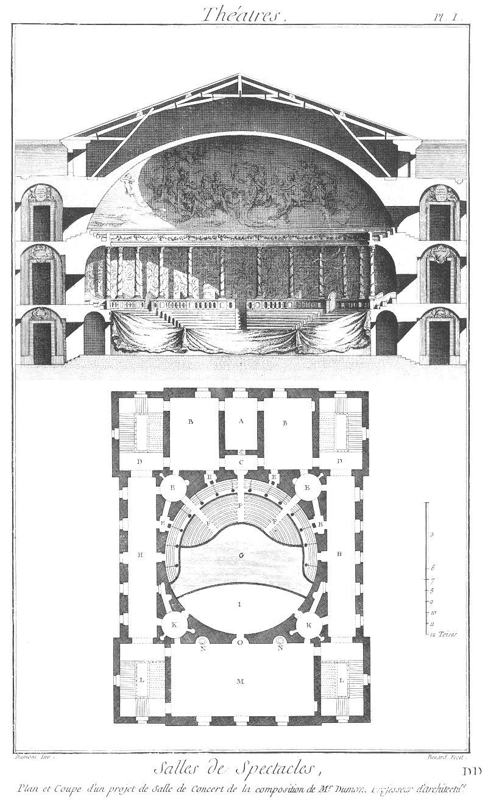

Plan & coupe d'un projet de salle de concert
============================================

Plan & coupe d'un projet de salle de concert, de la composition de M. Dumont, professeur d'architecture, & membre des Académies de Rome, Florence & Bologne.

PLANCHE Iere.
-------------

- A, chauffoir des ouvreuses de loges.
- B, pieces où les ouvreuses de loges reçoivent les contre-marques.
- C, principale entrée de l'amphithéâtre.
- D, paliers des escaliers par où arrivent les spectateurs.
- E, passages & entrées des loges.
- F, amphithéâtre.
- G, parquet.
- H, galeries de communication.
- I, orchestre.
- K, dégagemens des acteurs & actrices.
- L, escaliers des acteurs & actrices.
- M, salle de répétition.
- N, poëles.
- O, principale entrée de l'orchestre.
- P, ouverture destinée pour le passage d'un lustre & pour rompre les échos, s'il s'en trouvoit.

[->](../12-Plan_du_Rez-de-Chausée_d'un_Projet_de_Salle_de_Spectacle/Légende.md)
