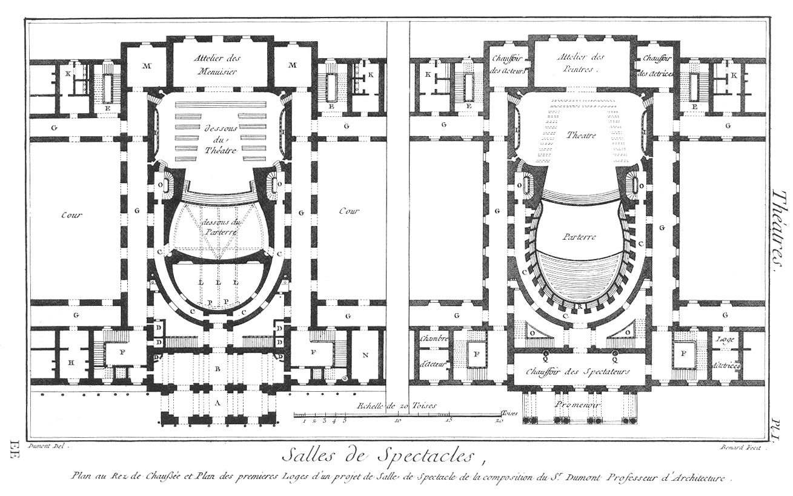
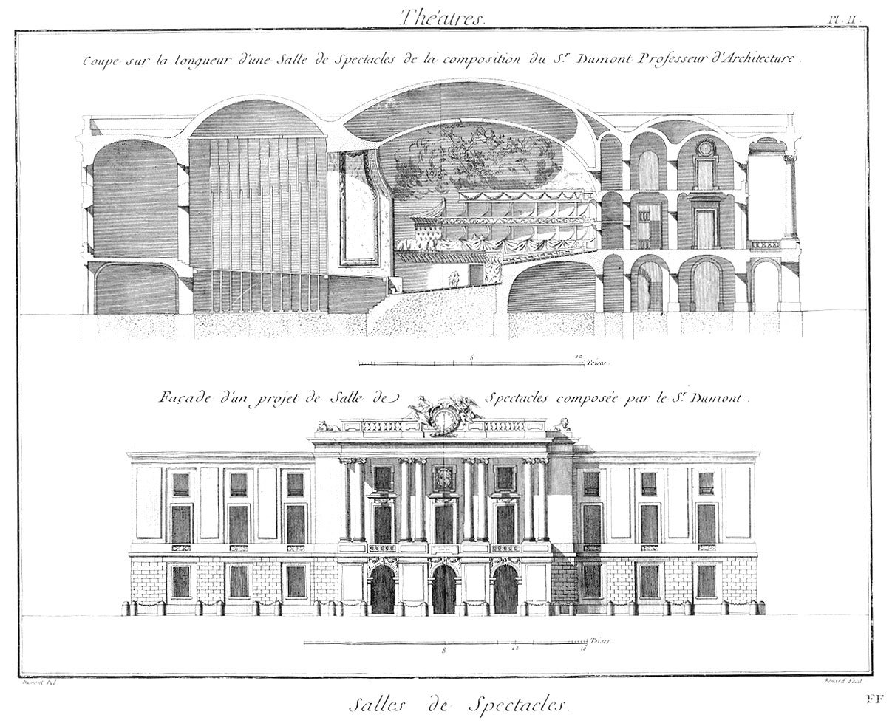

Plan du rez-de-chaussée d'un projet de salle de spectacle
=========================================================

Plan du rez-de-chaussée d'un projet de salle de spectacle, de la composition de M. Dumont, professeur d'architecture, & membre des académies de Rome, Florence & Bologne.

PLANCHE Iere.
-------------

- A, portique.
- B, vestibule.
- C, corridor.
- D, bureaux.
- E, escaliers pour les acteurs & actrices.
- F, grand escalier pour la noblesse.
- G, galeries.
- H, corps de-garde.
- I, passage des contrepoids.
- K, latrines.
- L, leviers.
- P, contrepoids pour lever le parterre au niveau du théâtre à l'imitation des ponts-levis.
- Q. poële.
- R, entrée de l'amphithéâtre.
- M, magasins.
- N, charbonnieres.
- O, escaliers des loges.

PLANCHE II.
-----------

Coupe & élévation d'un projet de salle de spectacle, de la composition de M. Dumont, professeur d'architecture & membre des académies de Rome, Florence & Bologne.

L'auteur a imaginé des voûtes pour la sûreté & la tranquillité publique.

Nota. Que lesdites voûtes seront en briques, pour éviter la pesanteur & la poussée.

Le sieur Dumont, en voûtant jusques au-dessus du théâtre, n'a pensé qu'à une salle de comédie.

En cas d'exécution, il seroit facile de substituer, dans cette partie seulement, une bonne charpente bien élevée, pour faire place aux machines.

L'auteur a cru ne devoir point placer de loges au-dessus de celles destinées pour le roi & pour la reine.

[->](../13-La_Salle_de_Stutgard/Légende.md)
