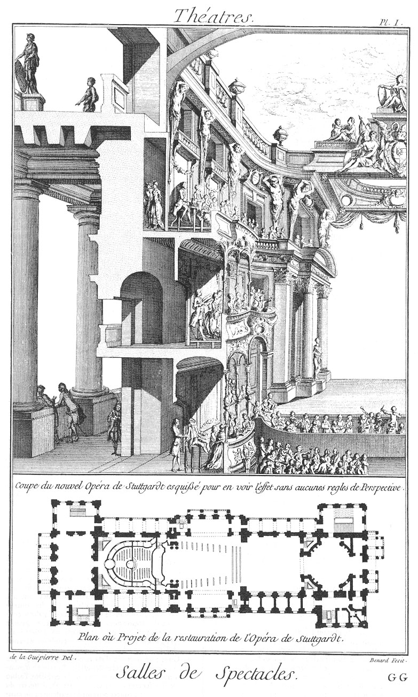

La salle de Stutgard
====================

Plan & coupe du projet de la restauration de  la salle de Stutgard, de la composition de M. de la Guepiere, chevalier de S. Michel, architecte de S. A. S. Monseigneur le Prince de Wirtemberg, & correspondant de l'académie royale d'architecture.

PLANCHE Iere.
-------------

Voyez la Planche qui s'explique d'elle-même.

[->](../../09-Machines_de_Théatre/Légende.md)
