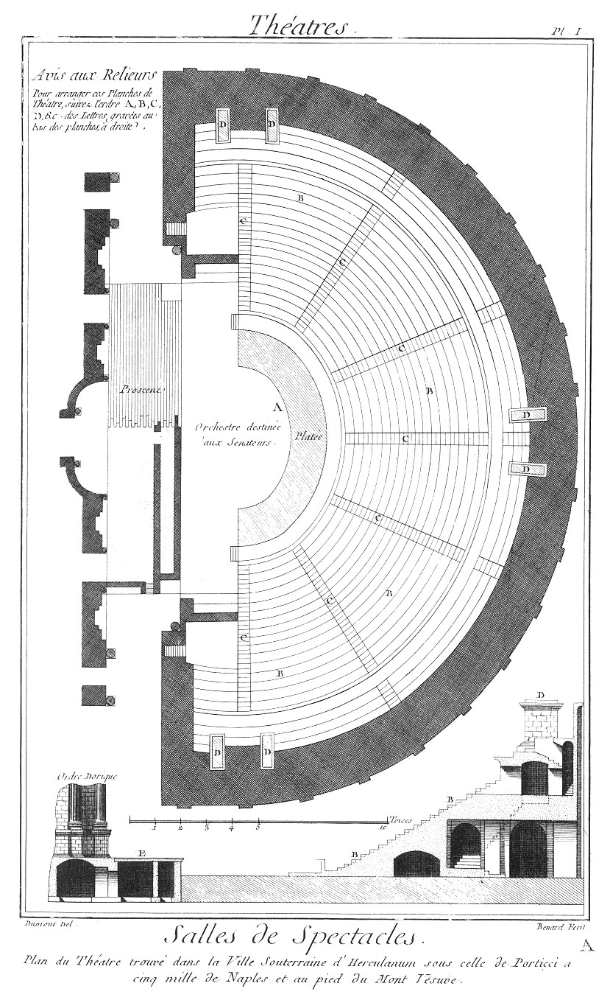

THÉATRES
========

Contenant trente-huit Planches à cause de sept doubles. 

PLANCHE Iere.
-------------

Plan & profil du Théâtre d'Herculanum.
	- A, orchestre destiné aux sénateurs.
	- B, gradins sur lesquels se plaçoient les spectateurs.
	- C, petits escaliers pour aller aux gradins.
	- D, piédestaux sur lesquels étoient des figures de bronze.
	- E, proscenium sur lequel les acteurs se présentoient.

[->](01-Théatre_Royal_de_Turin/Légende.md)
