MACHINES DE THÉATRE - PREMIERE SECTION.
=======================================

PLANCHE Iere.
-------------

[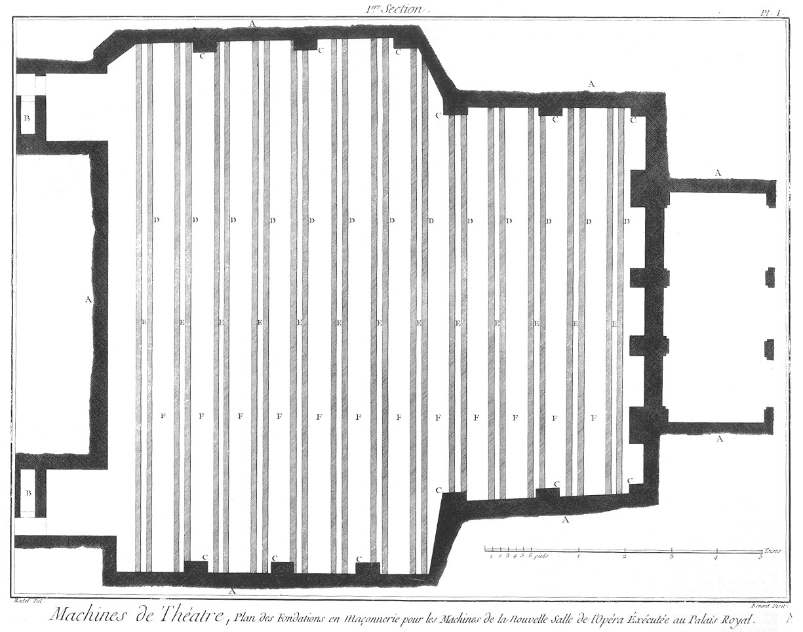](Planche_01.jpeg)

Le théâtre de l'opéra de Paris est distribué sur treize plans de profondeur; toutes les trappes sont de chacune deux piés onze pouces de large d'une ferme à l'autre; les quatre fermes contenant les trois trapillons, sont de deux piés deux pouces de dehors en dehors; ainsi une trappe & les quatre fermes sont de cinq piés un pouce du devant d'un chassis à l'autre.

L'ouverture du premier chassis est de dix sept piés du milieu du théâtre à la raie du chassis, l'ouverture du n° 13 est de huit piés six pouces du milieu du théâtre à la raie du faux chassis : ce qui fait à chacun huit pouces & demi de dégradation. Ce qui fait la levée du théâtre de dix sept piés de large, parallele jusqu'au n°. 8; & la levée du n°. 8 jusqu'au 13, de quatorze piés de large, parallele au milieu du théâtre.

Les premiers faux-chassis sont de vingt-deux piés de haut du théâtre à la tête, & quatre piés de large de dehors en dehors. Du n°. 1 au n°. 13, chaque faux-chassis dégrade de onze pouces, & tous les faux-chassis sont de largeur égale. Détail circonstancié des termes usités dans la construction dudit Théâtre. Articles du Plancher.

On entend par trappes un feuillet composé de quatre planches embarrées par-derriere de deux barres portant sur les deux sablieres de fermes.

On entend par fermes un assemblage de quatre sablieres, dont deux à trois pouces de distance l'une de l'autre, & les deux autres à neuf pouces pour le passage des décorations.

Les trapillons servent à couvrir le vuide des fermes entre les trappes.

Les chassis sont des assemblages de bâtis & traverses & pour le service des décorations une échelle pratiquée au derriere.

Plan des fondations en maçonnerie du théâtre.

	- A, murs dans-oeuvre, & faisant le contour de la salle.
	- B, cheminée ou passage des contrepoids.
	- C, piés droits servant à soutenir la poussée des murs, & formant le passage desdits contrepoids.
	- D, parpins de pierre portant la construction en charpente des fermes.
	- E, passage des décorations.
	- F, largeur de rue : on entend par rue la distance d'un chassis à l'autre.

PLANCHE II.
-----------

[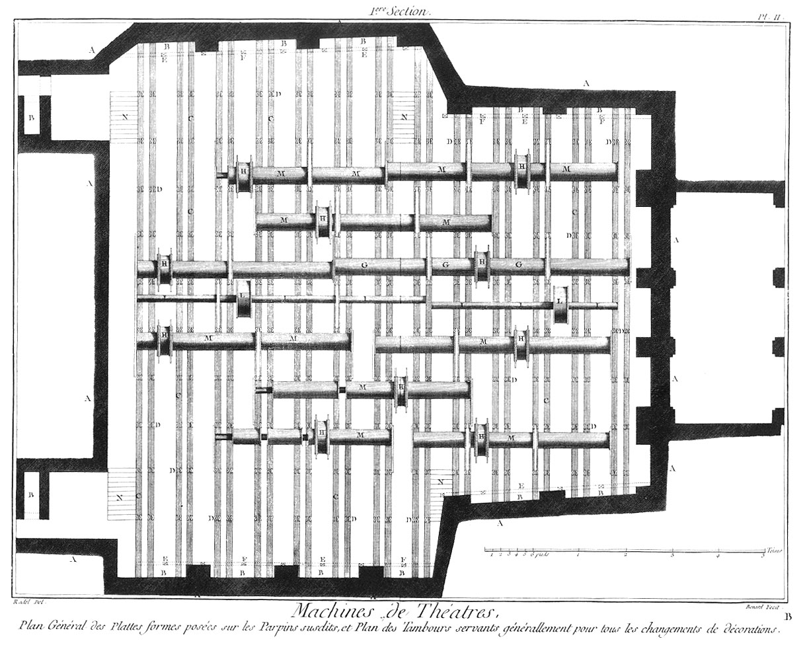](Planche_02.jpeg)

Plan général des plate-formes posées sur les parpins susdits, & des tambours servant généralement pour tous les changemens.

	- A, contours des murs de la salle.
	- B, cheminées des contrepoids.
	- C, plate-formes posées sur les parpins.
	- D, montans servant à porter les sablieres & assemblées dans lesdites plate-formes.
	- E, fermes des côtes servant à soutenir les abouts des sablieres du plancher du théâtre.
	- F, montans des fermes dans lesquels sont boulonnées les poulies pour recevoir les frottemens des cordages de retraite des communications des tambours.
	- G, tambours du chemin ceintré sur lesquels  sont renvoyés les fils des anses qui portent les chemins des vaisseaux.
	- H, tambours des retraites des contrepoids qui développent les fils.
	- I, tambours pour les cordages des changemens, lesquels cordages sont accrochés dans les porte mousquetons de tous les chassis.
	- L, tambours des retraites. On entend par retraite un cordage arrêté sur le tambour L, du sens contraire au cordage arrêté sur le meme tambour L, pour conduire la pesanteur du contrepoids.
	- M, tambours particuliers pour équipper toutes les machines en général.
	- N, escaliers pour la manoeuvre.

PLANCHE III.
------------

[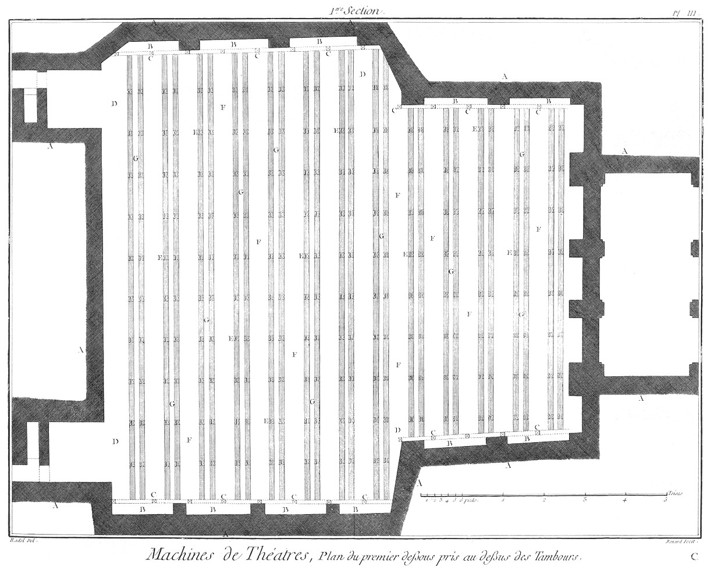](Planche_03.jpeg)

Plan du premier dessous au dessus des tambours.

	- A, contours des murs de la salle.
	- B, cheminée des contrepoids.
	- C, ferme de côté portant les abouts des sablieres.
	- D, escaliers de main-d'oeuvre.
	- E, montans des fermes portant les sablieres.
	- F, trappes faisant la longueur des rues.
	- G, trapillons.

PLANCHE IV.
-----------

[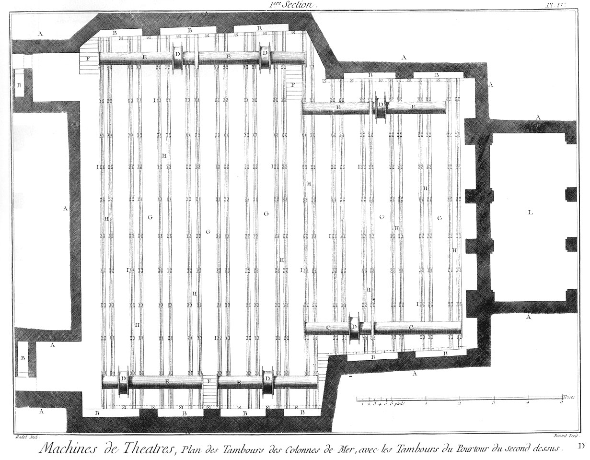](Planche_04.jpeg)

Tambour du pourtour du second dessus.

	- A, contours des murs de la salle.
	- B, cheminée des contrepoids.
	- C, tambours sur lesquels sont renvoyés les cordages montant les colonnes de mer.
	- D, tambour de retraite sur lesquels sont arrêtés à contresens le cordage à la main & le cordage du contrepoids.
	- E, tambours pour l'équippement des machines du théâtre.
	- F, escaliers de main d'oeuvre.
	- G, largeur de rue.
	- H, petite rue servant pour le passage des décorations.
	- I, montans portant les sablieres.
	- L, loge d'acteurs.

PLANCHE V.
----------

[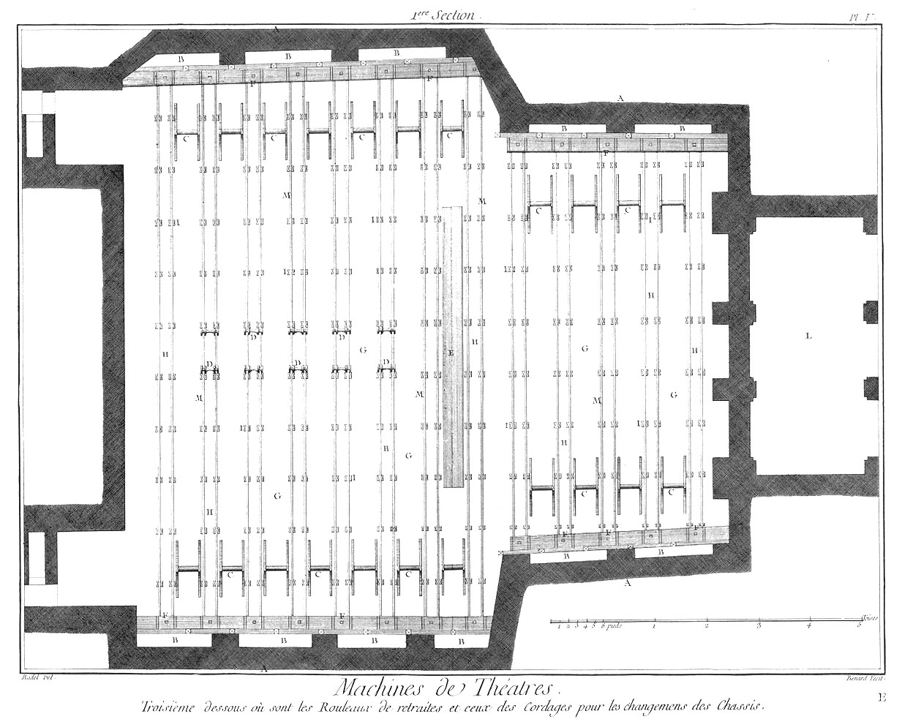](Planche_05.jpeg)

Troisieme dessous où sont les rouleaux des retraites.

	- A, contours des murs de la salle.
	- B, cheminée des contrepoids.
	- C, rouleaux des retraites ou traverses de charpente arrondie, assemblés dans deux montans écharpés, sur lesquels est entouré le cordage des retraites de contrepoids, autant que leur charge le permet.
	- D, rouleaux recevant le frottement des cordages des changemens de chassis.
	- E, plancher recevant le chemin chantourné du vaisseau.
	- F, mouffle à plat, dans lequel est une poulie horisontale, sur laquelle passe le cordage des deux chassis.
	- G, grande rue.
	- H, petite rue.
	- I, montans des sablieres.
	- L, loges d'acteurs.
	- M, passage des chassis qui portent la décoration.

PLANCHE VI.
-----------

[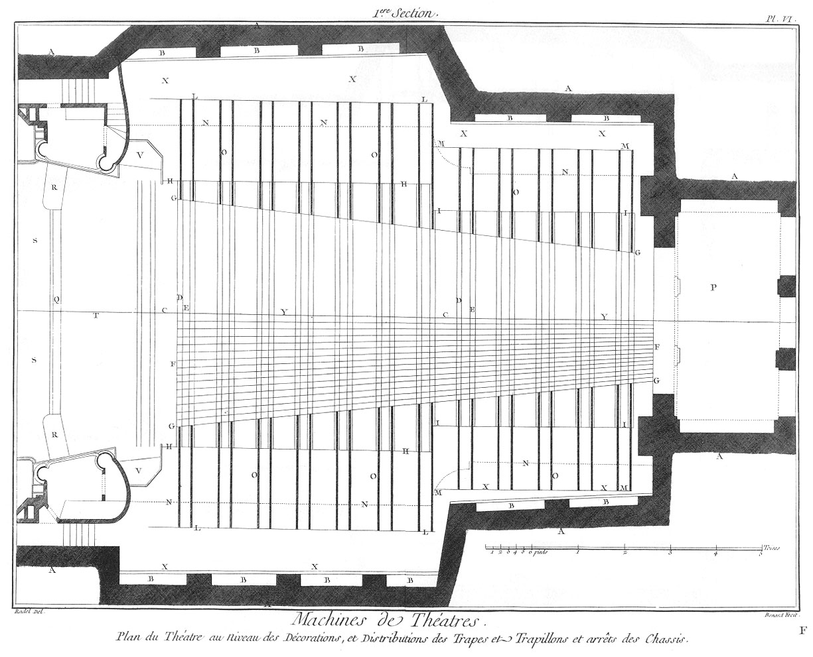](Planche_06.jpeg)

Plan du théâtre au niveau des décorations, où se voient les distributions des trappes, trapillons & arrêts des chassis.

	- A, contours des murs.
	- B, cheminée des contrepoids.
	- C, grande trappe.
	- D, petit trapillon.
	- E, grand trapillon.
	- F, pié dégradé du théâtre ou échelle servant à la dégradation de la perspective des décorations pour les traces.
	- G, arrivée des chassis à leur point de vue.
	- H, ouverture de trappes servant de levée au théâtre.
	- I, depuis le n°. 1 jusqu'au n°. 8, du n°. 8 au 13.
	- L, reculée des chassis du n°. 1 jusqu'au 8 parallele.
	- M, reculée des chassis du n°. 8 jusqu'au 13 parallele.
	- N, à-plomb des corridors du dessus du théâtre qui donnent la longueur des plafonds, & la reculée des chassis pour la largeur des décorations.
	- O, coulisses ou chemins des faux-chassis au théâtre.
	- P, fond du théâtre servant à éloigner le point de perspective pour donner plus de profondeur aux décorations, & en même tems pour serrer les accessoires.
	- Q, rampe ou trappe en gradin, s'élevant à volonté par le moyen d'un treuil, laquelle rampe est chargée de biscuits ou plaques chargées de lumiere pour éclairer l'avant-scene.
	- R, crachoir ou petite loge prise dans l'épaisseur de la rampe.
	- S, orchestre.
	- T, avant-scene.
	- U, trône pour les acteurs, où ils se placent pendant les ballets.
	- X, place pour les décorations où on les met en tas pour le besoin.
	- Y, milieu du théâtre.

PLANCHE VII.
------------

[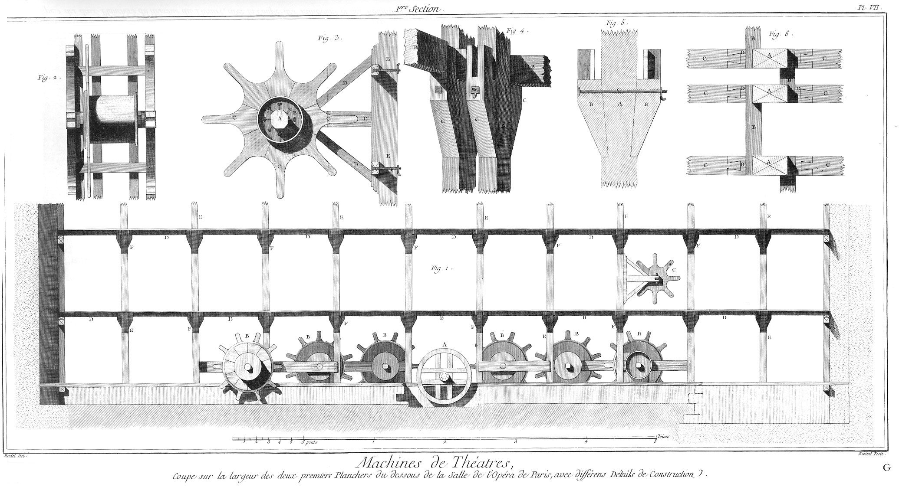](Planche_07.jpeg)

Cette Planche représente la coupe sur la largeur des deux premieres planches du dessous de l'opéra de Paris, avec différens détails de construction.

Fig.
1. Coupe des treuils & tambours pour les différens changemens du dessous du théâtre.
	- A, tambour du changement pour faire mouvoir les chassis du théâtre.
	- B, tambours des différens changemens que l'on peut faire dans un opéra.
	- C, tambour servant à monter des autels, trappes & figures dans le milieu du théâtre.
	- D, entretoises servant à retenir l'écartement des montans des fermes.
	- E, montans où sont assemblées les entretoises.
	- F, chantignole boulonnée dans les montans, recevant les entretoises.

2. Elévation géométrale du tambour, servant à monter les autels, &c.

3. Représentant la coupe du tambour servant à monter les autels ci-dessus.
	- A, arbre servant d'anse à la construction du tambour.
	- B, vuide entre l'anse & les tringles du diametre.
	- C, palettes servant à faire tourner le tambour.
	- D, assemblage du chevalet.
	- E, montant de ferme dans lequel sont assemblées les sablieres.
	- F, boulon à écrou, tenant le chevalet dans les sablieres.

4. Assemblage des montans des chantignoles & des entretoises.
	- A, montant des fermes.
	- B, entretoises assemblées dans les montans.
	- C, chantignoles boulonnées dans les montans, recevant les entretoises.

5. Coupe géométrale des montans des fermes avec les chantignoles assemblées & boulonnées.
	- A, montans des fermes.
	- B, chantignoles.
	- C, boulon à écrou retenant l'assemblage des chantignoles.

6. 
	- A, Plan des montans, entretoises & chantignoles, avec le détail de la construction.
	- B, entretoises tenant l'écartement des fermes.
	- C, entretoises de face.
	- D, plan des chantignoles.

PLANCHE VIII.
-------------

[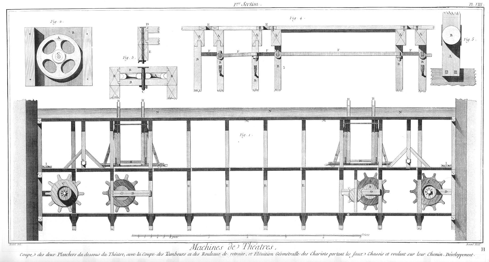](Planche_08.jpeg)

Cette Planche représente le second, troisieme & quatrieme dessous, & le plancher du théâtre.

Fig.
1. Coupe des deux planchers du niveau du dessous du théâtre avec la coupe des tambours des rouleaux des retraites, & élévation géométrale des chariots portant les faux-chassis, & roulant sur leur chemin.
	- A, tambour du second dessous servant à monter des vues de mer.
	- B, tambour des fils portant les ames des colonnes de mer.
	- C, tambour du pourtour nécessaire aux machines à construire.
	- D, jumelles portant les tambours.
	- E, montant des fermes.
	- F, entretoises de faces tenant les écartemens des poteaux montans.
	- G, chariot roulant sur son chemin, & portant les décorations. Voyez-en les détails en grand & les développemens, Pl. XIII. XIV. XV.
	- H, bas du chassis portant la décoration & passant dans les chariots.
	- I, mouffle à plat dans lequel passe le cordage tenant le chariot.
	- L, rouleau de retraite, sur lequel passe le cordage du tambour pour les différens changemens.
	- M, sablieres portant le plancher du théâtre.
	- N, plancher du théâtre en recouvrement sur les sablieres.

2. Représentant la poulie dans sa mouffle, servant à faire mouvoir les chassis du chariot.
	- A, poulie de cuivre servant à rouler le cordage du chariot pour les mouffles.
	- B, mouffle servant de chape à la poulie.
	- C, tourillon de la poulie.

Fig.
3. Coupe géométrale de la poulie dans sa chape boulonnée dans la sabliere.
	- A, coupe de la poulie de cuivre.
	- B, coupe de la chape assemblée.
	- C, boulon ou tourillon de la poulie.
	- D, chape boulonnée dans la sabliere.
	- E, sabliere.

4. Coupe sur la longueur des quatre sablieres d'unt grande trappe & de trois trapillons arrêtés par des goujons dans les sablieres.
	- A, coupe des sablieres.
	- B, montans des fermes assemblées dans les sablieres.
	- C, trappe de la grande rue.
	- D, grand trapillon du passage des décorations.
	- E, petit trapillon des coulisses.
	- F, crochets servant d'entretoises aux sablieres.

5. 
	- A, montant dans lequel est assemblé le rouleau pour le frottement des cordages de retraites.
	- B, retraites.

PLANCHE IX.
-----------

[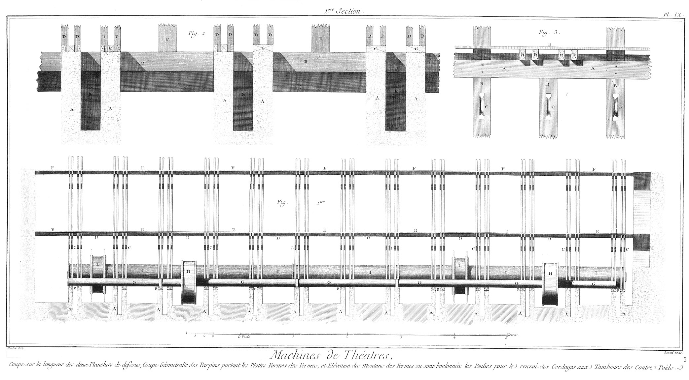](Planche_09.jpeg)

Fig.
1. Coupe sur la longueur des deux planches de dessous avec leur machine.
	- A, murs de fondation recevant les plate-formes des fermes.
	- B, plate-formes des fermes posées sur les parpins.
	- C, montans des fermes.
	- D, entretoises tenant l'écartement des rues & des fermes.
	- E, planches du premier dessous.
	- F, planches du second dessous.
	- G, tambour du changement pour les faux cordages des chassis.
	- H, tambour pour les retraites des contrepoids & les retraites de main d'oeuvre.
	- I, tambour où s'empouillent les fils des différentes machines.
	- L, tambour des retraites du contrepoids & des retraites à la main.

2. Coupe géométrale sur la longueur des murs en parpins, recevant les plate-formes & charpente des fermes.
	- A, murs en parpins.
	- B, entredeux des murs pour descendre les décorations à plomb des trapillons dans le plus profond du théâtre.
	- C, plate-formes où sont assemblés les montans des fermes.
	- D, montans des fermes.
	- E, traverse des fermes de charpente de côte, recevant l'about des sablieres des fermes du théâtre.
	- F, montant de charpente dans lequel sont boulonnées les poulies servant de communication de cordage aux contrepoids.

3. Elévation géométrale en coupe sur la longueur où sont boulonnées les poulies pour le renvoi des cordages aux tambours des contrepoids.
	- A, traverse du premier étage des fermes de côte.
	- B, montant des fermes.
	- C, poulies boulonnées dans les fermes où passent les cordages des contrepoids.
	- D, abouts des entretoises des fermes.
	- E, planches du premier dessous.

PLANCHE X.
----------

[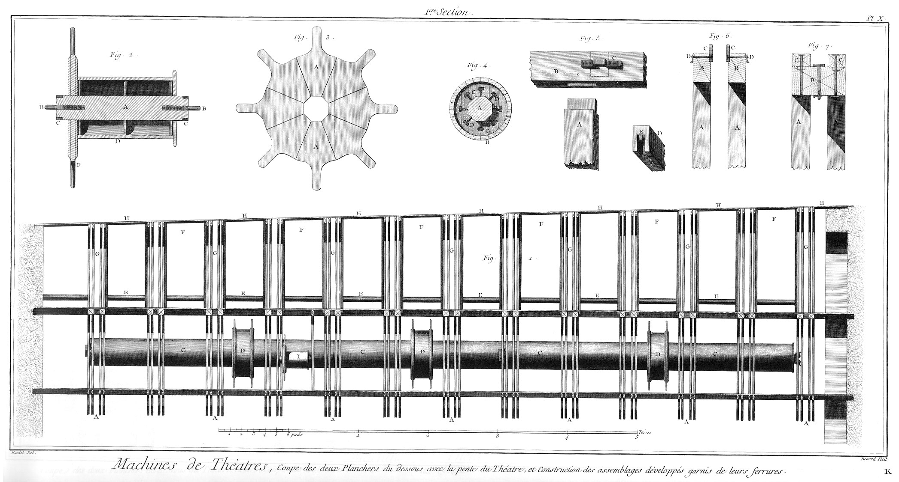](Planche_10.jpeg)

Coupe des deux planches du dessous avec la pente du théâtre & la construction des assemblages & ferrure détaillée.

Fig.
1. Représentant les deux planches de dessous avec les montans & sablieres.
	- A, les quatre fermes portant les trois trapillons liées avec les entretoises.
	- B, entretoises tenant l'écartement des fermes.
	- C, tambour des cordages des ames des cassettes.
	- D, tambour des retraites à la main & des contrepoids.
	- E, rouleau de force sur lequel passe le cordage de retraite pour la main-d'oeuvre.
	- F, grande rue.
	- G, petite rue pour le passage des décorations.
	- H, plancher du théâtre.
	- I, petit tambour servant à différentes machines.

2. Coupe géométrale d'un tambour portatif propre à enlever des figures & autels.
	- A, arbre ou mandrin.
	- B, boulon ou tourillon clavetté dans l'arbre & lice servant d'axe.
	- C, clavette.
	- D, diametre du tambour.
	- E, tourte portant le renflement du tambour.
	- F, palettes faisant étoile, & servant pour la main-d'oeuvre.

3. 
	- A, construction des palettes à l'entour de l'arbre.

4. Coupe géométrale du mandrin avec le renflement des tringles.
	- A, mandrin.
	- B, tringles assemblées & arrêtées sur les tourtes au renflement du tambour.
	- C, tourte sur laquelle sont arrêtées les tringles du renflement.
	- D, patte clouée dans le mandrin & dans les tringles.

Fig.
5. Représentant l'assemblage des montans dans les sablieres avec les crampons recevant les entretoises des écartemens du premier plancher du dessous du théâtre.
	- A, montant des fermes.
	- B, sabliere assemblée en chapeau dans le montant des fermes.
	- C, crampon boulonné sur la sabliere, recevant les crochets des entretoises tenant l'écartement des grandes rues.
	- D, entretoise des écartemens.
	- E, crochet s'accrochant dans le crampon C.

6. Coupe géométrale d'une ferme avec les navettes de fer, sur lesquelles roulent les roulettes des chariots du dessous.
	- A, montant des fermes.
	- B, sabliere assemblée à chapeau sur les fermes.
	- C, navette de fer sur laquelle roulent les roulettes.
	- D, boulon à écrou, boulonné sur les sablieres, retenant les chemins du chariot.

7. Coupe géométrale d'une autre construction de ferme, dans laquelle roulent des chariots d'une autre construction, dont on verra les détails dans les Planches XIII. XIV. & XV.
	- A, montant des fermes.
	- B, plate-formes assemblées en chapeau sur la tête des fermes.
	- C, conduits des chariots ou sablieres, & recevant les poteaux du premier dessous.

PLANCHE XI.
-----------

[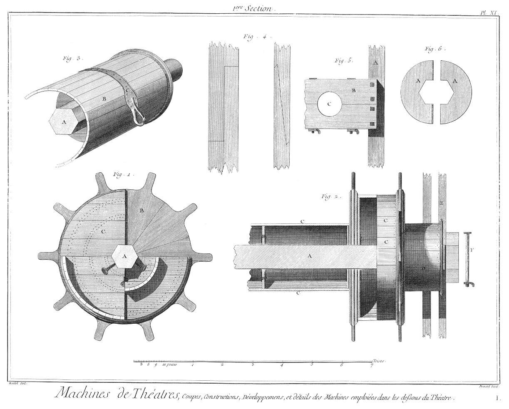](Planche_11.jpeg)

Coupes, développemens & détails en grand des machines employées dans les dessous de l'opéra avec leur construction.

Fig.
1. Arbre ou ame servant d'axe, sur lequel se construisent les tambours des différens diametres pour les forces & emplois des machines.
	- B, tourte assemblée & formant étoile, laquelle est barrée avec une tourte de chaque côte.
	- C, tourte signifie surface de planches assemblées à rainures & languettes, & clouées à contre-sens à double épaisseur sur chaque côte des palettes formant étoile.

2. Coupe géométrale & construction d'un tambour sur la longueur des grand & petit diametre.
	- A, mandrin ou arbre.
	- B, tourte sur laquelle portent les renflemens formant tambours.
	- C, tringles assemblées ensemble, & formant les tambours.
	- D, tambour.
	- E, montant des fermes sur lesquelles est boulonnée une jumelle, qui signifient deux morceaux de bois assemblés & boulonnés, dans lesquels passent les arbres des tambours.
	- F, boulon tenant les jumelles.

3. Coupe en perspective d'un tambour assemblé sur son arbre, avec un crochet sur lequel s'accrochent les cordages des mouvemens.
	- A, mandrin.
	- B, tambour.
	- C, crochet.

4. Assemblage & enture des sablieres.

5. Elévation géométrale des jumelles boulonnées sur les fermes.
	- A, montant des fermes.
	- B, jumelles boulonnées sur le montant.
	- C, passage de l'arbre du tambour.

6. Construction de tourte formant tambour.
	- A, tourte.

PLANCHE XII.
------------

[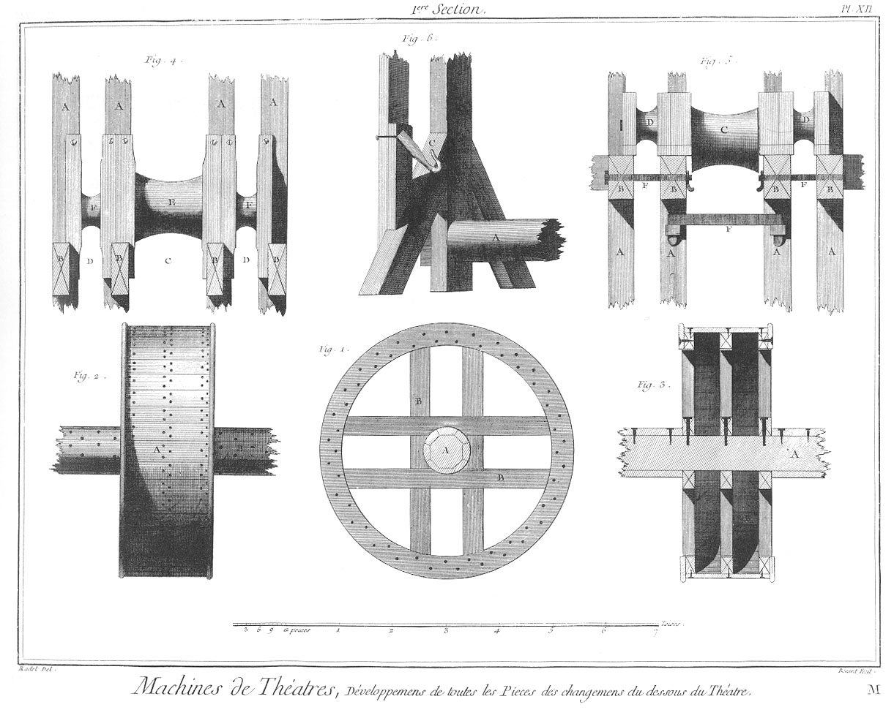](Planche_12.jpeg)

Cette Planche représente toutes les pieces de changement du dessous du théâtre.

Fig.
1.
	- A, arbre du tambour du changement.
	- B, construction du tambour.

2. Elévation géométrale du tambour du changement.
	- A, tambour de retraite.
	- B, tambour des fils.

3. Coupe géométrale du tambour & de sa construction.
	- A, arbre ou mandrin.
	- B, tambour.

4. Plan & écartement des fermes dans lesquelles sont assemblés les rouleaux sur lesquels passent les cordages pour les changemens des chassis.
	- A, plan des sablieres.
	- B, montant des fermes.
	- C, écartement des grands trapillons.
	- D, écartement des petits trapillons.
	- E, rouleau sur lequel passe le cordage  pour le changement de chassis.
	- F, petit rouleau servant au besoin.

Fig.
5. Elévation géométrale & écartement des quatre fermes dans lesquelles passent les cordages.
	- A, montant des fermes.
	- B, sabliere.
	- C, rouleau sur lequel passent les cordages des changemens.
	- D, petit rouleau pour les besoins.
	- E, crochet de fer tenant l'écartement des grands trapillons.
	- F, boulon tenant l'écartement des petites fermes.

6. Construction de charpente écharpée recevant les rouleaux sur lesquels passent les cordages des tambours, avec les crochets pour les mettre en retraite.
	- A, rouleau sur lequel est enveloppé le cordage.
	- B, montant de charpente écharpé, dans lequel sont assemblés les rouleaux de force.
	- C, crochet de retraite.

PLANCHE XIII.
-------------

[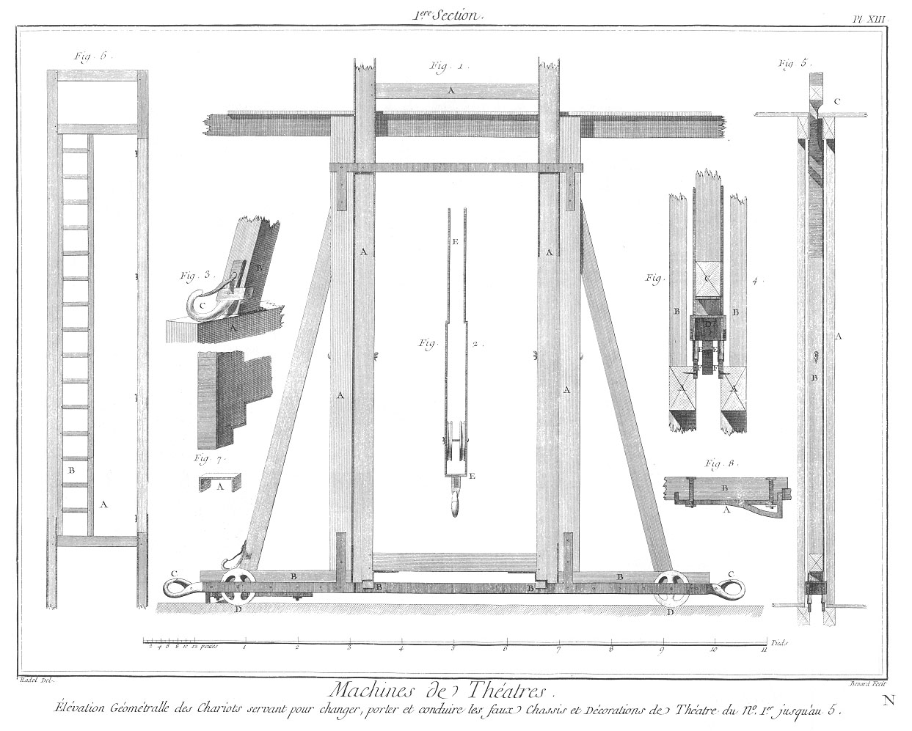](Planche_13.jpeg)

Elévation géométrale des chariots servant pour les changemens des faux chassis & décorations du théâtre, depuis le 1 jusqu'au 5; ces chariots sont faits pour porter & conduire les faux-chassis des décorations.

Fig.
1. Développement dudit chariot.
	- A, montant du chariot.
	- B, patin dudit chariot où sont ajustées des roulettes de cuivre, avec des armatures de fer qui tiennent les porte-mousquetons.
	- C, porte-mousquetons tenant les armatures de fer.
	- D, roulettes des chariots roulans sur les navettes de fer.
	- E, plan de l'armature de fer des patins des chariots avec les roulettes & porte-mousquetons.

2.
	- A, chassis portant la décoration du théâtre, arrêté avec des boulons dans les chariots.

3. Elévation en perspective du patin des chassis avec les portes-mousquetons.
	- A, patin du chariot.
	- B, écharpe assemblée dans le montant du chariot & dans le patin.
	- C, porte-mousqueton dans lequel s'accrochent les cordages des chassis pour les changemens de décorations.

4. Elévation en coupe d'un patin du chariot avec les navettes de fer, sur lequel roulent les roulettes sur les navettes de fer arrêtées sur les sablieres des fermes.
	- A, sablieres.
	- B, montans des fermes.
	- C, patin du chariot.
	- D, armature de fer.
	- E, roulettes roulantes sur les navettes.

5. Elévation géométrale en coupe d'un chariot, d'une ferme & d'un chassis.
	- A, montant de ferme.
	- B, chariot.
	- C, plancher du théâtre.

6.
	- A, faux chassis portant les décorations du théâtre.
	- B, échelle pour la main-d'oeuvre des ouvriers, c'est-à-dire pour accrocher les décorations par le haut & des portans lumiere.

7. Taquet de fer embrevé sur les plate-bandes des patins des chariots pour porter les chassis.
	- A, taquet de fer posé sur la plate-bande & sur la lettre B.
	- B, plate-bande.

8. Arrêt du chassis boulonné dans le chariot.
	- A, arrêt dudit chassis.
	- B, patin du chariot.

PLANCHE XIV.
------------

[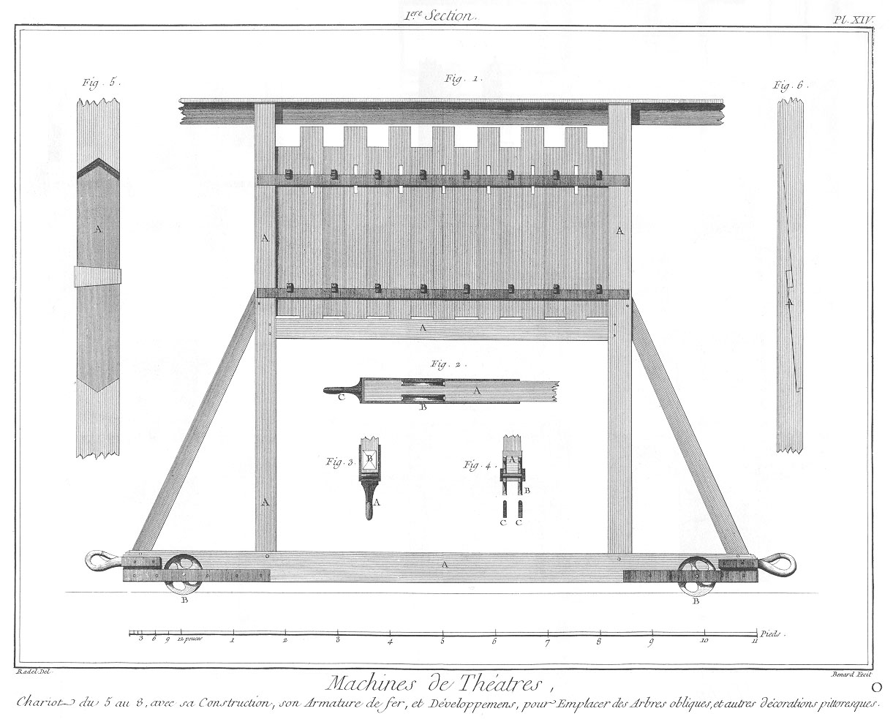](Planche_14.jpeg)

Cette Planche représente les chariots avec leur construction, armature de fer, depuis le 5 jusqu'au 8.

Fig.
1.
	- A, chariot avec la distribution des poteaux & cassettes qui se peuvent incliner d'une épaisseur de poteau à l'autre, pour y placer les échelles de perroquet faisant office des faux-chassis, pour y placer des arbres obliques & autres décorations pitoresques.
	- B, roulettes des chariots.

2. Plan du patin avec son armature de fer & roulettes.
	- A, patin.
	- B, roulettes.
	- C, portes-mousquetons pour accrocher les cordages des changemens.

3. Plan du porte-mousqueton dans lequel est accroché le faux cordage du changement.
	- A, porte-mousqueton.
	- B, plan de l'écharpe assemblée dans le patin & dans le battant du chariot.

4. Elévation géométrale en coupe du patin du chariot avec les roulettes.
	- A, patin.
	- B, roulettes.
	- C, navette de fer sur laquelle roulent les chariots.

Fig.
5. Plan & coupe des sablieres pour les entures.
	- A, plan de la sabliere.

6. coupe de la sabliere sur l'enture sur le champ.
	- A, plan de la sabliere sur le champ.

PLANCHE XV.
-----------

[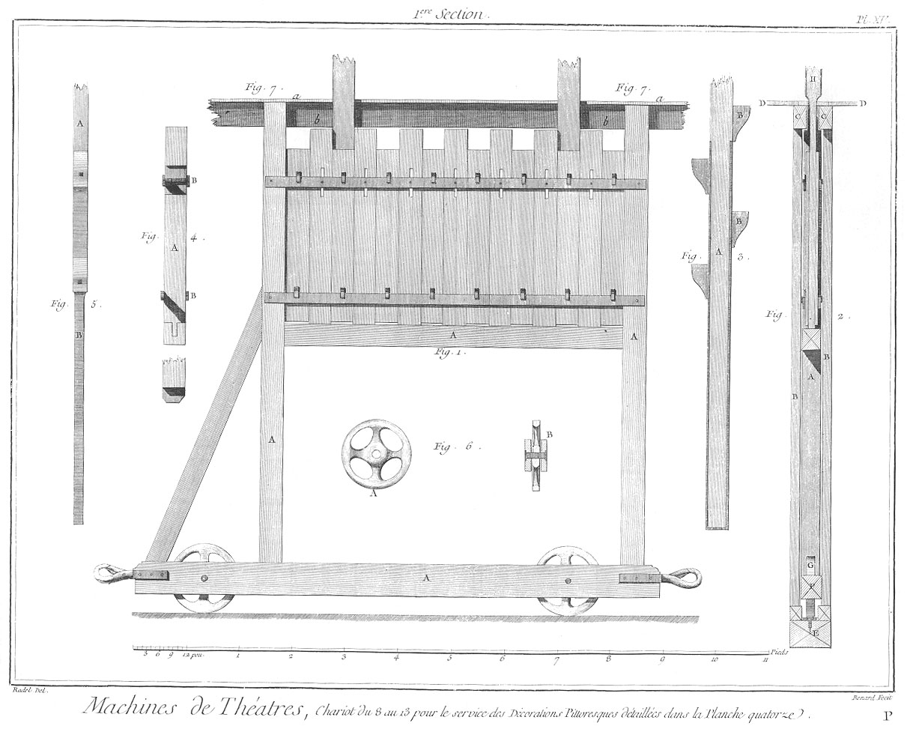](Planche_15.jpeg)

Cette Planche représente les chariots du 8 au 13, pour le même service des décorations pitoresques détaillées ci-devant dans la Planche XIV.

Fig.
1. Construction géométrale de ce chariot.
	- A, chariot.

2. Elévation géométrale en coupe du chariot avec sa ferme.
	- A, coupe du chariot.
	- B, montant des fermes assemblées dans les plate-formes, & portant les sablieres du plancher du théâtre.
	- C, sabliere du théâtre.
	- D, plancher du théâtre.
	- E, plate-forme.
	- F, patin du chariot.
	- G, roulette du chariot.
	- H, battant de l'échelle de perroquet construite dans le chariot.

3. Elévation géométrale du poteau servant d'échelle de perroquet.
	- A, poteau.
	- B, taquet boulonné sur le poteau.

4. Elévation géométrale des montans des chariots, faisant séparation des échelles de perroquets.
	- A, potelets.
	- B, plate-bande servant de conduit aux poteaux montant des écartemens pour les poteaux d'échelle.

5. Elévation géométrale & latérale des montans d'échelle avec leur plate bande de fer.
	- A, poteau d'échelle.
	- B, plate-bande de fer servant à renforcer le poteau.

6. Elévation des roulettes servant au chariot.
	- A, roulette.
	- B, coupe de roulettes boulonnées dans le poteau.

7. 
	- a, plancher du théâtre posé sur les sablieres.
	- b, sablieres.

PLANCHE XVI.
------------

[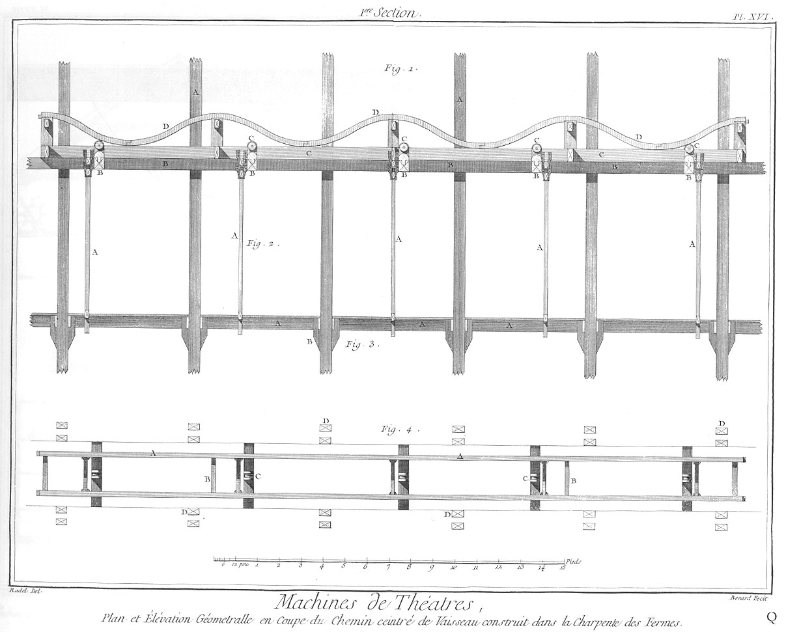](Planche_16.jpeg)

Cette Planche représente les chemins de vaisseaux.

Fig.
1. Elévation géométrale en coupe du chemin de vaisseau construit dans la charpente des fermes.
	- A, montant des fermes.
	- B, entretoises tenant les écartemens des fermes.
	- C, sablieres sur lesquelles sont assemblées les courbes, faisant le chemin ceintré.
	- D, courbe.

2.
	- A, bâtis servant d'ame pour monter la construction du chemin.
	- B, mouffle dans lequel passent les cordages des ames montant le chemin.
	- C, poulie des mouffles sur laquelle passe le cordage.

3.
	- A, petite entretoise tenant l'écartement des fermes.
	- B, chantignole boulonnée dans le poteau dans lequel s'assemblent les entretoises.

4. Plan du chemin ceintré.
	- A, sabliere.
	- B, entretoises tenant l'écartement des sablieres.
	- C, mouffle dans laquelle passent les cordages pour aller s'envelopper sur le tambour.
	- D, montant des fermes.

PLANCHE XVII.
-------------

[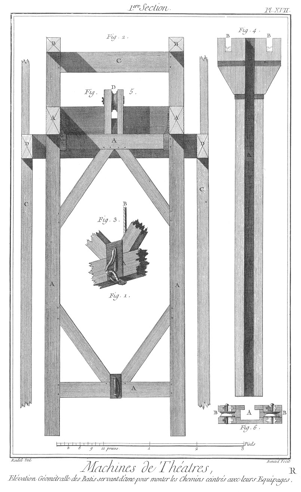](Planche_17.jpeg)

Fig.
1. Elévation géométrale des bâtis servant d'ame pour monter le chemin ceintré avec leurs équipages.
	- A, bâtis servant d'ame pour monter la construction.

2. Coupe en élévation du chemin ceintré.
	- A, sabliere sur laquelle sont assemblées les courbes.
	- B, courbes ceintrées.
	- C, entretoises tenant l'écartement du chemin.
	- D, poulie sur laquelle passe le cordage de communication au tambour.

3. Porte-mousqueton dans lequel est passé le cordage de communication au tambour.
	- A, porte-mousqueton dans lequel est accroché le cordage de communication au tambour.
	- B, cordage.
	- C, montans des fermes.
	- D, coupe des sablieres.

4. Elévation géométrale d'une cassette servant à porter les ames pour les décorations.
	- A, cassette.
	- B, place des poulies sur lesquelles roulent les cordages.

5.
	- A, plan des cassettes avec leurs poulies & boulons.
	- B, poulies sur lesquelles roulent les cordages. 

PLANCHE XVIII.
--------------

[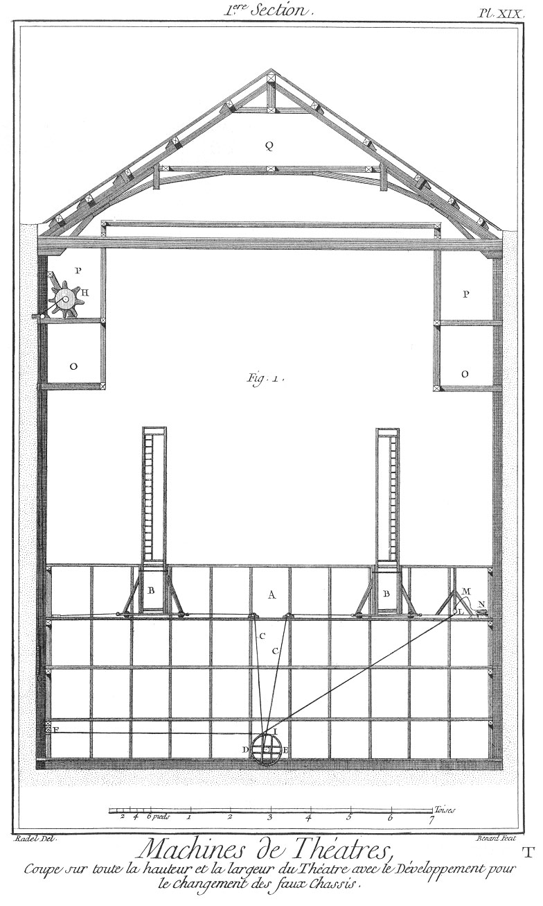](Planche_18.jpeg)

Coupe & élévation sur la face de la levée des trappes avec la manivelle des leviers & engrenage des rouleaux pour l'échappement des trappes des grandes rues avec les rouleaux sur lesquels passent les cordages attachés aux trappes pour les ouvrir au besoin.

Fig.
1. Sabliere portant les trappes dans lesquelles est rajusté à feuillure un levier servant d'échappement aux trappes.

2. Levier boulonné dans la sabliere, recevant les trappes, le bout du côté de la levée portant sur le rouleau d'engrenage.

3. Manivelle servant de levier pour l'échappement du rouleau avec l'engrenage proportionné.

4. Rouleau où est ajuste une frette servant de lanterne pour l'engrenage des leviers servant aux échappemens des trappes.

5. Poteau portant les sablieres du théâtre, & crochet pour recevoir les cordages avec lesquels se tirent les trappes à leur échappement.

6. Rouleau sur lequel frotte le cordage des trappes.
	- A, sabliere assemblée à chapeau sur les montans portant le plancher du théâtre.
	- B, poteau des fermes.
	- C, sabliere portant l'étrier dans lequel roule le rouleau pour le frottement des cordages des trappes.
	- D, rouleau sur lequel passe le cordage des trappes.

7. 
	- A, coupe & élévation de face des rouleaux des engrenages avec les ferrures nécessaires.
	- B, trappes du théâtre.
	- C, bâtis servant d'échappement aux trappes.
	- D, engrenages du levier & du rouleau pour son echappement.
	- E, tourillon & écrou servant d'axe pour l'échappement d'engrenage.
	- F, sabliere portant les trappes, & recevant le rouleau d'échappement.
	- G, coupe de face du rouleau, sur lequel passe l'arcade de la retraite des trappes.

PLANCHE XIX.
------------

[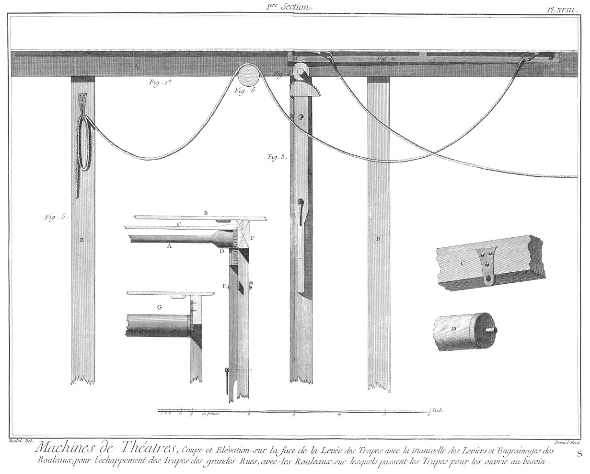](Planche_19.jpeg)

Coupe sur toute la hauteur & largeur du théâtre, avec le développement pour le changement des faux-chassis.

Fig.
1. Représentant le dessus du théâtre avec les mouvemens du dessous équippé pour le changement.
	- A, dessous du théâtre.
	- B, chariots portant les chassis sur lesquels se chargent les décorations en général.
	- C, cordage accroché au porte-mousqueton du patin du chariot, renvoyé sur le tambour D.
	- D, tambour assemblé du changement des décorations depuis le n°. 1 jusqu'au 13.
	- E, gros tambour de retraite sur lequel est arrêté un cordage passant dans la poulie F, renvoyée dans le contrepoids G du treuil H.
	- F, poulie boulonnée dans la ferme de côte.
	- G, contrepoids où le cordage F est arrêté.
	- H, treuil servant à monter le contrepoids aux hauteurs nécessaires.
	- I, retraite de manoeuvre arrêtée à contresens sur le gros tambour E, arrêté sur le rouleau L, en retraite sur le crochet M, dont sa longueur D nécessaire est ployée à la place N.
	- L, rouleau.
	- M, crochet de retraite.
	- N, cordage ployé.
	- O, corridor où est la main-d'oeuvre des retraites du ceintre.
	- P, second corridor où sont posés les treuils des contrepoids.
	- Q, ferme de charpente du comble.

PLANCHE XX.
-----------

[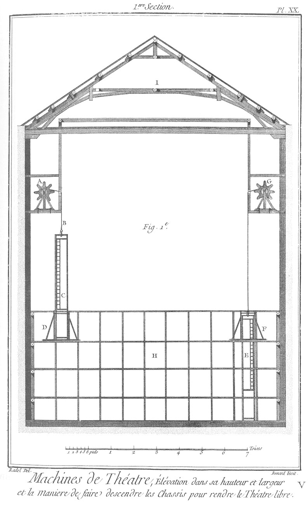](Planche_20.jpeg)

Fig.
1. Elévation dans sa hauteur & largeur, & la maniere de faire descendre dans le dessous les chassis pour rendre le théâtre libre.
	- A, petit tambour portatif sur les corridors de retraite du ceintre où est un cordage enveloppé avec un porte-mousqueton, lequel s'accroche dans une boucle à la tête du chassis, & se précipite comme dans la figure.
	- B, cordage.
	- C, chassis portant les décorations.
	- D, chariot où passent les chassis.
	- E, chassis descendu dans le dessous.
	- F, chariot du chassis.
	- G, tambour qui a descendu le chassis.
	- H, charpente des fermes du dessous du théâtre.
	- I, fermes du comble.

PLANCHE XXI.
------------

[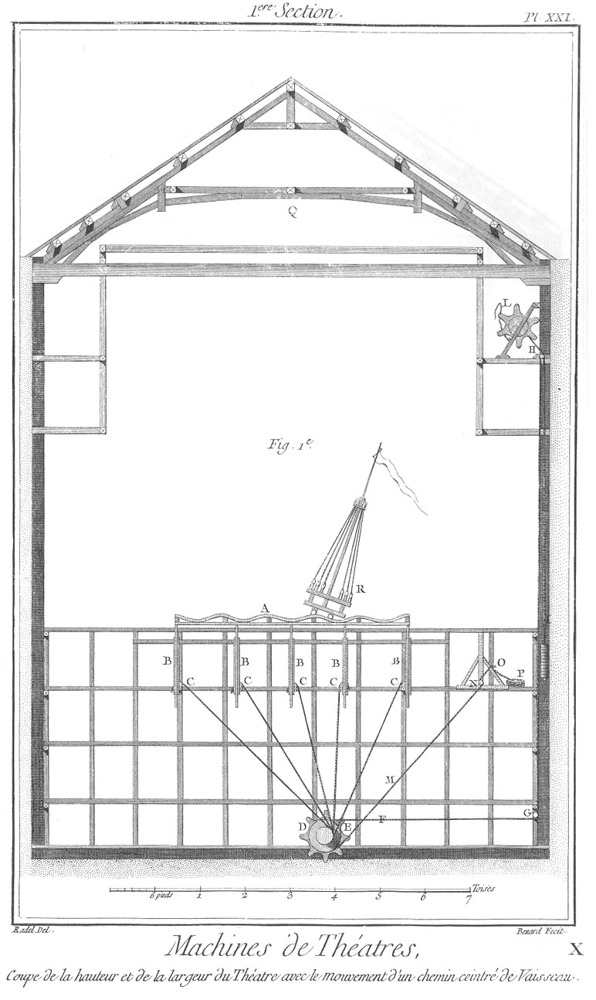](Planche_21.jpeg)

Coupe de la hauteur & largeur du théâtre avec le mouvement d'un chemin ceintré de vaisseau.

Fig.
1.
	- A, chemin ceintré du vaisseau.
	- B, cassettes où passent les ames portant le bâtis.
	- C, cordages des ames passant dans les moufles arrêtées sur le tambour D.
	- D, tambour.
	- E, gros tambour où est arrêté le cordage F passant sur la poulie G & sur la poulie H, venant s'arrêter sur le contrepoids I.
	- F, cordage passant sur la poulie G.
	- G, poulie.
	- H, moufle du contrepoids.
	- I, contrepoids du treuil.
	- L, treuil arrêtant sur le corridor, servant à monter les contrepoids aux hauteurs nécessaires.
	- M, retraite arrêtée sur le gros tambour E à contresens du cordage F, enveloppé autour du rouleau de force.
	- N, rouleau de force.
	- O, crochet de retraite.
	- P, cordage ployé.
	- Q, fermes du comble.
	- R, chariot sur lequel s'accroche la devanture du vaisseau.

PLANCHE XXII.
-------------

[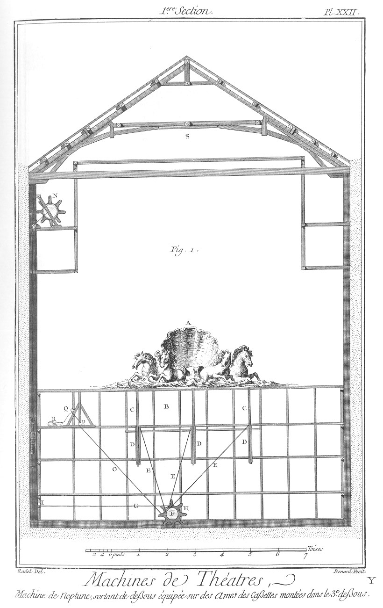](Planche_22.jpeg)

Hauteur & largeur du théâtre.

Fig.
1.
	- A, machine de Neptune sortant de dessous, équipée sur des ames sortant des cassettes équipées dans le troisieme dessous.
	- B, dessous du théâtre.
	- C, ame sortant des cassettes.
	- D, cassette.
	- E, cordages des ames allant s'envelopper sur le tambour F.
	- F, tambour.
	- G, cordage arrêté au contrepoids & sur le gros tambour H, passant à la moufle I.
	- I, moufle communiquant à la moufle L, venant s'arrêter sur le contrepoids M.
	- N, treuil servant à monter le contrepoids M aux hauteurs nécessaires.
	- O, cordage servant de retraite, arrêté sur le gros tambour H, à contresens du cordage G, enveloppé sur le rouleau de force P, en retraite sur le crochet Q.
	- R, cordage ployé au besoin.
	- S, fermes du comble.

PLANCHE XXIII.
--------------

[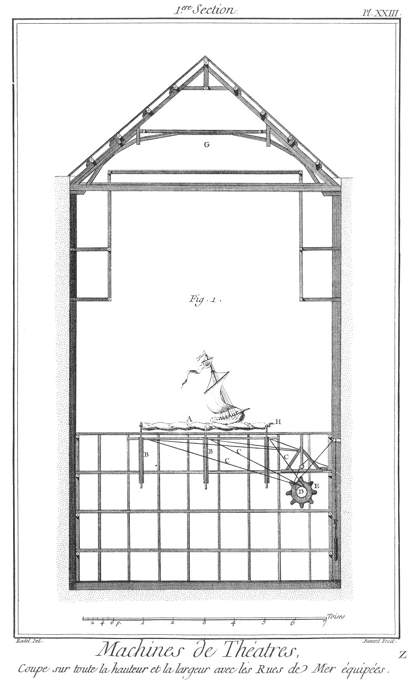](Planche_23.jpeg)

Coupe sur toute la hauteur & largeur, avec les rues de mer équipées.
	- A, colonne de mer.
	- B, cassette portant les ames sur lesquelles la colonne de mer est équipée.
	- C, cordages des ames venant s'envelopper sur le tambour D.
	- E, gros tambour de retraite.
	- F, contrepoids du tambour E.
	- G, fermes du comble.
	- H, manivelle pour tourner les colonnes de mer.

PLANCHE XXIV.
-------------

[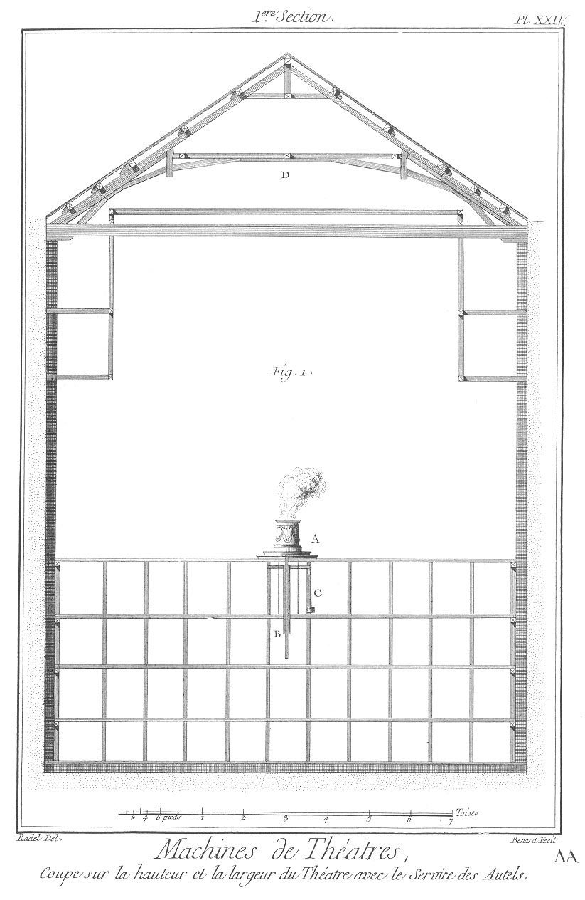](Planche_24.jpeg)

Coupe sur la hauteur & largeur.

Fig.
1. Cette figure représente le service des autels.
	- A,  autels sortant de dessous.
	- B, cassette sur laquelle est arrêté l'autel.
	- C, allége de manoeuvre pour l'autel D, fermes du comble.

PLANCHE XXV.
------------

[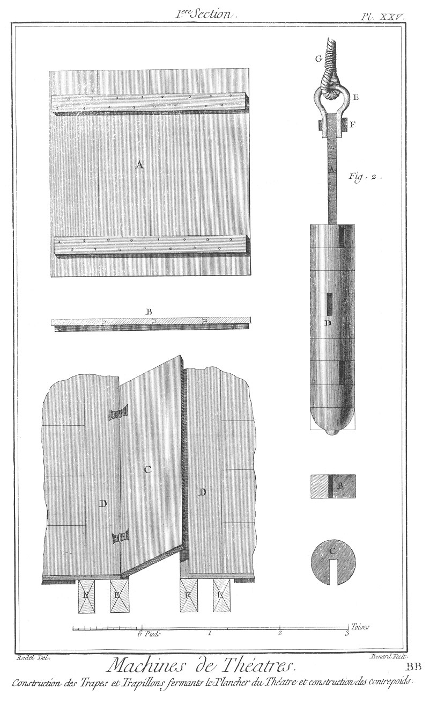](Planche_25.jpeg)

Construction des trappes & trapillons fermant le plancher du théâtre.

Fig.
1.
	- A, plan des trappes barrées servant de plancher au théâtre.
	- B, coupe de la trappe A.
	- C, grand trapillon fermant le passage des décorations de dessous.
	- D, petit trapillon fermant le passage des faux-chassis portant les décorations.
	- E, coupe de sabliere portant le plancher du théâtre assemblé à chapeau dans le montant des fermes.

2. Construction des contrepoids.
	- A, tige portant les pains ; chaque pain pese depuis 100 jusqu'à 150: on en met plus ou moins pour faire mouvoir les décorations.
	- B, coupe du pain.
	- C, plan du pain.
	- D, contrepoids chargé.
	- E, poignée de la tige dans laquelle passe une clavette F, qui s'ôte au besoin, pour passer les boucles du cordage G.

PLANCHE XXVI.
-------------

[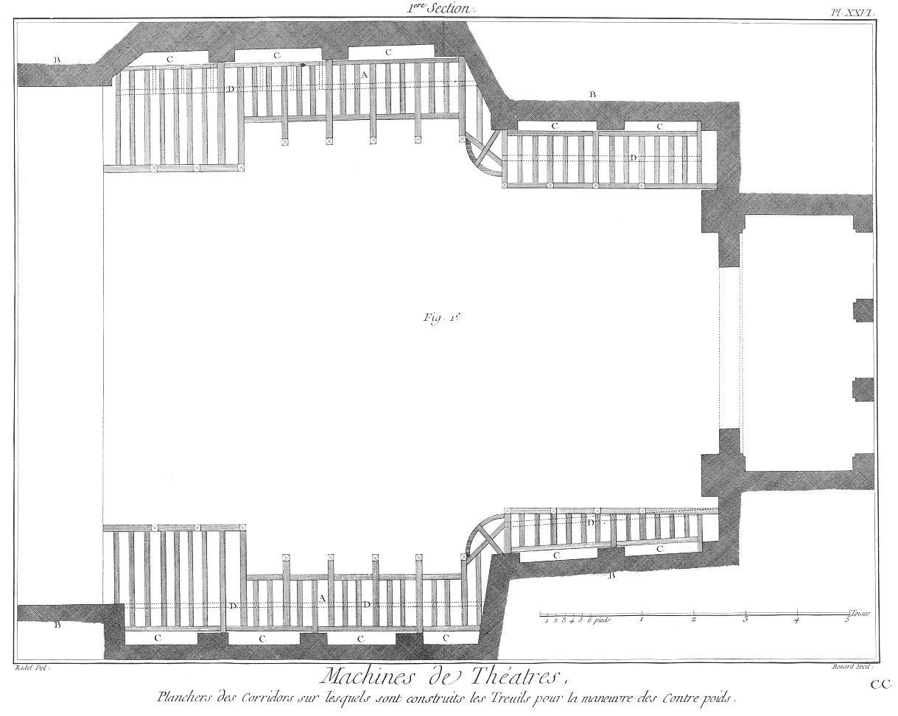](Planche_26.jpeg)

Epure de la charpente des corridors.
	- A, planchers des corridors, sur lesquels sont construits les treuils pour la manoeuvre des contrepoids.
	- B, contour des murs de la salle.
	- C, cheminée des contrepoids.
	- D, plate-formes dans lesquelles sont assemblées les jumelles des treuils pour les contrepoids.

PLANCHE XXVII.
--------------

[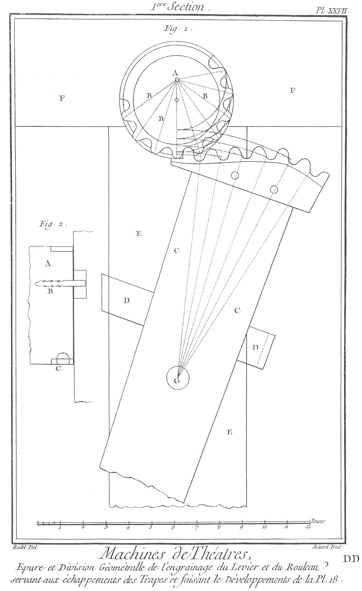](Planche_27.jpeg)

Développement de la Planche XVIII.

Fig.
1. Epure & division géométrale de l'engrenage du levier & du rouleau servant aux échappemens des trappes.
	- A, axe éloigné d'un pouce de centre, servant à rapporter l'épaisseur des trappes pour leur donner passage sous la levée.
	- B, division rapportée sur le milieu des fuseaux, & reporté ensuite par lignes ponctuées sur le chapiteau du levier.
	- C, levier sur lequel est ajusté le chapiteau d'engrenage dentelé & adjacent à la lanterne.
	- D, arrêt du levier sur le poteau des fermes E.
	- E, montant servant à soutenir les sablieres du plancher du théâtre.
	- F, sablieres portant le plancher du théâtre, & recevant le centre du boulon G, du rouleau d'engrenage d'échappement.

2. Coupe géométrale du rouleau d'engrenage.
	- A, rouleau.
	- B, goujeon de fer servant d'essieu au rouleau.
	- C, frette servant de lanterne au rouleau. 

[->](../02-Seconde_Section/Légende.md)
