MACHINES DE THÉATRE - SECONDE SECTION
=====================================

Contenant vingt-deux Planches doubles équivalentes à quarante-quatre Planches simples. 

PLANCHE Iere.
-------------

[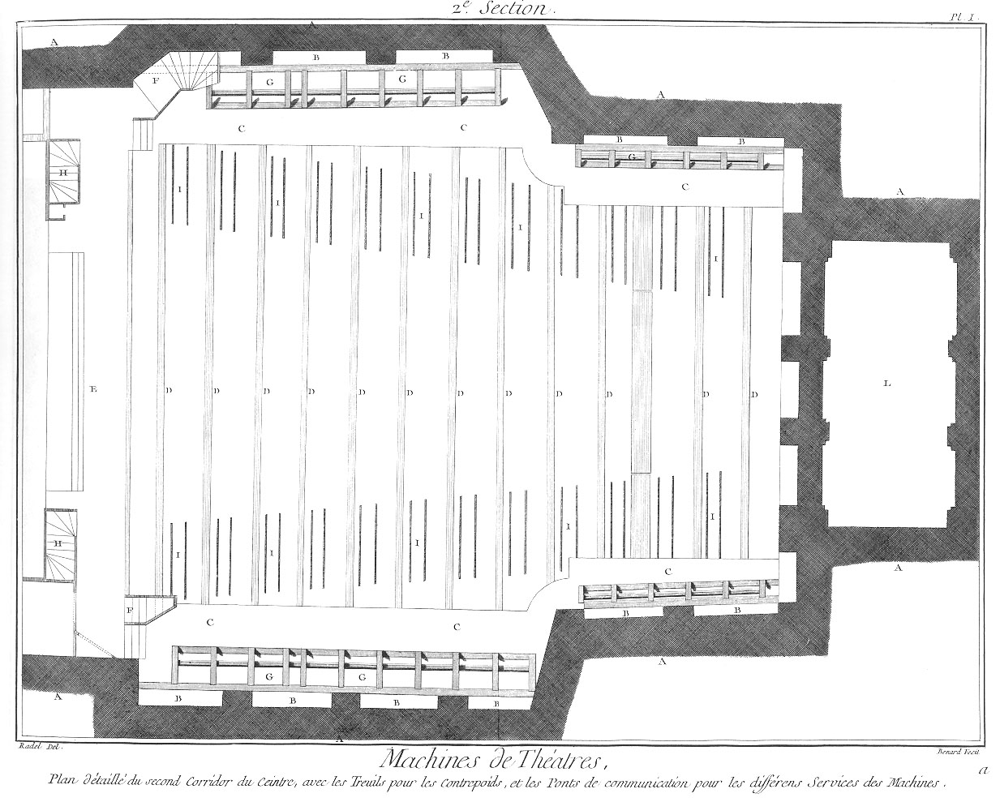](Planche_01.jpeg)

Fig.
1. Représentant le plan détaillé du second corridor du ceintre, avec les treuils pour les contrepoids nécessaires aux machines du ceintre & les ponts pour la communication d'un corridor à l'autre.
	- A, A, murs en mâçonnerie faisant le contour de la salle.
	- B, B, cheminées ou entre-deux de pié droits montant de fonds, servant pour le passage des contrepoids.
	- C, C, planchers des corridors sur lesquels sont posées les charpentes pour les treuils servant à monter des contrepoids.
	- D, D, ponts de service passant d'un corridor à l'autre, pour la manoeuvre des changemens de décorations.
	- E, plancher d'avant-scene appellé ceintre.
	- F, F, escaliers du ceintre descendant aux corridors de service.
	- G, G, charpentes des treuils.
	- H, H, escaliers montant au grand ceintre, ou plancher couvrant la salle.
	- I, I, plans des coulisses du théâtre.
	- L, magasin aux décorations, servant à serrer les décorations qui sont hors de service.

PLANCHE II.
-----------

[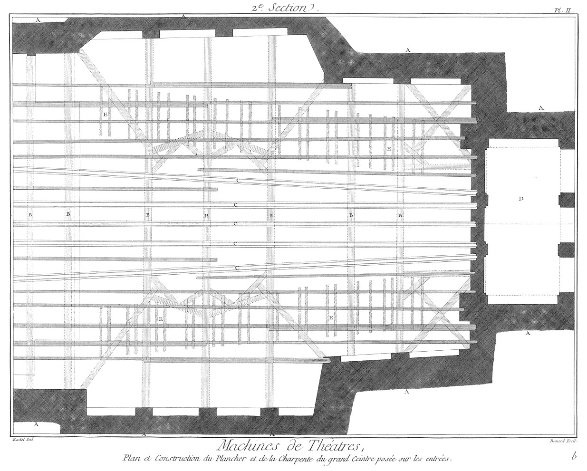](Planche_02.jpeg)

Fig.
1. Plan & construction du plancher & de la charpente  du grand ceintre posée sur les entraits.
	- A, A, mur en mâçonnerie faisant le contour de la salle.
	- B, B, entrait d'assemblage du grand comble, sur lesquels sont posés les planchers des machines du ceintre.
	- C, C, plate-formes dans lesquelles sont assemblés les montans servant d'étriers pour porter les ponts des communications des planchers, auxquels sont boulonnés les mantonnets servant de supports ou conduits pour les machines du vol de face.
	- D, magasin aux décorations.
	- E, à-plomb des coulisses du théâtre.

PLANCHE III.
------------

[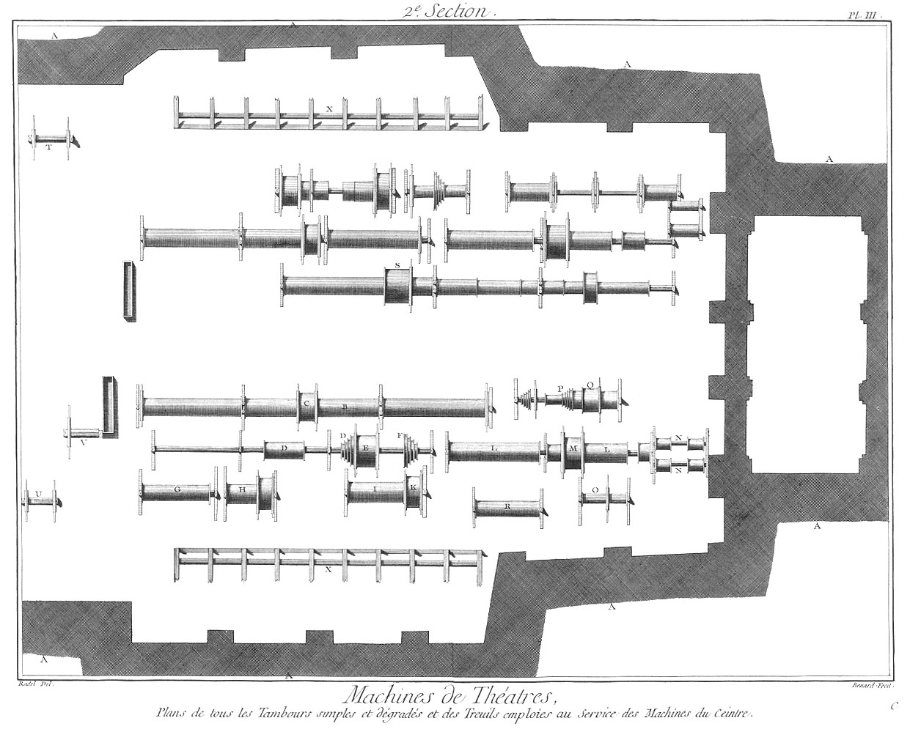](Planche_03.jpeg)

Fig.
1. Plans de tous les tambours & tambours dégradés, & des treuils, pour tous les services des machines du ceintre.
	- A, A, murs de mâçonnerie faisant le contour de la salle.
	- B, tambour servant à plusieurs planchers de gloire, sur lequel s'enveloppent les fils portant les planchers.
	- C, tambour de renflement sur lequel sont arrêtés les cordages de contrepoids & les retraites des manoeuvres pour le service des machines.
	- D, D, tambours servant à la dégradation des vapeurs ou petits nuages qui occupent une décoration quelconque à la descente d'un dieu ou d'une déesse.
	- E, tambour sur lequel sont employés les cordages des contrepoids & les retraites des manoeuvres pour faire marcher les machines.
	- F, tambour dégradé sur lequel sont enveloppés les fils de différentes longueurs, descendant à différentes hauteurs pour les réglemens des décorations.
	- G, tambour pour la manoeuvre des rideaux d'avant-scene.
	- H, tambour pour les machines de travers.
	- I, tambour pour les machines d'à-plomb.
	- K, tambour sur lequel sont employés les cordages de contrepoids, & les retraites de manoeuvre pour faire aller les machines.
	- L, tambour pour les rideaux & les horisons.
	- M, tambour de renflement sur lequel sont employés les cordages de contrepoids, & les retraites de manoeuvre pour faire aller les machines.
	- N, N, tambours des horisons au lointain.
	- O, treuils pour monter les contrepoids.
	- P, tambour de dégradation pour les fermes de vapeurs.
	- Q, tambour de renflement, sur lequel sont employés les cordages de contrepoids, & les retraites de manoeuvre pour faire aller les machines.
	- R, tambour pour les machines de travers.
	- S, tambour pour le même service.
	- T, treuil pour les contrepoids du ceintre.
	- V, treuil pour les contrepoids des machines de face.
	- U, autre treuil pour le même service.
	- X, à-plomb des treuils du corridor du ceintre.

PLANCHE IV.
-----------

[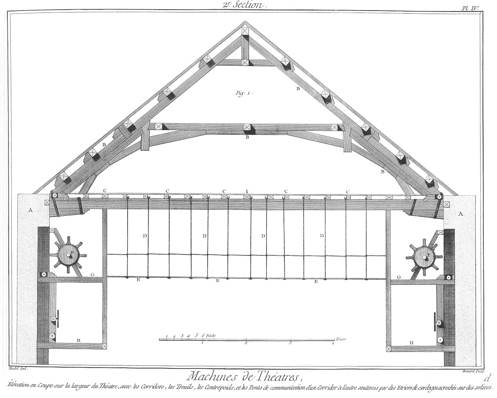](Planche_04.jpeg)

Fig.
1. Elévation en coupe sur la largeur du théâtre avec les corridors, les treuils pour les contrepoids, nécessaires aux machines avec les ponts de communication d'un corridor à l'autre, soutenus par des étriers de cordages accrochés sur les solives.
	- A, A, élévation du mur portant les fermes du comble.
	- B, B, fermes de la charpente du comble.
	- C, C, C, solives du plancher sur lesquelles sont attachés des crochets à ressort pour recevoir les étriers de cordages portant les ponts de communication d'un corridor à l'autre.
	- D, D, étrier de cordage portant les ponts.
	- E, E, ponts de communication.
	- F, F, treuils pour monter les contrepoids.
	- G, G, corridors pour la manoeuvre des treuils.
	- H, H, corridors pour la manoeuvre des machines.
	- I, plancher sur lequel sont tous les tambours du ceintre de la Planche III.

PLANCHE V.
----------

[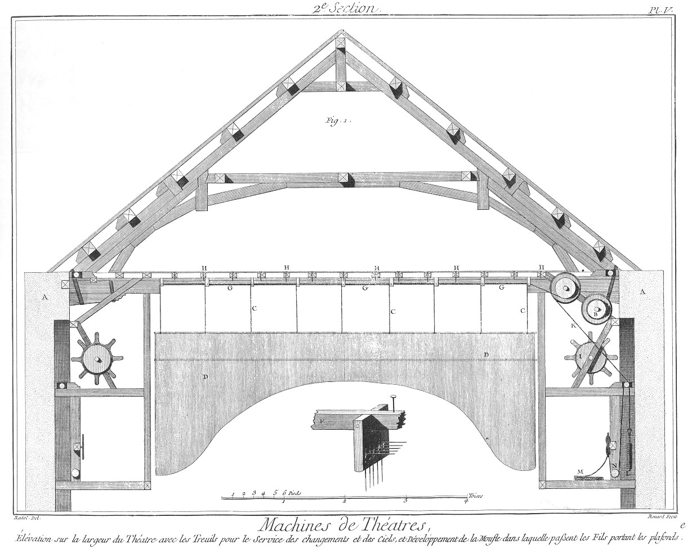](Planche_05.jpeg)

Fig. 1. Elévation en coupe sur la largeur du théâtre avec les corridors & les treuils nécessaires aux machines, & les développemens des ciels pour le service des changemens.
	- A, A, élévation du mur portant les fermes du comble.
	- B, tambour sur lequel s'enveloppent les fils passant dans les moufles d'à-plomb, auxquels sont attachés les plafonds quelconques, ciel ou décoration.
	- C, C, C, cordages auxquels est attaché le plafond.
	- D, plafond ou ciel.
	- E, moufle détaillée avec les poulies, dans lesquelles passe le fil portant le plafond : cette moufle est boulonnée sur la solive.
	- F, solive qui repose dessus les entraits.
	- G, G, entraits.
	- H, H, solives sur lesquelles sont boulonnées les moufles.
	- I, treuils pour le contrepoids.
	- K, cordage arrêté au contrepoids & au tambour B, pour enlever & baisser les plafonds.
	- L, contrepoids pour enlever les plafonds.
	- M, retraite du contrepoids ployée sur les corridors.
	- N, rouleau de charpente sur lequel passent les retraites de manoeuvre.

PLANCHE VI.
-----------

[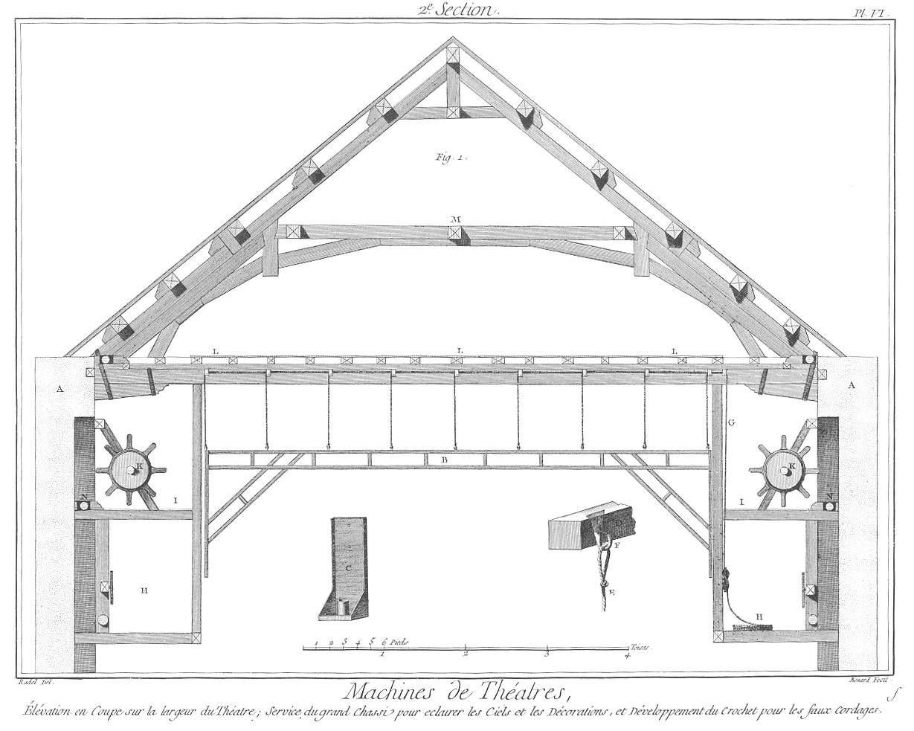](Planche_06.jpeg)

Fig.
1. Elévation en coupe sur la largeur du théâtre avec les corridors, les treuils pour les contrepoids nécessaires aux machines avec les ponts de communication d'un corridor à l'autre, soutenus par des étriers de cordage accrochés sur les solives.
	- A, A, élévation du mur portant les fermes du comble.
	- B, rampe ou chassis de bois sur lequel sont attachées des plaques de tôle dans lesquelles on met des bougies pour éclairer les plafonds & ciel des décorations.
	- C, plaque de tôle attachée sur le chassis.
	- D, solive sur laquelle sont arrêtés des crochets  à ressort, dans lesquels sont passés des faux cordages tenant le chassis B. Faux-cordage est un fil ou cordage qui contient les décorations à la hauteur où elles ont été réglées.
	- E, faux-cordage.
	- F, crochet dans lequel passe le faux-cordage.
	- G, poignée de cordages servant à monter & descendre, suivant le besoin de la lumiere.
	- H, H, corridors de manoeuvre.
	- I, I, corridors des contrepoids pour les machines.
	- K, K, treuils pour monter les contrepoids.
	- L, plancher des machines du ceintre.
	- M, grand ceintre ou second plancher des machines.
	- N, N, moufles pour le passage des cordages de contrepoids.

PLANCHE VII.
------------

[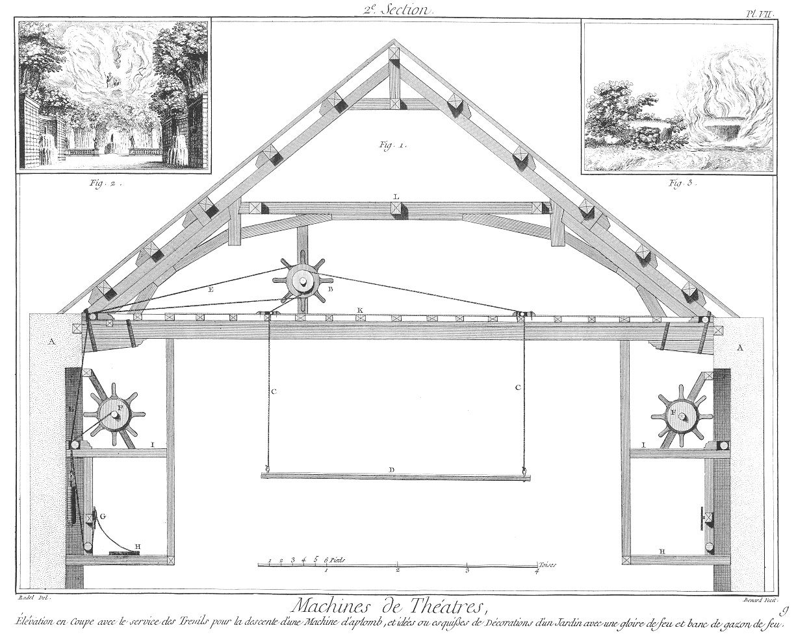](Planche_07.jpeg)

Fig.
1. Elévation en coupe sur la largeur du théâtre, avec les corridors, les treuils pour les contrepoids nécessaires aux machines, avec les ponts de communication d'un corridor à l'autre, soutenus par des étriers de cordages accrochés sur les solives.
	- A, A, élévation du mur portant les fermes du comble.
	- B, tambour sur lequel sont enveloppés des fils ou cordages portant un plancher pour une machine d'à-plomb.
	- C, C, fils portant le plancher des machines d'à-plomb.
	- D, plancher sur lequel descendent les acteurs.
	- E, E, retraites ou cordages enveloppés sur le gros tambour pour la manoeuvre des machines.
	- F, F, treuils sur lesquels sont les contrepoids pour enlever la machine.
	- G, retraite du contrepoids pour descendre & monter la machine.
	- H, H, corridors des manoeuvres pour le service des machines.
	- I, I, corridors des contrepoids.
	- K, plancher des machines.
	- L, plancher du grand ceintre.

2. Décoration d'un jardin avec une gloire de feu pour la descente de Junon.

3. Banc de gazon & de feu servant dans les décorations.

PLANCHE VIII.
-------------

[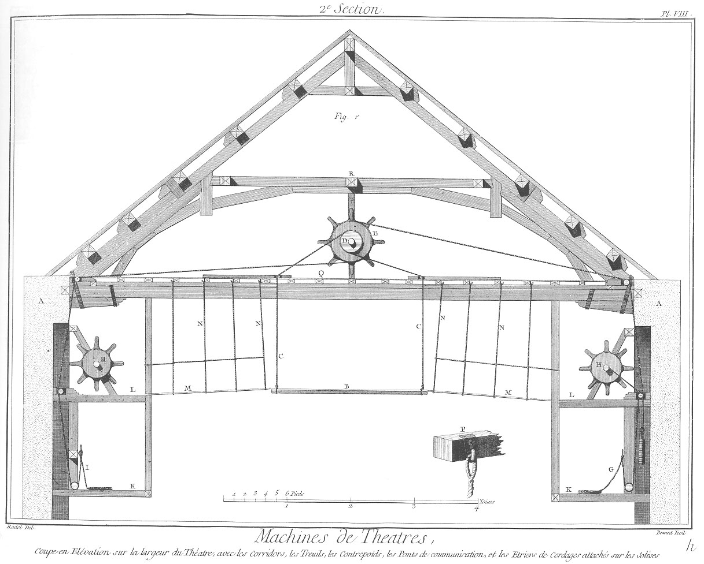](Planche_08.jpeg)

Fig.
1. Coupe en élévation sur la largeur du théâtre, avec les corridors, les treuils pour les contrepoids nécessaires aux machines, avec les ponts de communication d'un corridor à l'autre, soutenus pa des étriers de cordages accrochés sur les solive.
	- A, A, élévation du mur portant les fermes du comble.
	- B, plancher d'une machine d'à-plomb.
	- C, C, cordages, fils portant le plancher de la machine enveloppée dessus le tambour D.
	- E, tambour de renflement sur lequel sont employés les cordages des contrepoids & les retraites de manoeuvre pour faire aller les machines.
	- F, cordage du tambour tenant au contrepoids.
	- G, retraite du contrepoids pour faire descendre & monter la machine.
	- H, H, treuils servant à monter le contrepoids.
	- I, retraite du tambour pour descendre la machine.
	- K, K, corridors de manoeuvre pour le service de la machine.
	- L, L, corridors des treuils pour monter les contrepoids.
	- M, M, petits ponts pour aller dans la machine d'à-plomb.
	- N, N, cordages servant d'étriers pour soutenir les ponts.
	- O, O, O, solives sur lesquelles sont attachés les crochets pour recevoir les étriers de cordages.
	- P, développement du crochet attaché à chaque solive pour contenir les étriers de cordages.
	- Q, plancher du grand ceintre sur lequel sont les tambours pour les machines.
	- R, second plancher du grand ceintre pour le service des machines.

PLANCHE IX.
-----------

[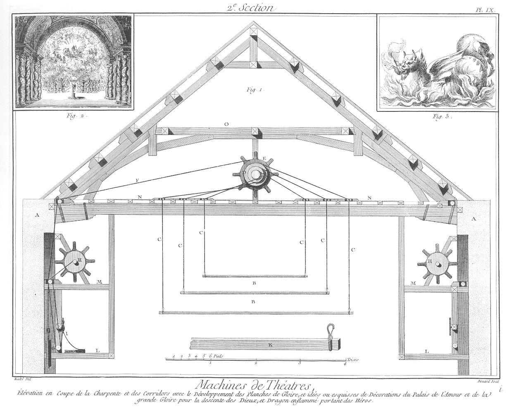](Planche_09.jpeg)

Fig.
1. Elévation en coupe sur la largeur du théâtre de la charpente & des corridors, avec un développement des planchers de gloire.
	- A, A, élévation du mur portant les fermes du comble.
	- B, B, dégradation de trois planchers de gloire.
	- C, C, fils soutenant les planchers de gloire enveloppés sur le tambour dégradé.
	- D, tambour dégradé sur lequel sont enveloppés les fils des trois planchers de descente de gloire.
	- E, tambour de renflement sur lequel sont employés les cordages de contrepoids & les retraites de manoeuvre pour faire aller les machines.
	- F, cordage servant de retraite du tambour aux contrepoids.
	- G, contrepoids pour enlever les machines.
	- H, H, treuil du contrepoids.
	- I, retraite du contrepoids pour faire descendre & monter les machines.
	- K, traverse des planchers de gloire, à laquelle sont attachés les porte-mousquetons pour accrocher les cordages du tambour.
	- L, L, planchers du corridor pour le service des machines.
	- M, M, planchers du corridor pour le service des contrepoids.
	- N, plancher sur lequel sont posés les tambours des machines.
	- O, second plancher des machines.

Fig.
2. Décoration du palais de l'Amour avec la grande gloire pour la descente des dieux.

3. Dragon enflammé portant des héros servant dans lesdites décorations.

PLANCHE X.
----------

[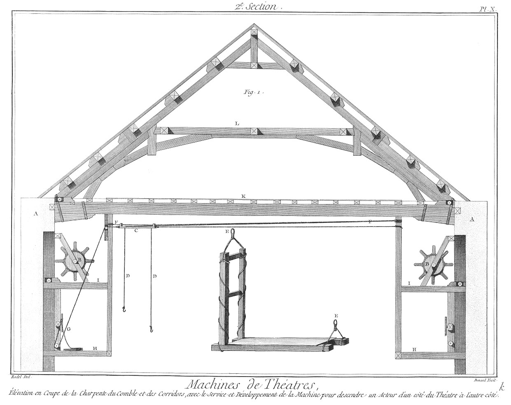](Planche_10.jpeg)

Fig.
1. Elévation en coupe de la charpente du comble & des corridors, avec le développement d'une machine de travers.
	- A, A, élévation du mur portant les fermes du comble.
	- B, B, treuils des contrepoids.
	- C, chariot servant de char, dans lequel passent des fils auxquels on attache la chaise sur laquelle on descend un acteur d'un côté à l'autre du théâtre.
	- D, D, fils portant la chaise, accrochés aux porte-mousquetons E, E.
	- F, F, cordages traversant d'un corridor à l'autre, sur lesquels passe le char.
	- G, retraite du char pour descendre la machine.
	- H, H, corridors pour le service des machines.
	- I, I, corridors des contrepoids.
	- K, plancher du ceintre où sont les tambours à machines.
	- L, second plancher des tambours à machines.

PLANCHE XI.
-----------

[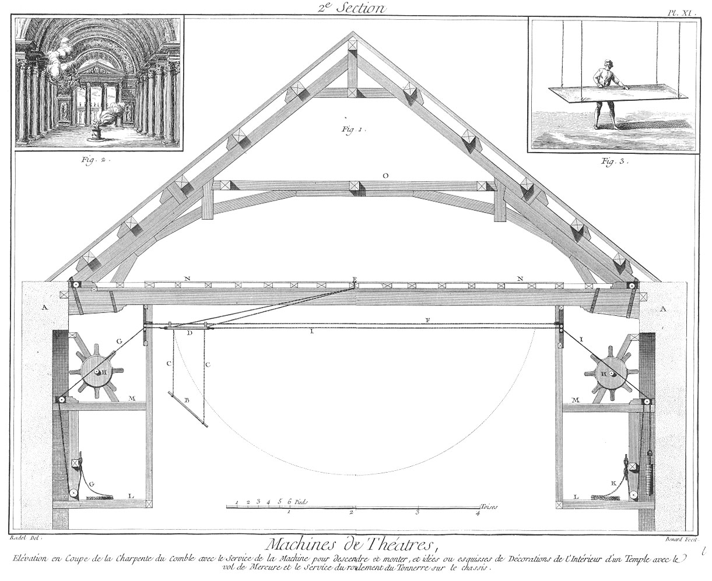](Planche_11.jpeg)

Fig.
1. Elévation en coupe de la charpente du comble & des corridors avec le développement d'une machine de travers.
	- A, A, élévation du mur portant les fermes du comble.
	- B, machine de travers descendant & montant.
	- C, C, fils de la machine passant dans le char D, allant s'arrêter sur la solive du milieu de l'entrait.
	- E, solive sur laquelle sont arrêtés les fils de la machine.
	- F, cordages traversant d'un corridor à l'autre, servant de chemin pour le char.
	- G, retraite du char pour le faire descendre & monter.
	- H, H, treuils du contrepoids pour enlever la machine.
	- I, cordage du contrepoids arrêté au char pour faire aller la machine.
	- K, retraite du contrepoids pour enlever la machine.
	- L, L, planchers du corridor pour le service des machines.
	- M, M, corridors des treuils pour le service des contrepoids.
	- N, plancher des tambours des machines.
	- O, second plancher des tambours des machines.

2. Intérieur d'un temple avec le vol de Mercure.

3. Ouvrier faisant le roulement du tonnerre sur le chassis.

PLANCHE XII.
------------

[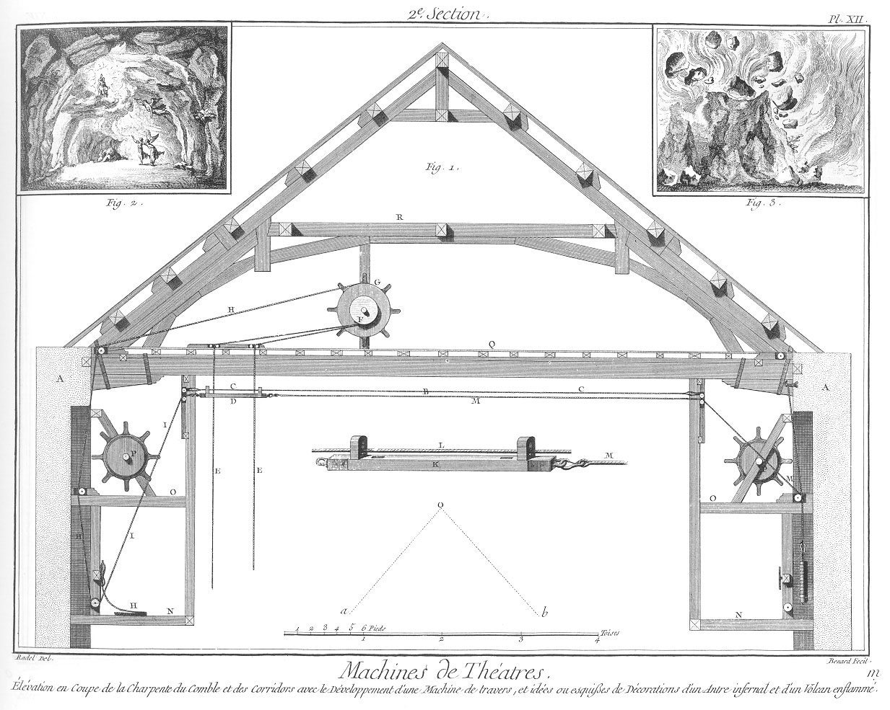](Planche_12.jpeg)

Fig.
1. Elévation en coupe de la charpente du comble & des corridors, avec le développement d'une machine de travers.
	- A, A, élévation du mur portant les fermes du comble.
	- B, développement d'une machine faisant le vol de la machine montant d'un côté & descendant de l'autre.
	- a, o, b est la révolution de la machine.
	- C, cordage traversant le travers du théâtre d'un corridor à l'autre, servant de conduit aux chars.
	- D, char dans lequel passent les fils qui portent la machine.
	- E, E, fils portant la machine, qui sont enveloppés sous le tambour F.
	- G, tambour de renflement sur lequel est enveloppé un cordage H, servant de retraite à la main pour lâcher la machine.
	- I, retraite pour lâcher le char.
	- K, développement du char D.
	- L, cordage servant de conduit au char.
	- M, retraite du char servant aux contrepoids.
	- N, N, corridors pour le service des machines.
	- O, O, corridors où sont posés les treuils pour les contrepoids.
	- P, P, treuils servant à monter les contrepoids.
	- Q, plancher du ceintre où sont les machines.
	- R, second plancher des tambours des machines. 

Fig.
2. Décoration de l'intérieur d'un antre avec l'apparition de Jupiter commandant aux esprits infernaux.

3. Extérieur d'un volcan avec flammes & rochers précipités.

PLANCHE XIII.
-------------

[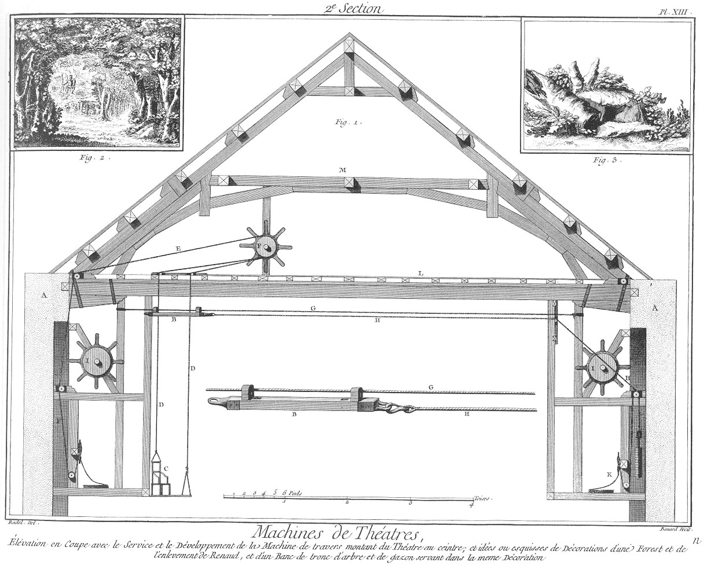](Planche_13.jpeg)

Fig.
1. Elévation en coupe de la charpente du comble & des corridors avec le développement d'une machine de travers, montant du théâtre au ceintre.
	- A, A, élévation du mur portant les fermes du comble.
	- B, développement d'une machine traversant le théâtre.
	- C, chaise servant à asseoir l'acteur.
	- D, D, fils portant la machine.
	- E, tambour sur lequel sont enveloppés les fils de la machine.
	- F, retraite du tambour des fils.
	- G, cordage tendu d'un corridor à l'autre, servant de conduit au char.
	- H, retraite du char tenant au contrepoids.
	- I, I, treuils servant à monter les contrepoids.
	- K, retraite du contrepoids pour monter la machine.
	- L, plancher des tambours du ceintre.
	- M, second plancher du tambour des machines.

2. Décoration d'une forêt avec l'enlevement de Renaud dans Armide.

3. Banc de troncs d'arbres & gazons servant dans les-dites décorations.

PLANCHE XIV.
------------

[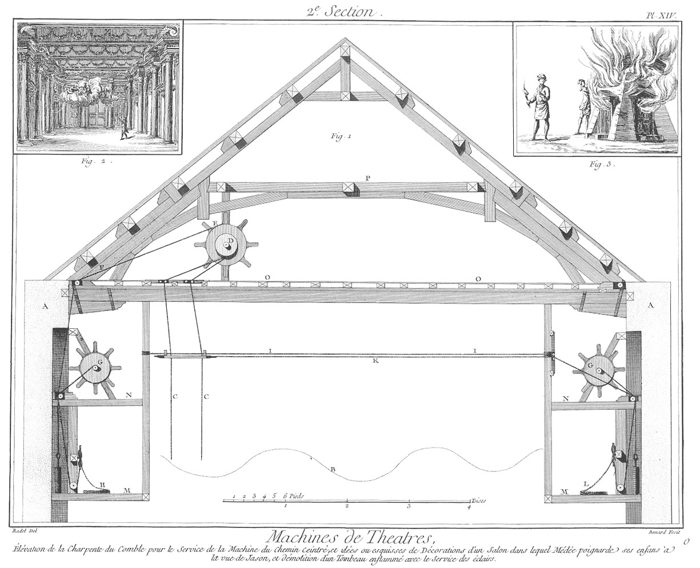](Planche_14.jpeg)

Fig.
1. Elévation en coupe de la charpente du comble & des corridors, avec le développement d'une machine de travers.
	- A, A, élévation du mur portant les fermes du comble.
	- B, développement d'une machine de travers, faisant un chemin ceintré.
	- C, C, fils de la machine.
	- D, tambour sur lequel sont enveloppés les fils de la machine.
	- E, tambour de renflement pour la retraite à la main.
	- F, cordage du tambour tenant au contrepoids.
	- G, G, treuils servant à monter les contrepoids nécessaires pour cette machine.
	- H, retraite du contrepoids pour gouverner le chemin ceintré B.
	- I, cordage tendu d'un corridor à l'autre pour conduire le char pour diverses révolutions.
	- K, retraite du char attaché au contrepoids.
	- L, retraite du contrepoids pour faire marcher la machine.
	- M, M, planchers du corridor pour le service des machines.
	- N, N, plancher du corridor pour les treuils des contrepoids.
	- O, plancher sur lequel sont posés les tambours des machines.
	- P, second plancher du ceintre pour les machines.

2. Décoration d'un sallon avec Médée poignardant ses enfans à la vue de Jason.

3. Tombeau démoli & enflammé avec un ouvrier faisant tomber les morceaux de démolition avec un bâton, &c un autre ouvrier jettant sur un flambeau de l'arcanson pour former les éclairs.

PLANCHE XV.
-----------

[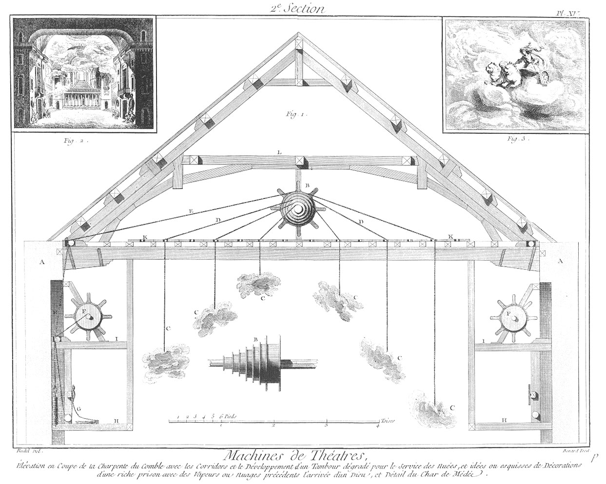](Planche_15.jpeg)

Fig.
1. Elévation en coupe de la charpente du comble avec les corridors & le développement d'un tambour dégradé.
	- A, A, élévation du mur portant les fermes du comble.
	- B, tambour dégradé sur lequel sont enveloppés des fils pour descendre des nuages ou nuées à différentes hauteurs.
	- C, C, C, nuées attachées aux fils ou cordages.
	- D, D, fils enveloppés sur le tambour dégradé.
	- E, retraite du tambour tenant au contrepoids.
	- F, F, treuils servant à monter les contrepoids.
	- G, retraite du contrepoids pour manoeuvrer le tambour.
	- H, H, planchers du corridor pour le service des machines.
	- I, I, planchers du corridor des treuils pour le service des contrepoids.
	- K, plancher du grand ceintre où sont les tambours des machines.
	- L, second plancher du ceintre.

2. Décoration d'une riche prison avec des vapeurs ou nuages précédant l'arrivée d'un dieu.

3. Détail du char de Médée.

PLANCHE XVI.
------------

[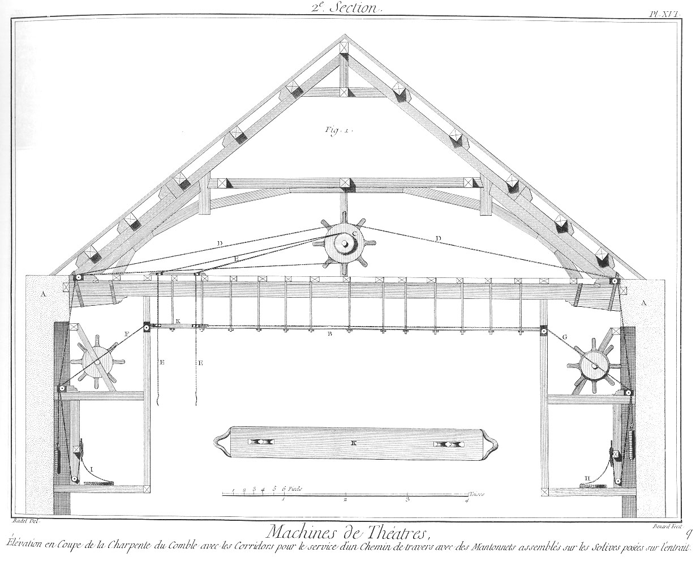](Planche_16.jpeg)

Fig.
1. Elévation en coupe de la charpente du comble avec les corridors & le développement d'un tambour dégradé.
	- A, A, élévation d'un mur portant les fermes du comble.
	- B, coupe d'un chemin de travers avec des mantonnets assemblés sur les solives, reposant sur l'entrait.
	- C, tambour des fils.
	- D, D, retraites du gros tambour tenant au contrepoids.
	- E, E, fils du petit tambour pour la machine.
	- F, retraite du char au contrepoids.
	- G, retraite du tambour au contrepoids.
	- H, retraite du contrepoids.
	- I, retraite du tambour.
	- K, char dans lequel passent les fils de la machine.

PLANCHE XVII.
-------------

[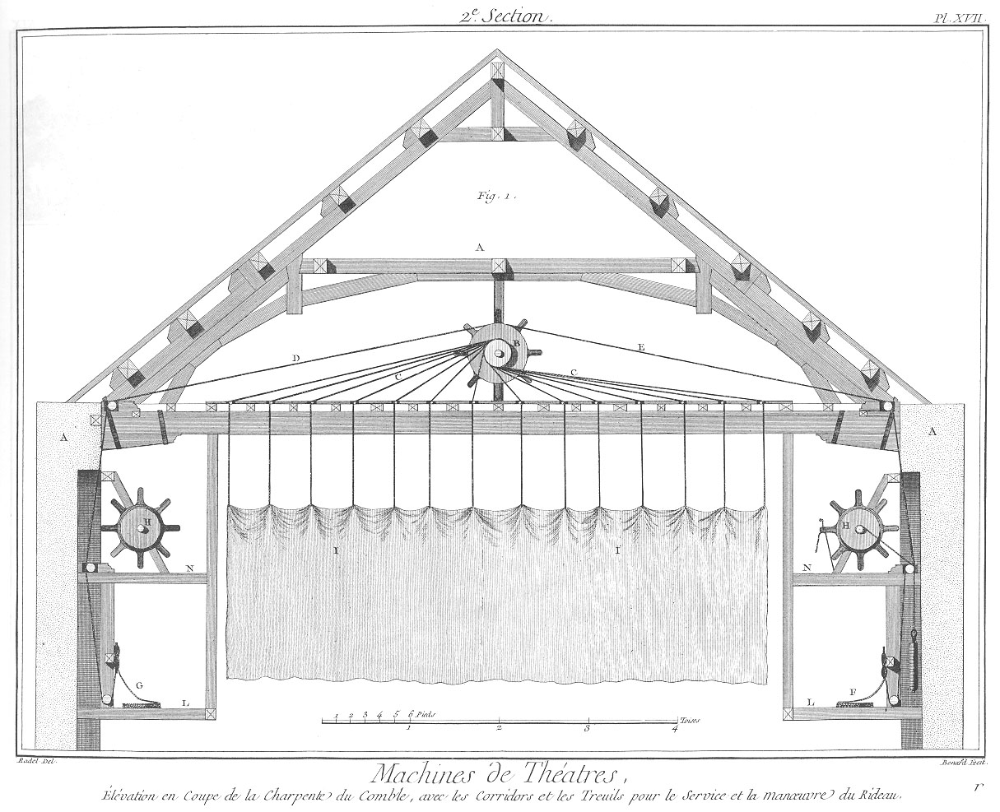](Planche_17.jpeg)

Fig.
1. Elévation en coupe de la charpente du comble avec les corridors & un développement de tambour pour la manoeuvre des rideaux.
	- A, A, élévation d'un mur portant les fermes du comble.
	- B, tambour où sont employés les fils du rideau.
	- C, C, fils qui enlevent le rideau.
	- D, retraite du tambour pour lâcher le rideau.
	- E, retraite du tambour ou contrepoids pour enlever le rideau.
	- F, retraite du contrepoids.
	- G, retraite du tambour.
	- H, H, treuils servant à monter les contrepoids.
	- I, rideau troussé enlevé à sa hauteur.
	- K, second plancher du ceintre.
	- L, L, corridors pour le service des machines.
	- N, N, corridors où sont les treuils pour le service du contrepoids.

PLANCHE XVIII.
--------------

[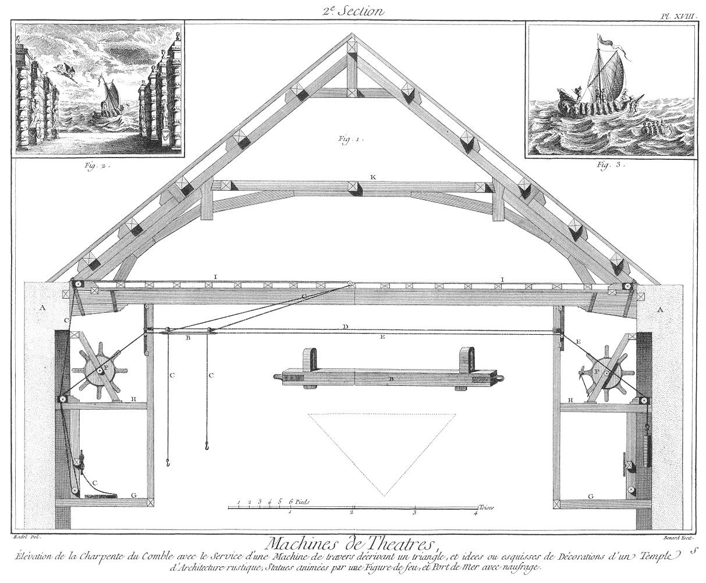](Planche_18.jpeg)

Fig.
1. Elévation en coupe de la charpente du comble, & une machine de travers pour aller de côté à volonté, pour décrire un triangle.
	- A, A, élévation des murs portant les fermes du comble.
	- B, développement d'une machine de travers pour aller à volonté.
	- C, C, fils de la machine de travers.
	- D, chemin du char.
	- E, retraite du char au contrepoids.
	- F, F, treuils servant à monter les contrepoids.
	- G, G, planchers des corridors pour le service des machines.
	- H, H, planchers des corridors où sont les treuils pour les contrepoids.
	- I, plancher du grand ceintre sur lequel sont les tambours pour les machines.
	- K, second plancher du ceintre.
	- L, triangle projetté.

2. Décoration rustique d'architecture avec figure de feu animant des statues, & port de mer avec naufrage.

3. Grande & petite barques de théâtre.

PLANCHE XIX.
------------

Fig.
1. Elévation en coupe de la charpente du comble avec les corridors & treuils, & un développement de montagne descendant du ceintre ou sortant du dessous.
	- A, A, élévation du mur portant les fermes du comble.
	- B, tambour dégradé sur lequel sont enveloppés les fils de trois planchers en zede, faisant la révolution de la montagne.
	- C, C, fils de communication portant le plancher.
	- D, plancher formant la montagne.
	- E, retraite du tambour au contrepoids.
	- F, retraite du contrepoids.
	- G, G, treuils pour monter les contrepoids.
	- H, corridor de service pour les machines.
	- I, corridor sur lequel sont posés les treuils pour monter les contrepoids pour l'emploi des machines.
	- K, plancher du grand ceintre sur lequel sont posés tous les tambours pour la manoeuvre usitée.
	- L, second plancher du grand ceintre servant de magasin.

2. Décoration d'un désert où se trouve une montagne composée de roche pour la destruction de Jupiter par les géans.

3. Détail d'une fontaine dans les rochers, avec son moulinet pour la faire mouvoir.

PLANCHE XX.
-----------

[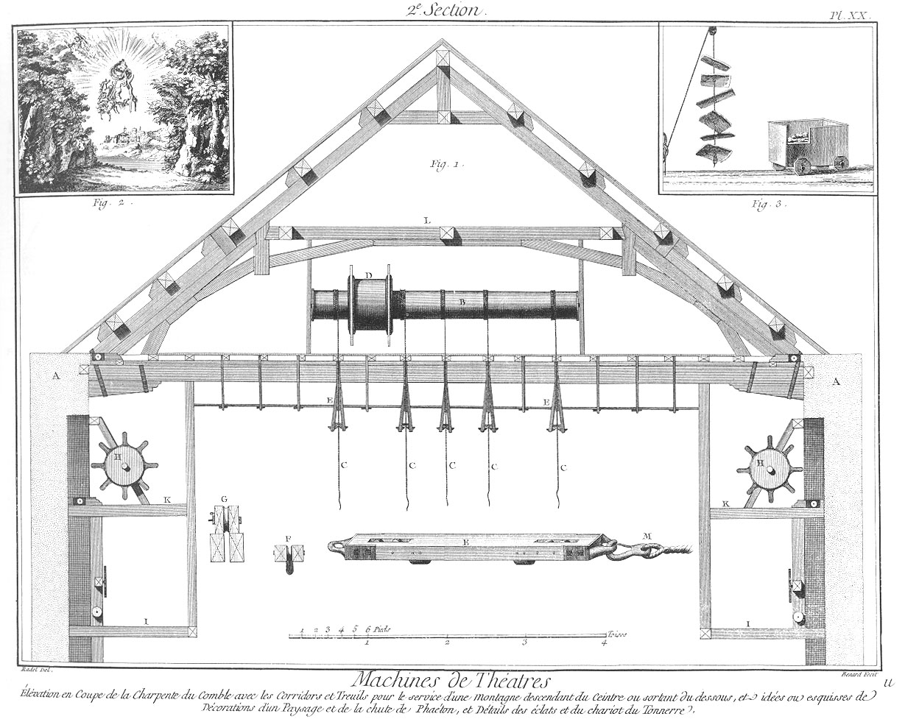](Planche_20.jpeg)

Fig.
1. Elévation en coupe de la charpente en travers des fermes, & corridor avec un développement de machine de face, nécessaire pour faire venir les décorations du lointain à l'avant scene.
	- A, A, élévation d'un mur portant les fermes du comble.
	- B, tambour sur lequel sont enveloppés les fils portant les décorations & passant dans les chars.
	- C, C, fils du tambour passant dans les chars.
	- D, tambour de retraites à la main de communication au contrepoids.
	- E, E, chariots ou chars coulant dans les chemins, par lesquels passent les fils C, C.
	- F, coupe de travers du char avec la poulie & le conduit.
	- G, élévation en coupe d'une moufle arrêtée  sur la solive des entraits, dans lequel passe le fil du tambour.
	- H, H, treuils pour monter les contrepoids.
	- I, I, corridors pour le service de la machine.
	- K, K, planchers des corridors des treuils pour monter les contrepoids.
	- L, second planchet du grand ceintre.
	- M, retraite avec un porte mousqueton accroché au char pour faire ses révolutions.

2. Paysage avec la chûte de Phaëton.

3. Représentant les éclats du tonnerre qui se font avec des feuilles de tôle & douves de tonneau que l'on laisse tomber sur le plancher du ceintre, & le chariot du tonnerre composé de feuilles de tôle & de pierres dans une caisse, portant sur quatre roulettes à huit pans, que l'on fait rouler sur le plancher du ceintre.

PLANCHE XXI.
------------

[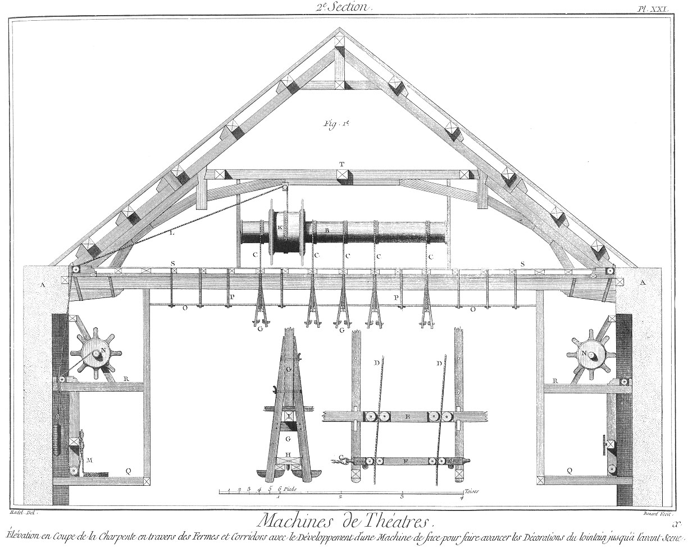](Planche_21.jpeg)

Fig.
1. Elévation en coupe de la charpente en-travers des fermes & corridors avec un développement de machine de face, nécessaire pour faire venir les décorations du lointain à l'avant-scene.
	- A, A, élévation d'un mur portant les fermes du comble.
	- B, tambour sur lequel sont enveloppés les fils, menant les chars.
	- C, C, fils accrochés au char.
	- D, D, fils passant dans les moufles du chemin de face.
	- E, coupe sur la longueur de la moufle où passent les fils portant les machines.
	- F, char dans lequel passent les fils pour faire avancer & reculer les machines.
	- G, coupe de face des mantonnets soutenant des conduits pour le chemin.
	- H, char allant & venant sur ses coulisses.
	- I, moufle en coupe dans laquelle passent les fils.
	- K, tambour de renflement pour la retraite, servant à monter & descendre les machines.
	- L, retraite du tambour du contrepoids pour faire descendre la machine.
	- M, retraite du contrepoids pour faire monter la machine.
	- N, N, treuils servant à monter les contrepoids servant à faire aller la machine.
	- O, O, ponts de communication d'un corridor à l'autre pour le service des machines P, P, étriers de bois attachés sur les solives portant les ponts.
	- Q, Q, corridors pour le service des machines.
	- R, R, corridors des treuils pour les contrepoids.
	- S, plancher du grand ceintre sur lequel sont les tambours des machines T, second plancher du grand ceintre.

PLANCHE XXII.
-------------

[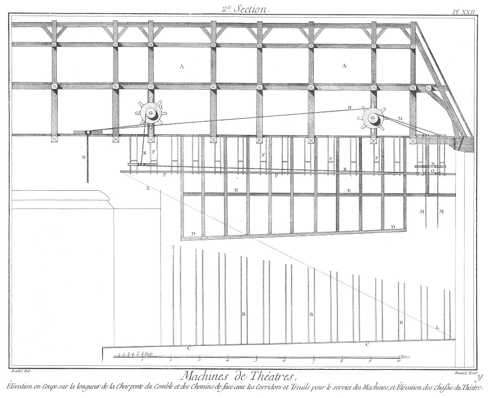](Planche_22.jpeg)

Elévation en coupe sur la longueur de la charpente du comble & des chemins de face avec les corridors, & l'élévation des chassis du théâtre avec les tambours nécessaires pour le développement des chemins de face.
	- A, A, coupe de la charpente du comble sur la longueur.
	- B, B, élévation des chassis portant les décorations du théâtre.
	- C, plancher du théâtre.
	- D, coupe du premier corridor du ceintre servant à manoeuvrer les retraites des machines.
	- E, second corridor du ceintre où sont les treuils pour monter les contrepoids.
	- F, F, mantonnets en bois portant les conduits pour le char servant à faire aller & venir les machines de face.
	- G, G, tambours servant au développement des fils pour monter & descendre les machines de face.
	- H, retraite de communication des tambours manoeuvrant dessus le ceintre.
	- I, tambour de renflement sur lequel est enveloppée la retraite de communication aux contrepoids.
	- K, retraite accrochée au char, servant à le faire aller & venir. Cette retraite est arrêtée sur le tambour G, à la longueur que l'on veut faire venir la machine, de même que le cordage de communication du tambour de renflement I est arrêté sur le contrepoids, à la hauteur que le renflement du tambour lui permet de descendre, suivant la hauteur que les machines ont à monter de face du fond du théâtre au-dessus de l'avant-scene.
	- L, L, chemin que font ordinairement les machines de face.
	- M, M, fils portant la machine passant à-travers des chars & des moufles arrêtées sur les chemins passant au plancher du ceintre pour s'envelopper sur le tambour G.
	- N, moufle dans laquelle passent les fils qui sont arrêtés sur les mantonnets qui portent le chemin.
	- O, char servant à faire aller les machines.
	- P, P, conduits sur lesquels coule le char & dans lequel passent les fils.

[->](../../10-Tireur_et_Fileur_d'Or/Légende.md)
